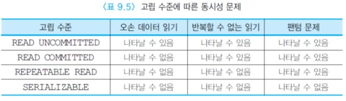

# PL/SQL의 트랜잭션

PL/SQL에서 하나의 트랜잭션은 데이터베이스를 일관성 있게 갱신하는 한 개 이상의 데이터 조작어 또는 한 개의 데이터 정의어 또는 한 개의 데이터 제어어로 구성된다.


:large_blue_circle: 트랜잭션의 시작과 끝

오라클에서 한 트랜잭션은 암시적으로 끝나거나 명시적으로 끝날 수 있다.  
한 트랜잭션은 실행 가능한 첫 번째 SQL문이 실행될 때 시작되어 데이터 정의어를 만나거나, 데이터 제어어를 만나거나,  
COMMIT이나 ROLLBACK 없이 Oracle SQL Developer를 정상적으로 종료했을 때는 수행 중이던 트랜잭션을 암시적으로 완료한다.  
Oracle SQL Developer를 비정상적으로 종료하거나 시스템에 장애가 발생했을 경우에는 수행 중이던 트랜잭션을 암시적으로 철회한다.

사용자가 COMMIT, ROLLBACK, SAVEPOINT문을 사용하여 트랜잭션의 논리를 명시적으로 제어할 수 있다.  
COMMIT문은 현재의 트랜잭션이 수행한 한 개 이상의 데이터 조작어의 결과를 데이터베이스에 모두 반영하고 현재의 트랜잭션을 완료한다.  
ROLLBACK문은 현재의 트랜잭션이 수행한 한 개 이상의 데이터 조작어의 결과를 데이터베이스에서 모두 되돌리고 이 트랜잭션을 철회한다.  
SAVEPOINT문은 현재의 트랜잭션 내에 저장점을 표시하여 트랜잭션을 더 작은 부분으로 나눈다.  
두 번째 저장점을 이전의 저장점과 동일한 이름으로 생성하면 이전의 저장점이 삭제된다.  
ROLLBACK TO SAVEPOINT문을 사용하면 현재의 트랜잭션에서 지정된 저장점 이후에 갱신된 내용만 되돌린다.

아래 그림은 저장점과 ROLLBACK TO SAVEPOINT문의 관계를 보여준다.  
(4)번 INSERT문을 수행한 이후에 ROLLBACK TO SAVEPOINT B 명령을 수행하면 (4)번 INSERT문의 수행 결과가 되돌려지고, ROLLBACK TO SAVEPOINT A 명령을 수행하면 (1)번 DELETE문 이후에 수행한 모든 데이터 조작어들의 수행 결과가 되돌려진다.  
저장점을 명시하지 않은 ROLLBACK 명령을 수행하면 현재의 트랜잭션 전체가 철회된다.


COMMIT문을 수행하면 데이터의 변경 내용이 데이터베이스에 기록되므로 데이터의 이전 상태는 완전히 없어지고, 다른 사용자들이 이 트랜잭션의 결과를 볼 수 있으며, 이 트랜잭션에서 로크한 것이 해제되어 다른 사용자가 로크할 수 있으며, 모든 저장점이 삭제된다.

다음의 예는 두 개의 UPDATE문으로 이루어진 트랜잭션을 보여준다. COMMIT문을 사용하여 트랜잭션의 끝을 표시하였다.  
COMMIT문의 결과로 두 UPDATE문이 수정한 내용이 데이터베이스에 기록된다. 즉 데이터베이스에서 정미림 계좌의 값이 100000원 감소되고, 안명석 계좌의 값이 100000원 증가된다.  
만일 COMMIT 대신 ROLLBACK문을 사용하면 두 UPDATE문이 수정한 내용이 데이터베이스에 전혀 반영되지 않는다.


Oracle SQL Developer에서는 묵시적으로 한 트랜잭션이 데이터 정의어나 데이터 제어어 이전까지 입력한 여러 개의 데이터 조작어로 이루어진다.  
사용자가 각 데이터 조작어를 하나의 트랜잭션으로 취급하고 싶을 때는 데이터 조작어마다 COMMIT문을 입력해야 하므로 번거로울 수 있다.  
이런 경우에는 Oracle SQL Developer에서 아래와 같은 set 명령을 사용하여 각 데이터 조작어를 한 트랜잭션으로 처리할 수 있다.


```sql
set auto on;
	또는
set autocommit on:
```


한 테이블에서 어떤 조건을 만족하는 투플들만 삭제하고 싶은데 실수로 WHERE절을 생략하여 모든 투플들이 삭제되었을 때 ROLLBACK문이 유용하게 사용될 수 있다.  
예를 들어, EMPLOYEE 테이블에서 3번 부서에 근무하는 사원들만 삭제하고 싶은데 아래와 같이 WHERE절을 생략하면 EMPLOYEE 테이블의 모든 투플들의 삭제된다.  
삭제된 투플들을 되돌리기 위해서 ROLLBACK문을 수행한다.


```sql
SQL> DELETE FROM EMPLOYEE;
7 rows deleted.
SQL> ROLLBACK;
Rollback complete.
SQL> DELETE FROM EMPLOYEE WHERE DNO=3;
2 rows deleted.
```


:large_blue_circle: 트랜잭션의 속성

만일 트랜잭션이 데이터베이스를 읽기만 한다면 트랜잭션이 읽기 전용임을 명시하여 DBMS가 동시성의 정도를 높일 수 있다.  
이런 경우에는 트랜잭션을 시작하기 전에 아래와 같이 명시한다.


```sql
SET TRANSACTION READ ONLY;
SELECT 	AVG(SALARY)
FROM	EMPLOYEE
WHERE	DEPT='개발부';
```

만일 어떤 트랜잭션이 읽기 전용이라고 명시했으면 그 트랜잭션은 어떠한 갱신 작업도 수행할 수 없다.  
예를 들어, 아래와 같은 SQL문은 허용되지 않는다.


```sql
SET TRANSACTION READ ONLY;
UPDATE	EMPLOYEE
SET		SALARY = SALARY * 1.06;
```


트랜잭션의 디폴트는 읽기와 쓰기를 모두 수행하는 것이다.  
트랜잭션에 대해 SET TRANSACTION READ WRITE를 명시하면 SELECT, INSERT, DELETE, UPDATE문을 모두 수행할 수 있다.


```sql
SET TRANSACTION READ WRITE;
UPDATE	EMPLOYEE
SET		SALARY = SALARY * 1.06;
```


:large_blue_circle: 고립 수준

SQL2에서 사용자가 동시성의 정도를 몇 가지로 구분하여 명시할 수 있다.  
앞서 설명한 것처럼 2단계 로킹 프로토콜을 엄격하게 적용할 때 생성되는 직렬 가능한 스케줄은 한 트랜잭션씩 차례대로 수행한 결과와 동등하지만,  
트랜잭션들이 동시에 수행 될 수 있는 정도를 제한하기 때문에 성능 저하를 유발할 수 있다.

고립 수준은 한 트랜잭션이 다른 트랜잭션과 고립되어야 하는 정도를 나타낸다.  
고립 수준이 낮으면 동시성은 높아지지만 데이터의 정확성은 떨어진다. 반대로 고립 수준이 높으면 데이터가 정확해지지만 동시성이 저하된다.  
그러므로 응용의 성격에 따라 허용 가능한 고립 수준(데이터베이스의 정확성)을 선택함으로써 성능을 향상시킬 수 있다.  
응용에서 명시한 고립 수준에 따라 DBMS가 사용하는 로킹 동작이 달라진다.

상용 DBMS에서 제공하는 몇 가지 고립 수준은 아래와 같다. 한 트랜잭션에 대해 명시한 고립 수준에 따라 그 트랜잭션이 읽을 수 있는 데이터에만 차이가 있다.  
응용 프로그램에서는 SET TRANSACTION ISOLATION LEVEL을 사용하여 필요한 고립 수준을 명시한다.

- READ UNCOMMITTED

  가장 낮은 고립 수준이다. 트랜잭션 내의 질의들이 공유 로크를 걸지 않고 데이터를 읽는다.  
  따라서 오손 데이터를 읽을 수 있다. 갱신하려는 데이터에 대해서는 독점 로크를 걸고, 트랜잭션이 끝날 때까지 보유한다. 
  이 고립 수준을 명시하는 SQL문은 아래와 같다.

  ```sql
  SET	TRANSACTION READ WRITE
  	ISOLATION LEVEL READ UNCOMMITTED;
  ```

- READ COMMITTED

  트랜잭션 내의 질의들이 읽으려는 데이터에 대해서 공유 로크를 걸고, 읽기가 끝나자마자 로크를 해제한다.  
  따라서 동일한 데이터를 다시 읽기 위해 공유 로크를 다시 걸고 데이터를 읽으면, 이전에 읽은 값과 다른 값을 읽는 경우가 생길 수 있다.  
  갱신하려는 데이터에 대해서는 독점 로크를 걸고, 트랜잭션이 끝날 때 까지 보유한다.  
  예를 들어, 항공기 예약 트랜잭션에서 현재 빈 좌석을 찾을 수 없을 때 누가 좌석을 취소했는가를 계속 검색하기 위해서 이 고립 수준을 명시할 수 있다.  
  이 고립 수준은 오라클의 디폴트이다. 이 고립 수준을 명시하는 SQL문은 아래와 같다.

  ```sql
  SET	TRANSACTION READ WRITE
  	ISOLATION LEVEL READ COMMITTED;
  ```

- REPEATABLE READ

  질의에서 검색되는 데이터에 대해 공유 로크를 걸고, 트랜잭션이 끝날 때까지 보유한다.  
  한 트랜잭션 내에서 동일한 질의를 두 번 이상 수행할 때 매번 같은 값을 포함한 결과를 검색하게 된다.  
  갱신하려는 데이터에 대해서는 독점 로크를 걸고, 트랜잭션이 끝날 때까지 보유한다.  
  이 고립 수준을 명시하는 SQL문은 다음과 같다.

  ```sql
  SET	TRANSACTION READ WRITE
  	ISOLATION LEVEL REPEATABLE READ;
  ```

- SERIALIZABLE

  가장 높은 고립 수준이다. 질의에서 검색되는 투플들뿐만 아니라 인덱스에 대해서도 공유 로크를 걸고 트랜잭션이 끝날 때까지 보유한다.  
  갱신하고자 하는 데이터에 대해서는 독점 로크를 걸고 트랜잭션이 끝날 때까지 보유한다.  
  SERIALIZABLE은 SQL2의 디폴트 고립 수준이다. 이 고립 수준을 명시하는 SQL문은 아래와 같다.

  ```sql
  SET	TRANSACTION READ WRITE
  	ISOLATION LEVEL SERIALIZABLE
  ```


아래 표는 사용자가 트랜잭션에 대해 명시한 고립 수준에 따라 오손 데이터 읽기, 반복할 수 없는 읽기, 팬텀 문제가 나타날 수 있는가의 여부를 요약해서 보여준다.



