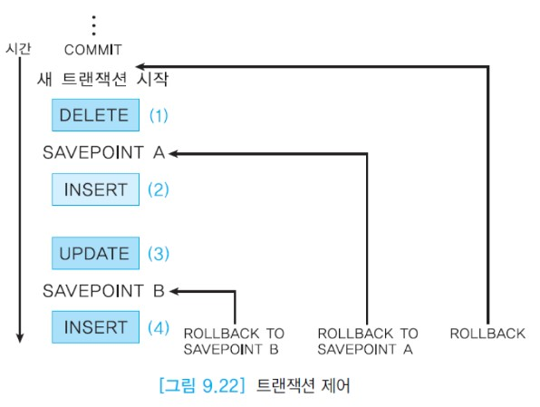

# PL/SQL의 트랜잭션

PL/SQL에서 하나의 트랜잭션은 데이터베이스를 일관성 있게 갱신하는 한 개 이상의 데이터 조작어 또는 한 개의 데이터 정의어 또는 한 개의 데이터 제어어로 구성된다.

:large_blue_circle: 트랜잭션의 시작과 끝

오라클에서 한 트랜잭션은 암시적으로 끝나거나 명시적으로 끝날 수 있다.  
한 트랜잭션은 실행 가능한 첫 번째 SQL문이 실행될 때 시작되어 데이터 정의어를 만나거나, 데이터 제어어를 만나거나,  
COMMIT이나 ROLLBACK 없이 Oracle SQL Developer를 정상적으로 종료했을 때는 수행 중이던 트랜잭션을 암시적으로 완료한다.  
Oracle SQL Developer를 비정상적으로 종료하거나 시스템에 장애가 발생했을 경우에는 수행 중이던 트랜잭션을 암시적으로 철회한다.

사용자가 COMMIT, ROLLBACK, SAVEPOINT문을 사용하여 트랜잭션의 논리를 명시적으로 제어할 수 있다.  
COMMIT문은 현재의 트랜잭션이 수행한 한 개 이상의 데이터 조작어의 결과를 데이터베이스에 모두 반영하고 현재의 트랜잭션을 완료한다.  
ROLLBACK문은 현재의 트랜잭션이 수행한 한 개 이상의 데이터 조작어의 결과를 데이터베이스에서 모두 되돌리고 이 트랜잭션을 철회한다.  
SAVEPOINT문은 현재의 트랜잭션 내에 저장점을 표시하여 트랜잭션을 더 작은 부분으로 나눈다.  
두 번째 저장점을 이전의 저장점과 동일한 이름으로 생성하면 이전의 저장점이 삭제된다.  
ROLLBACK TO SAVEPOINT문을 사용하면 현재의 트랜잭션에서 지정된 저장점 이후에 갱신된 내용만 되돌린다.

아래 그림은 저장점과 ROLLBACK TO SAVEPOINT문의 관계를 보여준다.  
(4)번 INSERT문을 수행한 이후에 ROLLBACK TO SAVEPOINT B 명령을 수행하면 (4)번 INSERT문의 수행 결과가 되돌려지고, ROLLBACK TO SAVEPOINT A 명령을 수행하면 (1)번 DELETE문 이후에 수행한 모든 데이터 조작어들의 수행 결과가 되돌려진다.  
저장점을 명시하지 않은 ROLLBACK 명령을 수행하면 현재의 트랜잭션 전체가 철회된다.

COMMIT문을 수행하면 데이터의 변경 내용이 데이터베이스에 기록되므로 데이터의 이전 상태는 완전히 없어지고, 다른 사용자들이 이 트랜잭션의 결과를 볼 수 있으며, 이 트랜잭션에서 로크한 것이 해제되어 다른 사용자가 로크할 수 있으며, 모든 저장점이 삭제된다.

다음의 예는 두 개의 UPDATE문으로 이루어진 트랜잭션을 보여준다. COMMIT문을 사용하여 트랜잭션의 끝을 표시하였다.  
COMMIT문의 결과로 두 UPDATE문이 수정한 내용이 데이터베이스에 기록된다. 즉 데이터베이스에서 정미림 계좌의 값이 100000원 감소되고, 안명석 계좌의 값이 100000원 증가된다.  
만일 COMMIT 대신 ROLLBACK문을 사용하면 두 UPDATE문이 수정한 내용이 데이터베이스에 전혀 반영되지 않는다.

Oracle SQL Developer에서는 묵시적으로 한 트랜잭션이 데이터 정의어나 데이터 제어어 이전까지 입력한 여러 개의 데이터 조작어로 이루어진다.  
사용자가 각 데이터 조작어를 하나의 트랜잭션으로 취급하고 싶을 때는 데이터 조작어마다 COMMIT문을 입력해야 하므로 번거로울 수 있다.  
이런 경우에는 Oracle SQL Developer에서 아래와 같은 set 명령을 사용하여 각 데이터 조작어를 한 트랜잭션으로 처리할 수 있다.
