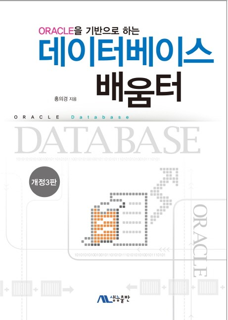

# ORACLE을 기반으로 하는 데이터베이스 배움터

### 데이터 베이스 시스템

- [데이터베이스 시스템 개요](./1-1.md)
- [화일 시스템 vs DBMS](./1-2.md)
- [DBMS 발전 과정](./1-3.md)
- [DBMS 언어](./1-4.md)
- [DBMS 사용자](./1-5.md)
- [ANSI/SPARC 아키텍처와 데이터 독립성](./1-6.md)
- [데이터베이스 시스템 아키텍처](./1-7.md)

### [관계 데이터 모델과 제약조건](./2-0.md)

- [관계 데이터 모델의 개념](./2-1.md)
- [릴레이션의 특성](./2-2.md)
- [릴레이션의 키](./2-3.md)
- [무결성 제약조건](./2-4.md)

### 오라클

- ~~오라클 개요~~
- ~~환경 설정~~
- PL/SQL

### 관계 대수와 SQL

- [관계 대수](./4-1.md)
- [SQL 개요](./4-2.md)
- [데이터 정의어와 무결성 제약조건](./4-3.md)
- [SELECT문](./4-4.md)
- [INSERT, DELETE, UPDATE문](./4-5.md)
- [트리거(trigger)와 주장(assertion)](./4-6.md)
- [내포된 SQL](./4-7.md)

### [데이터베이스 설계와 ER 모델](./5-0.md)

- [데이터베이스 설계의 개요](./5-1.md)
- [ER 모델](./5-2.md)
- [데이터베이스 설계 사례](./5-3.md)
- [논리적 설계: ER 스키마를 관계 모델의 릴레이션들로 사상](./5-4.md)

### [물리적 데이터베이스 설계](./6-0.md)

- [보조 기억 장치](./6-1.md)
- [버퍼 관리와 운영 체제](./6-2.md)
- [디스크상에서 화일의 레코드 배치](./6-3.md)
- [화일 조직](./6-4.md)
- [단일 단계 인덱스](./6-5.md)
- [다단계 인덱스](./6-6.md)
- [인덱스 선정 지침과 데이터베이스 튜닝](./6-7.md)

### [릴레이션 정규화](./7-0.md)

- [정규화 개요](./7-1.md)
- [함수적 종속성](./7-2.md)
- [릴레이션 분해](./7-3.md)
- [제1정규형, 제2정규형, 제3정규형, BCNF](./7-4.md)
- [역정규화](./7-5.md)

### [뷰와 시스템 카탈로그](./8-0.md)

- [뷰](./8-1.md)
- [관계 DBMS의 시스템 카탈로그](./8-2.md)
- [오라클의 시스템 카탈로그](./8-3.md)

### [트랜잭션](./9-0.md)

- [트랜잭션 개요](./9-1.md)
- [동시성 제어](./9-2.md)
- [회복](./9-3.md)
- [PL/SQL의 트랜잭션](./9-4.md)

### 데이터베이스 보안과 권한 관리

- 데이터베이스 보안
- 권한 관리
- 오라클의 보안 및 권한 관리

