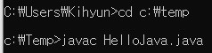

# Chapter 1 자바 시작


## 목차

- [컴퓨터와 프로그래밍](#컴퓨터와-프로그래밍)
- [자바의 출현과 WORA](#자바의-출현과-WORA)
- [개발 도구와 자바 플랫폼](#개발-도구와-자바-플랫폼)
- [자바 프로그램 개발](#자바-프로그램-개발)
- [이클립스를 이용한 자바 프로그램 개발](#이클립스를-이용한-자바-프로그램-개발)
- [자바 언어의 활용](#자바-언어의-활용)
- [자바의 특징](#자바의-특징)
- [실습](#실습)


## 컴퓨터와 프로그래밍

> 컴퓨터와 소프트웨어


컴퓨터 __하드웨어(hardware)__를 작동시켜 음악을 듣거나 게임을 하는 등의 활동을 할 수 있게 하는 것을 __소프트웨어(software)__ 혹은 __프로그램(program)__ 이라고 부른다.

태블릿과 스마트폰에서 작동하는 소프트웨어를 __앱(APP)__ 이라고 부른다.


> 프로그래밍 언어


프로그래밍 언어는 컴퓨터가 샐행할 프로그램을 작성하는 데 사용되는 언어이다.

컴퓨터의 CPU는 이진수인 0과 1만 이해할 수 있으며 이런 이진수 명령어들로 구성된 언어를 __기계어(machine language)__ 라고 한다.

사람이 기계어를 직접 사용하는 것은 힘들기 때문에 기계어의 각 명령을 ADD, SUB, MOVE 등의 상징적인 __니모닉 기호(mnemonic symbol)__ 로 일대일 대응시킨 __어셈블리어(assembly language)__ 가 만들어졌다.  
그러나 어셈블리어 역시 사람이 다루기 힘들고, 표현에 한계가 있어 이해하기 쉽고, 효율적으로 표현할 수 있는 __고급 언어__ 가 생겨나게 되었다.  
고급 언어는 초기에 __절차 지향 언어__ 형태(ex. c) 를 거쳐 지금의 __객체 지향 언어__ (ex. c++, Java, c#)로 발전했다.


> 프로그램 컴파일과 실행


프로그래밍은 __소스(source) 파일__(혹은 소스 프로그램이라고 부름)을 작성하는 것으로 시작한다.  
컴퓨터는 C나 Java와 같은 고급 언어로 작성된 프로그램은 처리 할 수 없기 때문에 컴퓨터가 처리할 수 있는 기계어 코드로  
변환하는 __컴파일(compile)__ 과정이 필요하다.  
컴파일을 전담하는 소프트웨어를 __컴파일러(compiler)__ 라고 하며, 각 언어마다 전용 컴파일러가 있다.

자바는 소스 프로그램의 확장자가 __.java__ 이고,  
자바 전용 컴파일러에 의해 __.class__ 파일로 컴파일 되며,  
__.class__ 파일은 __JVM(자바 가상 기계)__ 에 의해 실행된다.


## 자바의 출현과 WORA

> 자바의 태동


1991년에 선마이크로시스템스는 제임스 고슬링을 중심으로 가전제품에 사용할 소프트웨어를 개발하는 그린 프로젝트를 시작했다.  
가전제품은 매우 다양한 플랫폼을 가지기 때문에 기존의 프로그래밍언어로 작성된 프로그램은 플랫폼간에 호환성이 없다는 큰 문제점이 있었다.  
또한 가전제품에 들어가는 제어장치는 임베디드 시스템의 메모리 요구 사항을 충족해야만 했다.

선마이크로시스템스는 __플랫폼 독립적(platform independent)__ 이며 __메모리 사용량이 적은__ 새로운 언어와 실행 체계를 개발하였고 처음에 이 언어의 이름을 __오크(oak)__ 라고 지었다.  
초기에는 별로 알려지지 않았지만 인터넷과 웹이 엄청난 속도로 발전하며 플랫폼 독립성을 가진 오크는 급속도로 퍼지게 되었다. 선마이크로시스템스는 오크를 인터넷 환경에 적합하도록 발전시켰으며,  
마침내 1995년 SunWorld 95에서 __자바(Java)__ 라는 이름으로 새로운 기술을 발표하였다.  
당시 가장 많이 사용되는 브라우저인 넷스케이프(Netscape)에 자바 기술을 적용하면서 자바는 급속도로 퍼졌고,    
2009년에 오라클에서 선마이크로시스템스를 인수함으로써 현재는 오라클에서 자바를 제공하고 있다.


> WORA(Write Once Run Anywhere)

자바 이전의 프로그래밍 언어는 컴파일러에서 기계어 코드로 변환할 때 실행될 대상 컴퓨터의 CPU와 운영체제에 종속적인 코드로 변환한다.  
이로 인해 이 코드를 다른 플랫폼(다른 CPU나 운영체제)에서 실행하려면 다시 컴파일하거나 플랫폼에 맞도록 코드를 수정해야한다.  
이러한 특징을 __플랫폼 종속성(platform dependence)__ 이라고 한다.

자바는 기존 프로그래밍 언어가 가진 플랫폼 종속성을 극복하여, 운영체제나 하드웨어에 상관없이 JVM(자바 가상 기계)이 있으면 플랫폼에 상관없이 동일한 실행환경과 실행결과를 제공한다.  
또 자바는 웹 브라우저, 분산 환경의 지원 등으로 네트워크에 연결된 어느 클라이언트에서도 실행이 가능하다. 

WORA란? 자바 프로그램은 어디서든 한 번 작성하면, 다시 컴파일하거나 수정하지 않고, 어떤 하드웨어나 운영체제에서도 실행시킬 수 있다는것을 말한다.


> 자바 가상 기계와 바이트 코드


자바의 플랫폼 독립성을 가능하게 하는 것은 JVM과 바이트 코드 때문이다.

__바이트코드__ 는 자바 가상 기계에서만 실행되는 기계어로서, 어떤 CPU와도 관계없는 바이너리 코드(binary code)이다.  
자바 컴파일러는 자바 소스 프로그램을 컴파일하여 바이트 코드로 된 클래스 파일을 생성한다.  
이 클래스 파일은 컴퓨터의 CPU에 의해 직접 실행되지 않고, __자바 가상 기계가 인터프리터 방식으로 실행시킨다.__  
이 클래스 파일은 자바 가상 기계만 있으면 어디서든지 바로 실행 가능하다.

__자바 가상 기계__는 소프트웨어로서, 서로 다른 플랫폼에서 자바 프로그램이 실행되는 동일한 환경을 제공한다.  
하지만 자바 가상 기계는 플랫폼마다 서로 다르게 작성되어 배포되며 플랫폼 종속적이다.  
자바 가상 기계는 오라클, IBM, 마이크로소프트 등 다양한 회사에서 제작하여 공급하고 있으며 어떤 회사의 JVM이 설치되어 있든지 정상적으로 실행된다.


> 자바의 실행 환경


- C/C++ 프로그램의 개발 및 실행

  개발자는 여러 소스 파일에 나누어 C/C++ 프로그램을 작성한다.  
  그리고 각 C/C++ 소스 프로그램을 컴파일하여 목적 파일(.obj)을 생성하고,  
  __링크__ 과정을 통해 목적 파일(.obj)들을 연결하여 하나의 실행 파일(.exe)를 만든다.  
  링크 과정에서는 C/C++ 프로그램에서 호출한 라이브러리 함수들을 찾고 이 함수들의 목적 코드를 라이브러리 파일에서 꺼내 .exe 파일에 삽입한다.

  이제 링크의 과정을 통해 만들어진 .exe 실행 파일에는 __실행에 필요한 모든 코드__ 가 다 들어 있어 .exe 파일만 있으면 실행에 문제가 없다.  
  하지만, exe 파일이 매우 큰 경우 적은 량의 메모리를 가진 컴퓨터에서는 처음부터 __실행조차 할 수 없는 문제점이 있다.

  

- 자바 프로그램의 개발 및 실행

  자바 프로그램도 보통 여러 소스 파일(.java)로 나누어 작성하며,  
  자바 컴파일러는 각 소스 파일을 컴파일하여 클래스 파일(.class)을 생성한다.  
  하지만 자바에서는 이들은 하나의 실행 파일(.exe)로 뭉치는 __링크의 과정이 없다.__  
  개발자는 여러 클래스 파일 중 하나를 지정하여 실행을 시작시키면, __자바 가상 기계는 그 클래스 파일을 메모리에 로딩하고 실행한다.__  
  실행 도중 다른 클래스 파일이나 자바 API의 클래스 파일이 필요하면, 자바 가상 기계는 __그 때 그 클래스 파일을 로딩하고 실행한다.__  
  이런 방식이면 처음부터 모든 클래스 파일을 로딩해놓을 필요 없이 당장 실행할 클래스 파일만 로딩하여 실행할 수 있으므로, 적은 량의 메모리를 가진 컴퓨터에서 얼마든지 큰 자바 응용프로그램을 실행할 수 있다.  
  이것이 플랫폼 독립성과 함께 달성하고자 하는 자바 언어의 본질이다.  
  메모리가 충분한 PC에서는 실행 중에 클래스 로딩으로 인한 시간을 줄이기 위해서 사용자 클래스 파일과 필요한 자바 클래스 파일을 미리 로딩해 둔다.


## 개발 도구와 자바 플랫폼

> JDK와 JRE


__JDK(Java Development Kit)__ 는 자바 컴파일러 등의 개발 도구와 __JRE(Java Runtime Environment)__로 구성된다.  
JRE는 자바 응용프로그램이 실행될 때 필요한 소프트웨어들로 자바 API(이미 컴파일된 다양한 클래스 라이브러리)와 JVM을 포함한다.  
개발자가 아닌 일반 사용자의 경우 JRE만 필요하다.

```
JDK 디렉토리 구조

bin : 자바 개발, 실행에 필요한 도구와 유틸리티 명령
conf : 여러 종류의 배치 파일
include : 네이티브 코드 프로그래밍에 필요한 C언어 헤더 파일
jmods : 컴파일된 모듈 파일들
legal : 각 모듈에 대한 저작권과 라이선스 파일
lib : 실행 시간에 필요한 라이브러리 클래스들
```

```
bin 디렉토리에 들어 있는 주요한 개발 소프트웨어

javac : 자바 컴파일러로 자바 소스를 바이트 코드로 변환
java : 자바 프로그램 실행기. JVM을 작동시켜 자바 프로그램 실행
javadoc : 자바 소스로부터 HTML 형식의 API 도큐먼트 생성
jar : 자바 클래스 파일을 압축한 자바 아카이브 파일(.jar) 생성, 관리
jmod : 자바의 모듈 파일(.jmod)을 만들거나 모듈 파일의 내용 출력
jlink : 응용프로그램에 맞춘 맞춤형(custom) JRE 생성
jdb : 자바 응용프로그램의 실행 중 오류를 찾는 데 사용하는 디버거
javap : 클래스 파일의 바이트 코드를 소스와 함께 보여주는 디어셈블러
```


> 자바의 배포판

- Java SE(Standard Edition)

  __자바 표준 배포판__으로 데스크탑 응용 프로그램이나 서버 응용 프로그램을 개발하기 위한 JDK이다.

  

- Java ME(Micro Edition)

  __모바일용 배포판__으로 IOT, TV, 셋톱박스등 작은 하드웨어 자원을 갖는 장치를 위한 JDK이다.

  스마트폰이나 TV등은 안드로이드가 장악함.

- Java EE(Enterprise Edition)

  __기업용 배포판__으로 자바를 이용한 다중 사용자, 대규모 기업 응용 프로그램 개발을 위한 JDK이다.


> Java 9부터 시작된 모듈 프로그래밍

2017년도 9월 21일 Java 9가 출시되었다.  
Java 9에서는 자바 플렛폼에 큰 변화가 이루어졌는데 바로 __모듈화(modularity)__ 이다.  
모듈이란? 자바 패키지들과 이미지, xml 파일 등의 자원들을 묶은 단위이며, 자바 응응프로그램을 퍼즐을 연결하듯이 필요한 모듈을 연결하는 방식으로 구성되게 한다.

이를 위해 Java 9부터는 개발자들이 호출하는 Java SE의 모든 클래스들을 모듈들로 재설계하고 재정리하였다.  
JDK를 설치하면 jmods 디렉터리 내에 담긴 모듈들을 볼 수 있다.

자바 __모듈화의 대표적인 목적__은, __세밀한 모듈화__를 통해 자바 응용프로그램이 실행되는데 __필요 없는 모듈을 배제__하여 __작은 크기로 배포할 수 있도록 함__에 있다.  
이것은 소형 IOT장치와 같은 하드웨어 자원이 적은 환경에서도 자바 응용 프로그램 실행 환경을 만들어 실행시키고 성능을 유지한다.


> 자바 API

__자바 API(Application Programming Interface)__는 개발자들이 사용하도록 __미리 만들어놓은 유용한 자바 클래스들의 집합__이다.  
Java 9 의 모듈화 정책 이후로 API의 클래스들을 서로 관련된 클래스끼리 패키지로 묶고, 패키지들을 모듈로 묶어 계층화해 놓았다.  

[자바API정보](#자바-api-설명)


> 자바 IDE

__IDE(Integrated Development Enviroment)__란 소스 코드 편집, 컴파일, 디버깅을 한꺼번에 할 수 있는 __통합 개발 환경(소프트웨어)__ 이다.  
IDE의 예로는 MS의 비주얼 스튜디오, IBM의 이클립스(eclipse)등이 있다.


## 자바 프로그램 개발

Hello World!를 출력하는 간단한 자바 프로그램 HelloJava.java를 작성하고 컴파일하는 과정을 알아보자.


> 자바 소스 편집


메모장을 이용하여 아래와 같이 작성한 후 접근하기 쉬운 폴더에 HelloJava.java로 저장한다.

```java
public class HelloJava {
    public static void main(String[] args) {
        System.out.println("Hello World!");
    }
}
```


위 코드를 간단히 설명하면 아래와 같다.


- public class HelloJava

  HelloJava라는 이름을 가진 클래스를 선언한다.

  모든 클래스는 { 로 시작하여 } 로 끝난다.

- public static void main(String[] args)

  main() 메소드를 선언하는 코드, 자바에서는 __함수를 메소드라고 부르며__, 메소드는 { 으로 시작하여 } 으로 끝난다.

  자바 클래스는 여러 개의 메소드를 포함할 수 있으며, 프로그램의 실행은 반드시 main 메소드부터 시작한다.

  

- System.out.println("Hello World!")

  System.out.println()은 JDK에 포함되어 개발자에게 제공되는 API이다. 화면에 문자열과 숫자, 문자를 출력한다.


> 자바 소스 컴파일

명령 프롬프트(CMD) 를 실행시켜서 HelloJava.java 파일이 있는 디렉토리로 이동한다.  
JDK에 포함된 javac(자바 컴파일러)를 실행하여 HelloJava.java를 컴파일한다.  
컴파일된 바이트 코드는 HelloJava.class 파일에 저장된다.




> 자바 응용프로그램 실행


이제 JDK에서 제공되는 java 명령으로 HelloJava.class를 실행시킨다.  
java는 자바 프로그램 실행기로서 JVM을 실행시키고 HelloJava.java 파일을 로딩하고 main() 메소드를 호출하는 식으로 작동한다.  


## 이클립스를 이용한 자바 프로그램 개발

> 이클립스 실행


> 프로젝트 생성

File -> New -> Project -> Java Project -> Finish


> 클래스 생성

File -> New -> Class -> Finish


> 소스 편집, 컴파일 및 실행

이클립스는 코드 입력과 동시에 자동으로 컴파일하기 때문에, 컴파일 과정 없이 바로 실행할 수 있다.  
작성한 자바 프로그램의 실행은 Run -> Run 메뉴를 누르거나 툴바에서 실행 아이콘을 누르면 된다.


## 자바 언어의 활용

> 데스크롭 응용 프로그램

PC 등의 데스크톱 컴퓨터에 실행되는 자바 응용 프로그램이다. 이클립스도 자바 언어로 개발되었으며  
자바 실행 환경(JRE)이 설치된 어느 컴퓨터에서도 실행된다.


> 자바 서블릿(servlet) 응용 프로그램

서블릿(java servlet)은 웹 서버에서 실행되는 서버용 자바 프로그램으로 인터넷 뱅킹이나 온라인 쇼핑물등을 구현할 때 쓰인다.  
서블릿은 웹 브라우저의 요청에 따라 웹 서버에 탑재된 데이터베이스를 검색하거나 요청받은 내용을 처리하고 웹 페이지로 만들어 웹 브라우저에 응답하는 방식으로 작동한다.  
서블릿은 웹 브라우저상에서 실행되는 자바 스크립트 코드와 통신하기도 한다.  
서블릿은 사용자 인터페이스(UI)를 필요로 하지 않으며 웹 서버에 의해 실행이 제어된다.


> 안드로이드(Android) 응용프로그램

검색 엔진으로 유명한 구글(Google)의 주도로 여러 모바일 회사가 모여 구성한 OHA(Open Handset Alliance)에서 개발한 무료 모바일 플랫폼을 안드로이드라고 한다.


## 자바의 특징

자바 언어가 가진 다양한 특징들에 대해 알아보자.

- 플랫폼 독립성

  자바는 하드웨어, 운영체제 등 플랫폼에 종속되지 않는 독립적인 바이트 코드로 컴파일 된다.  
  JVM만 있으면 플랫폼에 상관없이 자바 프로그램의 실행이 가능하다.

  

- 객체 지향

  __자바는 객체 지향 언어로서 캡슐화, 상속, 다형성을 지원한다.__

  객체 지향 프로그램은 객체 간의 관계로 모델링하여 인간의 사고에 가깝게 표현한다.

  

- 클래스로 캡슐화

  캡슐화 원칙을 철저히 지켜, __변수나 메소드는 반드시 클래스 내에 구현__하도록 한다.

  

- 소스와 클래스 파일

  클래스 파일(.class)에는 반드시 하나의 자바 클래스만 들어 있다.  
  자바 소스 파일에 여러 개의 클래스를 작성한 경우, 컴파일하면 클래스 갯수만큼 별도의 클래스 파일이 생성된다.  
  만약 .java 파일에 N개의 클래스 파일을 작성하면 n개의 클래스 파일이 생성된다.  
  A클래스 내부에 B라는 클래스를 작성했을 경우 클래스 B는 클래스 A안에 작성된 내부 클래스(inner class)로서 A&B.class 라는 이름으로 생성된다.  
  __하나의 자바 소스 파일에 작성된 클래스 중 오직 한개의 클래스만 public으로 선언할 수 있다.__  
  소스 파일 내에 public으로 선언된 클래스의 이름으로 자바 소스 파일을 저장해야 한다.

  

- 실행 코드 배포

  자바 응용 프로그램은 한 개 이상의 클래스 파일로 구성된다. 여러 개의 클래스 파일을 jar 파일 형태로 압축하여 배포하거나 실행할 수 있다.  
  Java 9 부터는 자바 응용 프로그램을 위한 맞춤형 JRE를 제작하여 실행시킬 수도 있다.  
  자바의 실행은 main() 메소드부터 시작하며, 하나의 클래스에는 단 하나의 main() 메소드만 존재 할 수 있다.  
  그러나 각 클래스 파일이 main() 메소드를 가지는 것은 상관없다.

  

- 패키지

  서로 관련 있는 클래스는 패키지로 묶어 관리한다. 패키지는 윈도우의 파일 폴더와 같은 개념이다.  
  예를 들어, java.lang.System 클래스는 java\lang 폴더의 System.class 파일을 나타내며, 여기서 java.lang을 패키지라고 부른다.

  

- 멀티스레드

  하나의 자바 프로그램이 다수의 작업을 처리할 수 있도록 다수의 스레드가 동시에 실행할 수 있는 환경을 지원한다.  
  보통 멀티스레드 프로그램을 작성하기 위해서는 운영체제가 멀티스레드를 지원하고 멀티스레드와 관련된 API나 라이브러리를 제공해야만한다.  
  C/C++ 등 많은 언어들은 자체적으로 멀티스레드를 지원하지 않아 운영체제의 도움을 받는다.  
  그러나 자바는 운영체제의 도움 없이 멀티스레드 프로그래밍이 가능하기 때문에,  
  멀티스레드를 지원하지 않는 운영체제에서도 자바를 이용하면 멀티스레드 프로그램을 개발할 수 있다.

  

- 가비지 컬렉션

  자바는 __메모리를 할당받는 기능은 있지만, 메모리를 반환하는 기능은 없다.__  
  이러한 특징은 개발자의 부담을 대폭 줄여주며 프로그램내에 사용되지 않는 메모리(가비지)는 JVM의 가비지 컬렉션 기능에 의해 자동으로 회수된다.

  

- 실시간 응용 프로그램에 부적합

  자바 응용프로그램은 실행 도중 예측할 수 없는 시점에 가비지 컬렉션이 실행되므로, 프로그램 실행이 일시적으로 중단된다.  
  이런 문제로 인해 실시간 시스템에는 자바 언어가 적합하지 않다.

  

- 자바 프로그램은 안전하다.

  자바 언어는 타입 체크가 매우 엄격하며, C/C++과 달리 메모리의 물리적 주소를 사용하는 포인터의 개념이 없기 때문에 컴퓨터 시스템이 중단되는 일은 없다.

  

- 프로그램 작성이 쉽다.

  다양한 라이브러리를 지원하고 포인터 개념이 없기 때문에 프로그램 작성이 상대적으로 편리하다.

  

- 실행 속도를 개선하기 위해 JIT 컴파일러가 사용된다.

  자바는 JVM이 인터프리터 방식으로 바이트 코드를 실행하므로 일반적으로 C/C++에 비해 느리다고 알려져있지만,  
  최근에는 실행하는 도중 자바 프로그램을 해당 CPU의 기계어 코드로 컴파일하고 CPU가 바로 기계어를 실행하도록 하는 __JIT(Just in Time)__ 컴파일링 기법을 사용하므로, 실행 성능이 개선되었다.


## 실습

1. 화면에 자신의 이름, 나이, 학과 등의 정보를 출력하는 자바 응용프로그램을 작성하라.  
   이클립스를 사용하여 OpenChallenge1이라는 이름의 프로젝트를 만들고, 클래스 이름을 MyInfoApp로 하라.  

   출력 결과는 아래와 같다.

   ```
   Kim Ho
   30 years old
   Department of Software Engineering
   ```

   [정답](./Chapter1Challenge/MyInfoApp.java)

2. 화면에 다음과 같이 "환영합니다!", "첫 자바 코드 작성을 축하드립니다."를 출력하는 자바 프로그램을 작성하라.  
   이클립스를 사용하고, 작업 공간(work space)은 c:\Temp로 하고, 프로젝트 이름은 1-1로 한다. 클래스 이름은 Welcome으로 한다.

   출력결과는 아래와 같다.

   ```
   환영합니다!
   첫 자바 코드 작성을 축하드립니다.
   ```

   [정답](./Chapter1Challenge/Welcome.java)

3. 화면에 "Happy~!", "행복한 하루 되세요~"를 출력하는 자바 프로그램을 작성하라.  
   이클립스를 이용하고, 작업 공간(workspace)은 c:\Temp로 하고, 프로젝트 이름은 1-2로 한다. 클래스 이름은 Happy로 한다.

   출력결과는 아래와 같다.

   ```
   Happy~!
   행복한 하루 되세요~
   ```

   [정답](./Chapter1Challenge/Happy.java)

## 참고 자료

자바 API 설명 : https://docs.oracle.com/javase/10/docs/api
