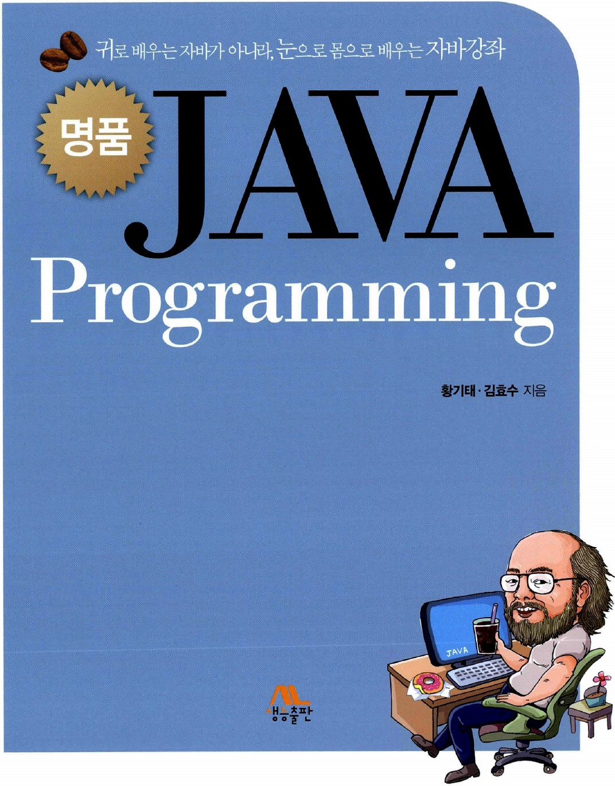

# 명품 JAVA Programming

### Chapter 01. 자바 시작

### Chapter 02. 자바 기본 프로그래밍

### Chapter 03. 반복문과 배열 그리고 예외 처리

### Chapter 04. 클래스와 객체

### Chapter 05. 상속

### Chapter 06. 모듈과 패키지 개념, 자바 기본 패키지

### Chapter 07. 제네릭과 컬렉션

### Chapter 08. 입출력 스트림과 파일 입출력

### Chapter 09. 자바 GUI 기초, AWT와 스윙

### Chapter 10. 자바의 이벤트 처리

### Chapter 11. 기본적인 스윙 컴포넌트 활용

### Chapter 12. 그래픽

### Chapter 13. 스레드와 멀티태스킹

### Chapter 14. 고급 스윙 컴포넌트

### Chapter 15. 네트워크

