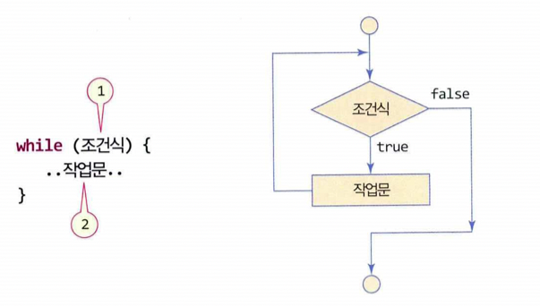
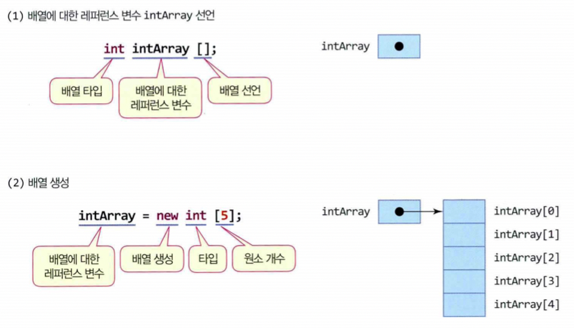
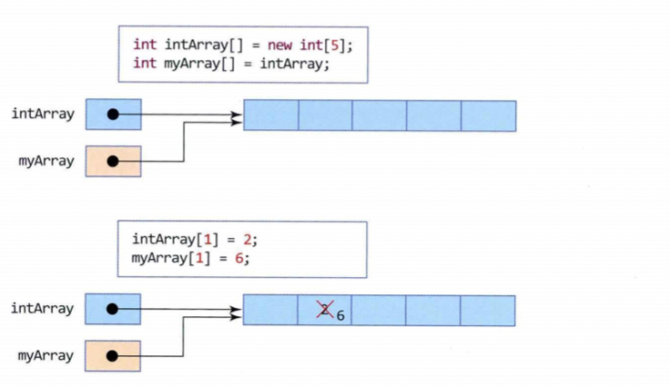

# Chapter 3 반복문과 배열 그리고 예외 처리


## 목차

- 반복문
- continue 문과 break 문
- 배열
- 다차원 배열
- 메소드에서 배열 리턴
- main() 메소드
- 자바의 예외 처리


## 반복문

자바는 반복 연산을 수행할 수 있도록 다음 3가지 종류의 반복문을 제공한다.

```
for, while, do-while
```

for문은 처음부터 반복 횟수를 알 수 있는 경우에, while문과 do-while 문은 반복 횟수를 알 수 없고 조건에 따라 반복이 계속 되거나 중단되는 경우에 이용한다.  
while문은 반복 조건을 처음부터 따지는 경우에, do-while 문은 반복 조건을 나중에 따지는 경우에 적합하다.


> for 문


- 초기문

  초기문은 주로 조건식에서 사용하는 변수를 초기화한다.

  - 초기문은 시작할 때 한 번만 수행된다.
  - 콤마(,)로 분리하여 여러 문장을 나열할 수 있다.
  - 초기문은 빈 상태로 두어도 되지만 끝에 세미콜론(;)은 있어야 한다.


- 조건식

  조건식에는 논리형 변수나 논리 연산을 사용한다. 조건식의 결과가 true이면 반복이 계속되고 false이면 for 문을 벗어난다.  
  조건식은 for 문의 작업 문장을 수행하기 전에 검사되므로 조건식이 처음부터 false이면 바로 반복문을 벗어난다.

  ```java
  for(i=0; i<10; i++) {		// i가 0~9까지 10번 반복
  	System.out.print(i);
  }
  ```

  다음과 같이 조건식에 true가 있거나 비어 있으면 무한 반복(infinity loop) 된다.

  ```java
  for(초기문; true; 반복 후 작업) {		// 무한 반복
  	.......
  }
  for(초기문; ; 반복 후 작업) {			// 조건식이 비어 있으면 무한 반복
  	.......
  }
  ```


- 반복 후 작업

  for 문의 작업문이 실행된 후 '반복 후 작업문'이 실행된다.

  ``` java
  for(i=0; i<10; i+=2) {		// i가 0,2,4,6,8로 변하면서 5번 반복
    ........
  }
  ```

  반복 후 작업문'에는 콤마(,)로 분리하여 여러 문장을 나열할 수 있다.  
  예를 들면 다음과 같다. 이 코드는 i 값을 증가시키고 증가된 i 값을 화면에 출력한다.

  ```java
  for(i=0; i<10; i++, System.out.println(i)) {
  	........
  }
  ```

  

- 작업문

  작업문은 for 문이 반복되는 동안 반복 실행된다. 작업문이 하나의 문장일 경우 중괄호({})가 필요 없지만 여러 개의 문장으로 구성되는 경우 반드시 중괄호로 묶어야 한다.


> for 문 활용

- 반복문에 변수 선언

  다음과 같이 변수 i를 for 문 블록 내에서만 사용되는 지역 변수로 선언하여 사용할 수 있다.  
  이 때 변수 i는 for 문 밖에서는 사용할 수 없다.

  ```java
  for (int i=0; i<10; i++) // 변수 i는 for 문 밖에서 사용 불가
  	System.out.print(i);
  ```


- 1에서 100까지의 합 구하기

  ```java
  int sum = 0;
  for(int i=1; i<=100; i++)		// 1에서 100까지 반복
  	sum += i;
  
  int sum = 0;
  for(int i=100; i>=1; i--)		// 100에서 1까지 반복
    sum += i;
  
  int i, sum;
  for(i=1, sum=0; i<=100; i++)	// sum 변수를 0으로 초기화
    sum += i;
  ```


> while 문



while 문은 반복 횟수를 알 수 없는 경우에 적합하다. while문의 조건식은 for 문의 경우와 동일하며, true인 동안 작업문의 실행을 반복하고, false가 되면 while 문을 벗어난다.  
for 문과 달리, while문에 조건식이 없으면 컴파일 오류가 발생한다.  
while 문을 사용하는 경우, 조건식에 사용되는 변수를 while 문 실행 전에 초기화하는 것을 잊지 말아야 한다. 그리고 반복이 진행되면서 조건식이  false가 되어 반복문을 빠져 나올 수 있도록 설계되어야 한다. 그렇지 않으면 무한 반복에 빠지게 된다.


> do-while문


do-while 문의 조건식은 while 문과 동일하며 조건식이 없으면 컴파일 오류가 발생한다. 다른 반복문과는 달리,  do-while 문은 작업문 실행 후 조건식을 검사하므로 작업문이 최초 한 번은 반드시 실행된다.


> 중첩 반복

반복문 안에 다른 반복문을 만들 수 있다. 이것을 중첩 반복(nested loop)이라 한다.  
반복은 몇 번이고 중첩 가능하지만, 너무 깊은 중첩 반복은 프로그램 구조를 복잡하게 하므로 2중 또는 3중 중첩 이상하지 않는 것이 바람직하다.


## continue 문과  break 문

반복문 내에 continue 문이나 break 문을 이용하면 반복의 흐름을 바꾸거나 반복에서 벗어나게 할 수 있다.  
break 문은 현재 반복문을 벗어나게 하며, continue 문은 즉시 다음 반복으로 넘어간다.


> continue 문

continue 문은 반복문을 빠져나가지 않으면서 즉시 다음 반복으로 넘어가고자할 때 사용된다.

```java
continue;
```

아래 그림은 각 반복문에서 continue 문에 의해 실행 경로가 변경되는 것을 보여준다.


> break 문

break 문은 하나의 반복문을 즉시 벗어날 때 사용하며 다음과 같이 사용한다.

```java
break;
```

중첩 반복의 경우 안쪽 반복문에서 break 문이 실행되면, 안쪽 반복문만 벗어나며 바깥 쪽 반복문 내에서 실행이 유지된다.


## 배열

> 배열이란?

배열(array)은 인덱스(index)와 인덱스에 대응하는 데이터들로 이루어진 연속적인 자료 구조로서, 같은 종류의 데이터들이 순차적으로 저장된다.  
아래 그림은 10개의 정수 값을 저장하고 합할 때, 10개의 변수를 사용한 경우와 자바의 배열을 사용한 경우를 대조하여 보여준다.


배열을 사용하는 큰 이유 중 하나는 반복문의 활용에 있다. 배열을 사용하면 다음과 같이 for 문으로 10개의 정수 합을 간단히 구할 수 있다.

```java
for(sum=0, n=0; n<10; n++)
	sum += i[n];
```


> 배열 선언 및 생성

자바에서 배열의 생성은 C/C++와 달리 다음 두 단계로 이루어진다.

- 배열에 대한 레퍼런스 변수 선언
- 배열 생성 - 배열의 저장 공간 할당

아래 그림은 5개의 정수 값을 저장하는 배열을 만드는 코드로, 배열에 대한 레퍼런스 변수를 선언하는 단계와, 데이터를 저장할 배열 공간을 할당받는 단계로 구분된다.



- 배열에 대한 레퍼런스 변수 선언

  다음은 배열 선언문으로 레퍼런스 변수 intArray를 선언한다.

  ```java
  int intArray[];
  ```

  이 선언만으로 배열 공간이 할당되지 않으며, 위 그림과 같이 레퍼런스 변수 intArray만 생성된다.  
  intArray는 배열 공간에 대한 주소 값(레퍼런스 값)을 가지며 그 자체가 배열은 아니다. 아직 정수를 저장할 배열 공간이 생성되지 않았으므로 intArray 값은 null이다.  
  자바에서는 배열의 주소를 레퍼런스라고 부르며, 배열에 대한 주소 값을 가지는 변수를 레퍼런스 변수라고 부른다.  
  배열의 타입은 배열을 구성하는 원소의 타입이며, 배열의 레퍼런스 변수는 다음 두 가지 방법으로 선언할 수 있다.

  ```java
  int intArray[];
  int [] intArray;
  ```

- 배열 선언 시 []에 크기를 지정하면 안 됨

  배열 선언 시 [] 안에 배열의 크기를 지정해서는 안 된다. 다음 문장은 컴파일 오류이다.

  ```java
  int intArray[10];		// 컴파일 오류. 배열의 크기를 지정할 수 없음
  ```

- 배열 생성

  배열 생성은 데이터를 저장할 배열 공간을 할당받는 과정이다. 반드시 new 연산자를 이용하여 배열을 생성하며 [] 안에 생성할 원소 개수를 지정한다.  
  다음 코드는 정수 5개의 배열 공간을 할당받고 이 배열에 대한 레퍼런스 값(주소 값)을  intArray에 저장한다.

  ```java
  intArray = new int[5];
  ```

- 배열의 선언과 동시에 생성

  다음과 같이 배열의 선언과 생성을 동시에 할 수 있다.

  ```java
  int intArray[] = new int[5];
  ```

- 배열 초기화

  배열 선언문에서 {}에 원소를 나열하면 초기화 된 배열을 만들 수 있다.  
  배열을 초기화하는 예를 들면 다음과 같으며 실행 결과는 아래 그림과 같은 배열이 생긴다.

  ```java
  int intArray[] = {4, 3, 2, 1, 0};
  double doubleArray[] = {0.01, 0.02, 0.03, 0.04};
  ```

  IntArray 배열의 크기는 자동으로 5가 되며, doubleArray 배열의 크기는 자동으로 4가 된다. 생성되는 배열의 원소 개수는 {}에 나열된 값의 개수로 정해지므로 []에 크기를 주어선 안 된다.

  

  

> 배열 인덱스와 배열 원소 접근

배열의 인덱스는 정수만 가능하다. 인덱스는 0부터 시작하며 마지막 원소의 인덱스는 (배열 크기 -1)이다.  
배열의 원소를 접근하려면 반드시 배열이 생성(공간 할당)되어 있어야 한다. 배열이 생성되어 있지 않는 상태에서 배열을 사용하면 배열이 초기화가 되지 않았따는 컴파일 오류가 발생하거나, 실행시간 오류가 발생한다.


> 레퍼런스 치환과 배열 공유

자바에서는 레퍼런스 변수와 배열 공간이 분리되어 있기 때문에, 다수의 레퍼런스 변수가 하나의 배열 공간을 가리키는 배열 공유가 쉽게 이루어진다.  
다음 코드와 함께 아래 그림을 보면서 배열이 공유되는 것을 알아보자.

```java
int intArray[] = new int[5];
int myArray[] = intArray;		// 레퍼런스 치환. myArray는 intArray와 동일한 배열 참조
```

앞의 코드에서 두 번째 라인은 레퍼런스 변수 myArray를 생성하고 intArray 변수의 값을 myArray에 치환하는 코드이다.  
이 치환으로 intArray 배열이 복사되는 것이 아니라, 레퍼런스 즉 배열에 대한 주소만 복사된다.  
그 결과 myArray는 intArray와 동일한 레퍼런스 값을 가지게 되어  myArray는  intArray의 배열을 공유하게 되고, myArray로  intArray의 배열 원소를 마음대로 접근할 수 있다.

아래 그림의 윗부분은 intArray가 참조하는 배열을 myArray도 참조하고 있음을 보여준다. intArray와 myArray가 같은 배열을 참조하고 있기 때문에, 그림의 아랫부분의 myArray[1]=6;에 의해 먼저 기록된 값 2가 6으로 변경되는 것을 보여준다.



- 배열의 크기, length 필드

  자바는 배열을 객체로 다룬다. 배열이 생성되면 아래 그림과 같이 객체가 생성된다. 이 객체에는 배열의 저장 공간과 함께 배열의 크기 값을 가진 length 필드가 존재한다.

  

  length 필드를 이용하면 배열의 크기를 다음과 같이 간단히 알아낼 수 있다.

  ```java
  int intArray [] = new int[5];
  int size = intArray.length;		// size는 5
  ```

  배열 객체에  length 필드가 있기 때문에, 프로그램에서 배열의 크기를 따로 관리할 필요가 없다. 배열의 크기만큼 반복할 때  length 필드는 매우 유용하다. 다음은 intArray 배열의 모든 값을 출력하는 코드이다.

  ```java
  for(int i=0; i<intArray.length; i++)		// intArray 배열 크기(5)만큼 반복한다.
  	System.out.println(intArray[i]);
  ```

- 배열의 for-each 문

  
