# Chapter 4 클래스와 객체


## 목차

- 객체 지향과 자바
- 자바 클래스 만들기
- 생성자
- 메소드 활용
- 객체의 소멸과 가비지 컬렉션
- static 멤버
- final


## 객체 지향과 자바

> 세상 모든 것이 객체

객체 지향 언어를 배울 때마다, 당면하는 어려움이 객체(object)에 대한 이해이다. TV, 컴퓨터, 책, 건물, 의자, 사람 등 실세계는 객체들의 집합이다.  
실세계의 객체들은 자신만의 고유한 특성(state)과 행동(behavior)을 가지며 다른 객체들에게 행동을 요청하거나 정보를 주고받는 등 상호 작용하면서 존재한다.


> 객체 지향 언어의 특성

객체 지향 언어는 실세계의 객체를 프로그램 내에 표현하기 위해 클래스와 객체 개념을 도입하였다. 객체 지향 언어는 다음과 같은 특성을 가진다.

- 캡슐화(Encapsulation)

  캡슐화란 객체를 캡슐로 싸서 내부를 보호하고 볼 수 없게 하는 것으로 객체의 가장 본질적인 특징이다.  
  캡슐 약을 생각하면 이해가 쉬운데, 캡슐에 든 약은 어떤 색인지, 어떤 성분인지 보이지 않으며, 외부의 접근으로부터 안전하다.  
  객체는 캡슐화가 기본 원칙이지만 외부와의 접속을 위해 몇 부분만 공개 노출한다.  
  실세계와 달리 자바에서 객체는 아래 그림의 예와 같이 클래스(class)라는 캡슐을 사용하며, 필드(멤버 변수)와 메소드(멤버 함수)로 구성된다.  
  아래 그림은 동물을 Animal 클래스로 작성한 사례와 Animal 클래스의 lion 객체와 bear 객체가 생성된 모양을 보여준다.

  

- 상속(Inheritance)

  실세계에서 상속은 상위 개체의 속성이 하위 개체에 물려져서, 하위 개체가 상위 개체의 속성을 모두 가지는 관계이다.  
  아래 그림은 실세계에서의 상속 사례이다. 이 그림에서 '동물'은 '생물'의 속성을 물려받고 있으며,  
  '어류'는 '동물'의 속성과 '생물'의 속성을 모두 물려받고 있고, '나무'는 '식물'의 속성과 '생물'의 속성을 모두 물려받고 있음을 나타낸다.

  

  자바의 상속은 자식 클래스가 부모 클래스의 속성을 물려받고 기능을 추가하여 확장(extends)하는 개념이다.  
  자바에서 부모 클래스를 슈퍼 클래스(super class)라고 부르며 자식 클래스를 서브 클래스(sub class)라고 부른다.  
  상속은 슈퍼 클래스의 필드와 메소드를 물려받아 코드를 재사용함으로써, 코드 작성에 드는 시간과 비용을 줄인다.

  아래 그림은 Animal 클래스를 물려받은 Human 클래스를 작성한 사례이다.  
  상속 관계에 있는 Animal 클래스의 객체와 Human 클래스의 객체 모양을 보여준다.  
  Animal 클래스의 객체는 Animal 클래스에 선언된 name, age 필드와 eat(), speak(), love()의 5개 속성으로 구성된다.  
  한편, Human 클래스의 객체는 Animal 클래스를 물려받기 때문에, Animal 클래스의 5개 속성이다 hobby, job, work(), cry(), laugh() 등 Human 클래스에서 추가로 작성한 속성을 모두 가진다.

  

- 다형성(Polymorphism)

  다형성은 같은 이름의 메소드가 클래스 혹은 객체에 따라 다르게 동작하도록 구현되는 것을 말한다.  
  아래 그림은 상속 관계의 다형성을 보여주는 예로서, 강아지, 고양이, 닭 클래스는 Animal 클래스를 상속받고, '소리내기(speak())' 메소드를 각각 다르게 구현하였다.  
  이것은 슈퍼 클래스에 구현된 메소드를, 서브 클래스에서 동일한 이름으로 자신의 특징에 맞게 다시 구현하는 메소드 오버라이딩(overriding)으로 불린다.  
  다형성의 또 다른 사례는 클래스 내에서 이름이 같지만 서로 다르게 동작하는 메소드를 여러 개 만드는 메소드 오버로딩(overloading)이 있다.


> 객체 지향 언어의 목적

객체 지향 언어(Object Oriented Language)가 출현할 당시 범용으로 사용되는 언어는 절차 지향 언어(Structured Procedural Programming Language)였다. 객체 지향 언어는 절차 지향 언어의 단점을 보완하고 다음의 목적을 달성하기 위해 탄생하였다.

- 소프트웨어의 생산성 향상

  컴퓨터 산업의 발전으로 소프트웨어의 주기(life cycle)가 짧아지고 빠른시간 내에 소프트웨어를 만들어야 함으로 인하여  
  객체, 캡슐화, 상속, 다형성 등 소프트웨어의 재사용을 위한 여러 기법들을 가진 객체 지향 언어가 탄생하게 되었다.  
  객체 지향 언어는 상속을 통해 이미 작성된 코드를 재사용하기 쉬우며, 부분 수정을 통해 소프트웨어를 다시 만드는 부담을 대폭 줄일 수 있게 한다. 결국 객체 지향 언어는 소프트웨어의 생산성을 향상시킨다.

- 실세계에 대한 쉬운 모델링

  과거에는 수학 계산이나 통계 처리로 인해 데이터의 처리 과정이나 계산 절차를 잘 표현하는 절차 지향 언어가 적합하였지만,  
  산업 전반으로 컴퓨터의 활용이 확대됨에 따라 실세계의 일을 프로그래밍 해야 하는 경우가 많아지게 되었다.  
  실세계에서 일어나는 일을 절차 지향 언어를 이용하여 일련의 절차로 묘사하는 것은 힘든 작업이다. 절차나 처리 과정 보다는 일과 관련된 많은 물체(객체)들의 상호 작용으로 묘사하는 것이 더 적합하다.  
  이에 실세계의 일을 보다 쉽게 프로그래밍 하기 위해 객체를 중심으로 하는 객체 지향 언어가 부각되게 되었다.

> 절차 지향 프로그래밍과 객체 지향 프로그래밍

C 프로그래밍처럼 실행하고자 하는 절차를정하고, 이 절차대로 프로그래밍 하는 방법을 절차 지향 프로그래밍이라고 부른다.  
절차 지향 프로그래밍은 목적을 달성하기 위한 일의 흐름에 중점을 둔다. 아래 그림에서 절차 지향 프로그램은 흐름도를 설계하고 흐름도상의 동작들을 함수로 작성하며, 흐름도에 따라 일련의 동작들이 순서대로 실행되도록 작성한다.


그러나 객체 지향 개념은 프로그램을 보다 실제 세상에 가깝게 모델링(modeling)하여 실제 세상의 물체를 객체로 표현하고, 객체들의 관계, 상호 작용을 설계한 뒤, 각 객체를 클래스로 작성하면 프로그램이 완성된다.  
자판기를 객체 지향 프로그래밍으로 구현하면, 위 그림과 같이 자판기를 이루는 여러 통들과 버튼들, 그리고 이들을 제어하는 자판기 엔진, 디스플레이 객체들을 추출하고, 이 객체들 사이의 관계를 설계한 뒤, 각 객체를 메소드와 필드로 작성하고 클래스로 캡슐화하면 된다.


## 자바 클래스 만들기

> 클래스와 객체

자바를 비롯한 객체 지향 언어에서, 클래스는 객체를 만들어 내기 위한 설계도 혹은 틀이며, 클래스 모양 그대로 생성된 실체가 객체이다. 이러한 연유로 객체를 클래스의 인스턴스(instance)라고도 부른다.  
클래스와 객체의 사례를 들어보면, 소나타는 클래스이고, 공장에서 생산된 소나타 차 각각이 객체이며, 사람은 클래스이고 나, 너, 친구들, 윗집 사람, 아랫집 사람 등 살아있는 모든 사람이 바로 사람 객체이다.  
아래 그림은 봉어빵 틀과 붕어빵 객체 사이의 관계를 통해 클래스와 객체 관계를 보여준다. 자바로 말하자면 붕어빵 트은 자바 클래스이며, 붕어빵은 자바 객체이다.  
클래스는 하나이지만 객체들은 수 없이 많이 생성될 수 있다. 객체들은 클래스의 모양대로 모두 동일한 속성을 가지고 탄생하지만, 자신만의 고유한 값을 가짐으로써 구분된다.  


아래 그림은 사람 클래스의 객체, 최승희, 이미녀, 김미남을 보여준다. 이들은 모두 이름, 직업 나이, 성별, 혈액형 등 모두 사람의 속성을 동일하게 가지고 있지만, 값은 서로 다르다. 객체마다 속성들의 값은 서로 다르다.


> 클래스 구성

자바 클래스는 class 키워드를 사용하여 선언한다. 클래스의 구성 요소를 멤버라고 부르며, 멤버는 필드(멤버 변수)와 메소드(멤버 함수)의 두 가지이다. 아래그림은 원을 추상화한 클래스 Circle을 작성한 코드를 보여준다. 구체적으로 알아보자.


- 클래스 선언, class Circle

  이 코드는 이름이 Circle인 클래스를 선언한다. class 키워드와 클래스 이름으로 선언하고 중괄호 안에 필드(field) 와 메소드(method)를 모두 작성한다. 클래스 외부에는 어떤 필드나 메소드를 둘 수 없다. 캡슐화의 원칙 때문이다.

- 필드와 메소드

  객체 내애 값을 저장할 멤버 변수를 필드라고 부른다. Circle 클래스에는 radius와 name의 두 필드가 있다.  
  메소드는 함수이며 객체의 행동을 구현한다. getArea() 메소드는  Circle 객체의 반지름 정보(radius)를 이용하여 면적을 계산하여 알려준다.

- 접근 지정자, public

  Circle이나 필드, 메소드에 붙은 public을 접근 지정자(access specifier)라고 한다. public은 다른 클래스에서 활용하거나 접근할 수 있음을 선언한다. 접근 지정자를 생략할 때 디폴트 접근이라고 부른다.

- 생성자(constructor)

  클래스의 이름과 동일한 메소드를 특별히 생성자(constructor)라고 한다. 생성자는 객체가 생성될 때 자동으로 호출되는 특별한 메소드이다.


> new 연산자와 객체 생성, 그리고 레퍼런스 변수

이제, 앞서 작성한 Circle 클래스의 객체를 생성하고 활용해보자. 코드 예는 다음과 같으며, 아래 그림은 이 코드의 실행에 따른 변수와 객체의 변화를 보여준다.

```java
public static void main(String[] args) {
	Circle pizza;						// Circle 객체에 대한 레퍼런스 변수 pizza 선언
  pizza = new Circle();		// Circle 객체 생성
  
  pizza.radius = 10;			// radius 필드에 10 저장
  pizza.name = "자바피자";	// name 필드에 "자바피자" 저장
  double area = pizza.getArea();		// pizza 객체의 면적 알아내기
}
```


- 레퍼런스 변수 선언

  객체를 생성하기 전, 객체를 가리킬 레퍼런스 변수를 먼저 선언한다. 다음은 Circle 타입의 객체를 가리킬 레퍼런스 변수 pizza를 선언하는 문장이다.

  ```java
  Circle pizza;			// 레퍼런스 변수 pizza 선언
  ```

  이 선언문으로 Circle 타입의 객체가 생성되지 않는다. 변수 pizza는 Circle 클래스의 객체에 대한 주소, 정확히 말해 레퍼런스를 가지는 변수일 뿐 객체 자체는 아니다. 따라서 아직 객체가 생성된 것이 아니며, 위 그림의 (1)과 같이 레퍼런스 변수만 생기고 null로 초기화된다.

- 객체 생생, new 연산자 사용

  자바에서는 반드시 new 연산자를 사용하여 다음과 같이 객체를 생성한다.

  ```java
  pizza = new Circle();
  ```

  이 문장의 실행 결과는 위 그림의 (2)와 같다. 생성된 Circle 객체의 주소 즉 레퍼런스를 pizza 변수에 대입한다. new 연산자에 의해 객체가 생성되는 과정은 다음과 같다.

  - Circle 타입 크기의 메모리 할당
  - Circle() 생성자 코드 실행

  이 결과 위 그림(2)에 보이는 바와 같이 pizza 객체는 radius와 name 필드가 초기화되지 않은 상태로 생성되었다. 객체가 생성될 때 필드를 초기화하거나 생성 당시에 꼭 필요한 작업을 위해 두는 것이 생성자인데, 현재 Circle() { } 생성자에는 어떤 코드도 작성되지 않아 아무런 작업도 실행되지 않았다.  
  레퍼런스 변수 선언과 객체 생성은, 다음과 같이 동시에 할 수도 있다.

  ```java
  Circle pizza = new Circle();
  ```


> 객체 멤버 접근

객체의 멤버에 접근할 때는 다음과 같이 레퍼런스 변수 뒤에 점(.) 연산자를 붙인다.

```
객체 레퍼런스.멤버
```

예를 들어, 다음 코드는  pizza 객체의 radius 필드에 10을 대입한다.

```java
pizza.radius = 10;
```

이 코드의 실행 결과 위 그림(3)과 같이 radius 필드 값이 10으로 바뀌었다. pizza 객체의 radius 필드 값을 읽을 경우 다음과 같이 하면 된다.

```java
int r = pizza.radius;
```

다음 코드는 pizza 객체의 getArea() 메소드를 호출하여 면적을 알아낸다.

````java
double area = pizza.getArea();
````


## 생성자

> 생성자의 개념과 목적

생성자(constructor)는 객체가 생성될 때 객체의 초기화를 위해 실행되는 메소드이다. 생성자는 자바, C++, C#, Python등 모든 객체 지향 언어에 존재한다.


> 생성자 선언 및 활용

생성자는 객체가 생성되는 순간에 자동으로 호출되는 메소드로서, 객체에 필요한 초기화를 실행하는 코드를 담아야 한다.  
아래 예제는 2개의 생성자를 작성하고 활용하는 코드를 보여준다.

```java
public class Circle {
    int radius;
    String name;

    public Circle() {
       radius = 1; name = "";		// 필드 초기화;
    }
  	public Circle(int r, String n) { // 매개 변수를 가진 생성자
      radius = r; name = n;		//매개 변수 필드 초기화
    }
    public double getArea() {
        return 3.14*radius*radius;
    }

    public static void main(String[] args) {
        Circle pizza = new Circle(10, "자바피자");		// 객체 생성. 반지름을 10으로, 이름을 "자바피자로 초기화"
        double area = pizza.getArea();
        System.out.println(pizza.name + "의 면적은 " + area);

        Circle donut = new Circle();	// 객체 생성. 반지름을 1, 이름을 ""로 초기화
        donut.name = "도넛피자";	// 이름 변경
        area = donut.getArea();
        System.out.println(donut.name + "의 면적은 " + area);
    }
}
```

위 코드를 보면서 생성자의 특징을 정리해보자.

- 생성자의 이름은 클래스 이름과 동일하다

  생성자의 이름은 반드시 클래스 이름과 동일하게 작성해야 한다.

  ```java
  public class Circle {
    public Circle(int r, String n) {...}		// 생성자
  }
  ```

- 생성자는 여러 개 작성(오버로딩)할 수 있다

  매개변수의 개수와 타입만 다르다면, 클래스 내에 생성자를 여러 개 둘 수 있다.  
  Circle 클래스 역시 매개변수의 개수가 다른 2개의 생성자가 작성되어 있다.

  ```java
  public class Circle {
    public Circle() {...}												// 매개 변수 없는 생성자
    public Circle(int r, String n) {...}				// 2개의 매개 변수를 가진 생성자
  }
  ```

- 생성자는  new를 통해 객체를 생성할 때 한 번만 호출된다

  객체 생성은 반드시  new를 통해서만 이루어지며, 생성자는 이 때 자동으로 한번만 호출된다. 호출하고 싶을 때 아무 때나 호출할 수 있는 메소드가 아니다.

  ```java
  Circle pizza = new Circle(10, "자바피자");				// 생성자 자  Circle(int r, String n) 호출
  Circle donut = new Circle();										// 생성자 Circle() 호출
  ```

- 생성자에 리턴 타입을 지정할 수 없다

  생성자는 어떤 값도 리턴하지 않기 때문에 다음과 같이 리턴 타입을 선언해서는 안된다.

  ```java
  public Circle() {...}					// 리턴 타입 선언하지 않음
  ```

  마찬가지로 리턴 값이 없다고 해서, void를 리턴 타입으로 지정해도 안 된다.

  ```java
  public void Circle() {...}		// 오류. void를 리턴 타입으로 사용할 수 없음
  ```

  하지만, 생성자에서  return 문을 사용할 수 없다는 뜻은 아니다. return 문은 메소드의 실행을 끝내고 호출한 곳으로 돌아가라는 명령이므로, 생성자의 실행을 끝내고자 하면 생성자 코드 내 어디서든 return; 문을 사용하면 된다.

- 생성자의 목적은 객체가 생성될 때, 필요한 초기 작업을 위함이다

  다음 객체 생성 문은 Circle(int r, String n) 생성자를 호출하여 pizza 객체의 radius를 10으로, name을 "자바피자"로 초기화한다.

  ```java
  Circle pizza = new Circle(10, "자바피자");				// 생성자 Circle(int r, String n) 호출
  ```

  이렇게, 생성자는 객체가 생성될 때, 필드 초기화, 필요한 메모리 확보, 파일 열기, 네트워크 연결 등 객체가 활동하기 전에 필요한 초기 준비를 하는데 이용된다.


> 기본 생성자

기본 생성자(default construcor)란 매개변수와 실행 코드가 없어 아무 일도 하지않고 단순 리턴하는 생성자이다. 디폴트 생성자라고도 부르며 예를 들면 다음과 같다.

```java
class Circle {
  public Circle() { }				// 기본 생성자. 매개변수 없고 아무 일 없이 단순 리턴
}
```

- 기본 생성자가 자동으로 생성되는 경우

  생성자가 없는 클래스는 있을 수 없다. 객체가 생성될 때 반드시 생성자가 실행되기 때문이다.  
  그러므로 생성자가 하나도 없는 경우 컴파일러는 기본 생성자를 자동으로 생성한다. 예를 들어보자.아래 그림은 개발자가 생성자를 만들어 놓지 않은 클래스이다.

  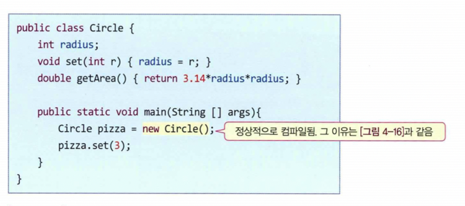

  그럼에도 main() 메소드의 다음 new 문은 버젓이 매개변수 없는  Circle() 생성자를 호출하고 있다.

  ```java
  Circle pizza = new Circle();			// 생성자 Circle() 호출
  ```

  Circle 클래스에 생성자가 없기 때문에 이 문장은 컴파일 오류가 발생해야 하지만, 자바 컴파일러는 아래 그림과 같이 기본 생성자를 삽입하여,  new Circle() 이 실행될 때 생성자 Circle()이 호출되도록 한다.  
  컴파일러가 기본 생성자를 자동으로 생성한다고 해서 Circle.java 소스 파일이 위 그림의 코드에서 아래 그림의 코드로 변하는 것은 아니다.

  

- 기본 생성자가 자동으로 생성되지 않은 경우

  생성자가 하나라도 존재하는 클래스에는 컴파일러가 기본 생성자를 삽입해 주지 않는다. 아래 그림은 이미 생성자가 있는 Circle 클래스와 Circle의 객체를 생성하는 두가지 경우를 보여준다. 먼저 다음  new 문장을 보자.

  ```java
  Circle pizza = new Circle(10);				// Circle(int r) 호출
  ```

  이 new 문장은 매개변수를 가진 다음 생성자를 호출한다.

  ```java
  public Circle(int r) {
  	radius = r;
  }
  ```

  그러나 다음  new 문장을 위한 생성자  Circle()은 작성되어 있지 않다.

  ```java
  Circle donut = new Circle();					// 캄파일 오류, 생성자 Circle() 없음
  ```

  Circle 클래스에는 매개변수를 가진 생성자가 작성되어 있기 때문에, 컴파일러는 기본 생성자를 만들어주지 않는다. 그러므로 앞의  new 문장은 컴파일 오류를 발생시킨다.

  


> this 레퍼런스

this는 자바의 중요한 키워드로서 단어 뜻 그대로 객체 자신을 가리키는 레퍼런스이다.

- this의 기초 개념

  this는 현재 객체 자신에 대한 레퍼런스이다. 보다 정확히 말하면 현재 실행되고 있는 메소드가 속한 객체에 대한 레퍼런스이다.  
  this는 컴파일러에 의해 자동 관리되므로 개발자는 this를 사용하기만 하면 된다. 다음 코드는  this를 사용하는 전형적인 예이다.

  ```java
  public class Circle {
    int radius;
    public Circle(int r) { this.radius = r; }
    public int getRadius() { return radius; }
  }
  ```

  this는 현재 객체에 대한 레퍼런스이므로, this.radius는 현재 객체의 멤버 radius를 접근한다.

- this의 필요성

  앞의  Circle 클래스에서 메소드 getRadius()는 다음과 같이 this를 사용하지 않았다. 클래스 내에서 멤버 radius를 접근할 때 굳이 this.radius로 할 필요가 없다.

  ```java
  return radius;		// return this.radius;와 동일
  ```

  그렇다면 this는 언제 필요할까? 매개변수의 이름은 그 자체로서 코드를 읽는 사람에게 그 용도를 나타내므로, 적합한 이름을 붙이는 것은 매우 중요하다.그래서  CIrcle(int r) 생성자의 매개변수를  r 대신 다음과 같이 radius로 변경하는 것이 좋다.

  ```java
  public Circle(int radius) { radius = radius; }
  ```

  하지만 이렇게 변경하면 어떤 일이 발생할까? 이 질문은 의외로 까다로운 질문이다. 생서자의 코드를 보자.

  ```java
  radius = radius;		// 여기서 2개의 radius는 모두 매개변수 radius를 접근한다.
  ```

  이 코드에서 2개의 radius는 모두 Circle(int radius)의 매개변수 radius를 접근하기 때문에, 멤버  radius를 변경하지 못한다.  
  자바에서는 이 경우처럼 매개변수의 이름을 멤버 변수와 같은 이름으로 붙이고자 하는 경우가 허다한데, 이때 다음과 같이 this를 이용하면 된다.

  ```java
  public Circle(int radius) { this.radius = radius;}
  ```

  또 메소드가 객체 자신의 레퍼런스를 리턴해야 하는 경우가 있는데, 이때 다음과 같이 this를 리턴하면 된다.

  ```java
  public Circle getMe() { return this; }			// getMe() 메소드는 객체 자신의 레퍼런스 리턴
  ```

  이 경우에 대해서는 구체적인 설명을 생략한다. 프로그래밍에 대한 경력이 쌓여가면서 스스로 이해하게 될 것이다.

- this의 상세 설명

  아래 그림의 코드와 함께  this에 대해 조금 더 알아보자. 이 코드에서 main()은 3개의 Circle 객체를 생성한다. 객체가 있어야  this를 사용할 수 있다. ob1, ob2, ob3 개체에서 this는 각각 자기가 속한 객체에 대한 레퍼런스이다.  
  ob1.set()이 실행될 때 this는  ob1 객체에 대한 레퍼런스이며,  ob.set()이 실행될 때 this는 ob2 객체에 대한 레퍼런스이다.

  

> This()로 다른 생성자 호출

this()는 클래스 내에서 생성자가 다른 생성자를 호출할 때 사용하는 자바 코드이다. 아래 예제는 3개의 생성자를 가진  Book 클래스에서  this()를 활용하는 코드 사례를 보여준다. 이 사례를 보면서  this()에 대해 알아보자.

```java
public class Book {
	String title;
  String author;
  
  void show() { System.out.println(title + " " + author); }
  
  public Book() {
    this("", "");
    System.out.println("생성자 호출됨");
  }
  
  public Book(String title) {
    this(title, "작자미상");
  }
  
  public Book(String title, String author) {
    this.title = title;
    this.author = author;
  }
  
  public static void main(String [] args) {
    Book littlePrince = new Book("어린왕자", "생텍쥐페리");
    Book loveStory = new Book("춘향전");
    Book emptyBook = new Book();
    loveStory.show();
  }
}
```

위 예제의 main()에서 다음 객체 생성 문에 주목해보자.

```java
Book loveStory = new Book("춘향전");
```

new가 실행될 때  Book(String title) 생성자가 호출되며, title에는 "춘향전"이 전달된다. 그리고 생성자는 바로 다음  this() 문을 실행한다.

```java
this(title, "작자미상");
```

이  this() 문은 2개의 매개변수를 가진 다음 생성자를 다시 호출한다.

```java
public Book(String title, String author) {
	...
}
```

이 생성자에 의해 멤버 title과 author는 각각 "춘향전", "작자미상"으로 초기화된다.

- this 사용 시 주의할 점

  this() 상요 시 다음과 같이 주의할 사항이 있다.

  - this()는 반드시 생서자 코드에서만 호출할 수 있다.
  - this()는 반드시 같은 클래스 내 다른 생성자를 호출할 때 사용된다.
  - this()는 반드시 생성자의 첫 번째 문장이 되어야 한다.

  this()의 호출은 생성자 코드의 첫번째 문장이 되어야 하므로 Book 클래스의 다음 생성자에는 컴파일 오류가 발생한다.

  ```java
  public Book() {
    System.out.println("생성자 호출됨");
    this("", "");		// 컼파일 오류. this()는 생성자의 첫 번째 문장이어야 함
  }
  ```

> 객체 치환 시 주의할 점

= 연산자로 객체를 치환하면 어떤 결과가 될까? 아래 그림의 코드와 결과를 보자. 객체의 치환은 객체를 복사하는 것이 아니다.


main() 메소드에서 다음과 같이 Circle 객체를 2개 생성하였다.

```java
Circle ob1 = new Circle(1);
CIrcle ob2 = new Circle(2);
```

그리고 나서 다음 라인을 실행하면, ob2의 레퍼런스가 레퍼런스 s에 치환(대입)되어 s는 ob2가 가리키는 객체를 함께 가리키게 된다.

```java
s = ob2;
```

다음 객체 치환 문장을 실행해보자.

```java
ob1 = ob2;
```

역시 ob1의 레퍼런스가 ob2의 레퍼런스와 동일하게 되어 ob2의 객체를 함께 가리키게 된다. 그리고 나면 원래 ob1이 가리키던 객체는 아무도 기리키지 않게 되어 프로그램에서 접근할 수 없는 상태가 되었다.  
이 객체를 가비지(garbage)라고 부른다. 가비지는 자바 가상 기계에 의해 자동으로 수거되어 재사용된다.


## 객체 배열

> 객체 배열

자바에서는 기본 타입 데이터뿐 아니라, 객체를 원소로 하는 객체 배열도 만들 수 있다. C/C++과 달리, 자바의 객체 배열은 객체에 대한 레퍼런스를 원소로 갖는 배열이다. 만드는 방법 또한 다르므로 집중하여 학습하기 바란다.

다음 코드를 이용하여 객체 배열을 만들고 활용하는 방법을 알아보자.

```java
Circle [] c;								// Circle 배열에 대한 레퍼런스 변수 c 선언
c = new Circle[5];					// 레퍼런스 배열 생성

for(int i=0; i<c.length; i++)		// c.length는 배열 c의 크기로서 5
  c[i] = new Circle(i);					// 배열의 각 원소 객체 생성
```

앞의 코드는 5개의 Circle 객체들을 원소로 저장하는 배열을 만든 사례이며, 다음은 배열에 들어 있는 모든 Circle 객체의 면적을 출력하는 코드 사례이다.

```java
for(int i=0; i<c.length; i++)				// 배열에 있는 모든 Circle 객체의 면적 출력
  System.out.print((int)(c.[i].getArea()) + " ");
```

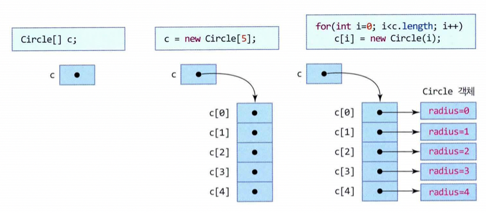

> 배열 선언 및 생성

객체 배열을 만들기 위해서는 다음의 3단계가 필요하다.

- 배열에 대한 레퍼런스 선언

  다음은 Circle 클래스의 배열에 대한 레퍼런스 변수 c를 선언한다.

  ```java
  Circle [] c;
  ```

  이 선언문은 위 그림과 같이 레퍼런스 변수 c만 선언할 뿐, 배열을 생성하는 것은 아니다. 그러므로 다음과 같이 배열의 원소 개수를 지정해서는 안 된다.

  ```java
  Circle[5] c;		// 오류. 배열의 크기를 지정하면 컴파일 오류 발생
  ```

- 레퍼런스 배열 생성

  두 번째로 5개의 레퍼런스를 원소로 하는 배열을 생성한다. 배열의 원소는 객체가 아니라 레퍼런스이다.

  ```java
  c = new Circle[5];			// Circle 객체에 대한 레퍼런스 5개 생성
  ```

  이 코드의 실행 결과 위 그림과 같이 Circle 객체에 대한 레퍼런스 배열이 생성되며, 변수 c가 이를 가리킨다. Circle 객체들은 아직 존재하지 않는다.

- 객체 생성

  이제 다음 코드를 이용하여 Circle 객체를 하나씩 생성하여 배열 c[]의 각 레퍼런스에 대입한다.

  ```java
  for(int i=0; i<c.length; i++)			//c.length는 배열 c의 크기로서 5
    c[i] = new Circle(i);					// i 번째 Circle 객체 생성
  ```

  배열의 크기만큼 Circle 객체를 생성하여 레퍼런스 배열에 하나씩 대입한다. 이렇게 하면 비로소 위 그림과 같은 Circle 객체 배열이 생성된다.  


> 배열의 원소 객체 접근

배열 c의 i번째 객체에 접근하기 위해서는 c[i] 레퍼런스를 사용하면 된다. 다음 코드는 배열 c에 들어 있는 모든 Circle 객체의 면적을 출력한다.

```java
for(int i=0; i>c.length; i++)
  System.out.print((int)(c[i].getArea()) + " ");
```

이 코드의 실행 결과는 다음과 같다.

````
0 3 12 28 50
````

```java
import java.util.Scanner;

class Book {
  String title, author;
  public Book(String title, String author) {
    this.title = title;
    this.author = author;
  }
}

public class BookArray {
  public static void main(String[] args) {
    Book [] book = new Book[2];

    Scanner scanner = new Scanner(System.in);
    for (int i=0; i<book.length; i++) {		// book.length = 2
      System.out.print("제목>>");
      String title = scanner.nextLine();
      System.out.print("저자>>");
      String author = scanner.nextLine();
      book[i] = new Book(title, author);
    }

    for(int i=0; i<book.length; i++)
      System.out.print("(" + book[i].title + ", " + book[i].author + ")");

    scanner.close();
  }
}
```


## 메소드 활용

> 메소드 형식

메소드는 클래스의 멤버 함수로서, 아래 그림과 같이 메소드 앞에 접근 지정자를 선언한다는 점을 제외하면 C/C++의 함수 작성법과 동일하다. 접근 지정자는 public, private, protected, 디폴트의 4가지 유형으로, 메소드가 다른 클래스에서 호출될 수 있는지 지정하기 위해 사용된다.

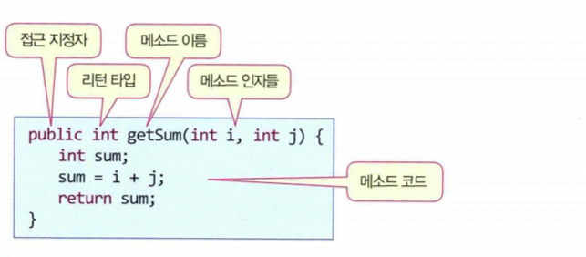


> 인자 전달

자바의 메소드 호출 시 인자 전달 방식(argument passing)은 '값에 의한 호출'(call-by-value)이다. 호출하는 실인자의 값이 복사되어 메소드의 매개 변수에 전달된다.

- 기본 타입의 값이 전달되는 경우

  메소드의 매개변수가 기본 타입(byte, char, short, int, long, float, double, boolean)으로 선언된 경우, 호출자(caller)가 건네는 값이 매개변수에 복사되어 전달된다.  
  아래 그림은 기본 타입의 값이 전달되는 사례이다. 코드의 실행 과정을 알아보자.

  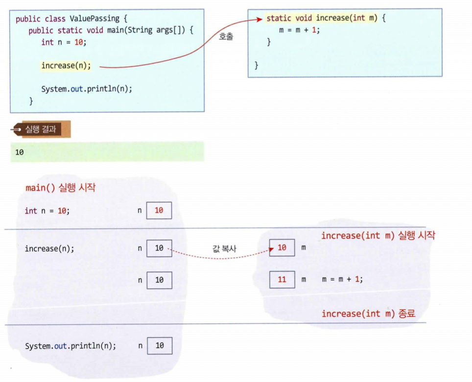

  main()의 다음 코드는 변수 n에 저장된 값 10을 increase() 메소드에 전달한다.

  ```java
  int n = 10;
  increase(n);
  ```

  Increase(int m) 메소드가 호출되면, 매개변수 m이 생성되고 10으로 초기화된다. 그러고나서 m 값을 1 증가시킨다.  
  Increase()에서 리턴하여 main() 메소드로 돌아오면 변수 n 값은 여전히 10으로 남아 있다.

- 객체가 전달되는 경우

  메소드의 매개변수가 클래스 타입인 경우, 객체가 아니라 객체의 레퍼런스 값이 전달된다. 아래 그림은 객체가 전달되는 코드와 실행 과정을 보여준다.

  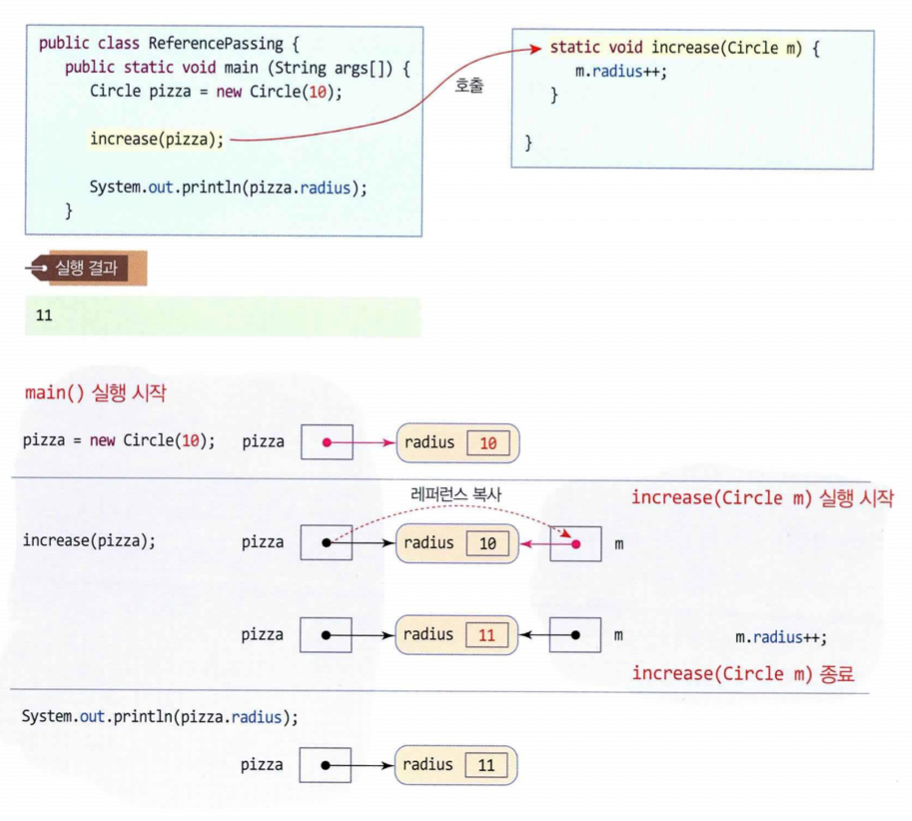

  다음 코드를 보자.

  ```java
  increase(pizza);
  ```

  이 호출문에 의해 increase(Circle m)가 호출되면 매개변수 m이 생기고, pizza 변수에 저장된 값(레퍼런스)이 m에 복사되어, m은 pizza가 가리키는 객체를 함께 가리키게 된다.  
  그러므로 m.radius++;에 의해 radius는 11로 변경되고 increase()가 종료한 후에도 그대로 남는다. 메소드 호출 시 객체가 전달되는 경우, 객체에 대한 레퍼런스만 전달되지 객체가 통째로 복사되지 않는다는 점을 유념하기 바란다.

- 배열이 전달되는 경우

  배열이 메소드에 전달되는 경우도 객체 레퍼런스가 전달되는 경우와 동일하다. 배열이 통째로 전달되는 것이 아니며 배열에 대한 레퍼런스만 전달된다.  
  아래 그림은 배열이 전달되는 예를 보여준다. main()에서 생성된 배열 a가  increase()에 전달된다. Increase(int [] array)의 매개변수 array는 정수형 배열에 대한 레퍼런스로서 배열 a를 가리키게 되어 두 레퍼런스는 하나의 배열을 공유하게 된다.  
  Increase() 메소드에서 array 배열의 각 원소를 1씩 증가시키고 리턴한 후, main()에서 배열 a를 출력하면 변경된 값 2 3 4 5 6이 출력된다.

  


> 메소드 오버로딩

자바에서는 한 클래스 내에, 이름이 같지만 매개변수 타입이나 개수가 서로 다른 여러 개의 메소드를 중복 작성할 수 있다. 이것을 메소드 오버로딩(method overloading) 혹은 메소드 중복이라고 부른다.  
메소드 오버로딩은 자바 다형성의 한 경우이다. 여러 개의 메소드가 오버로딩되려면 다음 두 조건을 모두 만족하여야 한다.

- 메소드 이름이 동일하여야 한다.
- 매개변수의 개수나 타입이 서로 달라야 한다.

메소드의 리턴 타입이나 접근 지정자는 메소드 오버로딩과 관계없다.

- 메소드 오버로딩 성공 사례

  다음은 2개의 getSum() 메소드가 정상적으로 오버로딩된 사례이다. 메소드 이름이 동일하고 매개변수의 개수가 서로 다르기 때문에, 두 메소드는 한 클래스 내에 공존하는데 아무 문제가 없다.

  ```java
  class MethodOverloading {			// getSum() 메소드의 정상적인 오버로딩 사례
    public int getSum(int i, int j) {
      return i + j;
    }
    public int getSum(int i, int j, int k) {
      return i + j + k;
    }
  }
  ```

- 메소드 오버로딩 실패 사례

  메소드 오버로딩은 자바 컴파일러에 의해 판단되며, 컴파일러가 이름이 같은 메소드들을 구분할 수 있으면 메소드 오버로딩이 성공한다. 다음 코드는 오버로딩이 실패한 경우이다.

  ```java
  class MethodOverloadingFail {
    public int getSum(int i, int j) {
      return i + j;
    }
    public double getSum(int i, int j) {		// 위의 getSum() 메소드와 매개변수의 개수, 타입이 모두 같기 때문에 메소드 오버로딩 실패
      return (double)(i + j);
    }
  }
  ```

  앞의 코드에서 2개의 getSum() 메소드의 매개변수 개수와 타입이 모두 같다. 그러므로 자바 컴파일러는 컴파일 오류를 발생시킨다.  
  리턴 타입은 메소드를 구분하는 기준으로 사용하지 않는다.

- 오버로딩된 메소드 호출

  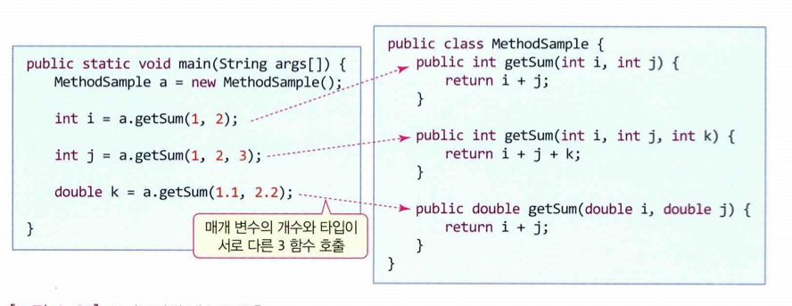

  이제 오버로딩된 메소드를 호출하는 경우에 대해 알아보자. MethodSample 클래스에는 3개의 getSum() 메소드가 작성되어 있고  main() 메소드는 getSum()을 호출하는 여러 문장이 있다.  
  자바 컴파일러는 각 호출문에 대해, 매개변수의 타입과 개수에 일치하는 getSum() 메소드를 찾아낸다.


## 객체의 소멸과 가비지 컬렉션

> 객체의 소멸

new 연산자를 사용해서 객체를 생성할 수 있지만 객체를 소멸시키는 연산자는 없다. 이말인즉슨, 자바에서는 개발자가 마음대로 객체를 소멸시킬 수 없다는 말이다.  
객체 소멸이란 new에 의해 생성된 객체 공간을 자바 가상 기계에 돌려주어 가용 메모리(available memory)에 포함시키는 것이다.  
다른 객체 지향 언어는 C++에는 delete 연산자를 두고 있으며, delete 연산자가 실행되면 객체가 소멸된다. C++의 경우 객체가 소멸될 때 소멸자(destructor) 함수가 호출되어 객체가 사라질 때 필요한 마무리 작업을 수행하도록 한다.  
그러면 자바에서 new로 할당받은 후 사용하지 않게 된 객체 메모리는 어떻게 되는가? 이들은 가비지(garbage)라고 부르며, 자바 가상 기계의 가비지 컬렉터(garbage collector)가 적절한 시점에 자동으로 수집하여 가용 메모리에 반환시킨다.


> 가비지

가비지(garbage)란 자바 응용프로그램에서 더 이상 사용되지 않게 된 객체나 배열 메모리이다. 그러면 자바 플랫폼은 가비지를 어떻게 알아내는가? 참조하는 레퍼런스가 하나도 없는 객체나 배열을 가비지로 판단한다.  
왜냐하면 이 객체는 응용프로그램이 더 이상 접근할 수 없기 때문이다. 아래 그림은 가비지의 발생 사례를 보여준다.

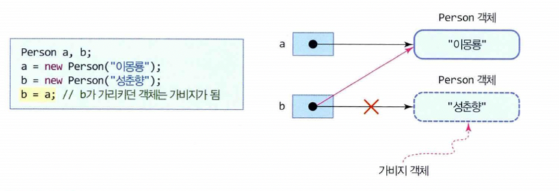

다음 코드를 실행하면 2개의 Person 객체가 생긴다.

```java
a = new Person("이몽룡");
b = new Person("성춘향");
```

그러고 나서 다음 라인을 실행해보자.

```java
b = a;
```

레퍼런스 b는 a가 가리키던 객체를 가리키게 되고, b가 기리키던 처음 객체는 아무도 참조하지 않게 되어 더 이상 접근할 수 없게 되었다. 이 객체가 바로 가비지이다.


> 가비지 컬렉션(garbage collection)

가비지는 더 이상 참조되지 않기 때문에 가비지가 차지하고 있는 메모리 공간은 회수되어야 한다.  
가비지가 많아지면 자바 플렛폼이 응용프로그램에게 할당해줄 수 있는 가용 메모리 양이 줄어줄게 된다. 시간이 지날수록 자연히 가비지가 늘어나게 되며, 최악의 경우 자바 플랫폼의 가용 메모리가 0이 되면 자바 응용프로그램은 더 이상 실행될 수 없게 된다.  
이런 경우를 대비하여 자바 플랫폼은 가용 메모리가 일정 크기 이하로 줄어들면 자동으로 가비지를 회수하여 가용 메모리를 늘린다.  
이것을 가비지 컬렉션이라고 부르며, 가비지 컬렉션은 자바 플랫폼에 의해 준비된 가비지 컬렉션 스레드(garbage collection thread)에 의해 처리된다.  
PC의 경우 워낙 메모리가 크기 때문에, 가용 메모리가 거의 없어지는 극한 상황은 잘 일어나지 않아 메모리 부족으로 인한 가비지 컬렉션이 작동하는 것을 보기 쉽지 않다. 또한 자바 플랫폼 내부의 판단에 의해 가비지 컬렉션이 수행되므로 언제 가비지 컬렉션이 일어날지 알기 어렵다.  
비교적 큰 규모의 자바 프로그램 개발 경험을 가진 개발자들은 가끔 프로그램을 테스트하는 도중 프로그램의 실행이 일시적으로 중단된 것처럼 보이는 경험을 한 적이 있을 것이다.  
규모가 큰 자바 프로그램은 실행 중 비교적 많은 양의 가비지를 생산한다. 그러다가 가끔 가용 메모리가 부족해지는 경우가 있는데, 이때 가비지 컬렉터가 실행되며 응용 프로그램은 실행을 멈추고 가비지 컬렉션이 끝나기를 기다리게 되어, 사용자의 눈에는 프로그램이 중단된 것처럼 보인다.  
이런 이유로 자바는 실시간 처리 응용에는 부적합한 것으로 알려져 있다.


> 가비지 컬렉션 강제 요청

응용프로그램에서 System 또는 Runtime 객체의 gc() 메소드를 호출하면 가비지 컬렉션을 요청할 수 있다. 간단히 다음 한 줄의 코드로 가능하다.

```java
System.gc();		// 가비지 컬렉션 강제 요청
```

그러나 이 문장을 호출한 즉시 가비지 컬렉터가 작동하는 것은 아니다. 이 문장은 가비지 컬렉션이 필요하다는 요청에 불과하며, 가비지 컬렉션은 자바 플랫폼이 전적으로 판단하여 적절한 시점에 작동시킨다.


## 접근 지정자

객체 지향 언어에는 접근 지정자를 두고 있다. 객체를 캡슐화하기 때문에, 객체에 다른 객체가 접근하는 것으로 허용할지, 말지를 지정할 필요가 있기 때문이다.


> 패키지

자바는 서로 관련 있는 클래스 파일들을 패키지(package)에 저장하여 관리하도록 한다. 패키지는 디렉터리 혹윽 폴더와 같은 개념이며,  
개발자는 클래스 파일들을 여러 패키지에 분산 관리하는 것이 일반적이며, 아래 그림은 개발자가 3개의 패키지로 나누어 응용프로그램을 작성한 사례이다.

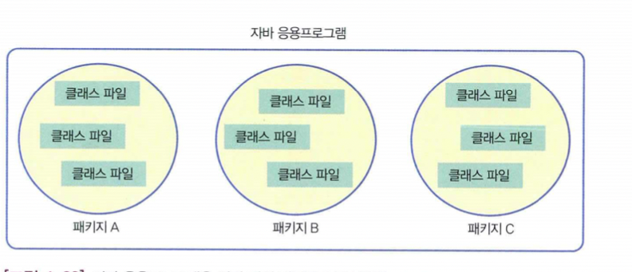


> 자바의 4가지 접근 지정자

접근 지정자(access specifier)는 클래스나 멤버들을 다른 클래스에서 접근해도 되는지의 여부를 선언하는 지시어이다.  
자바에는 다음 4가지 접근 지정자가 있다.

- private, protected, public, 접근 지정자 생략(디폴트 접근 지정)


> 클래스 접근 지정

클래스 접근 지정이란 다른 클래스에서 이 클래스를 활용할 수 있는지 허용 여부를 지정하는 것으로 말한다.

- public 클래스

  public으로 선언된 클래스로서, 패키지에 상관없이 다른 어떤 클래스에게도 사용이 허용된다.  
  다음은 클래스 World를 public으로 선언하는 사례이다. 다른 클래스에서 World 클래스의 객체를 생성하는 등 활용할 수 있다.

  ```java
  public class World { // public 클래스
    .....
  }
  ```

- 디폴트 클래스(접근 지정자 생략)

  접근 지정자 없이 클래스를 선언한 경우, 디폴트(default) 접근 지정으로 선언되었다고 한다.  
  다음은 클래스 Local을 디폴트 클래스로 선언한다.

  ```java
  class Local { // 디폴트 클래스
    .....
  }
  ```

  디폴트 클래스는 같은 패키지 내의 클래스들에게만 사용이 허용된다.  
  아래 그림을 통해 public 클래스와 디폴트 클래스에 대한 접근 사례를 알아보자. 클래스 B는 public 클래스이기 때문에 패키지 P, Q에 상관없이 어떤 클래스에서도 사용할 수 있다.  
  클래스 C는 디폴트 클래스이므로 패키지 Q 내에서는 사용이 허용되지만, 패키지 P의 클래스 A에게는 접근(사용)이 허용되지 않는다. 클래스를 접근할 수 없으면 당연히 그 클래스 내의 멤버도 접근할 수 없다.

  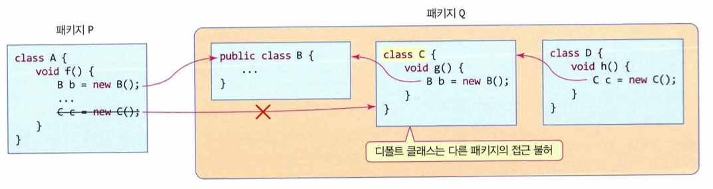


> 멤버 접근 지정

이제 클래스 멤버에 대한 접근 지정을 알아보자. 멤버에 대한 접근 지정자는 아래 그림과 같으며, private -> 디폴트 -> protected -> public 순으로 공개의 범위가 넓어진다.

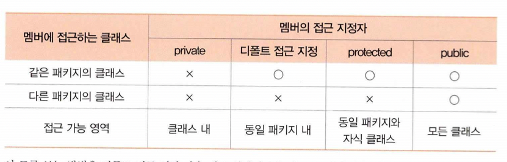

- public 멤버

  public 멤버는 패키지를 막론하고 모든 클래스들이 접근 가능하다. 아래 그림은 다른 패키지에 있는 클래스 A나 동일 패키지에 있는 클래스 C가, 클래스 B의 public으로 선언된 n, g()에 접근 가능함을 보여준다.

  

- private 멤버

  private 접근 지정자는 비공개를 지시하는 것으로, private 멤버는 클래스 내의 멤버들에게만 접근이 허용된다. 아래 그림은 private 멤버에 대한 접근 불가능 사례를 보여준다. 클래스 B의 private 멤버 n, g()는 클래스 A, C 모두에서 사용될 수 없다.

  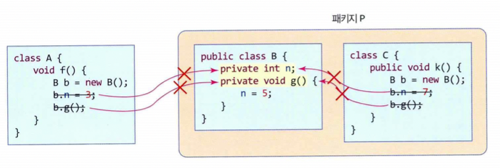

- protected 멤버

  protected 접근 지정자는 보호된 공개를 지시하는 것으로, 2가지 유형의 클래스에만 접근을 허용한다.  
  첫째, 같은 패키지의 모든 클래스에 접근이 허용된다. 둘째, 다른 패키지에 있더라도 자식 클래스의 경우 접근이 허용된다.  
  아래 그림의 예를 보자. 클래스 B의 protected 멤버인 n, g()는 동일한 패키지에 있는 클래스 C와, 다른 패키지에 있지만 클래스 B를 상속받은 클래스 D에게 접근이 허용된다.

  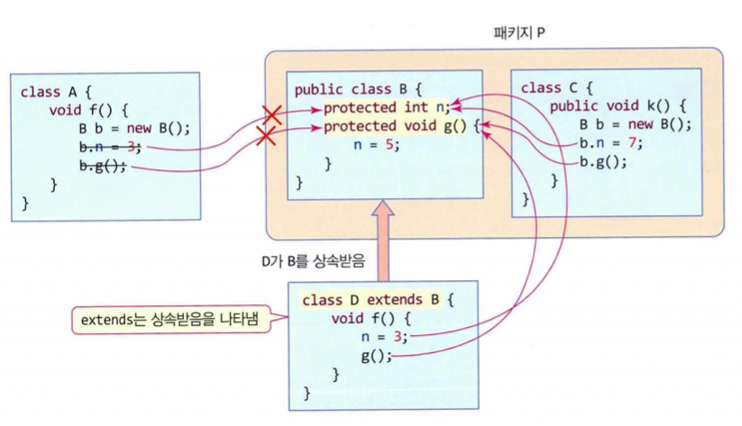

- 디폴트 멤버(default 또는 package-private)

  접근 지정자가 생략된 멤버의 경우, 디폴트(default) 멤버라고 한다. 동일한 패키지 내에 있는 클래스들만 디폴트 멤버를 자유롭게 접근할 수 있다. 아래 그림은 디폴트 멤버에 대한 접근 사례를 보여준다. 클래스 C는 동일한 패키지에 있는 클래스 B의 디폴트 멤버 n, g()에 대해 접근이 가능하지만 다른 패키지에 있는 클래스 A는 접근이 불가능하다.

  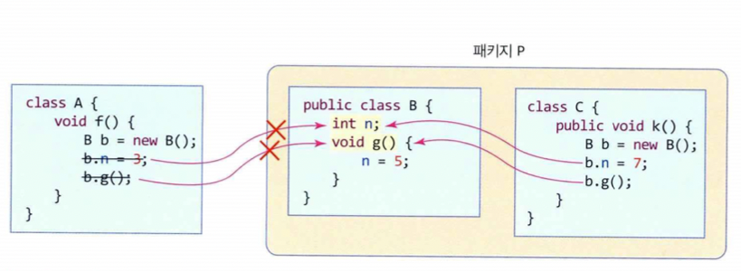

  

