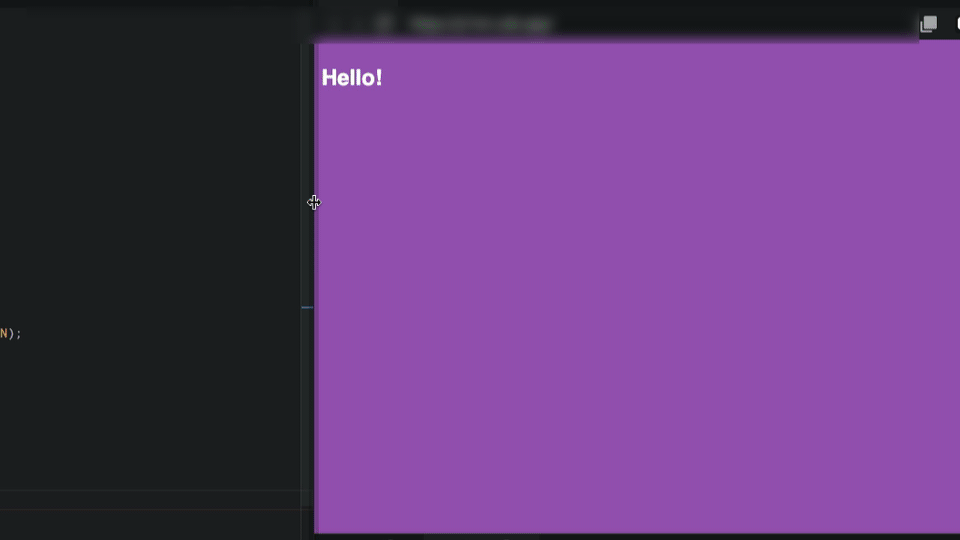

# Day 5 Challenge

## 코드 챌린지

# if, else, events.

- 오늘의 강의: [바닐라JS로 크롬앱 만들기: From #2.13 to #3.8](https://nomadcoders.co/javascript-for-beginners/lectures/2886)
- 오늘의 과제: 위의 강의를 시청하신 후, 아래 코드 챌린지를 제출하세요.
- 제출기간: 익일 오전 6시까지

### 조건

- Use if/else etc.

