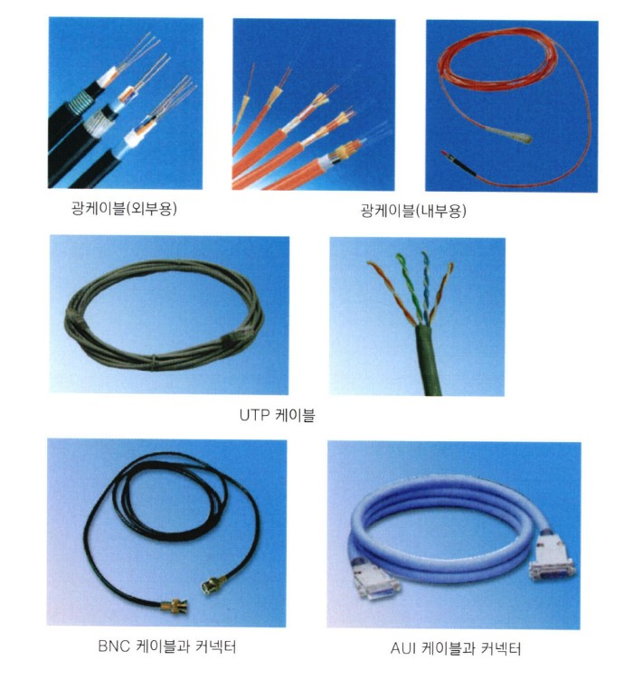
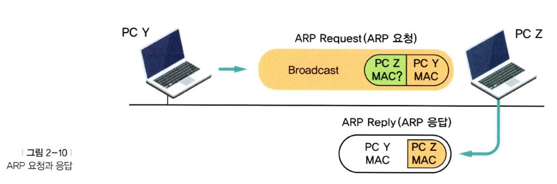
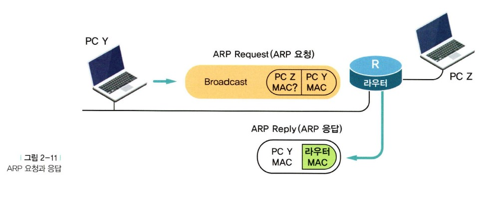
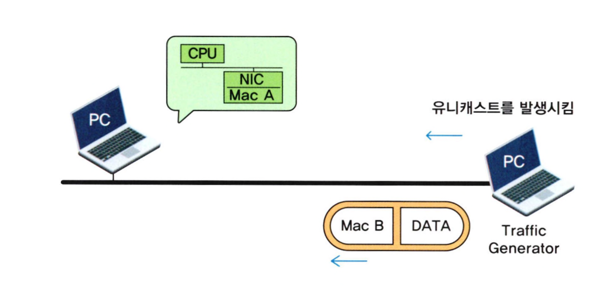
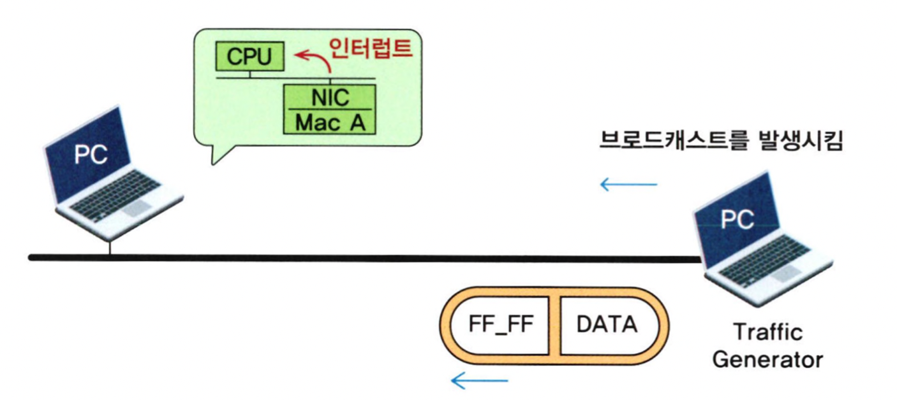
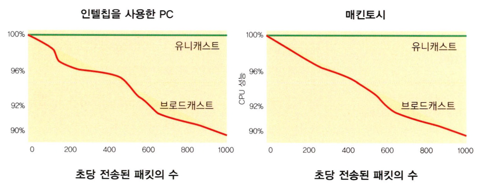
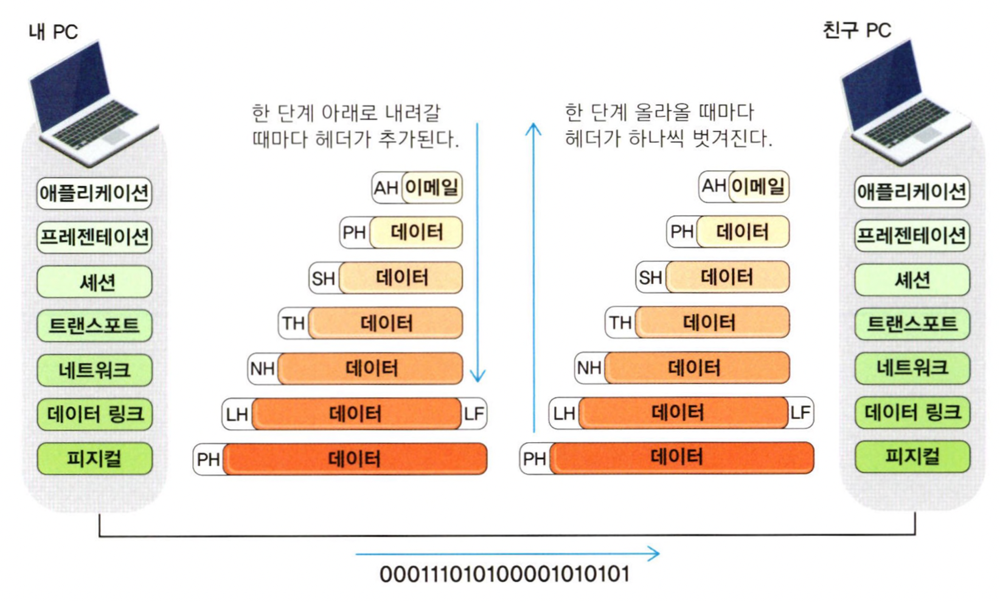

# 네트워크와 케이블, 그리고 친구들


## 목차

- LAN(Local Area Network)이란?
- 이더넷은 인터넷의 친구?
- 그럼 토큰링(TokenRing)은요?
- UTP 케이블만이라도 제대로 알아볼까요?
- 케이블, 이 정도만 알면
- 맥 어드레스(MAC Address)에 대한 이야기
- 유니캐스트, 브로드캐스트, 멀티캐스트
- OSI 7 Layer(레이어, 계층)는 왜 만들어졌나요?
- 컴퓨터는 프로토콜(Protocol)로 말한다


## LAN(Local Area Network)이란?

네트워크를 하다 보면 가장 먼저 만나는 것이 'LAN'이란 단어입니다.

LAN이란, 네트워크에서 가장 자주 나오는 말로 'Local Area Network'의 약자로 Local, 즉 '어느 한정된 공간에서 네트워크를 구성한다'는 것입니다.

예를 들어 한 사무실에 컴퓨터가 30대 있는데, 이것들을 네트워크로 구성한다면 '사무실에 LAN을 구축한다'라고 말합니다.

LAN과 비교되는 말로 WAN이 있습니다.

WAN은 'Wide Area Network'의 약자로서 '멀리 떨어진 지역을 서로 연결하는 경우'에 사용합니다.  
요즘은 모두 인터넷을 쓰는 세상이니 인터넷에 접속하는 것은 WAN이라고 봐야 할 겁니다. 그래서 요즘은 네트워킹을 한다고 하면 주로 LAN과 WAN이 공존합니다. 예전처럼 랜이나 왠을 설치한다고 하는 대신에 '네트워킹을 한다'라고 말하는게 요즘 추세입니다.

마무리 하자면 LAN은 한정된 지역 안에서의 네트워크 구축이고, WAN은 서로 멀리 떨어진 곳을 네트워크로 연결하는 것입니다.


## 이더넷은 인터넷의 친구?

그럼 이더넷(Ethernet)은 또 뭘까요? 이더넷은 네트워킹의 한 방식입니다. 즉 네트워크를 만드는 방법 중 하나라고 생각하면 됩니다. 이러한 이더넷 방식의 가장 큰 특징은 CSMA/CD라는 프로토콜을 사용해서 통신을 한다는 것입니다.

생각보다 알아야 할 것이 많아지지만 우리나라에서 사용하는 대부분의 네트워킹 방식이 바로 이런 이더넷 방식이기 때문에 이더넷에 대해 어느 정도 이해해야 합니다.

예를 들어보면, 네트워킹 방식은 이더넷 방식 말고도 토큰링 방식도 있었고, FDDI 방식도 있었으며, ATM방식도 있었습니다. 어떤 네트워킹 방식을 사용하느냐에 따라 랜카드를 비롯하여 구입해야 하는 네트워크 장비들이 다릅니다.

다시 말해, 자신의 네트워킹 방식을 모르고는 랜카드 한 장도 함부로 살 수 없습니다. 그러므로 네트워킹이 어떤 방식인지와 어떤 식으로 통신을 하는지를 알아두면 훨씬 도움이 될 것입니다.

이더넷의 CSMA/CD라는 통신 방식에 대해서 한번 알아보겠습니다.

CSMA/CD는 'Carrier Sense Multiple Access/Collision Detection'을 줄여서 부르는 방식입니다.  
이 통신 방식을 한 마디로 이야기하자면 '대충 알아서 눈치로 통신하자'입니다. 이것이 무슨 말인지 살펴보겠습니다.

이더넷 환경에서 통신을 하고 싶은 PC나 서버는 먼저 지금 네트워크상에 통신이 일어나고 있는 지를 확인합니다.  
즉 우리 네트워크 자원을 쓰고 있는 PC나 서버가 있는지를 확인해보는 것입니다.  
이것은 다시 말하면 캐리어(네트워크상에 나타나는 신호)가 있는지를 감지하는 겁니다. 이것을 바로 'Carrier Sense'라고 합니다.  
이때 만약 캐리어가 감지되면, 다시 말해서 누군가가 네트워크상에서 통신을 하고 있으면 자기가 보낼 정보가 있어도 못 보내고 기다립니다. 그러다가 네트워크에서 통신이 없어지면(이때는 캐리어가 감지되지 않음) 눈치를 보다가 무조건 자기 데이터를 네트워크상에 실어서 보냅니다.

그런데 만약 네트워크상에서 두 PC나 서버가 보낼 데이터를 가지고 눈치를 살피고 있었다고 가정해보겠습니다.  
그러다가 네트워크상에서 통신이 일어나지 않고 있다는 것을 알아낸 뒤, 바로 자신의 데이터를 네트워크상에 실어서 보냈습니다. 물론 두 PC나 서버가 그것도 동시에 말입니다.  
이더넷에서는 이렇게 2개 이상의 PC나 서버가 동시에 네트워크상에 데이터를 실어 보내는 경우가 발생할 수 있습니다. 이 경우를 바로 'Multiple Access(다중 접근)'라고 합니다.

통신에서 이렇게 2개의 장비들이 데이터를 동시에 보내려다 부딪치는 경우를 충돌(콜리전, Collision)이 발생했다고 합니다.  
따라서 이더넷에서는 데이터를 네트워크에 실어서 보내고 나서도 혹시 다른 PC 때문에 콜리전이 발생하지 않았는지를 잘 점검해야 합니다.  
그것이 바로 'Collision Detection(충돌 감지)'이라는 겁니다. 그러다 만약 콜리전이 발생하게 되면 데이터를 전송했던 PC들은 랜덤(Random)한 시간 동안 기다린 후 다시 데이터를 전송하게 됩니다.  
여기서 랜덤한 시간이란, 우리가 느끼지 못할 만큼 작은 시간입니다.

암튼 콜리전, 즉 충돌이 발생하면 다시 보낸다는 겁니다. 그런데 이렇게 기다렸다가 보내도 또 충돌이 발생했다면 어떻게 할까요? 네, 또 기다렸다가 보냅니다. 충돌이 생기면 기다렸다 다시 보내고, 또 충돌이 나면 기다렸다 다시 보내고, 이렇게 15번을 했는데도 충돌이 나면 그냥 포기하게 됩니다.

따라서 이더넷에서 충돌, 즉 콜리전이 발생하는 것은 이더넷의 CSMA/CD라는 특성상 자연스러운 일이지만, 너무 많은 충돌이 발생하게 되면 통신 자체가 불가능해지는 경우도 생길 수 있습니다.  
이런 문제를 어떻게 하면 방지할 수 있는지는 다음에 계속 알아보도록 하겠습니다.


## 그럼 토큰링(TokenRing)은요?

그럼 이번에는 토큰링에 대해서 알아보겠습니다.  
토큰링 방식의 네트워크에서 데이터를 전송하고자 하는 PC는 이더넷처럼 자기 맘대로 보내고 싶을 때 남들이 전송만 하지 않고 있으면 막 보내는게 아닙니다.  
그 네트워크에서 오직 한 PC, 즉 토큰을 가진 PC만이 네트워크에 데이터를 실어 보낼 수 있는 겁니다. (일반적으로 한 네트워크에 토큰이 하나만 존재, 물론 여러 개인 경우도 있다.)  
데이터를 다 보내고 나면 바로 옆 PC에 토큰을 건네주게 됩니다. 만약 전송할 데이터가 없다면 토큰을 다시 옆 PC에 전달합니다. 이렇게 옆으로 전달하는 방식으로 통신이 이루어지는 겁니다.  
그래서 토큰링에서는 당연히 충돌(Collision)이 발생하지 않습니다. 또 네트워크에 대한 성능을 미리 예측하기도 쉽습니다.

그 대신 단점도 있습니다. 내가 지금 바로 보내야 할 데이터가 있고, 다른 PC들은 보낼 데이터가 하나도 없다고 하더라도 차례가 올 때까지 계속 기다려야 됩니다.  
비록 다른 PC들은 보낼 데이터가 없더라도 토큰은 계속 옆으로만 전달되기 때문입니다. 1990년대 초반까지만 해도 이더넷보다 안정된 기술이라는 주장이 나오면서 토큰링 방식이 인기를 끌던 시절이 있었지만,  
그 후 이더넷의 눈부신 발전으로 이제 토큰링은 역사의 뒤안길로 사라지기 시작했습니다. 참고로 토큰링 방식은 IBM이 처음 개발했습니다.


## UTP 케이블만이라도 제대로 알아볼까요?

네트워크를 구성하면서 가장 자주 만나는 것이 바로 케이블이 아닐까 생각합니다.  
네트워크에 대한 공부를 하려고 하면 무조건 장비만 공부하는 분들이 계신데, 이렇게 열심히 공부하고 막상 네트워크를 설치하러 가보면 자주 문제가 생기는 부분은 장비보다는 케이블인 경우가 많습니다.  
따라서 케이블에 대한 이해는 꼭 필요한 부분일 수밖에 없습니다. 여기서 케이블이란, 전화 케이블이나 전원 케이블이 아니고 통신 케이블을 말합니다. 

이런 통신 케이블들은 장비와 장비의 연결에는 어디에나 들어갑니다.  
즉 PC에서 허브나 스위치까지의 연결, 스위치와 스위치의 연결, 스위치와 라우터의 연결, 라우터와 라우터의 연결 등 네트워크 장비와 네트워크 장비를 연결하기 위해서는 어떤 종류의 케이블이든 반드시 케이블이 들어가게 되는 겁니다.  
이렇게 들어가는 케이블은 광케이블, UTP 케이블, 동축 케이블 등 종류도 가지가지 입니다.

이번에는 이 중에서 우리가 가장 많이 사용하는, 거의 모든 사무실과 게임방이 사용하고 있는 UTP 케이블에 대해서 한번 알아보도록 하겠습니다.

그럼 UTP 케이블의 의미는 무엇일까요? 일단 TP 케이블이란 Twisted-pair, 즉 '꼬인 녀석이다'라는 거죠.  
페어(페어는 한 쌍, 즉 두 가닥을 의미합니다.)가 서로 꼬여 있는 것을 말합니다. 그래서 'TP'라고 하는 겁니다. TP에는 UTP와 STP가 있습니다.

UTP는 Unshielded(언쉴드, 즉 감싸지 않았다는 거겠죠?) TP를 말합니다. 주로 우리가 사용하는 케이블이 바로 이 UTP입니다.  
STP는 Shielded로 케이블의 주위를 어떤 절연체로 감싸서 만든 것을 말합니다. STP가 좀 더 비싸고 성능이 좋다고 합니다. EMI를 줄였다고 하네요.

아무튼 그래도 기존에 워낙 UTP로 구성된 네트워크가 많았기 때문에 결국은 UTP가 중심을 이루게 되었고, STP는 주로 토큰링쪽에 많이 쓰이고 있는 추세입니다.  
자, 그러면 우리가 보통 말하는 카테고리 5나 카테고리 3이니 하는 것은 무엇을 의미하는 것일까요? 말이 나온 김에 카테고리별로 한번 알아볼까요?

- 카테고리 1 : 주로 전화망에 사용하는 용도로 만들어진 케이블입니다. 따라서 데이터 전송용으로는 맞지 않습니다.

- 카테고리 2 : 데이터를 최대 4Mbps의 속도로 전송할 수 있는 능력을 가지고 있는 케이블이라고 합니다.
- 카테고리 3 : 10 Base T 네트워크에 사용되는 케이블입니다. 전에는 UTP 케이블이라고 하면 바로 이 케이블을 이야기할 정도로 일반적인 케이블이었습니다. 최대 10Mbps 속도까지 데이터 전송을 할 수 있습니다.  
  잘만 구성하면 100Mbps 속도에서 적용이 가능한 케이블이지만, 실제로 이 케이블을 가지고 100Mbps를 구성하는 것은 매우 드뭅니다.
- 카테고리 4 : 토큰링 네트워크에서 사용되는 케이블입니다. 최대 16Mbps의 데이터 전송 능력을 가지고 있다고 합니다.
- 카테고리 5 :지금까지는 최대 전송 속도 100Mbps를 지원하는 Fast Ethernet용으로 사용되었습니다. 그런데 얼마 전에 기가비트 표준이 완성되면서 이제 이 케이블로도 기가비트 속도의 데이터 전송이 가능해졌습니다.  
  (이 경우에는 8가닥을 모두 사용해야 가능합니다.)
- 카테고리 6 : 기가비트 이상의 속도에 적합한 케이블입니다. 최근 사용하는 케이블 중 가장 많은 종류가 바로 카테고리 6 케이블이랍니다.  
  카테고리 6케이블은 Cat6와 Cat6a로 구분되는데, 뒤에 나온 Cat6a 케이블이 좀 더 성능이 개선된 케이블이고, 최대 10Gbps를 지원한다고 합니다.
- 카테고리 7 : 주로 10Gbps 속도 이상을 지원하기 위한 케이블로, 아직까지 많이 사용되지 있진 않지만 앞으로 점점 더 많이 사용될 케이블이랍니다.  
  이제 곧 10Gbps가 일반화되고 나면 좀 더 자주 보게 될 케이블이기도 합니다.

여기까지만 알아둬도 TP 케이블에 대한 개념을 잡을 수 있습니다.


## 케이블, 이 정도만 알면

자, 이번에는 우리가 흔히 사용하는 케이블의 종류에는 어떤 것이 있는지 한번 알아보겠습니다. 일단 우리가 케이블 종류를 말할 때는 약간의 법칙이 있습니다.

예를 들어 볼까요?

10 Base T에서 일단 맨 앞에 나오는 10이란 숫자는 속도를 나타냅니다.  
즉 여기서 10이란, 10Mbps의 속도를 지원하는 케이블을 의미합니다. 그다음에 나오는 Base란 말은 이 케이블이 Baseband용 케이블이라는 것을 알려주고 있습니다.  
원래 케이블 종류에는 베이스밴드(Baseband)와 브로드밴드(Broadband)가 있는데, 쉽게 생각해서 베이스밴드는 디지털 방식이고, 브로드밴드는 아날로그 방식이라고 생각하면 됩니다.

자, 그다음은 T라고 되어 있네요. 원래 이 자리에는 케이블의 종류 또는 이 케이블이 전송할 수 있는 최대 거리가 나오게 되어 있습니다.

위의 예, 즉 10 Base T에서는 케이블의 종류가 나온 겁니다. 그래서 T란, TP(Twisted Pair) 케이블이라는 것을 나타냅니다. 이것이 바로 우리가 보통 사용하는 UTP 케이블을 나타냅니다.

만약 맨 뒷자리에서 위에서처럼 글자가 나오지 않고 숫자가 나오면, 예를 들어 '10 Base 5'일 때 맨 뒤에 나오는 숫자는 최대 통신 거리입니다.  
따라서 최대 500미터까지 통신이 가능하다는 것을 뜻합니다.

즉 10 Base 5 케이블은 10M의 속도로 최대 500미터까지 전송이 가능한 케이블을 말합니다.  
그런데 이 케이블은 전에는 많이 썼지만 요즘은 쓰지 않고 있습니다. (너무 두껍고, 전송 거리도 짧고, 게다가 10Mbps 속도밖에 지원하지 않기 때문입니다.)

그럼 말이 나온 김에 요즘 우리가 많이 쓰는 케이블을 한번 알아보겠습니다.

- 10 Base T : 10Mbps로 통신하고, 최대 전송 거리 100미터인 UTP 케이블로, 카테고리 3, 4, 5를 사용할수 있습니다.  
  이 케이블에는 RJ45 잭은 사용해서 연결해 줍니다.
- 10 BASE FL : 10Mbps로 통신하는 케이블인데 광케이블입니다. 즉 뒤에 나오는 FL(Fiber-optic)이 광케이블이란 것을 알려주고 있습니다.  
  이 케이블은 ST 커넥터라는 것을 사용해서 연결하고 광케이블은 싱글 모드 또는 멀티 모드 케이블을 사용합니다.
- 10 Base 2 : 10Mbps로 통신이 가능하고, 최대 200미터(정확히는 185미터)까지 전송이 가능한 케이블입니다.  
  몇 년 전까지만 해도 이 케이블을 사무실에서 가장 많이 사용했습니다. 그런데 요즘은 UTP 케이블에 밀려서 완전히 자취를 감추고 말았습니다.  
  이 케이블은 그냥 'Thin 케이블'이라고도 불렀고 BNC 커넥터를 사용했습니다.  
  혹시 구형 랜카드를 가지고 계신분들은 랜카드에 UTP 잭 말고 동그란 뭔가를 끼우게 되어 있는 것을 볼 수 있는데 바로 그게 10 Base 2가 사용하던 BNC 커넥터를 연결하던 곳입니다.  
  참고로 이 케이블은 전깃줄 두께의 까만색 케이블입니다.
- 10 Base 5 : 10Mbps 통신을 지원하는 케이블이고 최대 거리는 500미터로 두껍게 생겼다고 해서 'Thick 케이블'이라고 부르거나 색이 노랗다고 해서 '옐로우(Yellow) 케이블'이라고 부릅니다.  
  주로 백본 케이블, 즉 중앙망용으로 천장 위에 설치하고 트랜시버 케이블을 이용해서 천장에서 하나씩 뽑아 내린 다음에 PC의 랜카드와 연결했습니다.  
  랜카드 중에 AUI 인터페이스(15핀으로 생긴 사다리꼴 인터페이스)를 가진 것이 바로 이 케이블과 연결하기 위한 인터페이스가 됩니다.
- 100 Base TX : Category 5 UTP 케이블을 사용하는 케이블이고 최대 거리는 100미터, 전송 속도는 100Mbps짜리 케이블입니다.
- 100 Base T2 : 원래 100Mbps 속도를 내려면 위에서처럼 Category 5 케이블을 사용하는데, 100 Base T2 방식을 쓰면 Category 3, 4 ,5를 전부 사용해서 100M를 구현할 수 있다고 합니다.  
  자주 쓰이는 방식은 아니니까 그냥 알아만 두세요.
- 100 Base T4 : Category 3 케이블을 가지고 100Mbps용으로 사용할 때 만드는 케이블입니다.  
  그대신 다른 케이블은 2페어(4가닥)를 사용하지만, 이것은 4페어(8가닥)를 전부 사용한다는 차이점이 있습니다.
- 100 Base FX : 이 케이블은 100Mbps 광케이블을 이용해서 구현하는 건데, 전송 거리가 보통 2km에서 10km까지 가능하고 SC라는 네모난 접속 커넥터를 이용해서 접속합니다.  
  물론 ST(동그랗게 생겨서 돌려서 끼우는 방식)도 사용하지만 일반적이지는 않습니다.
- 1000 Base SX : 이것은 기가비트, 즉 1,000Mbps의 속도가 나는 케이블입니다.  
  Short Wavelen-gth라는 광케이블을 사용하는데, 최대 전송 거리는 약 270미터(62.5micro meter = 1/1,000,000m)에서 550미터(50micro meter) 정도입니다.
- 1000 Base T : 1,000Mbps로 UTP 케이블을 통해 전송하고, 최대 거리는 100미터인 케이블 스펙입니다.  
  Category 5 케이블을 사용하면 됩니다. 기가비트용 UTP 케이블이 Category 5로 결정되었다는 이야기를 전에 한 번 했습니다.  
  그리고 이렇게 구성하기 위해선 4페어(8가닥)를 다 사용한다는 사실도 기억해두기 바랍니다.

기가비트의 경우는 위에 나온 1000 Base SX 외에도 1000 Base LX/LH 같은 스펙은 광케이블을 사용해서 최대 10킬로미터까지도 전송이 가능하도록 구성되어 있습니다.  
여기서 알아두셔야 할 것은 케이블의 경우 속도가 빨라지면 빨라질수록 전송 거리는 점점 짧아진다는 겁니다.  
왜 그런지는 뒤에서 알아보도록 하겠습니다.

지금까지 케이블의 스펙에 대해서 알아봤습니다. 물론 여기서 다루지 않은 것이 더 많습니다.  
하지만 이 정도만 알아두셔도 앞으로 케이블을 다루는데는 충분할 거라고 생각합니다.



케이블 사진입니다. 위쪽 줄이 광케이블입니다. 얇게 생긴 광섬유를 타고 전송이 이루어집니다.  
여기서 광케이블의 한 가닥을 '코어'라고 부르는데, 통신을 위해서는 최소 2코어의 광케이블이 필요합니다. (수신과 송신에 각각 하나씩 필요합니다.)  
따라서 우리는 광케이블을 이야기 할 때 "이게 몇 코어짜리 광케이블이다" 라고 말하곤 합니다.

그다음 가운뎃줄이 우리가 가장 많이 사용하는 UTP 케이블입니다. 보이는 것처럼 좀 꼬여있습니다.  
그림에서는 4가닥으로 보이지만 사실은 8가닥으로 2가닥이 하나로 꼬여있습니다. 그래서 UTP의 T가 바로 Twist, 즉 꼬였다는 뜻이라고 합니다.

그리고 아랫줄의 케이블은 이제는 기억 속에 사라져가는 BNC 케이블(10 Base-2)과 AUI 케이블입니다.  
이제 케이블 업계에서 사라진 녀석들이죠.  
AUI 케이블은 10 Base-5 케이블에 연결해서 사용하는 케이블이라고 생각하시면 쉬울 겁니다. 즉 두꺼운 10 Base-5 케이블을 두고 이 케이블의 중간중간에 '트랜시버'라는 것을 넣은 후 AUI 케이블의 한쪽 끝은 트랜시버에, 또 다른 끝은 PC나 네트워크 장비에 연결하는 겁니다.


## 맥 어드레스(MAC Address)에 대한 이야기

네트워크를 하다 보면 꼭 한 번은 짚고 넘어가야 할 것이 있습니다. 그중 하나가 미디어 액세스 컨트롤(Media Access Control)에 관한 것인데, MAC(맥)이 바로 이것의 준말입니다.

컴퓨터는 네트워크상에서 어떻게 서로를 구분해서 인식할까요? 즉 통신을 위해서는 서로를 구분할 일종의 주소가 필요합니다.  
우리가 편지를 서로 주고받기 위해서 각각의 건물이나 집에 서로 다른 주소가 필요한 것처럼 말입니다. 이 역할을 담당하는 주소가 바로 MAC 주소입니다.

이쯤 해서 네트워크를 조금 공부해보신 분이라면 분명히 어떤 질문 하나가 생각나실 겁니다.  
그것은 바로 IP 주소에 관한 것일 겁니다. 우리가 아는 대로 통신을 위해서 각 장비마다 IP 주소가 분명히 배정되고, 또 그 주소를 가지고 통신을 하는 것 아니냐고 질문을 하게 되실 겁니다.  
맞습니다. 앞에서 배운 대로 인터넷은 TCP/IP로 통신을 하고 따라서 통신을 위해서 IP 주소를 사용합니다. 그럼 이 경우에 맥 어드레스는 사용하지 않는 걸까요?  
일단 답은 '이 경우에도 맥 어드레스를 사용한다'입니다.

우리가 IP 주소를 사용하니까 IP 주소만 있으면 모든 통신이 일어날 것 같지만, 사실은 IP 주소를 다시 MAC으로 바꾸는 절차(이 과정을 ARP: Address Resolution Protocol이라고 합니다.)를 밟고 있는 겁니다.  
본인의 PC에 설치된 랜카드의 맥 어드레스는 ipconfig/all 명령어를 입력한 뒤 나오는 'Physical address' 또는 '물리적 주소'라고 보이는 주소가 바로 자신의 맥 어드레스입니다.



위 그림은 단독 네트워크, 즉 라우터를 거치지 않는 하나의 네트워크 안에서의 통신입니다. (여기서 여러분은 아직 라우터가 뭔지 아실 필요는 없습니다.)

PC Y가 PC Z와 통신을 하려고 합니다.

이때 PC Y는 PC Z의 IP 주소를 알고 있습니다. 그럼 PC Y는 자기가 속한 네트워크에 있는 모든 PC에 메시지를 보냅니다. (이것을 '브로드캐스트'라고 합니다)  
뭐라고 보내냐면, "우리 네트워크에 혹시 Z라는 녀석이 있으면 내가 통신하고 싶으니까 맥 어드레스 좀 알려주라." 이렇게 보냅니다.

이때 Z는 Y와 같은 네트워크에 있기 때문에 Y가 보낸 브로드캐스트를 받았을 겁니다. (원래 같은 네트워크 안에 사는 PC만이 브로드캐스트를 받을 수 있습니다.)  
그럼 Z는 Y에게 자신의 맥 어드레스를 알려주고 되고 Y는 Z의 맥 어드레스를 알아낸 다음에 비로소 통신을 시작하게 되는 겁니다.



위 그림은 호스트 Z가 다른 네트워크에 있는 경우입니다.  
즉 라우터를 넘어서 다른 네트워크에서 살고 있는 겁니다. 이 경우 호스트 Y가 브로드캐스트를 보내도 호스트 Z는 그 메시지를 받아볼 수 없습니다. (왜냐하면 중간에 있는 라우터가 브로드캐스트를 통과시키지 않기 때문입니다.)

그럼 이런 경우에는 통신이 안 된다는 걸까요?

그건 아닙니다. 앞의 경우처럼 PC Y가 "우리 네트워크에 혹시 Z라는 PC가 있으면 내가 통신하고 싶으니까 맥 어드레스 좀 알려주라."  
이렇게 메시지를 보내게 되면 Y와 연결되어 있는 라우터는 PC Z의 IP 주소를 보고 이 PC가 우리 네트워크에 살고 있지 않고 따라서 아무도 이 질문에 대답하지 않을 것을 알게 됩니다. (라우터는 똑똑한 녀석이거든요.)  
이것을 알게 된 라우터는 Y에게 라우터 자신의 맥 어드레스를 보내줍니다.  
"PC Y야, PC Z에게 뭘 보내고 싶으면 내게 보내. 내가 전달해줄게." 이런 편지를 같이 보내겠죠?

따라서 PC Y는 PC Z에게 정보를 보낼 때 받는 맥 어드레스를 라우터의 맥 어드레스로 해서 보내게 됩니다.  
그럼 그 정보는 라우터가 받은 후 Z가 살고 있는 해당 네트워크로 넘겨주는 거죠. 그쪽에 살고 있는 라우터에 전달해 주는 겁니다.  
그곳에 사는 라우터는 다시 자기 네트워크 안에 있는 PC Z의 맥 어드레스를 찾게 됩니다. 그리고 PC Z의 맥 어드레스를 알아낸 후 Z의 맥 어드레스를 이용해서 전달하게 되는 겁니다.  
좀 많이 복잡하죠? 아직은 이 내용을 이해 못 해도 상관없습니다. 그냥 IP 주소가 있어도 통신에서 맥 어드레스가 사용되는 거구나.. 이 정도만 알면 됩니다.

자, 여기까지만 말씀드리고, 다시 본론으로 돌아가서 MAC(Media Access Control) Address 란 무엇인가에 대해서 한번 알아보도록 하겠습니다.  
네트워크(여기서는 이더넷-Ethernet-입니다.)에 붙은 각 장비들은 48bit(6octet이 됩니다. 여기서 옥텟이란, 8개의 비트를 묶은 것을 말합니다.  
일단 '8개의 비트가 옥텟이다'라고 알고 넘어갑니다. 원래 옥텟이란 말이 8의 의미가 있으니까요. 그래서 '도레미파솔라시도'처럼 8음을 '옥타브'라고 합니다.)의 주소를 갖게 되는데,  
이 주소는 랜카드 또는 네트워크 장비에 이미 고정되어 있는 주소이고 유일한(즉 전 세계에서 유일한) 주소입니다.  
이 주소를 바로 '맥 어드레스' 또는 '하드웨어 주소'라고 합니다. 모든 랜(LAN)의 디바이스(device)들은 반드시 유일한 맥 어드레스를 가져야 합니다.  
따라서 랜카드 하나하나마다 서로 다른 맥 어드레스가 있고 또 라우터나 스위치에도 맥 어드레스가 들어있습니다. 물론 서버에도 들어있겠죠? 서버에는 랜카드가 설치될 거니까 말입니다.

맥 어드레스는 8자리마다 하이픈(-)이나 콜론(:), 점(.)으로 구분되기도 합니다.  
예를 들어 다음과 같이 나타냅니다.

```
00-60-97-8F-4F-86
00:60:97:F:4F:86
0060.978F.4F86
```

위의 3개는 모두 같은 호스트를 나타냅니다. (즉 같은 맥 어드레스입니다.) 여기서 여러분들은 갑자기 혼동되기 시작할 겁니다. 분명히 맥 어드레스는 48비트라고 했는데, 왜 여기 써있는 주소는 48자리 주소가 아닐까요?  
그것은 위에 써 있는 맥 어드레스는 8진수로 표시되어 있기 때문입니다.

그래서 위에서 설명한 0060.978F.4F86의 원래 맥 어드레스는 0000 0000.0110 0000.1001 0111.1000 1111.0100 1111.1000 0100이 되는 겁니다.  
그런데 이렇게 표시하면 너무 길고 복잡해서 관리하고 기억하기가 불편하기 때문에 보통은 16진수로 표시하게 됩니다.  
이때 이 주소에서 앞쪽 6개의 16진수(여기서는 00-60-97)가 벤더, 즉 생산자를 나타내는 코드로, 이 코드를 'OUI(Organizational Unique Identifier)'라고 합니다.  
즉 이코드는 메이커에 따라 다르기 때문에 우리가 MAC 주소의 앞부분을 보면 어느 회사에서 만든 제품인지를 알 수 있는 겁니다.  
그리고 뒤에 오는 나머지 6자리의 수가 메이커에서 각 장비에 분배하는 Host Identifier입니다. 한마디로 시리얼 넘버인 셈입니다.

즉 다시 한번 정리해보면 맥 주소 중에서 앞쪽의 절반은 미리 약속된 규정에 따라 각 네트워크 장비를 만드는 회사에 분배해주고, 그 회사에서는 나머지 절반을 일련번호로 만들어 각 장비에 부여하는 겁니다.

그러니까 여기서는 00-60-97을 회사가 부여받은 겁니다. 그리고 그 회사에서 네트워크 장비(예를 들어 랜카드라고 한다면)에 00-60-97-00-00-00부터 00-60-97-ff-ff-ff까지를 부여하는 겁니다. (여기서 ff는 십진수에서 9처럼 16진수에서 가장 큰 값으로, 십진수로 환산하면 15가 됩니다.)  
이렇게 만들어진 맥 어드레스는 통신하는 데 가장 중요한 요소로 사용 됩니다.


## 유니캐스트, 브로드캐스트, 멀티캐스트

> 유니캐스트

이번에는 통신에서 자주 사용하는 용어인 캐스트에 대해서 알아보도록 하겠습니다.  
유니캐스트, 멀티캐스트, 브로드캐스트 등 이 캐스트 3형제는 한마디로 네트워크에서 통신을 하는 방식에 따른 구분이라고 생각하면 됩니다.  
즉 1대 1로 하는 통신 방식이냐, 어떤 그룹을 대상으로 하는 통신 방식이냐, 아니면 전부를 대상으로 하는 통신 방식이냐 하는 겁니다.

그럼 가장 맏형인 유니캐스트(Unicast)부터 알아보겠습니다.  
대개 네트워크를 분석해보면 지금 말씀드린 3가지 통신이 모두 사용되고 있는데, 그중에서도 현재 우리가 네트워크상에서 가장 많이 사용되는 트래픽이 무엇인가 하면 바로 유니캐스트입니다. (물론 브로드캐스트가 더 많이 사용되는 네트워크도 있습니다만, 그런 네트워크를 가지고 있다면 빨리 고쳐야 합니다. 그 이유는 뒤에서 나옵니다.)

아무튼 유니캐스트란, 우리가 랜에서 통신을 한다고 할 때 데이터를 보내고자 하는 PC의 맥 어드레스가 (00-60-80-AA-BB-CC)라고 가정하고, 받는 PC의 맥 어드레스가 (00-60-80-DD-EE-FF)라고 가정한 경우입니다.

 일단 통신을 위해서는 전송되는 프레임 안에 항상 출발지와 목적지의 주소, 즉 맥 어드레스가 들어 있어야 한다는 것은 앞에서 이미 배워서 알고 계실 겁니다.  
따라서 위의 경우 프레임 안에 출발지는 00-60-80-AA-BB-CC로, 그리고 목적지는 00-60-80-DD-EE-FF라고 써넣는 겁니다. 이러한 방식이 바로 유니 캐스트 통신 방식입니다.

즉 정확하게 받는 PC의 주소를 프레임 안에 써넣는데, 이때 PC가 하나이어야 한다는 겁니다. 우리가 편지를 보내는 방식과 같다고 보면 이해가 쉬울 겁니다.  
봉투에 받는 사람 주소를 적고 보내는 사람 주소를 적은 다음에 우체통에 넣는 방식입니다. 이런 방식으로 어떤 PC가 유니캐스트 프레임을 뿌리게 되면, 어차피 로컬 이더넷의 기본 성격이 붙어있는 모든 PC들에게 정보를 뿌리는 Shared 방식이기 때문에  
그 로컬 네트워크상에 있는 모든 PC들은 일단 이 프레임을 받아들여서 랜카드에서 자신의 맥 어드레스와 비교하게 됩니다. (여기서 자신의 맥 어드레스는 랜카드의 맥 어드레스가 됩니다.)  
그 다음 자신의 랜카드 맥 어드레스와 목적지 맥 어드레스가 서로 다른 경우는 바로 그 프레임을 버리게 됩니다. (내 것이 아니라고 생각하는 거죠.)  
이렇게되면 그 PC의 CPU까지는 영향을 주지 않기 때문에 PC의 성능이 저하되는 일은 발생하지 않습니다. (브로드캐스트의 경우는 PC의 성능을 저하시키기 때문에 이 부분이 중요합니다.)

이때 만약 목적지 주소를 자신의 맥 주소와 비교했더니 같으면 어떡할까요? 그럼 "아 이건 내거구나"하고 생각한 후 랜카드는 이 프레임을 CPU로 올려보내면서 이렇게 말합니다.

"편지요!"

그럼 그 다음부터는 CPU가 알아서 하겠죠? 이런게 바로 유니캐스트의 통신 방식입니다. 쉽죠?  
자, 그럼 유니캐스트의 결론을 알아볼까요? 현재 네트워크상에서 가장 많이 사용되는 통신 방식이 바로 이 유니캐스트 방식입니다.  
유니캐스트는 특정 목적지의 주소 하나만을 가지고 통신하는 방식입니다. 그리고 이런 유니캐스트 통신 방식은 그 목적지 주소가 아닌 다른 PC들의 CPU 성능을 저하시키지는 않습니다.  
그 이유는 자신의 맥 어드레스가 아니라고 판단되면 랜카드가 이 프레임을 버리기 때문입니다.

자, 여기까지만 아시면 유니캐스트(Unicast)는 다 배운 겁니다.


> 브로드캐스트

유니캐스트에 이은 브로드캐스트(Broadcast)를 한번 알아볼까요? 브로드캐스트는 한마디로 로컬 랜에 붙어 있는 모든 네트워크 장비들에게 보내는 통신입니다.  
여기서 로컬 랜이란, 라우터에 의해서 구분된 공간, 즉 브로드캐스트 도메인이라고 하는 공간을 뜻합니다.  
브로드캐스트는 통신의 대상이 특정한 어떤 한 네트워크 장비가 아니고 내가 살고 있는 네트워크 안의 모든 네트워크 장비들에 통신할 때 쓰기 위한 방식이라고 생각하시면 됩니다.  
받는 사람이 이 브로드캐스트 도메인 안에 사는 모든 네트워크 장비들이죠.

예를 들어 동네 이장님이 마이크로 방송하는 것과 똑같습니다. "동네 사람들! 반상회가 있으니까 다 모이세요!" 이렇게 말입니다.  
이런 통신 방식이 바로 브로드캐스트입니다. 그리고 이때 이 방송을 듣는 영역, 즉 여기서는 그 동네가 되겠는데, 그것을 우리는 브로드캐스트 도메인이라고 합니다.  
다시 말하면 브로드캐스트 도메인이란 방송을 하면 들리는 영역이라고 생각하면 쉽게 이해가 될 것입니다.  
다시 이장님 이야기를 해볼까요? 이장님이 아까 말한 대로 방송을 했습니다. 그렇게 하면 그 동네 사람들은 다 그 내용을 들었겠죠? 듣고 싶었든 아니든 말입니다.  
브로드캐스트도 마찬가지입니다. 자기가 받기 싫다고 해서 받지 않는 것이 아니라 무조건 받는 겁니다. 브로드캐스트의 주소는 미리 정해져 있는데, 바로 FFFF.FFFF.FFFF(맥 어드레스로 했을 때)입니다.  
이 주소가 오면 랜카드는 비록 자신의 맥 어드레스와 같지는 않지만 이 브로드캐스트 패킷을 CPU에 보내게 됩니다. (원래 자신의 맥 어드레스와 다르면 버린다고 했는데, 이번에는 버리지 않는 것입니다.)  
그다음은 CPU가 이 패킷을 알아서 처리하게 됩니다.

따라서 자신의 맥 어드레스와 다르면 바로 버리고 CPU를 괴롭히지 않았던 유니캐스트에 비해서 CPU가 할 일이 늘어나겠죠?  
브로드캐스트는 네트워크상의 전체 노드로 전송되기 때문에 전체적인 트래픽도 증가하지만, 이 패킷을 받은 모든 랜카드가 이 패킷을 CPU로 전송하기 때문에 CPU는 하던 일을 멈추고 또 다른 일을 해야 하고, 이에 따라 전체 PC의 성능도 떨어지게 되는 겁니다.  
따라서 과도한 브로드캐스트는 전체 네트워크의 성능뿐만 아니라 PC 자체의 성능 역시 떨어뜨리는 결과를 가져오는 겁니다. 당연한 결과겠죠? CPU는 랜카드가 요청한 일을 하느라고 다른 일을 못 하게 될테니까 말입니다.

그럼 브로드캐스트는 어떤 경우에 발생할까요? 예를 들어 처음 두 PC 간에 통신을 하는 경우에는 상대편의 맥 어드레스를 모르겠죠? 상대편의 IP주소 주소는 알 수 있어도 말입니다.  
이 경우에는 상대편의 맥 어드레스를 알아내기 위해서 하는 동작이 바로 ARP(Address Resolution Protocol)입니다.  
이 ARP가 바로 브로드캐스트입니다. 즉 우리 동네에 사는 모든 사람들에게 "이 IP 주소 가진 사람 누구야?" 하고 브로드캐스트를 보내는 겁니다.  
그럼 그 IP 주소를 가진 사람이 "나야!" 하고 대답한 후 자신의 맥 어드레스를 보내게 되는데, 이런 과정을 ARP라고 합니다.  
앞에서 배웠는데 기억나시죠? 이때 바로 브로드캐스트가 발생하게 됩니다.

그 외에도 라우터끼리 정보를 교환한다거나 다른 라우터를 찾을 때, 또 서버들이 자신이 어떤 서비스를 제공한다는 것을 모든 클라이언트들에게 알릴 때 등 여러 경우에 사용됩니다.  
이런 브로드캐스트들은 한 번 발생하고 끝나는 것이 아니라 대부분은 30초나 1분에 한 번씩 주기적으로 발생하게 됩니다. 따라서 브로드캐스트는 꼭 필요하긴 하지만 많아지면 문제가 됩니다.

잠깐 그림을 한번 볼까요? 우리는 여기서 한 가지 실험을 해보도록 하겠습니다. 다음에 있는 그림은 유니캐스트(Unicast)에 대한 실험입니다. 현재 이 네트워크상에는 랜카드 맥어드레스가 A인 PC 혼자만 살고 있습니다. 이때 트래픽 발생기가 목적지 주소를 B로 해서 맥어드레스가 A인 랜카드가 설치되어 있는 PC에 트래픽을 계속 보내기 시작했습니다.

자 그러면 어떻게 될까요?

PC에 설치된 랜카드는 들어오는 프레임의 목적지 주소를 보게 됩니다. 비교해 보니 목적지 주소가 자기 맥 어드레스와 다르다는 것을 알겠죠? 따라서 이 프레임을 무시하고 CPU에게는 올려보내지 않는 겁니다. 그럼 CPU는 자기가 하던 일을 계속 수행할 수 있겠죠?



하지만 다음 그림을 볼까요? 그림에서 보이는 대로 앞의 상황과 똑같은 구성입니다.  
다만 이번에는 트래픽 발생기에서 브로드캐스트(Broadcast)를 발생시켰습니다. 그러자 PC가 자신의 맥 어드레스 'A'와 다른 'FFFF'인데도 불구하고 이 프레임을 버리지 않고 CPU에 전달하면서 인터럽트를 걸게 됩니다.  
즉 "너 지금 하던 일을 멈추고 이것부터 해결해줘"라고 랜카드가 CPU쪽으로 프레임을 던져주는 겁니다. 따라서 말씀드린 대로 CPU가 다른 일을 해야 하기 때문에 PC는 당연히 느려질 수밖에 없는 겁니다.





앞의 그림은 브로드캐스트가 얼마나 CPU의 성능을 저하시키는지를 보여주고 있는 그림입니다.  
이 데이터는 노턴 유틸리티를 이용해서 만들어진 것으로, 초록색 선이 유니캐스트, 그리고 빨간색 선이 브로드캐스트를 나타냅니다. 즉 최초 CPU 성능이 100%인 상태에서 유니캐스트를 계속 발생시켰습니다.  
그래프의 아래쪽은 초당 발생시킨 패킷의 숫자를 나타내는데, 유니캐스트의 경우 아무리 많은 패킷을 발생시켜도 CPU의 성능은 저하되지 않음을 보여주고 있습니다.  
이러한 현상은 인텔 PC(우리가 보통 사용하는 펜티엄 PC라고 생각하면 됩니다.)나 매킨토시 모두 마찬가지입니다.

하지만 브로드캐스트 패킷을 발생시킨 경우에는 그 패킷의 수가 많아질수록 CPU의 성능이 떨어지고 있음을 알 수 있습니다.  
즉 앞에서 설명드린 대로 브로드캐스트의 경우는 CPU의 성능을 떨어뜨리기 때문입니다. 물론 여기 있는 그림의 자료는 어떤 PC로, 어떤 패킷으로 측정하는가에 따라서 결과가 조금 차이가 있을 수 있지만, 브로드캐스트가 CPU 성능을 떨어뜨리는 것은 사실입니다.


> 멀티 캐스트

마지막 캐스트인 멀티캐스트(Multicast)를 한번 알아보도록 하겠습니다. 200명의 사용자가 있는 네트워크에서 150명에게만 같은 정보를 동시에 보내야 하는 상황이라고 가정해 봅시다.  
감이 잘 안 오신다구요? 그렇다면 예를 들어 증권시황 제공 서버라는 것이 있는데, 이 서버에 가입한 150명의 사용자에게 같은 증권사항을 시간별로 동시에 뿌려야 한다고 가정해보는 겁니다.

그렇다면 서버는 어떻게 해야 이 정보를 동시에 150명의 사용자에게 뿌려줄 수 있을까요? 방법은 여러 가지가 있습니다.

첫 번째, 우리가 이미 배운 유니캐스트라는 걸 사용하는 경우입니다. 즉 150명의 주소로 하나씩 전부 보내주는 겁니다.  
일일이 각각의 주소를 적어넣은 편지를 150번 보내주는 겁니다. 이것도 가능한 방법이겠죠? 하지만 서버쪽에서 볼 때는 같은 데이터를 150번이나 반복해서 보내야 하기 때문에 일이 많아질 뿐 아니라 네트워크상에서도 같은 데이터가 150번이나 반복되어 보내지기 때문에 트래픽을 가중시키게 되는 겁니다.

또 하나의 방법은 브로드캐스트를 이용하는 방법입니다. 브로드캐스트로 한 번에 모든 사용자(여기서는 200명이 되겠죠? 한 네트워크상, 즉 브로드캐스트 도메인 안에 있는 사용자 수가 200명이기 때문입니다.)에게 보내는 겁니다.  
이 경우에는 서버에서 한 번에 브로드캐스트 주소를 사용해서 보내기 때문에 유니캐스트처럼 150명에게 한 번씩 보낼 필요가 없을 겁니다.  
하지만 이 경우에는 이 데이터를 받을 필요도 없는 나머지 50명조차도 이 데이터를 받아야 한다는 문제가 발생합니다. 앞에서 언급한 것처럼 브로드캐스트는 데이터를 CPU로 올려보내기 때문에 PC 자체의 성능을 떨어뜨립니다. 따라서 나머지 50대는 브로드캐스트 때문에 쓸데없는 영향을 받게 되는 겁니다.

자, 그렇다면 이 문제를 가장 쉽게 해결하는 방법은 뭘까요?

그게 바로 멀티캐스트(Multicast)입니다.

멀티캐스트는 보내고자 하는 그룹 맴버들에게만 한 번에 보낼 수 있기 때문에 유니캐스트처럼 여러 번 보낼 필요도 없고, 브로드캐스트처럼 받기 싫어하는 사람에게까지 보낼 필요도 없습니다.  
그 그룹에 속해있는 사람들에게만 선택적으로, 그것도 한 번에 보낼 수 있는 겁니다. 참 좋은 기능이죠? 예전에는 이 멀티캐스트가 별로 쓸 일이 없었습니다.  
하지만 요즘에는 여러 가지 애플리케이션 프로그램에 이러한 기능이 필요하기 때문에 점점 더 인기를 더해가고 있는 추세입니다. 그러니까 알아두시면 좋겠죠?  
지금 배운 멀티캐스트는 라우터나 스위치에서 이 기능을 지원해 주어야만 쓸 수 있습니다. 만약 라우터나 스위치가 멀티캐스트를 지원하지 않는다면 라우터의 경우에는 이러한 멀티캐스트를 마치 브로드캐스트처럼 취급해서 다 막아버리고(라우터는 원래 브로드캐스트를 막아버리는 성질이 있습니다.)  
스위치의 경우는 모든 포트로 뿌려버립니다. (마치 브로드캐스트처럼요.) 다시 설명드리겠지만 멀티캐스트는 그룹에 포함되고 또 그룹에서 빠져나가는 것을 정의하기 위해 몇 가지 기술을 사용합니다.  

또한 IP 주소의 경우도 클래스 D를 사용합니다. 일단은 이 정도만 알아두시면 충분합니다.

먼저 유니캐스트는 우리가 가장 많이 사용하는 통신 방법으로, 목적지 주소를 하나만 적어서 특정한 한 PC에만 보내는 방식이고, 브로드캐스트는 그 브로드캐스트도메인(영역) 안에 있는 모든 PC들에게 한 번에 전송하는 방식입니다. 이 경우 모든 PC가 CPU에 인터럽트를 걸기 때문에 PC 성능이 떨어진다는 단점이 있습니다.  
마지막으로 멀티캐스트는 특정 그룹 데이터를 보내는 경우 적당한 방법으로 유니캐스트와 브로드캐스트의 장점을 결합해서 한 번에 그룹 맴버들에게 다 보내면서도 그룹 맴버 이외의 PC에는 영향을 주지 않는다는 특징을 가지고 있지만, 스위차나 라우터가 이 멀티캐스트 기능을 꼭 지원해야 한다는 제약이 있습니다.


## OSI 7 Layer(레이어, 계층)는 왜 만들어졌나요?

네트워크를 한 번쯤 공부해 보신 분들이라면 OSI(Open Systems Interconnection) 7 Layer란 말을 들어보셨을 겁니다.  
굉장히 자주 접하는 말이면서도 읽어볼수록 머리 복잡하고 이해 안되는 말이죠. 대체 이 말을 왜 만들었을까요? 그냥 한 번에 통신하면 될 것을 왜 귀찮게 7개로 나누었을까요?

통신에 관한 국제적인 표준기구인 International Organization for Standardization(ISO)라는 곳에서 만든 OSI 7 레이어는 통신이 일어나는 과정을 7개의 단계로 나누었습니다.  
이는 통신을 7개의 단계별로 표준화하여 그 효율성을 높이기 위해서 사용되었습니다.

아래 있는 것이 바로 이 OSI 7 계층(OSI 7 Layer)입니다. 일단은 참고만 하길 바랍니다.

- Application Layer(애플리케이션 계층)
- Presentation Layer(프레젠테이션 계층)
- Session Layer(세션 계층)
- Transport Layer(트랜스포트 계층)
- Network Layer(네트워크 계층)
- Data Link Layer(데이터 링크 계층)
- Physical Layer(물리 계층)

이렇게 네트워크를 나눈 이유는 뭘까요?

첫 번째는 데이터의 흐름이 한 눈에 보인다는 겁니다. 즉 우리가 사용하는 애플리케이션 계층부터 맨 마지막 피지컬 계층까지 나누어 놓으니까 어떻게 데이터가 날아가는지 보기 쉽다는 겁니다.

두 번째는 문제를 해결하기가 편리하다는 겁니다. 네트워크에서 문제가 발생하면 이 문제 하나를 7개의 작은 문제로 나눈 후 그 문제를 해결하면 훨씬 쉽다는 겁니다.  
즉 예를 들어 자신의 PC가 전자메일이 안 된다면 어떻게 하십니까? 네트워크를 조금 아는 사람이라면 도스 모드로 빠져나가서 핑(Ping)을 쏴봅니다. 즉 인터넷이 끊어졌는지를 확인해 보는 겁니다.  
이것은 내 메일 프로그램의 문제, 즉 애플리케이션 문제가 발생했을 때 핑을 쏴봄으로써 네트워크 계층 문제 때문에 메일이 안 되는지를 확인해 보는 겁니다.(핑은 네트워크 계층에 속하는 프로그램이거든요.)  
만약 핑을 쐇는데 이상이 없다면 일단 네트워크 계층 까지는 이상이 없는 거니까 맨 아래 피지컬, 그다음 데이터 링크, 그리고 네트워크 계층까지의 문제는 아니라는 결론을 내립니다.  
그리고 그 위의 계층부터 확인하면 됩니다. (즉 특정 단계까지 통신이 이상 없으면 그 아래 단계는 문제가 없기 때문입니다.)

만약 게임방에서 스타크래프트를 하는데 배틀넷이 끊어진다면 이때 게임방 주인은 모든 PC가 그런 것인지, 한 PC만 그런 것인지를 확인하잖아요?  
만약 모든 PC가 배틀넷이 안 된다면 그것은 어떤 문제일까요? 그건 아마도 게임방의 인터넷 접속에 문제가 있다고 보면 됩니다. 즉 피지컬 계층의 문제라고 봐야겠죠.  
이렇듯 우리가 모르는 사이에 벌써 우리는 OSI의 7 Layer를 사용하고 있는 겁니다.

또 세 번째는 이렇게 계층을 7개로 나누고 층별로 표준화를 하니까 여러 회사 장비를 써도 네트워크가 이상 없이 돌아가는 겁니다.  
즉 케이블은 국산, 랜카드는 인텔, 스위치나 라우터는 시스코를 써도 계층별로 나누어졌기 때문에 아무 이상 없이 네트워크를 쓸 수 있는 겁니다.

만약 계층이 나뉘지 않았다면 어떻게 될까요? 정말 큰 문제겠죠? 참고로 그럼 제가 몇 가지 문제를 내보겠습니다.

- 데이터 케이블이나 허브 등은 무슨 계층에 속할까요?
  - Physical Layer
- 그럼 스위치나 브릿지는요?
  - Data Link Layer
- 그럼 라우터는요?
  - Network Layer

아직 뭐가 뭔지 모르시겠다구요? 그게 정답입니다. 지금 다 아시는 분은 너무 잘 아는 분이기 때문에 이 책을 더 이상 볼 필요가 없을지도 모릅니다.  
아무튼 여기서 우리가 내린 결론은 네트워크는 7개의 계층으로 잘게 쪼개져 있고 그 계층별로 장비들이 있다. 그리고 이렇게 네트워크를 7개로 나눠놓은 것은 바로 통신의 편리를 위해서이다. 쉽죠?

조금 더 공부해 보고 싶으신 분을 위해서 7 레이어에 대한 각 레이어별 설명을 조금만 하고 넘어가겠습니다.

먼저 맨 아래 계층은 레이어 1인 피지컬 계층(Physical Layer)입니다.

이 계층은 통신의 맨 아래 단계로, 여기서는 주로 전기적, 기계적, 기능적인 특성을 이용해서 통신 케이블로 데이터를 전송하게 됩니다.  
이 계층에서 사용되는 통신 단위는 비트이며, 이것은 1과 0으로 나타내는, 즉 전기적으로 On, Off 상태라고 생각하면 됩니다.  
이 계층에서는 단지 데이터를 전달할 뿐 이 데이터가 무엇인지, 어떤 에러가 있는지, 어떻게 보내는 것이 더 효과적인지 하는 것은 전혀 관여하지 않습니다.  
이 계층에 속하는 대표적인 장비는 통신 케이블, 리피터, 허브 등이 있습니다.

바로 그 위 계층이 데이터 링크 계층(Data Link Layer)입니다.

피지컬 레이어를 통하여 송,수신되는 정보의 오류와 흐름을 관리하여 안전한 정보의 전달을 수행할 수 있도록 도와주는 역할을 합니다.  
따라서 통신에서의 오류도 찾아주고 재전송도 하는 기능을 가지고 있을 뿐만 아니라 전에 배운 맥 어드레스를 가지고 통신할 수 있게 해줍니다.  
이 계층에서 전송되는 단위를 우리는 '프레임'이라고 부릅니다. 이 계층에 소갛는 대표적인 장비에는 브리지, 스위치 등이 있습니다.

그 다음 레이어, 즉 레이어 3이 바로 네트워크 계층(Network Layer)입니다.

네트워크를 하시는 여러분이 가장 많이 다루어야 하는 계층입니다. 여기서 하는 가장 중요한 기능은 데이터를 목적지까지 가장 안전하고 빠르게 전달하는 것입니다.  
보통 이것을 '라우팅'이라고 합니다. 따라서 경로를 선택하고, 주소를 정하며, 경로에 따라 패킷을 전달해주는 것이 이 게층의 역할입니다.  
라우터가 바로 이 계층에 속하는 장비이며, 요즘은 스위치 중에서도 라우팅 기능을 수행하는 스위치가 나오고 있는데, 이들 스위치를 보통 'Layer 3 스위치'라고 하는 이유도 여기에 있습니다.

네 번째 레이어는 트랜스포트 계층(Transport Layer)입니다. 트랜스포트 계층에서 하는 중요한 일은 주로 플로 컨트롤과 에러 복구 기능입니다.  
즉 에러 복구를 위해 패킷을 재전송하거나 플로를 조절해서 데이터가 정상적으로 전송될 수 있도록 하는 역할을 합니다.  
우리가 나중에 배우고 될 TCP나 UDP가 이 계층에 해당된다고 기억해 두시면 되겠습니다.



위의 그림은 지금 자신의 PC와 친구 PC 사이에서 이메일을 주고받는다고 가정한 것입니다. 자신이 보낸 이메일은 각 단계를 내려가면서 정성스럽게 포장이 됩니다.  
그리고 그 포장 앞에는 '헤더'라는 정보가 붙습니다. 헤더에는 각 계층별로 관리하는 여러 가지 관리 사항들이 붙습니다. 그 계층을 잘 지나갈 수 있도록 말입니다.  
예를 들어 네트워크 계층의 헤더에는 IP 주소가 붙을 겁니다. 그리고 맨 아래 피지컬 계층에서는 컴퓨터가 이해하는 이진수, 즉 1과 0(전기적으로는 ON과 OFF)으로 바뀌어서 전기적인 신호가 친구쪽으로 전달됩니다.  
네트워크 케이블을 통해서 말입니다. 친구 PC에 도착한 데이터는 이제 포장을 하나씩 벗기 시작합니다. 그리고 계층별로 내용에 이상이 없는지를 확인하게 됩니다.  
만약 레이어 4에서 포장을 열어보니 문제가 있다면 어떻게 될까요? 여러 가지 조치를 취하게 됩니다.

즉 재전송을 요구하거나, 아니면 에러의 복구를 시도하게 됩니다. 따라서 아무 이상이 없는 경우에만 맨 위 계층까지 올라가게 되고, 이때서야 비로소 친구는 내가 보낸 메일을 읽게 되는 겁니다.

그럼 여기서 뭔가 눈치챌 수 있을 겁니다. 자세히 보면 맨 처음에 만들어진 데이터의 크기에 비해서 실제 전달되는 데이터는 헤더와 같은 정보가 붙여지면서 더 커지게 됩니다.  
따라서 전에 한 번 말씀드린 적이 있지만, 자신이 생각하면 전송 속도가 제대로 나오지 않은 건 이런 여러 가지 정보가 원래 데이터에 붙기 때문이기도 합니다.


## 컴퓨터는 프로토콜(Protocol)로 말한다

