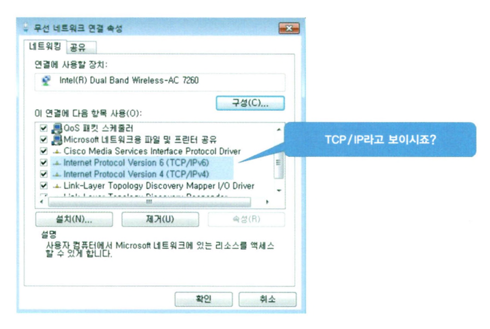

# TCP/IP와의 만남


## 목차

- TCP/IP를 모르면 인터넷을 아는 게 아니다?
- 이 세상에서 나만을 위한 유일한 것
- 컴퓨터는 이진수로만 이해한다는데
- 이진수 계산 그 첫 번째
- 이진수 게산 그 두 번째


## TCP/IP를 모르면 인터넷을 아는 게 아니다?

인터넷을 쓰기 위한 필수 조건이 바로 TCP/IP입니다. 앞에서 TCP/IP는 프로토콜의 한 종류라고 말씀드렸죠?  
맞습니다. TCP/IP는 인터넷을 사용하기 위해 꼭 필요한 프로토콜입니다. 다시 말하면 인터넷에서의 공용어는 TCP/IP인 셈이죠.  
따라서 지금 인터넷을 사용하고 있는 모든 PC는 모두 TCP/IP가 세팅되어 있습니다.

그럼 TCP/IP라는 프로토콜의 정체는 무엇일까요?

1970년대 초반부터 많은 업체들이 다양한 방법과 기술로 데이터 전송에 대한 프로토콜들을 개발하기 시작했는데, 대표적인 몇 가지를 알아보면 AppleTalk, IPX, NetBEUI, 그리고 나머지 하나가 TCP/IP입니다.  
TCP/IP를 알아보자면 이 4가지 중에서 가장 성공한 것이라도 해도 과언이 아닐 정도로 오늘날 많이 사용되고 있는 프로토콜입니다. 왜냐구요? 그건 바로 인터넷 때문입니다.

Transmission Control Protocol/Internet Protocol의 약자인 TCP/IP는 ARPANET에 의해서 처음 개발되었습니다.  
각각의 네트워크에 접속되는 호스트들은 고유의 주소를 가지고 있어서 자신이 속해 있는 네트워크뿐만 아니라 다른 네트워크에 연결되어 있는 호스트까지도 서로 데이터를 주고받을 수 있도록 만들어져 있는 것이 특징이라고 할 수 있습니다.  
이때 사용하는 호스트들의 고유 주소는 Internet Network Information Center(InterNIC)란 단체에서 관리 분배되고 있습니다.

아무튼 여기서는 인터넷에서의 공용어는 TCP/IP라는 프로토콜이란 것만 알고 넘어가기로 하겠습니다.  
인터넷을 쓰는 자기 PC에서 정말 TCP/IP를 쓰고 있는지 확인하고 싶으신 분은 지금 당장 제어판에 있는 [네트워크 연결]이나, 바탕화면에 있는 [내 네트워크 환경]에서 마우스 오른쪽 버튼을 눌러 [현재 네트워크의 상태 보기]를 찾아보시기 바랍니다.  
무선은 Wireless network로, 유선은 Local Area connection이라고 되어 있을 겁니다. 일단 유선을 사용한다고 가정하고 Local Area connection에서 [속성 보기] 버튼 또는 마우스 오른쪽 버튼을 눌러 [속성 보기]를 선택합니다. 아마 아래 그림과 같은 화면을 보실 수 있을 겁니다.  
TCP/IP가 랜카드에 세팅되어 있습니다. (여기서 사용하는 랜카드는 인텔에서 만든 기가비트 이더넷 카드입니다.)  
만약 TCP/IP 없이도 인터넷을 쓸 자신이 있으신 분은 TCP/IP 항목을 마우스로 선택하신 후 아래에 있는 [제거] 버튼을 눌러서 지워보시기 바랍니다.  
그리고 PC를 재부팅해서 인터넷으로 접속해 보기 바랍니다. 아마 접속할 수 없을겁니다. 그 이유는 여러분의 PC는 TCP/IP라는 언어를 모르는 PC가 되었기 때문입니다.  
그럼 다시 TCP/IP를 세팅하는 방법은 뒤에서 더 배워보겠습니다. 요즘은 윈도우에서 TCP/IP를 제거하지 못하게 아예 [제거] 버튼이 활성화되지 않습니다.




## 이 세상에서 나만을 위한 유일한 것

그건 바로 IP 주소입니다. 인터넷을 쓰는 사람이라면 누구나 하나씩 가지고 있어야 하는 IP 주소는 전 세계에서 유일하게 나만이 가지고 있는 것입니다.  
다시 말해 전 세계에서 인터넷을 사용하는 모든 사람은 모두 서로 다른 IP 주소를 가지고 있다는 겁니다.

정말이냐구요? 직접 확인해보세요. 먼저 윈도우의 [시작] 버튼을 누른 후 오른쪽 맨 아래쪽에 보이는 [실행]을 눌러 [열기]에서 'cmd'를 입력하고 도스 모드로 나와서 'ipconfig/all'을 입력합니다.  
거기 나오는 IP 주소가 있죠? 찾으셨습니까? 그게 바로 전 세계에서 여러분 혼자만이 가진 주소입니다. 물론 전화 접속 네트워크나 ADSL을 이용하는 사용자는 일단 전화 접속으로 접속한 다음에 하셔야겠죠?  
만약 이 주소를 나 말고 다른 사람이 똑같이 쓴다면 어떻게 될까요? IP 주소가 서로 충돌하기 때문에 둘 중 하나는 인터넷을 못쓰는 결과를 가져옵니다.  
이런 경우를 보통 "IP 주소가 쫑났다"라고 말합니다. 그런데 이 말은 좀 무식해 보일 수도 있으니 여러분들은 그냥 "IP 주소가 충돌했다"라고 하면 됩니다.

그런데 지금까지 말씀드린 것과는 달리 요즘 인터넷은 같은 주소를 사용하는 경우도 있습니다. 뒤에서 다시 설명드리겠지만 우리가 지금 사용하고 있는 IP 주소는 이제 거의 전부를 사용해 버렸기 때문에 각기 다른 IP 주소를 사용한다는 것이 점점 더 힘들어지고 있습니다.  
인터넷을 사용하는 사람들은 점점 늘어나고 있고 사용할 수 있는 IP 주소는 한정되어 있기 때문입니다.  
따라서 내부 네트워크에서는 공인되지 않은 IP 주소를 사용하고, 인터넷으로 나갈 때만 공인 주소(즉 유일한 IP 주소)를 가지고 나가는 방식인 NAT(Network Address Translation)나 동일한 IP 주소를 가지고 여러 명이 인터넷에 접속하면서 포트 넘버만을 바꾸는 PAT 등이 사용되고 있습니다.  
하지만 이런 것들은 나중에 다시 자세히 이야기해보도록 하고, 일단 여기서는 '인터넷을 제대로 사용하기 위해서는 전 세계에서 유일하게 나만이 갖는 IP 주소가 있어야 한다.'라고 알아두시기 바랍니다.  
이때 유일한 IP 주소를 사용하기 위해서는 누군가가 공인된 IP 주소를 관리하고 나눠줘야 하는데, 전 세계에 이런 공인 주소를 나눠주고 관리해주는 기관이 바로 NIC(Network Information Center)라는 곳입니다.


자, 여기서 잠깐 IP 주소는 어떻게 생겼는지 알아볼까요?

```
10.139.4.36
```

네 자리의 십진수로 되어 있고 중간에 점을 하나씩 찍어 주었습니다. 한 자리가 최소 0부터 최대 255까지 가능합니다. 왜 한 자리가 최대 255가 될까요? 이건 이유가 있습니다.  
왜 그런가하니 IP 주소는 이진수로 만들어졌기 때문입니다. 즉 여기서 보이는 십진수 한 자리는 이진수 8자리로 만들어져 있습니다. 이진수를 아시는 분은 계산을 해보면 금방 아시겠지만.  
이진수 8자리로 만들어낼 수 있는 가장 큰 수(11111111)가 바로 십진수로는 255가 됩니다. 우리들이 이진수보다는 십진수를 좋아하니까 십진수로 표시하는 것뿐이지 사실 IP 주소는 이진수로 만들어졌습니다. 즉 이진수 8자리가 4묶음으로 되어 있고 중간에 점을 찍어서 표시하는 게 원래의 IP 주소가 됩니다.  
따라서 IP 주소는 32개의 이진수로 만들어지게 됩니다.

그럼 우리가 만들 수 있는 IP 주소는 전부 몇 개나 있을까요? 숫자로 하면 2의 32승만큼이니까 한번 계산해보세요. 아주 많습니다.  
그런데 그 주소가 모든 인터넷 사용자 각자에서 서로 다른 주소를 부여하다 보니 요즘은 모자란다고 합니다. IP 주소에 대한 이야기는 다음에도 계속 나오게 되니까 이번에는 우선 여기까지만 하고 다음으로 넘어가기로 하겠습니다.  
그래도 여기서 우리는 IP 주소가 유일해야 인터넷을 쓸 수 있다는 것과, IP 주소는 원래는 이진수 32자리로 만들어져 있고 이진수 8자리마다 중간에 점을 하나씩 찍어서 표시하는데, 이진수로 표시하면 어려우니까 그냥 십진수로 표시해서 사용하는 추세라는 것까지 배웠습니다.