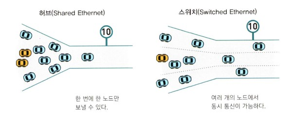
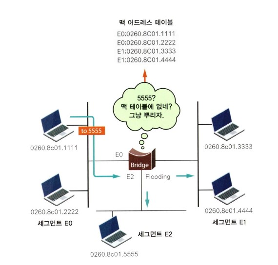
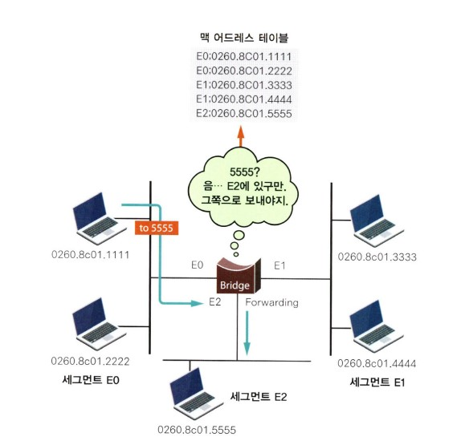
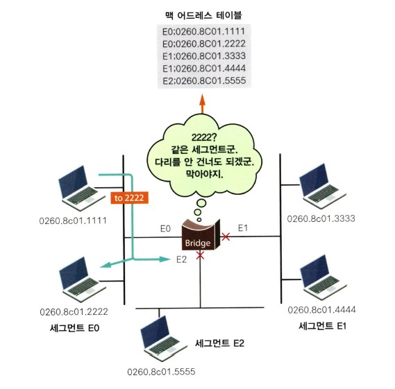
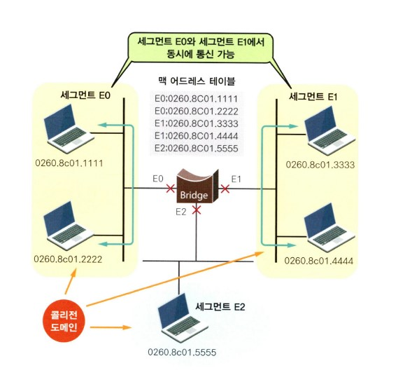
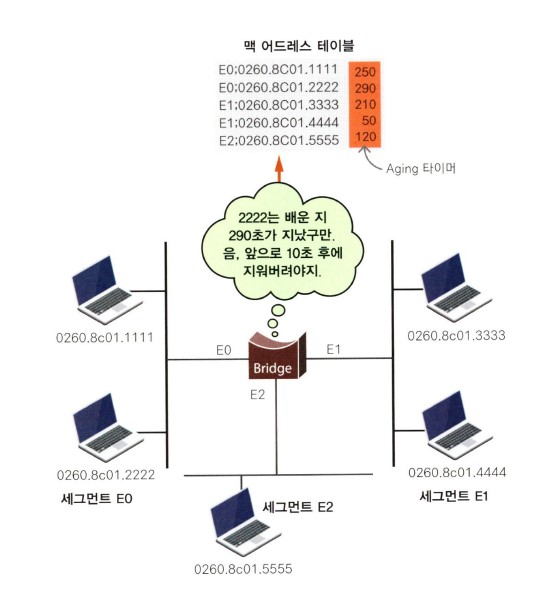
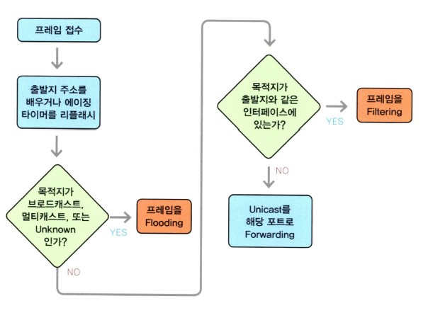
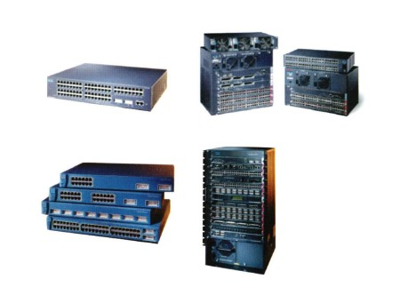

# 네트워크 장비에 관한 이야기


## 목차

- 랜카드도 세팅해야 되나요?
- 허브 이야기 그 첫 번째
- 허브의 한계
- 허브 이야기 그 두 번째
- 허브의 끝과 스위치의 시작
- 험한 세상의 브리지(다리?) 되어 그대 지키리
- 브리지/스위치의 기능
- Looping(뺑뺑이)은 왜 생길까요?
- 스패닝 트리되지 않는 스위치는 팥 없는 찐빵!
- 라우팅이냐, 스위칭이냐?


## 랜카드도 세팅해야 되나요?

이번 주제는 NIC(Network Interface Card)입니다. 보통 '랜카드'라고 하는 우리 주변에서 가장 많이 볼 수 있는 네트워크 장비입니다.

제가 네트워크를 처음 시작하던 시절에도 랜카드는 있었습니다. 물론 지금과는 많이 달랐지만 말입니다.  
지금이야 PC에 랜카드를 꽂고 전원을 껏다가 다시 켜면 PC가 알아서 랜카드를 인식하고, 알아서 필요한 프로그램을 설치하고 네트워크에 연결해주는 아주 좋은 기능인 플러그 앤 플레이(Plug and Play 또는 P&P라고 합니다.)를 지원해 주지만, 옛날(?)에는 정말 하나하나 전부 사람이 해야 했습니다.

랜카드의 모든 세팅은 점퍼 형식으로 되어 있어서 랜카드의 점퍼를 하나씩 하나씩 조정해가면서 해주던 IRQ(Interrupt Request) 넘버의 세팅이나 Base Memory 등의 세팅은 고도의 인내심과 직감력(?)을 필요로 했기 때문에 이 작업을 제대로 해주려면 랜카드 한 장당 숙련된 엔지니어가 약 30분은 매달려야 했습니다.  
이런 랜카드는 아주 중요한 역할을 해주는 것입니다. 즉 유저의 데이터를 케이블에 실어서 허브나 스위치, 혹은 라우터 등으로 전달해주고 자신에게 온 데이터를 CPU에게 전달해주는 역할을 합니다.

이런 랜카드는 우선 어떤 환경에서 사용하는가에 따라서 이더넷용 랜카드와 토큰링용 랜카드, 그리고 FDDI, ATM용 랜카드 등으로 구분합니다.  
하지만 대부분의 환경에서는 이더넷용을 사용하기 때문에 아마 여러분 PC에 설치된 랜카드나 사무실에 설치된 랜카드의 90% 이상은 이더넷용 랜카드일 겁니다. 여기서도 이더넷용 랜카드를 위주로 알아보도록 하겠습니다.

대부분 랜카드라고 하면 '랜에 접속하기 위한 카드처럼 생긴 것이다.'라고 생각하면 딱 맞을 겁니다. 이것을 어디에 설치하는가에 따라서 데스트톱용 랜카드(아래 그림에 보이는 게 모두 데스크톱용 랜카드입니다.)와 PCMCIA 방식이라고 하는 노트북용 랜카드가 있습니다.  
물론 이외에도 프린터 포트에 연결하는 외장형 랜카드나 USB 포트에 연결하는 방식이 있기도 하지만 자주 사용하는 방식은 아닙니다.  
데스크톱용이나, 느트북용이나, 프린터 포트용이나 모양은 다르지만 하는 일은 똑같습니다. 다만 PC와 연결할 때 접속하는 방법에 차이가 있다고 생각하면 됩니다.  
하지만 하는 일이 다 똑같다고 아무거나 사서 쓰면 안 됩니다. 자신이 가지고 있는 PC에 맞는 걸 사야 합니다. 괜히 데스크톱 PC에 설치할 랜카드를 노트북용으로 샀다가는 쓸모없게 되기 때문입니다.

데스크톱용 랜카드를 선택하는 경우에는 또 하나 생각해야 할 것이 있습니다. 바로 PC의 버스(Bus) 방식입니다. PC의 버스 방식은 크게 3가지 정도로 나누어 볼 수 있는데, 현재 가장 많이 사용하고 있는 방식이 PCI 방식이고 이전까지는 ISA('아이사'라고 읽습니다.) 방식을 많이 사용했습니다.  
자주는 아니지만 간혹 서버급 PC에서는 EISA('이아이사'라고 읽는데 Enhanced ISA입니다.) 방식의 버스도 있습니다. 여기서 말하는 버스는 컴퓨터에서 데이터가 날아다니는 길을 말합니다.  
이렇게 버스 이야기를 드리는 것은 랜카드 역시 PC의 버스 방식에 맞는 것을 설치해야 하기 때문입니다. 자기 PC는 ISA 생산인데 랜카드는 PCI 방식을 설치하려고 한다면 그건 불가능합니다.

제가 지금까지 랜카드에 대해 설명해드렸지만, 요즘은 아마 랜카드 자체를 아직 못 보신 분들도 있을 겁니다. 왜냐하면 랜카드가 이미 컴퓨터 안에 설치되어 제작되었기 때문입니다.  
카드 형태로 된 것도 있고, 메인보드에 붙어있는 것도 있지만 이렇게 랜카드에 대해 배우는 건 네트워크킹의 가장 기초가 되기 때문입니다.

일단 어디에 설치하는가에 따른 구분을 알아봤습니다. 이번에는 속도에 따른 구분입니다. 이더넷 랜카드의 경우는 속도에 따라 크게는 10메가, 100메가, 10/100메가, 1기가 등으로 나눌 수 있습니다.  
몇 년 전까지만 해도 10Mbps용 랜카드가 일반적이었습니다. 그런데 요즘은 100Mbps 또는 1Gbps용 랜카드가 거의 대부분입니다. 이는 네트워크 대역폭, 즉 네트워크상에서 날아다니는 데이터의 양이 그만큼 더 많아졌다는 것을 의미합니다.  
여기서 여러분은 10Mbps나 100Mbps라고 하는 의미를 아실 겁니다. 그래도 한번 살펴보자면 10Mbps는 데이터의 전송 속도가 1초에 10,000,000bit라는 것을 의미합니다.  
근데 이것은 뒤에 붙은 단위가 bit이기 때문에 보통 파일의 크기를 나타내는 값인 Byte로 바꾸어보면 1바이트=8비트이기 때문에 8로 나누어 주면 됩니다.  
즉 10,000,000/8 = 1,250,000바이트 입니다. 다시 말해서 1초에 1MB(메가바이트) 정도의 파일을 전송할 수 있는 겁니다. 굉장히 빠른 속도죠? 하지만 실제 상황에서는 차이가 있습니다.  
레이어에서 보면 순수한 데이터에 앞뒤로 이것저것이 붙어 다니고 이외에도 많은 Overhead가 있기 때문에 실제는 이런 속도가 나오지는 않습니다. 언제나 이론과 실제는 차이가 있다는 것을 알아두기 바랍니다.

또 랜카드에 접속하는 케이블의 종류에 따라서 TP 포트를 가진 랜카드, BNC나 AUI 포트를 가진 랜카드, 광케이블과 접속하는 랜카드 등의 종류로 나누어 볼 수 있습니다.


위 그림을 보면 우리가 자주 사용하고 았는 랜카드가 나와 있습니다.

예전에는 주로 AUI 타입의 커넥터와 BNC용 커넥터가 있는 방식을 많이 사용했습니다. 그리고 나서 한동안은 위 그림에서 오른쪽에 보이는 콤보(combo) 방식을 많이 쓰기도 했습니다.  
AUI와 BNC, 그리고 UTP를 모두 골라서 연결할 수 있는 타입이 바로 이 방식의 랜카드입니다. 한마디로 과도기적인 랜카드라고 볼 수 있습니다. 하지만 요즘에는 AUI나 BNC를 사용하는 사람이 거의 없는 편이니 주로 위에 보이는 UTP 타입을 쓰는 것이 일반적입니다.  
하지만 어떤 경우에는 위에 보이는 것처럼 광케이블을 직접 연결할 수 있게 만들어진 것도 있다는 것을 알아두면 좋겠습니다.

자신의 랜카드 정보를 보고 싶으신 분은 [시작] 버튼 :arrow_forward: [제어판] :arrow_forward: [시스템 및 보안] :arrow_forward: [시스템] :arrow_forward: [장치 관리자]로 들어가서 [네트워크 어댑터 정보]를 보시면 됩니다.  
여기서 랜카드를 선택하고 더블클릭하면 몇 가지 정보가 나오는데, 이때 [리소스]란 것을 누르면 입출력 범위, 인터럽트 요청, 메모리 범위 등이 나타납니다.  
이게 바로 아까 말씀드린 IRQ(인터럽트 요청), Base Memory(메모리 범위)입니다. 아래 그림에서도 보이시죠? 지금 보이는 대로 이런 값은 내가 목적지인 데이터(목적지 주소가 자신의 랜카드 맥 어드레스와 일치하는 데이터)가 들어왔을 때 랜카드는 컴퓨터의 CPU에 자기가 가지고 있던 IRQ를 이용해서 인터럽트를 걸게 됩니다.  
즉 CPU에 하던 일을 멈추고 자신의 일을 해줄 것을 요청하는 거죠. 그럼 CPU는 IRQ 번호를 보고 '아! 이 인터럽트는 랜카드가 요청한 서비스구나!' 이렇게 생각하는 겁니다. 그리고 이 데이터에 어떤 서비스를 할 것인지를 미리 정해놓는 장소(이게 Base Memory쪽이죠)로 이동해서 작업을 시작하는 겁니다.

이때 만일 이 IRQ가 다른 서비스를 위해 이미 예약된 번호였다면(이 경우를 우리는 'IRQ가 쫑났다!'라고 하죠) 랜카드를 인식하지 못하게 되는 겁니다.  
요즘은 랜카드를 꼽고 부팅을 하면 PC가 자동으로 안 쓰는 IRQ를 배정해주지만, 전에는 사람이 안 쓰는 IRQ를 하나하나 다 찾아내야 했던 시절이 있었습니다. '점퍼 세팅'이라고 랜카드에 있는 점퍼를 하나씩 바꿔가면서 말입니다.


## 허브 이야기 그 첫 번째

허브(HUB)란 무엇일까요?

다음 그림에도 보이지만 허브는 직사각형의 상자에 구멍이 뚫려있는 모양으로 되어 있습니다. 이 구멍이 몇 개 뚫려있느냐에 따라서 '몇 포트 허브다'라고 이야기하고, 이 구멍의 숫자가 바로 몇 대의 장비를 연결할 수 있는지를 결정하게 됩니다.  
즉 랜카드가 설치된 각각의 PC들은 케이블을 타고 바로 이 허브에 연결되는 겁니다. 그리고 같은 허브에 연결된 PC끼리는 서로 통신이 가능합니다.

그렇다면 예를 들어 구멍 10개짜리 허브가 있는데, 18대의 PC를 연결하려면 어떻게 해야 할까요?  
첫 번째 해결 방법은 구멍이 18개 이상 되는 허브를 따로 1대 사는 것입니다. 간단하긴 하지만 이 방법을 사용할 경우 기존에 가지고 있던 구멍 10개짜리 허브를 사용하지 못하기 때문에 절대 권하지 않는 방법입니다.

두 번째 방법은 구멍이 10개인 허브 1대를 더 산 후 이 2대를 서로 연결하고 2대의 허브에 PC를 연결하는 방법입니다. 즉 허브는 서로 연결을 하게 되면 마치 1대의 허브처럼 동작이 가능합니다. 하지만 여기에도 제한 사항이 있기 때문에 무조건 허브를 사서 연결만 한다고 되는 건 아닙니다.

허브 역시 랜카드처럼 이더넷용과 토큰링용이 있고, 이더넷 허브도 속도에 따라 그냥 허브(10Mbps)dㅘ 패스트(100Mbps) 허브가 있습니다.  
물론 가격은 패스트 허브가 더 비싸겠죠? 혹시 100Mbps 랜카드를 설치하신 분이 허브는 10Mbps용을 사용하신다면 당연히 통신속도는 10메가이기 때문에 랜카드에 맞는 허브를 선택하는 것이 중요합니다.  
허브는 네트워크에서 약방에 감초처럼 없으면 안 되는 가장 기본이 되는 장비 중 하나입니다. (물론 요즘은 스위치란 것이 하도 싸서 네트워크 장비에서 허브를 찾아보기 어렵게 됐지만, 그래도 배우는 단계에서 허브를 무시하면 안됩니다.)  
예를 들어, 랜카드, 케이블, 그리고 허브만 있으면 일단 내부에서는 허브에 접속된 모든 PC가 서로 통신이 가능하다는 겁니다. (물론 외부 인터넷은 못 나가지만 말입니다.)

그럼 허브는 무슨 일을 할까요?

허브를 한마디로 이야기하면 '멀티포트(Multiport) 리피터(Repeater)'라고 말할 수 있습니다.  
멀티포트는 말 그대로 포트가 많이 붙어있다는 뜻이고, 리피터는 들어온 데이터를 그대로 재전송한다는 의미를 가지고 있으니까 허브는 포트가 여러 개 달린 장비인데, 이것은 한 포트로 들어온 데이터를 나머지 모든 포트로 뿌려준다는 겁니다.

여기서 잠깐 리피터에 대해서 알아보도록 하겠습니다. 네트워크에서 데이터를 전송하는 경우 케이블에 따라서 전송 거리에는 제약이 있습니다.  
예를 들어, 우리가 현재 가장 많이 사용하고 있는 UTP 케이블의 경우는 최대 전송 거리가 100미터입니다. 즉 장비와 장비 사이가 100미터 이상 떨어져 있는 경우에는 통신이 불가능하다는 겁니다. (물론 100미터를 넘어서 통신이 되는 경우도 있지만 이건 완전한 통신을 보장할 수 없기 때문에 권하지 않습니다.)  
또 광케이블의 경우에도 케이블에 따라 차이는 있지만 수백 미터에서 수 킬로미터까지 제한되어 있습니다. 그렇다면 이 경우 케이블이 갈 수 있는 최대 거리 이상 떨어진, 예를 들어 두 장비 간의 거리가 150미터인 경우 두 장비 간은 UTP 케이블로 연결하려면 어떻게 해야 할까요?

그때 중간에서 들어온 데이터를 다른 쪽으로 전달해 주는 역할을 하는 것이 바로 리피터입니다.  
음성 통신의 경우 엠프라고 하는 것이 멀리 떨어진 곳에 소리를 전달하기 위해 쓰이는 것처럼 데이터는 중간에 리피터가 있어서 한쪽에서 들어온 데이터를 그대로 다른 쪽으로 전달해주는 겁니다.  
따라서 중간에 리피터를 두고 두 장비는 케이블을 통해서 리피터로 연결하면 둘 간의 통신이 가능해지게 됩니다. 지금 설명드리고 있는 허브는 바로 이런 리피터의 기능도 가지고 있습니다.

예전만해도 리피터는 자주 사용되곤 했습니다. 그런데 이제는 허브가 그 역할을 대신하다 보니(그리고 허브 가격이 너무 싸졌기 때문일 겁니다.) 리피터를 만나기가 쉽지 않습니다.

이번에는 그림을 보면서 설명을 드리도록 하겠습니다. 허브에 1번에서 5번까지의 PC가 붙어 있는데, 만약 1번 PC가 2번 PC에 데이터를 전송하는 경우를 예로 들어보지요.


전에도 설명드렸지만 이 허브는 이더넷 허브인 만큼 CSMA/CD의 적용을 받습니다(이제 아시죠? CSMA/CD). 따라서 하나의 PC가 허브에 데이터를 보내고 있을 때 또 다른 PC가 데이터를 보내려고 하면 콜리전이 발생합니다. 그러므로 같은 허브에 연결되어 있는 모든 PC들은 모두 '같은 콜리전 도메인(Collision Domain)에 있다'라고 말합니다.  
즉 같은 콜리전 도메인(영역)에 있다는 의미는, 그 허브에 붙어있는 하나의 PC가 통신을 하게 되면 다른 모든 PC는 통신을 할 수 없게 되고, 또 이 허브에 붙어있는 하나의 PC에서 콜리전이 발생하면 모든 PC가 영향을 받는다는 개념입니다.


## 허브 이야기 그 두번째

그럼 허브 얘기를 조금 더 해볼까요?

허브는 우리가 네트워크를 하면서 가장 자주 접하는 장비인 만큼 할 이야기도 많습니다. 우리가 보통 허브를 이야기할 때 허브의 종류를 나누는데, 그게 바로 '인텔리전트(Intelligent) 허브'와 '더미(Dummy) 허브'입니다.  
굳이 하나 더 나누자면 '세미인텔리전트(Semi-Intelligent) 허브'입니다.

먼저 인텔리전트 허브란, 말 그대로 지능형 허브입니다. 보통 우리가 인텔리전트 허브와 더미 허브를 나누는 가장 중요한 요소로는 NMS(네트워크 관리 시스템)를 통해서 관리가 되는가입니다.  
즉 인텔리전트 허브는 NMS에서 모든 데이터를 분석할 수 있을 뿐만 아니라 제어도 가능합니다. 말 그대로 앉아서 멀리 있는 허브의 동작을 감시하고 조정까지 할 수 있습니다.

그런데 이 기능은 정말 대형 네트워크에서 NMS를 쓰는 경우에나 필요하지, 사무실에서 PC 몇 대 쓰는 경우라든지, 아니면 PC방에서 사용하는 경우에는 전혀 필요하지 않은 기능입니다. 따라서 인텔리전트라고 무조건 좋은 건 아니라는 겁니다. 값만 비싸죠.

하지만 인텔리전트 허브는 위의 기능 이외에도 몇 가지 기능을 가지고 있습니다. 예를 들어볼까요? 허브에 연결된 한 PC에 문제가 발생했습니다. 그래서 그 PC는 계속 이상한 데이터를 허브로 끊임없이 보낸다고 가정해 보겠습니다. 그럼 어떻게 될까요? 네, 맞습니다. 계속해서 콜리전이 발생하게 되면서 다른 모든 PC는 통신이 불가능한 상태로 빠져들게 됩니다.

바로 이더넷의 CSMA/CD란 특징 때문입니다.

이 경우 문제의 PC를 찾아내서 PC를 끄지 않는 이상에는 그 문제를 해결할 수가 없습니다. 하지만 인텔리전트 허브의 경우는 문제의 PC가 연결된 포트를 찾아내어 자동으로 Isolation(현 네트워크에서 분리시켜서 따로 고립시킴)시켜 버립니다.  
즉 문제가 계속되는 포트는 방출시켜 버리는 겁니다. 따라서 그 한 PC는 통신이 불가능하게 되겠지만, 나머지는 그 PC로부터 영향을 받지 않으므로 정상적인 통신이 가능합니다.

또 분리된 포트는 허브에서 램프로 표시되기 때문에 바로 어떤 PC인지 알게 되어 조치가 가능하다는 겁니다. 이 기능을 Auto Partition이라고 하는데, 이 기능은 요즘은 더미 허브에서도 있는 경우가 많습니다.

조금 어려웠나요? 하지만 꼭 필요한 기능 중의 하나입니다. 이제 여러분은 허브를 구매하실 때 "이 허브는 오토 파티셔닝 기능이 있나요?"라든지 "이 허브는 인텔리전트 허브인가요?"라는 질문을 해볼 수 있을 겁니다.  
또한 세미(Semi) 더미 허브란, 일단 더미 허브인데 인텔리전트 허브와 연결하면 자기도 인텔리전트 허브가 됩니다. 따라서 혼자 있을 때는 더미 허브, 그리고 인텔리전트 허브랑 같이 있으면 인텔리전트 허브가 되는 허브를 말합니다.

또 허브나 스위치 등의 장비를 사려고 돌아다니다 보면 '스태커블(Stackable) 허브'라는 말을 듣게 되실 겁니다. 스태커블 허브란 무엇일까요? 우리말로 쉽게 풀어서 말씀드리면 스택이 가능한 허브, 즉 쌓을 수 있는 허브를 말합니다.

쌓을 수 있는 허브? 스태커블 장비에 대해서는 바로 다음에 알아보기로 하겠습니다.

아래에 허브의 사진이 있습니다. 이 허브는 스택이 가능한 스태커블 허브여서 스택을 위한 케이블로 서로 연결되어 있는 것을 볼 수 있습니다. 아래에 있는 그림은 네트워크 관리 화면 입니다. 즉 허브의 상태를 웹 브라우저를 통해서 그대로 확인할 수 있을 뿐만 아니라 포트의 상태나 데이터 양의 감시까지도 가능합니다.  
물론 이 경우에는 허브 관리에 필요한 값을 세팅해주어야 합니다. 관리용 IP 주소라든지 암호, 관리 옵션 등을 넣어주어야 멀리 떨어진 곳에서도 관리가 가능하게 됩니다. 이처럼 관리 기능을 제공해 주는 허브를 '인텔리전트 허브'라고 합니다.


## 허브의 끝과 스위치의 시작

이전에 허브의 한계에 대해서 말씀드렸죠?

아무리 빠른 속도를 내는 허브를 쓴다고 하더라도 어느 한순간에는 한 PC에만 데이터를 보낼 수 있다고 하였습니다.  
즉 허브에 연결된 한 PC에서 발생하는 콜리전이 다른 PC들에도 영향을 주는 콜리전 도메인(영역)이 그 허브에 연결된 모든 PC들이라는 뜻입니다.  
그러므로 바로 콜리전 도메인이 너무 커지는 상황을 항상 조심해야 합니다. 콜리전 도메인이 너무 커지게 되면 콜리전에 의해 영향을 받는 PC가 너무 많아지면서 통신의 속도가 점점 떨어지게 됩니다.

이러한 문제를 해결하기 위해서 콜리전 도메인을 나누어 줄 수 있는 장비가 나왔는데, 이 장비가 바로 브리지(Bridge) 또는 스위치(Switch)입니다. 스위치가 나오기 전까지는 이 역할을 브리지 혼자 다 해주었지만, 이제 브리지보다 빠른 스위치가 나왔으니 브리지는 그 자리를 스위치에게 물려주고 사라져가는 추세입니다. 하지만 어디까지나 원조는 브리지라는 것을 잊지 마세요.

따라서 스위치의 모든 기능은 브리지에서 출발한다는 것 역시 잊어서는 안 됩니다. 스위치를 사겠다고 돌아다니다 보면 어디서는 스위치를 '스위칭 허브(Switching Hub)'라고도 하는데, 뒤에 나오는 허브라는 말 때문에 사람들이 혼동을 많이 합니다. 이게 허브인지, 아니면 스위치인지...

아무튼 '스위치'란 말이 들어가면 일단 스위치라고 생각하시면 될 것 같습니다. 물론 이것이 허브인지, 스위치인지를 알아낼 수 있는 방법은 있습니다. 그것은 나중에 스위치를 배우면서 알아보겠습니다.

스위치는 예를 들어 1번 포트에 연결된 PC가 2번 포트에 연결된 PC와 데이터를 주고받는 동안에도 3번 포트에 연결된 PC와 4번 포트에 연결된 PC가 서로 데이터를 주고받을 수 있게 하는 장비입니다. 이걸 전문적인 용어로는 '포트별로 콜리전 도메인이 나뉘어 있다'라고 말합니다.

즉 1번과 2번 사이에서 통신이 일어나면 나머지 모든 PC들은 기다려야만 하는 허브와는 달리 다른 PC들도 동시에 통신이 가능합니다. 이것이 스위치와 허브의 가장 큰 차이입니다.

그래서 우린 스위치의 경우 각각의 포트에 연결된 PC가 독자적으로(Dedicated하게) 10Mbps 또는 100Mbps의 속도를 갖는다고 이야기합니다. 물론 허브보다는 가격이 비싸겠죠?

요즘은 PC방에서도 스위치를 쓰는 곳이 많습니다. 아무래도 속도가 빠르기 때문입니다. 뒤에서도 다시 설명하겠지만 스위치는 허브에 비해서 데이터를 처리하는 방법이 우수할 뿐만 아니라 데이터의 전송 에러 등을 복구해 주는 기능 등 여러 가지 기능을 가지고 있습니다.



위 그림을 살펴보겠습니다. 허브는 일차선 도로라고 생각하면 편합니다. 어느 한순간에는 한 대의 차밖에 달릴 수 없는 거죠. 하지만 스위치는 포트 수별로 차선이 만들어지는 겁니다. 즉 8포트 스위치라면 8차선 도로가 되는 겁니다. 이해되시죠?

'허브가 좋아요? 스위치가 좋아요? 간혹 듣는 질문입니다.'

답은 뭘까요? 비싼 게 좋다? 그래서 스위치?

물론 스위치의 기능은 지금까지 설명드린 대로 허브보다 우수합니다. 예를 들어 스위치는 허브가 처리할 수 없는 콜리전 문제의 해결이나 에러 처리 능력에 있어 우수합니다.

하지만 허브는 허브대로 장점이 있습니다. 일단 스위치보다 싸다는 것이 가장 큰 장점입니다.

또 데이터 처리 속도가 일반적으로 스위치에 비해 빠릅니다. 그럴 수밖에 없는 게 들어온 데이터에게 별로 해줄 일이 없기 때문입니다. 들어오는 대로 그냥 내보내기만 하면 됩니다. 물론 그 속도 차이라는 게 아주 작은 차이이고 또 스위치들이 속도 향상을 위해 많은 기능을 가지고 있기 때문에 스위치를 쓴다고 느려지는 건 아니지만 말입니다. 아무튼 일반적으론 그렇다는 겁니다. 따라서 좋다고 무조건 스위치만 쓰는 건 아무래도 낭비겠죠?

또 한 가지는 스위치를 사용하는 게 좋으냐, 허브를 사용하는 게 좋으냐를 결정할 때 그 네트워크에서 어떤 데이터가 돌아다니느냐 하는 것도 알아두어야 합니다. 예를 들어 채팅이나 메일 정도를 쓰는 경우는 네트워크상에 트래픽이 적기 때문에 PC들을 스위치에 붙이는 건 아무래도 낭비겠죠? 이 정도의 트래픽이라면 허브로도 충분합니다.

아래 그림을 보면 허브와 스위치로 구성된 그림이 있습니다. 왼쪽의 그림이 허브이고, 오른쪽의 그림이 스위치입니다. 이때 여기 있는 모든 PC들은 네트워크에 접속하면 무조건 서버하고만 통신을 한다고 가정하겠습니다. 그럼 어떻게 될까요?

먼저 허브의 경우입니다. 모든 PC가 서버와 통신을 하려고 하지만, 허브는 연결된 모든 장비가 하나의 콜리전 도메인 안에 있기 때문에 어느 한순간에는 하나만 통신이 가능해서 나머지 모든 PC들은 기다려야 합니다. 이건 지금까지 배운 거니까 이해하실 겁니다. 자, 그렇다면 허브 대신 스위치를 연결하면 어떻게 될까요?

스위치는 포트별로 콜리전 도메인을 나누기 때문에 1번 PC가 2번 PC와 통신하는 도중에도 3번 PC는 4번 PC와 통신이 가능한 구조입니다. 하지만 여기서는 모든 PC가 전부 서버와 통신을 하는 경우입니다. 따라서 스위치가 아무리 콜리전 도메인을 나누었다 하더라도 서버와의 통신은 어느 한순간에는 하나의 PC만 가능하게 됩니다. 왜냐하면 서버가 한 대밖에 없기 때문입니다.


이처럼 붙어있는 모든 장비가 무조건 어느 한 곳으로만 향하는 경우는 허브나 스위치나 속도의 차이가 크게 나지 않습니다. 물론 스위치의 다른 기능을 이용해서 통신의 효율성을 올릴 수는 있겠지만, 콜리전 도메인을 나눠주는 기능을 이용한 속도 향상은 기대할 수 없습니다.

따라서 상황별로 허브와 스위치를 적당히 골라 쓰는 것이 중요합니다. 하지만 요즘은 스위치의 가격이 많이 싸져서 허브의 가격적인 매력이 줄어들었고 네트워크 사용자들이 모두 인터넷을 사용해서 많은 데이터를 주고받는 추세이다 보니 허브보다는 역시 스위치가 각광을 받는 추세입니다. 이제 여러분도 허브를 살까, 스위치를 살까, 결정하셨죠?


> 조그만 네트워크를 그림으로 그려보면...

지금까지 배웠던 랜카드와 케이블, 허브 그리고 스위치만 있으면 어느 정도 규모의 네트워크를 만들 수 있습니다. 다음의 그림을 한번 자세히 보기 바랍니다.

먼저 PC에는 앞에서 설명한 대로 자기 PC에 맞는 랜카드를 선택해서 설치해 주어야 합니다. PC에 설치하는 랜카드는 10메가용 랜카드를 사용하고 UTP 타입(RJ45 커넥터 방식이라고도 합니다.)을 사용하기로 하겠습니다.  
PC의 뚜껑을 열고 비어있는 슬롯에 랜카드를 살포시 찔러넣은 후 나사로 단단히 조여주고 PC 뚜껑을 다시 닫게 되면 작업은 끝입니다.(물론 이때 PC 전원은 꺼져 있어야 합니다. 설마 PC 전원이 켜진 상태에서 이런 작업하는 분은 안 계시겠죠?)

그리고 나서 PC의 전원을 켜면 '뭔가 이상한 것이 PC에 붙어있습니다. 설치할까요?' 이렇게 물어봅니다. 그럼 '그래 설치해라.'를 선택하게 되면 대부분은 자동으로 설치가 됩니다. 만약 자동 설치가 안 되는 랜카드라면 랜카드를 살 때 같이 받은 CD를 이용해서 설치하면 됩니다.

내 컴퓨터에 랜카드가 제대로 설치되었는지를 보는 것은 앞에서 설명드렸죠? 컴퓨터에서 [시작] 버튼 :arrow_right: [제어판] :arrow_right: [시스템 및 보안] :arrow_right: [시스템] :arrow_right: [장치 관리자]에서 네트워크 어댑터에 가서 보시면 됩니다. 하지만 요즘은 이미 랜카드가 설치되어 나오는 PC가 대부분이기 때문에 조립 PC의 경우에만 필요할 겁니다.

랜카드가 설치되고 나면 이번엔 허브를 설치하겠습니다. 여기서는 허브가 2대나 되네요. 아무튼 허브의 포장을 정갈히 뜯어내고 전원부를 잘 확인한 후 전원을 연결합니다. '위잉' 하고 소리가 나면서 불이 반짝반짝거릴 겁니다. 그리고는 곧 불이 모두 꺼집니다. 그럼 허브의 설치가 완료된 것입니다.  
허브 설치에서 한 게 뭐가 있냐구요? 전원만 연결했다구요? 맞습니다. 전에 말씀드린대로 허브는 전원만 연결하면 됩니다.


이번엔 스위치를 설치하겠습니다. 스위치의 설치는 사실 허브의 설치에 비해서는 까다롭지만 여기서는 그냥 디폴트 구성을 사용한다고 가정했을 때 스위치 역시 전원만 연결하면 됩니다.

이렇게 스위치, 허브, 랜카드를 설치한 후 케이블을 이용해서 서로 연결해 주면 됩니다. 이때 허브와 PC 간의 연결은 다이렉트 케이블(1 대 1 케이블)을 사용합니다. 그러나 이때 주의해야 할 것이 있습니다. 허브와 스위치 간의 연결입니다. 허브와 스위치 간의 연결에 사용되는 케이블은 크로스 케이블입니다. 즉 1, 2번과 3, 6번이 꼬여있는 케이블을 말합니다. (이해 안 되는 분은 UTP케이블을 참고하세요.)

그림에서 서버는 우리가 내부에서 그냥 사용하는 서버라고 생각하면 됩니다. 서버의 경우 사용자들의 접속(Access)이 많기 때문에 스위치에 연결하는 것이 좋습니다. 또 라우터 역시 인터넷을 사용하는 모든 PC가 접속(Access)해야 하기 때문에 스위치에 연결하는 것이 좋습니다. 나머지도 자주 네트워크를 사용하는 장비들은 스위치에 연결하는 것이 좋스빈다. 그리고 허브를 스위치에 연결합니다.

여기서는 스위치 1대와 허브 2대를 사용한다고 가정하고 허브를 각각 스위치에 연결했습니다. 허브 대신 전부 스위치를 사용해도 좋습니다. 아래의 경우 하나의 허브에서 연결된 PC들이 하나의 콜리전 도메인이 되는 겁니다. 즉 위에 있는 허브에 연결된 PC와 아래 있는 허브에 연결된 PC는 서로 다른 콜리전 도메인에 있게 됩니다. (왜냐하면 이 2대의 허브가 스위치에 연결되어 있기 때문입니다.)

대충 이해가 가시죠?

라우터는 아직 공부하지 않았으니 그냥 '인터넷을 접속하려면 라우터가 필요하구나!' 하는 정도만 알면 됩니다.


## 험한 세상의 브리지(다리?) 되어 그대 지키리

이번에는 허브에 이어 그보다 한 수 높은 장비인 브리지를 알아보겠습니다. 제가 앞에서 브리지가 스위치의 원조격이라고 했던 것을 기억하실 겁니다.  
따라서 스위치를 이해하기 위해서는 브리지를 먼저 알고 넘어가야 합니다. 브리지가 가지고 있는 모든 특성은 바로 스위치의 특성이기도 합니다.

브리지는 말 그대로 다리입니다.

즉 허브는 모든 PC들이 하나에 붙어있기 때문에 이 허브로 연결된 PC들 간의 통신에는 문제가 생길 수 있습니다. 어떤 문제냐면, 허브에 연결된 PC들 중 두 PC만 통신을 하게 되면 그 순간에는 다른 PC의 통신이 불가능합니다. 아시죠? (CSMA/CD입니다. 중요한 거라서 계속 말씀을드리는 겁니다.) 그 이유가 콜리전 도메인이 같이 때문이란 것도 이젠 아마 아실 겁니다.

콜리전 문제는 앞에서도 몇 번 말씀드렸지만 작은 규모의 네트워크에서는 문제가 안 되지만, 네트워크의 규모가 조금만 커지게 되면 말썽을 일으키게 됩니다.

그렇다면 이렇게 네트워크 규모가 커지고 통신량이 증가할 때 콜리전 도메인을 나누어 주기 위해 무엇을 사용해야 할까요?

이때는 허브로써는 감당이 안 되기 때문에 한 수 높은 스위치나 브리지를 사용해야 합니다. (물론 두 수위 라우터도 가능하긴하지만, 닭 잡는 데 소 잡는 칼까지 필요하겠습니까?) 브리지와 스위치는 사촌 간이라고 볼 수 있습니다. 하는 일이 서로 비슷합니다.

그럼 브리지는 이런 콜리전 도메인을 어떻게 나눠줄까요?

브리지는 허브로 만들어진 콜리전 도메인 사이를 반으로 나누고 중간에 다리를 놓는 겁니다.

그렇게 되면 다리 남단은 다리 남단끼리, 다리 북단은 다리 북단끼리 동시에 통신이 가능하게 됩니다. 즉 다리 남단에서 두 PC 간에 통신이 일어나는 사이에 다리 북단에 있는 PC들끼리도 통신이 가능하다는 겁니다. 그리고 만약 다리 남단에 있는 PC와 다리 북단에 있는 PC가 통신하고자 하는 경우에만 다리를 건너서 통신이 이루어집니다.

이것이 바로 브리지입니다.


위의 그림을 살펴보면 0260.8c01.1111이라는 맥 어드레스(MAC Address)를 가진 PC가 0260.8c01.2222라는 맥 어드레스를 가진 PC에게 통신을 하는 중에도 0260.8c01.3333이라는 맥 어드레스를 가진 PC는 0260.8c01.4444라는 맥 어드레스를 가진 PC와 통신이 가능합니다.  
즉 브리지는 0260.8c01.1111이 0260.8c01.2222와 통신할 때 이 통신이 다리를 건너지 않고서도 가능하다는 것을 알고 있습니다. (브리지가 관리하는 장부 - 맥 어드레스 테이블 - 를 보기 때문입니다.) 그래서 이 프레임은 다리를 통과시키지 않는 겁니다. (아시죠? 원래 허브였으면 모든 PC들에게 보내게 되는 것 말입니다. 이더넷(Ethernet)의 CSMA/CD 특성 때문입니다.)

따라서 이 두 PC들이 다리 남단에서 통신을 하는 사이에도 다른 두 PC는 다리 북단에서 통신이 가능할 수 있습니다. 이해 가시죠? 요즘은 이런 브리지의 기능을 스위치가 대신하기 때문에 브리지가 많이 사용되진 않고 있지만, 엄연히 브리지가 스위치보다는 훨씬 먼저 나온 형님이란 걸 여러분은 기억해 두기 바랍니다.

여기서 결론이 나오네요.

브리지는 허브보다 한 수 위의 장비인데, 허브는 나누지 뭇하는 콜리전 도메인을 나누어주는 역할을 한다. 어떻게? 중간에 서서 브리지 테이블을 보면서 통신이 다리 한쪽에서만 일어나면 다리를 못 건너가게 하고, 통신이 다리를 통과해야 가능하면 그때만 다리를 건너게 해준다. 그리고 스위치는 브리지랑 비슷한 기능을 한다.

여기까지입니다.

브리지나 스위치가 어떤 기능이 있어서 이렇게 콜리전 도메인을 나누어줄 수 있는지는 뒤에서 좀 더 자세히 알아보도록 하겠습니다.


## 브리지/스위치의 기능

이번에는 좀 더 구체적으로 브리지나 스위치가 하는 일에 대해서 알아보도록 하겠습니다. 일단 결론부터 말씀드리면 브리지나 스위치는 다음 5가지 일을 합니다.

```
Learning, 배운다.
Flooding, 모르면 들어온 포트를 제외한 다른 포트로 뿌린다.
Filtering, 다른 포트로는 못 건너가게 막는다.
Aging, 나이를 먹는다.
```

자, 그럼 여기 나온 5가지를 하나씩 알아보도록 하겠습니다.

먼저 Learning입니다. 즉 배운다. 무엇을? 맥 어드레스(MAC address)를... 어디의 맥 어드레스? 출발지의 맥 어드레스...

즉 브리자나 스위치는 자신의 포트에 연결된 'A'라는 PC가 통신을 위해서 프레임을 내보내면 그때 이 PC의 맥 어드레스를 읽어서 자신의 맥 어드레스 테이블('브리지 테이블'이라고 합니다.)에 저장해놓습니다.  
그리고 나중에 어떤 PC가 'A'에게 통신할 경우에는 자신의 브리지 테이블을 참고해서 다리를 건너게 할 것인지, 아니면 못 건너가게 할 것인지를 결정하는 겁니다.


위 그림에서 중간에 브리지가 있고 세그먼트 E0와 세그먼트 E1에 PC들이 연결되어 있습니다. 만약 세그먼트 E0에 있는 맥 어드레스 0260.8c01.1111을 가진 PC가 통신을 하게 되면 이더넷의 기본 성질에 따라 세그먼트 E0에 연결되어 있는 모든 장비는 그 프레임을 받게 되는데, 이때 브리지는 이 프레임을 받아서 이 프레임이 어디서 출발한 것인지를 확인합니다.  
즉 출발지의 맥 어드레스를 확인하게 됩니다. 그리고 나서는 브리지가 관리하는 브리지 테이블에 이 정보를 써넣습니다. 그림에서처럼 세그먼트 E0에 맥 어드레스 0260.8c01.1111을 가진 녀석이 살고 있다. 이렇게 말입니다.

그다음은 Flooding입니다. 그냥 들어온 포트를 제외한 나머지를 모든 포트로 뿌리는 것을 의미합니다. 지금까지 계속 말씀드린 대로 브리지는 '어떤 프레임에 대해서 브리지를 열어줄 것인가, 아니면 못 건너가게 막을 것인가'를 브리지가 관리하는 브리지 테이블을 보고 결정한다고 했습니다.  
그런데 들어온 프레임이 찾아가는 주소를 보니 그 주소가 만약 브리지가 가지고 있는 브리지 테이블에 없는 주소라면 어떻게 할까요? 다시 말해서 이 주소가 다리를 건너야 하는지, 아니면 안건너도 되는지를 알지 못한다면 어떻게 해야 할까요? 이때 사용되는 것이 바로 Flooding입니다.  
그냥 나머지를 포트로 뿌려주는 겁니다. 이런 Flooding은 브로드캐스트나 멀티캐스트의 경우에도 발생하게 됩니다.

아래 그림에서 보면 세그먼트 E0에 있는 맥 어드레스 0260.8c01.1111을 가진 PC가 맥 어드레스 0260.8c01.5555를 가진 PC와 통신을 하려고 프레임을 보냈습니다. 브리지는 이 프레임을 받고 목적지를 보니 0260.8c01.5555가 자신의 맥 테이블에는 없다는 것을 알게 됩니다. 왜냐하면 0260.8c01.5555는 지금까지 한 번도 통신을 하지 않았기 때문에 브리지가 출발지 주소를 배우지 못한 겁니다.



따라서 브리지는 이 프레임을 자신의 모든 포트로 뿌리게 됩니다.(들어온 포트는 제외). 실제로는 E2로만 부려주면 되는데도 말입니다. 마찬가지로 브로드캐스트의 경우는 목적지가 모든 PC이기 때문에 역시 Flooding이 발생합니다.

자, 이번에는 Forwarding(포워딩)입니다. Forwarding은 브리지가 목적지의 맥 어드레스를 자신의 브리지 테이블에 가지고 있고, 이 목적지가 출발지의 맥 어드레스와 다른 세그먼트에 존재하는 경우에 일어납니다.  
한마디로 목적지가 어디 있는지를 알고 있는데 그 목적지가 다리를 건너가야만 하는 경우에 Forwarding이 발생합니다. Forwarding은 이전에 배운 Flooding이 모든 포트로 프레임을 뿌리는 것과는 달리 오직 해당 포트쪽으로만 프레임을 뿌려줍니다.

아래 그림에서 이번에는 브리지가 0260.8c01.5555가 어디 있는지를 알고 있는 경우입니다. (한 번 이상 0260.8c01.5555에서 통신이 발생했다는 의미겠죠?) 이때 세그먼트 E0에 있는 0260.8c01.1111이 0260.8c01.5555쪽으로 프레임을 보냅니다. 그러면 이를 접수한 브리지는 자신의 브리지 테이블을 보게 되고 목적지 0260.8c01.5555가 세그먼트 E0가 아닌 세그먼트 E2라는 것을 알게 됩니다. 따라서 다리를 건너야 한다는 것을 알게 됩니다.  
이 경우 브리지는 0260.8c01.1111로부터 프레임을 해당 세그먼트인 E2쪽으로 넘겨주게 되는데, 이것을 바로 'Forwarding'이라고 합니다.



Filtering(필터링)은 브리지를 못 넘어가게 막는다는 것을 뜻합니다. 그럼 어떤 경우에 필터링이 발생할까요? 필터링은 브리지가 목적지의 맥 어드레스를 알고 있고, (즉 브리지 테이블에 목적지 맥 어드레스가 들어있는 경우) 출발지와 목적지가 같은 세그먼트에 있는 경우입니다. 이 경우에는 브리지를 건너가지 않아도 통신이 일어날 수 있겠죠? 따라서 브리지는 다리를 막는 필터링을 실시하게 됩니다. 브리지의 이러한 Filtering(필터링) 기능 때문에 허브와는 다르게 콜리전 도메인을 나누어 줄 수 있는 겁니다.

아래 그림에서 세그먼트 E0에 있는 0260.8c01.1111이 프레임을 0260.8c01.2222에 보내려고 합니다. 이더넷의 특성상 프레임은 0260.8c01.2222에도 날아가겠지만 브리지에도 들어오게 되겠죠? 이 프레임을 받은 브리지는 자신의 브리지 테이블을 보게 됩니다.

브리지 테이블에 있네요. 그런데 0260.8c11.2222는 세그먼트 E0. 즉 프레임을 발생시킨 0260.8c01.1111과 동일한 세그먼트에 있다는 것을 알게 됩니다. 따라서 브리지는 이 프레임이 브리지를 넘어가지 않아도 통신이 가능하다는 것을 알게 되기 때문에 필터링을 적용하게 됩니다.  
만약 이 경우에 세그먼트 E1에 잇는 0260.8c01.3333이 같은 세그먼트에 있는 0260.8c01.4444와 통신을 한다고 해도 이 프레임에 대해서 브리지는 필터링을 적용하기 때문에 세그먼트 E0에서 통신이 일어나는 중에도 세그먼트 E1에서 통신이 일어날 수 있는 겁니다.  
즉 콜리전 도메인을 나눠줄 수 있습니다. 앞에서 말한 것처럼 브리지의 필터링이 바로 콜리전 도메인을 나눠주는 기능을 제공합니다.



필터링에 대해 제대로 이해하셨으면 브리지의 절반은 이해를 한 것입니다. 이해가 안 되는 분은 이해될 때까지 계속 읽어보기 바랍니다. 아래 그림을 보면 브리지의 필터링 때문에 양쪽 세그먼트에서 동시에 통신이 가능하다는 것을 알 수 있습니다.  
즉 브리지는 콜리전 도메인을 이렇게 나누어 줄 수 있는 겁니다. 만약 이 자리에 브리지 대신 허브가 놓였다면 이런 통신은 불가능해 질 겁니다.



그렇다면 마지막으로 Aging은 무엇일까요? 아마 생소한 분들도 많을 겁니다. Aging이란, 말 그대로 나이를 먹는다는 겁니다. 구체적으로 알아볼까요? 지금까지 배운 대로 브리지는 학습 능력이 있다고 했습니다. 이것을 Learning이라고 하죠.  
브리지는 출발지의 맥 어드레스를 외운 후 이것을 브리지 테이블이란 곳에 저장한다고 했습니다. 그렇다면 얼마 동안이나 저장할 수 있을까요? 평생 아니면 1년 동안? 어차피 브리지 테이블은 한정되어 있기 때문에 평생 저장하는 것은 불가능합니다.  
만약 한 번 배운 맥 어드레스를 평생 저장한다면 금방 브리지 테이블이 다 차버릴 것이고, 그다음에는 배워도 저장할 곳이 없어서 기억을 못하게 될 테니까 말입니다. 따라서 브리지 테이블도 우리의 두뇌처럼 어느 정도 시간이 지나고 나면 이 정보를 브리지 테이블에서 지우게 됩니다.

다시 새로운 맥 어드레스를 기억해야 하기 때문입니다. 그 시간은 디폴트로는 5분, 즉 300초입니다. (물론 이 값은 조정이 가능합니다.) Aging이란 것은 바로 이것에 관련된 타이머입니다. 즉 어떤 맥 어드레스를 브리지 테이블에 저장하고 나면 그때부터 Aging이 가동되어서 저장한 후 300초가 지나도록 더 이상 그 출발지 주소를 가진 프레임이 들어오지 않으면 브리지 테이블에서 삭제시킵니다.



'더 이상 그 프레임이 들어오지 않으면' 이건 또 무슨 말일까요? 예를 들어보겠습니다. 지금 어떤 프레임이 브리지에 들어왔습니다. 브리지는 그 녀석의 출발지 주소 'AAAA'(가정)를 배운 후 (Learning) 브리지 테이블에 저장하고 Aging을 시작했습니다.  
약 280초가 지나갈 무렵 아까 들어온 출발지 주소와 같은 'AAAA'를 가진 녀석이 또 브리지로 들어왔습니다. 즉 맥 어드레스 AAAA란 녀석은 자주 통신을 하고 있는 겁니다. 이와 같이 Aging 타이머가 다 끝나기 전에 같은 출발지를 가진 녀석이 또 브리지로 들어오게 되면 브리지는 타이머를 리셋하고 처음부터 다시 카운트를 합니다. 이것을 Aging 타이머를 '리플레시(Refresh) 한다'라고 합니다.

아래 그림을 완벽하게 이해한다면 브리지나 스위치에서 프레임이 어떻게 흘러가는가를 완벽하게 이해한 겁니다. 그림을 보면서 같이 한번 정리를 해볼까요? 학교 다닐 때 보던 그림이죠? 어려운 것이 아니니까 벌써부터 겁먹고 책을 덮어버리지 않기를 바랍니다.

자, 처음으로 브리지가 프레임을 접수했습니다. 그럼 브리지는 출발지의 맥 어드레스를 배운다고 했습니다. 이 경우는 브리지 테이블에 그 맥 어드레스가 들어있지 않은 경우겠죠? 하지만 이미 한번 배워서 브리지 테이블에 저장되어 있는 맥 어드레스가 다시 브리지에 들어왔다면 아까 배운 대로 브리지는 Aging 타이머를 리플래시해서 맨 처음부터 다시 카운트를 하는 겁니다.

일단 브리지가 Learning을 마치고 나면 목적지 주소를 살펴보게 됩니다. 즉 목적지가 브로드캐스트나 멀티캐스트 또는 자신의 브리지 테이블에 저장되어 있지 않은 주소라면 아까 배운 대로 브리지는 이 프레임을 어디로 보내야 할지를 결정하지 못하기 때문에 이 프레임이 들어온 포트를 제외한 나머지 모든 포트로 뿌려버리는데, 이것을 Flooding이라고 합니다.

그렇다면 만약 목적지 주소가 브리지 테이블에 저장된 주소인 경우는 어떻게 될까요? 이 경우에는 다시 한 번 질문을 하게 됩니다. 즉 목적지 주소와 출발지 주소가 같은 세그먼트에 있느냐 하는 것입니다. 만약 목적지 주소와 출발지 주소가 같은 세그먼트에 존재한다면, 즉 브리지를 건너가지 않고도 통신이 일어날 수 있다면 브리지는 나머지 모든 포트로 이 프레임이 건너가는걸 막게 되는데, 이를 바로 'Filtering'이라고 합니다.

하지만 만약 목적지 주소가 출발지 주소와 다른 세그먼트에 있다면 어떻게 할까요? 그때는 브리지가 자신의 브리지 테이블을 살펴서 어떤 포트로 길을 열어줘야 하는가를 확인한 후 그 포트로 프레임을 전달해 주는데, 이를 'Forwarding'이라고 합니다.



여기까지 이해가 가십니까?

만약 브리지의 이런 5가지 기능을 제대로 이해하셨다면 앞으로 브리지를 이해하는 데는 크게 어려움이 없을 겁니다. 그렇게 어렵지는 않지만 잘못 생각하면 혼동하기 쉬우므로 계속 어려 번 읽어보셔서 충분히 이해하기 바랍니다.


> 브리지와 스위치의 차이점

잠깐 머리를 식히는 의미에서 이번에는 브리지와 스위치는 어떤 차이가 있는지 잠깐 알아보도록 하겠습니다.

일반적으로 브리지와 스위치는 같다고들 합니다. 왜냐하면 스위치도 데이터 링크 레이어(Data Link Layer)이고, 브리지도 데이터 링크 레이어, 즉 같은 레이어의 장비이면서 하는 일도 비슷하기 때문입니다.

하지만 이 둘 사이에도 몇 가지 차이점이 있습니다. 그것이 무엇일까요?

```
이름이 다르다 - 하나는 스위치, 또 하나는 브리지입니다.
가격이 다르다 - 스위치가 브리지보다 비쌉니다.
인기도가 다르다 - 스위치가 브리지보다 훨씬 잘 나갑니다. 그렇습니다. 요즘 네트워크 장비 중에서 브리지를 찾는 사람은 아마 거의 없을 겁니다.
```

자, 여기까지는 다 아실 겁니다. 좀 더 구체적이고 실무적인 차이점을 살펴보겠습니다.

```
1. 스위치는 처리 방식이 하드웨어로 이루어지기 때문에 소프트웨어적으로 프레임을 처리하는 브리지에 비해서 훨씬 빠르다는 차이점이 있습니다.  
즉 브리지의 경우는 프레임의 처리 방식이 소프트웨어적 프로그램에 의해서 처리되는 방식을 취하지만, 스위치의 경우는 처리 절차를 미리 칩에 구워서 하드웨어 방식으로 만드는 ASIC('에이직'이라고 읽음. Application-Specific Integrated Circuit의 약자) 방식이기 때문에 프레임 처리 속도가 브리지에 비해서 훨씬 빠릅니다.
2. 브리지는 포트들이 같은 속도를 지원하는 반면, 스위치는 서로 다른 속도를 연결해줄 수 있는 기능을 제공합니다.  
예를 들어 스위치는 10메가 포트와 100메가 포트가 한 장비에 같이 있게 되는데, 이는 서로 다른 속도를 연결해주는 기능을 수행합니다.
3. 스위치는 브리지에 비해 제공하는 포트 수가 훨씬 많습니다. 즉 브리지는 대부분 2개에서 3개 정도의 포트를 가지고 있는 반면, 스위치는 몇십 또는 몇백 개의 포트를 제공할 수 있습니다.
4. 스위치의 경우는 Cut-through, 또는 Store-and-forward 방식을 사용하는 데 비해서 브리지는 오로지 Store-and-forward 방법만을 사용합니다. 여기서 잠깐 브리지와 스위치가 프레임을 처리하는 방식에 대해서 알아보겠습니다.
- 스토어-앤-포워드(Store-and-forwarding) 방식 : 이 방식은 스위치나 브리지가 일단 들어오는 프레임을 전부 받아들인 후 처리를 시작하는 방식입니다. 프레임을 모두 받아들이고 나서 이 프레임이 제대로 다 들어왔는지, 에러는 없는지, 또 출발지 주소는 어디인지, 목적지 주소는 어디인지를 파악해서 처리를 해주는 방식입니다.  
만약 이때 에러가 발견되면 브리지나 스위치는 이 프레임을 버리고 재전송을 요구하기 때문에 에러 복구 능력이 뛰어납니다. 따라서 이런 방식은 회선에 에러가 자주 발생하거나 출발지와 목적지의 전송 매체가 다른 경우에는 자주 사용되는 방식입니다.
- 컷스루(Cut-through) 방식 : 이 방식은 스위치가 들어오는 프레임의 목적지 주소만 본 후 바로 전송 처리를 시작하는 방식입니다.  
따라서 앞에서 배운 Store-and-forward 방식처럼 프레임이 다 들어오기를 기다리지 않고 앞에 들어오는 목적지 주소만을 본 후 바로 목적지로 전송하기 때문에 처음 48비트만을 보게 됩니다.  
따라서 이전 방식에 비해서 훨씬 빨리 처리한다는 장점을 가지고 있지만, 프레임에 발생됐을지도 모를 에러를 찾아내기가 어렵기 때문에 에러 복구 능력에는 약점을 가지고 있습니다.
이 2가지 방식의 장점만을 결합한 또 다른 스위칭 방식이 있는데, 이것을 'Fragment-free 방식'이라고 합니다.
- 프래그먼트-프리(Fragment-free) 방식 : 이 방식은 앞에서 배운 Store-and-forward 방식과 Cut-through 방식의 장점을 결합한 방식입니다. 즉 전체 프레임이 다 들어올 때까지 기다릴 필요가 없다는 측면에서는 Cut-through 방식을 닮았지만, 컷스루처럼 처음 48비트만을 보는 것이 아니라 처음 512비트를 보게 됩니다. 따라서 에러 감지 능력이 컷스루에 비해서는 우수하다고 할 수 있습니다.
```

요즘 고가형 스위치들은 대부분 여러 가지 모드의 스위칭 방식을 지원하는데, Store-and-forward의 경우도 워낙 하드웨어가 빨라지다 보니 이제는 컷스루에 비해서 결코 뒤지는 속도가 아니라고 합니다.

이제 어느 정도 브리지와 스위치가 어떤 차이가 있는지 눈에 보이실 거라고 믿습니다. 요즘은 브리지 이야기를 하면 누가 그런 것을 쓰느냐고 되묻겠지만, 아무리 뭐라고 해도 스위치의 원조는 브리지이므로 브리지의 기능에 대해서 알아두는 것이 좋습니다.



앞의 그림에 보이는 것이 스위치들인데, 종류도 정말 다양합니다. 물론 종류에 따라 가격도 다양하겠죠? 왼쪽 아래에 보이는 스위치가 바로 스택이 가능한 스위치입니다. 즉 서로 연결해서 하나로 동작할 수 있는 기능을 제공하는 스위치입니다.

스택에 대해서는 이미 잘 알고 계실 겁니다. 왼쪽 위에 있는 스위치는 한 대의 스위치에 연결할 수 있는 PC의 숫자가 80개인 80포트짜리 스위치입니다.  
정말 대단하죠? 요즘은 이런 다중 포트 스위치들이 많이 나오고 있습니다. 자, 이번에는 오른쪽을 볼까요? 이미 짐작하셨겠지만 오른쪽의 스위치들이 훨씬 더 비쌉니다. 당연히 기능도 많겠죠? 성능 역시 우수합니다.  
이런 스위치들을 '대형 스위치' 또는 '모듈형 스위치'라고 합니다. (대형 스위치가 거의 모듈형이기 때문입니다. 모듈형이란, 일단 커다란 섀시가 있고 그 섀시에 모듈을 하나씩 꽂을 수 있게 만든 스위치입니다.)

스위치의 가격은 싼 건 몇만 원도 있는 반면에 비싼 건 몇억 원도 있다고 합니다. 이런 가격 차이가 나는 이유는 스위치가 어떤 기능을 가지고 있느냐와 몇 포트를 지원하느냐, 그리고 어떤 성능을 가지고 있으냐에 의해서입니다.  
만약 자기가 설치할 사이트가 규모가 작고 앞으로도 더 PC가 늘어날 계획이 없다면 고정형, 즉 왼쪽에 보이는 스타일을 구매하는 것이 좋습니다. 만약 네트워크가 굉장히 크고 앞으로도 계속 확장을 해야 하는 경우라면 오른쪽의 모듈형을 구매하는 것이 좋습니다. 일단 가격이 비싸도 다음에는 모듈만 구입하면 됩니다. 이제 다음에 직접 보셔도 금방 알 수 있겠죠?


## Looping(뺑뺑이)은 왜 생길까요'?

'