# IP 주소로의 여행


## 목차

- IP 주소 이야기 - 1탄
- 라우터에서 IP 주소 이해하기
- IP 주소 이야기 - 2탄
- IP 주소 이야기 - 3탄
- IP 주소의 활용
- 서브넷 마스크(Subnet Mask)의 시작
- 서브넷 마스크에도 기본은 있다
- 서브넷 마스크의 기본 성질
- 서브넷 마스크, 그 속으로...
- 서브넷 마스크에 대한 시험
- IP와 서브넷에 대한 정리


## IP 주소 이야기 - 1탄

IP 주소란 무엇일까요? 일상생활에도 많은 주소가 있습니다. 한번 생각해볼까요? 먼저 집주소같이 우편번호와 주소가 있고, 또 전화번호나 휴대폰 번호 같은 것들도 일종의 주소라고 볼 수 있습니다.  
그뿐만 아니라 주민등록번호도 있습니다. 이런 많은 주소는 몇가지 공통점이 있는데, 그건 서로 구분된다는 것입니다. 같으면 구분하기가 어렵기 때문에 서로 달라야 합니다.  
또 하나는 일정한 규칙이 있어야 한다는 겁니다. 전화번호도 앞쪽이 국번이 되고 뒤쪽이 번호가 되는 규칙이 있는 것처럼 말입니다.

TCP/IP라는 프로토콜을 만들 때 이 프로토콜을 사용하는 모든 장비들을 구분해주기 위해서 만들어낸 것이 바로 IP 주소입니다. 서로 간의 통신을 위해서는 이들을 구분할 주소가 필요했던 겁니다.  
원래 IP 주소를 만들 당시에는 이렇게 인터넷이 많이 보편화될 거란 생각을 하지 않았던 것 같습니다. 요즘은 공인 IP 주소를 따내기가 그리 쉽지 않은데, 그것은 공인 IP 주소의 한계 때문입니다.

IP 주소는 이진수 32자리로 되어 있습니다. 즉

0000 0000.0000 0000.0000 0000.0000 0000에서

1111 1111.1111 1111.1111 1111.1111 1111까지입니다.

따라서 전에도 한 번 말씀드렸지만 지정 가능한 전체 IP 주소의 개수는 약 2의 32승 개 정도밖에 되지 않는다는 겁니다.  
2의 32승이 몇 개냐구요? 2를 계속 32번 곱해보면 아마 답이 나올 겁니다. 대충은 42억 9,000개 나옵니다. 이 중에서 못쓰는 주소도 있으니까 사용 가능한 주소는 이것보다 좀 적을 겁니다.  
그런데 이 IP 주소가 이제 거의 다 나눠줘서 더 이상 나눠줄 게 별로 남지 않았다고 합니다. 약 6% 정도가 남았다고 하네요. 그럼 왜 중간중간에 점을 찍었냐고요? 그건 약속입니다. 또 구분하기 쉽도록 8자리마다 하나씩 점을 찍기로 한 겁니다.

예를 들어 203.240.120.1이라고 중간에 점이 찍힌 것을 보셨을 겁니다.

전에도 설명드렸지만 원래 이진수인 IP 주소를 그대로 사용하면 너무 어려우므로 좀 더 익숙한 십진수 방식으로 다시 고쳐서 사용하는 겁니다. (하지만 네트워크 엔지니어는 더 복잡해진 겁니다. 이진수를 십진수로 바꿔야 하니 말입니다.) 물론 컴퓨터는 이것을 이진수로만 이해하기 때문에 다시 이진수로 바꾸어 주어야 합니다.  
아무튼 십진수로 바뀐 IP 주소 역시 중간에는 점을 찍는데, 이진수로 8자리가 나타낼 수 있는 가장 큰 십진수는 255이기 때문에 (1111 1111)을 십진수로 바꾸어 보면 255가 나옵니다. (이해가 안 가는 분은 'PART 03 TCP/IP와의 만남'에서 다루는 이진수의 계산을 다시 한 번 읽어보면 금방 이해가 가실 겁니다.)  
8자리의 이진수를 묶어서 십진수를 만들고 중간에 점을 찍어주는 겁니다. 이 중간에 있는 점은 꼭 찍어 주어야하고 주의 사항은 맨 마지막에는 점을 찍지 않는다는 것입니다.

이진수 8자리마다 점을 찍기 때문에 이들 8개를 묶어서 '옥텟(Octet)'이라고 부릅니다. 그래서 IP 주소는 총 4개의 옥텟으로 나뉘는 겁니다. 4개의 옥텟이니까 32비트가 되는 겁니다.


## 라우터에서 IP 주소 이해하기

라우터가 물론 IP의 라우팅(일단 여기서는 라우팅이 경로 배경이라고만 알아두고 넘어가겠습니다.)만을 담당하는 건 아닙니다.  
예를 들어 IPX(노벨 파일 서버), AppleTalk(매킨토시) 등 많은 프로토콜의 라우팅을 할 수 있는데, 요즘은 IP를 제외한 나머지 프로토콜들은 거의 사용하고 있지 않답니다. 앞에서도 설명드렸지만 인터넷이라는 것이 IP 기반 위에서 움직이다 보니 다른 프로토콜들은 시간이 지나가면서 점차 사라지고 있는 추세입니다.  
하지만 우린 네트워크 엔지니어니까 IP 말고 다른 프로토콜이 있었고, 어떻게 사용되었다는 것 정도는 알아두어도 좋을 것 같습니다.

일단 우리가 조그만 네트워크를 꾸민다고 가정해 보겠습니다. 약 50대 정도의 PC, 그리고 그 PC들이 전용선을 통해 인터넷을 쓴다고 가정하겠습니다.  
전에 허브와 스위치에 대해서는 알아 봤습니다. 이번엔 우리가 라우터를 알아볼 차례니까 라우터에 IP 주소를 배정하는 규칙을 한번 알아보겠습니다. 물론 지금 하는 라우터의 구성은 우선 IP 주소를 이해하기 위해서 간단히 한번 맛보기만을 하는 거니까 부담은 안 가지셔도 됩니다.  
뒤에 가서 아주 지겹게 해볼 수 있을 겁니다.

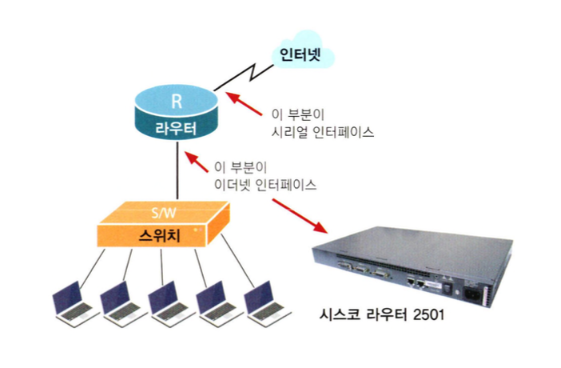

위 그림의 오른쪽은 우리가 가장 많이 사용하는 라우터인 시스코 2501에서 실제 이더넷과 시리얼 인터페이스를 나타내고 있습니다.  
(무엇이 이더넷 인터페이스이고, 또 무엇이 시리얼 인터페이스인지, 그리고 인터페이스란 무엇인지는 앞으로 배울 라우터에서 자세히 다룹니다. 여기서는 일단 내부 네트워크에 연결되는 라우터의 포트를 이더넷 인터페이스라고 생각하시고 외부, 즉 인터넷쪽으로 연결되는 인터페이스를 시리얼 인터페이스라고 생각하면 됩니다.)

시스코 2501의 경우 이더넷 인터페이스는 1개이고, 인터넷과 접속하기 위한 시리얼 인터페이스는 2개입니다. 그리고 시리얼 인터페이스는 DSU 또는 CSU라는 전용선 모뎀에 연결됩니다.  
위와 같은 가정에서 우리가 라우터에 부여해야 하는 IP 주소는 두 개가 됩니다. 하나는 이더넷(Ethernet) 인터페이스에 부여할 주소이고, 또 하나는 시리얼(Serial) 인터페이스에 부여할 IP 주소입니다. 이더넷용 IP 주소는 우리가 내부에서 사용하기 위해 부여받은 IP 주소 중 하나를 배정해야 합니다.

이유는 아시죠? 즉 라우터의 이더넷쪽은 앞에서 말씀드린 대로 내부 네트워크에 접속되기 때문입니다. 예를 들어 우리가 내부 PC용으로 부여받은 주소가 203.120.150.1~203.120.150.255 까지라면 라우터의 주소는 그 중 하나, 이럴 때는 보통 맨 앞의 번호를 씁니다. (제일 중요하니까요.) 그래서 라우터의 이더넷 주소는 203.120.150.1 이 부여되는 겁니다.

이때 주의할 점은 이렇게 라우터에 부여한 주소는 또 다시 PC에 부여하면 안 된다는 겁니다. 다 아시는 내용이죠? 그건 모든 PC에서도 마찬가지입니다.  
절대로 같은 IP 주소를 갖는 PC가 있으면 안 되기 때문입니다. 만약에 라우터에 부여한 주소를 PC에 또 써서 두 IP 주소가 충돌이 발생하는 경우는 라우터의 역할을 제대로 수행할 수 없습니다.

그럼 시리얼(Serial)에는 어떤 주소를 부여해야 할까요?

그건 우리 마음대로 부여할 수 있는 게 아닙니다. 라우터가 접속하는 상대편(ISP 업체) 라우터의 시리얼 인터페이스와 IP 주소를 서로 맞추어야 하기 때문입니다. 일단은 우리 내부용 IP 주소와는 다른 네트워크가 됩니다.  
당연하죠. 나중에 배우겠지만 라우터에서 인터페이스가 달라지면 그건 네트워크가 달라진다는 것을 의미합니다. 상대편 라우터의 시리얼과는 같은 네트워크가 되어야 합니다.

예를 들어볼까요?

상대편 라우터의 시리얼이 203.150.150.5에 서브넷 마스크가 255.255.255.252라면 우리 라우터의 Serial은 203.150.150.6에 서브넷 마스크는 255.255.255.252가 되는 겁니다. (일단 서브넷 마스크는 서로 같아야 합니다. 이것은 나중에 다시 배울 겁니다.)  
이해가십니까? 이번에 이해 안 가신다고 너무 걱정하실 건 없습니다. 다음에 이 부분은 자세히 설명할 겁니다.


## IP 주소 이야기 - 2탄

앞에서 알아본 것처럼 IP 주소는 32자리 2진수로 구성되어 있습니다. 그럼 이번 시간에는 먼저 '네트워크 부분(Network Part)'과'호스트 부분(Host Part)'이란 말이 무엇인지를 알아보도록 하겠습니다.

여기서 말하는 네트워크는 하나의 브로드캐스트 영역(Broadcast Domain)이라고 생각하면 됩니다. 더 어렵다구요? 무슨 말이냐면 하나의 PC가 데이터를 뿌렸을 때 그 데이터를 라우터를 거치지 않고도 바로 받을 수 있는 영역이란 뜻입니다.

예를 들어볼까요?

A라는 게임방에서 한 PC가 데이터를 그 게임방 안에 있는 다른 PC에게 전송한다면 그 데이터는 라우터를 거치지 않고 바로 전달이 가능합니다. 왜냐하면 두 PC는 같은 네트워크 영역(즉 네트워크 부분이 같다는 겁니다.) 안에 있기 때문입니다.  
하지만 A라는 게임방에 있는 PC가 인터넷의 어떤 PC(예를 들면 외국에 있는 PC나 서버)에 데이터를 보낸다면 그건 라우터를 거치지 않고는 전달이 불가능합니다. 왜냐하면 두 PC가 같은 네트워크상에 있지 않기 때문입니다. (이 경우 두 PC의 네트워크 부분은 서로 다릅니다.) 아마 전에 설명드린 ARP를 기억하는 분은 금방 이해되실 겁니다.  
전에도 라우터가 브로드캐스트 영역을 나누는 역할을 한다고 말씀드렸죠? 따라서 한 브로드캐스트 영역 안에 있는 두 PC는 라우터 없이도 통신이 가능하지만 그렇지 않은 경우에는 라우터를 꼭 거쳐야 한다는 겁니다.

이야기가 좀 길어졌습니다. 아무튼 '한 네트워크'란 용어의 정의는 하나의 브로드캐스트 영역이란 말인 동시에 라우터를 거치지 않고도 통신이 가능한 영역이란 뜻이 됩니다.

그럼 호스트란 말은 무엇일까요?

말뜻 그대로 주인이란 의미가 이니고 그냥 각각의 PC 또는 장비라고 생각하면 됩니다. 이렇게 네트워크와 호스트를 설명드리는 이유는 IP 주소가 보기에는 그냥 점 3개로 나누어진 4자리 숫자 같지만, 사실 IP 주소 자체는 네트워크 부분과 호스트 부분으로 나누어져 있습니다.

따라서 어떤 네트워크에서든지 '하나의 네트워크'에서는 네트워크 부분은 모두 같아야 되고 호스트 부분은 모두 달라야 정상적인 통신이 일어난다는 겁니다.

예를 들어볼까요? 한 사무실에서 50대의 PC가 한 라우터를 통해 연결되어 있다면(좀 더 정확히 표현하자면 한 라우터에 하나의 인터페이스란 표현이 맞을 겁니다. 왜냐하면 하나의 라우터에도 여러 개의 인터페이스가 있으니 말입니다.) 이 PC들은 모두 같은 네트워크상에 있다고 말합니다. (기억나시죠? 동일한 브로드캐스트 영역입니다.) 따라서 이 PC들의 IP 주소 중에서 네트워크 부분은 모두 같아야 합니다.  
그래야 라우터를 거치지 않고 서로 통신하는 것이 가능합니다. 하지만 호스트 부분은 서로 모두 달라야 합니다. 만약 호스트가 같으면 두 PC는 서로 IP 주소 충돌이 생겨서 통신이 불가능하게 됩니다. 마치 각 지방별로 전화번호를 나눌 때 한 지역의 지역번호는 모두 같고(예를 들어 전북 지역의 모든 전화번호에서 지역번호는 063으로 모두 같습니다.) 전화번호는 서로 다른 것과 마찬가지입니다.

좀 더 구체적으로 예를 들어보면 한 PC방에서 쓰는 IP 주소가 203.240.100.1ㅇ네서 203.240.100.255까지라면 이 중에서 203.240.100부분은 네트워크 부분입니다. (네트워크 부분에 대한 내용은 뒤에서 배웁니다. 확실한 건 마음대로 네트워크 부분을 정하는 건 아니고 규칙이 있다는 겁니다.)  
따라서 이 PC방에서 쓰는 모든 IP 주소 중 이 부분은 모두 동일해야 한다는 겁니다. 그렇지 않으면 통신이 불가능해집니다. 또하나 호스트 부분은 맨 마지막 자리(마지막 옥텟)가 됩니다. 따라서 1에서 255가 바로 호스트 부분이 되는 겁니다.  
이해가 가시죠? (아직 이해가 안 가셔도 됩니다.) 호스트 부분 1에서 255까지는 모든 PC가 서로 달라야 합니다.

아래 그림을 보면 2번 네트워크에 속한 두 대의 PC와 라우터의 인터페이스는 모두 같은 네트워크 부분, 즉 2를 가지고 있습니다. 하지만 호스트 부분(다른 말로는 '노드 부분'일아고도 합니다.)은 서로 다릅니다.  
이 호스트 부분은 같은 네트워크에서는 반드시 서로 달라야 합니다. 하지만 서로 다른 네트워크에서는 호스트 부분이 서로 같아도 됩니다. (1번 네트워크에서도 호스트 부분에 1이 있는 것 보이죠?)  
또한 여기서는 IP 주소 형식 대신 알아보기 쉽도록 중간에 점 하나만 찍는 약식 포맷을 사용했습니다. (원래는 이런 형식은 없습니다.) 또 하나 알아두셔야 할 내용은 IP 주소 중에 네트워크 부분만이 라우터가 라우팅을 할 때 참고하는 부분이라는 겁니다.

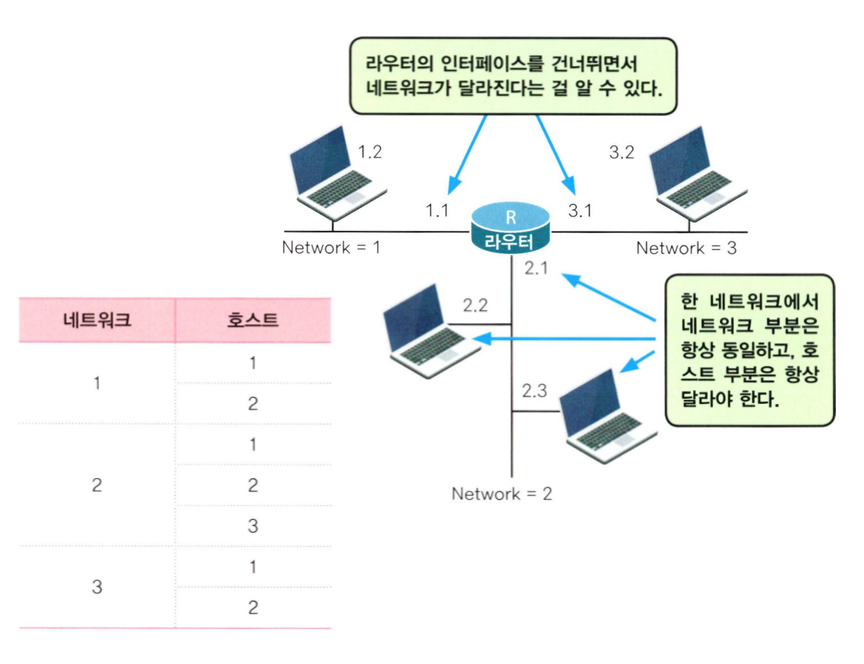


## IP 주소 이야기 - 3탄

인터넷에서 사용되는 프로토콜이 바로 TCP/IP이고, TCP/IP가 사용하는 주소가 바로 IP 주소이므로 꼭 제대로 이해하고 넘어갔으면 합니다.

이번에는 그 세 번째 이야기로 우선 지난 줄거리를 알아볼까요?

IP 주소는 32자리 이진수로 구성되어 있고, 또 이 주소는 보통 십진수로 표현되는데, 중간에 점 세 개를 찍어서 4개의 자리로 표시된다. 그리고 IP 주소는 네트워크 부분과 호스트 부분(노드부분)으로 나뉘는데, 네트워크 부분은 '한 네트워크'상에서는 모두 같아야 되고 호스트 부분은 서로 모두 달라야 된다. 여기까지였습니다.

지금까지 이 책을 읽어본 분이라면 어디까지가 네트워크 부분이고, 또 어디까지가 호스트 부분인지 궁금하실 겁니다.

예를 들어, 203.240.100.1이란 IP 주소에서 네트워크 부분은 어디까지일까요? 또 호스트 부분은 어디까지가 될까요? 여기서 네트워크 부분은 203.240.100까지입니다. 그리고 마지막 자리, 즉 1이 호스트 부분입니다.

이렇게 IP 주소를 보고 네트워크 부분과 호스트 부분을 나누는 방법은 서로 간의 약속입니다.

그런 약속을 해놓은 것이 바로 IP 주소의 Class입니다. 아시겠지만 IP 주소는 5개의 Class로 구분됩니다. 하지만 우선 3개만 알면 됩니다. 나머지 두 개는 여기서는 별로 쓰이지 않거든요.(두 개 중 하나는 멀티캐스트용, 하나는 연구용으로 생각하면 됩니다.)

IP 주소의 클래스(Class)는 A부터 B, C, D, E로 구분됩니다. 이렇게 클래스에 따라서 어디까지가 네트워크 부분이고, 어디까지가 호스트 부분인지가 나뉩니다.  
그럼 왜 이렇게 클래스를 나누었을까요? IP 주소를 3개의 클래스로 나눈 건 바로 네트워크의 크기에 따른 구분이라고 생걱하면 됩니다. 하나의 네트워크가 호스트의 수를 몇 개까지 가질 수 있는가에 따라서 클래스가 나뉩니다.

먼저 클래스 A를 알아보겠습니다.

클래스 A는 하나의 네트워크가 가질 수 있는 호스트 수가 가장 많은 클래스입니다. IP 주소가 원래 이진수로 표시된다는 것은 다 기억하시죠? 그래서 클래스 A는 32개의 이진수 중에서 맨 앞쪽 하나가 항상 0으로 시작되는 것들입니다.

즉 0xxx xxxx.xxxx xxxx.xxxx xxxx.xxxx xxxx와 같이 32개의 이진수 중에서느 맨 앞 하나는 꼭 0이 나와야 되고 나머지는 0과 1중 아무거나 나와도 됩니다. 어떤 숫자가 이 범위 안에 있는지를 알아볼까요?

일단 위의 조건을 만족하는 가장 작은 수는 무엇일까요? 네, 맞습니다. 당연히 x 부분이 전부 0일 때입니다. 그렇다면 이번에는 위의 조건을 만족하면서 가장 큰 숫자는 무엇일까요? 그건 바로 x 부분이 이진수에서 가장 큰 수인 1로 채워지는 겁니다.

즉 0111 1111.1111 1111.1111 1111.1111 1111입니다. 맨 앞의 0은 꼭 써야 되니까 그다음부터 1을 썼습니다. 자, 그럼 이 숫자를 십진수로 만들면 어떻게 될까요? 이건 십진수로는 127.255.255.255입니다.

여기서 또 한 가지 클래스 A의 중요한 규칙이 나옵니다. 클래스 A의 경우는 앞의 8비트(즉 1개의 옥텟, 맨 앞의 십진수 부분)가 네트워크 부분을 나타내고, 나머지 24비트(즉 3개의 옥텟, 나머지 3개의 십진수)가 호스트 부분을 나타낸다는 약속이 있습니다.

그래서 클래스 A는 가장 작은 네트워크 1.0.0.0(0.0.0.0은 제외됩니다.)에서 가장 큰 네트워크 126.0.0.0(127은 제외됩니다. 이건 약속입니다. 또 네트워크를 나타낼 때는 호스트 부분은 모두 0으로 씁니다.)까지로 규정됩니다.

자, 이제 클래스 A에 대해 정리해보겠습니다.

IP 주소 중에서 1부터 126으로 시작하는 네트워크는 클래스 A입니다. 그리고 하나의 클래스 A가 가질 수 있는 호스트의 수는 2의 24승 빼기 2개(모두 0인 경우는 네트워크 자체를 나타내기 때문에 제외되고, 모두 1인 경우는 브로드캐스트 주소이기 때문에 제외), 즉 16,777,214개입니다. 정말 많죠?

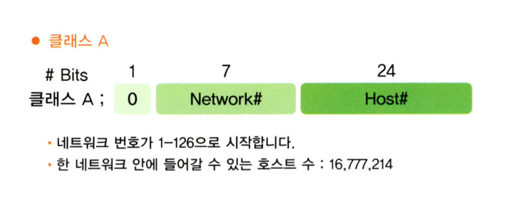

예를 들어보겠습니다. 제가 만약 InterNIC(공인 IP 주소를 분배 관리하는 곳)으로부터 클래스 A 주소로 13.0.0.0 네트워크를 받았다고 가정해 보겠습니다.

클래스 A는 말씀드린 대로 맨 앞에 하나의 옥텟만 네트워크 부분이고, 나머지 3개의 옥텟은 호스트 부분이기 때문에 IP 주소를 분배하는 InterNIC에서는 이처럼 앞자리 13만 주게 됩니다. 뒤에 3개의 옥텟, 즉 호스트 부분은 마음대로 정할 수 있다는 겁니다.

따라서 13.0.0.0 네트워크 하나를 받았을 때 사용할 수 있는 호스트는 몇 대인가를 계산해보려면 13.0.0.0~13.255.255.255까지 몇 개의 수가 들어가는가를 알아보면 됩니다. (여기서는 쉽게 십진수로 표시했지만 여러분은 이진수로 계산해보기 바랍니다.)  
옥텟 한 자리가 2의 8승(256) 개 만큼의 수이기 때문에 호스트 전체 자리인 옥텟 3자리로 나타낼 수 있는 전체 숫자는 2의 24승 개만큼 됩니다. (호스트의 자릿수가 2진수 24자리이기 때문입니다.)  
그런데 호스트가 전부 0인 경우, 즉 13.0.0.0인 경우는 호스트 주소가 아니라 네트워크 전체를 나타내기 때문에 사용하지 않고, 또 호스트가 전부 1인 경우, 즉 13.1111 1111.1111 1111.1111 1111(즉 13.255.255.255)인 경우는 13 네트워크 전체에 있는 모든 호스트들에게 전송할 때 사용하는 브로드캐스트 주소이기 때문에 호스트 주소로 사용하지 않습니다.  
따라서 13 네트워크에 가능한 호스트 수는 2의 24승에서 2를 뺀 수가 되는데, 이게 바로 16.777.214입니다.

이번에는 클래스 B를 알아보겠습니다.

클래스 B는 맨 앞이 반드시 10(이진수)으로 시작됩니다. 뒤에는 어떤 숫자가 와도 상관 없습니다. 즉 10xx xxxx.xxxx xxxx.xxxx xxxx.xxxx xxxx입니다. 따라서 맨 앞에는 10이 반드시 나와야 하고 나머지 30개의 이진수는 0과 1 중에서 어떤 수가 와도 됩니다.

자, 그럼 이 조건에 맞는 가장 작은 수와 가장 큰 수를 찾아볼 시간입니다. 10을 앞에 두고 모두 0을 집어넣으면 클래스 B에서 가장 작은 숫자를 찾을 수 있을 겁니다.  
즉 1000 0000.0000 0000.0000 0000.0000 0000이고 십진수로는 128.0.0.0입니다. 그럼 가장 큰 숫자는 역시 10을 앞에 두고 나머지 부분을 이진수에서 가장 큰 숫자인 1로 모두 채워넣으면 됩니다.  
즉 1011 1111.1111 1111.1111 1111.1111 1111이고, 십진수로는 191.255.255.255가 됩니다.

클래스 C의 경우 앞의 24비트(즉 옥텟 3개, 맨 앞의 3자리 십진수 부분)가 네트워크 부분을 나타내고 나머지 8비트(즉 1개의 옥텟, 나머지 1개의 십진수)가 호스트 부분을 나타낸다는 약속이 있습니다.  
그래서 클래스 C는 가장 작은 네트워크 192.0.0.0에서 가장 큰 네트워크 223.255.255.0(네트워크를 나타낼 때는 호스트 부분은 모두 0으로 씁니다.)까지가 포함됩니다.

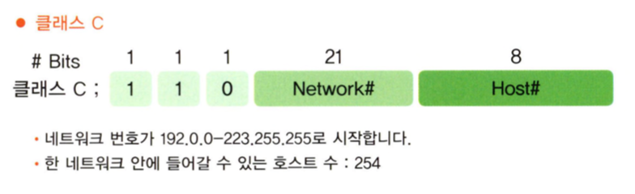

자, 이제 마지막으로 클래스 C에 대해 정리해보겠습니다.

IP 주소 중에서 192부터 223으로 시작하는 네트워크는 클래스 C입니다. 그리고 하나의 클래스 C가 가질 수 있는 호스트의 수는 2의 8승 빼기 2개(모두 0인 경우는 네트워크 자체를 나타내기 때문에 제외되고, 모두 1인 경우는 브로드캐스트 주소이기 때문에 제외). 즉 254개 입니다.

이제 클래스 A, B, C에 대해서 전부 알아봤습니다. 앞으론 어떤 IP 주소를 만나더라도 네트워크 부분과 호스트 부분을 알아낼 수 있을 것입니다.

정말 그런지 예를 한 번 들어볼까요? 전에 설명드렸던 203.240.100.1이란 IP 주소를 살펴보겠습니다. 이 IP 주소에서 네트워크 부분은 어디일까요? 이제 아시겠죠? 먼저 이 주소가 어떤 클래스에 속하는지를 알아야 합니다.  
203으로 시작하는 주소는 클래스 C라는 것을 알 수 있습니다. 왜냐하면 203이 192에서 223 사이에 들어 있기 때문입니다. 따라서 클래스 C의 규칙에 따라서 203.240.100까지가 네트워크 번호입니다. 그럼 203.240.100 네트워크에 들어갈 수 있는 최대 호스트 수는 몇 개일까요?  
그것은 1부터 254까지(0은 네트워크 번호이고, 255는 브로드캐스트 번호이므로 사용하지 않습니다.) 모두 254개입니다. 따라서 203.240.100 네트워크를 가지고는 모든 PC들을 한 네트워크상에 넣을 수 없는 겁니다.  
따라서 254개보다 많은 호스트를 가질 수 있는 IP 주소가 필요한 겁니다. (아니면 클래스 C 네트워크를 몇 개 더 만들어야 합니다.)

그런데 만약 클래스 B 주소를 가지고 있다면 어떨까요? 예를 들어 150.150.100.1이란 주소는 네트워크 부분이 150.150이고, 호스트 부분이 100.1입니다. 그럼 이 네트워크상에는 몇 개의 호스트가 올 수 있을까요? 정답은 65,534개라는 것을 이제 다 알겠죠? 즉 150.150.0.1에서 150.150.255.254까지 입니다.

이렇게 클래스를 나누는 이유는 IP 주소를 작정하고 효율적으로 배분하기 위한 것입니다. 이제 여러분은 클래스 A, B, C에 대해서는 이해가 가실 겁니다. 일단 이제 IP 주소의 앞부분만 살짝 보면 '아! 이게 클래스 C구나.' 아니면 '이건 클래스 A구나.'라고 금방 아실 겁니다.

그럼 지금까지 클래스 A, B, C에 대해서는 알아봤구요, 클래스 D와 E가 남았는데요, 클래스 D는 멀티캐스트용으로 사용되는 주소이고, 클래스 E는 연구용으로 사용되는 주소랍니다.  
멀티캐스트는 나중에 다시 설명드릴 기회가 있겠지만, 여기서는 쉽게 내가 필요한 그룹에만 한꺼번에 데이터를 전송할 때 쓰는 주소라고만 기억해 두시면 될 것 같습니다. 여기서 간단하게 IP 주소를 클래스별로 정리해볼까요?

- 클래스 A: 1~126(127은 예비번호)
- 클래스 B: 128~191
- 클래스 C: 192~223
- 클래스 D: 224~239(멀티캐스트용 주소)
- 클래스 E: 240~255(연구용 주소)

그럼 잠깐 클래스에 대해서 문제를 풀어보겠습니다. 확실히 안다고 생각하는 분은 안 푸셔도 됩니다.

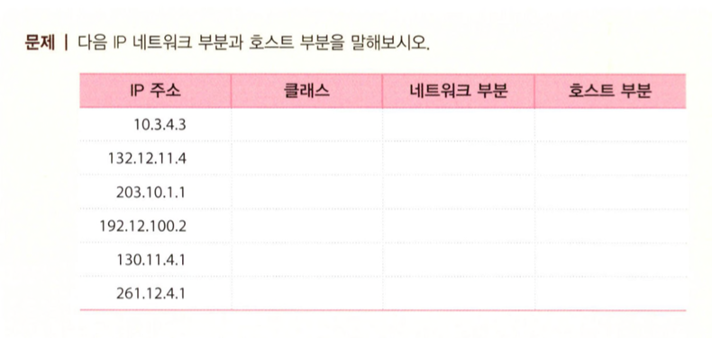

다음이 정답입니다. 

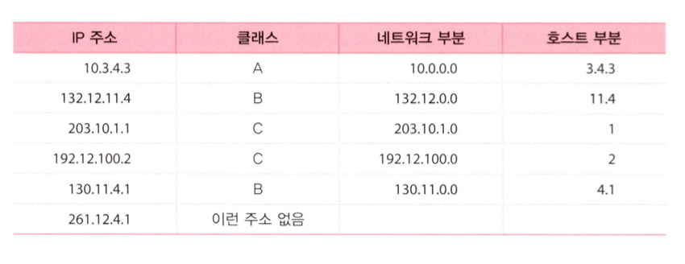


## IP 주소의 활용

지금까지 배운 IP 주소를 제대로 이해하고 있는지에 대한 활용이라고 생각하시면 됩니다. 먼저 우리가 알고 있는 몇 가지 정보를 정리해보는 시간을 가져보겠습니다.  

네트워크가 서로 다른 두 장비 간의 통신은 라우터를 통해서만 가능합니다.

TCP/IP 통신할 경우 라우터의 각 인터페이스 역시 IP 주소를 부여해 주는 것이 좋습니다. (물론 일부 인터페이스는 IP 주소를 부여하지 않아도 되지만, 가능하면 부여하는 것이 좋습니다.)  
라우터의 인터페이스에 IP 주소를 부여할 때는 그 인터페이스가 속한 네트워크의 주소를 부여 해야 합니다. IP 주소를 배정할 때는 그 네트워크에 몇 개의 호스트가 접속이 가능한지를 먼저 확인한 후에 배정하는 주소가 이 호스트를 모두 포함할 수 있는지를 확인해야 합니다.  
즉 예를 들어 300개의 호스트가 있는 네트워크에 클래스 C 하나를 배정하면 안 된다는 겁니다. (클래스 C는 최대 가능 호스트 수가 254개이기 때문입니다.)

이제 아래 그림에 대한 상황을 생각해 보겠습니다.

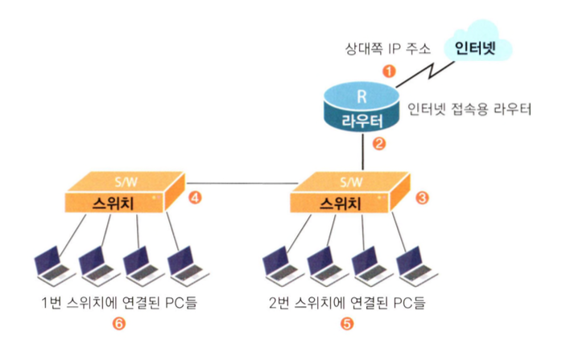

자, 여러분은 이제 네트워크 전문가가 되어서 어떤 사이트에 컨설팅을 하러 나왔습니다.

먼저 이 사이트를 파악해보니 사용자 수, 즉 PC의 수가 약 90대, 그리고 스위치가 2대, 라우터가 한 대 입니다. 하지만 이 사이트는 앞으로 계속 확장되어 3년 이내에 PC가 약 200대로 늘어날 예정이라고 합니다.

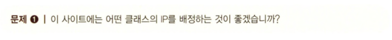

당연히 클래스 C입니다. 왜냐하면 클래스 C에 배정할 수 있는 호스트 수가 254개이기 때문에 현재 상황에 가장 맞습니다. 클래스 B나 클래스 A가 안 되는 것은 아니지만, 호스트 주소가 너무 많기 때문에 IP 주소를 낭비하는 일일뿐만 아니라 이렇게 큰 주소는 배정해 주지도 않습니다.

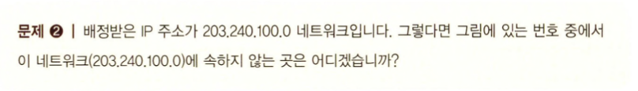

답은 1번입니다. 1번은 시리얼 인터페이스인데, 라우터를 사이에 두고 1번과 2, 3, 4, 5, 6번이 나누어져 있는 걸 알 수 있습니다. 전에 말씀드린 대로 라우터를 넘어서게 되면 네트워크는 바뀌게 되는 겁니다.  
따라서 2, 3, 4, 5, 6번은 하나의 네트워크 즉 하나의 브로드캐스트 도메인이어서 라우터가 없이도 통신이 가능하지만, 1번과의 통신은 반드시 라우터를 거쳐야만 가능합니다.

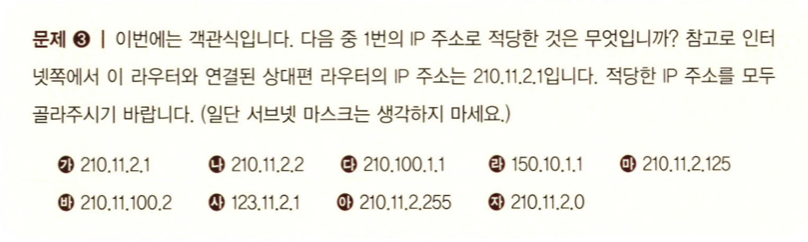

정답은 나, 마 이렇게 두 개가 됩니다. 왜 그런지 알아볼까요?

먼저 가는 상대편 시리얼 주소와 같은 주소라서 이 주소를 선택하게 되면 IP 주소의 충돌이 발생합니다. IP 주소는 서로 같아서는 통신이 안 된다는 것 아시죠?  
다는 서로 다른 네트워크입니다. 그러나 양쪽 라우터의 서로 연결된 인터페이스는 같은 네트워크에 속해야만 합니다. 따라서 인터넷쪽의 라우터가 210.11.2.1이라면 우리쪽 라우터의 시리얼 인터페이스쪽도 201.11.2.1과 같은 네트워크에 있는 IP 주소를 사용해야 한다는 겁니다.  
그런데 210.11.2.1은 클래스 C이기 때문에 같은 네트워크가 되려면 최소한 210.11.2까지가 같아야 합니다. 클래스 C의 경우 앞쪽 3개의 옥텟이 네트워크 부분이 된다는 것 말입니다. 그런데 다는 이것에 해당되지 않습니다.

라 역시 서로 다른 네트워크라서 불가능합니다. 라는 클래스 B라서 클래스도 완전히 다른 네트워크 번호입니다.

바 역시 다른 네트워크에 속한 IP 주소입니다.

사도 다른 네트워크에 속한 IP 주소입니다.

아는 같은 네트워크에 속한 번호이기는 하지만, 호스트에 부여하는 번호가 아니고 브로드캐스트용 번호입니다. 따라서 라우터의 인터페이스에 부여하는 번호가 아닙니다.

자는 호스트 주소가 아니고 네트워크 그 자체를 표시하는 주소입니다. 아시죠? 네트워크 번호는 호스트 부분을 '0'으로 쓴다는 것 말입니다.

그래서 정답은 나와 마입니다.

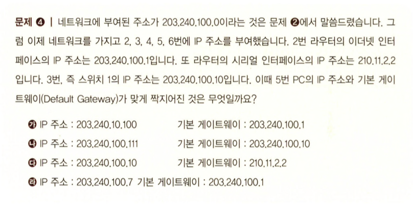


기본 게이트웨이가 뭐냐구요? 여러분의 PC 세팅에서 확인할 수 있습니다. PC마다 전부 기본 게이트웨이가 세팅되어 있습니다. 만약 PCdp 기본 게이트웨이가 세팅되어 있지 않으면 여러분은 인터넷을 할 수 없습니다.

기본 게이트웨이(Default Gateway)fkㄴ, 말 그대로 '기본이 되는 문'입니다. 즉 내부 네트워크에서는 라우터 없이도 통신이 가능합니다. 같은 브로드캐스트 도메인에서는 라우터 없이 통신이 가능하다는 것을 이제 알고 계실 겁니다.  
따라서 통신을 할 때 우리가 어떤 곳을 찾아간다면 PC는 그곳을 찾기 위해 내부 네트워크를 먼저 뒤집니다. 전부 찾아봐도 없다면 그 다음은 밖으로 나가서 찾아보는 겁니다. 이때 밖으로 나가는 문이 있는데, 이 문이 바로 기본 게이트웨이라는 겁니다.  
즉 기본 게이트웨이란, 내부 네트워크에서 없는 녀석을 찾을 때 밖으로 통해 있는 문이 되는 겁니다. 따라서 이 문은 바로 라우터의 이더넷 인터페잏스가 되는 겁니다.  
자, 그렇다면 PC 5번의 기본 게이트웨이는 나왔죠? 바로 203.240.100.1입니다. 즉, 라우터의 이더넷 인터페이스입니다. 그다음 5번 PC의 IP 주소는 203.240.100.0 네트워크에 속하면서 아직 사용하지 않은 번호를 선택하면 됩니다. 따라서 답은 라가 됩니다.

참고로 라우터에는 인터페이스별로 각각 IP 주소를 배정하지만, 스위치나 허브는 IP 주소를 장비별로 하나씩만 배정합니다. 또 이런 스위치나 허브에 IP 주소를 배정하는 이유는 단지 관리를 위한 것입니다.  
즉 스위치나 허브에 IP 주소를 배정하지 않아도 통신에는 전혀 지장이 없다는 것을 잊지 마시기 바랍니다. 따라서 허브나 스위치에 IP 주소를 배정하지 않아서 또는 잘못 배정해서 통신이 안 된다는 말은 틀린 말입니다. (물론 IP 주소를 겹쳐 써서 IP 주소가 쫑나는 경우는 빼고 말입니다. 또 Layer 3 이상의 스위치는 물론 IP 주소를 제대로 줘야겠죠?)

여기까지 그동안 배운 IP 주소를 이용한 예를 한 번 알아봤습니다. 그리 어렵지는 않았겠지만, 꾸준히 연습해 보기 바랍니다. 여러분이 앞으로 관련 사이트나 시험에서 자주 만날 수 있는 문제이기 때문입니다. 계손 연습하셔서 완전히 자기 것으로 만들기 바랍니다.


## 서브넷 마스크(Subnet Mask)의 시작

여기에서는 서브넷 마스크에 대해서 알아보겠습니다.

서브넷 마스크를 잘 이해하는 것이야말로 IP 주소를 확실히 이해하는 가장 중요한 포인트입니다. 사실 네트워크 엔지니어들도 처음에는 서브넷 마스크 부분을 많이 혼동하는 경우가 있고, 또 네트워크에 관한 시험에는 이런 서브넷 마스크에 대한 문제가 항상 단골로 등장합니다.

자, 그럼 서브넷 마스크를 제대로 이해하려면 무엇이 가장 필요한지부터 알아볼까요?

먼저 이진수의 이해입니다. 제가 몇 번씩이나 이진수에 대해서 이야기드리는 것은 그만큼 이진수의 완벽한 이해가 필요하기 때문입니다.

두 번째는 논리적(Logitcal, 로지컬) AND에 대한 이해입니다.

Logical AND의 성질은 양쪽이 모두 1인 경우에만 결과도 1이 된다는 겁니다.

즉 

```
0 AND 0 = 0
0 AND 1 = 0
1 AND 0 = 0
1 AND 1 = 1
```

이 된다는 겁니다.

이 2가지를 확실히 이해하셨으면 서브넷 마스크는 아주 쉽습니다. 자, 그럼 지금부터 왜 서브넷 마스크가 필요한지, 그리고 서브넷 마스크의 정체가 무엇인지를 알아보도록 하겠습니다.

서브넷 마스크(Subnet Mask)란, 일단 말뜻 그대로 서브, 즉 메인이 아닌 어떤 가공을 통한 네트워크를 만들기 위해서 씌우는 마스크라고 생각하면 됩니다.  
다시 말해서 우리가 일단 어떤 IP 주소를 배정받게 되면 보통은 이 주소를 그대로 사용하지 않습니다. 왜냐하면 자신의 입맛에 맞추어야 하기 때문입니다.  
예를 들어 클래스 B 주소를 받았습니다. 이것을 그냥 사용할 수 있을까요? 하나의 네트워크가 65,000여 개의 호스트를 가지는데, 이렇게 큰 네트워크를 구성했다가는 브로드캐스트의 영향이 너무 커서 아마 아무것도 할 수 없을 겁니다.

따라서 나누어 써야 하는 겁니다.

우리가 돼지고기 5근을 사서 집에 가서 구워도 먹고 찌개도 끓여 먹으려면 일단 적당히 잘라서 나누어야겠죠? IP 주소도 마찬가지입니다.  
고기를 자를 때 칼을 쓰듯이 IP 주소를 자를 때는 서브넷 마스크를 사용합니다. 즉 부여받은 원래 상태의 IP 주소에 서브넷 마스크를 씌워서 네트워크를 나누어 주는 겁니다.  
대충 이해가 가시죠? 그럼 그것을 어떻게 나누는지는 뒤에 가서 알아보도록 하겠습니다.

여기서는 '서브넷 마스크는 주어진 IP 주소를 네트워크 환경에 맞게 나누어 주기 위해서 씌워주는 이진수의 조합이다.'까지만 알면 됩니다.

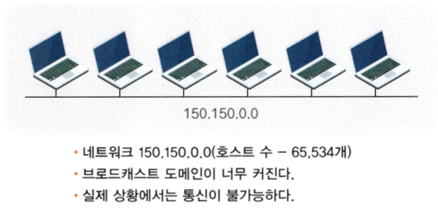

위의 그림처럼 클래스 B를 받아서 서브넷을 만들지 않고 그냥 사용하는 경우는 브로드캐스트 도메인이 너무 커져서 브로드캐스트가 너무 많이 발생하게 됩니다.  
따라서 정상적인 통신이 불가능해지므로 이 네트워크에는 서브네팅이 필요합니다.

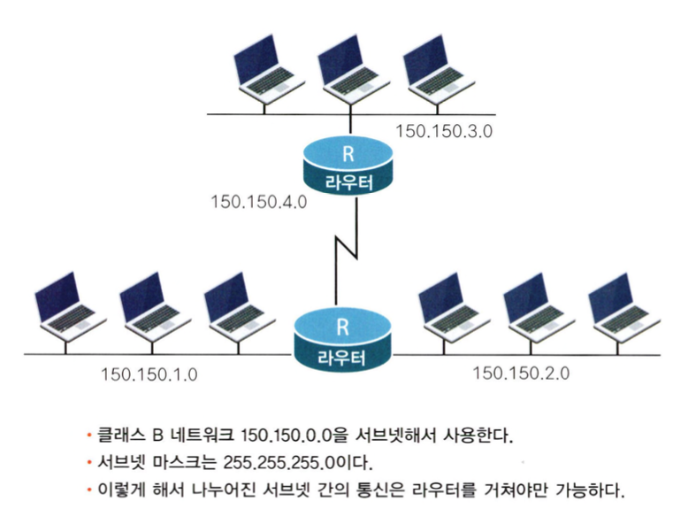

서브넷 마스크를 하게 되면 위의 그림과 같은 구성이 가능합니다. 즉 브로드캐스트 도메인을 더욱 작게 나누었습니다. 서브넷 마스크는 원래 디폴트 서브넷 마스크가 255.255.0.0이었던 것이 새로운 서브넷 마스크 255.255.255.0으로 바뀝니다.

또한 각각의 서브넷 간의 통신은 라우터를 통해서만 가능합니다. 즉 150.150.1.0 네트워크와 150.150.2.0 네트워크 간의 통신은 라우터를 통해서만 가능해집니다.

여기서 여러분들은 왜 서브넷 마스크가 255.255.0.0인지, 또 그것이 의미하는 것이 무엇인지에 대한 의문이 생길 겁니다. 아직은 그런 건 설명을 하지 않았으니까 모르셔도 됩니다.  
이번장에서 아셔야 할 것은 그냥 '서브넷 마스크란 게 필요하구나!' 하는 정도입니다. 즉 서브넷 마스크는 커다란 네트워크를 잘게 나누기 위해서 필요하다는 것만 이해했다면 이번 장에서 배워야 할 내용을 다 배운 것입니다.


## 서브넷 마스크에도 기본은 있다

모든 IP 주소에는 서브넷 마스크가 따라다닙니다. 예를 들어 클래스 C 주소를 전부 쓰더라도 서브넷 마스크는 따라다닙니다.  
즉 IP 주소를 나누어서 쓰기 위해서 사용하는 서브넷 마스크는 그 주소를 나누지 않더라도 항상 그 옆에 붙어다닌다는 겁니다. 그래야 그 주소를 나눈 건지, 나누지 않은 건지 알 수 있기 때문입니다.

예를 한번 들어볼까요?

210.100.100.1이란 주소가 있습니다. 이 주소는 아시는 것처럼 클래스 C입니다. 그래서 이 주소를 가지고 254개의 호스트에 IP 주소를 부여했다고 가정하겠습니다.  
그럼 주어진 클래스 C를 하나도 가공하지 않고, 즉 쪼개지 않고 그대로 사용한 겁니다. 그렇다고 서브넷 마스크를 쓰지 않느냐? 그건 아닙니다. 이처럼 주어진 클래스 C를 나누어 쓰지 않고 몽땅 쓰는 경우에도 서브넷 마스크는 따라다니는데, 그게 바로 디폴트 서브넷 마스크(Default Subnet Mask), 즉 기본 서브넷 마스크입니다.

클래스 C의 경우 디폴트 서브넷 마스크는 255.255.255.0입니다.

그러므로 주어진 네트워크를 하나도 나누지 않고 그대로 다 쓰는 경우는 위에서 설명드린 디폴트 서브넷 마스크를 쓰면 됩니다. 하지만 주어진 네트워크를 나누어서, 즉 가공해서 쓰는 경우는 디폴트 서브넷 마스크를 쓰지 않고 약간 고쳐서 씁니다. (이런 경우는 '디폴트 서브넷 마스크'라고 하지 않고 그냥 '서브넷 마스크'라고만 합니다.)

자, 그럼 서브넷 마스크를 어떻게 고쳐야 할까요?

일단 여기서는 한 가지만 정확히 알아두시기 바랍니다. '서브넷 마스크는 IP 주소를 가지고 어디 까지가 네트워크 부분이고, 또 어디까지가 호스트 부분인지를 나타내는 역할을 한다'는 겁니다. 따라서 서브넷 마스크를 보면 그 IP 주소의 네트워크 부분과 호스트 부분을 알 수 있습니다.

이때 네트워크는 서브넷 마스크가 이진수로 '1'인 부분이고, 호스트는 서브넷 마스크가 이진수로 '0'인 부분이라는 겁니다. 즉, 가령 210.100.100.1의 서브넷 마스크가 255.255.255.0이라면(여기서 255는 이진수로 바꾸면 1111 1111입니다.)

255.255.255.0은 111 1111.1111 1111.1111 1111.0000 0000과 같습니다.

여기서 1인 부분은 네트워크 부분을 나타낸다고 했으니까 앞의 세 자리까지는 네트워크 부분이 되고, 뒤에 한 자리는 호스트 부분이 되는 겁니다. 따라서 210.100.100이 바로 네트워크 부분이 되고, 나머지 1이라고 쓰인 부분이 호스트가 됩니다.

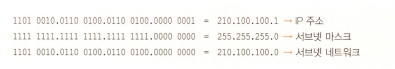

그러니까 클래스 C의 기본 성격과 똑같죠? 그래서 255.255.255.0 이 클래스 C의 디폴트 서브넷 마스크가 되는 겁니다. 이해가세요? 좀 어렵더라도 계속 해보면 아마 익숙해질 겁니다. 여러분이 만약 정말 멋진 엔지니어가 되고 싶다면 서브넷 마스크는 꼭 익혀야 합니다. 그러므로 자주 해보기 바랍니다.

여기서 잊어버리면 안 되는 것이 바로 서브넷 마스크가 이진수로 '1'인 부분이 네트워크가 되고 '0'인 부분이 호스트가 된다는 겁니다. 이것만 기억하면 아무리 어려운 서브네팅(Subnetting)도 가능할 겁니다.  
이것이 바로 논리적 AND 연산입니다. 즉 위에 IP 주소를 적고, 아래에 서브넷 마스크를 적은 후 이 둘을 논리적 AND를 하게 되면 아래에 나온 답이 바로 서브넷이 되는 겁니다.  
앞에서 배운 대로 논리적 AND 연산은 양쪽이 모두 1인 경우에만 1이 된다는 특징을 가지고 있습니다. 한번 확인해 보기 바랍니다.

자, 그럼 서브넷 마스크를 어떻게 사용하는지 좀 더 자세히 알아보도록 하겠습니다.

아래 그림은 IP 주소가 서브넷 마스크를 통과해서 네트워크 부분이 어디까지인지를 알아내는 과정을 보여주고 있습니다. 지금까지 말씀드린 대로 서브넷 마스크를 가지고 있지 않는 IP 주소는 없습니다.  
비록 네트워크를 작게 나누지 않고 원래 클래스대로 사용하더라도 서브넷 마스크는 있습니다. 이것이 바로 디폴트 서브넷 마스크입니다.

어떤 IP 주소라도 서브넷 마스크를 통과시키게 되면(이것이 바로 논리적 AND 연산입니다.) 네트워크 부분이 어디까지인지를 알 수 있습니다. 그 규칙은 디폴트 서브넷 마스크도 마찬가지입니다.

그림에서 150.150.100.1이라는 IP 주소에 디폴트 서브넷 마스크인 255.255.0.0을 씌웠습니다. (150.150.100.1은 클래스 B이기 때문에 디폴트 서브넷 마스크는 255.255.0.0입니다.) 그러자 서브넷 마스크를 통과해서 내려온 네트워크 부분은 150.150.0.0이 되었습니다.


그림에서 서브넷 마스크를 통과해서 내려오는 값은 맨 윗줄의 IP 주소와 그다음 줄의 서브넷 마스크를 이진수로 만든 후 논리적 AND(Logical AND)를 수행한 값이 맨 아랫줄로 나오게 됩니다. 만 아랫줄에 나온 네트워크 부분을 잘 살펴보면 이전에 설명드렸던 대로 서브넷 마스크 부분이 이진수로 '1'인 부분(십진수로는 255인 부분)은 위에 있던 주소가 그대로 아래로 내려왔고, 서브넷 마스크 부분이 이진수로 '0'인 부분(십진수로도 0인 부분)은 위에 무엇이 있든 간에 무조건 '0'으로 되어서 내려오는 것을 알 수 있습니다.

이렇게 나온 값 150.150.0.0이 바로 150.150.100.1의 네트워크 부분입니다.

그럼 이번에는 150.150.100.1에 디폴트 서브넷 마스크가 아닌 새로운 서브넷 마스크 255.255.255.0을 씌워 보겠습니다. 어차피 서브넷 마스크의 성질은 똑같습니다. 따라서 서브넷 마스크가 1인 부분은 IP 주소가 그대로 내려오고, 서브넷 마스크가 0인 부분은 모두 0이 된다는 원칙에는 변함이 없습니다. 따라서 이렇게 서브넷 마스크를 통과해서 내려온 값이 새로운 네트워크 부분이 됩니다.

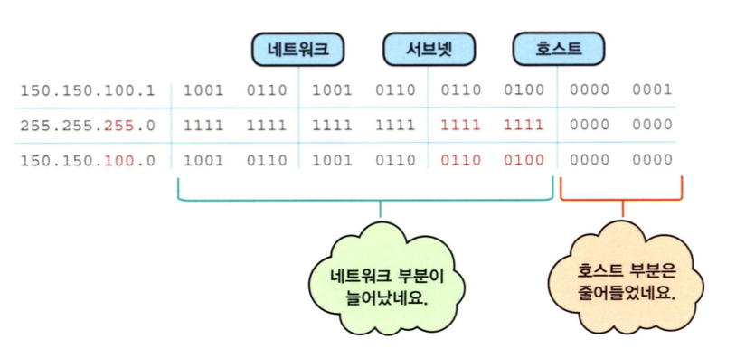

그림에서처럼 서브넷 마스크가 255.255.255.0이 되자 서브넷 마스크를 통과해서 아래로 내려온 네트워크 부분은 3자리의 십진수로 늘어났습니다. 즉 150.150.100.0이 되었습니다. 이 의미는 클래스 B 주소를 마치 클래스 C처럼 사용한다는 의미입니다.  
즉 네트워크 부분이 3자리로 늘고 호스트 부분이 한 자리로 줄었습니다. 이렇게 하나의 주소를 서브넷 마스크를 씌워서 작은 네트워크로 만드는 것을 '서브네팅'이라고 합니다.

> 서브넷 마스크에 대한 정리

즉 서브넷 마스크는 디폴트 서브넷 마스크와 무언가 변형을 한 서브넷 마스크로 나누어 볼 수 있습니다.  
그리고 서브넷 마스크를 사용하는 이유는 커다란 네트워크(호스트 숫자가 많은 네트워크)를 작은 네트워크 여러 개로 나누어서 쓰기 위함이다. 서브넷 마스킹은 기존 IP 주소의 호스트 부분의 일부를 네트워크 부분으로 바꾸는 작업이다.


## 서브넷 마스크의 기본 성질

네트워크에 입문하는 사람들이 흔히 서브넷 마스크는 너무 어렵다는 이야기를 합니다. 하지만 여러분이 이 책을 읽으면서 느끼신 대로 서브넷 마스크는 그리 어려운 것이 아닙니다.  
특히 다음에 설명할 몇 가지 서브넷마스크의 기본을 알아두면 서브넷 마스크를 이해하고 만들어서 사용하는 데 큰 도움이 될 것입니다.

일단 서브넷 마스크는 다음과 같은 기본 성질을 가지고 있습니다.

서브넷 마스크로 만들어진 네트워크, 즉 서브넷은 이제 하나의 네트워크이기 때문에 서로 나뉜 서브넷끼리는 라우터를 통해서만 전송이 가능합니다.

예를 들어 150.100.0.0이란 클래스 B 네트워크가 있었습니다. 이 때 150.100.100.1과 150.100.200.1은 라우터를 거치지 않고 통신이 가능합니다. 같은 네트워크에 있기 때문입니다.

클래스 B의 경우 디폴트 서브넷 마스크는 255.255.0.0입니다. 즉 2개의 옥텟까지 255가 있으니까 두 자리가 네트워크 부분이 되는 겁니다. 따라서 네트워크 부분은 150.100이고 뒤에 오는 두 자리 옥텟은 호스트를 나타낸다는 것을 이미 아실 겁니다.  
따라서 네트워크 부분이 같고 호스트 부분이 서로 다르면 같은 네트워크 안에 산다고 말씀드렸으니까 150.100.100.1과 150.100.200.1은 같은 네트워크에 살고 있는, 즉 하나의 브로드캐스트 도메인에 있는 PC들이고 당연히 라우터 없이도 통신이 가능합니다.

하지만 이 주소를 255.255.255.0이란 서브넷 마스크를 사용해서 서브네팅했다고 가정해 보겠습니다. 이렇게 되면 네트워크 부분이 바뀌게 됩니다. 기존에는 150.100까지가 네트워크 부분이었는데, 서브넷 마스크가 세 번째 옥텟까지 255이기 때문에 네트워크 부분은 세 자리가 되어서 150.100.100과 150.100.200으로 바뀌게 됩니다.  
이제 150.100.100.1(서브넷 마스크 255.255.255.0)과 150.100.200.1(서브넷 마스크 255.255.255.0)은 네트워크 부분이 서로 달라졌습니다. 즉 하나는 150.100.100이 되었고, 또 하나는 150.100.200이 되었습니다. (서브넷 마스크가 바뀌면서 네트워크 부분도 2자리에서 3자리로 늘어났습니다.)  
따라서 150.100.100.1과 150.100.200.1은 이제 서로 다른 네트워크가 되었습니다. 따라서 이 두 녀석은 이제는 라우터를 거쳐야만 통신이 가능하게 됩니다. 즉 서로 다른 브로드캐스트 도메인에 존재하고 있기 때문에 서로 아무리 소리쳐 불러도 상대편이 그 목소리를 들을 수 없습니다. 다만 라우터를 통해서만 서로의 소리를 전달할 수 있습니다. 이와 같이 서브넷 마스크에 의해 나누어진 네트워크, 즉 서브넷은 하나의 독립된 네트워크가 됩니다.

또 하나의 성질은 서브넷 마스크는 이진수로 썼을 때 '1'이 연속적으로 나와야 한다는 겁니다.

다시 말씀드리자면, 서브넷 마스크를 만들 때 255.255.255.10이란 서브넷 마스크는 사용할 수 없습니다.

왜 그런지는 255.255.255.10을 이진수로 바꾸어 보면 알 수 있습니다. 즉 255.255.255.10을 이진수로 바꾸어 보면 1111 1111.1111 1111.1111 1111.0000 1010입니다.

즉 1010과 같이 1이 연속적으로 나오지 않았기 때문에 이런 서브넷 마스크는 사용하지 않습니다.

그럼 하나 더 볼까요?

255.255.255.15라는 서브넷 마스크는 가능할까요?

정답은 '가능하지 않다'입니다. 왜 그런지 다시 한 번 이진수로 바꾸어 보겠습니다. 255.255.255.15는 이진수로는 1111 1111.1111 1111.1111 1111.0000 1111입니다.  
뒤에 15가 1111이기 때문에 1이 연속으로 나왔지만 중간에 '0'이 들어 있습니다 0000 1111로 말입니다. 즉 아까 말씀드린대로 1의 사이에는 어떠한 경우에도 0이 오면 안 된다는 것입니다.

255.255.255.252는 어떨까요?

255.255.255.252는 이진수로 바꾸면 1111 1111.1111 1111.1111 1111.1111 1100입니다. 어떻습니까? 1이 연속적으로 나왔죠? 즉 '1' 사이에는 '0'이 오지 않았기 때문에 255.255.255.252는 서브넷 마스크로 사용이 가능합니다.

이제 서브넷 마스크를 가지고 서브넷을 직접 만들어보는 문제를 한번 풀어보겠습니다.


답은 이겁니다. 풀어보고 확인하세요.

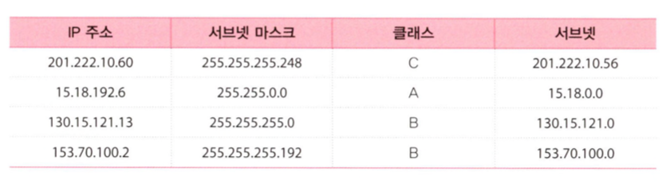

맨 첫 번째 문제를 볼까요? 먼저 201.222.10.60은 클래스 C라는 것은 다 아실 겁니다. 이때 클래스 C의 디폴트 서브넷 마스크는 255.255.255.0입니다. 그런데 여기서 사용한 서브넷 마스크는 255.255.255.248입니다. 먼저 주어진 IP 주소를 이진수로 바꾸어 보겠습니다.

201.222.10.60은 1100 1001.1101 1101 1110.0000 1010.0011 1100입니다. 또 주어진 서브넷 마스크를 이진수로 바꾸어 보면,

255.255.255.248은 111 1111.1111 1111.1111 1111.1111 1000

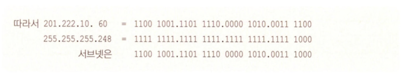

구해진 서브넷 마스크 1100 1001.1101 1110.0000 1010.0011 1000을 십진수로 다시 바꾸면 201.222.10.56이 됩니다. 

두 번째 문제입니다.

주어진 IP 주소는 15.18.192.6으로 클래스 A라는 것을 아실 겁니다. 이때 서브넷 마스크가 255.255.0.0으로 주어졌습니다.

네, 그렇습니다. 255가 1111 1111로 모두 1인 경우이니까 두 번째 옥텟까지가 네트워크 부분이 되는 겁니다. 따라서 서브넷 네트워크는 15.18.0.0이 됩니다.

세 번째 문제를 볼까요?

130.15.121.13은 클래스 B에 속한다는 것을 아실 겁니다. 그런데 여기서 서브넷 마스크를 보니 255.255.255.0입니다.

이것도 쉽네요. 클래스 B 주소를 마치 클래스 C처럼 사용하는 겁니다. 즉 이렇게 서브넷 마스크를 적용하게 되면 서브넷은 130.15.121.0이 되는 겁니다. 아시겠지만 클래스 B 하나를 이처럼 255.255.255.0이란 서브넷 마스크를 적용해서 서브네팅했을 때 만들어낼 수 있는 서브넷의 개수는 총 256개가 됩니다.(맨 앞 zero subnet과 맨 뒤를 안쓰는 경우는 254개)

이번에는 마지막 문제를 풀어보겠습니다. 주어진 IP 주소는 153.70.100.2였습니다. 이 주소는 원래는 클래스 B입니다. (주소의 범위가 128~191까지이기 때문입니다.) 그런데 여기서 서브넷 마스크 255.255.255.192가 왔습니다.  
그럼 아까처럼 다시 한 번 이진수로 고쳐보겠습니다. 그런데 여기서 하나 알아두면 편한 건 서브넷 마스크가 255 부분은 이진수로 바꾸지 않아도 됩니다. 왜냐하면 어차피 변환되지 않고 그냥 아래로 내려오니까요. 그럼 이번에는 서브넷 마스크가 255인 부분이 IP 주소로 그냥 십진수로 쓰겠습니다.

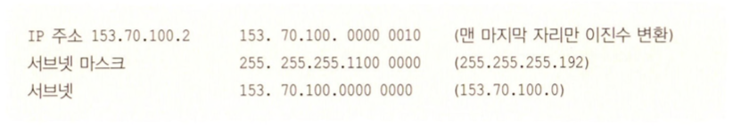


## 서브넷 마스크, 그 속으로...

계속되는 서브넷 마스크에 정말 수고가 많으십니다. 하지만 서브넷 마스크 부분은 여러분이 앞으로 계속 만나게 될 꼭 한 번은 넘어야 할 산이라는 거 이제는 아실 겁니다.  
시험이란 시험에는 안 빠지고 꼭 한두 문제씩 나올 뿐 아니라 일상에서도 계속 만나게 되는 문제이니만큼 꼭 확실하게 알고 넘어가 주셨으면 합니다. 이제 서브넷 마스크의 기본적인 성질은 다 아시죠? 하도 여러번 강조해서 귀에 못이 박히셨을 겁니다.

그래도 다시 한 번 보면 첫 번째 알아야 할 것은 서브넷도 하나의 네트워크이기 때문에 일단 나누어진 서브넷은 라우터를 통해서만 통신이 되는 엄연한 하나의 네트워크라는 겁니다.

두 번째는 서브넷 마스크를 만들 때는 여러 개의 1 사이에 0이 들어가는 마스크, 즉 1이 연속되지 않는 서브넷 마스크는 만들지 않는다는 겁니다.

자, 그럼 이 성질을 가지고 이번에는 서브넷을 한 번 직접 만들어 보겠습니다. 실제 일상에서 일어날 수 있는 경우로 알아보죠.

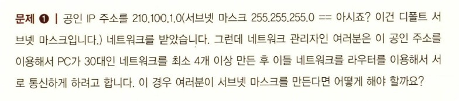

여기까지가 문제입니다. 이런 문제는 잃상에서도 엔지니어가 가장 많이 접하게 되는 문제일 뿐 아니라 시험에도 많이 나오는 가장 일반적인 문제입니다.  
그럼 침착하게 하나하나 풀어보도록 하겠습니다.

일단 우리가 받은 네트워크, 즉 210.100.1.0(255.255.255.0)은 클래스 C입니다. 그리고 그 뒤에 나온 디폴트 서브넷 마스크를 통해서도 이를 확인할 수 있습니다.

이 주소로 네트워크를 최소 4개 이상 만들려면 지금 주어진 디폴트 서브넷 마스크를 변경해야 합니다. 이때 중요하게 봐야 할 것은 한 네트워크가 포함하는 PC의 개수입니다. (이것을 '클라이언트 수'라고도 하고 '호스트 수'라고도 합니다.) 여기서는 30대의 호스트를 가져야 한다고 했습니다. 따라서 호스트 부분이 30대를 포함할 수 있어야 한다는 것입니다.

그럼 이제부터는 이진수 시간입니다.

호스트 부분이 30개가 되기 위해선 이진수 몇 자리가 필요할까요?

이진수 한 자리 :arrow_right: 1과 0이니까 가질 수 있는 호스트 수는 없습니다. 왜냐하면?

그건 호스트 부분이 전부 1인 경우는 브로드캐스트 어드레스입니다.

또 호스트 부분이 전부 0인 것은 네트워크 그 자체를 나타내기 때문입니다.

왜 그런지 잠깐 살펴보겠습니다. 그럼 우리가 맨 처음 받았던 IP 주소를 볼까요? 210.100.1.0 (255.255.255.0)의 경우 호스트 부분은 맨 마지막 한 자리(마지막 옥텟)라는 것은 이제 다 아시죠? (서브넷 마스크가 0인 부분이 호스트 부분이라고 했으니까 210.100.1.0에서 맨 마지막 자리, 즉 여기선 '0'이라고 쓰인 부분이 호스트 자리입니다.)

만약 우리가 이 주소를 서브넷 마스크의 변환 없이 그대로 쓴다면 우리가 쓸 수 있는 IP 주소는 210.100.1.0에서 210.100.1.255까지입니다.

그런데 이 중에서 호스트 부분이 전부 '0'인(여기서 전부 '0'이란, 이진수로 표시했을 때를 말하는 겁니다.) 210.100.1.0이란 주소는 호스트 주소로 사용할 수 없습니다. 이건 네트워크 주소라고 합니다. 즉 210.100.1.0은 어떤 특정한 호스트나 PC에서 사용하는 주소가 아니라 네트워크 그 자체를 나타낸다는 겁니다.

또한 호스트 부분이 전부 '1'인 210.100.1.255(여기서 255는 이진수로 1111 1111이기 때문입니다.)는 역시 호스트 주소로 사용할 수 없습니다. 이 주소는 210.100.1.0 네트워크의 브로드캐스트 주소입니다.  
즉 모든 호스트에게 보낼 메시지가 있을 때 우린 이 주소(210.100.1.255)를 사용해서 210.100.1.0 네트워크의 모든 호스트들에게 전송합니다.

다시 문제로 돌아가 보겠습니다.
