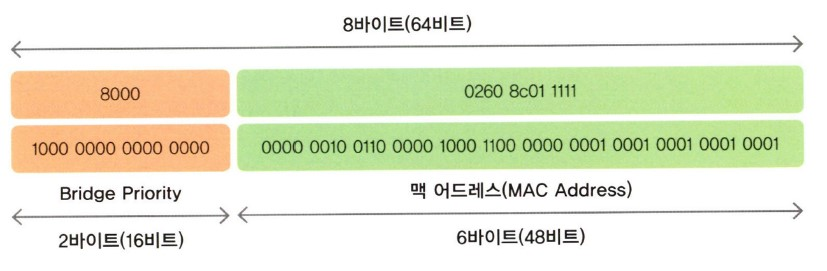
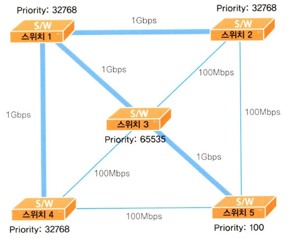

# 스위치를 켜라!

## 목차

- [스위치와 브리지](#스위치와-브리지)
- [스패닝 트리로 가는 첫 번째 관문 2가지](#스패닝-트리로-가는-첫-번째-관문-2가지)
- [스패닝 트리를 잘하려면 3가지만 기억하세요!](#스패닝-트리를-잘하려면-3가지만-기억하세요-)
- [누가 누가 더 센가? STP에서 힘 겨루기](#누가-누가-더-센가--stp에서-힘-겨루기)
- [스위치에서 대장 브리지(Root Bridge) 뽑기](#스위치에서-대장-브리지-root-bridge--뽑기)
- 졸병 브리지(Non Root Bridge)의 루트 포트 선출기
- 스패닝 트리의 마지막 단계 데지그네이티드 포트(Designated Port) 뽑기
- 스패닝 트리 프로토콜의 5가지 상태 변화
- 배운 거 써먹기 - 직접 한번 구성해 보자구요!
- 스패닝 트리에 변화가 생기던 날
- 카타리스트 스위치 바라보기
- 카타리스트 스위치 구성하기
- 맥 어드레스는 어디에 저장되어 있을까요?
- 가상의 랜(Virtual LAN)이란?
- VLAN에서 꼭 기억해야 할 몇 가지
- VLAN에서의 트렁킹과 VTP(VLAN Trunking Protocol)
- VLAN의 구성
- 실제상황! VLAN

## 스위치와 브리지

이번 장에서는 스위치에 대해 살펴보겠습니다. 이미 'PART 04 네트워크 장비에 관한 이야기'에서 스위치에 대한 기본적인 내용을 소개했던 것 기억하시죠?  
그때도 설명드렸지만 제가 자꾸 스위치와 브리지를 같이 사용하는 건 스위치든, 브리지든 기본적인 동작에서 별반 차이가 없기 때문입니다. 특히 앞으로 우리가 배울 스패닝 트리 프로토콜(Spanning Tree Protocol)에서는 브리지와 스위치의 차이가 없기 때문에 스위치의 선배격인 브리지도 같이 알아두시면 좋겠네요.

스위치와 브리지가 별 차이가 없다면서 왜 스위치를 소개하는지 궁금하신 분들이 있을 텐데요. 그런 분은 PART 04에서 설명드린 스위치와 브리지의 차이점을 다시 한 번 찬찬히 읽어보시기 바랍니다.  
그때도 말씀드렸지만 이제 네트워크 세상에서는 브리지를 찾아보기가 어려워졌습니다. 더 이상 브리지는 우리 주변에 없다는 것이죠. 그 자리를 모두 스위치가 차지했기 때문입니다.

따라서 여러분도 이제 스위치란 녀석과 친해지셔야 합니다. 요즘은 라우터의 영역까지 넘나들고 있는 스위치 녀석에 대한 이야기가 곧 시작됩니다.

## 스패닝 트리로 가는 첫 번째 관문 2가지

'PART 04'에서도 말씀드렸지만 스패닝 트리 알고리즘이란, 스위치나 브리지에서 발생하는 루핑('뺑뺑이'라고 설명드린 거 기억하시죠?)을 막아주기 위한 프로토콜입니다.

즉 스위치나 브리지 구성에서 출발지부터 목적지까지의 경로가 2개 이상 존재할 때 1개의 경로만을 남겨두고 나머지는 모두 끊어두었다가, 사용하던 경로에 문제가 발생하면 그때 끊어두었던 경로를 하나씩 살린다고 설명드렸습니다.

자, 그럼 어떻게 STP가 동작하는지 저와 함께 차근차근 알아보죠.

스패닝 트리 프로토콜을 이해하기 위해서는 먼저 2가지 개념을 이해하실 필요가 있습니다.  
그 첫번째가 브리지 ID(Bridge ID)이고, 두 번째는 Path Cost라는 겁니다.

브리지 ID가 뭐냐구요? ID는 일단 느낌이 딱 오시죠? 요즘은 웹 사이트 어디를 들어가려고 해도 ID와 패스워드는 물어보는 세상이니 ID가 'Identification'의 약자라는 것쯤은 다 알고 계실겁니다.

그럼 브리지도 ID가 필요한가 보죠? 네 그렇습니다. 브리지 ID란, 브리지나 스위치들이 통신할 때 서로를 확인하기 위해 하나씩 가지고 있는 번호라고 쉽게 생각하시면 될 것 같습니다.

자, 그럼 브리지 ID는 어떻게 만들까죠? 분명 어떤 규칙 같은 것이 있을 겁니다. 그것이 바로 아래 그림에 나와 있습니다.

그림에서 보는 것처럼 브리지 ID는 16비트의 브리지 우선순위(영어로는 Bridge Priority라고 합니다.)와 48비트의 맥 어드레스로 만들어집니다. 맨 앞에 'Bridge Priority'가 오고, 그 뒤에 바로 'MAC Address'가 오는 것이 바로 Bridge ID입니다.

먼저 앞쪽에 있는 브리지 우선순위(Bridge Priority)는 16비트로 만들어지기 때문에 올 수 있는 수는 0부터 216 - 1까지가 되겠죠. 따라서 Bridge Priority에 올 수 있는 수는 0~65535까지가 될 겁니다.  
그런데 Bridge Priority는 디폴트로 그 중간에 해당하는 값인 32768을 사용합니다. 즉 아무런 구성도 하지 않은 스위치나 브리지에서 Bridge Priority는 32768이라는 겁니다.

Bridge Priority 뒤에 오는 맥 어드레스는 이미 배운 대로 스위치에 고정되어 있는 값입니다. (물론 대형 스위치의 경우 약간 차이가 나지만 일단 여기선 고정된 값이라고 기억하시기 바랍니다.)  
따라서 자신의 고유 맥 어드레스가 Bridge Priority 뒤에 붙게 됩니다. 예를 들어 맥 어드레스가 0260.8c01.1111인 스위치의 브리지 ID가 어떻게 되는지 그림에 나와 있습니다.  
여기서 Bridge Priority는 디폴트 값인 32768을 사용했다고 가정하겠습니다. (십진수 32768은 16진수로 바꾸면 8000이 됩니다.)

위쪽이 16진수 방식으로 표시한 것이고, 아래쪽이 이진수로 표현되어 있는 것이니 직접 확인해보시면 좋겠네요. 이렇게 만들어진 Bridge ID는 나중에 스패닝 트리 프로토콜을 수행할 때 아주 중요한 값으로 사용됩니다.

모두 이해하셨죠? 그럼 이제 Path Cost로 넘어갑니다.

Path Cost란 뭘까요? 이제 겨우 Bridge ID란 걸 이해하기 시작했는데 계속 새로운 용어들이 나오네요. 그런데 어쩌죠. 스패닝 트리 프로토콜에선 앞으로도 정말 많은 용어들이 나올 거거든요.

그래서 네트워크를 좀 한다는 사람들도 스패닝 트리 이야기를 꺼내면 모두 고개를 설레설레 흔들곤 한답니다. 그만큼 쉽지 않다는 뜻이겠죠? 하지만 모든 것이 그렇듯이 사실 스패닝 트리도 알고 보면 그리 어려운 것만도 아니랍니다. 중요한 건 기본적인 개념을 잘 이해하는 것이니 저와 함께 차근차근 기본을 쌓아가다 보면 STP는 그리 큰 산이 아닐 겁니다.

Path Cost란 말 그대로 Path = 길, Cost = 비용이니까 '길을 가는 데 드는 비용' 정도로 이해하시면 좋을 것 같습니다. 네트워크 분야에서 길이란, 바로 장비와 장비가 연결되어 있는 링크를 말하는 겁니다. 즉 Path Cost란, 브리지가 얼마나 가까이, 그리고 빠른 링크로 연결되어 있는지를 알아내기 위한 값입니다.

원래 스패닝 트리 프로토콜을 정의하고 있는 IEEE 802.1D에서는 이 Cost 값을 계산할 때 1,000Mbps를 두 장비 사이의 링크 대역폭으로 나눈 값을 사용했습니다.

예를 하나 들어볼까요? 두 스위치가 10Mbps로 연결되어 있다고 가정해 보겠습니다. 아까 배운대로 Path Cost는 1,000Mbps를 둘 사이의 링크 대역폭(즉 여기서는 10Mbps가 되죠.)으로 나눈 값이라고 했으니 다음과 같겠네요.

1,000/10 = 100

따라서 Path Cost가 100이 됩니다.

그럼 하나 더 예를 들어 볼까요? 100Mbps로 연결된 링크라면 Path Cost는 얼마일까요? 1,000/100이니 답은 10이 됩니다. 쉽죠?

즉 Past Cost는 링크의 속도(대역폭)가 빠르면 빠를수록 더 작은 값이 되는 거죠. 말하자면 링크 속도가 빠르면 그만큼 빨리 도착할테니 Path Cost는 적게 든다고 보는 것이죠.

그런데 문제가 생겼습니다. 바로 기가비트(1,000Mbps)와 ATM이 나온 것입니다. 왜 문제가 되는지 알아볼까요?  
아까 배운 대로 기가비트로 계산을 해보면 1,000/1,000 = 1이 나옵니다. 그런데 10기가비트라면 1,000/10,000이 되니 답이 0.1이 되는 건가요? 여기서부터 좀 곤란해지는군요. 또 ATM인 OC-48은 어떻게 되죠? 여러분이 아시는 대로 OC-48은 2.4Gbps이니 1,000/2,400=0.42가 되네요.

이렇게 다양한 속도가 나오면서 그동안 사용해 오던 계산법에 따라 계산을 하면 소수점이 나오는 문제가 생긴 겁니다.  
그래서 IEEE에서는 소수점이 나오지 않도록 하기 위해 각 속도마다 다음 표와 같은 Path Cost 값을 정의하게 되었지요.  
여기 나온 것을 모두 외울 필요는 없지만 자주 사용하는 것 한두 개는 알아두면 도움이 될 겁니다. 10메가, 100메가, 그리고 기가비트 정도까지만 알아두세요.

그럼 이 값을 가지고 실제 Path Cost를 계산해 보겠습니다. 아래 그림을 보면 스위치 A와 스위치 B는 10메가로 연결되어 있습니다. 따라서 스위치 B에서 스위치 A로 가는 Path Cost 값은 100이 됩니다.

이번에는 스위치 A와 스위치 C가 100메가로 연결되어 있는 걸 볼 수 있습니다. 그렇다면 스위치 C에서 스위치 A로 가는 Path Cost는 19란 걸 금방 눈치챌 수 있을 겁니다.  
뿐만 아니라 이런 경우도 있겠죠. 예를 들어 스위치 C 아래에 스위치 D가 있다고 가정하면 스위치 D에서 스위치 A로 가는 Path Cost는 어떻게 될까요?  
그림을 살펴보면 스위치 D에서 스위치 C로 가는 Path Cost 19와 다시 스위치 C에서 스위치 A로 가는 Path Cost 19를 더한 값인 38이 됩니다.

자, 그럼 지금까지 배운 걸 정리해 볼까요? 스패닝 트리 계산을 위해 2가지 개념을 먼저 알아야한다고 말씀드렸습니다.  
그 첫 번째가 바로 Bridge ID입니다. 모든 브리지나 스위치들이 꼭 하나씩 가지고 있는 이 ID는 스패닝 트리 계산에서 아주 요긴하게 사용되는데, 전체 8바이트(64비트)로 이루어져 있고 앞의 2바이트(16비트)는 Bridge Priority, 그리고 뒤의 6바이트(48비트)는 맥 어드레스로 만들어졌다고 했습니다.

두 번째로 알아야 할 개념은 Path Cost로, 한 스위치에서 다른 스위치로 가는 데 드는 비용이라고 했습니다. 그래서 Path Cost는 속도가 빠를수록 값이 작습니다.  
예전에는 1000을 자기 속도로 나눈 값을 썼는데, 다양한 속도가 나오는 바람에 소수점 값이 나오게 되었고, 이를 막기 위해 IEEE은 아예 정수값으로 Path Cost 값을 지정했지요.

## 스패닝 트리를 잘하려면 3가지만 기억하세요!

스패닝 트리 프로토콜은 복잡한 스위치의  루핑을 방지하기 위한 복잡한 프로토콜처럼 보이지만, 사실은 3가지 기본적인 동작만 이해하면 아주 단순 명료합니다.  
그 3가지가 무엇인지부터 알아보겠습니다. 어떻게 보면 이 3가지는 꼭 외워야 하는 수학공시과 같습니다. 따라서 조금 어렵더라도 일단 외워두시기 바랍니다.

우선 첫 번째로 네트워크당 하나의 루트 브리지를 갖는다고 했습니다. 여기서 말씀드린 네트워크는 스위치나 브리지로 구성된 하나의 네트워크입니다.  
따라서 라우터에 의해 나누어지는 브로드캐스트 도메인이 하나의 네트워크라고 생각하시면 될 것 같습니다. 즉 하나의 브로드캐스트 도메인에 하나씩의 루트 브리지가 있는 것이죠.

그렇다면 루트 브리지(Root Bridge)는 뭘까요? 한마디로 대장 브리지입니다. 즉 스패닝 트리 프로토콜을 수행할 때 기준이 되는 브리지(스위치)입니다. 일단 이렇게만 알아두시고 나중에 직접 동작을 보면 쉽게 이해가 되실 겁니다.

두 번째, 루트 브리지가 아닌 나머지 모든 브리지를 Non Root Bridge라고 하는데, 이 Non Root Bridge당 하나씩의 루트 포트(Root Port)를 가져야 합니다.  
여기서 루트 포트란, 루트 브리지에 가장 빨리 갈 수 있는 포트를 말합니다. 즉 루트 브리지 쪽에 가장 가까운 포트라고 볼 수 있습니다.

아까 말씀드린 대로 네트워크당 하나씩의 루트 브리지가 있으므로 루트 브리지를 제외한 나머지 모든 브리지는 자동으로 Non Root Bridge가 됩니다. 따라서 나머지 브리지들은 루트 브리지 쪽으로 가장 가까이 있는 루트 포트를 하나씩 지정해 주어야 합니다.

세 번째, 세그먼트당 하나씩의 Designated Port(우리말로는 '지정 포트' 정도로 해석되고 '데지그네이티드 포트'라고 읽습니다.)를 갖습니다.  
여기서 세그먼트란, 쉽게 생각해서 브리지 또는 스위치 간에 서로 연결된 링크라고 보시면 됩니다. 즉 브리지나 스위치가 서로 연결되어 있을 때 이 세그먼트에서 반드시 한 포트는 Designated Port로 선출되어야 한다는 겁니다.

아무리 봐도 뭐가 뭔지 감이 안 오시는 분들 계시죠? 말로 백 번 설명하기보다는 한 번 보여드리는 것이 좋을 듯해서 예를 통해 설명하겠습니다. 아래 그림을 보시기 바랍니다.

그림에서 스위치 A, 스위치 B, 스위치 C로 이루어진 스위치 네트워크가 있다고 가정해 보겠습니다. 아까 배운 규칙을 이곳에 적용하면 되겠죠?

첫 번째 규칙은 네트워크당 하나의 루트 브리지를 지정한다고 했습니다. 그래서 여기서는 스위치 A라는 스위치가 루트 브리지로 선정된 겁니다.  
왜 스위치 A가 루트 브리지로 선정되었는지는 우선 생각하지 않기로 합니다. 선정 기준은 뒤에서 다시 배울 테니까요. 여기서는 그냥 루트 브리지를 뽑았는데, 그것이 바로 스위치 A라고 가정하겠습니다.

그렇다면 두 번째 규칙에 따라 나머지 모든 브리지들, 즉 Non Root Bridge들은 루트 브리지 쪽에 가장 가까운 루트 포트를 하나씩 선정해야겠죠? 그림에서 Non Root Bridge는 스위치 B와 스위치 C이기 때문에 각각의 스위치에서 하나씩의 루트 포트(Root Port)를 선정했습니다.  
여러분이 보기에는 어떤 포트가 루트 포트가 될 것 같나요? 두 스위치 모두 E0 포트가 루트 브리지에 더 가까이 있습니다. 그래서 E0가 루트 포트로 선정되었습니다.

마지막 세 번째 규칙을 적용하기 전에 먼저 세그먼트가 무엇인지 그림을 통해 알아보겠습니다. 그림에서 보는 것처럼 세그먼트는 브리지 또는 스위치 간의 연결 링크라고 쉽게 생각하시면 됩니다.  
그림에서 세그먼트 1은 스위치 A와 스위치 B 간의 링크가 됩니다. 이때 각 세그먼트별로 하나씩의 데지그네이티드 포트를 지정해야 한다고 했으므로 세그먼트 1에서 스위치 A의 E0 포트와 스위치 B의 E0 포트 중에서 하나는 데지그네이티드 포트로 선정해야 합니다.

누가 데지그네이티드 포트로 선정되는지는 나중에 더 설명할 부분이니 여기서는 알아보지 않겠습니다.

결국 스패닝 트리 프로토콜은 지금 배운 3가지 규칙을 적용해서 어느 쪽 링크를 살려두고, 어느 쪽 링크를 끊을지 결정하는 과정입니다. (스패닝 트리 프로토콜은 둘 이상의 경로가 생기면 하나만 남기고 끊어둔다는 말 기억하시죠?)

자, 그럼 여기서 배운 걸 정리해 볼까요? 스패닝 트리 프로토콜은 3가지 과정만 기억하면 된다고 했습니다.

그리고 마지막으로 하나 더 기억해 두셔야 할 것이 있습니다. 스패닝 트리 프로토콜에서 루트 포트나 데지그네이티드 포트가 아닌 나머지 모든 포트는 다 막아버린다는 사실입니다. 즉 루트 포트와 데지그네이티드 포트를 뽑는 목적은 어떤 포트를 살릴지 결정하기 위한 것입니다.

## 누가 누가 더 센가? STP에서 힘 겨루기

스패닝 트리 프로토콜에서 어떤 일이 일어나는지는 대충 이해하셨죠? 지금부터는 스패닝 트리 프로토콜에서 이런 일이 벌어질 때 어떻게 순서를 정하는지 알아보겠습니다.  
즉 누가 루트 브리지가 될지를 정하고, 누가 루트 포트나 데지그네이티드 포트가 될지를 정하려면 어떤 순서가 필요합니다. 그래서 다음과 같은 4단계를 통해서 이런 순서를 정하게 됩니다.

와, 또 공식이 나왔네요!

그래서 스패닝 트리 프로토콜이 어렵다고 하는 모양입니다. 방금 전에도 3가지만 알면 된다면서 스패닝 트리의 규칙이 나왔는데, 다시 순서 정하기 4단계가 나오니 아마 이쯤에서 스위치쪽은 건너뛰고 싶은 생각이 드는 분들이 계실 것 같네요.  
하지만 장담하건데 이제 더 이상은 공식이 안 나온답니다. 너무 걱정하지 말고 이 2가지 규칙만 기억하세요. 그럼 스패닝 트리는 정말 쉬워진답니다.

지금 설명드린 4단계에는 나중에 예제를 보고 설명을 해드리겠습니다. 우선은 이런 것이 있다는 정도로만 알아두시기 바랍니다. 차차 요긴하게 쓸 때가 있습니다.

브리지(스위치도 마찬가지입니다.)는 스패닝 트리 정보를 자기들끼리 주고받기 위해서 특수한 프레임을 사용하는데, 이를 'BPDU(Bridge Protocol Data Unit)'라고 합니다. 아래 그림에 부지런히 스패닝 트리 정보를 실어 나르는 BPDU의 모습이 보입니다.  
그림에서 보는 것처럼 BPDU에는 아까 설명드린 루트 브리지의 BID인 Root BID, 루트 브리지까지 가는 경로값인 Root Path Cost, 보내는 브리지의 BID인 Sender BID, 그리고 어떤 포트에서 보냈는지를 알게 해주는 Port ID 정보 등이 실려 있습니다.

브리지나 스위치가 부팅을 하면 이들은 각각의 포트로 BPDU를 매 2초마다 내보내면서 서로의 스패닝 트리 정보를 주고받게 됩니다. 즉 브리지는 이 BPDU를 서로 주고받으면서 누가 루트 브리지이고 어떤 포트가 루트 포트가 될지, 그리고 어떤 포트가 데지그네이티드 포트가 될지를 결정하게 됩니다.  
그러니 BPDU는 스패닝 트리 프로토콜에서 우체부 아저씨와 같은 아주 중요한 역할을 합니다.

이 역할에 대해서는 뒤에서 좀 더 자세히 살펴보기로 하고 여기서는 브리지나 스위치가 스패닝 트리 정보를 서로 주고받기 위해서 BPDU란 우체부를 사용합니다. 이때 어떤 BPDU가 가장 좋은 BPDU인가를 결정하기 위해 위에서 배운 4단계의 순서 정하기를 사용한다고 이해하시면 되겠네요.

## 스위치에서 대장 브리지(Root Bridge) 뽑기

지금까지 모든 재료 준비가 끝났네요. 보통 요리 강습에서도 본격적으로 요리를 만드는 시간보다는 재료를 준비하고, 제대로 손질하는 데 더 많은 시간이 걸립니다.  
스패닝 트리 역시 복잡한 설명으로 머리가 아프셨겠지만, 실제 스패닝 트리가 어떻게 만들어지는지 설명하는 건 그리 복잡하지 않습니다.

먼저 아래 그림을 보시죠.

그림에서 보이는 대로 이 네트워크에는 3대의 스위치가 있습니다. 편의상 이 스위치들을 '스위치 A', '스위치 B', '스위치 C'라고 이름을 붙이겠습니다. 3대의 스위치는 그림과 같이 서로 연결되어 있습니다. 그리고 각 스위치는 그림처럼 BID(Bridge ID)를 갖는다고 가정하겠습니다.

이쯤 되면 'BID가 어떻게 구성되더라?' 하고 머리를 긁적이는 분이 있을 겁니다. 벌써 기억이 가물가물하신 분을 위해 다시 한번 내용을 더듬어 보겠습니다.  
BID는 전체 64비트로 구성되어 있고 가장 앞의 16비트에는 브리지 우선순위(Bridge Priority)가, 뒤에 오는 48비트에는 브리지 또는 스위치의 맥 어드레스가 위치합니다.  
이때 만약 디폴트 구성이라면 맨 앞에 오는 Bridge Priority는 32768이 됩니다.

그림은 디폴트 구성을 가정한 것입니다. 따라서 맨 앞에 오는 브리지 우선순위는 32768로 모두 같습니다. 그리고 그 뒤에 오는 맥 어드레스는 편의상 스위치 A는 1111.1111.1111로, 스위치 B는 2222.2222.2222로, 스위치 C는 3333.3333.3333이라고 가정하겠습니다.

자, 이제 대장 브리지(Root Bridge)를 뽑아보겠습니다. 대장 브리지를 뽑는 조건은 무조건 낮은 BID를 갖는 녀석이 대장이 되는 겁니다. 어떻게 대장 브리지를 뽑는지 그 과정을 알아보겠습니다.

그림을 보면서 우선 스위치 B와 스위치 C, 이렇게 2대의 스위치가 부팅(여기서 부팅이란, 전원 스위치를 켜서 스위치를 작동하기 시작한 것을 의미합니다.)을 시작했다고 가정하겠습니다.

그럼 이제 스위치 B와 스위치 C는 서로 BPDU(Bridge Protocol Data Unit)를 주고받게 됩니다. 지난 번에 배운 대로 BPDU는 스패닝 트리에 대한 여러 가지 정보를 담고 있으면서 매 2초에 한 번 뿌려지는 프레임입니다.  
이렇게 서로 BPDU를 주고받는 건 이미 배운 대로 서로의 스패닝 트리 정보를 주고받아 스패닝 트리를 완성하기 위해서겠죠?

브리지가 맨 처음 부팅하고 나서 내보내는 BPDU에는 Sender BID 정보는 물론 자기 자신의 BID를 넣게 됩니다.  
루트 브리지의 BID 역시 자기 자신의 BID를 넣게 됩니다. 왜냐하면 이 브리지는 이제 막 부팅이 끝나 다른 BPDU를 한 번도 받지 못했기 때문에 일단 이 네트워크에는 자기 혼자 있다고 생각하는 겁니다. 브리지가 혼자 있는 네트워크라면 당연히 자기가 루트 브리지가 되겠죠?

이렇게 스위치 B와 스위치 C는 루트 브리지 BID를 자기 자신의 BID로 세팅해서 BPDU를 서로 주고받았습니다.  
아래 그림이 보이시죠? 스위치 B와 스위치 C는 모두 각자의 BID를 루트 브리지 BID로 세팅해서 BPDU를 보내고 있습니다.

먼저 스위치 B에서의 상황입니다. 스위치 B가 BPDU를 내보내고 얼마 지나지 않아 스위치 C로부터 BPDU가 도착했습니다. 열어보니 여기에는 루트 브리지의 BID가 32768.3333.3333.3333으로 되어 있군요. 이것은 스위치 C가 보낸 BPDU이기 때문입니다.

그럼 스위치 B는 자기가 알고 있던 정보, 즉 루트 브리지 BID가 32768.2222.2222.2222 라는 정보와 방금 스위치 C로부터 받은 정보를 비교하게 됩니다. 그렇다면 둘 중 어떤 BID가 루트 브리지로 될까요?

네, 맞습니다. 바로 낮은 BID가 루트 브리지로 됩니다. 따라서 루트 브리지의 BID는 32768.2222.2222.2222가 되는 겁니다. 즉 스위치 B는 방금 스위치 C에서 받은 BPDU를 무시해 버립니다. (왜냐하면 내가 가진 BPDU에 있는 루트 BID가 좀 더 낮은 값이니까요.)

이번에는 스위치 C에서의 상황입니다. 스위치 C 역시 제일 처음 부팅한 후 자신의 BID를 루트 브리지 BID라고 해서 세팅한 BPDU를 내보내고 얼마 되지 않아 스위치 B로부터 BPDU를 받았습니다.

이 BPDU에는 루트 브리지 BID가 32768.2222.2222.2222로 되어 있죠? 이 값과 자신이 방금 보낸 BPDU에 있는 루트 브리지 ID 32768.3333.3333.3333을 비교해 보니 방금 스위치 B로부터 받은 BPDU에 더 좋은 루트 브리지 ID가 있군요. (왜냐하면 32768.2222.2222.2222가 32768.3333.3333.3333보다 더 낮은 수이기 때문입니다.)  
따라서 이제부터 스위치 C는 자신의 BPDU에 있는 루트 브리지 BID를 스위치 B의 BID로 바꾸어 다른 곳으로 전송하게 됩니다. 즉 스위치 B를 대장 브리지(루트 브리지)로 인정하고 그의 명령을 따르게 되는 것이죠.

아래 그림이 보이시죠?

이제 스위치 B와 스위치 C 사이에는 평화가 찾아왔습니다. 스위치 B가 루트 브리지라는 데 의견일치를 본 겁니다. 그러나 그 평화는 그리 오래가지 않습니다. 잠시 후 새로운 스위치 A가 부팅을 시작한 겁니다.

스위치 A는 다른 스위치와 마찬가지로 맨 처음 부팅했을 때는 누가 루트 브리지인지 알지 못합니다. 아직 어느 누구에게도 BPDU를 받지 못했기 때문이죠. 부팅을 마친 스위치 A는 자신의 BPDU에 루트 브리지의 BID를 자기 BID인 32768.1111.1111.1111로 실어서 양쪽의 스위치 B와 스위치 C에 보냅니다.

이때 벌써 스위치 B와 스위치 C에서 역시 BPDU가 스위치 A쪽으로 날아오고 있네요. 스위치 B와 스위치 C쪽에서 보낸 BPDU에는 루트 브리지가 어떻게 세팅되어 있을까요?  
이 BPDU에 들어 있는 루트 브리지 BID 필드에는 스위치 B의 BID인 32768.2222.2222.2222 값이 들어 있습니다. 아래 그림을 보면 스위치들이 서로 BPDU 값을 주고받는 것이 보입니다.

이제 확실히 이해하셨을 겁니다. 둘 중 어떤 값이 더 낮은 수일까요? 32768.1111.1111.1111이 더 낮은 값입니다.  
따라서 이 값을 BID로 갖는 스위치 A가 루트 브리지가 됩니다. 이제 다시 3대의 스위치들에게 평화가 찾아왔습니다. 모두 스위치 A를 루트 브리지로 인정한 것이죠. BPDU를 주고받아 보니 스위치 A의 BID가 가장 낮은 값이었던 것입니다.

간단하게 정리하면 BID가 가장 낮은 값을 가지고 있는 브리지가 루트 브리지가 된다는 것을 이렇게 장황하게 그림과 이야기로 설명을 드린 겁니다. 하지만 중요한 건 브리지나 스위치가 맨 처음 부팅해서 루트 브리지를 찾아나가는 과정입니다. 이 과정을 꼭 이해하셔야 합니다.

한 가지 질문을 드리겠습니다. 만약 내가 네트워크 관리자인데 스위치 C를 꼭 루트 브리지로 만들고 싶다면 어떻게 해야 할까요? 그건 바로 스위치 C의 BID를 스위치 A의 BID보다 낮은 값으로 만드는 겁니다.

어떻게 하면 될까요? 그래서 Bridge Priority 필드가 있는 겁니다. 예제에서는 Bridge Priority 값이 디폴트 값인 32768이었지만, 이 값을 이보다 작은 수로 만든다면 그 스위치가 가장 낮은 BID를 가질 수 있겠죠.

예를 들어 스위치 C의 Bridge Priority를 100으로 바꾼다면 BID는 100.3333.3333.3333이 되겠죠? 따라서 현재 루트 브리지의 BID인 32768.1111.1111.1111보다 낮은 수가 되어 스위치 C가 루트 브리지가 되는 겁니다.

실제 시스코 스위치 Catalyst 2950에서 브리지의 Priority 값을 변경하는 예제를 살펴보겠습니다.

예제에서는 브리지의 Priority를 디폴트 값인 32768에서 100으로 변경했습니다. 위에 있는 vlan 1이란 건 나중에 배우도록 하고, 우선은 스위치에서 브리지 Priority를 이렇게 세팅한다는 정도만 알아두시면 됩니다.

이렇게 Bridge Priority가 바뀐 것은 'show spanning-tree' 명령을 이용해서 확인할 수 있습니다.

> 실전문제

먼저 그림을 봐주시기 바랍니다. 지금까지 배웠던 것보다 훨씬 더 복잡한 스위치 구성이 보이시죠? 여기서 어떤 것이 루트 브리지인지를 찾아보세요.

답: 스위치 5

설명

그림은 복잡해 보이지만 사실 원리만 알고 나면 정말 쉬운 문제랍니다.  
앞에서 배운 대로 루트 브리지는 BID가 가장 낮은 값을 가진 애가 된다고 설명드렸죠? 그리고 BID는 브리지의 Priority와 MAC 주소로 구성된다는 것도 아실 겁니다. 그럼 이제 답이 보이시나요?  
네, 이 그림에서는 브리지 Priority가 가장 낮은 애가 바로 스위치 5죠? 100으로 세팅되어 있습니다. 따라서 뒤에 따라오는 MAC 주소와 상관없이 스위치 5가 루트 브리지로 선정된답니다.

## 졸병 브리지(Non Root Bridge)의 루트 포트 선출기

치열했던 대장 브리지 선출 과정이 이제 막을 내렸습니다. 그렇다고 모든 것이 끝난 건 아닙니다. 어느 사회에서나 그렇듯이 대장이 뽑히고 나면 나머지 사람들은 그 대장에게 줄을 대보려고 합니다.  
스위치 세계도 예외는 아닙니다. 바로 줄대기가 시작되는군요.

이제 루트 브리지의 선출이 끝나자 바로 스위치들의 루트 포트 선출이 시작되었습니다. 앞에서 배운 3가지 규칙 중에서 두 번째 규칙 기억나시죠? '모든 Non Root Bridge는 반드시 한 개의 루트 포트(Root Port)를 갖는다'가 바로 그 규칙입니다.

앞에서 설명드렸지만 루트 포트는 루트 브리지에 가장 가까이 있는 포트를 말합니다. 가장 가까이 있다는 건 어떤 뜻일까요? 네, 맞습니다. Path Cost가 가장 적게 드는 포트가 가장 가까이있다는 걸 말합니다.

복습은 이 정도로 끝내고 이제 Non Root Bridge에서의 루트 포트 선출을 시작해 보겠습니다.

위 그림을 보시면 어떤 스위치가 Non Root Bridge인지를 한눈에 척 알 수 있습니다. 스위치 B와 스위치 C입니다. 따라서 이 두 스위치에서 각각 한 개의 루트 포트를 뽑아야 합니다.

스위치 B와 스위치 C에서 루트 포트를 뽑으려면 우선 Root Path Cost를 알아봐야 합니다. Root Path Cost는 쉽게 루트 브리지까지의 Path Cost라고 생각하시면 됩니다.  
따라서 맨 처음 루트 브리지 스위치 A를 출발할 때의 Root Path Cost는 0입니다. 아래 그림을 보시면 루트 브리지에서의 Root Path Cost가 0인 것을 알 수 있습니다.

그림에서 각 스위치들은 패스트 이더넷(100Mbps)으로 연결되어 있다고 가정하겠습니다. 이 경우 Path Cost는 앞에서 배운 대로 19가 됩니다. 따라서 스위치 B의 E0 포트에서는 Root Path Cost 값이 다음과 같습니다.

0 + 19 = 19

이 값은 스위치 B의 E1 포트로 전달되고 다시 아래쪽 링크를 통해서 스위치 C의 E1 포트쪽으로 전달됩니다. 스위치 B와 스위치 C 간에도 역시 100메가 통신을 하고 있다고 가정했기 때문에 스위치 C의 E1 포트에서 Root Path Cost 값은 다음과 같이 계산됩니다.

0 + 19 + 19 = 38

마찬가지로 스위치 C의 E0 포트의 Root Path Cost 값은 19가 됩니다.

일단 Root Path Cost를 계산했으니 이제 루트 포트를 선정할 차례네요. (사실 이런 값을 계산하지 않아도 대충 루트 포트를 찾을 수 있습니다. 어차피 루트 브리지에 가장 가까운 포트는 눈으로 봐도 보이니까요.)  
어쨌든 지금까지 계산한 Root Path Cost 값이 낮은 스위치 B의 E0 포트와 스위치 C의 E0 포트가 루트 포트로 선정되었습니다.

이렇게 3가지 규칙 중 두 번째인 '모든 Non Root Bridge는 반드시 한 개의 루트 포트(Root Port)를 갖는다'가 해결되었습니다.

> 1분 정보 APT II

자 그럼 지난 시간에 소개해 드린 APT 공격은 어떻게 막아낼 수 있을까요?

음 우선 결론부터 이야기하자면, 딱 하나의 솔루션으로 막아내기는 쉽지 않다는 겁니다. 앞에서 설명한 것처럼 공격방법이 딱 하나가 아니기 때문이죠.

따라서 방화벽도 필요하고, IPS(침입 방어 시스템)도 필요하며, 다양한 보안 솔루션이 필요하게 되는 겁니다. 이때 등장하게 되는 또 하나의 솔루션이 샌드박스 솔루션입니다.

샌드박스? 모래상자? 이게 뭘까요?

그림 보이시죠? 이게 샌드박스입니다. 미국 가정집에는 뒤뜰에 애들이 모래 장난을 할 때 샌드박스를 만들어 안전하게 놀 수 있게 해준다고 하는데, 여기서 유래한 말이라고 합니다.  
보안에서 이야기하는 샌드박스는 그림의 모래상자처럼 위험성이 의심되는 파일을 격리된 환경에서 구동시켜서 악성 행위가 일어나는지를 확인해보는 기술을 말합니다.  
즉 이미 알려진 악성 코드야 시그니처를 확인해서 막아내면 그만이지만 알려지지 않은 악성 파일은 시그니처로 막아낼 수 없겠죠? 그래서 격리된 모래상자 안에 그 파일을 넣고 한번 구동해보는 겁니다.

전에 설명해드린 APT를 기억해보신다면 APT의 가장 일반적인 공격 방식이 바로 악성 파일을 통한 감염이다 보니 요즘에는 이와 같은 샌드박스 솔루션이 APT 공격 방어에 유용한 솔루션으로 소개되고 있답니다.  
하지만 샌드박스 솔루션이 있다고 악성 파일 공격을 다 막아낼 수 있는 건 아니랍니다. 해커들도 머리가 좋아서 빠져나갈 방법을 만드는 거죠.  
아무튼 샌드박스 솔루션 시장이 요즘 떠오르고 있는데, 대부분의 보안 전문 회사는 이와 같은 샌드박스 솔루션을 보유하고 있답니다. 물론 시스코도 강력한 샌드박스 솔루션을 보유하고 있습니다.

## 스패닝 트리의 마지막 단계 데지그네이티드 포트(Designated Port) 뽑기

어느덧 스패닝 트리를 구성하는 3단계 중 두 단계를 마쳤네요. 즉 루트 브리지 뽑기와 루트 포트 뽑기로 마쳤고, 이제 마지막으로 데지그네이티드 포트(Designated Port) 뽑기가 남았습니다. 지금까지 두 단계를 거쳐 아래 그림의 결과를 얻었습니다.

데지그네이티드 포트를 뽑는 일이 스패닝트리의 세 번째 단계이긴 하지만, 어떻게 보면 가장 중요한 단계입니다. 결국 데지그네이티드 포트를 뽑아야 스패닝 트리에서 어떤 포트를 풀어주고 어떤 포트는 막을지가 결정되기 때문입니다. 결국 데지그네이티드 포트 뽑기는 스패닝 트리의 클라이맥스라고 할 수 있겠네요.

자, 그럼 비장하게 스패닝 트리의 세 번째 규칙을 되새겨보겠습니다. '세그먼트당 하나씩의 데지그네이티드 포트를 갖는다'가 바로 세 번째 규칙입니다.  
즉 브리지 네트워크에서 브리지와 브리지로 연결된(스위치와 스위치로 연결된 것도 포함) 세그먼트당 각각 한 개의 데지그네이티드 포트를 뽑아야 한다는 것입니다.

그럼 무엇으로 데지그네이티드 포트를 뽑을까요? 루트 브리지까지의 Path Cost, 즉 세그먼트상에서 Root Path Cost를 서로 비교해서 더 작은 Root Path Cost를 가진 포트가 데지그네이티드 포트로 선출됩니다.

위 그림을 보면 우리는 이미 루트 브리지와 루트 포트는 찾았고(R로 표시된 것이 루트 포트) 마지막으로 데지그네이티드 포트를 찾기 위해 각 포트별로 Root Path Cost를 구했습니다.

먼저 세그먼트 1을 보시면 스위치 A의 E0와 스위치 B의 E0가 100Mbps로 연결되어 있습니다. 이때 스위치 A의 E0는 자기가 루트 브리지이기 때문에 당연히 Root Path Cost가 0이 됩니다.  
또한 스위치 B의 E0 포트는 100Mbps로 루트 브리지와 연결되어 있기 때문에 19가 됩니다. 따라서 세그먼트 1에서는 스위치 A의 E0 포트가 데지그네이티드 포트로 선출됩니다.

마찬가지로 계산해 보면 세그먼트 2에서도 역시 스위치 A의 E1 포트가 데지그네이티드 포트로 선정됩니다. 똑같죠? 이 결과를 보고 아마 눈치가 빠르신 분들은 감을 잡으셨을 겁니다.  
루트 브리지의 모든 포트들(물론 살아있는 액티브 포트겠죠?)은 언제나 데지그네이티드 포트로 선정 된다는 사실입니다.  
이것만 알아두셔도 데지그네이티드 포트를 훨씬 빠르고 쉽게 선출할 수 있습니다.

이제 세그먼트 1과 2에서는 선출이 끝났고, 마지막으로 세그먼트 3에서의 선출이 남았습니다. 그런데 세그먼트 3에서는 서로 연결된 두 포트의 Root Path Cost가 같습니다. 이렇게 동점이 생겼을 땐 어떻게 하면 좋을까요?  
그건 이미 앞에서 배웠습니다. 바로 'STP에서의 힘 겨루기' 단원에서 스패닝 트리에서 누가 누가 더 센지를 가릴 때는 4단계를 거친다고 설명했습니다. 다시 한 번 짚어볼까요?

이 4단계를 통해서 승자가 가려집니다. 자, 그럼 스위치 B의 E1 포트 대 스위치 C의 E1 포트 대결에 들어갑니다.

- 1단계 : 누가 더 작은 Root BID를 가졌는가?

여기서는 승부가 가려지지 않습니다. 왜냐하면 스위치 B나 스위치 C 들 다 똑같은 루트 BID를 가지고 있기 때문입니다. 즉 2개의 스위치 모두 32768.1111.1111.1111이라는 똑같은 루트 BID를 가졌으므로 1단계에서는 판가름이 나지 않습니다.

- 2 단계 : 루트 브리지까지의 Path Cost 값은 누가 더 작은가?

여기서도 동점이죠? 아까 본 대로 둘 다 Root Path Cost 값이 같기 때문입니다. 이거 점점 흥미진진해지네요.

- 3 단계 : 누구의 BID(Sender BID)가 더 낮은가?

여기선 뭔가 대결이 이루어질 것 같네요. Sender BID란, BPDU에 스패닝 트리 정보를 실어 보낼 때 발신자의 주소를 넣는 것과 같습니다. 즉 자기 자신의 BID를 말하는 거죠. 따라서 스위치 B의 Sender Bid는 32768.2222.2222.2222이고, 스위치 C의 BID는 32768.3333.3333.3333이기 때문에 승자는 스위치 B입니다.  
즉 스위치 B의 E1 포트가 데지그네이티드 포트로 선정됩니다.

만약 여기서도 승부가 나지 않는다면 마지막 4단계로 포트 ID까지 비교해 판단을 내린답니다. 나름대로 정확한 승부를 위해 노력하는 셈이죠.

그렇게 해서 만들어진 스패닝 트리가 아래 그림입니다. 여기서 ND는 'Non Designated Port'를 말합니다. 즉 루트 포트나 데지그네이티드 포트가 아닌 나머지 포트입니다.

## 스패닝 트리 프로토콜의 5가지 상태 변화

지금까지 스패닝 트리를 만드는 과정을 알아보았습니다. 간단하게 말씀드리면 루트 브리지 하나 뽑아놓고, 루트 브리지를 제외한 나머지 모든 브리지에서 루트 포트를 뽑고, 데지그네이티드 포트를 뽑은 후 마지막으로 나머지 포트는 Non Designated 포트로 지정하면 됩니다.

이렇게 스패닝 트리 프로토콜을 구현해 나가는 과정에서 모든 스위치나 브리지의 포트들은 언제나 5가지 상태로 변합니다. 즉 앞으로 설명드릴 5가지 상태 중 하나에 속하는 겁니다.  
마치 맛있는 밥을 지을 때 쌀씻기, 불리기, 가열하기, 뜸들이기를 거치는 것처럼 스패닝 트리를 구성할 때도 다음과 같이 5가지 상태를 거쳐야 합니다.

- Disabled : 이 상태는 포트가 고장나서 사용할 수 없거나 네트워크 관리자가 포트를 일부러 Shut Down 시켜 놓은 상태입니다.
  - 이때 데이터 전송은? 안됩니다.
  - 맥 어드레스를 배울 수 있나요? 못 배웁니다.
  - BPDU를 주고받나요? 못 받습니다.

- Blocking : 스위치를 맨 처음 켜거나 Disabled되어 있는 포트를 관리자가 다시 살렸을 때 그 포트는 블로킹 상태로 들어갑니다. 이 상태에서는 데이터 전송은 되지 않고 오직 BPDU만 주고받을 수 있습니다.  
  (전에 배운 것을 떠올려 보세요. 맨 처음 스위치가 켜지면 서로 BPDU를 주고받으면서 루트 브리지를 뽑고, 루트 포트를 뽑고, 데지그네이티드 포트를 뽑고, Non Designated 포트를 뽑지요. 바로 이런 과정이 스위치의 블로킹 상태에서 일어나는 겁니다.)
  - 이때 데이터 전송은? 역시 안됩니다.
  - 맥 어드레스를 배우나요? 못 배웁니다.
  - BPDU를 주고받나요? 주고받습니다.
- Listening : 블로킹 상태에 있던 스위치 포트가 루트 포트나 데지그네이티드 포트로 선정되면 포트는 바로 리스닝 상태로 넘어갑니다. 물론 리스닝 상태에 있던 포트도 네트워크에 새로운 스위치가 접속했거나 브리지나 스위치의 구성값이 바뀌면 루트 포트나 데지그네이티드 포트에서 Non Designated 포트로 상황이 변할 수 도 있습니다. 그렇게 되면 다시 블로킹 상태로 돌아가게 됩니다.
  - 이때 데이터 전송은? 아직도 안됩니다.
  - 맥 어드레스를 배우나요? 역시 못 배웁니다.
  - BPDU를 주고받나요? 주고받습니다.
- Learning : 리스닝 상태에 있던 스위치 포트가 포워딩 딜레이(Fowarding Delay) 디폴트 시간인 15초 동안 그 상태를 계속 유지하면(즉 전쟁에서 15초 이상 버티는 겁니다.) 리스닝 상태는 러닝 상태로 넘어갑니다.  
  러닝 상태에서야 비로소 맥 어드레스를 배워 맥 어드레스 테이블을 만들게 됩니다.
  - 이때 데이터 전송은? 아직까지도 안됩니다.
  - 맥 어드레스를 배우나요? 드디어 배우기 시작합니다.
  - BPDU를 주고받나요? 주고받습니다.
- Forwarding : 스위치 포트가 러닝 상태에서 다른 상태로 넘어가지 않고(이는 루트 포트나 데지그네이티드 포트에서 Non Designated 포트로 바뀌지 않았다는 뜻입니다.) 다시 포워딩 딜레이 (Fowarding Delay) 디폴트 시간인 15초 동안 그 상태를 계속 유지하면 러닝 상태에서 포워딩 상태로 넘어가게 됩니다.  
  포워딩 상태가 되어야 스위치 포트는 드디어 데이터 프레임을 주고받을 수 있게 됩니다. 즉 블로킹 상태에 있던 포트가 리스닝과 러닝을 거쳐 포워딩 상태로 오려면 디폴트 포워딩 딜레이인 15초가 2번 지난 30초가 소요됩니다.
  - 이때 데이터 전송은? 드디어 데이터 전송이 시작됩니다.
  - 맥 어드레스를 배우나요? 계속 맥 어드레스를 배워 브리지 테이블을 만듭니다.
  - BPDU를 주고받나요? 주고받습니다.

이렇게 5가지 상태 변화를 통해 스위치나 브리지는 링크를 막기도 하고 열기도 하면서 스패닝 트리를 만듭니다. 스패닝 트리 프로토콜이라는 것이 사실은 한 곳에서 다른 곳으로 가는 경로가 여러 개일 때 한 개의 경로만을 남겨두고 다 끊었다가 그 경로에 문제가 생겼을 때 경로를 하나하나 살리는 것이라고 설명했던 것을 기억하실 겁니다. 이것이 바로 포트의 변화를 통해서 일어납니다. 뒤에 가서 더 자세히 알아보겠지만 일단 여기서는 브리지 또는 스위치의 포트는 5가지의 상태 변화를 거치는데, 이는 스패닝 트리를 완성하기 위한 것이라는 정도만 알아두세요.

위 그림을 보면 지금까지 우리가 배웠던 5가지 상태가 나와 있습니다. 지금까지 배운 내용을 잘 이해했다면 아마 이 그림이 어렵지 않을 겁니다.  
다른 내용은 이미 설명을 드렸고 리스닝, 러닝, 포워딩 상태에서 다시 블로킹 상태로 화살표가 있는 걸 보실 수 있습니다. 이는 리스닝, 러닝, 포워딩 상태에 있떤 포트도 루트 포트나 데지그네이티드 포트에서 탈락되면(즉 자기보다 더 센 포트가 나타나 밀리면) 바로 블로킹 상태로 넘어갈 수 있다는 뜻입니다.  
또 모든 포트에서 Disalbe 상태쪽으로 화살표가 있는 것은 포트가 어떤 상태에 있든지 사용자에 의한 Shut Down 명령이나 포트의 고장으로 인해 언제라도 Disable 상태로 변할 수 있다는 의미입니다.

## 배운거 써먹기 - 직접 한번 구성해 보자구요!

이번에는 지금까지 우리가 배운 해박한 스패닝 트리 프로토콜의 지식을 활용해서 직접 스패닝 트리 구성을 연습해보겠습니다. 먼저 그동안 배웠던 샘플을 가지고 한번 연습을 해보겠습니다.  
아래 그림은 이미 몇 번 보신 그림입니다. 지금까지 우리는 그림에서처럼 루트 브리지, 루트 포트, 데지그네이티드 포트를 선출했습니다.

브리지 ID를 가지고 루트 브리지를 먼저 선출한 후 나머지 브리지에서 루트 브리지와 가장 가까운 포트로 루트 포트를 뽑고, 각 세그먼트당 루트 브리지와 가장 가까운 것을 데지그네이티드 포트로 뽑는다고 말씀드렸습니다.  
물론 이때 결정이 되지 않으면 이미 배운 4단계를 거쳐 승자를 뽑는다고 설명드렸죠. 이렇게 해서 위 그림을 만들고 나면 이제 스패닝 트리는 거의 완성된 겁니다.

여기서 루트 포트와 데지그네이티드 포트는 포워딩(Forwarding)으로 만들고, Non Designated 포트는 블로킹(Blocking)으로 만들면 됩니다. 포워딩은 위에서 배운 대로 데이터 전송이 일어나는 상태이고, 블로킹은 BPDU 통신은 하되 데이터 전송을 불가능한 상태입니다.  
물론 여기서 포워딩으로 바로 표시했지만, 이 포트들이 맨 처음 블로킹 상태에서 바로 포워딩으로 가는건 아니겠죠? 스패닝 트리 규칙에 따라 리스닝과 러닝을 거치게 될 겁니다.  
그렇게 해서 만들어진 것이 아래 그림입니다. Non Designated 포트만 블로킹으로 바뀌었네요.

위 그림에서 블로킹으로 표시('B'로 표시)한 곳에는 통신이 불가능하기 때문에 스위치 B와 스위치 C 사이의 링크는 끊어지게 됩니다. 따라서 3대의 스위치가 서로 연결되어 있기는 하지만, 실제로는 스위치 B와 스위치 C 사이가 끊어진 아래 그림과 같이 구성됩니다.  
여기서 끊어져 있던 스위치 B와 스위치 C 사이의 링크는 스위치 A와 스위치 B 사이 또는 스위치 A와 스위치 C 사이의 링크가 끊어질 경우 다시 살아나게 됩니다.

그리 어렵지 않죠? 그럼 이번에는 좀 더 복잡한 스위치 구성을 보고 스패닝 트리를 완성해 보겠습니다. 복잡하다고 했지만 사실 원리만 알면 전혀 어렵지 않습니다.

위 그림을 보면 이번에는 5대의 스위치가 서로 연결되어 있습니다. 가는 길도 여러 갈래네요. 각 스위치는 서로 100Mbps로 연결되어 있고, 각각의 브리지 ID는 박스 안에 BID로 표시되어 있습니다.  
그림에서 스위치 C의 경우 Bridge Priority를 100으로 바꾸었고, 나머지 스위치들의 Bridge Priority는 디폴트 값인 32768을 그대로 사용했습니다.

스패닝 트리 프로토콜이 Enable되었다고 가정할 경우, 이미 배운 대로 스위치는 출발지에서 목적지로 가는 경로가 2개 이상일 경우 한 개만을 남겨놓고 끊게 되는데 지금까지 우리가 배운 몇가지 과정을 거쳐서 이 결과를 만들어 냅니다. 가장 먼저 뭘 해야 하는지 아시죠?

이미 배운 대로 브리지 ID를 가지고 루트 브리지를 선출하고, 루트 브리지를 제외한 나머지 모든 브리지에서 루트 포트를 뽑은 후 세그먼트당 하나의 데지그네이티드 포트를 뽑습니다. 이때 루트 포트와 데지그네이티드 포트를 뽑는 기준은 모두 어떤 포트가 루트 브리지에 더 가까운지를 보는 것이란 점도 다시 한번 기억해 주세요. 그렇게 해서 만들어진 것이 아래 그림입니다.

그림에서 보는 것처럼 BID 값이 가장 작은 스위치 C가 루트 브리지로 선출되었고 나머지 브리지에서는 Root Path Cost(루트 브리지까지의 거리로 계산되는 값)를 가지고 루트 포트를 하나씩 선출했습니다.  
선출된 루트 포트가 보이시죠? 이렇게 뽑힌 루트 포트와 데지그네이티드 포트는 포트의 상태가 포워딩으로 바뀌게 되고(물론 중간에 리스닝과 러닝을 거칩니다.) 여기서 선출되지 못한 Non Designated 포트는 블로킹 상태로 바뀝니다.  
이미 배운 대로 블로킹 상태에서는 데이터 프레임이 전송되지 않기 때문에 아래 그림과 같이 블로킹 포트가 있는 곳은 링크가 모두 끊어지게 됩니다.

그래서 만들어진 것이 바로 아래 그림입니다. 처음 그림에서 복잡하게 보이던 많은 링크가 모두 없어지고 루트 브리지를 중앙에 두고 각 스위치들이 중앙에 연결된 구조입니다.

이 예제를 연습하면서 느끼셨겠지만 루트 브리지가 어느 스위치가 되느냐에 따라 링크 구성은 달라질 수 있습니다.  
따라서 여러분이 나중에 스위치를 직접 구성하게 될 때, 또는 스위치 네트워크를 구성하게 될 때는 이 점을 항상 명심하셔서 루트 브리지를 선정해야 합니다.

마지막으로 샘플 하나만 더 해볼까요? 아래 그림을 보시기 바랍니다. 이번에도 5대의 스위치가 서로 연결되어 있는 걸 보실 수 있습니다.  
그런데 이전 예제와 다른 점은 스위치 연결을 위한 속도에 차이가 난다는 점입니다. 즉 기가비트와 패스트 이더넷으로 연결되어 있습니다. 따라서 Path Cost 값이 달라지게 된다는 걸 일단 기억하셔야 합니다.

앞에서 배운 대로 1Gbps의 Path Cost는 4이고, 100Mbps의 Path Cost는 19입니다. 또 각 스위치의 Bridge Priority는 디폴트 값인 32768을 사용했습니다.  
자, 이제 포트 선출을 위한 기본은 다 준비가 됐죠? 그럼 직접 루트 브리지와 루트 포트, 데지그네이티드 포트를 찾아보겠습니다. 벌써 찾으셨다구요? 그럼 아래 그림과 비교해 보시기 바랍니다.

먼저 루트 브리지는 각 스위치가 가지고 있는 브리지 ID를 비교해서 금방 찾을 수 있습니다. 스위치 A가 루트 브리지가 되었습니다. 이제 두 번째로 나머지 스위치에서 각각 한 개씩의 루트 포트를 선출하면 되는데, 이것은 누가 루트 브리지에 가장 가까이 있는가를 본다고 했으므로 Root Path Cost 값을 비교해 보아야 합니다.  
이때 주의할 것은 기가로 연결된 곳은 '4'를, 패스트 이더넷으로 연결된 곳은 '19'를 넣어주어야 한다는 겁니다. 그렇게 계산하면 아래 그림에서 보이는 포트들이 루트 포트로 선정된 걸 알 수 있습니다.  
특히 스위치 D를 보면 루트 브리지로 바로 연결된 링크는 패스트 이더넷이기 때문에 기가 링크쪽 포트를 루트 포트로 선정한 걸 알 수 있습니다.

루트 포트 선정이 완료되면 이제 각 세그먼트(링크)별로 데지그네이티드 포트를 선출하게 됩니다. 데지그네이티드 포트 역시 Root Path Cost를 비교하고, 만약 Root Path Cost가 서로 같을 경우 지난 번에 배운 대로 4단계의 비교를 거쳐 순위를 결정하게 됩니다.  
그렇게 결정된 데지그네이티드 포트가 그림에 나와 있습니다.

이제 마지막 단계로 넘어가야겠네요. 즉 루트 포트와 데지그네이티드 포트는 포워딩으로, Non Designated 포트는 블로킹으로 변환시켜 주는 겁니다. 그렇게 만든 것이 아래 그림 입니다. 아주 간단하죠? 블로킹쪽의 링크는 끊어진다는 것도 다들 알고 계실 겁니다.

역시 속도가 느린 패스트 이더넷쪽 링크가 끊어진 걸 알 수 있습니다. 여기서 또 하나 기억해야 할 것이 나왔네요.  
아까 배운 것처럼 루트 브리지를 어디로 잡느냐에 따라 어떤 링크가 살고, 어떤 링크가 죽을지 결정되는 것처럼 링크의 속도에 따라서도 크게 영향을 받는다는 것입니다.  
이 점 역시 스위치 네트워크를 디자인할 때 염두에 두셔야 합니다. 이렇게 완성된 스패닝 트리 구성이 아래 그림에 나와 있습니다. 이제 스위치 구성만 알면 대충 스패닝 구성은 만들 수 있겠죠?

지금까지 잘 따라오셨다면 이제 여러분은 스패닝 트리 만들기라는 산 하나를 넘어온 겁니다. 앞을 보니까 작은 동산이 하나 보이는데 뭘까요?

그건 바로 '지금까지 만든 스패닝 트리에 변화가 생겼을 때 어떻게 동작할까'라는 문제입니다.  
스패닝 트리 프로토콜을 다시 생각해 보면 '출발지에서 목적지까지 두 개 이상의 경로가 있는 스위치(브리지) 네트워크에서 한 개의 경로를 제외하고 나머지는 모두 막는다'라는 첫 번째 과제와 '사용하던 경로에 문제가 생기면 막았던 나머지 경로 중 하나를 열어준다'라는 두 번째 과제가 있었습니다.  
지금까지 우리는 첫 번째 과제를 수행한 겁니다. 그렇다면 이제 두 번째 과제를 수행할 차례네요. 즉 네트워크에 변화가 생기면 현재의 스패닝 트리는 어떻게 바뀌는지, 또 얼마만에 바뀌게 되는지를 알아보겠습니다.

## 스패닝 트리에 변화가 생기던 날

