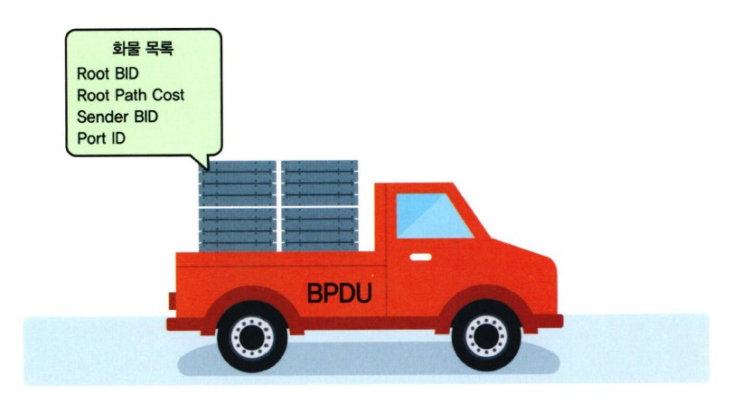
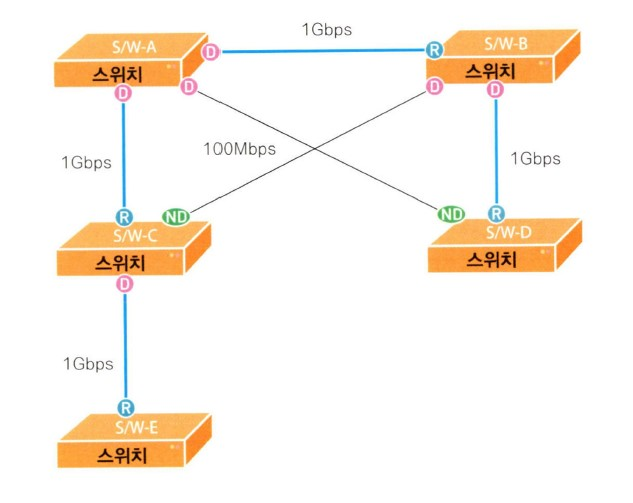
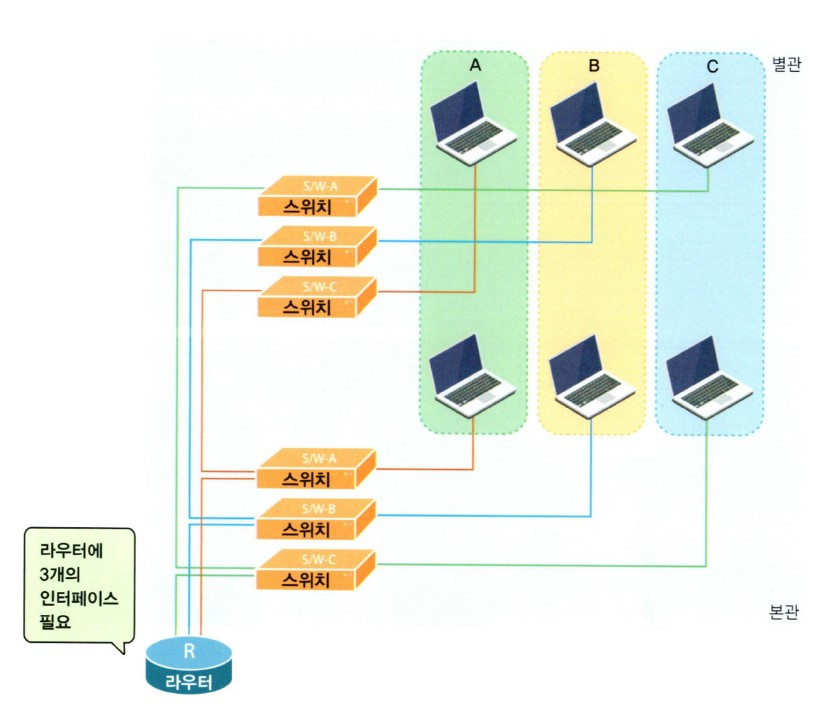
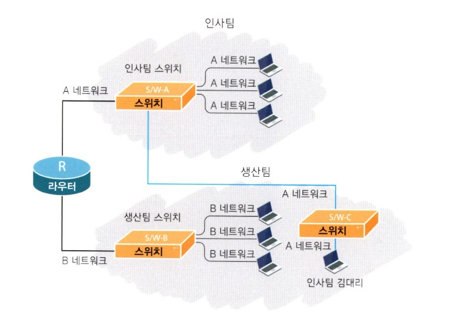

# 스위치를 켜라!

## 목차

- [스위치와 브리지](#스위치와-브리지)
- [스패닝 트리로 가는 첫 번째 관문 2가지](#스패닝-트리로-가는-첫-번째-관문-2가지)
- [스패닝 트리를 잘하려면 3가지만 기억하세요!](#스패닝-트리를-잘하려면-3가지만-기억하세요-)
- [누가 누가 더 센가? STP에서 힘 겨루기](#누가-누가-더-센가--stp에서-힘-겨루기)
- [스위치에서 대장 브리지(Root Bridge) 뽑기](#스위치에서-대장-브리지-root-bridge--뽑기)
- [졸병 브리지(Non Root Bridge)의 루트 포트 선출기](#졸병-브리지non-root-bridge의-루트-포트-선출기)
- [스패닝 트리의 마지막 단계 데지그네이티드 포트(Designated Port) 뽑기](#스패닝-트리의-마지막-단계-데지그네이티드-포트designated-port-뽑기)
- [스패닝 트리 프로토콜의 5가지 상태 변화](#스패닝-트리-프로토콜의-5가지-상태-변화)
- [배운 거 써먹기 - 직접 한번 구성해 보자구요!](#배운-거-써먹기---직접-한번-구성해-보자구요-)
- [스패닝 트리에 변화가 생기던 날](#스패닝-트리에-변화가-생기던-날)
- [카타리스트 스위치 바라보기](#카타리스트-스위치-바라보기)
- [카타리스트 스위치 구성하기](#카타리스트-스위치-구성하기)
- [맥 어드레스는 어디에 저장되어 있을까요?](#맥-어드레스는-어디에-저장되어-있을까요-)
- [가상의 랜(Virtual LAN)이란?](#가상의-랜virtual-lan이란-)
- [VLAN에서 꼭 기억해야 할 몇 가지](#vlan에서-꼭-기억해야-할-몇-가지)
- VLAN에서의 트렁킹과 VTP(VLAN Trunking Protocol)
- VLAN의 구성
- 실제상황! VLAN

## 스위치와 브리지

이번 장에서는 스위치에 대해 살펴보겠습니다. 이미 'PART 04 네트워크 장비에 관한 이야기'에서 스위치에 대한 기본적인 내용을 소개했던 것 기억하시죠?  
그때도 설명드렸지만 제가 자꾸 스위치와 브리지를 같이 사용하는 건 스위치든, 브리지든 기본적인 동작에서 별반 차이가 없기 때문입니다. 특히 앞으로 우리가 배울 스패닝 트리 프로토콜(Spanning Tree Protocol)에서는 브리지와 스위치의 차이가 없기 때문에 스위치의 선배격인 브리지도 같이 알아두시면 좋겠네요.

스위치와 브리지가 별 차이가 없다면서 왜 스위치를 소개하는지 궁금하신 분들이 있을 텐데요. 그런 분은 PART 04에서 설명드린 스위치와 브리지의 차이점을 다시 한 번 찬찬히 읽어보시기 바랍니다.  
그때도 말씀드렸지만 이제 네트워크 세상에서는 브리지를 찾아보기가 어려워졌습니다. 더 이상 브리지는 우리 주변에 없다는 것이죠. 그 자리를 모두 스위치가 차지했기 때문입니다.

따라서 여러분도 이제 스위치란 녀석과 친해지셔야 합니다. 요즘은 라우터의 영역까지 넘나들고 있는 스위치 녀석에 대한 이야기가 곧 시작됩니다.

## 스패닝 트리로 가는 첫 번째 관문 2가지

'PART 04'에서도 말씀드렸지만 스패닝 트리 알고리즘이란, 스위치나 브리지에서 발생하는 루핑('뺑뺑이'라고 설명드린 거 기억하시죠?)을 막아주기 위한 프로토콜입니다.

즉 스위치나 브리지 구성에서 출발지부터 목적지까지의 경로가 2개 이상 존재할 때 1개의 경로만을 남겨두고 나머지는 모두 끊어두었다가, 사용하던 경로에 문제가 발생하면 그때 끊어두었던 경로를 하나씩 살린다고 설명드렸습니다.

자, 그럼 어떻게 STP가 동작하는지 저와 함께 차근차근 알아보죠.

스패닝 트리 프로토콜을 이해하기 위해서는 먼저 2가지 개념을 이해하실 필요가 있습니다.  
그 첫번째가 브리지 ID(Bridge ID)이고, 두 번째는 Path Cost라는 겁니다.

브리지 ID가 뭐냐구요? ID는 일단 느낌이 딱 오시죠? 요즘은 웹 사이트 어디를 들어가려고 해도 ID와 패스워드는 물어보는 세상이니 ID가 'Identification'의 약자라는 것쯤은 다 알고 계실겁니다.

그럼 브리지도 ID가 필요한가 보죠? 네 그렇습니다. 브리지 ID란, 브리지나 스위치들이 통신할 때 서로를 확인하기 위해 하나씩 가지고 있는 번호라고 쉽게 생각하시면 될 것 같습니다.

자, 그럼 브리지 ID는 어떻게 만들까죠? 분명 어떤 규칙 같은 것이 있을 겁니다. 그것이 바로 아래 그림에 나와 있습니다.

그림에서 보는 것처럼 브리지 ID는 16비트의 브리지 우선순위(영어로는 Bridge Priority라고 합니다.)와 48비트의 맥 어드레스로 만들어집니다. 맨 앞에 'Bridge Priority'가 오고, 그 뒤에 바로 'MAC Address'가 오는 것이 바로 Bridge ID입니다.

먼저 앞쪽에 있는 브리지 우선순위(Bridge Priority)는 16비트로 만들어지기 때문에 올 수 있는 수는 0부터 216 - 1까지가 되겠죠. 따라서 Bridge Priority에 올 수 있는 수는 0~65535까지가 될 겁니다.  
그런데 Bridge Priority는 디폴트로 그 중간에 해당하는 값인 32768을 사용합니다. 즉 아무런 구성도 하지 않은 스위치나 브리지에서 Bridge Priority는 32768이라는 겁니다.

Bridge Priority 뒤에 오는 맥 어드레스는 이미 배운 대로 스위치에 고정되어 있는 값입니다. (물론 대형 스위치의 경우 약간 차이가 나지만 일단 여기선 고정된 값이라고 기억하시기 바랍니다.)  
따라서 자신의 고유 맥 어드레스가 Bridge Priority 뒤에 붙게 됩니다. 예를 들어 맥 어드레스가 0260.8c01.1111인 스위치의 브리지 ID가 어떻게 되는지 그림에 나와 있습니다.  
여기서 Bridge Priority는 디폴트 값인 32768을 사용했다고 가정하겠습니다. (십진수 32768은 16진수로 바꾸면 8000이 됩니다.)

위쪽이 16진수 방식으로 표시한 것이고, 아래쪽이 이진수로 표현되어 있는 것이니 직접 확인해보시면 좋겠네요. 이렇게 만들어진 Bridge ID는 나중에 스패닝 트리 프로토콜을 수행할 때 아주 중요한 값으로 사용됩니다.

모두 이해하셨죠? 그럼 이제 Path Cost로 넘어갑니다.

Path Cost란 뭘까요? 이제 겨우 Bridge ID란 걸 이해하기 시작했는데 계속 새로운 용어들이 나오네요. 그런데 어쩌죠. 스패닝 트리 프로토콜에선 앞으로도 정말 많은 용어들이 나올 거거든요.

그래서 네트워크를 좀 한다는 사람들도 스패닝 트리 이야기를 꺼내면 모두 고개를 설레설레 흔들곤 한답니다. 그만큼 쉽지 않다는 뜻이겠죠? 하지만 모든 것이 그렇듯이 사실 스패닝 트리도 알고 보면 그리 어려운 것만도 아니랍니다. 중요한 건 기본적인 개념을 잘 이해하는 것이니 저와 함께 차근차근 기본을 쌓아가다 보면 STP는 그리 큰 산이 아닐 겁니다.

Path Cost란 말 그대로 Path = 길, Cost = 비용이니까 '길을 가는 데 드는 비용' 정도로 이해하시면 좋을 것 같습니다. 네트워크 분야에서 길이란, 바로 장비와 장비가 연결되어 있는 링크를 말하는 겁니다. 즉 Path Cost란, 브리지가 얼마나 가까이, 그리고 빠른 링크로 연결되어 있는지를 알아내기 위한 값입니다.

원래 스패닝 트리 프로토콜을 정의하고 있는 IEEE 802.1D에서는 이 Cost 값을 계산할 때 1,000Mbps를 두 장비 사이의 링크 대역폭으로 나눈 값을 사용했습니다.

예를 하나 들어볼까요? 두 스위치가 10Mbps로 연결되어 있다고 가정해 보겠습니다. 아까 배운대로 Path Cost는 1,000Mbps를 둘 사이의 링크 대역폭(즉 여기서는 10Mbps가 되죠.)으로 나눈 값이라고 했으니 다음과 같겠네요.

1,000/10 = 100

따라서 Path Cost가 100이 됩니다.

그럼 하나 더 예를 들어 볼까요? 100Mbps로 연결된 링크라면 Path Cost는 얼마일까요? 1,000/100이니 답은 10이 됩니다. 쉽죠?

즉 Past Cost는 링크의 속도(대역폭)가 빠르면 빠를수록 더 작은 값이 되는 거죠. 말하자면 링크 속도가 빠르면 그만큼 빨리 도착할테니 Path Cost는 적게 든다고 보는 것이죠.

그런데 문제가 생겼습니다. 바로 기가비트(1,000Mbps)와 ATM이 나온 것입니다. 왜 문제가 되는지 알아볼까요?  
아까 배운 대로 기가비트로 계산을 해보면 1,000/1,000 = 1이 나옵니다. 그런데 10기가비트라면 1,000/10,000이 되니 답이 0.1이 되는 건가요? 여기서부터 좀 곤란해지는군요. 또 ATM인 OC-48은 어떻게 되죠? 여러분이 아시는 대로 OC-48은 2.4Gbps이니 1,000/2,400=0.42가 되네요.

이렇게 다양한 속도가 나오면서 그동안 사용해 오던 계산법에 따라 계산을 하면 소수점이 나오는 문제가 생긴 겁니다.  
그래서 IEEE에서는 소수점이 나오지 않도록 하기 위해 각 속도마다 다음 표와 같은 Path Cost 값을 정의하게 되었지요.  
여기 나온 것을 모두 외울 필요는 없지만 자주 사용하는 것 한두 개는 알아두면 도움이 될 겁니다. 10메가, 100메가, 그리고 기가비트 정도까지만 알아두세요.

그럼 이 값을 가지고 실제 Path Cost를 계산해 보겠습니다. 아래 그림을 보면 스위치 A와 스위치 B는 10메가로 연결되어 있습니다. 따라서 스위치 B에서 스위치 A로 가는 Path Cost 값은 100이 됩니다.

이번에는 스위치 A와 스위치 C가 100메가로 연결되어 있는 걸 볼 수 있습니다. 그렇다면 스위치 C에서 스위치 A로 가는 Path Cost는 19란 걸 금방 눈치챌 수 있을 겁니다.  
뿐만 아니라 이런 경우도 있겠죠. 예를 들어 스위치 C 아래에 스위치 D가 있다고 가정하면 스위치 D에서 스위치 A로 가는 Path Cost는 어떻게 될까요?  
그림을 살펴보면 스위치 D에서 스위치 C로 가는 Path Cost 19와 다시 스위치 C에서 스위치 A로 가는 Path Cost 19를 더한 값인 38이 됩니다.

자, 그럼 지금까지 배운 걸 정리해 볼까요? 스패닝 트리 계산을 위해 2가지 개념을 먼저 알아야한다고 말씀드렸습니다.  
그 첫 번째가 바로 Bridge ID입니다. 모든 브리지나 스위치들이 꼭 하나씩 가지고 있는 이 ID는 스패닝 트리 계산에서 아주 요긴하게 사용되는데, 전체 8바이트(64비트)로 이루어져 있고 앞의 2바이트(16비트)는 Bridge Priority, 그리고 뒤의 6바이트(48비트)는 맥 어드레스로 만들어졌다고 했습니다.

두 번째로 알아야 할 개념은 Path Cost로, 한 스위치에서 다른 스위치로 가는 데 드는 비용이라고 했습니다. 그래서 Path Cost는 속도가 빠를수록 값이 작습니다.  
예전에는 1000을 자기 속도로 나눈 값을 썼는데, 다양한 속도가 나오는 바람에 소수점 값이 나오게 되었고, 이를 막기 위해 IEEE은 아예 정수값으로 Path Cost 값을 지정했지요.

## 스패닝 트리를 잘하려면 3가지만 기억하세요!

스패닝 트리 프로토콜은 복잡한 스위치의  루핑을 방지하기 위한 복잡한 프로토콜처럼 보이지만, 사실은 3가지 기본적인 동작만 이해하면 아주 단순 명료합니다.  
그 3가지가 무엇인지부터 알아보겠습니다. 어떻게 보면 이 3가지는 꼭 외워야 하는 수학공시과 같습니다. 따라서 조금 어렵더라도 일단 외워두시기 바랍니다.

우선 첫 번째로 네트워크당 하나의 루트 브리지를 갖는다고 했습니다. 여기서 말씀드린 네트워크는 스위치나 브리지로 구성된 하나의 네트워크입니다.  
따라서 라우터에 의해 나누어지는 브로드캐스트 도메인이 하나의 네트워크라고 생각하시면 될 것 같습니다. 즉 하나의 브로드캐스트 도메인에 하나씩의 루트 브리지가 있는 것이죠.

그렇다면 루트 브리지(Root Bridge)는 뭘까요? 한마디로 대장 브리지입니다. 즉 스패닝 트리 프로토콜을 수행할 때 기준이 되는 브리지(스위치)입니다. 일단 이렇게만 알아두시고 나중에 직접 동작을 보면 쉽게 이해가 되실 겁니다.

두 번째, 루트 브리지가 아닌 나머지 모든 브리지를 Non Root Bridge라고 하는데, 이 Non Root Bridge당 하나씩의 루트 포트(Root Port)를 가져야 합니다.  
여기서 루트 포트란, 루트 브리지에 가장 빨리 갈 수 있는 포트를 말합니다. 즉 루트 브리지 쪽에 가장 가까운 포트라고 볼 수 있습니다.

아까 말씀드린 대로 네트워크당 하나씩의 루트 브리지가 있으므로 루트 브리지를 제외한 나머지 모든 브리지는 자동으로 Non Root Bridge가 됩니다. 따라서 나머지 브리지들은 루트 브리지 쪽으로 가장 가까이 있는 루트 포트를 하나씩 지정해 주어야 합니다.

세 번째, 세그먼트당 하나씩의 Designated Port(우리말로는 '지정 포트' 정도로 해석되고 '데지그네이티드 포트'라고 읽습니다.)를 갖습니다.  
여기서 세그먼트란, 쉽게 생각해서 브리지 또는 스위치 간에 서로 연결된 링크라고 보시면 됩니다. 즉 브리지나 스위치가 서로 연결되어 있을 때 이 세그먼트에서 반드시 한 포트는 Designated Port로 선출되어야 한다는 겁니다.

아무리 봐도 뭐가 뭔지 감이 안 오시는 분들 계시죠? 말로 백 번 설명하기보다는 한 번 보여드리는 것이 좋을 듯해서 예를 통해 설명하겠습니다. 아래 그림을 보시기 바랍니다.

그림에서 스위치 A, 스위치 B, 스위치 C로 이루어진 스위치 네트워크가 있다고 가정해 보겠습니다. 아까 배운 규칙을 이곳에 적용하면 되겠죠?

첫 번째 규칙은 네트워크당 하나의 루트 브리지를 지정한다고 했습니다. 그래서 여기서는 스위치 A라는 스위치가 루트 브리지로 선정된 겁니다.  
왜 스위치 A가 루트 브리지로 선정되었는지는 우선 생각하지 않기로 합니다. 선정 기준은 뒤에서 다시 배울 테니까요. 여기서는 그냥 루트 브리지를 뽑았는데, 그것이 바로 스위치 A라고 가정하겠습니다.

그렇다면 두 번째 규칙에 따라 나머지 모든 브리지들, 즉 Non Root Bridge들은 루트 브리지 쪽에 가장 가까운 루트 포트를 하나씩 선정해야겠죠? 그림에서 Non Root Bridge는 스위치 B와 스위치 C이기 때문에 각각의 스위치에서 하나씩의 루트 포트(Root Port)를 선정했습니다.  
여러분이 보기에는 어떤 포트가 루트 포트가 될 것 같나요? 두 스위치 모두 E0 포트가 루트 브리지에 더 가까이 있습니다. 그래서 E0가 루트 포트로 선정되었습니다.

마지막 세 번째 규칙을 적용하기 전에 먼저 세그먼트가 무엇인지 그림을 통해 알아보겠습니다. 그림에서 보는 것처럼 세그먼트는 브리지 또는 스위치 간의 연결 링크라고 쉽게 생각하시면 됩니다.  
그림에서 세그먼트 1은 스위치 A와 스위치 B 간의 링크가 됩니다. 이때 각 세그먼트별로 하나씩의 데지그네이티드 포트를 지정해야 한다고 했으므로 세그먼트 1에서 스위치 A의 E0 포트와 스위치 B의 E0 포트 중에서 하나는 데지그네이티드 포트로 선정해야 합니다.

누가 데지그네이티드 포트로 선정되는지는 나중에 더 설명할 부분이니 여기서는 알아보지 않겠습니다.

결국 스패닝 트리 프로토콜은 지금 배운 3가지 규칙을 적용해서 어느 쪽 링크를 살려두고, 어느 쪽 링크를 끊을지 결정하는 과정입니다. (스패닝 트리 프로토콜은 둘 이상의 경로가 생기면 하나만 남기고 끊어둔다는 말 기억하시죠?)

자, 그럼 여기서 배운 걸 정리해 볼까요? 스패닝 트리 프로토콜은 3가지 과정만 기억하면 된다고 했습니다.

그리고 마지막으로 하나 더 기억해 두셔야 할 것이 있습니다. 스패닝 트리 프로토콜에서 루트 포트나 데지그네이티드 포트가 아닌 나머지 모든 포트는 다 막아버린다는 사실입니다. 즉 루트 포트와 데지그네이티드 포트를 뽑는 목적은 어떤 포트를 살릴지 결정하기 위한 것입니다.

## 누가 누가 더 센가? STP에서 힘 겨루기

스패닝 트리 프로토콜에서 어떤 일이 일어나는지는 대충 이해하셨죠? 지금부터는 스패닝 트리 프로토콜에서 이런 일이 벌어질 때 어떻게 순서를 정하는지 알아보겠습니다.  
즉 누가 루트 브리지가 될지를 정하고, 누가 루트 포트나 데지그네이티드 포트가 될지를 정하려면 어떤 순서가 필요합니다. 그래서 다음과 같은 4단계를 통해서 이런 순서를 정하게 됩니다.

와, 또 공식이 나왔네요!

그래서 스패닝 트리 프로토콜이 어렵다고 하는 모양입니다. 방금 전에도 3가지만 알면 된다면서 스패닝 트리의 규칙이 나왔는데, 다시 순서 정하기 4단계가 나오니 아마 이쯤에서 스위치쪽은 건너뛰고 싶은 생각이 드는 분들이 계실 것 같네요.  
하지만 장담하건데 이제 더 이상은 공식이 안 나온답니다. 너무 걱정하지 말고 이 2가지 규칙만 기억하세요. 그럼 스패닝 트리는 정말 쉬워진답니다.

지금 설명드린 4단계에는 나중에 예제를 보고 설명을 해드리겠습니다. 우선은 이런 것이 있다는 정도로만 알아두시기 바랍니다. 차차 요긴하게 쓸 때가 있습니다.

브리지(스위치도 마찬가지입니다.)는 스패닝 트리 정보를 자기들끼리 주고받기 위해서 특수한 프레임을 사용하는데, 이를 'BPDU(Bridge Protocol Data Unit)'라고 합니다. 아래 그림에 부지런히 스패닝 트리 정보를 실어 나르는 BPDU의 모습이 보입니다.  
그림에서 보는 것처럼 BPDU에는 아까 설명드린 루트 브리지의 BID인 Root BID, 루트 브리지까지 가는 경로값인 Root Path Cost, 보내는 브리지의 BID인 Sender BID, 그리고 어떤 포트에서 보냈는지를 알게 해주는 Port ID 정보 등이 실려 있습니다.

브리지나 스위치가 부팅을 하면 이들은 각각의 포트로 BPDU를 매 2초마다 내보내면서 서로의 스패닝 트리 정보를 주고받게 됩니다. 즉 브리지는 이 BPDU를 서로 주고받으면서 누가 루트 브리지이고 어떤 포트가 루트 포트가 될지, 그리고 어떤 포트가 데지그네이티드 포트가 될지를 결정하게 됩니다.  
그러니 BPDU는 스패닝 트리 프로토콜에서 우체부 아저씨와 같은 아주 중요한 역할을 합니다.

이 역할에 대해서는 뒤에서 좀 더 자세히 살펴보기로 하고 여기서는 브리지나 스위치가 스패닝 트리 정보를 서로 주고받기 위해서 BPDU란 우체부를 사용합니다. 이때 어떤 BPDU가 가장 좋은 BPDU인가를 결정하기 위해 위에서 배운 4단계의 순서 정하기를 사용한다고 이해하시면 되겠네요.

## 스위치에서 대장 브리지(Root Bridge) 뽑기

지금까지 모든 재료 준비가 끝났네요. 보통 요리 강습에서도 본격적으로 요리를 만드는 시간보다는 재료를 준비하고, 제대로 손질하는 데 더 많은 시간이 걸립니다.  
스패닝 트리 역시 복잡한 설명으로 머리가 아프셨겠지만, 실제 스패닝 트리가 어떻게 만들어지는지 설명하는 건 그리 복잡하지 않습니다.

먼저 아래 그림을 보시죠.

그림에서 보이는 대로 이 네트워크에는 3대의 스위치가 있습니다. 편의상 이 스위치들을 '스위치 A', '스위치 B', '스위치 C'라고 이름을 붙이겠습니다. 3대의 스위치는 그림과 같이 서로 연결되어 있습니다. 그리고 각 스위치는 그림처럼 BID(Bridge ID)를 갖는다고 가정하겠습니다.

이쯤 되면 'BID가 어떻게 구성되더라?' 하고 머리를 긁적이는 분이 있을 겁니다. 벌써 기억이 가물가물하신 분을 위해 다시 한번 내용을 더듬어 보겠습니다.  
BID는 전체 64비트로 구성되어 있고 가장 앞의 16비트에는 브리지 우선순위(Bridge Priority)가, 뒤에 오는 48비트에는 브리지 또는 스위치의 맥 어드레스가 위치합니다.  
이때 만약 디폴트 구성이라면 맨 앞에 오는 Bridge Priority는 32768이 됩니다.

그림은 디폴트 구성을 가정한 것입니다. 따라서 맨 앞에 오는 브리지 우선순위는 32768로 모두 같습니다. 그리고 그 뒤에 오는 맥 어드레스는 편의상 스위치 A는 1111.1111.1111로, 스위치 B는 2222.2222.2222로, 스위치 C는 3333.3333.3333이라고 가정하겠습니다.

자, 이제 대장 브리지(Root Bridge)를 뽑아보겠습니다. 대장 브리지를 뽑는 조건은 무조건 낮은 BID를 갖는 녀석이 대장이 되는 겁니다. 어떻게 대장 브리지를 뽑는지 그 과정을 알아보겠습니다.

그림을 보면서 우선 스위치 B와 스위치 C, 이렇게 2대의 스위치가 부팅(여기서 부팅이란, 전원 스위치를 켜서 스위치를 작동하기 시작한 것을 의미합니다.)을 시작했다고 가정하겠습니다.

그럼 이제 스위치 B와 스위치 C는 서로 BPDU(Bridge Protocol Data Unit)를 주고받게 됩니다. 지난 번에 배운 대로 BPDU는 스패닝 트리에 대한 여러 가지 정보를 담고 있으면서 매 2초에 한 번 뿌려지는 프레임입니다.  
이렇게 서로 BPDU를 주고받는 건 이미 배운 대로 서로의 스패닝 트리 정보를 주고받아 스패닝 트리를 완성하기 위해서겠죠?

브리지가 맨 처음 부팅하고 나서 내보내는 BPDU에는 Sender BID 정보는 물론 자기 자신의 BID를 넣게 됩니다.  
루트 브리지의 BID 역시 자기 자신의 BID를 넣게 됩니다. 왜냐하면 이 브리지는 이제 막 부팅이 끝나 다른 BPDU를 한 번도 받지 못했기 때문에 일단 이 네트워크에는 자기 혼자 있다고 생각하는 겁니다. 브리지가 혼자 있는 네트워크라면 당연히 자기가 루트 브리지가 되겠죠?

이렇게 스위치 B와 스위치 C는 루트 브리지 BID를 자기 자신의 BID로 세팅해서 BPDU를 서로 주고받았습니다.  
아래 그림이 보이시죠? 스위치 B와 스위치 C는 모두 각자의 BID를 루트 브리지 BID로 세팅해서 BPDU를 보내고 있습니다.

먼저 스위치 B에서의 상황입니다. 스위치 B가 BPDU를 내보내고 얼마 지나지 않아 스위치 C로부터 BPDU가 도착했습니다. 열어보니 여기에는 루트 브리지의 BID가 32768.3333.3333.3333으로 되어 있군요. 이것은 스위치 C가 보낸 BPDU이기 때문입니다.

그럼 스위치 B는 자기가 알고 있던 정보, 즉 루트 브리지 BID가 32768.2222.2222.2222 라는 정보와 방금 스위치 C로부터 받은 정보를 비교하게 됩니다. 그렇다면 둘 중 어떤 BID가 루트 브리지로 될까요?

네, 맞습니다. 바로 낮은 BID가 루트 브리지로 됩니다. 따라서 루트 브리지의 BID는 32768.2222.2222.2222가 되는 겁니다. 즉 스위치 B는 방금 스위치 C에서 받은 BPDU를 무시해 버립니다. (왜냐하면 내가 가진 BPDU에 있는 루트 BID가 좀 더 낮은 값이니까요.)

이번에는 스위치 C에서의 상황입니다. 스위치 C 역시 제일 처음 부팅한 후 자신의 BID를 루트 브리지 BID라고 해서 세팅한 BPDU를 내보내고 얼마 되지 않아 스위치 B로부터 BPDU를 받았습니다.

이 BPDU에는 루트 브리지 BID가 32768.2222.2222.2222로 되어 있죠? 이 값과 자신이 방금 보낸 BPDU에 있는 루트 브리지 ID 32768.3333.3333.3333을 비교해 보니 방금 스위치 B로부터 받은 BPDU에 더 좋은 루트 브리지 ID가 있군요. (왜냐하면 32768.2222.2222.2222가 32768.3333.3333.3333보다 더 낮은 수이기 때문입니다.)  
따라서 이제부터 스위치 C는 자신의 BPDU에 있는 루트 브리지 BID를 스위치 B의 BID로 바꾸어 다른 곳으로 전송하게 됩니다. 즉 스위치 B를 대장 브리지(루트 브리지)로 인정하고 그의 명령을 따르게 되는 것이죠.

아래 그림이 보이시죠?

이제 스위치 B와 스위치 C 사이에는 평화가 찾아왔습니다. 스위치 B가 루트 브리지라는 데 의견일치를 본 겁니다. 그러나 그 평화는 그리 오래가지 않습니다. 잠시 후 새로운 스위치 A가 부팅을 시작한 겁니다.

스위치 A는 다른 스위치와 마찬가지로 맨 처음 부팅했을 때는 누가 루트 브리지인지 알지 못합니다. 아직 어느 누구에게도 BPDU를 받지 못했기 때문이죠. 부팅을 마친 스위치 A는 자신의 BPDU에 루트 브리지의 BID를 자기 BID인 32768.1111.1111.1111로 실어서 양쪽의 스위치 B와 스위치 C에 보냅니다.

이때 벌써 스위치 B와 스위치 C에서 역시 BPDU가 스위치 A쪽으로 날아오고 있네요. 스위치 B와 스위치 C쪽에서 보낸 BPDU에는 루트 브리지가 어떻게 세팅되어 있을까요?  
이 BPDU에 들어 있는 루트 브리지 BID 필드에는 스위치 B의 BID인 32768.2222.2222.2222 값이 들어 있습니다. 아래 그림을 보면 스위치들이 서로 BPDU 값을 주고받는 것이 보입니다.

이제 확실히 이해하셨을 겁니다. 둘 중 어떤 값이 더 낮은 수일까요? 32768.1111.1111.1111이 더 낮은 값입니다.  
따라서 이 값을 BID로 갖는 스위치 A가 루트 브리지가 됩니다. 이제 다시 3대의 스위치들에게 평화가 찾아왔습니다. 모두 스위치 A를 루트 브리지로 인정한 것이죠. BPDU를 주고받아 보니 스위치 A의 BID가 가장 낮은 값이었던 것입니다.

간단하게 정리하면 BID가 가장 낮은 값을 가지고 있는 브리지가 루트 브리지가 된다는 것을 이렇게 장황하게 그림과 이야기로 설명을 드린 겁니다. 하지만 중요한 건 브리지나 스위치가 맨 처음 부팅해서 루트 브리지를 찾아나가는 과정입니다. 이 과정을 꼭 이해하셔야 합니다.

한 가지 질문을 드리겠습니다. 만약 내가 네트워크 관리자인데 스위치 C를 꼭 루트 브리지로 만들고 싶다면 어떻게 해야 할까요? 그건 바로 스위치 C의 BID를 스위치 A의 BID보다 낮은 값으로 만드는 겁니다.

어떻게 하면 될까요? 그래서 Bridge Priority 필드가 있는 겁니다. 예제에서는 Bridge Priority 값이 디폴트 값인 32768이었지만, 이 값을 이보다 작은 수로 만든다면 그 스위치가 가장 낮은 BID를 가질 수 있겠죠.

예를 들어 스위치 C의 Bridge Priority를 100으로 바꾼다면 BID는 100.3333.3333.3333이 되겠죠? 따라서 현재 루트 브리지의 BID인 32768.1111.1111.1111보다 낮은 수가 되어 스위치 C가 루트 브리지가 되는 겁니다.

실제 시스코 스위치 Catalyst 2950에서 브리지의 Priority 값을 변경하는 예제를 살펴보겠습니다.

예제에서는 브리지의 Priority를 디폴트 값인 32768에서 100으로 변경했습니다. 위에 있는 vlan 1이란 건 나중에 배우도록 하고, 우선은 스위치에서 브리지 Priority를 이렇게 세팅한다는 정도만 알아두시면 됩니다.

이렇게 Bridge Priority가 바뀐 것은 'show spanning-tree' 명령을 이용해서 확인할 수 있습니다.

> 실전문제

먼저 그림을 봐주시기 바랍니다. 지금까지 배웠던 것보다 훨씬 더 복잡한 스위치 구성이 보이시죠? 여기서 어떤 것이 루트 브리지인지를 찾아보세요.

답: 스위치 5

설명

그림은 복잡해 보이지만 사실 원리만 알고 나면 정말 쉬운 문제랍니다.  
앞에서 배운 대로 루트 브리지는 BID가 가장 낮은 값을 가진 애가 된다고 설명드렸죠? 그리고 BID는 브리지의 Priority와 MAC 주소로 구성된다는 것도 아실 겁니다. 그럼 이제 답이 보이시나요?  
네, 이 그림에서는 브리지 Priority가 가장 낮은 애가 바로 스위치 5죠? 100으로 세팅되어 있습니다. 따라서 뒤에 따라오는 MAC 주소와 상관없이 스위치 5가 루트 브리지로 선정된답니다.

## 졸병 브리지(Non Root Bridge)의 루트 포트 선출기

치열했던 대장 브리지 선출 과정이 이제 막을 내렸습니다. 그렇다고 모든 것이 끝난 건 아닙니다. 어느 사회에서나 그렇듯이 대장이 뽑히고 나면 나머지 사람들은 그 대장에게 줄을 대보려고 합니다.  
스위치 세계도 예외는 아닙니다. 바로 줄대기가 시작되는군요.

이제 루트 브리지의 선출이 끝나자 바로 스위치들의 루트 포트 선출이 시작되었습니다. 앞에서 배운 3가지 규칙 중에서 두 번째 규칙 기억나시죠? '모든 Non Root Bridge는 반드시 한 개의 루트 포트(Root Port)를 갖는다'가 바로 그 규칙입니다.

앞에서 설명드렸지만 루트 포트는 루트 브리지에 가장 가까이 있는 포트를 말합니다. 가장 가까이 있다는 건 어떤 뜻일까요? 네, 맞습니다. Path Cost가 가장 적게 드는 포트가 가장 가까이있다는 걸 말합니다.

복습은 이 정도로 끝내고 이제 Non Root Bridge에서의 루트 포트 선출을 시작해 보겠습니다.

위 그림을 보시면 어떤 스위치가 Non Root Bridge인지를 한눈에 척 알 수 있습니다. 스위치 B와 스위치 C입니다. 따라서 이 두 스위치에서 각각 한 개의 루트 포트를 뽑아야 합니다.

스위치 B와 스위치 C에서 루트 포트를 뽑으려면 우선 Root Path Cost를 알아봐야 합니다. Root Path Cost는 쉽게 루트 브리지까지의 Path Cost라고 생각하시면 됩니다.  
따라서 맨 처음 루트 브리지 스위치 A를 출발할 때의 Root Path Cost는 0입니다. 아래 그림을 보시면 루트 브리지에서의 Root Path Cost가 0인 것을 알 수 있습니다.

그림에서 각 스위치들은 패스트 이더넷(100Mbps)으로 연결되어 있다고 가정하겠습니다. 이 경우 Path Cost는 앞에서 배운 대로 19가 됩니다. 따라서 스위치 B의 E0 포트에서는 Root Path Cost 값이 다음과 같습니다.

0 + 19 = 19

이 값은 스위치 B의 E1 포트로 전달되고 다시 아래쪽 링크를 통해서 스위치 C의 E1 포트쪽으로 전달됩니다. 스위치 B와 스위치 C 간에도 역시 100메가 통신을 하고 있다고 가정했기 때문에 스위치 C의 E1 포트에서 Root Path Cost 값은 다음과 같이 계산됩니다.

0 + 19 + 19 = 38

마찬가지로 스위치 C의 E0 포트의 Root Path Cost 값은 19가 됩니다.

일단 Root Path Cost를 계산했으니 이제 루트 포트를 선정할 차례네요. (사실 이런 값을 계산하지 않아도 대충 루트 포트를 찾을 수 있습니다. 어차피 루트 브리지에 가장 가까운 포트는 눈으로 봐도 보이니까요.)  
어쨌든 지금까지 계산한 Root Path Cost 값이 낮은 스위치 B의 E0 포트와 스위치 C의 E0 포트가 루트 포트로 선정되었습니다.

이렇게 3가지 규칙 중 두 번째인 '모든 Non Root Bridge는 반드시 한 개의 루트 포트(Root Port)를 갖는다'가 해결되었습니다.

> 1분 정보 APT II

자 그럼 지난 시간에 소개해 드린 APT 공격은 어떻게 막아낼 수 있을까요?

음 우선 결론부터 이야기하자면, 딱 하나의 솔루션으로 막아내기는 쉽지 않다는 겁니다. 앞에서 설명한 것처럼 공격방법이 딱 하나가 아니기 때문이죠.

따라서 방화벽도 필요하고, IPS(침입 방어 시스템)도 필요하며, 다양한 보안 솔루션이 필요하게 되는 겁니다. 이때 등장하게 되는 또 하나의 솔루션이 샌드박스 솔루션입니다.

샌드박스? 모래상자? 이게 뭘까요?

그림 보이시죠? 이게 샌드박스입니다. 미국 가정집에는 뒤뜰에 애들이 모래 장난을 할 때 샌드박스를 만들어 안전하게 놀 수 있게 해준다고 하는데, 여기서 유래한 말이라고 합니다.  
보안에서 이야기하는 샌드박스는 그림의 모래상자처럼 위험성이 의심되는 파일을 격리된 환경에서 구동시켜서 악성 행위가 일어나는지를 확인해보는 기술을 말합니다.  
즉 이미 알려진 악성 코드야 시그니처를 확인해서 막아내면 그만이지만 알려지지 않은 악성 파일은 시그니처로 막아낼 수 없겠죠? 그래서 격리된 모래상자 안에 그 파일을 넣고 한번 구동해보는 겁니다.

전에 설명해드린 APT를 기억해보신다면 APT의 가장 일반적인 공격 방식이 바로 악성 파일을 통한 감염이다 보니 요즘에는 이와 같은 샌드박스 솔루션이 APT 공격 방어에 유용한 솔루션으로 소개되고 있답니다.  
하지만 샌드박스 솔루션이 있다고 악성 파일 공격을 다 막아낼 수 있는 건 아니랍니다. 해커들도 머리가 좋아서 빠져나갈 방법을 만드는 거죠.  
아무튼 샌드박스 솔루션 시장이 요즘 떠오르고 있는데, 대부분의 보안 전문 회사는 이와 같은 샌드박스 솔루션을 보유하고 있답니다. 물론 시스코도 강력한 샌드박스 솔루션을 보유하고 있습니다.

## 스패닝 트리의 마지막 단계 데지그네이티드 포트(Designated Port) 뽑기

어느덧 스패닝 트리를 구성하는 3단계 중 두 단계를 마쳤네요. 즉 루트 브리지 뽑기와 루트 포트 뽑기로 마쳤고, 이제 마지막으로 데지그네이티드 포트(Designated Port) 뽑기가 남았습니다. 지금까지 두 단계를 거쳐 아래 그림의 결과를 얻었습니다.

데지그네이티드 포트를 뽑는 일이 스패닝트리의 세 번째 단계이긴 하지만, 어떻게 보면 가장 중요한 단계입니다. 결국 데지그네이티드 포트를 뽑아야 스패닝 트리에서 어떤 포트를 풀어주고 어떤 포트는 막을지가 결정되기 때문입니다. 결국 데지그네이티드 포트 뽑기는 스패닝 트리의 클라이맥스라고 할 수 있겠네요.

자, 그럼 비장하게 스패닝 트리의 세 번째 규칙을 되새겨보겠습니다. '세그먼트당 하나씩의 데지그네이티드 포트를 갖는다'가 바로 세 번째 규칙입니다.  
즉 브리지 네트워크에서 브리지와 브리지로 연결된(스위치와 스위치로 연결된 것도 포함) 세그먼트당 각각 한 개의 데지그네이티드 포트를 뽑아야 한다는 것입니다.

그럼 무엇으로 데지그네이티드 포트를 뽑을까요? 루트 브리지까지의 Path Cost, 즉 세그먼트상에서 Root Path Cost를 서로 비교해서 더 작은 Root Path Cost를 가진 포트가 데지그네이티드 포트로 선출됩니다.

위 그림을 보면 우리는 이미 루트 브리지와 루트 포트는 찾았고(R로 표시된 것이 루트 포트) 마지막으로 데지그네이티드 포트를 찾기 위해 각 포트별로 Root Path Cost를 구했습니다.

먼저 세그먼트 1을 보시면 스위치 A의 E0와 스위치 B의 E0가 100Mbps로 연결되어 있습니다. 이때 스위치 A의 E0는 자기가 루트 브리지이기 때문에 당연히 Root Path Cost가 0이 됩니다.  
또한 스위치 B의 E0 포트는 100Mbps로 루트 브리지와 연결되어 있기 때문에 19가 됩니다. 따라서 세그먼트 1에서는 스위치 A의 E0 포트가 데지그네이티드 포트로 선출됩니다.

마찬가지로 계산해 보면 세그먼트 2에서도 역시 스위치 A의 E1 포트가 데지그네이티드 포트로 선정됩니다. 똑같죠? 이 결과를 보고 아마 눈치가 빠르신 분들은 감을 잡으셨을 겁니다.  
루트 브리지의 모든 포트들(물론 살아있는 액티브 포트겠죠?)은 언제나 데지그네이티드 포트로 선정 된다는 사실입니다.  
이것만 알아두셔도 데지그네이티드 포트를 훨씬 빠르고 쉽게 선출할 수 있습니다.

이제 세그먼트 1과 2에서는 선출이 끝났고, 마지막으로 세그먼트 3에서의 선출이 남았습니다. 그런데 세그먼트 3에서는 서로 연결된 두 포트의 Root Path Cost가 같습니다. 이렇게 동점이 생겼을 땐 어떻게 하면 좋을까요?  
그건 이미 앞에서 배웠습니다. 바로 'STP에서의 힘 겨루기' 단원에서 스패닝 트리에서 누가 누가 더 센지를 가릴 때는 4단계를 거친다고 설명했습니다. 다시 한 번 짚어볼까요?

이 4단계를 통해서 승자가 가려집니다. 자, 그럼 스위치 B의 E1 포트 대 스위치 C의 E1 포트 대결에 들어갑니다.

- 1단계 : 누가 더 작은 Root BID를 가졌는가?

여기서는 승부가 가려지지 않습니다. 왜냐하면 스위치 B나 스위치 C 들 다 똑같은 루트 BID를 가지고 있기 때문입니다. 즉 2개의 스위치 모두 32768.1111.1111.1111이라는 똑같은 루트 BID를 가졌으므로 1단계에서는 판가름이 나지 않습니다.

- 2 단계 : 루트 브리지까지의 Path Cost 값은 누가 더 작은가?

여기서도 동점이죠? 아까 본 대로 둘 다 Root Path Cost 값이 같기 때문입니다. 이거 점점 흥미진진해지네요.

- 3 단계 : 누구의 BID(Sender BID)가 더 낮은가?

여기선 뭔가 대결이 이루어질 것 같네요. Sender BID란, BPDU에 스패닝 트리 정보를 실어 보낼 때 발신자의 주소를 넣는 것과 같습니다. 즉 자기 자신의 BID를 말하는 거죠. 따라서 스위치 B의 Sender Bid는 32768.2222.2222.2222이고, 스위치 C의 BID는 32768.3333.3333.3333이기 때문에 승자는 스위치 B입니다.  
즉 스위치 B의 E1 포트가 데지그네이티드 포트로 선정됩니다.

만약 여기서도 승부가 나지 않는다면 마지막 4단계로 포트 ID까지 비교해 판단을 내린답니다. 나름대로 정확한 승부를 위해 노력하는 셈이죠.

그렇게 해서 만들어진 스패닝 트리가 아래 그림입니다. 여기서 ND는 'Non Designated Port'를 말합니다. 즉 루트 포트나 데지그네이티드 포트가 아닌 나머지 포트입니다.

## 스패닝 트리 프로토콜의 5가지 상태 변화

지금까지 스패닝 트리를 만드는 과정을 알아보았습니다. 간단하게 말씀드리면 루트 브리지 하나 뽑아놓고, 루트 브리지를 제외한 나머지 모든 브리지에서 루트 포트를 뽑고, 데지그네이티드 포트를 뽑은 후 마지막으로 나머지 포트는 Non Designated 포트로 지정하면 됩니다.

이렇게 스패닝 트리 프로토콜을 구현해 나가는 과정에서 모든 스위치나 브리지의 포트들은 언제나 5가지 상태로 변합니다. 즉 앞으로 설명드릴 5가지 상태 중 하나에 속하는 겁니다.  
마치 맛있는 밥을 지을 때 쌀씻기, 불리기, 가열하기, 뜸들이기를 거치는 것처럼 스패닝 트리를 구성할 때도 다음과 같이 5가지 상태를 거쳐야 합니다.

- Disabled : 이 상태는 포트가 고장나서 사용할 수 없거나 네트워크 관리자가 포트를 일부러 Shut Down 시켜 놓은 상태입니다.
  - 이때 데이터 전송은? 안됩니다.
  - 맥 어드레스를 배울 수 있나요? 못 배웁니다.
  - BPDU를 주고받나요? 못 받습니다.

- Blocking : 스위치를 맨 처음 켜거나 Disabled되어 있는 포트를 관리자가 다시 살렸을 때 그 포트는 블로킹 상태로 들어갑니다. 이 상태에서는 데이터 전송은 되지 않고 오직 BPDU만 주고받을 수 있습니다.  
  (전에 배운 것을 떠올려 보세요. 맨 처음 스위치가 켜지면 서로 BPDU를 주고받으면서 루트 브리지를 뽑고, 루트 포트를 뽑고, 데지그네이티드 포트를 뽑고, Non Designated 포트를 뽑지요. 바로 이런 과정이 스위치의 블로킹 상태에서 일어나는 겁니다.)
  - 이때 데이터 전송은? 역시 안됩니다.
  - 맥 어드레스를 배우나요? 못 배웁니다.
  - BPDU를 주고받나요? 주고받습니다.
- Listening : 블로킹 상태에 있던 스위치 포트가 루트 포트나 데지그네이티드 포트로 선정되면 포트는 바로 리스닝 상태로 넘어갑니다. 물론 리스닝 상태에 있던 포트도 네트워크에 새로운 스위치가 접속했거나 브리지나 스위치의 구성값이 바뀌면 루트 포트나 데지그네이티드 포트에서 Non Designated 포트로 상황이 변할 수 도 있습니다. 그렇게 되면 다시 블로킹 상태로 돌아가게 됩니다.
  - 이때 데이터 전송은? 아직도 안됩니다.
  - 맥 어드레스를 배우나요? 역시 못 배웁니다.
  - BPDU를 주고받나요? 주고받습니다.
- Learning : 리스닝 상태에 있던 스위치 포트가 포워딩 딜레이(Fowarding Delay) 디폴트 시간인 15초 동안 그 상태를 계속 유지하면(즉 전쟁에서 15초 이상 버티는 겁니다.) 리스닝 상태는 러닝 상태로 넘어갑니다.  
  러닝 상태에서야 비로소 맥 어드레스를 배워 맥 어드레스 테이블을 만들게 됩니다.
  - 이때 데이터 전송은? 아직까지도 안됩니다.
  - 맥 어드레스를 배우나요? 드디어 배우기 시작합니다.
  - BPDU를 주고받나요? 주고받습니다.
- Forwarding : 스위치 포트가 러닝 상태에서 다른 상태로 넘어가지 않고(이는 루트 포트나 데지그네이티드 포트에서 Non Designated 포트로 바뀌지 않았다는 뜻입니다.) 다시 포워딩 딜레이 (Fowarding Delay) 디폴트 시간인 15초 동안 그 상태를 계속 유지하면 러닝 상태에서 포워딩 상태로 넘어가게 됩니다.  
  포워딩 상태가 되어야 스위치 포트는 드디어 데이터 프레임을 주고받을 수 있게 됩니다. 즉 블로킹 상태에 있던 포트가 리스닝과 러닝을 거쳐 포워딩 상태로 오려면 디폴트 포워딩 딜레이인 15초가 2번 지난 30초가 소요됩니다.
  - 이때 데이터 전송은? 드디어 데이터 전송이 시작됩니다.
  - 맥 어드레스를 배우나요? 계속 맥 어드레스를 배워 브리지 테이블을 만듭니다.
  - BPDU를 주고받나요? 주고받습니다.

이렇게 5가지 상태 변화를 통해 스위치나 브리지는 링크를 막기도 하고 열기도 하면서 스패닝 트리를 만듭니다. 스패닝 트리 프로토콜이라는 것이 사실은 한 곳에서 다른 곳으로 가는 경로가 여러 개일 때 한 개의 경로만을 남겨두고 다 끊었다가 그 경로에 문제가 생겼을 때 경로를 하나하나 살리는 것이라고 설명했던 것을 기억하실 겁니다. 이것이 바로 포트의 변화를 통해서 일어납니다. 뒤에 가서 더 자세히 알아보겠지만 일단 여기서는 브리지 또는 스위치의 포트는 5가지의 상태 변화를 거치는데, 이는 스패닝 트리를 완성하기 위한 것이라는 정도만 알아두세요.

위 그림을 보면 지금까지 우리가 배웠던 5가지 상태가 나와 있습니다. 지금까지 배운 내용을 잘 이해했다면 아마 이 그림이 어렵지 않을 겁니다.  
다른 내용은 이미 설명을 드렸고 리스닝, 러닝, 포워딩 상태에서 다시 블로킹 상태로 화살표가 있는 걸 보실 수 있습니다. 이는 리스닝, 러닝, 포워딩 상태에 있떤 포트도 루트 포트나 데지그네이티드 포트에서 탈락되면(즉 자기보다 더 센 포트가 나타나 밀리면) 바로 블로킹 상태로 넘어갈 수 있다는 뜻입니다.  
또 모든 포트에서 Disalbe 상태쪽으로 화살표가 있는 것은 포트가 어떤 상태에 있든지 사용자에 의한 Shut Down 명령이나 포트의 고장으로 인해 언제라도 Disable 상태로 변할 수 있다는 의미입니다.

## 배운거 써먹기 - 직접 한번 구성해 보자구요!

이번에는 지금까지 우리가 배운 해박한 스패닝 트리 프로토콜의 지식을 활용해서 직접 스패닝 트리 구성을 연습해보겠습니다. 먼저 그동안 배웠던 샘플을 가지고 한번 연습을 해보겠습니다.  
아래 그림은 이미 몇 번 보신 그림입니다. 지금까지 우리는 그림에서처럼 루트 브리지, 루트 포트, 데지그네이티드 포트를 선출했습니다.

브리지 ID를 가지고 루트 브리지를 먼저 선출한 후 나머지 브리지에서 루트 브리지와 가장 가까운 포트로 루트 포트를 뽑고, 각 세그먼트당 루트 브리지와 가장 가까운 것을 데지그네이티드 포트로 뽑는다고 말씀드렸습니다.  
물론 이때 결정이 되지 않으면 이미 배운 4단계를 거쳐 승자를 뽑는다고 설명드렸죠. 이렇게 해서 위 그림을 만들고 나면 이제 스패닝 트리는 거의 완성된 겁니다.

여기서 루트 포트와 데지그네이티드 포트는 포워딩(Forwarding)으로 만들고, Non Designated 포트는 블로킹(Blocking)으로 만들면 됩니다. 포워딩은 위에서 배운 대로 데이터 전송이 일어나는 상태이고, 블로킹은 BPDU 통신은 하되 데이터 전송을 불가능한 상태입니다.  
물론 여기서 포워딩으로 바로 표시했지만, 이 포트들이 맨 처음 블로킹 상태에서 바로 포워딩으로 가는건 아니겠죠? 스패닝 트리 규칙에 따라 리스닝과 러닝을 거치게 될 겁니다.  
그렇게 해서 만들어진 것이 아래 그림입니다. Non Designated 포트만 블로킹으로 바뀌었네요.

위 그림에서 블로킹으로 표시('B'로 표시)한 곳에는 통신이 불가능하기 때문에 스위치 B와 스위치 C 사이의 링크는 끊어지게 됩니다. 따라서 3대의 스위치가 서로 연결되어 있기는 하지만, 실제로는 스위치 B와 스위치 C 사이가 끊어진 아래 그림과 같이 구성됩니다.  
여기서 끊어져 있던 스위치 B와 스위치 C 사이의 링크는 스위치 A와 스위치 B 사이 또는 스위치 A와 스위치 C 사이의 링크가 끊어질 경우 다시 살아나게 됩니다.

그리 어렵지 않죠? 그럼 이번에는 좀 더 복잡한 스위치 구성을 보고 스패닝 트리를 완성해 보겠습니다. 복잡하다고 했지만 사실 원리만 알면 전혀 어렵지 않습니다.

위 그림을 보면 이번에는 5대의 스위치가 서로 연결되어 있습니다. 가는 길도 여러 갈래네요. 각 스위치는 서로 100Mbps로 연결되어 있고, 각각의 브리지 ID는 박스 안에 BID로 표시되어 있습니다.  
그림에서 스위치 C의 경우 Bridge Priority를 100으로 바꾸었고, 나머지 스위치들의 Bridge Priority는 디폴트 값인 32768을 그대로 사용했습니다.

스패닝 트리 프로토콜이 Enable되었다고 가정할 경우, 이미 배운 대로 스위치는 출발지에서 목적지로 가는 경로가 2개 이상일 경우 한 개만을 남겨놓고 끊게 되는데 지금까지 우리가 배운 몇가지 과정을 거쳐서 이 결과를 만들어 냅니다. 가장 먼저 뭘 해야 하는지 아시죠?

이미 배운 대로 브리지 ID를 가지고 루트 브리지를 선출하고, 루트 브리지를 제외한 나머지 모든 브리지에서 루트 포트를 뽑은 후 세그먼트당 하나의 데지그네이티드 포트를 뽑습니다. 이때 루트 포트와 데지그네이티드 포트를 뽑는 기준은 모두 어떤 포트가 루트 브리지에 더 가까운지를 보는 것이란 점도 다시 한번 기억해 주세요. 그렇게 해서 만들어진 것이 아래 그림입니다.

그림에서 보는 것처럼 BID 값이 가장 작은 스위치 C가 루트 브리지로 선출되었고 나머지 브리지에서는 Root Path Cost(루트 브리지까지의 거리로 계산되는 값)를 가지고 루트 포트를 하나씩 선출했습니다.  
선출된 루트 포트가 보이시죠? 이렇게 뽑힌 루트 포트와 데지그네이티드 포트는 포트의 상태가 포워딩으로 바뀌게 되고(물론 중간에 리스닝과 러닝을 거칩니다.) 여기서 선출되지 못한 Non Designated 포트는 블로킹 상태로 바뀝니다.  
이미 배운 대로 블로킹 상태에서는 데이터 프레임이 전송되지 않기 때문에 아래 그림과 같이 블로킹 포트가 있는 곳은 링크가 모두 끊어지게 됩니다.

그래서 만들어진 것이 바로 아래 그림입니다. 처음 그림에서 복잡하게 보이던 많은 링크가 모두 없어지고 루트 브리지를 중앙에 두고 각 스위치들이 중앙에 연결된 구조입니다.

이 예제를 연습하면서 느끼셨겠지만 루트 브리지가 어느 스위치가 되느냐에 따라 링크 구성은 달라질 수 있습니다.  
따라서 여러분이 나중에 스위치를 직접 구성하게 될 때, 또는 스위치 네트워크를 구성하게 될 때는 이 점을 항상 명심하셔서 루트 브리지를 선정해야 합니다.

마지막으로 샘플 하나만 더 해볼까요? 아래 그림을 보시기 바랍니다. 이번에도 5대의 스위치가 서로 연결되어 있는 걸 보실 수 있습니다.  
그런데 이전 예제와 다른 점은 스위치 연결을 위한 속도에 차이가 난다는 점입니다. 즉 기가비트와 패스트 이더넷으로 연결되어 있습니다. 따라서 Path Cost 값이 달라지게 된다는 걸 일단 기억하셔야 합니다.

앞에서 배운 대로 1Gbps의 Path Cost는 4이고, 100Mbps의 Path Cost는 19입니다. 또 각 스위치의 Bridge Priority는 디폴트 값인 32768을 사용했습니다.  
자, 이제 포트 선출을 위한 기본은 다 준비가 됐죠? 그럼 직접 루트 브리지와 루트 포트, 데지그네이티드 포트를 찾아보겠습니다. 벌써 찾으셨다구요? 그럼 아래 그림과 비교해 보시기 바랍니다.

먼저 루트 브리지는 각 스위치가 가지고 있는 브리지 ID를 비교해서 금방 찾을 수 있습니다. 스위치 A가 루트 브리지가 되었습니다. 이제 두 번째로 나머지 스위치에서 각각 한 개씩의 루트 포트를 선출하면 되는데, 이것은 누가 루트 브리지에 가장 가까이 있는가를 본다고 했으므로 Root Path Cost 값을 비교해 보아야 합니다.  
이때 주의할 것은 기가로 연결된 곳은 '4'를, 패스트 이더넷으로 연결된 곳은 '19'를 넣어주어야 한다는 겁니다. 그렇게 계산하면 아래 그림에서 보이는 포트들이 루트 포트로 선정된 걸 알 수 있습니다.  
특히 스위치 D를 보면 루트 브리지로 바로 연결된 링크는 패스트 이더넷이기 때문에 기가 링크쪽 포트를 루트 포트로 선정한 걸 알 수 있습니다.

루트 포트 선정이 완료되면 이제 각 세그먼트(링크)별로 데지그네이티드 포트를 선출하게 됩니다. 데지그네이티드 포트 역시 Root Path Cost를 비교하고, 만약 Root Path Cost가 서로 같을 경우 지난 번에 배운 대로 4단계의 비교를 거쳐 순위를 결정하게 됩니다.  
그렇게 결정된 데지그네이티드 포트가 그림에 나와 있습니다.

이제 마지막 단계로 넘어가야겠네요. 즉 루트 포트와 데지그네이티드 포트는 포워딩으로, Non Designated 포트는 블로킹으로 변환시켜 주는 겁니다. 그렇게 만든 것이 아래 그림 입니다. 아주 간단하죠? 블로킹쪽의 링크는 끊어진다는 것도 다들 알고 계실 겁니다.

역시 속도가 느린 패스트 이더넷쪽 링크가 끊어진 걸 알 수 있습니다. 여기서 또 하나 기억해야 할 것이 나왔네요.  
아까 배운 것처럼 루트 브리지를 어디로 잡느냐에 따라 어떤 링크가 살고, 어떤 링크가 죽을지 결정되는 것처럼 링크의 속도에 따라서도 크게 영향을 받는다는 것입니다.  
이 점 역시 스위치 네트워크를 디자인할 때 염두에 두셔야 합니다. 이렇게 완성된 스패닝 트리 구성이 아래 그림에 나와 있습니다. 이제 스위치 구성만 알면 대충 스패닝 구성은 만들 수 있겠죠?

지금까지 잘 따라오셨다면 이제 여러분은 스패닝 트리 만들기라는 산 하나를 넘어온 겁니다. 앞을 보니까 작은 동산이 하나 보이는데 뭘까요?

그건 바로 '지금까지 만든 스패닝 트리에 변화가 생겼을 때 어떻게 동작할까'라는 문제입니다.  
스패닝 트리 프로토콜을 다시 생각해 보면 '출발지에서 목적지까지 두 개 이상의 경로가 있는 스위치(브리지) 네트워크에서 한 개의 경로를 제외하고 나머지는 모두 막는다'라는 첫 번째 과제와 '사용하던 경로에 문제가 생기면 막았던 나머지 경로 중 하나를 열어준다'라는 두 번째 과제가 있었습니다.  
지금까지 우리는 첫 번째 과제를 수행한 겁니다. 그렇다면 이제 두 번째 과제를 수행할 차례네요. 즉 네트워크에 변화가 생기면 현재의 스패닝 트리는 어떻게 바뀌는지, 또 얼마만에 바뀌게 되는지를 알아보겠습니다.

## 스패닝 트리에 변화가 생기던 날

아래 그림을 보시기 바랍니다.

그림에서 보는 것처럼 이제 루트 브리지, 루트 포트, 데지그네이티드 포트 선정이 잘 끝났고 스위치 A와 스위치 B 사이의 링크와 스위치 A와 스위치 C 사이의 링크는 포워딩 상태가 되었습니다.  
또 스위치 B와 스위치 C 사이는 블로킹 상태가 되어 스패닝 트리에 평화가 찾아왔습니다. 이때 루트 브리지는 매 2초마다 헬로(Hello) BPDU를 Non Root Bridge로 전송하고, 이 헬로 BPDU를 받은 Non Root Bridge들은 이것을 자신의 데지그네이티드 포트를 통해 다시 전달합니다. (여기서 2초는 디폴트 헬로타임입니다.)

여기서 Non Root Bridge들은 매 2초마다 들어오는 루트 브리지의 헬로패킷을 보면서 '아, 루트 브리지까지 가는 길이 살아있구나!'라는 걸 알게 됩니다. 그 길을 따라서 헬로패킷이 왔을 테니까요.

이때 만약 Non Root Bridge들이 지정된 시간 동안 헬로 패킷을 받지 못하면 중간 경로에 뭔가 문제가 발생했다고 생각하고, 드디어 스패닝 트리를 재편성하는 모드로 들어가게 됩니다.

> 알고 갑시다!

스패닝 트리의 재편성을 배우기 전에 몇 가지 용어를 먼저 정의할 필요가 있습니다.

- Hello Time(헬로타임) : 루트 브리지가 얼마 만에 한 번씩 헬로 BPDU를 보내는지에 대한 시간입니다. 즉 루트 브리지는 자신에게 연결된 브리지들에게 헬로 BPDU를 헬로타임마다 한 번씩 보내게 되는데, 디폴트 헬로타임은 2초입니다.
- Max Age(맥스 에이지) : 브리지들이 루트 브리지로부터 헬로패킷을 받지 못하면 맥스 에이지 시간 동안 기다린 후 스패닝 트리 구조 변경을 시작합니다. 즉 맥스 에이지란, 브리지들이 루트 브리지로부터 얼마 동안 헬로패킷을 받지 못했을 때 루트 브리지가 죽었다고 생각하고 새로운 스패닝 트리를 만들기 시작하는가에 대한 시간입니다.
- Forwarding Delay(포워딩 딜레이) : 브리지 포트가 블로킹 상태에서 포워딩 상태로 넘어갈 때까지 걸리는 시간입니다. 여기서 중요한 점은 블로킹 포트에서 리스닝 상태로 넘어간 포트는 포워딩 딜레이 시간 동안 기다린 후 러닝 상태로 넘어가고, 러닝 상태에서 다시 포워딩 딜레이 시간 동안 기다린 후 포워딩 상태로 넘어가기 때문에 사실 블로킹에서 포워딩으로 넘어가는 데 걸리는 시간은 포워딩 딜레이 시간의 두 배가 된다는 점입니다.

이번에는 브리지에 문제가 생겼을 때 어떻게 브리지가 새로운 스패닝 트리를 만들어 나가는지 알아보겠습니다.  
위 그림을 다시 보면서 이야기를 시작하겠습니다. 이미 말씀드린 대로 루트 브리지는 자기와 연결된 나머지 브리지들에게 헬로패킷을 매 2초마다 뿌리고, 이 패킷을 받은 브리지들은 자신의 데지그네이티드 포트로 다시 그 헬로패킷을 전달합니다. (그림에서는 스위치가 몇 대 안 되므로 자기들만 패킷을 받고 전달은 하지 않는 구성이네요.)  
어쨌든 여기까지는 아무 이상이 없었습니다. 평화가 지속되고 있는 겁니다. (마치 폭풍 전야 같네요.)

이때 갑자기 스위치 A와 스위치 C 간의 링크에 문제가 생겨 링크가 끊어졌습니다. 이 다급한 상황이 아래 그림에 그대로 나와 있습니다.

이렇게 되면 이제 스위치 C는 루트 브리지로부터의 헬로패킷을 받지 못합니다. 헬로패킷을 2초에 한 번씩 받아야 하는 스위치 C에 2초 후 헬로패킷이 들어오지 않으면 어떤 일이 일어날까요?

정답은 '아무 일도 일어나지 않는다'입니다. 스위치 C가 2초에 한 번씩 루트 브리지로부터 받아야 하는 헬로패킷을 받지 못하더라도 아직은 아무 일도 일어나지 않습니다. 왜냐하면 아직 맥스 에이지(Max Age) 시간이 지나지 않았기 때문입니다.  
스위치에서 맥스 에이지 시간은 디폴트로 20초입니다. 따라서 헬로패킷을 받지 못하더라도 스위치 C는 20초 간 루트 브리지로부터 연락을 기다립니다. 그런데 20초가 지나도록 아무 연락이 없다면 드디어 스패닝 트리의 변경을 시작하게 됩니다.

20초 동안 기다려도 루트 브리지로부터의 연락이 없자 스위치 C는 E0 포트를 통해서 들어오던 헬로패킷을 받기를 포기합니다.  
하지만 이 시간에도 스위치 B는 계속 루트 브리지로부터 헬로패킷을 받고 있겠죠? 따라서 스위치 B가 루트 포트(스위치 B의 E0 포트)를 통해 받은 헬로패킷을 다시 데지그네이티드 포트(스위치 B의 E1 포트)를 통해 뿌리고 그 BPDU를 스위치 C의 E1 포트를 통해 받게 됩니다.

비록 스위치 C의 E1 포트가 블로킹 상태이지만 BPDU는 받을 수 있는 것을 아시죠?

이제 스위치 C는 E1 포트를 루트 포트로 선정하게 됩니다. 루트 포트로 선정된 E1 포트는 곧 포워딩 상태로 넘어가고 E0 포트는 블로킹 상태로 넘어갑니다. 그런데 이때 스위치 C의 E1 포트는 블로킹에서 바로 포워딩으로 넘어가지 않습니다.  
이미 알고 계신 대로 블로킹에서 리스닝을 거치고, 러닝을 거쳐 포워딩 상태로 넘어가기 때문에 디폴트 포워딩 딜레이 타임의 2배인 30초가 추가로 필요하게 되는 겁니다. 아래 그림을 보시면 새로 바뀐 스패닝 트리가 보입니다.

다시 한번 정리를 해볼까요?

1. 맨 처음 루트 브리지로부터 헬로패킷을 2초마다 받던 스위치 C에 갑자기 헬로패킷이 들어오지 않게 됩니다.
2. 참을성 많은 스위치 C는 자신의 맥스 에이지 시간인 20초 동안 루트 브리지로부터의 헬로패킷을 기다려보지만, 20초가 지나도 헬로패킷은 E0 포트를 통해 들어오지 않습니다.
3. 이렇게 되자 스위치 C는 스위치 B에서 전달해 준 헬로패킷을 자신의 E1 포트로 받아들여 E1 포트를 루트 포트로 세팅하게 됩니다.
4. 물론 Non Designated 포트로 블로킹 상태에 있던 스위치 C의 E1포트를 루트 포트로 선정했다고 해서 바로 포워딩 상태로 넘어가는 건 아닙니다. 디폴트 포워딩 딜레이 시간인 15초를 먼저 리스닝 상태에서 기다리고, 다시 한 번 러닝 상태에서 15초를 추가로 기다린 후 드디어 데이터 전송이 가능한 포워딩 상태로 넘어가게 됩니다. 이때 기존의 루트 포트로 포워딩 상태였던 스위치 C의 E0 포트는 블로킹이 됩니다.

이렇게 정리를 하니 훨씬 이해하기가 쉽죠? 여기서 알 수 있는 것처럼 한 링크가 끊어졌을 때 스패닝 트리 프로토콜을 이용해서 다른 경로를 살리는 데 걸리는 시간이 대략 50초(20초+15초+15초) 정도 소요됩니다.  
즉 우리 생각처럼 하나의 링크가 끊어진다고 바로 다음 링크가 살아나는 것이 아니라는 겁니다.

그래서 스패닝 트리 프로토콜을 개선할 많은 기법이 소개되고 있습니다. 대표적인 해결책으로 RSTP(Rapid Spanning Tree Protocol)가 있고, 그밖에 Port Fast, Up-link Fast, Backbone Fast 등이 있습니다. 이에 대해서는 뒤에서 좀 더 자세히 설명해 드리도록 하겠습니다.

## 카타리스트 스위치 바라보기

지금까지 스위치에 대한 기본적인(?) 이론에 대해서 알아봤습니다. 사실 스패닝 트리 알고리즘에 대해서 자세히 다른 내용이 없어 여기선 좀 깊이 알아봤는데요, 기본적인 이해만 되어 있다면 앞으로 나올 다른 응용 스패닝 트리에 대해서도 쉽게 이해하실 수 있을 겁니다.

이번엔 잠깐 눈을 돌려 카타리스트 스위치를 한번 만져보려고 합니다. 앞에 잠깐 카타리스트 2960에 대한 이야기를 드렸던 거 기억나시죠? 그림도 본 기억이 있으실 겁니다. 카타리스트 2960의 경우는 명령어가 시스코 라우터 명령어와 똑같습니다.  
그래서 뒤에 배울 라우터에서도 이와 유사한 명령을 쓰니까 여기서는 대충 이런 게 있구나 하고 알아본 후 라우터 시간에 더 자세히 알아보도록 하겠습니다.

우선 카타리스트 스위치가 어떻게 생겼는지부터 알아보도록 하겠습니다. 아래 그림에 카타리스트 2960의 몇 가지 모델이 나와 있습니다. 전에도 말씀드렸지만 같은 카타리스트 2960 이라고 해도 다 같은 스펙을 가지고 있지는 않습니다. 그림에 보이는 것처럼 각각 차이가 있습니다. 잠깐 그림을 볼까요?

그림에서 왼쪽 맨 위에 있는 장비가 Catalayst 2960-48PST-L이라는 모델입니다. 앞에서 설명드린 대로 모델명에 48이 있으니 포트는 48포트가 될 겁니다. 또 모델명에 P가 들어있는 것으로 봐서 이 스위치는 PoE를 지원하는 스위치라는 것을 알 수 있습니다.

그런데 PoE가 뭘까요?

PoE에 대해서는 뒤에 무선 랜을 설명하는 챕터에서 다시 설명드리겠지만, 우선 간단하게 설명드리자면 Power over Ethernet의 줄인 말로, 이더넷 케이블 위에 데이터만 보내는 게 아니고 전원까지 같이 실어 보내자는 것이 바로 PoE입니다.

그런데 왜 데이터만 실어 보내는 이더넷 케이블에 전원을 실어 보내야 할까요? 그건 IP 전화기나 AP(Access Point)라는 무선 랜 장비, IP 감시 카메라 같은 장비들에게 데이터뿐만 아니라 전원을 같이 제공하기 위해 만들어졌답니다.  
어차피 네트워크 케이블이 연결되어야 하는 이런 장비에게 또 하나의 전원 케이블을 연결하지 않더라도 네트워크 케이블에서 전원을 제공해주면 훨씬 간편하겠죠?

아무튼 여기서는 PoE가 데이터와 전원을 같이 보내는 방식의 스위치라고만 생각하고 일단 넘어가도록 하겠습니다.

자, 그럼 다시 Catalyst 2960-48PST-L 장비로 돌아와서요, P 뒤에 들어가는 S와 T는 SFP와 TP 방식의 업링크 포트를 제공한다는 의미입니다. 여기서 TP는 UTP 방식이라는 걸 앞에서 배웠으니 아시겠지만, SFP는 또 뭘까요?  
사실 중요한 건 아니지만, SFP는 'Small FormFactor Pluggable'의 약자로, 광케이블을 접속하기 위한 접속 방식 중 하나라고 생각하시면 될 것 같네요.  
맨 앞에 Small이 들어가는 걸로 봐서 기존의 광케이블용 코드 방식 보다 많이 작아졌다는 걸 눈치챌 수 있겠죠? 아무튼 여기서 SFP는 광케이블용 접속 방식이고, 속도는 1기가(1Gbps)라고 생각하시면 된답니다.

제가 모델에 대해서도 이렇게 자세하게 설명드리는 이유는 모델명 하나하나의 의미를 알고 있으면 다음에도 쉽게 모델명을 보고 스펙을 짐작할 수 있기 때문이랍니다. 조금 어렵고 복잡해 보이더라도 차근차근 보는 버릇을 들이길 바랍니다.

그럼 하나만 더 볼까요?

오른쪽 맨 위의 장비를 보면 Catalyst 2960-24PC-L이라는 모델입니다.  
이전 모델에서 본 것처럼 24가 들어갔으니 일단 24포트짜리인데, P가 들어갔으니 PoE를 지원하는 스위치라는 건 짐작하실 겁니다. 그런데 이 녀석은 그다음에 C가 나왔네요?

여기서 나오는 C는 이 스위치가 Dual Purpose Uplink를 가지고 있다는 의미입니다. DUal Purpose Uplink는 또 뭘까요? 그림을 보시면 포트가 4개 있죠? 그 포트를 자세히 보시면, 위에 있는 2포트는 SFP(Small Form-Factor Pluggable) 포트이고, 아래 2포트는 10/100/1000 Base T 포트입니다.  
즉 연결을 광케이블로 하고 싶을 때는 SFP 포트를 선택하고, UTP로 연결하고자 하면 10/100/1000 Base T 포트를 선택하시면 된답니다. 하지만 중요한건 둘 중 하나만 쓸 수 있다는 겁니다. 즉 두 방식을 동시에 사용할 수 는 없다는 겁니다.

그래서 이 포트를 'Dual Purpose Uplink 포트'라고 하는 겁니다.

이제 나머지 모델들은 그냥 모델명만 봐도 대충 스펙이 보이시죠? 시스코 카타리스트 2960 스위치의 모델에 대해서는 이 정도만 알아두어도 많은 도움이 되실 겁니다.

이번에는 스위치의 앞면을 좀 더 자세히 들여다보겠습니다. 버튼과 조그맣게 불이 들어오는 LED들이 앞면에 위치하고 있습니다. 이 LED들이 무엇을 의미하는지 어느 정도만 알아두면 여러분은 한눈에 스위치의 상태를 알 수 있으실 겁니다. 아래 그림을 보시면서 설명을 보시길 바랍니다.

그림에서 맨 윗줄 왼쪽에 있는 LED가 시스템 LED입니다. 시스템 LED는 시스템이 전원을 제대로 공급받고 있는지, 장비가 이상 없이 동작하고 있는지를 한눈에 알 수 있게 도와주는 LED입니다.  
만약 이 LED가 꺼져 있다면 그건 지금 이 장비에 전원이 꺼져 있는 겁니다. 스위치가 전원을 공급받고 정상적으로 동작하고 있다면 시스템 LED는 녹색 불이 들어올 겁니다. 그러나 시스템 LED가 노란색 또는 주황색을 나타낸다면, 전원은 공급받고 있으나 장비의 동작에 문제가 있다는 의미입니다.  
따라서 무언가 조치를 취해야 한다는 의미가 되겠죠? 시스템 LED의 상태에 따른 설명은 다음과 같습니다.

시스템 LED 아래에 있는 RPS LED는 쉽게 말해서 보조 전원 공급 장치의 상태를 보기 위한 LED입니다. RPS는 'Redundant Power Supply'의 약자로, 우리말로 바꾸면 '무정전 전원 공급기' 정도의 의미일 겁니다.  
Catalyst 2960 스위치는 옵션으로 RPS라는 장비를 추가로 연결해서 자체 전원에 문제가 생겼을 때 RPS를 통해 전원을 공급받을 수 있게 되어 있습니다. 따라서 카타리스트 2960 스위치에 RPS가 연결되어 있다면 RPS LED에 불이 들어올 겁니다.  
하지만 일반적으로는 RPS를 사용하지 않기 때문에 RPS LED에는 불이 꺼져있게 됩니다. (만약 RPS가 연결되어 있고 정상적으로 작동중이라면 녹색 불이 들어옵니다.) RPS LED의 변화에 따른 상태 설명은 다음과 같습니다.

아래에 있는 4개의 LED(포트 상태 LED, 포트 Duplex LED, 포트 Speed LED, PoE LED)는 각 스위치 포트의 위에 있는 포트 상태 LED가 무엇을 나타내고 있는가를 알려주는 역할을 합니다. 즉 4개의 LED 중 어디에 불이 켜있느냐에 따라 각 스위치 포트 위에 있는 포트 상태 LED의 의미가 달라집니다.

만약 포트 모드 LED가 [STAT]에 있을 경우 각 스위치 포트 위에 있는 포트 상태 LED는 각 포트의 상태(Status)를 나타내게 됩니다. 하지만 포트 모드 LED가 [DUPLEX]에 있게 되면 각 스위치 포트 위에 있는 포트 상태 LED는 현재 이 스위치가 사용하고 있는 듀플렉스 모드를 나타내게 됩니다.  
따라서 같은 포트 상태 LED라고 하더라도 4개의 LED의 상태에 따라 그 의미가 달라지게 된다는 것도 알아두시기 바랍니다. 그럼 이 4개의 LED가 변할 때마다 포트 상태 LED가 어떤 의미를 뜻하게 되는지 다음 표를 보시기 바랍니다.

자, 그럼 이번에는 각 스위치 포트 위에 위치한 포트 상태 LED가 각각의 모드에서 어떻게 표시 되는지를 알아보겠습니다. 예를 들어 포트 모드 LED가 [STAT]일 때 포트 상태 LED는 각 포트의 상태를 나타내낟고 했는데, 포트 상태 LED 램프의 변화에 따라 우리는 포트의 현재 상태를 한눈에 알아볼 수 있는 겁니다.  
램프가 꺼져 있으면 링크가 없는 거구요, 녹색이면 링크가 되어 있는 거구요, 녹색이 깜빡이면 데이터가 전송 중이라는 의미입니다.

이렇게 포트 상태 LED만으로 우리가 스위치에 대해서 알 수 있는 정보는 다양합니다. 다음 표를 보면 포트 상태 LED의 램프 변화에 따라 우리가 알 수 있는 정보가 모여 있습니다.

이제 스위치의 앞면만 바라보면 대충 스위치의 상태를 알 수 있겠죠? 모드 버튼을 눌러가면서 포트 모드 LED를 바꾸면 위의 표에서처럼 다양한 스위치의 상태를 알아볼 수 있답니다.

앞면 구경을 마쳤으니까 이제 뒷면을 한 번 구경해 볼까요? 아래 그림을 보시기 바랍니다.

앞면의 복잡한 구성에 비해 뒷면은 깔끔합니다. 맨 오른쪽에 보이는 전원 연결부가 있고, 그 옆으로 RPS 연결부가 있습니다. RPS는 무정전 전원 장치 옵션이라고 앞에서 설명드렸죠? RPS와 스위치를 연결할 때 바로 이 포트를 사용합니다.  
그 옆에는 쿨링팬이 있는데, 장비를 식혀주는 역할을 하죠. PC에도 하나씩 있는거 아시죠? 하지만 2960 스위치 중에서 8포트 모델은 팬이 없답니다. 그래서 사무실 책상이나 회의실에 설치해도 팬 소리가 나지 않아 조용합니다.  
맨 마지막으로 왼쪽에 콘솔 포트가 있습니다. 아무래도 우리가 스위치 구성을 하기 위해선 콘솔 연결을 자주하게 될 테니 이쯤에 콘솔 포트가 있다는 것 정도는 알아두시면 좋습니다.

자, 이 정도면 스위치의 겉모습을 보고 해야 할 건 대충 했네요. 어떠세요? 낯설게만 느껴지던 스위치가 이제 좀 친숙하게 느껴지시죠? 그럼 다음 시간에는 드디어 스위치의 구성에 대해서 알아보겠습니다. 콘솔 케이블 챙기는거 잊지 마세요.

## 카타리스트 스위치 구성하기

드디어 카타리스트 스위치를 직접 만져보는 시간입니다. 기대되시죠? 스위치를 구성할 때는 먼저 콘솔 케이블(구입한 장비에 같이 들어 있습니다.)을 콘솔 포트에 연결하고, 한쪽 끝은 PC의 COM1포트('시리얼 포트'라고 합니다.)에 연결해서 콘솔을 만들면 됩니다.  
콘솔 만들기에 대한 자세한 설명이 PART 07에 나오니 잘 모르시는 분들은 'PART 07의 Section 08 라우터 구성의 시작'을 빨리 보고 오세요. PC와 콘솔을 연결하는 내용이 자세히 나와 있답니다.

그럼 콘솔 접속을 했다고 가정하고 스위치 구성을 알아볼까요?

스위치는 라우터와 달리 별다른 구성이 없어도 웬만큼 사용이 가능합니다. 뒤에 배울 VLAN이나 보안 등 특별한 구성이 필요 없다면 전원만 연결해도 사용하는 데 지장이 없습니다. 그래서 라우터 구성보다는 스위치 구성이 쉬울 수 있지만, 스위치도 구성이 복잡해지면 라우터를 능가한답니다.

> 알고 갑시다!

우리가 배울 Catalyst 2950 스위치의 운영체제 역시 시스코 IOS이다. 따라서 뒤에 배우게 될 라우터와 명령어가 같다.  
원래 카타리스트 스위치의 운영체제는 CatOS란 것으로, 사실 IOS와는 좀 다르다. 스위치와 라우터의 운영체제가 다른 것은 카타리스트 스위치는 시스코에서 처음부터 만든 제품이 아니기 때문이다.  
시스코가 스위치 회사를 인수 합병한 것이다. 인수 합병을 했다고 스위치에서 원래 사용하던 명령어를 하루 아침에 바꾼다면 기존에 그 스위치를 사용하던 사용자들에게 혼란을 줄 수 있어 그동안 스위치에서는 CatOS를 사용하였다.  
하지만 요즘에는 스위치에서도 IOS를 점점 더 많이 사용하는 추세이다. 그래서 전에는 CatOS 중심으로 나오던 CCNA 문제가 요즘은 IOS 중심으로 바뀌었다.

아무 구성도 하지 않은 스위치의 구성 상태를 '디폴트 구성'이라고 하는데, 디폴트 구성을 한번 살펴보겠습니다.
스위치에서 각 포트들의 현재 상황을 볼 수 있는 명령은 show interface status입니다.

여기서 보는 것처럼 각 포트들의 상태는 아직 연결이 되어 있지 않고, 모두 Vlan 1번으로 구성 되어 있습니다.  
또 Duplex 모드와 속도는 모두 Auto네요.

Duplex는 통신 방식입니다. Half Duplex는 한 번에 한쪽에서만 전송하는 방식인 데 비해서 Full Duplex는 동시에 양방향에서 전송이 가능한 방식입니다.

대표적인 Half Duplex 방식의 예로는 무전기가 있습니다. 이쪽에서 무전기의 송신 버튼을 누른 후 "아~ 여기는 독수리, 잘 들립니까?" 하고 송신 버튼을 놓으면, 상대쪽에서 "잘 들린다, 오버~" 하고 말하는 것을 아시죠?  
이것을 생각해 보시면 무전기는 동시에 대화를 주고받지 않고 말하는 사람이 송신 버튼을 누른 상태에서 말하고, 들을 땐 송신 버튼을 떼야 들을 수 있다는 것을 알 수 있습니다.

하지만 Full Duplex 방식인 전화는 어떻습니까? 누르고 말고 할 것이 없죠. 서로 마구 이야기해도 문제가 없는 방식입니다.  
따라서 무전기로 5분 걸려 할 이야기를 전화로는 2~3분이면 다 끝낼 수 있는 것도 Half Duplex보다 Full Duplex가 더 좋은 이유입니다.  
어쨌든 스위치 역시 상대편과 통신을 할 때 Full Duplex인지, Half Duplex인지를 결정할 수 있는데, 여기서에서처럼 Auto로 해놓으면 상대편의 상태에 따라 내가 맞추겠다는 의미입니다.  
즉 상대가 Full Duplex 이면 나도 Full Duplex가 되고, 상대가 Half Duplex이면 나도 Half Duplex가 되는 것이죠.  
만약 상대는 Full Duplex인데, 나는 Half Duplex로 서로 맞지 않는다면 어떻게 될까요? 그땐 통신에 문제가 발생하게 됩니다.

Speed가 Auto로 되어 있는 것 역시 이 스위치는 10Mbps와 100Mbps의 속도 둘 다 가능한데, 상대방의 속도에 내가 맞춰주겠다는 의미입니다.  
즉 상대가 100Mbps이면 나도 100Mbps로, 상대가 10Mbps이면 나도 10Mbps로 맞추겠다는 겁니다. Speed 역시 상대와 속도가 맞지 않으면 문제가 발생합니다.

Vlan 1번에 모든 포트가 배정되어 있는 것은 Vlan 파트에서 다시 배우겠습니다. 여기서는 Vlan 1이 디폴트 vlan이라는 것만 알아두시기 바랍니다.  
정리를 해보면 스위치에서 아무 구성을 해주지 않았을 때의 디폴트 구성은 다음과 같습니다.

여기서 IP 주소나 패스워드는 세팅을 하지 않았으니 없는 것이 당연하고, 스패닝 트리 프로토콜은 우리가 세팅하지 않아도 자동으로 활성화되어 있습니다. 따라서 자동으로 루핑을 방지합니다. 이것 역시 중요한 내용이니 기억해 두시기 바랍니다.

그럼 스위치 세팅 중 가장 기본적인 IP 주소 세팅을 알아보겠습니다. 스위치에서 IP 주소를 세팅하는 이유는 라우터와 약간 차이가 있습니다. 라우터야 IP 주소를 세팅하지 않으면 동작에 문제가 되기 때문에 꼭 해주어야 하지만, 스위치의 경우에는 해주지 않아도 스위치의 동작에는 문제가 없습니다.

즉 "스위치의 IP 주소 세팅이 꼭 필요할까?"라고 물으신다면 대답은 "꼭 그렇지는 않습니다."입니다. 그런데 왜 IP 주소를 세팅할까요? 바로 스위치를 제대로 관리하기 위해서입니다.  
IP 주소를 세팅하면 나중에 스위치 구성을 확인하거나 변경하고자 할 때 텔넷을 이용한 접속이 가능하기 때문입니다. 직접 스위치마다 찾아다니며 콘솔 케이블을 연결하는 것보다는 훨씬 수월하겠죠.  
또 앞에서 잠깐 언급한 네트워크 관리 시스템(NMS) 같은 장비에서 스위치를 관리하는데도 IP 주소가 필요합니다. 이제 스위치에 IP 주소가 왜 필요한지 아시겠죠?

그럼 스위치의 어디에 IP 주소를 부여할까요? 라우터의 경우에는 뒤에서 배우겠지만 각 인터페이스(이더넷, 시리얼 등)별로 IP 주소를 부여합니다.  
각 인터페이스 하나하나가 모두 다른 네트워크기 때문입니다. 하지만 스위치는 그렇지 않습니다. 스위치에 있는 모든 포트가 다 같은 네트워크입니다. 왜냐하면 스위치는 네트워크를 나눌 수 없기 때문이죠.  
따라서 스위치는 모든 인터페이스(각 포트가 되겠죠?)에 IP 주소를 부여하지 않고 대표로 하나의 주소만을 부여합니다.

Catalyst 2950 스위치에서 IP 주소를 부여하려면 VLAN 인터페이스에서 주소를 배정합니다. 여기서는 Vlan 1번이 디폴트 vlan으로 모든 포트가 여기에 속해 있습니다.  
위에서 show interface status라는 명령 후에 나오는 결과는 모든 포트의 Vlan이 1로 되어 있는 것을 보실수 있습니다.

그럼 IP 주소 세팅을 시작해 보겠습니다. 스위치를 구성하려면 먼저 콘솔 케이블로 스위치에 접속해야 합니다. 스위치에 접속하면 다음과 같은 프롬프트가 나타납니다.

이렇게 '>' 표시가 나오는 상태를 '유저 모드'라고 합니다. 유저 모드에서는 스위치의 상태 보기만 가능하기 때문에 스위치의 구성을 확인하고 변경하기 위해서는 먼저 프리빌리지드(Privileged) 모드에 들어가야 합니다.  
유저 모드에서 프리빌리지드 모드로 들어가려면 enable이라는 명령을 사용합니다.

이렇게 'enable'과 해당 패스워드를 입력하면 프리빌리자드 모드에 들어가게 됩니다. 처음에는 패스워드를 묻지 않습니다. 여러분이 패스워드를 입력하지 않았기 때문입니다. 앞에서 배운 대로 디폴트 구성에서는 패스워드가 없습니다.

프리빌리지드 모드로 들어오면 프롬프트가 '꺾쇠(>)'에서 '샵(#)'으로 바뀐 것을 알 수 있습니다. 이게 바로 운영자 모드입니다. 따라서 여기서는 스위치의 모든 구성을 볼 수 있고 또 변경해 줄 수도 있습니다.  
우리가 해주어야 할 것은 스위치의 IP 주소 세팅이니 구성을 변경해줄 수 있는 '구성 모드'로 다시 들어가야 합니다.

프리빌리지드 모드에서 구성 모드로 들어가는 명령은 configure terminal입니다.

구성 모드로 들어오면 프롬프트가 'Switch#'에서 'Switch(config)#'으로 바뀝니다. (자세한 내용은 뒷장 라우터 구성에서 설명하고 여기서는 이렇게 바뀐다는 정도만 이해하고 넘어가시면 됩니다.)

구성 모드에 들어왔으니 이제 드디어 IP 주소를 세팅할 차례입니다. 앞에서 배운 대로 IP 주소는 vlan 1 인터페이스에서 세팅한다고 했으니 우선 vlan 1 인터페이스에 들어간 후 거기서 IP 주소를 세팅합니다.

앞의 구성을 보면 먼저 interface vlan 1 명령을 내려 구성 모드에서 vlan 인터페이스 구성 모드로 들어갑니다. 그래서 프롬프트 역시 Swich(config)#에서 Switch(config-if)#으로 바뀌었습니다.  
여기에서 IP 주소를 192.168.100.1로 세팅하고 서브넷 마스크는 255.255.255.0으로 세팅했습니다. 세팅을ㅇ 마치고 구성 모드에서 빠져나올 때는 exit라는 명령을 사용합니다. exit 명령을 한 번 사용할 때마다 한단계씩 빠져나옵니다.

이제 IP 주소의 구성이 끝났습니다. 제대로 구성되었는지 확인해 보겠습니다.

프리빌리지드 모드(Switch#)에서 show interface vlan 1을 입력하면 현재 vlan 1에 할당된 IP 주소를 알 수 있습니다. 우리가 할당한 주소가 보이시죠? 주소 설정이 잘 끝났습니다.

스위치에 IP 주소만 세팅하면 스위치가 통신을 할 수 있을까요? 잘 생각해 보시면 우리가 PC에 IP를 세팅할 때도 IP 주소, 서브넷 마스크와 함께 꼭 세팅해 주었던 항목이 하나 더 있었다는 것을 기억하실 겁니다. 바로 디폴트 게이트웨이입니다.  
같은 네트워크에서는 디폴트 게이트웨이 없이도 통신이 가능하지만, 다른 네트워크로 넘어가기 위해서는 디폴트 게이트웨이가 필요합니다. 디폴트 게이트웨이란, 한마디로 라우터의 주소입니다. 즉 이 스위치가 붙어있는 라우터 인터페이스의 IP 주소가 바로 디폴트 게이트웨이가 됩니다.

아래 그림을 보면 스위치 A는 라우터의 이더넷 인터페이스(Ethernet 0)에 연결되어 있습니다.또 스위치 A 아래에 PC들이 연결되어 있습니다. 그림에서 스위치 A는 스위치 B와 다른 네트워크이기 때문에 두 스위치 간의 통신은 라우터를 거쳐야 합니다.

이 상태에서 스위치 A에는 디폴트 게이트웨이 구성이 필요합니다. 그래야 스위치가 다른 네트워크로 넘어가는 통신을 할 때 라우터에게 물어보게 됩니다. 디폴트 게이트웨이의 구성은 다음과 같습니다.

디폴트 게이트웨이 구성은 vlan 인터페이스쪽으로 들어가지 않고 일반 구성 모드(Switch(config)#)에서 했습니다.  
어디서 구성해 주는지 알아두시기 바랍니다. IP 주소는 vlan 인터페이스 모드에서, 디폴트 게이트웨이는 일반 구성 모드에서 하니 좀 혼란스러울 수 있겠죠?

자, 이제 IP 주소에 대한 기본적인 구성은 마쳤습니다. IP 주소 세팅과 서브넷 마스크, 그리고 디폴트 게이트웨이 구성만 있으면 스위치는 네트워크에서 관리가 가능합니다.

이번에는 포트의 속도, Duplex에 대한 세팅을 알아보겠습니다. 이미 앞에서 배운 대로 각 포트의 속도와 Duplex는 'Auto'로 되어 있는 것이 디폴트 값입니다. 따라서 스위치에서 따로 구성해주지 않아도 자동으로 스위치 포트에 접속하는 상대방의 속도에 따라 맞춰지기 때문에 별 문제가 없습니다. 그러나 스위치 포트의 속도나 Duplex 모드를 고정할 필요가 있을 때는 세팅을 통해 구성해 주는 것 역시 가능합니다.

> 알고 갑시다!

간혹 스위치 포트 속도와 Duplex를 Auto에 맞추었을 때 상대쪽 장비나 랜카드 역시 Auto로 세팅되어 접속하는 양쪽이 모두 Auto가 되는 경우가 있다.  
이때 서로 상대방 모드에 맞추려고 기다리다 보니 접속 시 에러가 발생할 수도 있다. 따라서 이런 접속 에러를 방지하기 위해 스위치쪽 포트의 속도나 Duplex 모드를 미리 세팅하는 경우도 있으니 참고해야 한다.

스위치 포트의 속도와 Duplex를 세팅하는 예제를 살펴보겠습니다.

구성을 보면 먼저 구성 모드로 들어가기 위해 앞에서 배운 대로 프리빌리지드 모드(Switch#)에서 configure terminal 명령을 이용합니다. 각 포트별 속도와 Duplex를 세팅하는 것이므로 변경해 주고자 하는 인터페이스로 들어갑니다(Switch(config)#interface fastethernet 0/1).  
여기에서 먼저 속도를 세팅하기 위해 speed라는 명령을 사용했습니다. 그런데 speed 뒤에 오는 명령을 잘 모를 경우 speed 뒤에 물음표(?)를 사용하면 speed 명령 뒤에 넣을 수 있는 옵션이 나옵니다. 10, 100, auto가 보이시죠? 예제에서는 Fast Ethernet 0/1번 포트의 속도를 10Mbps로 세팅했습니다.

다음으로 Duplex 모드를 세팅하겠습니다. 마찬가지로 구성하고자 하는 인터페이스로 들어가서 세팅을 합니다. Duplex 모드를 변경하기 위해서 Duplex 명령을 사용하는데 이때 뒤에 오는 옵션을 보기 위해 역시 '?'를 사용했습니다.  
여기서 선택할 수 있는 옵션은 auto, full, half가 있네요. 예제에서는 half를 선택했습니다. 즉 한 번에 한쪽에서만 송신하는 방식을 선택한 겁니다. 모든 구성을 마치고 다시 프리빌리지드 모드로 나올 때는 exit 명령을 사용한 것이 보이시죠? 쉬운 구성을 마쳤습니다.

자, 그럼 제대로 구성을 마쳤는지 확인해야겠죠? 해당 인터페이스에 대한 구성을 보기 위해서는 show interface 명령을 사용합니다.

인터페이스에 대한 여러 가지 상태가 나온 것이 보입니다. 중간쯤에 보면 스위치 포트의 모드는 Half-duplex로, 속도는 10Mbps로 되어 있습니다. (참고로 그 옆에 있는 100BaseTX/FX는 하드웨어적인 스펙이니 무시하셔도 됩니다.)

이제 스위치에서 IP 주소 세팅, 디폴트 게이트웨이, 그리고 포트 속도와 Duplex 세팅을 마쳤습니다. 이 정도면 스위치의 기본 세팅에 대한 내용은 정리가 됐습니다. 스위치 세팅에 대해 좀 더 자세한 내용은 뒤에 나오는 라우터 구성을 참조하세요.

## 맥 어드레스는 어디에 저장되어 있을까요?

이번에는 맥 어드레스가 실제 스위치에서는 어떻게 사용되는지 알아보겠습니다.

전에 배운 대로 맥 어드레스는 스위치나 브리지가 출발지에서 들어오는 맥 어드레스를 보고 그것을 자신의 맥 어드레스 테이블에 저장한 후 그 주소 테이블에 있는 맥 어드레스를 찾으면 그쪽 포트로만 보내고 나머지 포트는 막아줌으로써 스위치의 기본 기능 중 하나인 콜리전 도메인을 막는 역할을 합니다. 따라서 맥 어드레스를 배우고 저장하는 것은 어떻게 보면 스위치의 가장 큰 기능 중의 하나라고 볼 수 있습니다.

시스코 스위치가 맥 어드레스를 저장하는 방식은 크게 2가지가 있는데, 그중 하나는 위에서 설명드린 대로 자동으로 배우는 방식입니다. 이 방식을 'Dynamic 방식'이라고 합니다. 이건 디폴트죠.

일단 맥 어드레스 하나를 배우고 나면, 그것을 맥 어드레스 테이블에 저장하고 사용합니다. 이 때 이 주소를 사용한 지 300초(디폴트)가 지나도록 다시 사용하지 않으면 이 주소는 MAC 테이블에서 지워집니다.  
MAC 테이블은 그 용량에 한계가 있기 때문입니다. 따라서 배웠던 모든 주소를 천년만년 계속 가지고 있을 수가 없는 것입니다. 그러니 쓰지 않은 지 오래된 녀석은 지워가는 겁니다. 우리 사람하고 똑같죠? 우리도 기억 속에서 오랫동안 쓰지 않는 것은 조금씩 지워지니까요.

반면 아예 천년만년 절대 지워지지 않도록 맥 어드레스를 저장하는 방식도 있습니다. 이 경우는 사람이 수동으로 맥 어드레스를 넣어줍니다. 이것을 'Permanent 방식'이라고 합니다. 우리 사람들에게도 기억 속에서 영원히 지워지지 않는 일이 있는 것처럼요.

Catalyst 2950 스위치에서 맥 어드레스 테이블을 직접 보고 싶으면 show mac-address-table이라는 명령을 치면 되는데, 이때 나오는 테이블이 아래와 같습니다. 보이시죠?

맨 앞에 Vlan이 보이고, 그다음 맥 어드레스가 있고, 바로 옆에 이 주소를 배운 방식이 Dynamic이라고 된 것이 보이시죠? 그리고 마지막에 있는 포트는 이 맥 어드레스를 가진 장비가 어느 포트에 접속되어 있는지를 알려줍니다.  
일반적으로 Permanent가 사용되는 경우는 드문 편이지만 그래도 알아두시는 것이 좋습니다.

MAC 테이블에서 첫 번째 줄만 보자면, 패스트 이더넷 0/1쪽에 0000.f64.4b91이라는 맥 어드레스가 있는 것을 배웠다는 뜻입니다. 그리고 어느 쪽 포트에서든지 이 맥 어드레스를 목적지로 갖는 녀석이 들어오면 그 패킷은 바로 패스트 이더넷 0/1쪽으로 보내준다는 의미입니다.

이번에는 스태틱 맥 어드레스를 세팅하는 법을 간단히 알아보겠습니다. 스태틱 맥 어드레스란, 앞에서 말씀드린 대로 항상 맥 어드레스 테이블에 저장되어 지워지는 일이 없는 주소입니다.  
예를 들어 서버나 고정 장비 등은 이렇게 스태틱으로 지정해 주면 시간이 지나도 지워지지 않을뿐만 아니라 다시 이 맥 어드레스를 알기 위해 Learning 과정을 거칠 필요가 없다는 장점이 있답니다.  
하지만 주소가 바뀐다고 해도 자동으로 수정이 불가능하고 맥 어드레스 테이블을 계속 사용하기 때문에 메모리가 낭비된다는 단점도 있겠죠? 그래서 앞에서 말씀드린 대로 일반적으로는 그리 자주 사용하지 않습니다.

먼저 명령어 형식을 볼까요?

이 명령은 일반 구성 모드에서 내리는 명령입니다. mac-address-table 명령 뒤에 static이라는 명령을 주고, 그 뒤에 스태틱으로 지정할 맥 어드레스를 입력합니다. 맥 어드레스 뒤의 vlan은 이 맥 어드레스를 받아들인 쪽의 vlan이고, interface는 이 맥 어드레스를 목적지로 갖는 주소가 들어오면 지금 지정해 준 인터페이스쪽으로 보낸다는 의미입니다. 직접 한번 입력해볼까요?

위의 예에서는 맥 어드레스 aaaa.aaaa.aaaa가 vlan 1을 통해서 들어왔을 때 목적지 인터페이스가 패스트 이더넷 0/24번이라는 것을 스태틱으로 구성했습니다. 따라서 맥 어드레스 테이블에는 앞으로 이 주소가 항상 남아있게 됩니다. 정말로 남아있는지 한번 확인해 보죠.

가장 아래 aaaa.aaaa.aaaa가 스태틱으로 잡혀 있는 것이 보이시죠? 구성이 잘 되었다는 것을 알 수 있습니다. 참고로 현재 보이는 맥 어드레스 테이블을 지우는 명령은 clear mac-address-table입니다.

말로만 배운 MAC 테이블을 직접 본 기분이 어떠세요? 어렵게 느껴지던 MAC 테이블도 실제로 보니 별것 아니죠? 하지만 라우팅 테이블만큼 스위치에서 중요한 정보를 가진 곳이 MAC 테이블이니 잘 기억해 두세요.

## 가상의 랜(Virtual LAN)이란?

이번에는 스위치의 기능 중에서 요즘 가장 많이 사용된다는 가상 랜, 즉 VLAN에 대해 알아보겠습니다.

예전에는 스위치가 단순히 콜리전 영역을 나눠주는 정도의 역할만 하면 충분했습니다. 가상 랜 같은 것은 생각하지도 않았으니까요. 그런데 사람들이 콜리전 도메인만을 나눠주는 스위치의 기능에 별로 만족하지 못하기 시작했습니다.  
가상 랜과 같이 무언가 새로운 기능이 필요해진 겁니다. 예를 들어볼까요?

전에 말씀드린 대로 브로드캐스트의 영향이 점차 커지면서 라우터에 의한 네트워크 영역의 분류는 필수가 되었고, 이런 네트워크 영역의 구분은 스위치의 능력을 뛰어넘는 기능이었습니다.

그래서 하나의 스위치에 연결된 모든 장비들이 모두 같은 브로드캐스트 도메인 안에 있게 되었습니다. 이러한 브로드캐스트 도메인을 나누려면 중간에 라우터를 두고 양쪽으로 스위치를 라우터에 연결해야만 합니다.  
그런데 가상 랜, 즉 VLAN을 사용하면 한 대의 스위치를 마치 여러대의 분리된 스위치처럼 사용하고, 또 여러 개의 네트워크 정보를 하나의 포트를 통해 전송할 수 있습니다. 이러한 가상 랜을 이용하면 하나의 스위치에 연결된 장비들도 브로드캐스트 도메인이 서로 다를 수 있습니다. 아래 그림을 한번 보시기 바랍니다.

그림에서 이 회사는 본관과 별관, 이렇게 2개의 건물이 있고, 회사 전체는 3개의 네트워크로 나누어져 있습니다. 따라서 본관에 있는 라우터에서는 3개의 이더넷(Ethernet) 인터페이스가 나와야 하고, (라우터는 원래 네트워크 개수만큼 인터페이스가 필요합니다.)  
이 3개의 인터페이스는 3개의 서로 다른 스위치(스위치 A, B, C)에 연결되어야 합니다. 만약 이 회사의 별관쪽에도 똑같이 3개의 네트워크가 필요하다면 다시 3대의 스위치를 설치하고 맨 처음 스위치에서 같은 네트워크에 속한 스위치끼리 연결해 주어야 합니다. 아래 그림을 보면 이해가 가실 겁니다.

하지만 VLAN이 지원되는 라우터와 스위치를 사용하면 위 그림에서와 같이 라우터는 스위치로 하나의 링크만을 이용해서도 3개의 네트워크 정보를 같이 실어보낼 수 있습니다. 즉 한 선에 여러 개의 네트워크 정보를 보내는 것이 가능해집니다.  
또 스위치도 여러 개의 브로드캐스트 영역을 나누어줄 수 있게 됩니다. 그림에서 보는 것처럼 하나의 스위치가 연두색, 노란색, 하늘색 네트워크에 동시에 속해 있다는 것을 알 수 있습니다.

그럼 이런 가상 랜이 어떻게 쓰이는지 다시 한 번 예를 들어보겠습니다. 어떤 회사가 있습니다.

이 회사에는 인사팀과 생산팀이 있는데, 사용자에 따라 인사팀 사람들은 A 네트워크에, 생산팀 사람들은 B 네트워크에 속하게 되어 있습니다. 그런데 인사팀에 있던 김대리가 책상을 생산팀으로 옮기게 되었습니다.  
생산팀에서 파견 근무를 하게 된 것입니다. 물론 인사팀 소속으로 인사 업무를 계속 수행하면서 말입니다. 자, 그렇다면 김대리의 PC는 이제 생산팀이 사용하고 있는 스위치 중에서 한 포트를 쓰게 되는데, 이렇게 되면 인사팀 네트워크에 속한 김대리가 생산팀 스위치를 사용해도 될까요?

물론 VLAN이 없다면 불가능합니다. 여기서 여러분은 그냥 김대리의 네트워크 IP 주소를 생산팀에 속하도록 바꾸고 생산팀 스위치에 연결하면 되지 않느냐고 반문하실 겁니다. 물론 가능하지만 김대리는 현재 인사팀 업무를 보기 때문에 여러 가지 측면에서 인사팀 네트워크에 속해 있는 것이 편리합니다. 보안 등의 문제가 생기는 겁니다. (네트워크를 나누어서 보안을 적용하기 때문에 생산팀에 속하면 아무래도 관리가 힘듭니다.)

VLAN이 없을 경우 김대리를 인사팀 네트워크에 연결하는 방법을 한번 생각해 보겠습니다. 일단 김대리를 위한 별도의 스위치가 한 대 필요하겠죠? 인사팀의 스위치에서 포트 하나를 뽑자니 거리가 너무 멀기 때문입니다.  
그다음, 김대리가 연결된 스위치를 인사팀쪽으로 따로 연결해 주어야 합니다. 그림을 보면 쉽게 이해가 가실 겁니다.

그런데 기존 스위치가 가상 랜을 지원된다면 어떻게 될까요? 먼저 라우터와 인사팀 스위치 사이를 트렁크로 연결합니다. 즉 하나의 포트를 사용해서 여러 개의 네트워크 정보를 전달하는 것입니다.  
따라서 라우터는 이전 그림과는 달리 인사팀 스위치에만 트렁크로 연결됩니다. 하지만 네트워크 정보는 A, B가 같이 흐르게 됩니다.

그다음은 인사팀 스위치와 생산팀 스위치를 트렁크로 연결합니다. 이렇게 하면 인사팀 스위치 한 포트와 생산팀 스위치 한 포트를 연결하고, 이 링크를 이용해서 A 네트워크 정보와 B 네트워크 정보를 동시에 전송할 수 있습니다.

이렇게 트렁크 구성을 마치고 나서 생산팀 스위치의 포트를 VLAN(Virtual LAN)으로 세팅하는데, 한 포트는 인사팀용으로 써야 하니 A 네트워크로 세팅하고, 나머지 포트는 B 네트워크로 세팅합니다.

모든 세팅을 마치면 그림과 같이 인사팀의 김대리는 따로 스위치를 사용하지 않고도 A 네트워크를 사용할 수 있게 됩니다. 이게 바로 VLAN의 힘입니다. 일단 스위치 한 대가 절약되었고, 라우터에도 인터페이스가 하나만 필요하기 때문에 훨씬 이익입니다. 따라서 요즘 스위치에서 가상 랜, 즉 VLAN은 선택이 아니라 필수 사항이 되고 있습니다.

## VLAN에서 꼭 기억해야 할 몇 가지

이제 좀 더 구체적으로 VLAN에 대해 알아보겠습니다. 사실 VLAN에서는 "V"라는 말이 늘 걸립니다. Virtual, 즉 '가상'이라는 말이 들어가서 처음에는 개념 잡기가 어렵게 느껴집니다. 하지만 VLAN은 몇 가지만 기억하고 있으면 그리 복잡한 개념이 아닙니다.

먼저 VLAN은 스위치에서 지원하는 기능입니다. 허브나 브리지에서는 지원하지 않는 기능이죠. 따라서 VLAN을 지원한다면 이 장비는 스위치 이상의 장비라는 것을 알아두시기 바랍니다.

다음으로 VLAN은 한 대의 스위치를 여러 개의 네트워크로 나누기 위해서 사용합니다. 따라서 스위치가 일단 VLAN으로 나누어지면 나누어진 VLAN 간의 통신은 오직 라우터를 통해서만 가능합니다. 여기서 '네트워크를 나눈다'는 의미는 브로드캐스트 도메인을 나눈다는 의미입니다.  
아래 그림을 보면 하나의 스위치 안에 3대의 서로 다른 스위치가 살고 있습니다. 이 3대의 스위치는 각각 서로 다른 네트워크에 소속된 스위치입니다. 따라서 서로 간의 통신은 라우터를 통해서만 가능하게 됩니다.

스위치의 각 포트들은 서로 다른 3개의 스위치 중 어디에도 속할 수 있습니다. 스위치 안에 있는 각각의 스위치를 우리는 VLAN이라고 합니다. 따라서 그림에서 한 대의 스위치가 3개의 VLAN으로 나누어져 있는 것을 알 수 있습니다.  
아래 그림을 보면 VLAN이 구성된 2대의 스위치가 서로 연결되어 있는 것을 볼 수 있습니다. 이 2대의 스위치는 패스트 이더넷 포트를 통해 연결되는데, 각 스위치별로 3개의 VLAN이 있기 때문에 이 연결 포트를 통해 3개의 VLAN 정보가 한꺼번에 전송되도록 구성했습니다. (그렇지 않으면 각 VLAN별로 3개의 연결이 필요하겠죠?) 이렇게 하나의 포트를 통해 서로 다른 여러 개의 VLAN을 전송할 수 있게 하는 포트를 '트렁크 포트(Trunk Port)'라고 합니다.

물론 이 구성에서도 VLAN 1, VLAN 2, VLAN 3은 서로 통신할 수 없습니다. (비록 한 링크를 통해서 전송이 가능하다고 해도 어디까지나 서로 다른 네트워크이기 때문에 서로 간의 통신은 불가능합니다.) 계속 강조하지만 VLAN 간의 통신은 오직 라우터를 통해서만 가능하답니다.

트렁크 이야기로 돌아가서 위 그림에서처럼 트렁크 포트가 가능하기 때문에 VLAN은 여러 대의 스위치에 구성이 가능합니다. 즉 같은 VLAN끼리는 스위치를 건너서도 통신이 가능한 것입니다. (그림에서 VLAN 1은 VLAN 1끼리, VLAN 2는 VLAN 2끼리, 그리고 VLAN 3은 VLAN 3끼리만 스위치를 건너서 통신이 됩니다.)

사실 트렁크에서 패킷이 전송될 때는 패킷에 VLAN 정보도 같이 전송됩니다. 그 때문에 어느 VLAN에 속한 패킷인지를 목적지에서 구분할 수 있습니다. 이처럼 트렁크에서 패킷에 VLAN 정보를 넣는 몇 가지 방법이 있는데, 그건 뒤에 가서 좀 더 알아보겠습니다. 여기서는 VLAN 트렁킹을 위해서는 뭔가 특별한 기법이 필요하다는 정도만 이해해 두시기 바랍니다.

- 질문 있어요! QnA

Q VLAN이 스위치에서 브로드캐스트 도메인을 나눠준다는 것까지는 이해가 가는데, 도대체 그것을 어떻게 나눠주는 것인가요? 그리고 다이내믹 VLAN이라는 말을 들었는데, 그건 지금까지 우리가 배운 VLAN과 다른가요?

A 네, 스위치에서 VLAN을 나누는 방식에는 스태틱 VLAN과 다이내믹 VLAN 방식, 이렇게 2가지가 있습니다.

스태틱 VLAN은 가장 일반적인 방식으로 스위치의 각 포트들을 원하는 VLAN에 하나씩 배정해 주면 됩니다. 대부분의 스위치에서 사용하는 방법이라고 생각하시면 됩니다. 어떻게 배정해 주는지는 뒤에 가서 명령어로 자세히 설명해 드리겠습니다.

다이내믹 VLAN은 좀 다릅니다. 다이내믹 VLAN은 스태틱 VLAN처럼 포트별로 고정 VLAN을 배정하는 것이 아니라 그 포트에 접속하는 장비의 맥 어드레스를 보고 그 주소에 따라 VLAN을 달리 배정하는 방식입니다.

즉 어떤 장비가 스위치에 접속하면(그림을 보면 사용자 1이라는 노트북이 스위치에 접속한 것이 보이시죠?) 스위치는 자신의 기본 기능인 Learning을 이용해 그 장비의 맥 어드레스를 배우게 됩니다.  
그 장비의 맥 어드레스를 알게 된 스위치는 곧바로 VMPS(VLAN Membership Policy Server) 서버에 이 장비의 맥 어드레스를 알려주고, 맥 어드레스를 알게 된 VMPS 서버는 자신이 가지고 있는 데이터베이스를 뒤져 지금 들어온 맥 어드레스에 해당하는 VLAN을 찾은 후 그 정보를 해당 스위치에 알려줍니다.  
VLAN 정보를 받은 해당 스위치는 장비의 VLAN을 방금 전달받은 그 VLAN 값으로 세팅하는 것이죠. 따라서 장비가 스위치의 포트에 접속하기 전까지는 스위치의 포트에 VLAN이 세팅되어 있지 않습니다. 장비가 접속하면 그 장비의 맥 어드레스에 따라 VLAN을 세팅하는 것이죠. 한마디로 VLAN 세팅이 그때그때 다르다가 되겠네요.  
다이내믹 VLAN에서 VMPS는 들어온 맥 어드레스를 가지고 그 주소에 해당하는 VLAN을 찾아주는 통제 센터 역할을 하는데, 주로 대형 스위치에서 이 기능을 제공합니다. (2950이 대형 스위치가 아니란 것은 아시죠?)

그림을 보시면 다이내믹 VLAN 구성은 금방 이해가 가실 겁니다. 여기서 VMPS 서버가 프라이머리, 백업으로 나누어져 있는 것은 혹시 프라이머리 서버가 죽게 되면 백업 서버가 그 역할을 대신하도록 하기 위한 것입니다.  
VMPS 서버가 죽으면 VLAN 배정을 하지 못하니 문제가 생기겠죠? 그래서 보통 이런 구성에서는 백업 VMPS 서버를 두는 것이 일반적이랍니다. 또 맨 위에 보이는 TFTP 서버는 실제 맥 에드레스와 이에 해당하는 VLAN 정보를 가진 FTP 서버입니다.  
VMPS 서버는 항상 TFTP 서버와 통신해서 어떤 녀석이 어떤 VLAN에 속했는지를 알아내게 되는 것이죠.

다이내믹 VLAN은 주로 이동이 잦은 사무 환경에 적합하답니다. 자기 맥 어드레스에 따라 해당 네트워크를 자동으로 찾아가 주니 정말 편리하겠죠? 물론 구성하는 엔지니어는 힘들겠지만요.

## VLAN에서의 트렁킹과 VTP(VLAN Trunking Protocol)

제목이 무척 어렵네요. 사실 VLAN이 어려운 것은 그 개념을 이해하기가 어렵기 때문이기도 하지만, 바로 여기서 배울 트렁킹과 VTP(VLAN Trunking Protocol)도 한몫을 합니다.  
겨우 VLAN을 이해했나 싶으면 나와서 VLAN을 더욱 어렵게 하는 장본인들이죠. 여기서는 트렁킹이 무엇이고, 왜 VTP가 필요한지를 알아보겠습니다.

앞에서 잠깐 말씀드린 대로 트렁킹은 여러 개의 VLAN들을 함께 실어나르는 것을 말합니다. 즉각 스위치에 여러 개의 VLAN이 있기 때문에 원래는 각 VLAN별로 링크를 만들어주어야 하지만, 그렇게 되면 너무 많은 링크가 필요하기 때문에 마치 셔틀버스처럼 모든 VLAN이 하나의 링크를 통해 다른 스위치나 라우터로 이동하기 위해 트렁킹이란 것을 만든 겁니다.  
그러다 보니 버스를 내릴 때 자기 집을 제대로 찾아가려면 각 VLAN별로 별도의 이름표가 있어야겠죠? 그래서 각 VLAN들은 트렁킹이라는 셔틀버스에 자기들의 패킷을 태울 때 각각 이름표를 붙여줍니다.  
이 이름표를 어떻게 붙여주느냐에 따라 트렁킹도 2가지 방식이 있답니다. 바로 ISL 트렁킹과 IEEE 802.1Q 방식의 트렁킹입니다.

먼저 ISL은 시스코에서 만든 트렁킹 포로토콜로, 시스코 장비끼리만 사용하는 방식인 반면, IEEE 802.1Q 방식은 트렁킹에 대한 표준 프로토콜입니다. 두 방식의 차이는 표준과 비표준이라는 점 외에 실제 패킷 안에서 어떻게 이름표를 붙이느냐가 서로 다르다는 것이지만, 거기까지는 알 필요가 없을 것 같습니다.  
우리가 사용하는 Catalyst 2950의 경우에는 이 두 개의 트렁킹 방식 중 IEEE 802.1Q만을 지원합니다. (참고로 시스코의 상위 기종 스위치의 경우는 두 개의 트렁킹 방식을 모두 지원합니다.)

IEEE 802.1Q 방식은 앞으로 Catalyst 2950을 가지고 실제 테스트할 트렁킹 방식으로, 앞에서 말씀드린 대로 표준 트렁크 프로토콜입니다.  
802.1Q에서는 네이티브 VLAN(Native VLAN)이라는 한 가지 특색있는 VLAN이 나옵니다.

네이티브 VLAN이란 녀석은 뭘까요? 앞에서 설명드린 셔틀버스 기억나시죠? 트렁킹은 셔틀버스에 올라타는 모든 VLAN 패킷에 각각의 VLAN 정보를 써서 가슴에 이름표로 붙여준다고 했습니다.  
그런데 IEEE 802.1Q에서는 이름표를 붙이지 않는 VLAN이 하나 있습니다. 말하자면 좀 사는 집안 애들인 모양입니다. 다른 모든 VLAN들은 이름표를 붙이지만 유독 이 VLAN에는 이름표를 붙이지 않습니다. 특별 대우를 해주는 것이죠.

그럼 어떻게 이 패킷의 VLAN을 찾을까요? 그건 간단합니다. 딱 하나의 VLAN만 이름표를 달지 않았으니 이름표를 달지 않은 패킷은 모두 그쪽 VLAN이겠죠?  
바로 이 VLAN을 '네이티브 VLAN'이라고 합니다. 즉 네이티브 VLAN은 패킷에 VLAN 정보를 붙이지 않고 보내는 VLAN('Untagged 트래픽'이라고도 말합니다.)으로, 모든 스위치 네트워크에서 유일하게 한 개의 VLAN만을 네이티브 VLAN으로 세팅할 수 있습니다.  
그래야 나중에 이름표 없는 패킷이 어느 VLAN인지 알 수 있기 때문입니다. 네이티브 VLAN은 뒤에서 나오니 잘 기억해 두시기 바랍니다.

ISL(Inter-Switch Link) 방식은 이미 말씀드린 대로 시스코만의 트렁킹 프로토콜로, 스위치와 스위치 간의 링크, 스위치와 라우터 간의 링크에서 여러 개의 VLAN 정보를 함께 전달하는 방식입니다.  
IEEE 802.1Q와 큰 차이는 없지만 ISL은 네이티브 VLAN이라는 개념이 없이 모든 VLAN에 이름표를 붙입니다. 아래 그림과 같이 각 VLAN 정보는 ISL 트렁크를 따라 전송됩니다. 물론 같은 링크를 통해서 전송이 이루어지지만 이 패킷들은 서로 다른 VLAN에 속해 있기 때문에 통신은 라우터를 통해서만 가능합니다. (제가 이 부분을 계속 강조하고 있다는 것을 아시겠죠?)

쉽게 '트렁킹이란, 여러 개의 VLAN을 한 번에 전송하는 방식'이라고만 이해하시면 됩니다.

그럼 VTP(VLAN Trunking Protocol)는 또 뭘까요? VTP는 스위치들 간에 VLAN 정보를 서로 주고받아 스위치들이 가지고 있는 VLAN 정보를 항상 일치시켜 주기 위한 프로토콜입니다. VTP 역시 시스코만의 프로토콜입니다. 아래 그림을 보시기 바랍니다.

위 그림에 있는 스위치들은 VTP 기능이 지원되지 않는 스위치라고 가정하겠습니다. 이 스위치들에게 새로운 VLAN 하나를 추가할 필요가 생기면 스위치 A부터 스위치 E까지 5대의 스위치에 모두 VLAN 구성을 변경해 주어야 합니다.  
또 VLAN 하나를 지우려면 역시 각 스위치의 구성에 들어가서 VLAN을 지워주어야 한다는 문제가 있습니다. 그럼 VTP가 있다면 어떻게 될까요? 아래 그림을 보시기 바랍니다.

앞에 본 것과 똑같은 구성의 스위치이지만 VTP가 enable되도록 구성하면, VTP 서버에서 한번만 VLAN 정보를 설정해도 VTP 서버는 다른 스위치와의 트렁크 링크를 통해서 VLAN 정보를 자동으로 업데이트합니다.  
따라서 나머지 모든 스위치에 일일이 VLAN 정보를 업데이트할 필요가 없는 장점이 있습니다.

자, 그럼 어떻게 VTP가 전체 스위치들 간에 VLAN 정보를 항상 일치시키 주는지 좀 더 자세히 알아보겠습니다. (VTP에 대한 자세한 내용까지는 알고 싶지 않다면 이 부분은 건너뛰셔도 됩니다.)

VTP에서의 VLAN 정보는 스위치 간 트렁크 링크를 통해서만 전달됩니다. (즉 트렁크 링크가 아닌 곳으로는 이 정보가 전송되지 않습니다.) 이때 두 스위치 간의 트렁킹 방식이 IEEE 802.1Q이든, ISL이든, 상관 없이 전달이 가능합니다.

VTP 간에 주고받는 메시지는 다음 3가지 형식이 있습니다.

1. Summary Advertisement : VTP 서버가 자기에게 연결되어 있는 스위치들에게 5분마다 한 번씩 전달하는 메시지로, 자신이 관리하는 VTP 도메인의 구성에 대한 Revision 넘버(Revision Number)를 보냅니다.  
   스위치들은 바로 이 Revision 넘버를 보고 자신들의 VLAN 정보가 최신 버전인지, 아닌지를 판단합니다. 또한 Summary Advertisement는 VLAN 구성에 변화가 생겼을 때도 전달이 되는데, 이때는 5분을 기다리지 않고 즉시 전달됩니다.
2. Subset Advertisement : 이 메시지는 VLAN의 구성이 변경되었을 때나 VTP 클라이언트로부터 Advertisement Request 메시지를 받았을 때 전송됩니다. 실제 VLAN 정보는 바로 이 Subset Advertisement에 저장되어 전달됩니다.
3. Advertisement Request : 이 메시지는 클라이언트가 VTP 서버에 Summary Advertisement 와 Subset Advertisement를 요청하는 용도로 사용됩니다. 클라이언트는 자신의 Revision 넘버 보다 더 높은 Revision 넘버를 갖은 Summary Advertisement를 전달받거나, VTP 도메인 이름이 바뀌거나, Subset Advertisement 메시지를 잃어버렸거나, 스위치가 새로 리셋되었을 경우 Advertisement Request 메시지를 VTP 서버에 보냅니다.

일단 이 3가지의 메시지가 어떻게 사용되는지는 뒤에서 예제를 통해 다시 설명하겠습니다. 여기서 또 하나 알아두셔야 할 것이 있습니다.

우선 아래 그림을 보시기 바랍니다.
