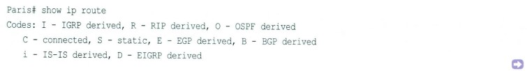
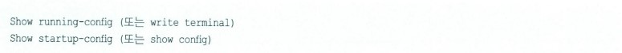
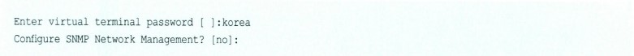
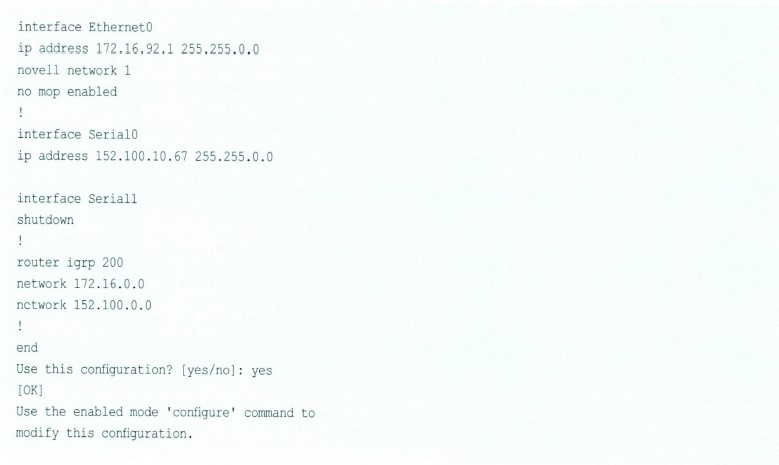
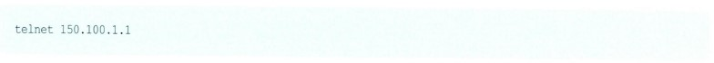
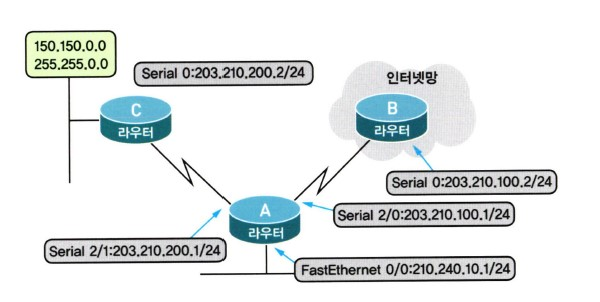
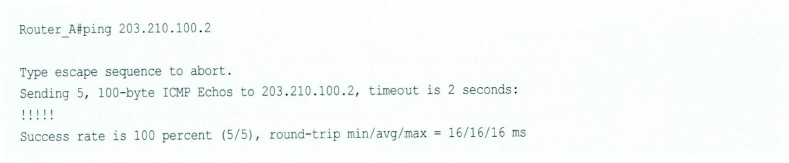
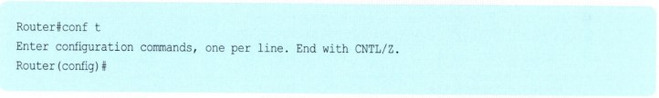
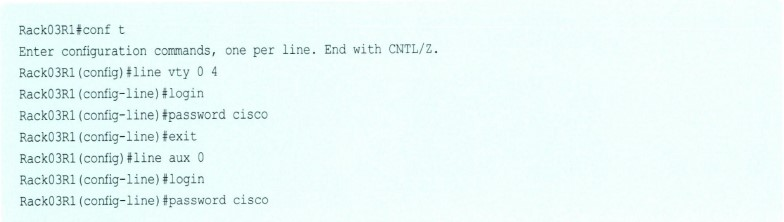

# 라우터만 알면 네트워크 도사?

## 목차

- [라우터를 한마디로 말하자면...](#라우터를-한마디로-말하자면---)
- [라우터는 무슨 일을 할까요?](#라우터는-무슨-일을-할까요-)
- [라우터는 어떻게 생긴 녀석일까요?](#라우터는-어떻게-생긴-녀석일까요-)
- [라우팅 프로토콜과 라우티드 프로토콜](#라우팅-프로토콜과-라우티드-프로토콜)
- [스태틱(Static) 라우팅 프로토콜과 다이내믹(Dynamic) 라우팅 포로토콜](#스태틱static-라우팅-프로토콜과-다이내믹dynamic-라우팅-프로토콜)
- [라우팅 테이블에 대한 이야기](#라우팅-테이블에-대한-이야기)
- [AS, 그리고 내부용과 외부용 라우팅 프로토콜](#as-그리고-내부용과-외부용-라우팅-프로토콜)
- [라우터 구성의 시작](#라우터-구성의-시작)
- [라우터의 중요한 몇 가지 모드](#라우터의-중요한-몇-가지-모드)
- [라우터 안에는 어떤 것들이 살까요?](#라우터-안에는-어떤-것들이-살까요)
- [내가 가진 라우터의 현재 정보는 모두 이곳에!](#내가-가진-라우터의-현재-정보는-모두-이곳에)
- [라우터 셋업 모드](#라우터-셋업-모드)
- [라우터에 명령을 입력하는 두 번째 방법](#라우터에-명령을-입력하는-두-번째-방법)
- [스태틱(Static) 라우팅을 이용한 라우터 구성](#스태틱static-라우팅을-이용한-라우터-구성)
- [스태틱 라우팅만 알면 디폴트 라우트는 식은 죽 먹기](#스태틱-라우팅만-알면-디폴트-라우트는-식은-죽-먹기)
- [라우터의 구성 명령에 대한 버전별 정리](#라우터의-구성-명령에-대한-버전별-정리)
- [디스턴스 벡터(Distance Vector)와 링크 스테이트(Link State)](#디스턴스-벡터distance-vector와-링크-스테이트link-state)
- [라우터의 패스워드 구성](#라우터의-패스워드-구성)
- [시스코 라우터의 친구 찾기 CDP](#시스코-라우터의-친구-찾기-cdp)
- 텔넷(Telnet)을 이용한 장비 접속
- 핑(Ping)과 트레이스(Trace)

## 라우터를 한마디로 말하자면..

여기에서는 라우터에 대해서 분격적으로 알아보도록 하겠습니다.

전에도 라우터에 관한 내용은 몇 번 다루었고, 또 그동안 IP 주소와 서브넷 마스크에 대한 내용을 완벽하게 끝냈으니 이제 본격적인 라우터 공부를 하는 것이 가능하겠죠?

앞에서도 몇 번 말씀드린 적이 있지만, 네트워크를 하는 사람이 가장 자주 만나는 장비는 바로 이 라우터라는 장비입니다. 인터넷을 사용하기 위해서, 서로 다른 네트워크 간 통신하기 위해서, 그리고 브로드캐스트 영역을 나눠주기 위해서 꼭 필요한 이 라우터는 여러분이 네트워크에 입문하게 된다면 가장 자주 만나는 장비 중 하나가 될 것입니다.

우선 이번 시간에는 라우터란 장비에 대해 알아보도록 하겠습니다.

라우터란, 한마디로 '지능을 가진 경로 배정기'라고 말할 수 있습니다.

지능을 가진 경로 배정기란 말은 라우터는 자신이 가야 할 길을 자동으로 찾아서 갈 수 있는 능력을 가진 것을 말합니다. 즉 외부의 어떤 인터넷 사이트를 찾아가는 데이터가 있다면 라우터는 이 데이터를 목적지까지 가장 빠르고 효율적인 길을 스스로 찾아 안내해 주는 능력을 가지고 있습니다.

참 좋은 장비죠?

물론 라우터에 아무것도 해주지 않았는데도 이러한 기능이 수행되는 것은 아닙니다. 라우터에 어떤 세팅을 해줘야 좋은 길을 가장 빨리 찾아갈 수 있습니다.

그럼 그 세팅은 누가 해야 할까요?

바로 여러분입니다.

이런 라우터의 세팅을 제대로 알기 위해서는 라우터에서 쓰이는 명령어 몇 줄을 아는게 중요하지는 않습니다. 계속 공부하면서 배우시겠지만 라우터에서 사용하는 명령어는 라우터의 제조회사에 따라 모두 다르기 때문에 모든 명령어를 안다는 것은 불가능하고 또 그럴 필요도 없습니다.

우리가 알아야 하는 것은 바로 네트워크에 대한 개념입니다. 즉 네트워크의 IP 주소에 대한 이해, 서브넷 마스크에 대한 이해, 라우팅에 대한 이해 등입니다.

라우터가 물론 IP 라우팅만을 하는 것은 아닙니다. 예를 들어 IPX, DECNET, AppleTalk 등 많은 프로토콜의 라우팅이 있지만, 우선 여기에서는 IP 라우팅을 위주로 알아보도록 하겠습니다.

일단 우리가 사용할 라우터는 시스코 라우터로 하겠습니다. 시스코 라우터가 전 세계 인터넷의 80% 이상을 차지하고 있는 세계 제일의 라우터이기도 하지만, 일단 제가 써본 것이고 제일 많은 질문을 받는 것이므로 이 라우터를 위주로 설명하겠습니다.

## 라우터는 무슨 일을 할까요?

우선 라우터가 도대체 어떤 일을 하는지 하나하나 알아보도록 하겠습니다. 만약 어떤 사람이 여러분에게 라우터가 무슨 일을 하는 장비냐고 묻는다면 여러분은 이렇게 말씀하시면 됩니다.

"라우터는 두 가지 일을 하는데, 그 하나가 Path Determination(경로 결정)이고, 또 하나는 Switching(스위칭)입니다."

이 말은 어떻게 보면 상당히 교과서적인 말이면서 어렵게 느껴지는 말이기도 하지만, 결국 여러분이 라우터를 전부 이해한 다음에 이 말을 다시 한 번 읽어본다면 그땐 아마 이해가 될 겁니다.  
라우터는 데이터 패킷이 목적지까지 갈 수 있는 길을 검사하고 어떤 길로 가는 것이 가장 적절한지를 결정합니다. 이것을 '경로 결정'이라고 말합니다. 그리고 그 길이 결정되면 그쪽으로 데이터 패킷을 스위칭해 줍니다. 이것을 '스위칭'이라고 합니다. (여기서 스위칭은 스위치가 해주는 일과는 다릅니다.)

그럼 라우터는 어떻게 가장 좋은 길을 찾아가는 것일까요? 이 라우터란 녀석도 나름대로 계산을 합니다. 어디로 가는 것이 가장 빠른 길일까, 어디로 가는 것이 가장 안전한 길일까 하고 말입니다.  
이렇게 라우터가 가장 좋은 길을 찾는 데는 라우팅 알고리즘, 즉 라우팅 프로토콜이 사용됩니다. 그리고 라우팅 알고리즘은 이를 위해서 라우팅 테이블이란 것을 만들어서 관리합니다.  
즉 라우팅 테이블에는 어디로 가려면 어떻게 가라는 지도 정보가 들어있는 겁니다. (아직 라우팅 알고리즘이 무언지, 그리고 라우팅 테이블은 또 뭔지 아실 필요는 없습니다.) 이러한 라우터의 기능을 위해서 라우터는 PC처럼 CPU(중앙 처리장치)도 가지고 있고, 메모리도 가지고 있고, 또 인터페이스도 가지고 있습니다.

> 알고 갑시다!

여기에서의 결론은!

라우터는 경로 결정과 스위칭을 하는 장비인데, 가장 좋은 경로를 결정하기 위해서 라우팅 알고리즘을 사용하고 이런 라우팅 알고리즘은 라우팅 테이블을 만들어서 관리한다.

## 라우터는 어떻게 생긴 녀석일까요?

이번에는 도대체 라우터가 어떻게 생겼는지 한번 알아보도록 하겠습니다. 라우터는 정말 종류도 많고 가격대도 다양합니다. 싼 것은 몇십 만 원에서부터 비싼 것은 몇억 원짜리도 있으니까 말입니다.

우리가 보통 사용하는 중소 규모의 사무실이나 게임방용 라우터들은 아래 그림에 있는 라우터들이 대부분입니다. 물론 이외에도 대형 회사의 센터 장비라든지, 아니면 ISP(인터넷 서비스 제공업체)들에서 사용하는 라우터는 크기가 훨씬 더 큰 라우터들도 많습니다.

보통 라우터의 앞쪽에는 램프(전원 램프, 상태 표시 램프, 링크 표시 램프 등)들이 있고, 뒤에는 직접 케이블을 연결할 수 있게 되어 있습니다. 따라서 라우터를 구매하실 때는 라우터 그 자체도 중요하지만, 여기에 들어가는 케이블도 꼭 챙기셔야 합니다.  
예를 들어 콘솔 케이블이나 아니면 라우터 DSU(전용선 모뎀이라고 생각하면 됩니다.)를 연결해주는 케이블 같은 것 말입니다.(V.35 케이블 등), 처음에 라우터를 세팅하러 가는 분들은 라우터 그 자체에 너무 신경을 쓰셔서 이런 것을 꼭 빼먹는 경우가 있습니다.

라우터는 살 때 일체형으로 이미 구성이 되어 있는 단독형과, 껍데기만 산 다음에 자기가 필요한 모듈들을 하나하나 꽂아서 쓸 수 있는 모듈형이 있는데 생각하는 대로 나중에 네트워크가 더 확장될 가능성이 있어서 라우터가 필요할 경우에는 모듈형이 적합하고, 구입 후 증설이나 확장 없이 사용할 거라면 단독형이 더 적합합니다. 게임방 같은 곳에서는 단독형이 적당하겠죠?

라우터의 가격은 대부분 성능과 지원되는 인터페이스의 숫자, 그리고 지원하는 기능에 따라 달라집니다. 물론 메이커에 따라서도 가격 차이가 있습니다. 가전제품과 비슷하니까 금방 이해가실겁니다.  
다시 말해서 라우터의 가격은 소프트웨어와 하드웨어로 나누어지는데, 시스코에서는 이렇게 라우터에 들어가는 소프트웨어를 'IOS(Internetwork Operating System)' 라고 합니다.  
이 소프트웨어에는 어떤 라우팅 프로토콜을 지원할 것인지, 어떤 보안 기능을 가질 것인지, 그리고 어떤 편리성을 제공할 것인지 등 다양한 라우터의 운용에 관한 내용이 들어있습니다. 따라서 IOS별로도 가격차가 꽤 많이 납니다.

소프트웨어에는 별로 가격 개념이 없어서인지 장비를 살 때는 아깝지가 않는데 소프트웨어를 살 때는 조금 아깝다는 생각이 드는 분이라면 라우터를 사실 때도 고민하게 될 겁니다. 어떤 경우에는 라우터 자체보다 운영체제, 즉 소프트웨어의 값이 더 비쌀 수도 있으니까 말입니다.

또 하드웨어의 경우에는 여러 가지 모델이 있고 앞에서 말씀드린 것처럼 자신의 현재 네트워크와 앞으로의 미래를 예측해서 가장 적합한 라우터를 찾는 것이 중요합니다. 물론 비싸고 좋은것을 사면 좋겠지만, 어차피 성능이란 것은 자신에게 가장 맞는 게 최고일 뿐만 아니라 무조건 비싸다고 좋은 것은 아니기 때문입니다.

이제 여러분은 라우터를 사진으로라도 보셨으니까 다음에 이런 녀석들을 만나면 아마 한눈에 알아볼 수 있을 겁니다.

그림에서 맨 왼쪽 위에 있는 시스코 2500이라고 하는 녀석이 라우터 중에서는 가장 유명한 녀석입니다. 제일 많이 팔린 녀석이기도 하고 말입니다. 시스코 2500 모델은 주로 작은 회사나 게임방 등 사용자 수가 약 몇백 명 정도인 곳을 연결하는 데 적합합니다. (물론 사용자 수는 사용 프로그램과 사용 환경에 따라 크게 달라질 수 있습니다.) 이런 2500 시리즈 라우터들을 아까 말씀드린 단독형이라고 볼 수 있는 겁니다.  
하지만 2500 라우터는 나온 지 너무 오래된 라우터라서 기능이 많이 떨어집니다. 그래서 몇 년 전 단종되어 더 이상 판매를 하지 않습니다. 따라서 시중에 돌아다니는 2500 시리즈 라우터는 중고 장비라고 보시면 됩니다.

2500 시리즈의 아래에 보이는 라우터가 중소 규모의 지사에 적당하도록 만들어진 ISR 4000 라우터입니다. ISR은 'Intergrated Services Router'의 약자로, 우리말로 하면 라우터에 여러 가지 서비스 기능을 추가했다는 의미인데, 현재 ISR 라우터는 1세대 G1과 2세대 G2를 거쳐 4000 시리즈까지 발전했습니다.  
ISR 4000 또는 ISR 4K 라우터는 요즘 네트워크에서 꼭 필요한 기능인 보안, 음성 지원, 무선뿐만 아니라 서버 기능까지 갖추고 있어 필요에 따라 라우터에 장착된 서버를 이용해서 우리 회사에 필요한 가상의 기능을 만들어 줄 수도 있답니다.  
이렇게 되면 중소 규모의 지사에는 라우터, 스위치, 서버, 보안 방화벽 등을 따로 두지 않고도 ISR 4K 라우터 한 대만 있으면 모든 게 다 해결되겠죠?

그 아래 보이는 라우터는 ASR 라우터 시리즈로, 주로 대형 SP(Service Provider) 네트워크나 대기업용 라우터로 사용되면서도 강력한 보안 기능과 다양한 서비스를 제공해주는 라우터입니다.

오른쪽 위에 보이는 ASR(Aggregation Services Router) 9000 시리즈 라우터는 ASR 1000 시리즈 라우터보다 한 단계 높은 급의 라우터입니다.  
이미 더 이상 판매하지 않지만 아직도 대형 라우터로 기억되고 있는 시스코 7600 시리즈 라우터를 계승한 동급 라우터라고 생각하시면 되는데요, 아무래도 최신형 라우터이다 보니 7600 라우터에 비해서는 훨씬 더 빠르고 강력한 라우팅을 제공할 뿐만 아니라 다양한 기능을 가지고 있어 대형 라우터가 사용되는 기업이나 학교, 관공서 등의 코어 라우터로 적합한 장비랍니다. (보통 코어 라우터, 또는 코어 스위치와 같이 '코어'라고 부르는 장비는 네트워크의 가장 중앙에서 핵심 역할을 하는 장비를 말합니다.)  
이렇게 중요한 역할을 하는 라우터이다 보니 절대 문제가 생겨서는 안 되기 때문에 안정성이 굉장히 중요하구요, 또 그만큼 가격도 비쌉니다.

오른쪽 아래에 있는 NCS 라우터(Network Convergence System Series Router)는 현재 시스코에서 나오고 있는 라우터 중 가장 사양이 높은 라우터 시리즈입니다.  
NCS 시리즈 라우터는 다시 NCS 2000, NCS 4000, NCS 6000 시리즈 라우터로 구분되는데, 이미 짐작하시는 대로 가장 숫자가 큰 NCS 6000 라우터가 제일 큰 라우터입니다.  
이 라우터는 슬롯당 최고 2테라 바이트의 속도를 낼 수 있는 최상급 라우터이고, 사용 환경에 따라 NCS 6000 라우터를 최대 16까지 붙여서 마치 한 대의 라우터처럼 사용할 수도 있게 구성이 가능합니다. 이런 구성을 '멀티샤시 구성'이라고 하는데, 이렇게 해서 최고 256테라의 속도가 가능하게 되는 겁니다.  
물론 라우터는 속도만 중요한 게 아니랍니다. NCS 6000 라우터와 같이 네트워크의 핵심이 되는 코어 라우터의 경우는 무엇보다도 안정성이 중요합니다.  
그렇겠죠? 빠르게 처리하다가 그냥 다운이 되어버린다거나, 장애 하나 생겼다고 모든 처리가 멈춰버린다면 큰 문제가 생기니 말입니다. 따라서 이와 같은 코어 라우터의 경우 다양한 장애 대비책이 만들어져 있고, 심지어 소프트웨어를 업그레이드한다거나 한쪽에서 장애가 발생하는 경우라고 하더라도 라우터는 서비스를 계속 할 수 있도록 디자인되어 있습니다.  
그러고 보니 지금 설명드리는 NCS 6000 라우터는 지난번에는 아예 설명조차 드리지 않았던 라우터였네요. 그때 설명드렸던 CRS-1 라우터는 이제 CRS-3 라우터에 이어 CRS-X(보통 CRS 10이라고 합니다.)까지 진화하고 있습니다.

그런데 이처럼 성능이 높은 라우터들이 계속 나오는 이유는 뭘까요? 그건 바로 우리가 사는 환경, 특히 네트워크 환경이 계속 변화하기 때문일 겁니다. 요즘 많이 들어본 듯한 네트워크의 트렌드를 잠깐 생각해볼까요? 우선 모바일 환경으로의 변화일 겁니다.  
이 책을 처음 썼을 때만 해도 인터넷은 그저 커다란 데스크톱 컴퓨터에 케이블을 연결해서 사용하거나, 좀 앞서가는 사람들이라면 노트북을 들고 다녔던 게 전부일 겁니다. 하지만 이제 인터넷을 쓸 때 가장 많이 사용하는 장비는 다른 아닌 휴대폰이죠?  
휴대폰, 태플릿, 그리고 노트북 등 이런 장비들을 바로 '모바일 장비'라고 한답니다. 또 다른 변화는 트래픽의 변화일 겁니다. 전에는 주로 텍스트 위주로 전송되던 인터넷의 데이터가 어느 순간부터 음성과 비디오 형태로 바뀌기 시작했습니다.  
이제 뉴스도 인터넷에서 생방송으로 시청이 가능하고, 왠만한 야구 중계도 전부 인터넷을 통해 볼 수 있는 시대인 걸 보면 인터넷 속도와 성능이 몇 년 전에 비해 얼마나 발전했는지를 알 수 있습니다.  
이런 비디오 트래픽은 앞으로도 점점 더 많아질 것이라고 전망하고 있으니 당연히 네트워크 장비들도 이를 처리할 수 있어야 하겠죠? 그 밖에도 한 번쯤 들어보셨을지 모르는 IoT(Internet of Things)와 빅데이터 같은 트렌드 역시 더 빠르고 성능 좋은 네트워크 장비가 필요해진 이유가 되었답니다.

가격이요? 가격은 당연히 매우 비쌀 겁니다.

이런 종류의 라우터는 일반 기업이나 학교보다는 '서비스 프로바이더(SP)라고 부르는 KT나 SKT 같은 곳에서 사용하거나, 대형 인터넷 포털에서 사용한답니다.

> 네트워크 플러스

### 라우터를 만지는 사람들이 자주 쓰는 말

라우터를 만지다 보면 자주 듣는 말이 있습니다. 꼭 만지지 않더라도 자주 나오는 몇 가지 말의 의미를 알아두면 이해가 쉬울 겁니다.

일단 '인터페이스'란 말이 있습니다.

인터페이스란, 라우터에 나와있는 접속 가능한 포트라고 생각하면 됩니다. 예를 들어 Cisco 2501이란, 라우터의 인터페이스는 1 Ethernet(이더넷)과 2 Serial(시리얼)이라고 합니다. 여기서 나오는 Ethernet(이더넷)과 Serial(시리얼)은 나중에 다시 설명드리겠습니다. 아무튼 이 라우터는 3개의 접속 포트가 있다는 뜻입니다. 즉 3군데와 붙일 수 있다는 뜻이 됩니다.

그럼 또 'Ethernet'이니, 'Serial'이니 하는 말은 무슨 의미일까요?

Ethernet은 많이 들어보셨죠? Ethernet은 내부 네트워크와 접속할 때 사용하는 인터페이스입니다. 즉 내부의 허브나 스위치 등과의 연결을 위한 포트입니다. (물론 내부 네트워크가 토큰링일 경우에는 토큰링 인터페이스가 필요하지만, 여기서는 일반적인 이더넷을 예로 들었습니다.) 인터페이스 Type은 TP(RJ45)나 AUI(15핀) 방식이 있습니다.

TP는 10Base T 방식을 말하고 AUI는 15핀으로 된 방식입니다. (Cisco 2501은 이더넷 인터페이스 방식이 AUI입니다. 따라서 요즘 많이 쓰는 UTP 케이블과 연결하기 위해서는 AUI-to-TP 트랜시버가 필요합니다. 이를 MAU(Media Access Unit)라고도 합니다.)

시리얼(Serial)은 WAN과의 접속을 위한 거라고 생각하면 됩니다. 즉 DSU(Digital Service Unit 또는 Data Service Unit이라고 합니다.)와의 접속을 위한 것입니다. 물론 FDSU, CSU 등과의 연결도 마찬가지입니다. 즉 외부 네트워크('리모트 구간'이라고도 합니다.)로의 연결을 위해서 사용하는 포트가 바로 Serial 포트입니다. 간혹 'WAN 포트'라고도 합니다.

또한 Serial 포트가 있는 경우에는 Serial 포트와 DSU, FDSU, CSU 등과 연결하기 위한 케이블이 하나 필요한데, 이 케이블이 바로 V.35 케이블입니다. 라우터를 구매하실 때는 이 케이블까지 구매하셔야 합니다. 이 케이블이 없으면 라우터와 DSU와의 연결이 불가능합니다.

참! DSU는 아시죠? 그냥 전용선용 모뎀 정도라고 생각하면 되는데, 속도나 방식에 따라 DSU, FDSU, CSU 등으로 부르고 모양은 다 비슷합니다. 옛날 학교 다닐 때 들고 다니면 납작한 도시락 모양이고, 색깔은 흰색이나 회색, 검은색입니다. 불이 들어오는 구멍이 여러 개 있어서 깜빡깜빡 거립니다. 이 장비의 한쪽은 전용선에 연결하게 되고, 다른 한쪽은 라우터에 연결하는 겁니다.

> 알고 갑시다!

인터페이스는 라우터의 접속 포트를 말한다.  
Ethernet 포트는 내부 네트워크, 즉 랜(LAN)을 위한 접속 포트이며, Serial 포트는 외부 네트워크(인테넛 또는 원격지) 접속을 위한 포트로, DSU/CSU와 연결한다.

요즘 나오는 라우터 중에서는 라우터 안에 이미 DSU/CSU 기능을 내장하고 있는 것들이 있습니다. 이러한 라우터는 따로 DSU/CSU 등을 살 필요가 없을 뿐만 아니라 케이블도 절약됩니다. 하지만 개인적으로 이런 라우터를 선호하진 않습니다.  
우선 DSU나 CSU는 여러 제조사의 제품이 있는데, 물론 표준을 따르고 있지만 간혹 제품끼리의 호환에 문제가 있어서 둘 사이의 접속이 안 되는 경우가 있습니다. DSU/CSU를 내장하고 있지 않은 라우터의 경우는 DSU/CSU만 교체해주면 되지만, 내장형 라우터의 경우는 방법이 없기 때문입니다. 따라서 현재 우리나라에서는 이처럼 DSU/CSU 내장형 라우터는 그리 많이 사용하고 있지 않은 추세입니다. 이런 것도 알아두면 도움이 되겠네요.

\

위 그림에서는 시스코 라우터 2501의 뒷면을 보여주고 있습니다. 여기에서 우리는 이더넷 인터페이스와 시리얼 인터페이스가 있다는 것을 알 수 있습니다. 만약 전용선으로 인터넷을 쓴다고 가정하면 시리얼 인터페이스에 V.35 케이블을 연결한 후 이 케이블을 다시 DSU/CSU로 연결하고, 전화국에서 들어온 전용선도 DSU/CSU에 연결하게 됩니다. 라우터 위에 보이는 것이 바로 DSU입니다.

## 라우팅 프로토콜과 라우티드 프로토콜

우리가 라우터를 하다 보면 여러 가지 비슷한 말을 많이 만나게 되고, 이것이 혼동되기 시작하면서 라우터가 어렵다는 이야기를 많이 하게 되는데, 그중에 하나가 바로 이 '라우팅 프로토콜'과 '라우티드 프로토콜'이 아닐까 합니다.

지금까지 우리가 배웠던 TCP/IP와 IPX, AppleTalk 등 우리가 아는 모든 프로토콜은 전부 라우티드 프로토콜입니다. 라우티드 프로토콜(Routed Protocol)이란, 말 그대로 라우팅을 당하는, 즉 라우터가 라우팅을 해주는 고객을 뜻합니다.  
라우터라는 자동차를 타고 여행을 떠나는 승객이라고 생각하면 됩니다. 그러니까 TCP/IP나 IPX는 고객으로서 라우터라는 자동차를 타고 다른 네트워크로 여행을 떠나는 겁니다.

그렇다면 라우팅 프로토콜(Routing Protocol)은 그 자동차를 안전하고 빠르게 운전하는 운전기사라고 볼 수 있습니다. 즉 라우터에 살면서 라우티드 프로토콜들에게 목적지까지 가장 좋은 길을 갈 수 있게 해주는 역할을 합니다.

따라서 라우터 입장에서는 어떤 운전기사(라우팅 프로토콜)를 채용하는가에 따라서 라우터의 성능(즉 얼마나 빨리, 그리고 안전하게 가는가)이 결정된다고 봐도 됩니다. 물론 자동차(라우터)가 가지고 있는 기본적인 성능도 중요합니다.

이런 라우팅 프로토콜에는 RIP(Routing Information Protocol), IGRP(Interior Gateway Routing Protocol), OSPF(Open Shortest Path First), EIGRP(Enhanced Interior Gateway Routing Protocol) 등이 있습니다. 물론 이외에도 많지만 우선은 이 정도만 알고 계시면 됩니다.

이런 라우팅 프로토콜을 다른 말로는 '라우팅 알고리즘'이라고도 합니다. 라우팅 알고리즘은 자신의 라우팅 테이블을 가지고 있으면서 자기가 찾아갈 경로를 이곳에 기억해둡니다. 어디가 가장 빠르고 안전한 길인가 하고 말입니다. 즉 라우팅 테이블은 운전기사(라우팅 프로토콜)가 있으면서 어떤 길이 가장 좋은 길인지 메모해 두는 이정표 같은 것이라고 생각하면 됩니다.  
따라서 라우팅 테이블은 일종의 메모리라고 생각하면 되고, 또 어떤 알고리즘을 사용하는가에 따라서 라우팅 테이블의 내용은 달라지게 됩니다. 그렇겠죠? 운전기사별로 메모하는 버릇이 다 다를 테니까 말입니다. 그럼 라우팅 테이블에는 어떤 내용이 들어갈까요?  
주로 목적지, 그리고 그 목적지까지의 거리, 그리고 어떻게 가야 하는가 등의 내용입니다. 또 라우팅 테이블은 시간이 지나면서 계속 업데이트됩니다. 즉 끊임없이 변한다는 말입니다. 새로운 길이 생길 수도 있고 새로운 목적지가 추가될 수도 있기 때문입니다. 끊임없이 변환하는 것이 바로 라우팅 테이블입니다.  
그렇다면 라우팅 알고리즘은 목적지까지의 가장 빠르고 안전한 길을 어떤 조건을 가지고 찾아낼까요? 그것은 사용하는 라우팅 프로토콜(라우팅 알고리즘)에 따라 전부 다릅니다.

다음에는 이런 라우팅 프로토콜에 대해서 하나하나 공부해 보도록 하겠습니다.

> 알고 갑시다!

라우티드는 자동차에 타는 승객이고, 이 자동차를 운전하는 것이 바로 라우팅 프로토콜이다. 그리고 자동차는 라우터이다. 이 자동차의 운전기사는 자기가 가는 목적지에 대한 이정표를 가지고 있는데, 이것을 '라우팅 테이블'이라고 하며 이 라우팅 테이블은 운전자마다 모두 다르다.

## 스태틱(Static) 라우팅 프로토콜과 다이내믹(Dynamic) 라우팅 프로토콜

라우팅 프로토콜을 구분할 때 스태틱과 다이내믹 라우팅 프로토콜로 구분합니다.

스태틱은 우리말로 하면 '정지된' 또는 '정적인'이라는 뜻이니까 말 그대로 한 번 정해놓으면 죽으나 사나 정해진 그대로 수행하는 프로토콜을 말하고, 다이내믹은 '동적인'이란 말 뜻처럼 상황에 따라서 그때그때 변화가 가능한 프로토콜을 말합니다.

좀 더 정확히 살펴보자면 스태틱 라우팅 프로토콜의 경우는 라우터에 사람이 일일이 경로를 입력해주는 것입니다. 가장 빠르고 좋은 길을 사람이 찾아서 말입니다. 그럼 라우터는 사람이 입력해 준대로 데이터를 보내기만 하면 됩니다.

사람이 모든 것을 생각하고 넣어주니까 그보다 더 좋은 길이 없겠죠? (물론 똑똑한 사람이 넣어준 길이라면 말입니다.) 거기다가 라우터는 아무 생각 없이 데이터를 넘기기만 하면 되니까 라우터 입장에서 봤을 때는 생각할 게 별로 없습니다. 시키는 대로 하기 때문에 따로 이정표도 많이 가지고 있을 필요가 없고 말입니다.  
즉 라우터 자체에는 부담이 들지 않아 라우팅하는 속도도 빨라지고 라우터의 성능이 좋아지게 됩니다. 물론 메모리도 적게 듭니다. 그것뿐만이 아닙니다. 스태틱 라우팅의 경우에는 사람이 경로를 알려주는 방식이기 때문에 뒤에 배울 다이내믹 라우팅 방식처럼 라우터들끼리 라우팅 테이블을 교환할 필요가 없습니다.  
따라서 네트워크의 대역폭을 그만큼 절약할 수 있습니다. 게다가 요즘 중요시되고 있는 보안에도 강합니다. 왜냐하면 외부에 자신의 정보를 알리기 않기 때문이죠. 그러고 보면 스태틱 라우팅은 정말 장점이 많습니다.

그러나 단점도 있습니다.

일단 귀찮다는 겁니다. 사람이 라우터에 일일이 목적지별로 경로를 넣어줘야 하니까 말입니다. 또 하나는 입력해준 경로에 문제가 생기면 큰일이 발생한다는 겁니다. 예를 들어 서울에서 부산을 가는 경로를 사람이 생각해서 라우터에 넣어줄 때 비행기가 가장 빠르다고 생각해서 비행기로 간다고 넣어줬다고 가정해 보겠습니다.

그런데 어느 날 날씨가 나빠져서 비행기가 뜨지 않는 사태가 발생했다면 라우터는 어떻게 할까요?

스태틱 라우팅 프로토콜의 경우는 그래도 데이터를 계속 서울 공항으로 보내게 됩니다. 사람이 라우터에 "부산 갈 때는 비행기이다"라고 입력해 놓았기 때문에 아무리 비행기가 뜨지 않아도 모든 데이터를 비행장에 보내게 되고, 결국 부산에는 못 가게 되는 겁니다.  
즉 스태틱 라우팅 프로토콜은 사람이 입력해준 경로에 문제가 발생하면 사람이 다시 그 경로를 고쳐줄 때까지는 계속 문제가 있는 쪽으로 데이터를 보내려고 합니다. 어차피 수동이니까 당연한 결과입니다.

하지만 다이내믹 라우팅 프로토콜은 평소에는 비행기로, 그리고 비행기에 문제가 있으면 기차로, 또 기차에 문제가 있으면 자동차로 이렇게 자동으로 판단하고 그때그때 가장 좋은 길을 찾아내는 방식입니다.

여기까지 보면 다이내믹이 좋아 보이죠?

하지만 다이내믹 프로토콜의 경우는 라우터에 부담을 줍니다. 왜냐하면 라우터가 할 일이 많아지기 때문입니다. 라우팅 프로토콜을 이용해서 어떤 길이 가장 빠른 길인지 계산을 해야 하고, 또 시간이 지날 때마다 바뀐 정보는 없는지 계속 확인해 봐야 하며, 이정표도 계속 업데이트 해야 하고 할 일이 한두 가지가 아닙니다.  
우리가 일반적으로 이야기하는 RIP, IGRP, OSPF, EIGRP 등이 이런 다이내믹 라우팅 프로토콜에 속합니다.

일반적인 라우팅 환경에서는 여러 가지 상황에 자동으로 대응할 수 있는 장점이 있고, 또 자동으로 가장 좋은 길을 찾아가는 다이내믹 라우팅 프로토콜을 주로 사용합니다.  
하지만 어떨 때는 라우팅 성능을 높이기 위해 스태틱을 사용하기도 합니다. 또 라우터가 선택할 수 있는 경로가 오직 하나뿐일 때는 다이내믹 프로토콜을 쓸 필요가 없을 수도 있습니다. 어차피 그 길이 끊어지면 다른 길도 없이 때문에 그때는 스태틱을 쓰는 게 좋습니다.

> 알고 갑시다!

라우팅 프로토콜에는 '스태틱 라우팅 프로토콜'과 '다이내믹 라우팅 프로토콜'이 있다. 스태틱은 라우터가 정해진 길만을 가기 때문에 일이 없는 대신 사람이 일일이 구성을 해줘야 하고, 또 정해진 길에 문제가 생겨도 사람이 그 길을 다시 고쳐줄 때까지는 계속 그 길로 가려고 한다.  
다이내믹은 라우터가 알아서 길을 찾는 장점이 있는 대신 라우터가 할 일이 많아진다.

## 라우팅 테이블에 대한 이야기

라우팅 테이블에 대해 잘 이해가 안 가시는 분들이 있을 것 같아서 그림으로 다시 한번 설명을 드리겠습니다. 아래 그림에서 중앙에 Router의 라우팅 테이블이 있습니다.  
이 Router는 목적지와 목적지를 가려면 어느 인터페이스로 가야 하는지를 자신의 라우팅 테이블에 가지고 있습니다. 여기서 E0는 이더넷 인터페이스 0번을 나타내고, S0는 시리얼 인터페이스 0번을 나타냅니다. 또 T0는 토큰링 인터페이스 0번을 나타냅니다. (인터페이스 번호는 0번부터 시작합니다.)

따라서 라우터가 어떤 목적지를 찾아가려고 하면 먼저 라우팅 테이블을 보게 되는 겁니다.

예를 들어 라우터가 150.2.0.0 네트워크에 있는 어떤 PC를 찾아가는 패킷을 받아들이게 되면 라우터는자신의 라우팅 테이블에 150.2.0.0으로 가는 길이 나와 있는지를 먼저 확인합니다.  
그랬더니 자기 라우팅 테이블에 150.2.0.0 네트워크로 가려면 T0로 가라는 내용이 나와 있으니까 패킷을 토큰링쪽 인터페이스로 넘겨주게 되는 겁니다. 물론 진짜 라우팅 테이블은 이것과는 조금 다릅니다. 또 전에도 말씀드렸듯이 라우팅 테이블은 라우터가 사용하는 라우팅 프로토콜에 따라서도 달라집니다.

제가 여기서 보여드리고자 하는 것은 라우팅 테이블에 관한 개념입니다.

즉 라우팅 테이블이란, 라우터가 어떤 경로를 찾을 때 사용하는 것이고, 이것은 사용하는 라우터의 프로토콜에 따라 달라지며, 또 라우터는 항상 최적의 경로를 찾아 이것을 라우팅 테이블에 유지하고 있다는 겁니다.

자, 그럼 라우팅 테이블이 정말로는 어떻게 생겼는지 한번 알아볼까요?

위 그림에서서처럼 라우터는 자기의 라우팅 테이블에다가 어떤 지도 정보를 가져다 놓습니다. 그건 라우터가 어떤 일을 하는가를 이해한다면 아마 이해가 될 겁니다. 이제 라우터가 어떤 일을 하는지 아시겠죠? 가장 빠르고 안전한 길을 찾아주고, 또 그 길이 끊어지면 다른 길을 찾아주는 역할을 합니다. 그럼 라우터에게 가장 중요한 것은 무엇일까요?

그것은 바로 지도입니다.

그렇다고 우리가 보통 쓰는 그런 지도는 아니고 라우터가 여러 가지 정보를 종합해서 얻어낸 네트워크에 대한 지도입니다. 즉 그림에서 보는 것처럼 어떤 목적지에 가기 위해서는 어떤 경로를 이용해서 가야 된다라고 써놓은 정보입니다.

이것을 우리는 '라우팅 테이블'이라고 합니다.

그러니까 라우터는 전원을 켜는 그 순간부터(물론 라우팅 프로토콜에 대한 세팅은 이미 되어 있다고 가정했을 때입니다.) 라우팅 테이블을 만들기 시작해서 어떤 패킷이 길 안내를 요청하면 라우팅 테이블을 보고 길을 안내합니다.

자, 그렇다면 전원이 꺼지면 어떻게 될까요? 라우터가 이런 라우팅 테이블을 저장할까요? 답은 '아니오'입니다. 꺼지면 모두 지워지게 됩니다.

하지만 걱정할 필요는 없습니다. 전원이 켜지면 다시 만들 수 있으니까요. 얼마만에? 몇 초가 될 수도 있고 또 몇 분이 될 수도 있습니다. 그것은 네트워크의 크기와 사용하는 프로토콜에 따라 많이 달라집니다. 아무튼 라우팅 테이블은 라우터가 가장 중요하게 사용하는 길 안내 정보가 들어있다고 생각하면 됩니다.

시스코 라우터에서 라우팅 테이블을 보기 위해서는 show ip route라는 명령을 사용합니다.

자, 그럼 한번 해볼까요?

이렇게 나오게됩니다.

여기 나오는 라우팅 테이블은 여러분이 시스코 라우터를 계속 만지게 된다면 아주 자주 만나게 되므로 하나하나의 의미를 꼭 아셔야 하는 것들입니다. 하지만 아직은 모르셔도 됩니다. 우선 여기서는 간단하게 구경만 하고 넘어가면 됩니다.

라우팅 테이블에서 각각의 의미는 맨 앞에 있는 영문자가 어떤 프로토콜을 이용해서 이 길을 알아냈는가를 보여줍니다. 즉 I는 IGRP를, R은 RIP를 나타내고, O는 OSPF를 나타냅니다. 또 C는 connected, 즉 직접 접속된 네트워크를 말합니다.

라우터가 그 네트워크에 직접 붙어있다는 뜻입니다. 그다음에 있는 주소는 목적지를 나타냅니다. (정확히 말해서 목적지의 네트워크 주소입니다.) 그리고 그다음에 나오는 것이 바로 어디를 통해서 가야 목적지에 도착할 수 있는가를 알려주는 경로입니다.

여러분이 라우터를 자주 접하게 된다면 꼭 알아야 할 명령입니다. 조금 복잡해도 라우팅 테이블을 자주 접하시는게 좋습니다.

> 알고 갑시다!

라우터는 라우팅 테이블이라는 경로에 대한 지도 정보를 유지하고 있는데, 이건 RAM에 올라가기 때문에 파워가 꺼지면 전부 지워져 버린다. 그리고 다시 파워를 켜면 수초 또는 수분 만에 다시 만들어진다. 이 라우팅 테이블을 시스코 라우터에서 보는 명령은 show ip route이다. (sh ip route는 TCP/IP에서 찾은 경로만 보여준다. 예를 들어 IPX에서의 경로 정보를 보고자 하는 경우에는 sh ipx.route라고 해주면 된다.)

## AS, 그리고 내부용과 외부용 라우팅 프로토콜

여기에서는 먼저 AS(Autonomous System)라는 말에 대해서 알아보도록 하겠습니다. AS란 말은 네트워크를 하는 사람이라면 자주 듣게 되는 말입니다.

AS는 'Autonomous System'의 약자로, 하나의 네트워크 관리자에 의해서 관리되는 라우터들의 집단이라고 생각하면 됩니다. 또 어떤 의미로는 하나의 관리 규정 아래서 운용되는 라우터의 집단 또는 하나의 관리 전략으로 구성된 라우터 집단 등으로, 쉽게 말하면 한 회사나 기업, 또는 단체의 라우터 집단이라고 생각하면 됩니다.

예를 들어 어떤 기업이 네트워크를 구축하게 되면 그 네트워크 안에는 여러 대의 라우터가 올 수 있습니다. 서울에 몇 대, 지방에 몇 대 이렇게 이 기업에 소속된 모든 라우터들은 그 기업의 네트워크 관리자에 의해 관리를 받게 되는데, 이런 그룹이 바로 AS가 됩니다. 또 KT, 데이콤과 같은 ISP 업체들도 자신들이 가진 라우터가 한두 대가 아닐 겁니다. 이렇게 ISP들이 보유하고 있는 라우터 그룹이 하나의 AS가 됩니다.

라우터들을 다시 AS라는 그룹으로 묶어주는 이유는 라우터가 가지는 정보를 효율적으로 관리하고 인터넷 서비스를 좀 더 간편하게 제공하기 위해서입니다. 즉 AS 안에 있는 라우터들은 자신의 AS에 속해 있는 라우터에 대한(물론 자신들 내부의 네트워크 정보겠죠?) 정보만 알고 있으면 됩니다.  
그러다가 외부, 즉 AS 밖으로 나갈 때는 그 AS에 있는 문지기 라우터(ASBR: Autonomous System Boundary Router라고 합니다.)에게 정보를 물어봐서 밖으로(인터넷) 나가는 겁니다.

문지기 라우터는 자신의 AS와 인접해 있는 다른 AS에 대한 정보를 가지고 있으면서 자기 AS에서 밖으로 나가는 라우터나 외부 AS에서 자기 AS쪽으로 들어오는 라우터에게 정보를 제공하는 역할을 합니다.

이런 시스템 때문에 라우터들은 인터넷 접속하더라도 전 세계의 모든 네트워크에 대한 정보를 다 가지고 있을 필요가 없고, 단지 자신이 속한 AS에 대한 정보만 가지면 됩니다.

이때 라우터 AS 내부에서 사용하는 라우팅 프로토콜을 Interior Routing Protocol 또는 Interior Gateway Protocol(IGP)이라고 하고 AS 간에, 즉 AS 외부에서 서로 라우팅 정보를 주고받기 위해 라우터가 사용하는 프로토콜을 Exterior Routing Protocol 또는 Exterior Gateway Protocol(EGP)이라고 합니다.

Interior Routing Protocol의 예로는 우리가 잘 아는 RIP, IGRP, EIGRP, OSPF 등이 있고, Exterior Routing Protocol의 예로는 EGP, BGP 등이 있습니다.

따라서 본사와 지사 간에 라우터를 설치해야 할 경우에는 RIP나 OSPF 등 IGP를 사용하고, 본사의 라우터가 인터넷 서비스 업체와 연결을 해서 인터넷을 사용해야겠다고 생각할 경우에는 BGP와 같은 EGP를 사용합니다. (뒤에 가서 다시 설명드리겠지만 Exterior Gateway Protocol의 경우 요즘은 EGP보다는 거의 BGP를 사용하는 추세입니다. BGP가 여러 가지 장점을 가지고 있기 때문입니다.)

그림에서 구름으로 보이는 것이 하나의 AS입니다. 즉 AS 안에서는 Interior Routing Protocol, 즉 내부용 라우팅 프로토콜인 RIP이나 IGRP 등이 라우터에서 사용되고, AS와 AS간의 통신에서는 라우터에서 BGP 등과 같은 Exterior Routing Protocol, 즉 외부용 라우팅 프로토콜이 사용됩니다.

## 라우터 구성의 시작

자, 이번 시간에는 라우터를 실제 인스톨(설치)할 때는 어떤 방법이 있는지를 알아보도록 하겠습니다.

라우터에 명령어를 입력하는 방법은 몇 가지나 될까요?

CCNA 시험에도 많이 나오는 문제이기 때문에 특히 질문이 많은 부분입니다. 여기에서 완전히 이해를 하고 넘어가면 좋을 것 같습니다. 아래 그림에 있는 것처럼 대략 5가지 정도가 됩니다. 물론 라우터에 따라서 차이는 있겠죠? 여기에서 예를 들어 설명하는 것은 시스코 라우터입니다.

그 첫 번째가 바로 콘솔(console) 케이블이란 것을 이용하는 겁니다. 라우터를 구매하게 되면 대부분은 그 안에 콘솔 케이블이란 것이 같이 들어있는데, 이 케이블을 라우터의 콘솔 포트(라우터의 뒷면에 보면 Console이라고 쓰여있는 포트가 있습니다.)에 연결하고 나머지 한쪽은 컴퓨터의 USB 포트에 연결하게 되면 콘솔 연결이 되는 겁니다.  
가끔 콘솔 케이블 중에는 양쪽 다 UTP 포트 모양으로 되어 있는 케이블도 있는데, 이 경우에는 이 UTP 포트를 다시 USB 포트로 변경하는 컨버터를 따로 준비하셔야 됩니다. UTP 형식이라고 바로 LAN 포트에 연결하면 안 된답니다.

일단 콘솔 케이블 연결이 끝나면 이제 콘솔 프로그램을 다운로드해야 합니다. 윈도우 XP 버전까지만 해도 윈도우에서 기본적으로 하이퍼터미널이라는 콘솔 프로그램을 제공했는데, 지금 사용하는 윈도우 7이나 윈도우 10의 경우는 따로 하이퍼터미널을 제공하지 않기 때문에 인터넷에서 콘솔용 프로그램을 다운로드해야 한답니다.

콘솔용 프로그램 중에서 가장 많이 사용하는 프로그램은 'PuTTY'입니다.

그림에서 보이는 것처럼 이 프로그램은 무료 다운로드가 가능한 프로그램입니다. 설치가 끝나면 바로 PuTTY를 이용해서 콘솔 작업이 가능한데, 그전에 먼저 확인해줄 게 한 가지 있습니다. 앞에서 콘솔 케이블을 여러분의 컴퓨터에 연결한 거 기억나시죠? USB 포트에 연결했잖아요? 이 콘솔 케이블이 제대로 연결되었는지, 그리고 어떤 포트에 연결되었는지를 알아보기 위해 컴퓨터에서 장치 관리자를 열어봐야 합니다.  
장치 관리자는 바탕화면에서 [내 컴퓨터]를 클릭하시고 마우스 오른쪽 버튼을 누르게 되면 [속성]이라는 필드가 보이고, 이걸 선택하면 내 컴퓨터에 대한 여러 가지 정보를 볼 수 있습니다. 이때 맨 왼쪽 위에 [장치 관리자]가 있는데, 이것을 클릭했을 때의 화면이 아래 그림에 보입니다.

[장치 관리자]를 자세히 보시면 아래쪽에 [포트 (COM & LPT)]라는 항목이 보이실 겁니다. 여기에서 [Cisco Serial(COM6)] 이라고 보이실 겁니다. 제 컴퓨터에서는 콘솔 케이블이 COM6에 연결되어 있다는 걸 알 수 있습니다.  
이와 같은 COM 포트 번호는 컴퓨터마다 다르기 때문에 여러분의 컴퓨터에서는 다르게 보일 수 있습니다. 따라서 콘솔 케이블 연결 후에는 꼭 장치 관리자의 열과 포트 번호를 확인하시기 바랍니다.

이제 콘솔 케이블 연결이 완료되었으니 콘솔 작업을 위해 앞에서 다운로드해서 설치했던 PuTTY를 실행해봐야겠죠? 아래 그림은 PuTTY를 실행했을 때의 첫 화면입니다.

좀 복잡하게 영어로 막 써있지만, 별로 중요한 내용은 아니고, 맨 위쪽에 있는 'Serial line'이란 곳에 앞에서 장치 관리자를 열어가며 확인했던 COM 포트 번호를 여기에 써주시면 됩니다.  
저의 경우엔 앞에 그림에서 설명드린 것처럼 포트 번호가 COM6였으니까 여기에 COM6를 입력했습니다. 그리고 옆에 있는 Speed는 시리얼에서의 초당 비트수인데, 원래 잡혀진 디폴트 값인 9,600bps를 그대로 사용하시면 됩니다. 그리고 그 아래쪽 Connection type은 Serial로 선택해 주시면 됩니다.  
앞에서도 잠깐 이야기드렸지만 우리가 COM 포트라고 이야기하는 이 포트가 다른 말로는 Serial 포트이기 때문입니다.

그리고 아래쪽 박스에 Saved Sessions에는 지금 만든 이 콘솔 구성으로 어떤 이름으로 저장할 건지를 정해서 써주면 되는데, 저는 'Hoony Lab'이라는 이름을 만들어줬습니다. 여러분은 아무거나 예쁜 이름으로 만들어주시면 된답니다.  
이렇게 한번 Session 이름을 만들어 놓게 되면 다음부터는 PuTTY를 쓸 때마다 구성을 넣어줄 필요 없이 그냥 저장된 세션 이름만 선택하면 되겠죠?

자, 그럼 지금까지의 콘솔 연결을 정리해볼까요?

이렇게 모든 구성을 마쳤으면 아래 보이는 [Open] 버튼을 눌러 라우터에 들어갈 수 있습니다.

이게 바로 콘솔을 이용한 연결입니다. 콘솔 연결을 통한 라우터 구성은 가장 일반적인 구성입니다. 여러분도 나중에 라우터를 구성하게 될 기회가 있을 텐데 그때 바로 콘솔에 연결하는 방식을 사용할 것입니다.

콘솔을 이용한 방식은 설명드린 것처럼 라우터를 맨 처음 구성할 때는 가장 일반적이고 편리한 방법이자만, 라우터에 직접 PC를 들고가서 콘솔 케이블을 연결해주어야 하는 불편함이 있습니다.  
또한 콘솔 케이블도 필요하기 때문에 맨 처음 구성하는 경우나 고장이 났을 때만 사용하고, 일단 한 번 라우터가 구성된 이후에는 잘 사용하지 않는 방법입니다.

즉 일단 라우터의 모든 세팅이 끝난 후 나중에 라우터의 구성 일부를 변경하는 경우에는 콘솔보다는 텔넷을 이용해서 구성을 변경하기 때문입니다.

콘소 ㄹ방법의 장점은 가장 강력한 세팅 방법이라는 겁니다. 예를 들어 나중에 나오는 텔넷 방식은 라우터와 통신이 끊어지게 되면 텔넷도 같이 끊어지기 때문에 네트워크 고장 발생시 텔넷으로 라우터에 접근이 불가능한데, 이때도 콘솔은 라우터에 접근이 가능합니다.

또 AUX(Auxiliary) 포트라는 것이 있는데, 이 포트에는 모뎀을 연결할 수 있게 되어 있습니다.

여기에 모뎀을 연결해 놓으면 원격지에서도 모뎀을 통해 라우터에 명령어를 입력할 수 있습니다. 이렇게 모뎀을 이용한 라우터 구성은 기존의 네트워크에 문제가 발생해서 텔넷으로는 라우터에 접근이 불가능합니다. 또한 콘솔을 연결해서 구성을 하자니 너무 먼 곳, 즉 라우터가 지방 같은 곳에 있어 불가능한 경우에 사용하는 방법입니다.

물론 라우터에는 모뎀에 대한 세팅이 모두 되어 있어야 합니다. 이런 AUX 포트의 사용은 순전히 문제가 발생했을 때를 대비한 것이기 때문에 일반적이지는 않습니다.

그다음은 텔넷(Telnet)을 이용한 라우터 구성입니다. 텔넷 역시 PuTTY를 이용해서 사용이 가능합니다.

아래 그림을 보면 콘솔을 만들 때와 같은 화면이라는 것을 아실 겁니다. 다만 하나 다른 것은 접속 방법(Connection Type)이 Telnet이라는 것입니다.

대부분 라우터를 관리할 때 가장 많이 사용하는 방법이 바로 이 텔넷을 이용한 방법입니다. 이 방법은 라우터의 IP 주소만 알고 있고 네트워크에 접속만 되어 있다면 어디에서도 구성이 가능하다는 장점이 있습니다. 반면 라우터의 맨 처음 구성 시에는 어차피 IP 주소조차 없기 때문에 텔넷 사용이 불가능하다는 단점과 네트워크 연결이 끊어질 경우 텔넷 접속이 불가능하다는 단점을 가지고 있습니다.

텔넷을 사용하는 한 가지 예를 들어보겠습니다.

만약 제가 지방의 어떤 라우터를 설치했다고 가정해 보겠습니다. 물론 맨 처음 지방에 그 라우터를 설치하기 위해 출장을 갔을 겁니다. 라우터를 전산실에 설치하고 콘솔을 이용해서 라우터의 IP 주소를 세팅했거나 기타 라우터의 구성을 세팅했을 겁니다.  
모든 것이 이상이 없다는 것을 확인하고 저는 다시 서울로 올라왔습니다. 그런데 그 라우터의 구성을 변경할 일이 생겼다고 가정해보겠습니다. 뭐 프로토콜이나 서브넷 등 말입니다. 그렇다면 또다시 콘솔 케이블을 가지고 직접 지방으로 가야 할까요?

바로 이럴 때 사용하는 것이 텔넷입니다. 물론 네트워크로 연결되어 있다는 가정이 있어야겠죠? 그런 텔넷을 바로 'Virtual Terminal(가상 터미널)'이라고 합니다.  
그럼 이제는 아시겠죠? 만약 지금 설명한 상황과 똑같은 상황에서 네트워크에 문제가 생겨 텔넷조차도 불가능한 경우에는 무엇을 사용할까요? 그게 바로 AUX 포트를 통한 접속입니다. 앞에서 배워서 아마 알고 계실 겁니다.

네트워크 관리 시스템(NMS)에 의한 라우터의 구성 방법은 라우터 구성 방법 중에서는 가장 쉬운 방법일 겁니다. 물론 NMS 구성은 좀 어렵지만 일단 구성된 NMS에서 라우터를 세팅한다고 가정한다면, 지금까지 방법과는 달리 그래픽 방식이기 때문에 훨씬 쉽고 또 여러 가지 다른 정보도 많이 알 수 있게 됩니다.

마지막으로 TFTP 서버로 라우터를 구성하는 방법입니다. 이 방법은 앞에서 설명드린 4가지 방법과는 약간의 차이가 있습니다. 즉 앞의 4가지 방법은 직접 명령을 라우터에 세팅할 수 있는데, TFTP 서버에 의한 방식은 서버에서 직접 라우터로 세팅을 해주는 방식은 아닙니다.

TFTP 서버에 의한 라우터 구성은 이미 다른 곳에서 만들어 놓은 라우터의 구성 파일을 TFTP 서버에 저장해 두었다가 라우터로 다운로드해 주는 방식을 말합니다.  
이때 다운로드에 사용되는 프로토콜이 바로 TFTP(Trivial File Transfer Protocol)인데, 우리말로 하면 '단순형 파일 전송 프로토콜' 정도 됩니다.

만약 여러분이 라우터 IP 주소를 아신다면 윈도우의 MS-DOS 모드로 이동해 telnet x.x.x.x(라우터의 IP 주소)를 입력해 보세요.

그럼 라우터로 텔넷을 하게 됩니다. 물론 아까 배운 대로 하이퍼터미널로도 텔넷 구성은 가능하지만 간단하게 해보려면 MS-DOS 모드에서도 가능합니다. 라우터의 IP 주소를 모른다구요? 그것은 도스 모드에서 ipconfig(windows xp)을 했을 때 게이트웨이 번호로 나타나는 주소가 여러분의 네트워크에 붙어있는 라우터의 IP 주소입니다.

가장 많이 쓰이는 방법이니 한 번씩 연습해 보는 게 좋겠죠? 물론 지금은 그냥 연습만 해보기 바랍니다. 또 직접 라우터에 가서 콘솔을 연결할 수 있는 분은 콘솔 케이블과 노트북을 들고 라우터로 가서 라우터의 콘솔 포트와 노트북의 시리얼 포트에 콘솔 케이블을 연결하고 한 번 라우터에 접속해 보세요. 아마 라우터와 친해지게 될 겁니다.

위 그림은 콘솔을 통한 라우터에 접속한 것을 보여줍니다. 라우터에 뭐라고 글씨가 많이 나와있는데 지금은 신경쓰지 않으셔도 됩니다. 어차피 나중에 이 뜻을 다 알게 될 거니까요.

아무튼 지금은 라우터에 콘솔을 연결하면 이렇게 보인다는 것만 알면 됩니다. 물론 콘솔을 통해서 접속했는데 아무것도 안 보이거나 이상한 글자가 깨져서 나오는 경우에는 콘솔의 구성에 이상이 있거나 케이블에 이상이 있다고 생각하면 맞을 겁니다.  
따라서 위에서 설명드린 구성을 다시 한 번 확인해보고 꼭 라우터 구입 시에 같이 딸려오는 콘솔 케이블을 사용하시기 바랍니다.  
참고로 이 라우터는 아무것도 세팅되어 있지 않은 새 라우터이고 기종은 시스코 2509입니다.

> 알고 갑시다!

라우터를 구성하는 방법은 5가지가 있다. 첫 번째로 맨 처음 라우터를 구성할 때 쓰는 콘솔 케이블을 통한 구성, 두 번째는 원격지에서 모뎀을 이용한 구성, 세 번째는 일단 IP 주소가 세팅된 다음에 네트워크를 통해서 접속하는 텔넷을 이용한 구성, 네 번째는 네트워크 관리 시스템이 있는 곳에서 사용하는 NMS를 이용한 구성, 그리고 맨 마지막에는 미리 구성된 파일을 저장했다가 나중에 라우터로 다운로드하는 TFTP 서버를 이용한 구성이 있다.

## 라우터의 중요한 몇 가지 모드

여기에서는 라우터의 몇 가지 중요한 모드에 대해서 한번 알아보겠습니다. 아마 다 알고 계실거라고 믿지만, 그래도 기본을 짚고 넘어가는 것도 중요하니까 아는 분은 복습한다는 생각으로 읽어보세요.
또 시스코 라우터를 처음 접하시는 분은 이게 도대체 무슨 소리냐고 하겠지만 라우터에 대한 설명에서, 또 라우터를 만지는 사람들의 이야기에서 자주 나오는 중요한 개념이니까 꼭 이해해 두기 바랍니다.

시스코 라우터의 경우 콘솔을 이용해서 라우터에 들어가든, 아님 텔넷을 통해 라우터에 들어가든 라우터의 몇 가지 모드 화면으로 들어가게 되는데, 그 모드는 대략 유지 모드, 프리빌리지드(Privileged) 모드, 구성(Configuration) 모드, 셋업(Setup) 모드, RXBOOT 모드 등이 있습니다.

RXBOOT 모드는 평소에는 사용할 일이 없는 모드입니다. 그럼 이 모드는 언제 사용할까요? 이 모드는 라우터의 패스워드를 모르는 경우나 라우터의 이미지 파일(IOS)에 문제가 생긴 경우 복구를 위해 사용합니다. 즉 이 모드는 문제 발생시 복구용으로 만들어 놓은 모드라고 생각하면 됩니다.  
이 모드는 'RXBOOT 모드' 또는 'ROMMON 모드'라고도 합니다. ROM Monitor 모드를 줄여서 부르는 말입니다. 이 모드의 사용법은 나중에 패스워드 복구를 배울 때 설명할 예정이므로 일단은 롬몬, 또는 RXBoot 모드라는 것이 있다라는 것까지만 알아두고 넘어가도록 하겠습니다.

그다음 셋업 모드입니다. 셋업 모드는 라우터를 처음 구매해서 파워를 켰거나 라우터에 구성 파일이 없는 경우 라우터가 부팅하면서 자동으로 들어가는 모드입니다. 이 모드에 들어가서 라우터는 구성에 관계된 질문을 하나하나 던지게 되고, 사용자는 이 질문에 대답하면서 구성 파일을 만들 수 있도록 되어 있는데, 이 모드 역시 뒤에 라우터의 구성에서 자세히 다룰 예정이므로 셋업 모드란 것이 있구나까지만 알고 넘어갑니다.

그럼 이제 나머지 유저 모드, 프리빌리지드 모드(Privileged Mode), 그리고 구성 모드를 하나씩 알아보도록 하겠습니다.

라우터에 콘솔로 접속하게 되면 다음과 같이 보이게 됩니다. (여기에서는 기본적인 세팅이 되어 있는 라우터라고 가정하겠습니다. 처음 상태는 아니란 말입니다.)

이때 '>' 가 있는 이 모드를 '유저 모드'라고 합니다.

이 유저 모드에서는 주로 테스트, 즉 현재 상태를 볼 수 있습니다. 핑(Ping)을 해본다든지, 아니면 트레이스 등을 해볼 수 있습니다. 하지만 라우터의 구성 파일을 본다거나 구성 자체를 변경할 수 없습니다.

즉 일반 유저가 라우터의 구성을 변경시키면 문제가 되겠죠?

따라서 라우터의 운영자 모드는 따로 있는데, 이것이 바로 프리빌리지드(Privileged) 모드입니다. 프리빌리지드 모드에 들어가는 방법은 유저 모드에서 enable라는 명령을 사용하는 것입니다.  
즉

이렇게 enable과 해당 패스워드를 입력하면 프리빌리지드 모드에 들어가게 됩니다. 원래 패스워드는 안 보이는 건 다 아시죠?

프리빌지드 모드에 들어오면 프롬프트가 꺾쇠(>)에서 샵(#)으로 바뀐 것을 알 수 있습니다.

이 모드에서는 모든 라우터의 명령이 가능합니다. 구성을 볼 수도 있고 변경할 수도 있습니다.  
유저 모드는 사용할 수 있는 명령이 제한적인데 비해서 프리빌리지드 모드는 사용할 수 있는 명령의 제약이 없는 모드입니다. 즉 운영자가 뭐든지 해도 괜찮습니다.

프리빌리지드 모드에서 다시 유저 모드로 빠져나갈 경우에는 다음과 같이 입력하면 됩니다.

유저 모드에서도 바져나가고 싶으면 이렇게 입력하면 됩니다.

일단 우리가 라우터를 세팅하는 경우에 가장 많이 만나는 모드가 바로 지금 설명드린 2가지 모드입니다. 잘 기억해 두기 바랍니다.

자, 다음은 구성 모드입니다. 라우터의 구성 파일을 변경하는 경우에 사용하는 모드입니다. 보통 Config 모드라고도 하는 이 모드는 라우터를 만지는 엔지니어들은 꼭 알아두어야 할 모드입니다. 앞에서 말씀드린 대로 우리가 만들어야 할 모든 구성 파일을 바로 이곳에서 만들기 때문이죠.

아무튼 이 모드에 들어가기 위해선 반드시 우리가 프리빌리지드 모드에 있어야 합니다. 즉 유저 모드에서는 결코 들어갈 수가 없는 모드라는 겁니다. 그럼 구성 모드에 한번 들어가 볼까요?

우선 프리빌리지드 모드에서 들어갈 수 있다고 했으니까.

이제부터는 라우터의 모든 구성 파일을 이곳에서 만들 수 있습니다. 구성을 다 마치고 구성 모드에서 프리빌리지드 모드로 빠져나갈 때는 `Ctrl`+ `Z`를 이용합니다. 키보드의 왼쪽 아래에 있는 `Ctrl` 과 `Z`를 동시에 누르는 겁니다.

빠져나오는 방법은 이 외에도 exit를 이용하는 방법이 있습니다. Exit와 `Ctrl`+ `Z`의 차이는 `Ctrl`+ `Z`는 한 번에 프리빌리지드 모드로 빠져나올 수 있는 반면에 Exit는 단계별로 빠져나온다는 겁니다.

이 말이 이해가 안 가겠지만 우선은 그렇게만 이해하고 여기서는 2가지 방법으로 빠져나올수 있다는 것까지만 이해하면 됩니다. 자, 그럼 한번 빠져나와 볼까요?

이렇게 빠져나왔습니다. 쉽죠?

> 알고 갑시다!

라우터에는 몇 가지 모드가 있다. 여기서 우리가 자주 사용하는 모드는 프리빌리지드 모드, 즉 운영자 모드와 구성 모드, 즉 Config 모드이다. 구성모드로의 변경은 오직 프리빌리지드 모드에서만 가능하다.  
그리고 유저 모드에서 프리빌리지드 모드로 들어가는 명령은 enalbe이고, 다시 유저 모드로 나오는 명령은 disable이다.

## 라우터 안에는 어떤 것들이 살까요?

여기에서는 라우터의 내부를 한번 들여다볼까요? 물론 라우터의 내부를 아는 것이 라우터를 설치하고 구성을 하는 데 무슨 관련이 있느냐고 생각하는 분들도 있겠지만, 뭐든지 기본이 중요한 것 아니겠습니까?  
기본을 충실히 하면 이해가 쉽습니다. 역시 요즘은 암기보다는 이해가 중요시되는 세상이니 저도 여러분의 이해를 위해 잠깐 라우터의 내부에는 무엇들이 사는지를 설명해 드릴까 합니다.

아래 그림을 보면 라우터가 그렇게 복잡한 것이 아니라는 것을 알게 될 겁니다. (여기서 사용한 라우터는 시스코 2500 시리즈이지만 다른 라우터들도 똑같은 구조라고 생각해도 됩니다.)

그림에서 위쪽에 라우터를 움직이는 프로글매이 사는 공간이 있고, 아래쪽에는 콘솔 포트와 AUX 포트, 인터페이스가 있습니다.

인터페이스는 바로 네트워크와 라우터에서 직접 연결되는 부분입니다. 즉 허브나 스위치와 연결하는 이더넷 인터페이스 또는 DSU나 CSU와 연결하는 Serial 인터페이스가 바로 그것입니다.

자, 그럼 맨 위부터 볼까요?

가장 먼저 램(RAM)이 있습니다. 램(RAM)에는 라우터를 운용하는 운용 시스템이 올라가게 되는데, 아시는 대로 램은 파워가 꺼지면 모두 지워지는 곳이기 때문에 이 운용체제도 파워가 켜진 다음에 램(RAM) 위로 올라오게 됩니다.

모든 라우터들은 그들 고유의 운영체제를 가지고 있는데, 시스코 라우터의 경우 이 운영체제로 IOS(Internetwork Operating System)를 사용합니다.

시스코의 경우는 모든 시스코 제품에 동일하게 이 운영체제를 사용하기 때문에 한 제품에 대한 경험만 있으면 다른 제품을 쉽게 만질 수 있는 장점도 있습니다.

램(RAM)에는 일단 운영체제가 올라가고 그다음은 라우팅 테이블이 들어갑니다. 라우팅 테이블이란, 전에 배운 대로 라우터가 목적지에 대한 정보를 저장해 놓은 테이블이라고 보면 되는데, 쉽게 말씀드려서 목적지까지의 약도라고 생각하면 됩니다.

목적지가 많으면 약도도 많아질 거고, 가는 곳이 한두 군데밖에 안된다면 약도도 적어지게 될겁니다. 따라서 라우터를 어떤 용도로 사용하는가에 따라, 그리고 어떤 라우팅 프로토콜을 사용하는가에 따라 라우팅 테이블의 ㅡㅋ기는 큰 차이가 납니다.

물론 라우팅 테이블이 크면 클수록 램을 많이 차지하겠죠?

운영체제도 마찬가지입니다. 즉 어떤 용도로 라우터를 쓰는가에 따라 여러 가지 운영체제 중 하나를 골라서 사용하게 되는데, 이 운영체제 역시 우리가 돈을 주고 구입하는 것이다 보니 무조건 모든 기능이 많다고 좋은 것은 아닙니다.  
기능이 많으면 많을수록 가격은 비싸지고 또 램을 많이 차지하게 됩니다. 따라서 자신이 하고자 하는 일이 가장 적당한 운영체제를 골라야 한다는 것을 잊지 말기 바랍니다.

램에 올라가는 것들 중에서 운영체제와 라우팅 테이블 이외에 또 중요한 것 한 가지는 바로 구성 파일입니다. 즉 라우터의 주소는 어떻게 되고, 라우팅 프로토콜은 무엇을 사용하며, 보안은 어떻게 하고 등등이 우리가 구성 모드에서 만들어 줬던 라우터의 구성 파일이 램에 올라가서 실제 라우터를 움직이는 겁니다. 정말 중요하겠죠?

램에는 이외에도 ARP 캐시니, 패스트 스위칭에 대한 캐시 등을 가지고 있습니다.

자, 그렇다면 이제 램이 무엇을 저장하고 있는지는 대충 이해가 가실 겁니다. 그런데 램의 특성, 즉 라우터의 전원이 꺼지면 램에 있는 모든 정보가 지워진다는 것에 대해서 걱정하는 분들이 많으실 겁니다. 라우터의 운영체제도 지워지고, 그동안 알아두었던 지도 정보, 즉 라우팅 테이블도 날아가 버릴 거고, 게다가 가장 중요하다는 라우터의 구성 파일도 지워진다면 정말 큰일이 아닐 수 없습니다. 즉 백업을 위한 무언가가 필요하다는 이야기가 됩니다.

그래서 바로 다른 메모리가 필요한 겁니다.

그 중의 하나가 바로 NVRAM(Non Volatile RAM)입니다. 말 그대로 비휘발성, 즉 전원을 끈 상태에서도 정보가 날아가지 않는 램을 뜻합니다.

자, 이 이야기를 드리기 전에 먼저 램에 저장된 것 중에서 백업을 해야 하는 것이 뭐가 있는지부터 알아볼까요?

일단 라우팅 테이블은 백업할 필요가 없습니다.

물론 목적지까지의 모든 정보를 가진 라우팅 테이블이 없다면 패킷이 목적지에 도달하는 것은 불가능할 겁니다. 하지만 라우팅 테이블은 그때그때 변하는 다이내믹한 정보이고, 게다가 라우팅 테이블을 다 지운 상태에서도 라우터가 이 테이블을 다시 만드는 데는 몇 초 정도밖에 걸리지 않기 때문에(물론 경우에 따라서는 몇 분까지도 걸리는 게 있지만 대부분은 짧은 시간입니다.) 라우팅 테이블을 어디에 저장한다는 의미가 없습니다.

하지만 라우터의 구성 파일, 즉 어떤 인터페이스에 IP Address는 얼마이고, 또 어떤 라우팅 프로토콜을 쓰며, 어떤 식으로 라우팅 테이블을 관리할 것인지에 대한 Configuration 파일은 만약 지워지게 되면 문제가 심각해질 것입니다.

모든 구성을 전부 새로 해야 하니까 말입니다.

그래서 이 구성 파일을 저장하는 곳이 있어야 하는데, 이것이 바로 NVRAM입니다. 이곳에 저장된 구성 파일은 라우터가 켜지면 램으로 올라와서 라우터를 구성 파일대로 움직이게 하고, 파워가 꺼질 때는 NVRAM에 저장됩니다.  
물론 우리가 저장 명령을 이용해서 저장해주어야 하겠지만 말입니다. 이해가시죠?

시스코 라우터의 경우는 NVRAM에 저장된 구성 파일을 보는 명령이 'show startup-config' 또는 'show config'입니다. 그럼 램에 저장된 구성 파일을 보는 명령은 무엇일까요? 그건 'show running-config' 또는 'write terminal'입니다.

혹시 시스코 라우터를 가지고 계시는 분은 한번 해보시기 바랍니다.

자, 그럼 이제 Flash 메모리에 대해서 한번 알아보겠습니다. 전에 말씀드린 것처럼 라우터를 움직이는 운영체제인 IOS(Internetwork Operating System)는 플래시 메모리란 곳에 저장됩니다.  
플래시 메모리는 전원이 꺼져도 데이터가 지워지지 않는 곳입니다. 또 라우터에 따라서는 플래시 메모리를 교체하거나 확장할 수도 있습니다. 전에 설명드렸던 NVRAM과 다른 점은 NVRAM에 비해서 플래시 메모리는 용량이 크다는 것입니다.  
NVRAM은 오직 구성 파일 저장용으로 사용되는 반면, 플래시 메모리는 주로 IOS 이미지 파일 저장용으로 사용된다는 겁니다.  
플래시 메모리에 저장되어 있던 IOS는 전원이 켜지면서 라우터의 무대격인 램으로 뛰어올라오게 되는 겁니다. 그리고 전원이 꺼지면 무대인 램에서 내려와 플래시 메모리에 머무르는 겁니다.

만약 우리가 쓰는 라우터는 계속해서 새로운 기능이 추가되는데 그렇다면 라우터를 계속 새것으로 바꿔야 할까요?

아닙니다. 라우터의 운영체제인 IOS만 업그레이드하면 됩니다. IOS의 업그레이드를 위해서는 플래시에 새로운 IOS를 다운로드하는 방법이 있습니다. 이렇게 IOS를 업그레이드할 때 사용되는 프로토콜이 우리가 전에 배웠던 TFTP라는 겁니다.  
이 부분은 나중에 다시 한 번 알아보도록 하겠습니다.

아무튼 라우터의 운영체제는 어디에 저장될까요?

그건 플래시 메모리란 곳입니다.

그리고 롬(ROM)이란 곳에는 라우터의 가장 기본적인 내용, 이를테면 파워가 켜지면 어떤 순서로 라우터 스스로의 상태를 점검하고 또 어디서 운영체제(IOS)를 가져다가 메모리에 올릴 것인지 등을 적어 놓습니다.  
우리들의 PC에서 보면 CMOS 아시죠? 즉 PC를 처음 켜면 메모리가 얼마니, 하드가 몇 메가니 보여주고 그다음에 좀 있다가 윈도우 화면이 뜨고 하는 그런 것과도 비슷하다고 볼 수 있습니다. 라우터도 마찬가지입니다.

라우터가 켜지면 처음에는 자기 스스로를 점검한 후(이 과정을 POST, 즉 Power On Self Test라고 합니다.) 저장되어 있던 IOS를 가져오고, 구성 파일을 가져오게 되는 겁니다.  
또 롬에는 기본적인 IOS가 들어 있습니다. 이것이 들어 있는 이유는 라우터에 문제가 생길 경우 기본적인 IOS를 롬에서 가져오기 위해서입니다. 이전에 배운 대로 ROM Monitor 모드에서 롬부팅을 하는 경우는 바로 롬에 있는 IOS를 가지고 부팅하는 것입니다.

암튼 이렇게 라우터 안에는 메인 메모리(RAM)와 NVRAM(비휘발성 메모리), 그리고 플래시 메모리, 롬이 있습니다. 물론 이것은 시스코 라우터의 경우인데, 다른 라우터도 이와 비슷하다고 보면 됩니다.

이제 여러분은 라우터의 내부 탐험을 마쳤습니다.

어때요? 내부에도 별건 없죠? 라우터 역시 한 대의 컴퓨터라고 생각하면 편하실 겁니다. 즉 내부에는 PC와 같은 램도 있고 하드디스크 같은 플래시 메모리도 있습니다. 물론 롬도 있죠? 다만 NVRAM은 PC에 없는 기능이네요.

위 그림은 시스코 2501 라우터의 내부입니다. 우리가 생각했던 것보다는 간단하죠? 그림 왼쪽에 팔랑개비같이 생긴 게 팬(Fan)입니다. 장비가 열이 나는 것을 방지하기 위한 선풍기라고 생각하면 되겠네요. 그리고 그 옆에 램이 보입니다. 2501의 경우는 램을 설치하는 뱅크가 하나입니다. 이것도 알아두셔야겠죠?  
그리고 오른쪽에 두 개의 메모리가 꽂혀있는데(자세히 보이지는 않습니다.) 이것이 바로 플래시 메모리입니다. 2501의 경우 플래시를 꽂는 뱅크는 2개가 있습니다. 여기 꽂힌 플래시는 8메가짜리 두 개니까 16메가 플래시가 되겠네요.  
가운데 보이는 것이 바로 CPU입니다. 시스코 2501 라우터의 CPU는 매킨토시 컴퓨터에서 사용하는 모토롤라칩을 사용하는데, 여기는 MC68030 칩이 사용되었습니다. 대충 아시겠죠?

라우터에는 그림에서 보는 여러 가지 메모리와 인터페이스, 그리고 콘솔 포트, AUX 포트가 있는데, 하나하나는 모두 쓸모가 있다. 라우터에서 모든 일이 벌어지기 위해서는 일단 프로그램이 무대로 올라와야 하는데 이 무대가 바로 램이고, 롬에는 라우터의 기본 정보가, NVRAM에는 구성 파일이, 그리고 플래시 메모리에는 IOS 이미지가 저장된다.

참고로 시스코 라우터 중에서 시스코 3620이라는 라우터의 내부를 보면서 지금까지 설명드린 메모리들을 한번 알아보겠습니다.

우리가 알아야 할 메모리는 주로 램과 플래시 메모리인데, 그 이유는 이 2가지 메모리는 업그레이드, 즉 확장이 필요할 수 있기 때문입니다. 이제 확장을 해야 하는 이유는 아실 겁니다. 그래도 한번 생각해 볼까요? 램의 확장은 왜 필요할까요? 그건 네트워크가 큰 곳에 위치하고 있어서 라우팅 테이블이 커지거나 라우팅 프로토콜이 OSPF처럼 메모리를 많이 필요로 하는 경우, 또 IOS 버전이 높고 지원 기능이 많은 경우입니다.  
또 플래시 메모리를 확장하는 경우 IOS 버전을 올리거나 지원 기능이 많은 버전을 사용하는 경우입니다. 시스코 라우터의 IOS는 버전과 기능에 따라서 권고하는 라우터의 램 용량과 플래시 메모리 크기가 있습니다. 이 정보는 시스코 홈페이지를 참고하기 바랍니다.

그림에서 보이는 대로 3600 시리즈 라우터에도 우리가 배운 메모리들이 들어 있습니다. 말씀드린 것처럼 메모리를 얼마나 사용하는가는 사용 환경에 따라 차이가 있기 때문에 램과 플래시의 경우 항상 적정한 메모리르 유지하는 것이 중요합니다. 또 경우에 따라서는 확장 역시 필요합니다.  
맨 왼쪽에 보이는 롬은 특별한 일이 아니면 교체하는 일이 없습니다. 그러나 램은 많으면 많을수록 유리합니다. 그림에서는 4개의 램이 꽂혀 있는데, 이렇게 램이나 플래시를 꽂을 수 있도록 되어 있는 공간을 '뱅크'라고 합니다. 뱅크가 몇 개인지가 램이나 플래시를 얼마까지 확장할 수 있느냐의 기준이 됩니다.

램이나 플래시에 꽂히게 되는 메모리는 아래 그림에 보이는 것과 비슷합니다. 플래시는 고가형 장비일 경우 주로 PCMCIA 방식을 지원해서 앞에서 카드 형식으로 꽂고 뺄 수 있게 되어있습니다. 3600 시리즈에서는 플래시 메모리를 PCMCIA 방식과 기존 메모리 방식으로 둘 다 지원합니다.

그림에서 위에 보이는 메모리는 대부분 라우터의 내부에 설치되는 방식입니다. 그리고 위 그림의 플래시 메모리는 라우터의 PCMCIA 슬롯에 설치되는 방식입니다. 앞으로 이런 메모리들을 만나게 되면 꼭 한번 자세히 봐두시기 바랍니다.

최신형 라우터도 뜯어볼까요?

자, 이 책이 나오던 시절에만 해도 잘 나가던 Cisco 2501 라우터나 3600 라우터는 이제는 한물간 라우터가 되었답니다.

아래 그림의 라우터가 바로 가장 최근에 발표된 최신형 라우터 'ISR 4400'입니다. ISR 라우터는 Integrated Service Router의 약자로, 말 그대로 '여러 가지 서비스'가 포함되어 있는 라우터라는 뜻입니다.

여러 가지 서비스란?

요즘 네트워크에 꼭 필요한 기능, 예를 들어 보안, 무선, VoIP 등의 기능이 라우터 안에 포함되어 있다는 의미랍니다. 지금 우리가 배우는 이 책에서 라우터의 역할은 말 그대로 네트워크와 네트워크를 연결해주고, 가장 빨리 목적지 네트워크까지 데려다주는 단 하나의 기능만 이야기하고 있지만, 요즘 라우터는 라우터의 기본적인 기능 이외에도 말씀드린 것처럼 여러 가지 첨단(?) 기능을 포함하고 있답니다.

책에서 Cisco 2501 라우터만 보다가 막상 실전에 나가서 최신형 라우터를 보고 당황하실까봐 잠깐 설명드리겠습니다.

그림 보시죠.

전혀 새로운 라우터죠? 색깔도 그동안 보아왔던 녀석들보다 멋지고, 기품이 있어 보입니다. 지금 보시는 이 라우터는 ISR 4400 라우터로, 보통 'ISR 4K'라고 불리는 라우터입니다.  
앞에서 사진으로도 설명드렸지만 ISR 4K 라우터는 지방 사무소에 특화된 라우터로, 이 녀석 한대만 있으면, 라우터 기능뿐만 아니라 스위치, 방화벽, 서버까지의 모든 기능을 다 제공해줄 수 있는 만능 라우터랍니다. 그중에서도 사진에 보이는 라우터는 Cisco 4451이라는 가장 최상급 라우터입니다.

조금 후에 뒷모습을 보여 드리겠지만 사진에서 보이는 것처럼 앞모습은 상당히 깔끔합니다. 파워 서플라이와 팬만 있죠? 팬은 말 그대로 선풍기 같은 건데, 라우터 안에서 발생하는 열을 배출해주기 위해 있습니다.  
얼핏 봐서는 안 보이는데, 가운데 부분에 구멍이 송송 뚫린 부분을 자세히 보면 그 안에 팬이 들어있답니다. 최근 라우터들은 대부분 장착 시에 앞면과 뒷면이 거꾸로 장착되기 때문에 사실 여기 보이는 부분이 앞이긴 하지만 뒤쪽으로 장착되곤 한답니다. 따라서 이쪽에 전원을 연결하는 파워 서플라이가 있죠.  
자세히 보면 라우터의 오른쪽에 손잡이가 하나 보이는데, 여기에 추가 파워 서플라이를 더 넣을 수 있게 되어 있답니다. 따라서 전원을 이중으로 공급해줌으로써 전원 하나가 고장나더라도 나머지 백업 전원을 사용할 수 있도록 해줬답니다.

자, 이제 뒷면을 볼까요?

ISR 4K(또는 ISR 4000이라고도 부르고, 가끔은 Cisco 4000이라고도 부른답니다.)의 뒷면은 앞 모습보다 조금 더 복잡하답니다.

왼쪽에 콘솔 포트가 보입니다. 콘솔 포트는 RJ45 방식(UTP 포트)과 Mini USB(USB Type B) 방식으로, 둘 중 하나를 사용해서 연결해줄 수 있습니다. 요즘은 워낙 USB가 대세다 보니 USB 방식으로 콘솔을 연결하는 경우가 많답니다.

Auxiliary 포트라고 보이는 포트는 흔히 'AUX 포트'라고 부릅니다. 앞에서도 알아봤지만 AUX 포트는 주로 모뎀을 연결해서 백업 라인을 구축하는 용도로 만들어졌는데, 제 경험으로는 AUX 포트는 거의 사용하는 경우가 없어 그냥 이런 포트가 있다라고만 알아두시면 될 것 같습니다.

CIsco 4451 라우터는 기본적으로 4개의 기가비트 포트를 제공해줍니다. 그림을 보면 우리가 가장 많이 사용하는 RJ45(UTP) 방식과 SFP 방식으로, 둘 중에 하나를 선택해서 사용하도록 되어 있습니다. SFP는 Small Form-Factor Pluggable의 약자로, 기존 광케이블 포트보다 훨씬 작게 만들어져서 공간을 절약할 수 있도록 디자인된 광 케이블 포트라고 쉽게 생각하시면 됩니다. 앞에서 스위치를 설명드리면서 배운 거 기억나시죠?

그림에서 보이는 빈 공간은 여러 가지 모듈들을 설치할 수 있도록 만들어진 공간입니다. 이곳에 앞에서 설명드린 스위치나 서버, 무선, 음성 지원 등 다양한 서비스 모듈을 설치하게 되면 이제 라우터는 라우터의 기본 기능 이외에도 여러 가지 서비스가 가능해지고, 이로써 진정한 ISR(Integrated Services Router)로 탄생하게 되는 겁니다. 이런 라우터를 모듈형 라우터라고 한다는 것도 알아두시면 좋겠네요.

자, 이제 대충 겉을 살펴봤으니 안을 들여다 볼까요?

한번 뜯어보겠습니다.

먼저 RAM(램)이라고 보이시죠? 최대 16기가까지의 램을 장착할 수 있도록 구성되어 있답니다.  
예전에 만났던 라우터에 비해 최근 출시된 라우터들은 당연히 RAM의 용량도 점점 커지는데, 그건 더 많은 일을 더 빨리 해야 하기 때문일 겁니다.

또 하나 특이한 게 바로 컨트롤 플레인(Control Plan)과 데이터 플레인(Data Plan)입니다. 전에는 라우터를 열어보면 그냥 CPU가 하나 있었는데, 이제는 CPU가 하나가 아니고 두 개가 보입니다.

자, 그럼 컨트롤 플레인은 뭐고, 또 데이터 플레인은 무슨 일을 하는 녀석일까요?

자세히 알아보면 복잡하니까 여기서는 쉽게 알아보자면 컨트롤 플레인은 조금 복잡한 일을 담당합니다. 예를 들어 어떤 특정 트래픽을 막아주거나, 더 빨리 가게 해주거나, 뭔가 복잡한 기능을 더 해주는 등 라우터가 하는 일 중 고급스러운(?) 일을 주로 담당하는 곳이 컨트롤 플레인입니다.  
반면 데이터 플레인은 말 그대로 데이터의 전송에만 집중합니다. "너는 이쪽에서 왔으니 저쪽으로 가라."와 같이 데이터를 최대한 빨리 보낼 수 있도록 하는 일을 담당하게 된답니다.

이렇게 데이터 제어를 담당하는 컨트롤 플레인과 데이터 전송을 담당하는 데이터 플레인을 나눠놓게 되면 일을 나눠서 할 수 있게 되어 빠르고 효과적인 라우팅 서비스가 가능하다는 장점도 있습니다.  
이 밖에도 필요한 서비스가 추가될 때마다 모든 라우터를 바꾸지 않고도 컨트롤 플레인의 성능만 올려주면 된다는 또 다른 장점도 있습니다.

사실 이 밖에도 이처럼 컨트롤 플레인과 데이터 플레인을 나눈 이유는 SDN(Software Defined Network)이라는 큰 트렌드를 기반으로 하는 이유도 있지만, SDN은 여러분이 네트워크에 대한 지식을 좀 더 쌓은 후 이해할 수 있는 내용이기 때문에 여기서는 잠시 넘어가도록 하겠습니다.

이렇게 처음 설명드린 Cisco 2501부터 방금 설명드린 ISR 4K까지 다양한 종류의 라우터가 있지만, 이렇게 전혀 다른 라우터들도 시스코라는 한 지붕에 사는 가족이다 보니 모드 같은 OS를 사용한답니다. (여기서 OS 부분은 현재 조금 달라진 부분이 있지만, 여러분들은 같은 OS를 사용한다고 알아두셔도 된답니다.)

그게 바로 IOS죠.

그래서 앞에서 설명드린 대로 라우터는 달라도 명령어는 모두 똑같답니다.

따라서 여러분들이 지금부터 라우터에 대해 잘 배워두시면 나중에 실전에 나가서 다른 시스코 라우터를 만나더라도 전혀 긴장하거나 겁 먹을 필요가 없습니다. 그저 하던 대로 침착하게 만져주면 되는 겁니다.

자, 그럼 요즘 라우터도 잠깐 구경했으니 다시 진도를 나가볼까요?

## 내가 가진 라우터의 현재 정보는 모두 이곳에!

앞에서 라우터에는 여러 가지 메모리들이 있고 각각은 나름대로의 임무를 띠고 있다는 것을 배웠습니다. 따라서 라우터의 이런 메모리들에 대한 상태를 제대로 보고 관리하는 것은 라우터를 제대로 관리하는 데 가장 중요하다고 해도 과언이 아닐 겁니다.

이번에는 라우터의 각종 정보(주로 메모리의 정보)를 보는 명령어(물론 시스코 라우터의 경우)를 알아보도록 하겠습니다. 그림을 보면 먼저 라우터의 각종 메모리에는 어떤 내용이 들어있는지를 알 수 있습니다.

먼저 라우터의 기본적인 내용, 즉 사용하는 소프트웨어의 버전이라든지, 아니면 가지고 있는 인터페이스의 종류, 그리고 IOS가 어디서 부팅했는지 등에 관한 전반적인 내용을 볼 수 있는 명령이 바로 show version입니다.  
아마 라우터를 사용해본 분이라면 자주 사용하는 명령 중 하나일 것입니다. 다음은 라우터에서 show version 명령을 내렸을 때입니다.

굵은 글자로 표시한 것이 여러분이 알아두면 편리한 것들입니다. 우선 IOS (tm) 3600 Software (C3620-JS-M), Version 11.2(14)P를 보면 '아! 이 라우터가 3600 시리즈 라우터구나'와 '이 라우터의 IOS 버전은 11.2(14)P 버전이구나'하는 것을 알 수 있습니다.  
즉 라우터의 IOS 버전을 알 수 있는 것이 바로 show version입니다.

또한 System image file is "flash:c3620-js-mz.112-14.P", booted via flash에서는 현재 IOS 이미지가 플래시 메모리에 저장되어 있고, 이 파일의 이름이 바로 c3620-jsmz.112-14.P라는 것을 알 수 있습니다.

이것은 이 라우터가 가지고 있는 인터페이스에 대한 정보를 알게 해줍니다. 즉 1개의 Fast Ethernet 인터페이스와 4개의 시리얼 인터페이스를 가지고 있는 것을 알 수 있습니다.

NVRAM이 29K라는 것과 플래시 메모리의 용량이 8메가라는 것을 알려줍니다. 그리고 맨 마지막에 있는 Configuration register is 0x2102 라우터의 IOS가 어떻게 부팅했는지, 그리고 어떤 구성 파일을 사용했는지 등에 대한 정보를 가지고 있습니다.  
여기서 0x의 의미는 16진수를 의미하고 뒤에 나오는 2102는 하나하나 그 의미를 가지고 있는데, 자세한 내용은 다시 알아보기로 하고 우선은 가장 일반적인 레지스터 값이 0x2102라는 것만 알아두기 바랍니다.

그다음이 show interface입니다. 말 그대로 현재 이 라우터가 가지고 있는 모든 인터페이스가 다 보일 뿐만 아니라 그 인터페이스의 현재 상황까지도 상세하게 알 수 있는 명령입니다.

여기에서 인터페이스란, 예를 들어 시스코 2501 라우터의 경우 이더넷 1개와 시리얼 인터페이스 2개로 구성되어 있는데, 이런 것들을 말합니다. 쉽게 말씀드려서 라우터 외부에 네트워크와 붙이려고 만들어 놓은 장치들이라고 생각하면 됩니다.

아무튼 우리가 라우터를 설치한다고 하는 말은, 다시 말해서 라우터의 인터페이스를 어디에다 붙인다 하는 말과 같다고 봐도 됩니다. 그러니까 이 인터페이스의 상태를 보는 show interface 명령은 그만큼 중요한 명령입니다.  
제 생각으로는 라우터를 만지면서 가장 많이 사용하는 명령이 바로 show interface가 아닐까 합니다.

show interface 명령은 특정의 인터페이스를 지정해서 사용할 수도 있습니다. 예를 들어 라우터 전체의 인터페이스를 보는 것이 아니고 특정한 인터페이스만 보고 싶은 경우는 show interface 뒤에 인터페이스 이름을 넣어줍니다. show interface ethernet 0이라는 명령은 이더넷 인터페이스 0번만을 보여달라는 의미입니다.  
물론 이 명령으로 인터페이스가 지금 살아있는지, 죽었는지도 확인할 수 있습니다.

다음의 예는 시스코 3600 라우터에서 show interface serial 0/0을 했을 때입니다.

아직 다른 것은 물라도 Serial0/0 is down, line protocol is down은 알아두면 도움이 될 겁니다. 즉 여기서 시리얼 인터페이스가 제대로 동작하려면 Serial0/0 is up, line protocol is up이 되어야 한다는 것입니다. 지금은 둘다 down이기 때문에 이 인터페이스는 제대로 동작하지 않음을 의미합니다.

이번에는 라우터에서 현재 돌아가고 있는 구성(Configuration) 파일을 볼 때는 어떤 명령을 쓰는지 알아보기로 하겠습니다.

구성 파일에는 2가지 종류가 있습니다.

1가지는 메모리에서 돌아가는 실질적인 구성 파일이고, (Active Configuration File 또는 Running Configuration File이라고 합니다.) 또 하나는 NVRAM에 저장되어 있는 백업 구성 파일입니다. (Backup Configuration File 또는 Startup Configuration File이라고 합니다.)  
이 두 개의 구성 파일은 서로 같을 수도 있고, 또 서로 다를 수도 있습니다.

만약 지금 시스코 라우터를 만지는 엔지니어 분이라면 아마 이 미묘한 차이를 잘 알고 계실 겁니다. 따라서 이 2가지의 차이점을 잘 이용하면 정말 편안한 구성이 가능하지만, 만약 잘못 이용하면 씻을 수 없는(?) 실패를 경험하게 될 수도 있습니다.

아무튼 나중에 더 알아보기로 하고 현재의 구성 파일을 보는 명령은 show running-configuration 명령입니다.

너무 길다구요? 그럼 이렇게만 치세요.

저 역시 이것만 입력합니다. 그런데 여러분은 show run 대신 write terminal(write term)이라고 해도 같은 결과, 즉 현재 구성 파일을 볼 수 있을 겁니다. 이 명령은 전에 사용되던 명령입니다.

이번에는 NVRAM에 저장되어 있는 백업 구성 파일을 보는 명령입니다.

show startup-configuration이라고 치거나 간단히 sh start 또는 sh config라고 쓰면 됩니다. 뭐 이렇게 명령이 많냐고 불평하는 분이 있을 텐데 이것은 라우터의 소프트웨어 버전이 바뀌면서 달라진 겁니다.

그러니까 사용하기 편한 것으로 하는데 기왕이면 새 버전이 좋겠죠? 새 버전은 show start입니다.

> 알고 갑시다!

**자, 이 2가지 구성 파일을 보는 명령에 대한 정리를 해볼까요?**

구성 파일의 종류에는 현재 구성 파일과 백업 구성 파일이 있다.  
현재 구성 파일을 보려면 라우터에서 show run이라고 치면 된다.  
백업 구성 파일을 보려면 라우터에서 show start라고 치면 된다.

이 명령은 기본이니까 꼭 기억해 두기 바랍니다.

이 명령은 플래시 메모리를 보는 명령입니다. 전에 말씀드린 대로 플래시 메모리에는 IOS의 이미지 정보가 들어 있습니다. 이 정보를 보고 싶을 때 또는 이곳에 있는 이미지를 백업받거나 업그레이드하고 싶을 때 먼저 이 IOS 이미지 파일에 대한 내용을 알아야 하기 때문에 사용하는 명령입니다. 'show flash'라고 입력하면

우와 같이 현재 플래시에 있는 파일 이름, 즉 여기에서는 c800-g3-mw.120-3.T1이 이미지 파일 이름입니다. 이 파일이 차지하는 크기는 약 2.4메가 정도 됩니다. 그리고 플래시 전체 용량은 약 12메가, 사용할 수 있는 공간은 약 10메가 정도라는 것을 알 수 있습니다.

이 명령은 현재 라우터의 동작 상태를 보여주는데, 이 명령을 입력하면 현재 라우터의 5분, 1분, 5초 동안의 CPU 로드가 퍼센트로 나타나기 때문에 라우터가 얼마나 일을 하고 있는지를 알 수 있는 명령이기도 합니다.  
다음은 라우터에서 show processes cpu 명령을 수행했을 때를 보여줍니다.

이외에도 라우팅 테이블을 프로토콜별로 보는 명령인 show ip route 같은 명령어도 있는데, 이런 것들은 다음에 자세히 알아보기로 하겠습니다. 제 경험상 너무 많이 알아도 다 잊어버리므로 일단 우리가 지금 배운 것까지만 알고 넘어가서 잊어버리지 않도록 하는 것이 더 좋을 것 같습니다.  
여기에서 배운 show version, show interface, show run, show config, show flash, show processes cpu 명령은 잊지 말고 다음으로 넘어갔으면 합니다.

## 라우터 셋업 모드

자, 그럼 이제부터는 지금까지 배운 많은(?) 라우터에 대한 지식을 바탕으로 라우터에 명령을 직접 입력해 보도록 하겠습니다. 마치 운전면허를 준비할 때 이론 공부를 마치고 직접 차에 올라타는 것과 같은 겁니다.  
만약 이 부분을 이미 다 아는 분이라도 정리니까 다시 한 번 복습해보도록 하고, 또 처음 보는 분은 물론 열심히 하셔야겠죠?

맨 먼저 라우터를 처음 구입했다고 가정하면, 그래서 그 라우터에 어떤 구성도 되어있지 않다면 라우터는 부팅 후에 바로 바로 셋업(setup) 모드로 들어갑니다.

셋업 모드란 무엇일까요? 전에 라우터의 모드에 대해 공부했던 것을 기억하죠? 셋업 모드는 가장 쉬운 라우터의 세팅 모드입니다. 즉 하나하나 질문을 하면서 그 질문에 대한 대답을 바탕으로 라우터의 구성 파일을 만드는 겁니다.

시스코 라우터의 셋업 모드를 한번 볼까요?

이렇게 시작됩니다. 밑에서 두 번째 줄에 보니까 다이얼로그 방식으로 구성하겠냐고 물어보네요. 거기서 'yes'를 선택하면 바로 질문을 통한 구성 방식이 시작됩니다.  
먼저 전체 인터페이스 상황을 보여주겠다고 하죠? 그다음에도 질문은 계속됩니다. 라우터 이름은 뭐로 할래? 패스워드는 뭐로 쓸래? 또 라우팅 프로토콜은 뭐로 할래?

이것저것 질문해서 우리가 대답을 하면 라우터는 자동으로 구성 파일, 즉 'configuration file'을 만듭니다. 구성 파일을 다 만들고 난 다음에는 마지막으로 여러분께 한번 보여줄 겁니다. 이렇게 만들었는데 이것을 구성 파일로 사용할 것인가를 말입니다.  
"저장할래?" 이렇게 물어보죠. 그래서 우리가 "그래, 저장할게"라고 대답하면 그다음부터는 그 구성 파일이 저장되고, 우리가 이 다음에 라우터를 껐다가 켜도 셋업 모드로 들어가지 않게 됩니다. 어때요? 셋업 모드에 대해 이해가 가시죠?

여기까지 간단하게 정리를 해보면 셋업 모드는 라우터에 어떤 구성 파일도 저장되어 있지 않을때 라우터가 이를 인식하고 자동으로 들어가는 모드이고, 이 모드에서는 질문과 답변을 통해서 라우터가 자동으로 구성 파일을 만든다. 여기까지입니다.

네? 질문 있으시다구요? 그럼 셋업 모드로 다시 들어가고 싶다면 구성 파일을 다 지워야 하느냐구요? 아닙니다. 셋업 모드로 다시 들어가고 싶은 경우에는 프리빌리지드 모드(Privileged Mode)에서 setup이라고 입력하면 됩니다. (유저 모드에서는 안 되는거 다 아시죠?)

그럼 이제부터는 셋업 모드를 이용해서 직접 구성하는 것을 하나씩 해보도록 하겠습니다.

여기서 첫 번째 질문이 나왔습니다. Dialog 방식, 즉 대화식으로 구성을 하겠느냐고 물어봤습니다. 여기에서는 디폴트 값이 Yes입니다.  
따라서 대화식으로 구성을 하고 싶은 경우에는 그냥 `Enter`를 치시면 됩니다. 물론 'Yes'라고 또 입력하셔도 아무 문제가 없습니다. 여기서 'No'라고 입력하거나 `ctrl`+`C`를 누르면 셋업 모드에서 빠져나오게 됩니다.

그다음 질문은 현재 이 라우터의 인터페이스를 보겠느냐 하는 겁니다. 여기서 디폴트 값은 Yes입니다. 따라서 그냥 `Enter`를 치면 현재의 인터페이스 상황이 보입니다.  
이 라우터는 가지고 있는 인터페이스는 이더넷 1개, 그리고 시리얼 2개입니다. 그리고 모든 인터페이스에는 아직 IP 주소 세팅이 되어 있지 않고, 또 상태는 모두 다운이라는 것도 알 수 있습니다.

그다음은 글로벌 파라미터, 즉 일반적인 세팅을 하는 단계입니다. 가장 먼저 라우터의 이름을 뭐로 할지를 물어보고 있습니다. 디폴트 값은 Router입니다. 따라서 우리가 따로 라우터의 이름을 만들어 주지 않으면 이것의 이름은 Router가 되는 겁니다.  
만약 우리가 이름을 주고 싶으면 옆에 라우터 이름을 넣어주면 됩니다. 여기서는 라우터 이름으로 Cisco-R이라는 이름을 사용했습니다.

그다음은 암호를 입력하는 곳입니다. 이곳은 특히 주의 깊게 보셔야 할 곳이기도 합니다. 종종 암호를 입력하고도 자신이 입력한 암호를 잊어버려서 라우터에 들어가지 못하는 경우가 있습니다.  
중요한 암호니까 남들에게도 알려주지 않으므로 잊어버리고 고생을 많이 하는 경우가 있습니다. 여기서 입력하는 암호는 유저 모드에서 프리빌리지드 모드로 넘어가는 암호입니다. 라우터의 모든 구성을 변경하기 위해서는 반드시 프리빌리지드 모드, 즉 운영자 모드로 들어가야 합니다.  
따라서 암호 중에서 가장 중요한 암호가 바로 이곳입니다. 여기서 알아야 할 암호는 바로 enable secret과 enable password입니다.

enable secret은 프리빌리지드 모드로 들어갈 때 가장 먼저 물어보는 암호입니다. 그런데 여러분이 나중에 보면 알겠지만 이 암호는 우리가 세팅하고 나면 나중에 자동으로 Encryption이 되는 특성이 있습니다.  
즉 구성 파일에서 암호를 보려고 해도 이상한 문자만 보입니다. 따라서 남들이 내 구성 파일을 보고 암호를 알아내려고 해도 이상하게 보이니까 암호를 알 수 없는 겁니다. 그러나 enable password는 구성 파일에서 보면 내가 원래 입력했던 값이 그대로 보입니다.

또 하나 중요한 것은 내가 만약 enable secret을 'korea'로 하고 enable password를 'cisco'로 정한 상태에서 유저 모드에서 프리빌리지드 모드로 들어가고자 할 때 사용하는 enable이라는 명령을 입력하면,

위와 같이 패스워드를 물어보게 되는데, 이때 enable password인 cisco를 입력하면 절대 들어 갈 수 없게 됩니다. 이때는 enable secret 값인 korea를 입력해야만 들어갈 수 있습니다.  
그럼 enable secret 값인 korea를 입력하고 또 enable password인 cisco를 넣어줘야 할까요?

답은 아닙니다. 즉 라우터는 enable secret과 enable password가 같이 존재하는 경우에는 항상 enable secret 값만을 확인합니다. 그러나 라우터에 enable secret이 세팅되어 있지 않은 경우에는 비로소 enable password 값을 물어보게 되는 겁니다.

라고 나와있는 말이 보이죠? 즉 enable secret이 있는 경우에는 enable password를 대치한다고 나와있습니다.

제 경험으로는 대부분의 경우 라우터 세팅에서 enable secret은 생략하는 경우가 많습니다. 왜냐하면 구성 파일에서 패스워드가 보이지 않기 때문에 나중에 실수할 가능성이 많기 때문입니다.

하지만 또 하나 중요하게 알아두셔야 할 것은 셋업 모드에서는 enable secret을 생략하고 넘어 갈 수가 없다는 것입니다. 꼭 써줘야만 다음 단계로 넘어가게 되어 있습니다. 따라서 셋업 모드에서 세팅을 하신 분이 enable secret을 사용하지 않을 경우에는 모든 셋업을 마치고 다시 수동으로 enable secret 값을 지워줘야만 합니다.

다시 위의 enable secret 화면을보면 여기서는 enable secret 값으로 korea를 사용했습니다. 그리고 이번에는 enable password를 물어보자 다시 같은 값인 korea를 사용했습니다. 그럴수 있겠죠? 패스워드가 많아지면 복잡해지니까 말입니다. 하지만 여기서 에러가 발생했습니다.  
즉 enable secret과 enable password 같은 것은 사용할 수 없기 때문입니다. 따라서 세팅에 보이는 대로 enable password를 이번에는 cisco로 바꿨습니다. 이러고 나니까 다음 단계로 넘어가게 됩니다.

이번에는 virtual terminal 패스워드를 물어봅니다. 버추얼 터미널 패스워드는 우리가 텔넷을 하고 들어갈 때 물어보는 패스워드를 말합니다. 즉 우리가 라우터에 텔넷으로 접속하는 경우에는 가장 먼저 버추얼 터미널(Virtual Terminal) 패스워드를 묻게 됩니다.

그리고 이 패스워드를 통과하면 유저 모드로 들어가게 됩니다. 유저 모드에서 프리빌리지드 모드로 가려면 당연히 아까 배운 enable secret 또는 enable password를 입력해야겠죠? 즉 버추얼 터미널 패스워드는 '텔넷용 암호다'라고 생각하면 됩니다. 여기에서는 이 암호를 korea로 사용했습니다.  
그런데 여러분이 아시는 대로 korea는 enable secret으로 이미 한 번 사용했죠? 그럼 여기서 또 한 번 사용할 수 있을까요? 네, 가능합니다. 좀 전에는 사용할 수 없었지만 여기서는 사용이 가능합니다. 그래서 그냥 korea를 사용하도록 하겠습니다.

그다음에 물어보는 건 SNMP 세팅입니다. 여기서 SNMP 세팅이란 NMS, 즉 네트워크 관리 시스템과 상관있는 겁니다.

만약 NMS를 사용하지 않는 경우는 따로 세팅할 필요가 없습니다. 우리도 이건 건너뛰도록 하겠습니다. 디폴트가 No니까 그냥 `Enter`를 치면 되겠죠?

이번에는 프로토콜에 관한 세팅입니다.

먼저 IP를 세팅하겠느냐고 물어보고 있습니다. yes라고 했네요. 그러자 IP 라우팅에 사용할 라우팅 프로토콜을 물어봅니다. 즉 여기서는 IGRP를 사용하겠느냐고 물어봅니다.

여기서 만약 no라고 입력하면 또 다른 라우팅 프로토콜들을 물어봅니다. 즉 RIP나 EIGRP 같은 프로토콜 말입니다. 우리는 IGRP를 라우팅 프로토콜로 사용하겠습니다. 그다음은 IGRP에 사용할 AS 번호를 물어봅니다. 이 번호에 대한 의미는 나중에 다시 설명드리겠습니다. 일단은 그냥 200을 사용합니다.

그리고 IPX 라우팅 프로토콜인 Novell을 사용한다고 세팅했습니다. 나머지 DECnet, XNS, AppleTalk, Vines, bridging 등은 사용하지 않습니다.

여기서부터는 인터페이스에 대한 세팅을 하고 있습니다. 먼저 이더넷 인터페이스입니다. 이더넷 인터페이스는 여러분들이 잘 아시는 대로 현재의 로컬 네트워크에 붙이는 인터페이스입니다. 만약 우리가 이 라우터를 게임방에 설치한다면 게임방에 있는 허브나 스위치에 연결하는 인터페이스가 바로 이 이더넷 인터페이스입니다.  
우리가 인터넷 제공업체에게 공인 IP 주소를 받았다면 바로 이 이더넷 인터페이스에 지정해 주어야 하는 것입니다.  
여기서는 이더넷 인터페이스의 IP 주소로 172.16.92.1을 사용했습니다. 즉 이 네트워크에 연결된 PC들의 기본 게이트웨이 IP 주소가 바로 172.16.92.1이 됩니다.

그다음에는 서브넷 필드의 숫자를 물어봤습니다. 즉 서브넷 마스크를 물어보는 것으로, 그동안 우리가 배운 대로 255.255.0.0이라고 입력하려고 하면 에러가 나옵니다. 여기서는 몇 비트 서브넷팅을 했는가를 물어보는 겁니다. 따라서 만약 클래스 B인 172.16.92.1에 따로 서브넷을 안하고 그냥 쓰는 경우에는 0이라고 해주면 됩니다.  
만약 클래스 B인 172.19.92.1을 클래스 C인 255.255.255.0으로 서브넷 마스크를 만들었다면 여기서 서브넷 비트 수는 8이 됩니다. (기존 255.255.0.0에서 255.255.255.0으로 8비트 만큼 1이 늘어났기 때문입니다.)

물론 이것은 사용하는 IOS 버전에 따라서 약간 달라질 수 있습니다. 여기 나와있는 것은 버전이 조금 오래된 것입니다. 따라서 서브넷 마스크를 직접 넣지 못하지만 요즘 IOS는 서브넷 마스크의 직접 입력이 가능합니다.

위의 또 다른 예를 보시기 바랍니다. 여기에서는 서브넷 마스크를 직접 사용했죠? 따라서 이 두가지를 모두 알고 계시는 것이 좋을 겁니다.

다시 앞의 구성으로 돌아가서 그다음은 이더넷 인터페이스에 IPX를 세팅하고 있습니다. 노벨의 IPX의 경우는 IPX 번호만 넣어주면 모든 세팅이 끝나기 때문에 IP에 비해 훨씬 수월합니다.

여기서 만약 게임방에서 스타크래프트나 다른 게임에서 IPX를 사용한다고 라우터에 IPX를 세팅해 줄 필요가 있을까요? 그렇지 않습니다. 라우터에서 IPX를 세팅해 준다는 의미는 IPX 트래픽을 다른 네트워크로 넘긴다는 의미입니다. 따라서 내부의 게임방 안에서만 IPX를 사용하는 경우에는 라우터에 IPX 세팅을 하실 필요가 없다는 겁니다.

이번에는 시리얼 인터페이스에 대한 세팅입니다. 시리얼 인터페이스는 여러분이 아시는 대로 외부로 접속하기 위한 인터페이스입니다. 즉 전용선과 연결된 포트라고 생각하면 됩니다. 인터넷과 연결되는 포트이기도 합니다. 여기에서는 시리얼 인터페이스의 IP 주소로 152.100.10.67을 사용했습니다.  
즉 여기서 우리가 알 수 있는 것은 이더넷 네트워크와 시리얼 네트워크는 서로 다른 네트워크여야 한다는 겁니다. 그리고 우리 라우터의 시리얼 0 인터페이스와 연결된 상대방 라우터의 시리얼은 현재 우리 라우터의 시리얼 0과 같은 네트워크상에 있어야 한다는 겁니다.  
즉 우리 라우터의 시리얼 0과 연결된 상대방 라우터의 시리얼쪽 세팅을 보면 그 역시 네트워크가 152.100.0.0 네트워크여야 합니다. 물론 IP 주소는 서로 달라야 하겠죠? 물론 서브넷 마스크도 동일해야 합니다. 이 부분을 늘 명심하기 바랍니다. 두 번째 시리얼 인터페이스는 사용하지 않았습니다.

대충 이 정도 세팅을 하고 나면 라우터의 세팅이 모두 끝납니다. 우리가 라우터의 세팅을 마치고 나면 전에 말씀드린 대로 라우터는 그동안 우리와의 대화를 통해 만들어낸 구성 파일을 보여줍니다.

그동안 우리가 고생해 가면서 세팅한 값이 보이네요. 먼저 라우터 이름이 보이죠? 여기서는 Cisco-R이라고 되어 있습니다. 그다음에 보이는 것이 바로 enable secret입니다. 우리는 분명히 korea라고 입력했는데 여기서는 이상하게 보이죠? 이걸 바로 encryption되어 있다고 합니다. 그러나 enable password는 우리가 입력했던 그대로 cisco로 보입니다.

Line vty 0 4라는 것은 우리가 사용할 수 있는 텔넷이 0번에서 4번까지 총 5개라는 것을 보여줍니다. 그리고 텔넷 패스워드가 바로 보입니다. 여기에서는 korea로 세팅되었습니다. 나머지는 그냥 읽어보면 아는 내용입니다. 맨 마지막에 More라고 되어있네요. 그럼 더 있다는 뜻이니까 `spacebar`를 눌러줍니다.  
(시스코 라우터에는 More에서 `spacebar`를 사용합니다. `spacebar`를 누르면 한 줄씩 이동합니다.)

이번에는 우리가 인터페이스 세팅해 주었던 값이 보입니다. 우선 이더넷 0 인터페이스에 넣어준 IP 주소와 서브넷 마스크를 보여주고 있습니다. 앞에서도 말슴드렸지만 이 주소가 바로 로컬 네트워크에 있는 PC들이 가져야 하는 디폴트 게이트웨이 주소입니다.  
또한 이더넷 인터페이스의 서브넷 마스크는 로컬 네트워크의 모든 PC의 서브넷 마스크와 동일해야 합니다. 노벨의 IPX 네트워크 번호가 1로 세팅된 것도 보입니다. 만약 우리가 노벨 네트웨어 파일 서버를 사용한다면 이 번호 역시 파일 서버의 번호와 일치해야 합니다.

그다음은 시리얼 인터페이스입니다. 두 개의 시리얼 인터페이스 중에서 하나는 사용하지 않았습니다. 따라서 serial 1 인터페이스는 shut down으로 보입니다.

여기에서 사용한 라우팅 프로토콜은 시스코의 IGRP입니다. IGRP는 세팅에 항상 AS 번호를 넣게 되어 있는데, 여기서는 200을 사용했습니다. 만약 여기서 우리가 IGRP AS 번호 200을 사용했다면 우리 라우터와 연결된 상대 라우터도 같은 번호, 즉 200을 사용해야만 통신이 가능합니다.  
이 부분은 나중에 다시 설명드리겠습니다. 우선은 같은 번호로 맞춰야만 통신이 된다는 것만 알고 계시면 됩니다.

이렇게 모든 세팅을 보여주고 나서 이 구성을 사용할 것인지를 물어봤습니다. 사용하려고 만들었으니까 물론 Yes를 눌러줘야겠지만, 마음에 들지 않거나 다시 해보고 싶은 경우에는 No를 눌러도 됩니다. No를 누른다면 그 동안 세팅한 값이 다 날악는 것은 당연하겠죠?

그리고 나면 이 구성 정보는 저장이 되고(이때 저장되는 곳이 바로 NVRAM입니다.) 나중에 다시 구성을 변경하고 싶다면 configure terminal을 사용해서 고치라는 말이 나오면서 모든 세팅이 마무리됩니다.

사실 여러분이 나중에 라우터와 친해지게 된다면 이런 셋업 모드를 사용하지는 않게 될 겁니다. 주로 configure 명령을 이용해서 세팅하게 됩니다. 따라서 앞으로의 모든 세팅은 configure terminal을 이용해서 하겠습니다.

> 알고 갑시다!

라우터 초보자를 위한 모드로 질문과 대답을 이용해서 구성 파일을 만드는 셋업 모드가 있다. 라우터를 처음 사서 부팅하면 자동으로 셋업 모드로 들어가게 되고, 또 나중에는 setup이란 명령으로도 셋업 모드로 들어갈 수 있다.  
셋업 모드를 모두 마치면 라우터는 그동안의 구성 파일을 보여주고 이 구성 파일을 사용할 것인지를 물어본다. 만약 사용자가 구성 파일을 사용하겠다고 하면 이 파일은 NVRAM에 저장된다. 하지만 이런 셋업 모드는 자주 쓰지는 않는다.

## 라우터에 명령을 입력하는 두 번째 방법

여기에서는 전에 배운 셋업 모드에서의 명령 입력 방식 외에 또 어떤 것이 있는지 알아보겠습니다. 앞에서도 말씀드렸지만 셋업 방식은 자주 사용하지 않습니다. 괜히 시간만 많이 걸리고 막상 내가 셋업하고 싶은 명령은 없는 경우도 있기 때문입니다. 따라서 대부분의 경우는 Configuration 모드, 즉 구성 모드에서 작업합니다.

따라서 우리도 이제는 구성 모드에서 작업을 하는 것은 배워보겠습니다.

라우터의 구성 모드에 들어가기 위해서는 configure라는 명령을 사용합니다. 라우터의 프리빌리지드 모드(관리자 모드)에서 configure 명령을 내려보면,

이렇게 나옵니다.

여기에서 우리는 보통 terminal 옵션을 가장 많이 사용합니다.

configure terminal은 라우터의 구성을 콘솔이나 텔넷을 이용해서 할 때 사용하는 모드입니다. 즉 사람이 직접 터미널 앞에 앉아서 명령을 하나하나 입력해 주는 모드가 바로 configure terminal입니다.

명령은 아래와 같이 입력합니다.

그럼 프롬프트가 바뀐 것이 보이죠? Router#에서 Router(config)#으로 말입니다. 이것은 구성 모드로 들어온 것을 의미합니다. 전에도 말씀드렸지만 이렇게 구성 모드로 들어올 수 있는 모드는 꼭 하나 프리빌리지드 모드(관리자 모드)입니다. 유저 모드에서는 구성 모드로 들어올 수 없다는 것을 기억해 두기 바랍니다.

configure의 나머지 옵션도 좀 알아볼까요?

configure memory는 NVRAM에 있는 백업 구성 파일을 현재의 RAM에서 동작하고 있는 구성 파일의 위에 덮어씌워서 현재 돌아가고 있는 파일 대신 백업 파일을 사용하겠다는 뜻입니다.  
즉 이것이 무슨 말인가 하면 내가 라우터를 구동한 다음에 구성 모드에 가서 이것저것 구성 파일을 고쳤다고 가정해 보겠습니다. 그런데 라우터도 제대로 작동하지 않는 등 구성 파일을 고치지 않은 것보다 못해졌습니다.  
그래서 아예 맨 처음, 즉 고치기 전으로 돌아가고 싶어졌습니다. 이럴 때 만약 고친 구성 파일을 NVRAM에 저장하지 않았다면 configure memory란 명령을 사용해서 백업 구성 파일을 현재 구성 파일 위에 덮어버리면 고치기 전으로 돌아갈 수 있게 됩니다.

시스코 라우터에서는 구성 모드에서 구성을 변경한 다음에 `Enter`를 치게 되면 그 시점에서 명령이 바로 바뀌어서 수행되기 때문에 조심해야 합니다.

예를 들어서 기존에 enable 패스워드가 korea였는데,

이라고 입력하고 `Enter`를 치고 나서부터는 바로 enable 패스워드가 cisco1로 작동하게 됩니다.

또 한 가지 예를 들어보면

지금 제 PC의 IP 주소는 150.100.1.100이고, 제 라우터의 주소는 150.100.1.1입니다. 그래서 제가 제 PC에서 라우터로 텔넷을 했습니다.

가능하겠죠? 네트워크에 붙어있다면 말입니다. 그리고 나서 라우터의 구성 모드로 들어가서 라우터의 이더넷 인터페이스의 IP 주소를 150.10.1.1로 바꾸었습니다. 아래 명령어 보이죠?

그럼 이 명령을 입력하는 그 순간에, 즉 `Enter`를 누르는 그 순간에 자신의 PC와 라우터 사이의 텔넷 세션은 끊어져 버립니다. 왜냐하면 PC의 주소는 여전히 150.100.1.100인데, 라우터의 주소는 150.10.1.1이 되었으니 전혀 다른 네트워크가 될 것입니다. 따라서 통신이 되지 않는 겁니다. 이런 경우는 라우터를 자주 만지는 엔지니어에게도 일어나는 일이니 여러분은 매우 조심하셔야 합니다.

자, 그럼 configure terminal을 하고 나서 빠져나오는 명령은 뭘까요? 전에도 한번 말씀드린 적이 있습니다.

`Ctrl`+`Z`입니다. (키보드 왼쪽 `Ctrl`을 누른 상태에서 `Z`를 누릅니다.)

구성 모드에서 프리빌리지드 모드로 빠져 나온 다음에 이 구성 파일을 저장하려면 꼭 다음과 같이 해주셔야 합니다.

write memory는 현재 RAM에 있는 구성 파일을 NVRAM으로 저장해주는 명령입니다. 이 명령은 다음과도 같은 명령입니다.

다만 IOS 버전에 따라 높은 버전은 둘 다 가능하고 낮은 버전(IOS 10.3 이하)에서는 write memory만 가능합니다.

자, 그럼 여기에서의 결론을 알아볼까요?

라우터의 구성 변경을 위해서는 항상 프리빌리지드 모드에서 구성 모드로 들어가야 하는데, 프리빌리지드 모드에서 구성 모드로 들어가기 위한 명령은 configure이다. 또 구성을 텔넷이나 콘솔로 하는 경우에는 terminal이라는 옵션을 사용해서 configure terminal 명령을 사용한다.

구성 모드에서 명령이 효과를 발휘하는 시점은 명령 줄을 입력하자마자이다. 따라서 `Enter`를 치는 그 순간에 구성 변경이 일어난다.

모든 변경을 마치고 구성 모드에서 빠져나올 때는 `Ctrl`+`Z`를 입력하고 프리빌리지드 모드에서 RAM의 구성 파일을 NVRAM으로 저장할 때는 write memory 또는 copy runningconfig startup-config 명령을 입력한다.

셋업 모드에서 구성했던 내용을 이번에는 구성 모드에서 다시 한 번 구성해 볼까요?

먼저 라우터에 텔넷이나 콘솔로 접속한 후 유저 모드에서 프리빌리지드 모드로 들어갑니다. (구성 모드는 항상 프리빌리지드 모드에서 들어간다는 것 다 아시죠?)

구성 모드에 들어가기 위한 명령 configure(그냥 conf까지만 입력해도 됩니다.)와 옵션 값 terminal(그냥 t만 입력해도 됩니다.)을 입력합니다.

이제 라우터의 이름 Cisco-R과 enable secret 값인 korea, 그리고 enable password 값인 cisco를 입력해 보겠습니다.

위와 같이 라우터의 호스트 이름을 Cisco-R로 입력하고 `Enter`를 치고 나면 다음 줄에서부터는 라우터 이름이 Router에서 Cisco-R로 바뀌어진 것을 알 수 있습니다. 전에 말씀드린 명령어가 수행되는 시점이 이젠 이해가 가시죠?

enable secret는 현재의 텍스트로 보이지만 나중에는 암호화되어서 보입니다.

이번에는 텔넷 라인에 대한 패스워드 세팅을 하겠습니다.

먼저 버추얼 터미널에 대한 세팅을 위해 line vty 0 4라는 명령을 입력했습니다. 전에도 말씀드렸지만 vty는 버추얼 라인을, 0 4는 0번부터 4번까지 총 5개의 텔넷이 동시에 가능하다는 것을 의미합니다.

여기에서 line vty 0 4를 입력하자 다음 라인에서 프롬프트가 Cisco-R(config)#에서 Cisco-R(config-line)#으로 바뀐 것을 알 수 있습니다. 즉 여기서부터는 일반 구성 모드가 아니라 라인 구성 모드라는 것을 알려주고 있습니다.  
Login이라는 명령은 로그인시 패스워드를 체크하겠다는 것을 의미합니다. 나중에도 설명드리겠지만 라인 패스워드가 설정되어 있지 않으면 텔넷 자체가 불가능하기 때문에 텔넷을 통한 접속을 허락해 주고 싶다면, 라인에서의 패스워드는 꼭 세팅해주셔야 합니다.  
또 한 가지는 여기서 만약 login이란 명령을 빼게 되면 텔넷에서 접속 시에 패스워드를 아예 물어보지 않습니다. 따라서 패스워드를 주려면 반드시 login 명령이 같이 들어가야 한다는 것을 알아두기 바랍니다.

여기 보이는 것처럼 line 구성 모드에서 다시 일반 구성 모드로 나가기 위해서는 exit이라는 명령이 사용되었습니다. 즉 어떤 특정 구성 모드에서 일반 구성 모드로 나가기 위해서는 exit 명령이 사용된다는 것을 알 수 있습니다.

이번에는 인터페이스에 대한 세팅을 한번 해보겠습니다. 먼저 이더넷 0 인터페이스입니다.

여기에서 우리가 해줘야 할 구성은 IP 주소, IPX 주소입니다. 또 하나 여기서 꼭 해주셔야 할 구성은 바로 no shutdown이라는 명령입니다. 라우터가 아무 세팅도 되어있지 않는 경우에는 대부분 인터페이스에 shutdown이란 명령이 들어가 있습니다. 즉 인터페이스를 강제로 다운시켜 놓은 겁니다. 따라서 이 인터페이스를 먼저 살려주는 것이 가장 중요합니다.

죽어있는 인터페이스를 다시 살리려면 shutdown 명령을 취소해 주어야 합니다. 시스코 라우터에서는 구성 모드에서 한 번 입력한 명령을 취소할 때 원래 명령의 앞에 no를 입력합니다. 따라서 shutdown을 취소하기 위해서는 no shutdown을 입력합니다.

일단 이더넷 0 인터페이스를 구성하기 위해서는 일반 구성 모드에서 인터페이스 구성 모드로 들어가야 합니다.

또는 줄여서

라고도 합니다. 대부분의 경우는 이렇게 아래처럼 줄임말을 많이 사용하는데, 이것이 바로 숙련된 엔지니어와 초보자의 차이입니다. 우리가 게임을 한다고 해도, 예를 들어 스타크래프트 같은 거요. 고수는 핫키를 많이 사용하잖아요? 비슷하죠?

먼저 no shutdown을 입력해서 인터페이스를 살려줍니다.

그럼 이더넷 인터페이스 0이 허브나 스위치에 연결되어 있다면 위에서와 같이 이더넷 0 인터페이스가 UP되었다는 메시지가 나타납니다.

계속 IP 주소를 입력해 보겠습니다.

여기서도 int e 0을 입력하고 나서 바로 프롬프트가 Cisco-R(config)#에서 Cisco-R(config-if)#로 바뀌었습니다. IP 주소의 입력에 대한 명령이 다음 줄에 보입니다. 원래는 ip address 172.16.92.1 255.255.0.0인데, 여기서도 ip address를 ip addr로 줄여서 쓰고 있습니다. 이처럼 줄여서 쓰는 것은 여러분의 편리함을 위해서지만 헷갈리면 다 쓰셔도 됩니다.

이번에는 노벨의 IPX 네트워크 번호를 세팅하겠습니다. IPX 네트워크 번호 세팅에 대한 명령은 ipx network니까.

명령을 포맷대로 ipx network 1이라고 입력했더니 에러가 발생했습니다. Must give "ipx routing" command first라는 말은 ipx network 명령을 입력하려면 그 전에 ipx routing이란 명령을 일반 구성 모드(Cisco-R(config) 프롬프트)에서 먼저 해주어야 한다고 말하는 겁니다.

그럼 인터페이스 구성 모드에서 일반 구성 모드로 먼저 나간 다음에 ipx routing이란 명령을 입력해 줍니다.

전에 말씀드린 대로 인터페이스 구성 모드에서 일반 구성 모드로 나가는 데 exit을 사용했습니다. 그리고 시키는 대로 일반 구성 모드에서 ipx routing을 해줬구요. 다시 이더넷 인터페이스 0으로 들어와서 (int e 0) ipx network 1이란 명령으로 노벨의 IPX 네트워크 번호를 1로 세팅 했습니다. 자, 그럼 인터페이스의 구성은 끝났습니다.

이번에는 시리얼 0 인터페이스를 구성해 보기로 하겠습니다. 먼저 이더넷 인터페이스 구성에서 빠져나와서 시리얼 0 인터페이스 구성 모드로 들어갑니다. 그리고 나서 시리얼 인터페이스에 IP 주소를 입력합니다. 여기에서도 가능하면 no shutdown을 입력해 주는 것이 좋습니다.

맨 먼저 이더넷 인터페이스 구성 모드에서 빠져나오기 위해 exit 명령을 입력했습니다. 그럼 일반 구성 모드로 나온 것이 보일 겁니다. 여기서 다시 시리얼 0 인터페이스 구성 모드로 들어가기 위해서 interface serial 0(줄여서 int s 0)을 입력합니다. 그 다음은 IP 주소를 입력하고 마지막으로 no shutdown을 입력합니다.  
만약 회선이 죽어있고 DSU/CSU를 라우터와 연결하지 않았다면 위와 같이 down이라는 메시지가 나타납니다.

이제 마지막으로 라우팅 프로토콜에 대한 세팅이 남았습니다.

우리가 세팅하는 IP 라우팅 프로토콜은 IGRP이고 AS 번호는 200입니다.

맨 먼저 router igrp 200이라고 입력하고 나면 이번에는 라우팅 구성 모드로 갑니다. 프롬프트가 Cisco-R(config-router)#로 바뀐 것을 알 수 있습니다. 그리고 해당 인터페이스를 입력하면 됩니다. 그런데 3번 줄을 보면 152.100.0.0이라고 입력해야 하는 네트워크 번호를 150.100.0.0이라고 잘못 입력해 버렸습니다.

이때는 명령을 취소해 주어야 하는데, 그때 사용하는 명령이 바로 'no'입니다. 즉 그다음 라인에 no network 150.100.0.0이라고 입력하면 150.100.0.0 네트워크가 취소됩니다. 그리고 나서 152.100.0.0 네트워크를 입력했습니다.

이제는 아셨죠? 뭐든지 내가 한 번 입력한 명령을 지우고 싶으면 앞에다 no만 넣어주면 됩니다. 이제 모든 구성을 다 마쳤습니다.

그러니 라우터의 구성 모드에서 원래의 프리빌리지드 모드(운영자 모드)로 나가야겠죠?

`Ctrl`+`Z`가 바로 그 명령입니다. 이렇게 프리빌리지드 모드(운영자 모드)로 나오게 되면 아래와 같은 메시지를 볼 수 있게 됩니다.

그리고 나서 이제 내가 지금까지 입력한 구성 파일을 보고 싶다면 현재 램에 있는 running configuration을 봐야 하니까 아래와 같이 입력합니다.

벌써 눈치채셨겠지만 우리가 세팅하지 않은 값도 많이 들어있다는 것을 아셨을 겁니다. 예를들어 ip subnet-zero 같은 것은 우리가 넣어준 값이 아니죠?

그럼 이런 값이 왜 들어가 있을까요? 그건 바로 이런 값이 디폴트 값이기 때문입니다. 즉 우리가 따로 넣어주지 않아도 이렇게 인식하는 겁니다.

여기서 주의 사항 한 가지! 만약 여기 있는 디폴트 값 중에서 빼줘야 할 것이 있다면 no 명령을 이용해서 빼줘야 합니다. 아셨죠?

이런 값에 대한 자세한 의미는 시간 있을 때마다 하나씩 알아보기로 하겠습니다. 아무튼 여기까지가 구성 모드를 이용한 라우터의 구성입니다.

자, 여기에서 문제 하나 드리겠습니다.

이렇게 구성을 마친 상태에서 라우터를 껐다가 켜면 어떻게 될까요?

라우터에 지금까지 구성했던 구성 파일들은 그냥 날아가 버립니다. 즉 지금 구성 파일은 램(RAM)에 있기 때문입니다. 따라서 램에 있는 구성 파일을 전원을 꺼도 지워지지 않는 NVRAM으로 옮겨 놓아야 하는데 그 명령이 바로

또는

입니다. 즉 현재 램 위에 놀고 있는 running-config를 전원이 꺼져도 지워지지 않는 startup-config로 복사하는 겁니다. 아래 명령도 같은 의미입니다. 절대 잊으면 안 되겠죠?

어떠세요? 셋업 모드와 구성 모드 어느 것이 더 쉽죠? 지금은 잘 몰라도 나중에는 분명히 구성 모드가 쉽다고 느끼실 겁니다.

## 스태틱(Static) 라우팅을 이용한 라우터 구성

여기에서는 우리가 앞으로 사용할 라우팅 프로토콜에 대해서 배워보겠습니다. 그 첫 번째가 바로 스태틱 라우팅 프로토콜입니다. 스태틱 라우팅 프로토콜을 앞에서 한번 배운 기억이 있을겁니다.

지난 번에 배운 대로 스태틱 라우팅 프로토콜은 라우터 운영자가 직접 경로를 입력해 주기 때문에 라우터는 라우팅하는 데 머리를 쓰지 않아 빠르게 라우팅이 가능합니다. 또한 라우팅 테이블도 적게 사용한다는 장점이 있는 반면에 운영자가 입력해준 경로에 문제가 생겨도 다른 길을 자동적으로 찾아내지 못하고 다시 운영자가 수정해줄 때까지 기다린다는 단점이 있습니다.  
따라서 스태틱 라우팅 프로토콜은 갈 수 있는 경로가 하나밖에 없는 Stub 라우터용으로 많이 사용됩니다.

Stub 네트워크란, 오직 하나의 경로만을 통해서 외부 망과 연결된 네트워크를 의미합니다. 아래 그림에서 B 라우터는 Stub 네트워크상에 있습니다. 즉 B 라우터는 오직 A 라우터를 통해서만 외부 네트워크로 연결되어 있기 때문입니다. 이런 구성에서 라우터 B의 라우팅 프로토콜로는 스태틱 라우팅 프로토콜이 적당합니다.

라우터 A에는 다양한 연결이 존재합니다. 따라서 A 라우터는 다이내믹 라우팅 프로토콜이 유리 합니다. 하지만 B의 경우는 A와의 연결이 끊어지면 다른 대치 경로가 없습니다. 따라서 항상 B의 트래픽은 A로 향하기 때문에 스태틱 라우팅이 유리합니다.

그림에 나와 있는 B처럼 대표적인 Stub 네트워크를 하나 예를 들어본다면 어떤 곳일까요?

네, 그곳은 바로 게임방 네트워크입니다. 게임방의 경우 대부분 라우터 한 대를 가지고 인터넷에 연결하게 됩니다. 물론 전용선도 하나를 쓰는 경우가 대부분입니다.

게임방 라우터가 B라고 가정하면 라우터 B의 윗부분(구름 부분)은 인터넷이 됩니다. 그중에서 라우터 B와 직접 연결된 라우터 A는 인터넷 서비스 제공 업체의 라우터라고 생각하면 됩니다.

만약 게임방이 KT를 쓴다면 KT에 있는 라우터가 되고, SKB를 쓴다면 SKB에 있는 라우터가 되는 겁니다.

그럼 라우터 A 옆에 있는 다른 라우터들은 뭘까요? 그건 바로 인터넷 라우터들입니다. 인터넷에 라우터가 도대체 몇 개나 될까요? 하지만 여기선 나머지는 모두 생략합니다. 아무튼 이런 구조에서 스태틱 라우팅 프로토콜이 사용된다는 것을 이제는 다 이해하실 겁니다.

이때 사용하는 스태틱 라우팅 프로토콜의 명령을 알아보면 다음과 같습니다.

맨 앞을 보면 'Router(config)#'이라고 되어 있습니다. 즉 여기서 스태틱 라우팅 명령은 구성 모드 중에서도 일반 구성 모드에서 내리는 명령이라는 것을 알 수 있는 겁니다. (구성 모드는 일반 구성 모드, 인터페이스 구성 모드, 라인 구성 모드, 라우팅 구성 모드 등 많이 있다는 거 알고 계시죠?)

일반 모드에서 내리는 스태틱 명령의 포맷은 맨 앞에 ip route라고 쓰고, 그다음에는 목적지 네트워크를 적어 넣습니다. 순서는 네트워크 주소를 적고, 목적지 네트워크의 서브넷 마스크를 집어넣으면 됩니다.

그 뒤에 따라 나오는 addresss는 목적지 네트워크를 가려면 여기 나오는 address로 가라는 의미입니다. 이때 이 address는 1홉을 건너띈 address입니다. (아직 이해가 가지 않아도 '1홉이란 현재 라우터에서 한 칸 건너뛴 상대편 라우터이다'라고만 생각하고 넘어갑시다.)

address 대신 interface를 넣어줄 수도 있습니다. 이 경우는 목적지에 가려면 라우터의 어떤 인터페이스를 통해서 가야 하는가를 입력한다고 보면 됩니다. 예를 들어 라우터의 시리얼 0 인터페이스를 타고 목적지를 간다면, interface에 serial 0이 오는 겁니다.

나중에 예제에서 좀 더 알아보도록 하겠습니다. 여기에서 한 가지 주의 사항! address를 입력할 때는 상대편 라우터의 주소를 넣지만 interface를 입력할 때는 자기 라우터의 인터페이스를 입력합니다. 혼돈하지 마세요.

맨 마지막에 나오는 distance는 이 라우팅 정보의 가치입니다. distance 값이 커지면 커질수록 가치는 떨어집니다. 디폴트는 1입니다.

여기서 {addresss | interface}라는 의미는 address나 interface 둘 중에서 하나만 골라서 쓰라는 의미이고, [distance]의 의미는 써도 되고 안 써도 된다는 것을 의미합니다. 즉 안 쓰면 디폴트 값이 적용됩니다.

이렇게 말로만 떠드니까 아마 이해가 잘 안 될 겁니다. 역시 예제가 최고죠? 이번에는 예제를 통해서 스태틱 라우팅을 어떻게 구현하는지를 한번 알아보도록 하겠습니다.

자, 여러분은 이제 지방 사무소의 라우터에 대한 스태틱 라우팅을 시작하셔야 합니다. 지방 사무소가 보이죠?

지방 사무실에 있는 라우터는 경로가 하나밖엔 없습니다. 무조건 본사 네트워크에 접속되어야 합니다. 따라서 지방 사무실의 라우터에는 다이내믹 프로토콜 대신에 스태틱 라우팅을 구현하는 것이 유리합니다.

그럼 먼저 라우터 A에서 스태틱 구성을 하기 전에 몇 가지 정보를 알아보겠습니다.

목적지 네트워크는? 150.150.0.0

목적지 네트워크의 서브넷 마스크는? 255.255.0.0

그럼 스태틱 명령을 한번 알아볼까요? 명령어의 형식은 기억하죠?

먼저 ip route 150.150.0.0 255.255.0.0까지는 아실 겁니다. 즉 맨 앞에 들어가는 주소는 목적지의 주소라고 말씀드렸습니다. 그다음은 1홉을 건너뛴 IP 주소입니다(address).

'1홉을 건너뛰었다는 것'은 라우터 A에서 봤을 때 한 라우터를 넘어간 것을 의미하니까 라우터 B가 됩니다. 그리고 라우터 A와 연결된 부분이니까 B 라우터의 serial 0 인터페이스의 주소가 되는 겁니다. 즉

address = 203.210.100.1입니다.

distance는 디폴트로 두면 되니까 써줄 필요가 없습니다. 따라서 라우터 A에 입력하는 스태틱 라우팅 명령은 다음과 같습니다.

쉽죠? 이 명령을 직접 라우터 A에 입력해 보겠습니다.

이제 설명 안 드려도 왜 이런 구성을 하는지는 다 이해되시죠? 마지막에 write mem이라는 명령은 지금까지 구성한 구성 파일을 라우터의 NVRAM에 저장하기 위한 명령입니다. 같은 명령으로 copy running-config startup-config가 있습니다. (참! ^Z는 `Ctrl`을 누른 상태에서 `Z`를 누르는 겁니다.)

ip route 150.150.0.0 255.255.0.0 203.210.100.1와 같은 명령으로 ip address 대신 인터페이스 넘버를 넣어서 같은 명령을 만들면,

ip route 150.150.0.0 255.255.0.0 serial 0입니다.

여기서 serial 0는 라우터 A의 인터페이스를 의미합니다.

그럼 여러분이 지금까지 배운 실력으로 지방 사무소의 라우터를 구성해보기 바랍니다.

여기서 라우터 이름은 (Router-A)로 하도록 하겠습니다. 또 지방 사무소의 내부 네트워크는 이더넷을 사용하며 210.240.10.0 / 255.255.255.0라고 가정하겠습니다. 물론 라우팅 프로토콜은 스태틱을 사용합니다. 또 Enable secret는 사용하지 않고 다만 Enable password는 cisco로 하겠습니다. 위에서 다 배운 거니까 쉽겠죠?

> 알고 갑시다!

네트워크 관리자가 라우터에 수동으로 경로를 입력해주는 스태틱 라우팅 명령의 형식은 Router (config) #ip route network [mask] {address | interface} [distance]이다.

위의 예제에서의 스태틱 라우팅 명령은 2가지가 가능한데,

첫째, ip route 150.150.0.0 255.255.0.0 203.210.100.1  
둘째, ip route 150.150.0.0 255.255.0.0 serial 0

이 두 명령 사이에 차이점이 약간 있다. 개인적으로 권하고 싶은 것은 첫 번째이다. 하지만 두 번째도 동작은 하니까 써보기 바란다.

다음은 구성을 했던 순서와 라우터의 구성 파일을 보여주고 있습니다. 여러분의 구성하신 내용과 비교해 보기 바랍니다.

맨 처음 라우터에 들어갈 때는 패스워드가 없을 겁니다. 따라서 enable 명령만으로 프리빌리지드 모드(관리자 모드)로 들어갈 수 있습니다. 아시죠? 구성 모드에 가려면 먼저 프리빌리지드 모드에 가야 한다는 것 말입니다.

라우터 구성을 마친 후 구성 파일을 보면서 확인합니다.

예제에서처럼 라우터 A에서의 구성만 마쳤다고 해서 라우터 A와 라우터 B 간의 통신이 되는 것은 아닙니다. 라우터 B 역시 적절한 라우팅 프로토콜을 이용한 구성이 되어야만 두 라우터 간에 통신이 가능합니다.

## 스태틱 라우팅만 알면 디폴트 라우트는 식은 죽 먹기

이번에는 스태틱 라우팅과 같은 계열이면서 우리가 일상 네트워크 환경에서 가장 많이 사용하는 디폴트 라우터(Default Route)를 알아보겠습니다.

그럼 디폴트 라우트가 무엇인지 먼저 알아볼까요?

디폴트 라우트란, 경로를 찾아내지 못한 모든 네트워크들은 모두 이곳으로 가라고 미리 정해 놓은 길입니다. 즉 여러 가지 라우팅 프로토콜에 의해서 길을 다 찾아간 다음에 그래도 길을 못 찾은 네트워크가 있다면 무조건 이곳으로 가라고 말해줍니다. 한마디로 말하면 미아 보호소 같은 겁니다. 길 잃은 양들은 모두 내게로 오라! 이게 바로 디폴트 라우트입니다.

자, 이런 디폴트 라우터는 어디에서 사용될까요? 정말로 많은 라우터에서 디폴트 라우트를 사용합니다. 먼저 인터넷을 사용하는 라우터입니다. 가장 많이 사용하는 인터페이스쪽으로 디폴트 라우트를 잡아놓으면 다른 경로에서 해당 네트워크를 못 찾을 때는 무조건 인터넷쪽 인터페이스로 가보게 되는 겁니다.

두 번째는 Stub 네트워크에 있는 라우터입니다. (이제 스터브 네트워크가 뭔지는 아시죠? 어차피 스터브 네트워크에 있는 라우터는 갈 수 있는 경로가 하나밖에 없으니까 그 하나의 길만 디폴트 라우트로 만들어 놓으면 계속 그 길로만 다니게 됩니다. 이전에 배운 것은 스태틱 라우팅이고, 이번에 만든 것은 디폴트라는 거 아시죠?)

즉 전에 배운 스태틱 라우팅은 그냥 특정 목적지를 가기 위한 구성이었지만, 디폴트 라우팅은 특정 목적지를 지정하지 않고 그냥 모든 목적지가 모두 디폴트로 지정한 곳으로 간다는 것에서 차이가 있습니다.

디폴트 라우트를 만드는 법은 2가지가 있습니다.

첫 번째는 디폴트 네트워크를 이용한 방법이고, 또 한 가지는 스태틱 명령을 이용한 방법입니다. 그럼 지금부터 디폴트 네트워크를 이요한 구성을 알아보도록 하겠습니다. 자, 다음과 같은 그림이 있습니다.

먼저 A 라우터는 우리 회사의 네트워크에서 인터넷쪽으로 연결된 라우터라고 가정해보겠습니다. 물론 인터넷쪽으로 연결될 때는 지금 여기서처럼 RIP나 스태틱을 사용하지 않고 BGP라는 프로토콜을 쓰는 경우가 대부분이지만, 여기에서는 디폴트 네트워크의 설정을 설명드리려고 한거니까 이렇게 가정해본 겁니다.

아무튼 A라는 라우터가 RIP라는 프로토콜을 이용해서 150.150.0.0이라는 회사쪽 네트워크와 203.240.10.0이라는 인터넷 라우터와 연결 구간 네트워크에 대한 정보를 이미 라우팅 테이블에 넣고 있다고 가정했을 때(즉 라우팅 테이블을 보면 203.240.10.0이란 네트워크가 보여야 합니다.)

다음과 같이

라고 입력하면 라우팅 테이블에 나와있지 않은 모든 목적지(즉 갈 곳 없는 모든 패킷들)는 무조건 203.240.10.0 네트워크로 보내라는 의미가 됩니다. 즉 일단 라우팅 테이블에서 다 찾아보고 그래도 없으면 그다음에는 무조건 디폴트 네트워크로 정해놓은 203.240.10.0 네트워크로 가라는 의미입니다.

하지만 이런 ip default-network는 구성에 있어서 함정이 굉장히 많습니다. 별로 쉽지 않은 구성이라는 겁니다. CCIE 실기에서도 자주 출제될 정도로 어려운 문제거든요. 아무튼 여기서 디폴트 네트워크에 대한 것 하나만큼은 확실히 하고 넘어가 보겠습니다.

디폴트 네트워크는 구성에 있어서 몇 가지 규칙이 있습니다.

첫 번째, Ip default-network 뒤에 오는 네트워크 주소는 항상 클래스를 맞춰주어야 한다. 예를 들어 ip default-network 150.100.10.0이라고 주면 안 된다는 겁니다.  
왜냐하면 150으로 시작되는 네트워크는 클래스 B이기 때문에 ip default-network 150.100.0.0처럼 주어야 한다는 것입니다. 가장 많이 틀리는 대목이니까 여러분들은 항상 주의해주기 바랍니다.

두 번째, RIP에서 디폴트 네트워크를 구성하는 경우 Ip default-network 뒤에 오는 네트워크 주소는 반드시 RIP 프로토콜에서 정의된, 즉 RIP 프로토콜이 돌고 있는 네트워크여야 한다는 것입니다.  
예제에서도 203.240.10.0이란 네트워크가 RIP에 포함된 것을 아실 겁니다. (이 규칙은 IGRP의 경우에는 반대입니다. 즉 IGRP의 경우에는 절대로 IGRP 프로토콜이 돌고 있지 않은 네트워크를 지정해야 한다는 것입니다. 하지만 우선은 RIP만 알고 넘어가도록 하겠습니다.)

자, 그럼 우리가 예제에서 입력했던 ip default-network 203.240.10.0 명령이 이 2가지 규칙을 준수하는지 알아볼까요?

- 첫 번째 규칙 : 클래스 준수는 보이는 대로 지키고 있습니다. 203으로 시작하니까 클래스 C가 맞죠? 따라서 203.240.10.0으로 클래스 룰을 지켰습니다.
- 두 번째 규칙 : RIP 프로토콜이 돌아가고 있는 네트워크를 디폴트 네트워크로 잡아야 하는 규칙은 위 그림에서 보는 것처럼 203.240.10.0 네트워크가 RIP에 포함된 것을 알 수 있습니다.

이런 디폴트 네트워크는 지금 설명드린 것처럼 그리 간단하지 않습니다. 따라서 여러분들께는 지금 배우신 디폴트 네트워크보다는 스태틱 라우팅을 이용하는 디폴트 네트워크인 두 번째 방법을 권하고 싶습니다. 같은 예제를 놓고 이번에는 스태틱 라우팅을 이용해서 구성을 변경해보겠습니다.

이것이 ip default-network 203.240.10.0 대신 들어가게 됩니다.

이 명령은 우리가 전에 배운 스태틱 명령과 같은 형식입니다. 다만 목적지 네트워크 부분이 조금 이상합니다. 전에는 목적지 네트워크와 서브넷 마스크를 써줬는데, 여기서는 전부 0으로 되어있다는 것이 조금 이상하죠?  
여기서 0.0.0.0 0.0.0.0은 디폴트 네트워크를 의미합니다. 즉 라우팅 테이블에서 길을 찾지 못하는 모든 네트워크에 가려면 모두 여기로 모여라는 의미입니다. 그다음 나오는 203.140.10.1 주소는 next hop 라우터의 IP 주소입니다. 즉 A 라우터와 연결되어 있는 상대편 라우터의 IP 주소가 되는 겁니다. (이건 전에 스태틱 라우팅 할 때도 했으니까 이해가시죠?) 따라서 ip route 0.0.0.0 0.0.0.0 203.240.10.1의 의미는 라우팅 테이블에서 길을 찾지 못하는 모든 패킷은 모두 203.240.10.1쪽으로 보내라는 의미입니다.

또한 ip route 0.0.0.0 0.0.0.0 203.240.10.1은 ip route 0.0.0.0 0.0.0.0 serial 0처럼 인터페이스 번호를 적어도 된다는 것은 앞에서 말씀드렸습니다. 물론 여기서 Serial 0 인터페이스는 라우터 A의 인터페이스이고, 인터넷쪽으로 붙어있는 IP 주소 203.240.10.2를 가진 인터페이스입니다. (IP route에서 뒤에 적는 경로 정보는 IP 주소가 되면 상대 라우터의 주소, 인터페이스가 되면 자기 인터페이스가 된다는 것을 명심하시기 바랍니다.)

자, 이번에는 거의 모든 게임방에서 사용하고 있는 구성을 예로 들어서 한번 알아보겠습니다.

먼저 구성을 한번 보실까요?

먼저 앞의 그림을 잠깐 볼까요? 보통 게임방 네트워크에는 공인 주소를 많이 부여하지 않습니다. 여기서도 이더넷쪽에 210.150.100.0 255.255.192로 배정했습니다. 서브넷쪽 공부한 내용을 다시 한번 생각해 보면 255.255.255.192 서브넷이 클래스 C를 4개로 나눈다는 것을 아실 겁니다.  
즉 255.255.255.192는 255.255.255.1100 0000을 의미하니까 이때 만들어질 수 있는 서브넷은 다음의 표와 같습니다.

이제 이 표는 금방 이해가 가시죠?

따라서 표에 나온 것처럼 210.150.100.0, 255.255.255.192는 62개의 호스트를 연결할 수 있도록 공인 주소를 배정한 것입니다. 그러니까 이 게임방에는 최대 62개의 PC가 들어갈 수 있는겁니다.

다음은 인터넷과의 연결입니다. 라우터의 시리얼 0 인터페이스에 배정된 주소는 210.180.100.178이고 서브넷 마스크는 255.255.255.252입니다. 여기 보이는 것처럼 서브넷 마스크 255.255.255.252는 시리얼 인터페이스에서 전형적으로 사용하는 마스크 주소입니다.  
왜냐하면 이 서브넷 마스크로 만들어낼 수 있는 호스트 수는 네트워크당 2개이기 때문입니다. 시리얼 네트워크에는 내쪽 인터페이스와 상대방쪽 인터페이스, 이렇게 두 개만 주소를 배정하면 되기 때문에 호스트 수가 2개면 충분합니다.

자, 그럼 210.180.100.178(255.255.255.252)의 서브넷 네트워크 주소는 어떻게 될까요? 계산해보면 되겠죠? 그림에 나와 있는 것처럼 210.180.100.176이 됩니다.

255.255.255.252에서 맨 뒤 252가 이진수로 바꾸면 1111 1110이니까 한번 계산해보세요.

자, 주소 부분은 여기까지 해서 이해하셨을 것이고 본격적인 라우터의 구성에 들어가겠습니다. 물론 스태틱을 이용해서 구성합니다.

자, 이제 위의 라우터 구성을 하나하나 알아보도록 하겠습니다. 이런 라우터의 구성을 하나씩 봐두는 것이 나중에 본인이 라우터를 구성할 때도 많은 도움이 될 겁니다.

이 부분은 라우터의 이름을 나타냅니다. 여기서는 라우터의 이름이 Router입니다. 그리고 enable password는 cisco라고 되어 있는 것을 알 수 있습니다. enable password란, 유저 모드에서 프리빌리지드 모드(운영자 모드)로 들어오는데 사용되는 패스워드입니다.

이렇게 호스트 이름, 즉 라우터의 이름을 입력하고 나면 라우터에서의 프롬프트가 Router#로 나오게 되는 겁니다.

만약 hostname OurRouter1이라고 입력했다면 OurRouter1#이란 프롬프트로 바뀌게 되는 것을 아실 겁니다. 여기서 enable password 말고 enable secret을 사용한다면 패스워드 부분이 암호화되어서 나오는 것도 이제는 아시죠?

윗부분에서 맨 윗줄은 전에 우리가 서브넷할 때 공부한 건데 기억나실지 모르겠네요.

원래 서브넷을 만들면 맨 앞쪽 서브넷하고 맨 뒤는 버린다고 했죠? 그런데 맨 앞쪽을 사용하기 위해서 내리는 명령이 바로 ip subnet-zero입니다. 요즘은 IP가 모자라서 이렇게 맨 앞쪽 서브넷뿐만 아니라 맨 뒤쪽 서브넷도 사용하는 추세입니다. ip subnet-zero에 대해서는 나중에 다시 설명을 드리겠습니다.

그다음 두 줄은 바로 라우터에게 DNS 서버를 알려주는 명령입니다. 즉 이 네트워크에서의 DNS 서버의 IP 주소가 164.111.101.2와 203.222.252.2라는 겁니다. DNS는 도메인 네임 서버로 IP 주소를 도메인 네임으로 바꾸어 주는 기능을 하는 서버입니다. 우리가 넷스케이프나 익스플로러에서 IP 주소 대신에 웹 주소를 부여하는 것은 바로 이런 도메인 네임 서버의 역할 때문입니다.

DNS 서버가 있는 경우에는 이렇게 라우터에게 알려줘야 합니다.

앞의 명령어 줄이 바로 내부 네트워크에 연결되는 라우터의 Ethernet 인터페이스에 대한 구성입니다. 즉 라우터의 IP 주소가 210.150.100.1이고 라우터가 연결된 내부 네트워크의 서브넷마스크가 255.255.255.192입니다.

앞의 표에서도 보셨겠지만 이렇게 되면 서브넷의 네트워크 주소는 210.150.100.0이 되고 부여 가능한 주소는 210.150.100.1에서 210.150.100.62까지가 됩니다. 이 네트워크처럼 서브넷 부분에 전부 0을 넣어서 만든 네트워크가 바로 서브넷 제로라는 겁니다. 왜 그런지 볼까요?

즉 255.255.255.1100 0000에서 앞의 255가 3개 있는 부분까지는 그대로 기존의 네트워크 주소를 넣습니다. 210.150.100이겠죠? 그다음이 중요합니다.

1100 0000에서 1이 오는 부분을 가지고 서브 네트워크를 만들면 00, 01, 10, 11로, 4개의 서브넷이 나옵니다.

여기서 서브넷 부분이 00인 210.150.100.0이 바로 서브넷 제로가 되는 겁니다. 전에도 설명을 드렸지만 ip subnet-zero 명령이 바로 이러한 서브넷 제로를 사용하기 위한 명령입니다.

이 부분은 우리 라우터가 인터넷쪽으로 붙는 것에 대한 구성을 나타낸 것입니다.

여기서 보면 사용하는 인터페이스는 시리얼 0입니다. 시스코 2501의 경우 이렇게 외부망에 붙일 수 있는 시리얼 인터페이스가 2개인데, 그 하나가 serial 0이고 또 하나가 serial 1입니다.

그러니까 라우터 입장에서 보면 시리얼 인터페이스가 하나 남게 되는 겁니다. 그리고 외부로 붙는 인터페이스의 IP 주소는 210.180.100.178에 서브넷 마스크는 255.255.255.252입니다.

따라서 상대편 IP 주소는 210.180.100.177이라는 것은 아실 겁니다. (아까 했던 부분입니다.) 다시 말씀드려서 우린 인터넷에 붙기 위해 인터넷 서비스 제공업체의 다른 라우터와 연결된 것이고, 그 라우터의 IP 주소는 210.180.100.177이 됩니다.

이것이 바로 스태틱 라우팅에 대한 명령어입니다. 막상 스태틱 라우팅 명령은 한 줄밖에 안 됩니다.

이건 무슨 뜻인고 하니 IP 트래픽 중 밖으로 나가려는 트래픽은 모두 serial 0으로 보내라는 뜻입니다. 여기서 다른 라우팅 프로토콜은 없습니다. 따라서 모든 패킷이 시리얼 0으로 나가게 됩니다. (만약 다른 라우팅 프로토콜이 돌고 있다면, 그 라우팅 프로토콜이 만들어낸 라우팅 테이블 안에서 먼저 경로를 찾고, 그곳에서 경로를 찾지 못하는 녀석들만 시리얼로 보내게 됩니다.)

즉 내부에서 외부로 나가려는 모든 트래픽을 전부 인터넷과 연결된 인터페이스인 serial 0으로 보내라는 수신호인 셈입니다.

이 한 줄의 명령어만 있으면 라우터는 아무 생각없이 외부로 나가려는 모든 트래픽을 serial 0으로 보내는 겁니다.

ip route 0.0.0.0 0.0.0.0 Serial 0과 같은 의미를 갖는 명령이 있는데,

ip route 0.0.0.0 0.0.0.0 210.180.100.177입니다. 이건 계속 설명드렸던 내용이니까 다 이해하시죠?

예제에서와 같이 외부와 연결된 인터페이스가 하나밖에 없다면 굳이 다이내믹 라우팅 프로토콜을 쓸 필요가 없겠죠?

맞습니다. 이렇게 스태틱 라우팅 프로토콜을 이용하는 것이 훨씬 간단합니다.

아마 모든 게임방은 이와 같은 스태틱 프로토콜로 구성되어 있을 겁니다. 물론 인터넷용 회선을 두 개 이상 사용하는 경우는 이렇게 스태틱으로 구성하면 안 되겠죠? 만약 두 개의 인터넷 회선을 이용하는 라우터가 이와 같은 스태틱 라우팅 프로토콜을 이용한다면 두 개의 회선을 전부 이용할 수 없을 겁니다.  
이럴 때는 다이내믹 라우팅 프로토콜이 유리합니다. (물론 스태틱을 이용해서도 방법이 있긴 하지만 권하지는 않습니다.)

> 알고 갑시다!

라우터 구성에서 가장 많이 사용하는 것 중에 하나인 디폴트 라우트는 디폴트 네트워크를 이용한 구성과 스태틱 라우팅을 이용한 구성이 있다. 실생활에서는 주로 스태틱 라우팅 프로토콜을 이용한 구성을 많이 사용하고, 그 방식은 ip route 0.0.0.0 0.0.0.0 { address | interface } 이다.  
여기서 addresss는 상대방 라우터의 접속 인터페이스 IP 주소이고, interface는 자기 라우터의 접속 인터페이스이다.

자, 그럼 이제 여러분은 스태틱 라우팅(Static Routing)과 디폴트 라우팅(Default Routing)에 대해서 다 배우셨습니다. 여기서 배운 것처럼 스태틱은 쉽고 단순하지만, 여러분이 앞으로 라우터를 사용하면서 가장 가주 사용하게 되는 명령 중 하나입니다.

이제는 여러분이 네트워크 엔지니어가 되어 직접 라우터를 구성해 보겠습니다. 먼저 그림을 보기 바랍니다.

이 그림에서 여러분이 구성하셔야 할 것은 라우터 A입니다. 라우터 A는 여기서는 시스코 3660 라우터를 사용하였습니다. 이 라우터의 구성은 이렇습니다.

이 구성이 이제는 별로 어렵지 않으시죠? 아무 모두 이해가 가실겁니다. 여기서 가정한 것은 라우터 B와 라우터 C가 이미 구성되어 있다는 것입니다. 따라서 라우터 B와 C의 구성은 생략하도록 하겠습니다.

모든 구성이 끝나고 나면 먼저 각 인터페이스가 살았는지를 확인해야 합니다. 특히 양쪽 라우터와 붙어있는 시리얼 2/0와 시리얼 2/1 인터페이스를 확인하는 것이 중요합니다. 인터페이스의 현재 상태를 확인하는 명령은 show interface입니다. 이렇게 show interface를 입력하면 라우터에 있는 모든 인터페이스에 대한 정보를 다 보여주게 됩니다.  
그런데 어느 특정 인터페이스만 보고 싶은 경우에는 뒤에 인터페이스 이름과 번호를 붙여주면 됩니다. 예를 들면 'show interface serial 2/0', 이렇게 말입니다.

이렇게 show interface를 이용해서 인터페이스가 정상적으로 살았다는 것을 확인하면(물론 모든 인터페이스를 전부 확인해야겠죠?) 그다음은 상대편 라우터의 시리얼 인터페이스까지 Ping이 되는지를 확인해야 합니다. 핑이 된다는 것은 거기까지 TCP/IP 통신이 정상적으로 동작한다는 것을 의미합니다. 따라서 핑을 해보는 것은 필수적입니다.

핑을 했더니 다섯 개의 느낌표(!)가 다 돌아왔죠? 이건 203.210.100.2까지 통신이 가능하다는 것을 의미합니다. 맨 마지막 줄에 있는 정보 보이시죠? 다섯 개를 보냈는데 100% 성공했다는 것을 보여줍니다. 또 5개가 갔다가 돌아온 시간이 최소(min) 16밀리초(ms), 평균(avg) 16밀리초, 최대(max) 16밀리초 걸렸다는 것을 알려주고 있습니다.  
여기에서는 최소, 평균, 최대가 모두 같게 나왔지만, 여러 번 핑을 해보면 아마 이 정보가 도움이 된다는 것을 아실 겁니다. 핑에 대한 이야기는 다음에 한 번 기회를 봐서 자세히 설명드리겠습니다. 중요하거든요. (참고로 지금 우리가 사용한 핑은 Basic 핑, 또는 Standard 핑이고, 이것 말고 Extended 핑도 있습니다.)

핑을 통해서 양쪽 라우터를 모두 확인하고 나면 그다음은 라우팅 테이블을 통해서 내가 구성한 라우팅 정보가 제대로 라우팅 테이블에 들어있는지를 확인해야 합니다. 라우팅 테이블이 뭔지는 다 아시죠? 라우터가 가지고 있는 지도 정보입니다. 따라서 라우팅 테이블에 들어있지 않은 길은 절대로 갈 수가 없습니다. 라우팅 테이블을 보는 명령은 show ip route라는 거 아시죠?

어떠세요? 쉽죠? 이제 여러분은 라우팅 테이블에 나와있는 스태틱 라우팅과 디폴트 라우팅에 대한 정보에 대해서는 모두 아실 수 있겠죠? 여기에서처럼 우리가 입력했던 명령이 라우팅 테이블에 보이면 우리가 의도한 대로 트래픽을 보낼 수 있음을 의미하게 됩니다.

그럼 이제 맨 마지막으로 150.150.0.0 255.255.0.0 네트워크가 접속 가능한지와 나머지 트래픽이 모두 라우터 B를 타고 나가는지를 확인하면 되겠죠? 이 확인 역시 핑을 이용해서 하겠습니다.

150.150.1.1은 라우터 C의 이더넷 0 인터페이스로, 이곳이 핑이 된다는 것은 150.150.0.0 네트워크에 접속이 가능하다는 것을 의미합니다. 이번에는 다른 곳으로 핑을 해보겠습니다. 여기에서는 인터넷쪽에 172.70.100.1이란 것이 있다고 가정하겠습니다.

잘 되죠? 이제야 비로소 네트워크 세팅이 끝났습니다. 여러분도 해보셔서 아시겠지만 그리 어려운 것은 아니죠?

라우터를 구성하고, 중간 점검을 위한 핑을 해보고 라우팅 테이블을 한번 보고, 그리고 마지막 점검으로 핑해보고 끝낸다. 여기까지입니다.

## 라우터의 구성 명령에 대한 버전별 정리

여기에서는 라우터의 구성 명령에 대해 정리해보겠습니다. 아래 그림을 보면 시스코 IOS 이미지 버전 11.0 이상에서 사용되는 구성 명령이 나와 있습니다. 라우터를 처음 접하는 분들께는 상당히 도움이 되는 그림이라고 생각합니다.  
저 역시 처음에 라우터를 만지면서 굉장히 힘들었던 것이 바로 이 부분이었습니다. 너무 비슷비슷한 명령이 많아서 하나하나 배울 때는 이해를 하다가도 막상 서로를 비교해보려고 하면 잘 안되었던 기억이 납니다.

만약 아직까지 예전의 저처럼 라우터에 대한 구성 명령이 확실치 않다면 이번에 정리를 해보기 바랍니다. 또 하나 여기서 보이는 것처럼 시스코 라우터의 명령은 버전에 따라서 차이가 약간 있습니다. 우리가 지금 사용하고 있는 윈도우의 명령 역시 윈도우의 버전에 따라 약간의 차이가 있는 것과 마찬가지라고 생각하면 편합니다.

아무튼 그러다 보니 한 가지도 정리를 잘 못하는데 자꾸 여러 가지 명령이 나와서 고생되실 겁니다. 현재 시스코 라우터의 운영체제인 IOS(Internetwork Operating System) 버전은 12.3 정도까지 나와 있습니다.  
그런데 여기서 보는 것처럼 라우터의 구성에 관련된 명령은 11.0 버전 이상과 이하에서 약간의 차이를 보입니다. 하지만 여러분은 이제 이 둘 중에서 11.0 이상 버전용 명령만 아셔도 큰 어려움은 없을 겁니다.

요즘 사용하는 대부분의 라우터가 모두 11.0 버전 이상이기 때문입니다. 혹시나 하는 마음에 11.0 버전 이하를 넣어둔 거니까 참고만 하면 됩니다.

그림에서 보는 것처럼 오른쪽에 있는 네모들이 라우터에 있는 메모리들 중에서 라우터의 구성 파일을 저장할 수 있는 곳입니다. 쉽죠? 당연히 NVRAM(Nonvolatile Random Access Memory)이 있구요. 라우터가 동작하면서 구성 파일이 올라왔다가 라우터가 꺼지면 지워지는 곳이 RAM입니다. 라우터 안에서 구성 파일은 이 두 곳에만 저장된다고 보면 됩니다.

자, 이 구성 파일을 보는 명령을 볼까요? 먼저 램에 저장된 구성 파일을 콘솔이라고 하는 PC에서 보는 명령이 바로 show running config입니다. 여기서 콘솔이란, 라우터에 접속해서 구성을 변경하는 PC를 말합니다. 따라서 콘솔 케이블로 연결했건, 아니면 텔넷으로 접속했건 모두를 포함한다고 생각하면 됩니다.

그렇다면 콘솔에서 넣어준 명령을 라우터의 RAM쪽에 보낼 때는 어떤 명령을 쓸까요? 바로 configure terminal입니다. 언뜻 이해가 안 가실지 모르겠습니다. 자, configure terminal이 뭐하는 명령인지는 아시죠? 프리빌리지드 모드에서 라우터를 구성할 때 쓰는 명령이죠.

즉 콘솔에서 내린 명령이 라우터로 들어가는 겁니다. 정확히 말하면 라우터의 runningconfig를 바꾸는 것이니까 라우터의 램에 구성 파일을 넣는 것이라고 볼 수 있는 겁니다.

이해가시죠?

NVRAM과 RAM 간의 관계를 한번 볼까요?

RAM에 있는 구성 파일을 NVRAM으로 보내는 명령이 뭘까요? RAM에 있는 구성 파일인 running-config를 NVRAM에 있는 startup-config로 복사해 주는 겁니다. 그래야 라우터가 꺼져도 구성 파일이 저장되겠죠?

이번에는 반대의 경우입니다. 이런 가정을 해보죠. 콘솔로 configure terminal을 해서 라우터의 구성 파일(running-config겠죠.)을 변경했습니다. 라우터의 구성 파일을 변경하면 이 구성이 적용되는 시점이 언제인 줄은 아시죠? 바로 한 줄을 입력하고 `Enter`를 두드리는 순간 적용됩니다.  
이렇게 구성 파일을 한참 변경하다 보니까 뭔가 실수를 해서 이 구성 파일을 변경 전으로 돌려놓고 싶은 상황이 왔다고 가정하겠습니다. 물론 하나하나를 다 기억했다가 원상태로 바꿔주면 되겠지만 시간이 걸리겠죠?  
이때 변경한 구성 파일(running-config)을 아직 NVRAM에 저장하지 않았다면 NVRAM에 있는 구성 파일(startup-config)은 변경 전의 구성을 가지고 있을 겁니다. 그렇죠? (즉 이 경우 startup-config와 running-config의 내용이 서로 다릅니다.)

따라서 구성을 원래대로 바꾸고 싶다면 변경 전의 내용이 담긴 startup-config를 다시 불러와서 running-config로 덮어 씌우면 되는데, 그때 쓰는 명령이 바로 configure memory입니다.  
자주 사용되는 명령은 아니지만 알아두면 분명히 도움이 될 겁니다. 물론 이 방법 이외에도 라우터를 껐다가 켜면 변경했던 구성 파일은 어차피 램에 있던 거니까 날아갈 것이고, NVRAM에 있던 기존의 구성 파일이 올라오기 때문에 예전 상태로 돌릴 수 있겠지만, 라우터를 껐다가 켜지 않고도 이 명령만 알면 되기 때문에 훨씬 편리할 것입니다.

NVRAM에 저장된 구성 파일을 콘솔 PC에서 보는데 사용되는 명령이 show startup-config라는 것은 다 아시죠?

만약 NVRAM에 저장된 구성 파일을 아예 지워버리고 싶다면 그림에서와 같이 erase startup-config라고 명령하면 됩니다. 그럼 running-config를 지우려면 어떻게 할까요? 그냥 라우터를 껐다가 켜면 지워지겠죠? 맞습니다. running-config는 램에 저장된 정보이기 때문에 파워를 끄면 날아가 버립니다.  
그래서 파워를 꺼도 구성 파일이 지워지지 않는 NVRAM이 필요합니다. 따라서 라우터를 껐다가 켜면 항상 램에 있던 구성 파일은 지워지고 NVRAM에 있는 구성 파일이 다시 램으로 올라오게 되는 겁니다.

이처럼 우리가 자주 사용하는 콘솔용 PC 이외에 구성 파일을 안전한 곳에 저장해 두고 싶을 때 사용하는 것이 바로 TFTP 서버를 이용한 구성 파일의 백업입니다. 여기 그림에서 보는 것처럼 TFTP 서버는 RAM과 NVRAM에 있는 구성 파일을 백업하고 Restore해줄 수 있는 기능을 가지고 있습니다. 자주 사용하는 명령은 아니지만 한번 봐두면 도움이 될 겁니다.

위 그림은 IOS 버전 11.0 이하에서 사용하는 명령을 정리했습니다. 같은 개념이고 명령만 달라진 것이니까 한번 읽어보기 바랍니다. 여기에서 나오는 이 명령은 현재 사용하는 11.0 이상의 버전에서도 모두 통용이 가능합니다. 따라서 아직도 이 명령을 자주 사용하는 분들도 있습니다.

자, 이 정도면 여러분은 구성에 대한 명령은 한번 정리하신 겁니다.

> 네트워크 플러스

### 라우터를 알아보기 쉽게 만드는 몇 가지 명령

라우터를 이것저것 살펴보다 보면 이 라우터가 무슨 라우터인지, 내가 지금 어떤 라우터를 만지고 있는지 가끔 혼돈될 때가 있습니다. 이럴 때를 대비해서 이번에는 라우터에 무언가 표시를 해둠으로써 좀 더 편리하게 라우터를 이용할 수 있게 하는 몇 가지 방법을 알아보겠습니다.

어쩌면 이미 여러분이 알고 있는 내용일지도 모릅니다. 벌써 일부 라우터는 우리가 계속 써오고 있던 것입니다.

그 첫 번째가 라우터에 이름을 주는 것입니다. 라우터에 이름을 주자! 예전에 어떤 곳에 라우터를 설치하러 갔는데, 그 회사는 조금 특이한 작명 규칙(?)을 가지고 있더군요.  
예를 들어 전국에 설치된 라우터의 이름을 모두 별 이름으로 하는 것입니다. 목성, 지구, 토성..., 그리고 전국에 설치된 서버의 이름은 모두 나무나 꽃의 이름으로 만들었습니다. 소나무, 장미, 백합..., 삭막한 컴퓨터의 이름에 별 이름과 나무와 꽃의 이름을 만들어준다는 것이 참 멋져 보였습니다.

하지만 이렇게 되면 어느 꽃이 어디 있는 서버인지, 그리고 어느 별이 어디 있는 라우터인지는 다시 다 외워야겠죠? 그래서 보통은 라우터나 서버의 이름에는 이 장비의 위치나 특징, 하는 일 등에 대한 내용이 들어있곤 합니다.  
예를 들어 서울의 데이터센터에 설치된 라우터의 이름은 'Seoul-CR1' 뭐 이렇게 만들면 '이건 서울에 있고 센터의 1번 라우터구나!'라는 것을 알 수 있습니다.  
물론 라우터의 이름을 길게 만들어도 되지만, 이 경우에는 나중에 라우터 이름을 사용할 때 더 불편할 수 있기 때문에 너무 긴 것도 좋지 않습니다. 아무튼 라우터의 이름은 그 라우터를 구별할 수 있게 해주는 아주 중요한 요소 중 하나입니다.

그럼 라우터의 이름을 어떻게 주는지는 다 아시죠? 자, 라우터의 프리빌리지드 모드에서 구성 모드로 들어갑니다.

이제 라우터의 이름을 Rack03R1으로 입력해보겠습니다. 즉 랙 번호 3번에 설치된 1번 라우터를 의미합니다.

이렇게 라우터의 이름을 이용해서 라우터를 구분하는 방법이 있습니다.

또 다른 방법으로는 배너를 이용한 방법입니다. 배너를 사용하면 라우터에 접속된 시점에서 배너가 나타납니다. 따라서 이 라우터에서 어떤 일을 한다든지, 아니면 경고성 멘트 같은 것들을 배너에 넣어두면 라우터에 들어오는 모든 사람들이 그 배너를 보도록 하는 것입니다.  
배너를 한번 입력해 보겠습니다. 참고로 시스코 라우터에서 배너는 영어로 입력해야 합니다. 아직 한글은 지원을 안 한다고 하네요.

사용하는 명령은 banner motd 명령입니다. motd는 Message Of The Day를 줄여서 쓴 것이라고 합니다. 암튼 그리고 나서는 베너가 시작되는 걸 알리는 파라미터가 쓰이는데, 이를 'Delimiter(구분자)'라고 합니다. 여기서는 #을 사용했습니다.

따라서 banner motd 다음에 #을 하고, 쓰고 싶은 말을 쓰는 겁니다. 쓸 말을 다 쓰고 나면 맨 마지막에 다시 #을 함으로써 배너가 끝났음을 표시해야 합니다.

세 번째 방법으로는 각 인터페이스에 설명을 달아주는 용도로 주로 사용되는 Description이 있습니다. 어떤 인터페이스가 어디로 연결된 인터페이스이고, 이 인터페이스는 무슨 용도로 사용되고 있는지에 대해서 간단한 설명을 달아두면 나중에 인터페이스를 변경하거나 확인할 때 아주 많은 도움이 됩니다.  
여러분들도 지금부터 라우터를 구성하면서 이런 인터페이스 Description 명령을 사용하는 버릇을 들이기 바랍니다.

인터페이스에 Description을 주기 위해서는 다음을 수행합니다.

이렇게 구성해 놓으면 나중에 시리얼 0 인터페이스를 보면 '아, 이 라우터는 부산 라우터의 시리얼 0 인터페이스와 접속되어 있구나!'라고 알 수 있습니다.

어떠세요? 꼭 필요한 기능 같죠? 여기서 배운 몇 가지 명령은 사실 라우터를 구성하고 라우팅 테이블을 만드는 것과는 전혀 상관이 없는 명령입니다. 즉 라우터 이름을 쓰건 말건, 그리고 디스크립션을 해주건 안 해주건, 라우터의 성능과 기능에는 아무 영향을 안 준다는 것입니다.  
하지만 이것을 잘 해줌으로써 나중에 라우터를 관리할 때 많은 시간을 절약해줄 수 있게 됩니다. 원래 처음엔 조금 느린 사람이 나중엔 빠른 겁니다. 저는 이런 명령에 익숙치 않다 보니 처음엔 조금 빠르지만 나중엔 정리가 안 돼서 고생을 많이 했던 기억이 납니다.

## 디스턴스 벡터(Distance Vector)와 링크 스테이트(Link State)

점점 더 어려운 말이 나오네요. 하지만 알고 보면 별것 아닌 이야기입니다. 뭐든지 그렇죠?

알고 보면 별것이 아닌데 괜히 말이 이상해서 어려울 것 같은 것들이 많죠? 네트워킹에서도 많은 말이 그렇습니다. 그러니까 여러분들은 어려워 보인다고 건너뛰지 말고 무슨 말인지 한 번쯤 읽어보면 좋겠죠?

자, 지금까지 우리는 라우팅 프로토콜에 대해서 배우고 있습니다. 생각을 한번 정리해볼까요?

라우팅 프로토콜은 여러분이 아시는 대로 '스태틱 라우팅 프로토콜'과 '다이내믹 라우팅 프로토콜'로 나누어 볼 수 있다고 했습니다. 즉 사용자가 라우터에 목적지에 대한 경로를 직접 넣어주는 방식인 스태틱 라우팅 프로토콜과 라우터가 자동으로 가장 빠른 경로를 찾는 다이내믹 라우팅 프로토콜로 나누어지는 겁니다.

다이내믹 라우팅 프로토콜도 역시 AS(Autonomous System) 안에서 사용되는 IGP(Interior Gateway Protocol)와 AS 간에 사용되는 EGP(Exterior Gateway Protocol)가 있다고 말씀드렸습니다. 기억나시죠? 왜 있잖아요? AS는 하나의 네트워크 관리 지침을 따르는 라우터들의 집합이라고 말씀드린거 생각나시죠?  
그 AS 내부에서 경로 정보를 주고받는 라우팅 프로토콜을 IGP라고 말하는데 RIP, IGRP, OSPF, EIGRP 등이 여기에 속합니다. 또 AS와 AS 간에 라우팅을 해줄 때 주로 사용되는 EGP 라우팅 프로토콜에는 BGP가 있다는 것도 말씀드렸습니다.

또 하나의 라우팅 프로토콜에 대한 분류가 바로 이번에 배우실 디스턴스 벡터 알고리즘(Distance Vector Algorithm)과 링크 스테이트 알고리즘(Link State Algorithm)입니다. 즉 라우팅 테이블을 어떤 식으로 관리하는가에 따른 분류라고 생각하시면 됩니다.

먼저 디스턴스 벡터 알고리즘은 말 그대로 디스턴스(Distance, 거리)와 벡터(Vector, 방향)만을 위주로 만들어진 라우팅 알고리즘입니다. 따라서 라우터는 목적지까지의 모든 경로를 자신의 라우팅 테이블 안에 저장하는 것이 아니라 목적지까지의 거리(홉 카운트 등)와 그 목적지까지 가려면 어떤 인접 라우터(Neighbor Router)를 거쳐서 가야 하는지에 대한 방향만을 저장합니다.

따라서 인접 라우터들과 주기적(예를 들면 RIP의 경우 30초에 한 번)으로 라우팅 테이블을 교환해서 자신의 정보에 변화가 생기지 않았는지를 확인하고 관리합니다.

이러한 디스턴스 벡터 알고리즘은 한 라우터가 모든 라우팅 정보를 가지고 있을 필요가 없기 때문에 라우팅 테이블을 줄일 수 있어서 메모리를 절약하고, 또 라우팅 구성 자체가 간단하며, 여러 곳에서 표준으로 사용되고 있다는 장점을 가지고 있습니다.  
반면에 라우팅 테이블에 아무런 변화가 없더라도 정해진 시간마다 한 번씩 꼭 라우팅 테이블의 업데이트가 일어나기 때문에 트래픽을 쓸데없이 낭비하고, 라우팅 테이블에 변화가 생길 경우 이 변화를 모든 라우터가 알때까지 걸리는 시간(이 시간을 네트워크에서는 Convergence Time이라고 합니다.)이 너무 느립니다.  
그렇겠죠? 아래 그림에서처럼 라우팅 테이블의 변화가 생기면 이웃 라우터와 전달, 전달, 전달, 이렇게 일어나기 때문에 라우팅 테이블의 변화를 알아채는 데 걸리는 시간이 길어집니다.  
뿐만 아니라 이렇게 느린 업데이트 때문에 RIP의 경우는 최대 홉 카운트가 15를 넘지 못하게 되어 있습니다. 즉 라우터 15개를 넘어서 있는 네트워크는 인식을 모샇는 겁니다.

이와 같은 여러 가지 단점 때문에 디스턴스 벡터 알고리즘은 커다란 네트워크에는 적용하지 않습니다. 다만 작은 규모의 네트워크에 적용할 경우에는 구성의 편리와 메모리의 절약 등의 장점을 살릴 수 있습니다. 대표적인 디스턴스 벡터 알고리즘에는 RIP(Routing Information Protocol)와 IGRP(Interior Gateway Routing Protocol)가 있습니다.  
링크 스테이트(Link State) 알고리즘은 조금 다릅니다. 즉 이 알고리즘은 한 라우터가 목적지까지의 모든 경로 정보를 다 알고 있다고 생각하면 됩니다. 아래 그림에서처럼 링크 스테이트 알고리즘은 먼저 링크에 대한 정보(어디에 어떤 네트워크가 있고, 거기까지 가려면 어떤 라우터를 통해야 한다는 정보)를 토폴러지 데이터베이스로 만들게 됩니다.

이렇게 만들어진 토폴러지 데이터베이스를 가지고 라우터는 SPF(Shortest Path First)라는 알고리즘을 계산하게 됩니다. SPF는 말 그대로 어디로 가야 가장 빨리갈 수 있는가를 계산하는겁니다. 이 계산 결과를 가지고 라우터는 SPF 트리를 만들게 됩니다. SPF 트리란, 출발지에서 목적지까지를 마치 나뭇가지처럼 펼쳐놓은 후 가장 빠른 경로를 찾아가는 방식입니다. (이 부분은 뒤에서 다시 자세히 설명드리겠습니다.) 이렇게 트리가 만들어지면 라우터는 그 트리 정보를 이용해서 라우팅 테이블을 만들게 됩니다.

링크 스테이트 알고리즘은 한 라우터에서 목적지까지의 모든 경로를 알고 있기 때문에 중간에 링크의 변화가 생겨도 이를 알아내는 데 걸리는 시간이 짧습니다. 또한 이웃 라우터들과 라우팅 테이블을 교환하는 과정에서도 모든 라우팅 테이블을 교환하는 디스턴스 벡터 방식과는 달리 라우팅 테이블의 교환이 자주 발생하지 않고, 또 교환이 일어나는 경우에도 테이블에 변화가 있는 것만을 교환하기 때문에 트래픽 발생을 줄여줄 수 있습니다.

하지만 링크 스테이트 방식의 경우 라우터가 모든 라우팅 정보를 관리해야 하기 때문에 메모리를 많이 소모하게 되고, 또 SPF 계산 등 여러 가지 계싼을 해야 하기 때문에 라우터 CPU가 일을 많이 해야 합니다. 따라서 링크 스테이트 알고리즘은 커다란 네트워크에 설치되는 고용량 라우터에 적용하는 것이 바람직하다고 볼 수 있습니다. 대표적인 링크 스테이트 알고리즘에는 OSPF(Open Shortest Path First) 라우팅 프로토콜이 있습니다.

> 알고 갑시다!

<b>자, 배운 것을 한번 정리해볼까요?</b>

라우팅 테이블을 유지 관리하는 방식은 크게 2가지로 나눌 수 있는데, 하나는 디스턴스 벡터이고, 또 하나는 링크 스테이트 방식이다. 디스턴스 벡터는 거리와 방향만 유지하며 라우터는 이웃 라우터와 주기적으로 라우팅 테이블을 교환한다.  
이 방식은 메모리가 적게 들고 구성이 쉽지만, 링크 변동 시 인식 시간이 길고 네트워크 크기(홉카운트)에 제한이 있다.  
링크 스테이트는 라우터가 목적지까지의 모든 경로를 알기 때문에 링크 변동에 따른 인식이 빠르고, 라우팅 테이블의 교환 주기가 길며, 교환 시에도 링크 변동이 일어난 라우팅 테이블만 교환하기 때문에 트래픽이 적다. 또한 대형 네트워크에 적합하다. 하지만 메모리의 소모가 많고 CPU의 로드가 많다.

> 네트워크 플러스

### SPF-Shortest Path First(최단 경로 우선) 알고리즘

사실 SPF 알고리즘에 대해서 설명드리려고 하면 너무 어려워서 이해하기 힘드실지도 모르겠습니다. 하지만 링크 스테이트 알고리즘을 설명하다 보면 분명히 SPF라는 알고리즘이 나오는데, 혹시 궁금하신 분이 있을지 몰라서 그런 분들만을 위해서 심화 학습을 하나 만들어 봤습니다. 따라서 궁금한 분들만 보고 나머지 분들은 그냥 이렇구나 하고 넘어가도 됩니다.

아래 그림에서 라우터 A는 Network 1에 직접 연결되어 있기 때문에 cost 0으로 도달 가능하다는 것을 알 수 있습니다. 여기서 cost란, 어떤 네트워크에 도착하기 위한 비용이나 시간 또는 로드 정도라고 생각하면 됩니다.

라우터 A는 Network 2에도 cost 0으로 접속되며, 라우터 B에는 cost 20으로 접속됩니다. (즉 네트워크 2를 거쳐서 라우터 B로 가기 때문에 cost 20이 발생한 것입니다.)

라우터 B의 경우는 Network 2와 Network 3에 cost 0으로 접속되고, Router A에는 cost 20으로, Router C에는 cost 30으로 접속됩니다.

마지막으로 라우터 C는 Network 3과 Network 4에 cost 0으로 접속되고, Router B에는 cost 30으로 접속된다는 것을 알았습니다.

표를 보면 이런 정보를 가지고 링크 스테이트 데이터베이스를 만든 것을 알 수 있습니다.

이제 여기 나온 데이터베이스를 이용해서 SPF 트리를 만들고 그 트리에 따라서 라우팅 테이블을 만들면 됩니다. 여기서 SPF 계산은 생략했습니다. 그 대신 계산에서 나온 값 cost를 그대로 사용하겠습니다.

위 그림은 라우터 A를 트리의 루트에 두고 각 목적지까지의 코스트를 계산한 트리입니다. 이 트리를 이용해서 라우터 A에 대한 라우팅 테이블을 다음의 표와 같이 만들어 볼 수 있습니다.

아시죠? 여기서 N1~N4는 네트워크를 나타냅니다. Next Hop이란 바로 이웃하는 라우터를 의미합니다. 즉 목적지까지 가려면 어떤 라우터를 거쳐야 하는가를 의미합니다.

아래 그림에서처럼 이번에는 라우터 B를 루트로 하는 트리를 만듭니다. 이제 여러분이 해보실 수 있겠죠?

지금까지 보신 대로 Link-State Database로부터 각 라우터는 자신을 루트로 하는 shortest path tree를 만듭니다. 그리고 tree의 각 node는 루트로부터 정점까지의 shortest하고 best cost한 path로 보이게 됩니다.  
일단 tree가 만들어지면 next hop의 set은 연관된 destination과 cost로써 인식되어집니다. shortest path tree와 이 결과로 만들어진 routing table들을 보시면서 SPF를 이용한 라우팅 테이블의 작성에 대해서 이해하시기 바랍니다.

> 알고 갑시다!

<b>자, 결론을 내려볼까요?</b>

각 Router들은 공통의 Link-State Database로부터 자신을 루트로 하는 각각의 트리를 구성한 후 이 트리로부터 routing table을 만들어낸다. 그리고 그다음은 이 테이블을 이용하여 목적지까지의 경로를 구성하는 것이다.

## 라우터의 패스워드 구성

여기에서는 라우터에 들어가는 패스워드는 뭐가 있고 또 어떤 특징이 있는지, 그리고 어떻게 세팅을 해주는지에 대해서 알아보기로 하겠습니다. 라우터에는 여러 가지 패스워드가 있습니다. 그냥 무심코 넘어가면 안 되는 것이 이 패스워드의 세팅인 만큼 이번 기회에 확실히 정리해 두기 바랍니다.

먼저 여러분이 잘 알고 계시는 enable password와 enable secret이 있습니다. 이 2가지에 대해서는 제가 전에도 몇 번 강조를 했습니다. 절대 혼돈하거나 잊어버리면 안 되는데, 혹시나 하는 마음에 다시 한 번 정리를 해볼까요?

먼저 이 두 패스워드는 모두 라우터의 유저 모드에서 라우터의 프리빌리지드(Privileged Mode)모드로 들어가기 위한 패스워드 입니다. 그럼 왜 패스워드가 두 개씩이나 필요할까요?

그건 두 명령에 약간의 차이가 있기 때문입니다. 아시는 것처럼 enable password는 라우터에서 구성해주면 패스워드가 라우터의 구성 파일에서 그대로 보이게 됩니다. 따라서 라우터의 패스워드를 잊어먹어도 구성 파일을 보면 다시 알 수 있다는 장점이 있는 대신에 이 구성 파일을 다른 사람이 봤을 경우 패스워드까지도 알아버리게 된다는 단점 역시 가지고 있습니다.  
그러나 enable secret 명령으로 패스워드를 만들게 되면 패스워드는 바로 자동 암호화가 되어 구성 파일에서는 보이지 않게 됩니다.

또 하나 이들 두 명령의 특징은 만약 enable secret과 enable password를 동시에 세팅했을 경우에는 enable secret만 묻게 된다는 것입니다. 여기까지는 다 아시죠? 전에 한번 설명한 내용이므로 꼭 이해해 두기 바랍니다. enable password와 enable secret 세팅은 다음과 같습니다.

이렇게 구성을 마치고 show running-config를 수행하면

이렇게 보이지만, 만약 enable secret을 세팅할 경우에는 아래와 같이 암호화된 패스워드가 나타나게 됩니다.

이렇게 구성을 마치고 show running-config를 수행하면

그다음으로 세팅하는 패스워드가 세 군데 있는데 하나는 콘솔, 또 하나는 Virtual Terminal, 즉 텔넷 접속 시의 패스워드이고, 마지막 하나는 AUX 포트 패스워드입니다. AUX 포트는 배운 기억이 나죠? 모뎀으로 접속하기 위해서 만든 포트라고 말씀드렸습니다.

그런데 이 세 개의 패스워드는 각각 각자의 구성 모드 안에 들어가서 명령을 입력해야지, 방금전에 배운 enable password나 enable secret처럼 일반 구성 모드(Rack03R1(config)#)에서 입력하지 않습니다. 자, 이제부터 하나하나 배워보도록 하겠습니다.

먼저 콘솔 포트로 접속할 때 암호를 묻는 콘솔 패스워드 세팅입니다.

위를 살펴보면 콘솔 패스워드를 입력하기 위해서는 먼저 line con ()이라는 명령을 입력해서 콘솔 구성 모드로 들어갑니다. 프롬프트가 Rack03R1(configline)#로 바뀐 거 보이시죠? 즉 콘솔 구성 모드로 들어왔음을 의미합니다. 그럼 콘솔 구성 모드에서 다시 일반 구성 모드로 나가려면 어떻게 할까요? 네, 그건 전에 배웠죠? 바로 exit 명령입니다.  
암튼 콘솔 구성 모드로 들어와서 login이란 명령을 입력했습니다. login이란 명령을 쓰지 않으면 콘솔에서 접속할 때 아무리 패스워드를 세팅했어도 패스워드를 묻지 않고 바로 접속시켜 버립니다. 따라서 만약 패스워드를 세팅하고자 하는 경우에는 반드시 login이란 명령도 같이 써주어야 합니다.  
즉 바늘 가는 데 실 간다는 말처럼 패스워드 가는 데는 꼭 login이 간다고 생각하면 편합니다. 이 규칙은 버추얼 터미널에서의 패스워드 세팅이나 AUX 포트에서의 패스워드 세팅에서도 마찬가지로 적용됩니다.

다음은 버추얼 터미널과 AUX 포트에서의 패스워드 세팅입니다.

위의 구성을 보면 먼저 버추얼 터미널 패스워드를 세팅하고 있습니다. line vty 0 4라는 의미는 버추얼 터미널 번호 0번에서 4번까지에 대해서 모두 세팅하겠다는 의미입니다.  
물론 vty 0번, vty 1번 식으로 따로따로 패스워드를 세팅하는 것도 가능하지만 이 경우에는 텔넷 접속 시에 어떤 vty 포트로 접속했다는 것을 알려주어야 하는 번거로움이 있어서 대개는 모든 버추얼 터미널 포트에 같은 패스워드를 적용합니다. 여기서도 마찬가지로 login 명령을 주었습니다.

이때 login 대신 login local이라는 명령을 줄 수 있습니다.

login은 앞에서 배운 대로 접속 시에 미리 세팅된 패스워드를 묻도록 한다고 되어 있습니다. 그런데 login local이라고 해두면 접속 시 미리 세팅된 사용자 아이디와 패스워드를 묻게 됩니다. 따라서 login 명령보다 한 수 위의 보안을 제공해 준다는 장점이 있습니다.

그럼 미리 세팅된 유저 아이디와 패스워드라고 했는데, 이것은 어디서 세팅할까요? 역시 라우터에서 세팅합니다. 한번 해볼까요?

여기에서는 약간 다른 구성이 보입니다. 즉 line vty 0 4에는 패스워드 세팅을 하지 않았습니다. 그리고 일반 구성 모드(Rack03R1(config)#)로 빠져나와서 username과 password를 입력했습니다.

이렇게 구성해 놓으면 나중에 이 라우터로 텔넷 접속 시에 username과 password를 동시에 물어보게 됩니다. 물론 여기 있는 username과 password는 한 개가 아니라 여러 개를 넣어줄 수도 있습니다.

AUX 포트의 패스워드 세팅은 vty 포트의 세팅과 같죠? 아마 금방 아실 겁니다.

콘솔이나 텔넷 포트 등에는 얼마 동안의 시간에 아무 입력이 들어오지 않으면 자동으로 타임아웃되는 명령을 넣어줄 수도 있습니다. 이것이 바로 exec-timeout 명령입니다.  
예를 들어 콘솔 포트에 접속해서 작업할 때 10분 30초 동안 아무 입력이 없으면 콘솔을 자동으로 끊는 명령을 주고 싶으면

이라고 주면 됩니다. 앞에 있는 숫자가 분을, 그리고 뒤에 있는 숫자가 초를 나타냅니다. 만약 타임아웃을 없애고 싶으면 어떻게 할까요? 아무 입력이 없어도 사람이 접속을 끊을 때까지는 자동으로 타임아웃을 걸지 않는다면 exec-timeout 0 0 또는 no exec-timeout 명령을 써주면 됩니다. 그러나 이때 주의하셔야 할 것이 하나 있습니다.

만약 no exec-timeout이란 명령을 주다가 실수로 no exec라고 입력하고 `Enter`를 쳤을 경우에는 콘솔 포트로 명령 입력이 안 됩니다. no exec란 이 포트에는 아무 명령도 먹지 않도록 한다는 의미이기 때문입니다.  
따라서 이 경우에는 라우터에 콘솔을 연결해도 아무 키도 먹지 않고 아무것도 동작하지 않습니다. 이 경우 복구를 위해서는 뒤에서 배우실 패스워드 복구 절차와 같은 절차를 밟아주어야 하므로 명령어를 입력할 때는 항상 주의하기 바랍니다.

> 알고 갑시다!

라우터에 세팅하는 패스워드는 유저 모드에서 프리빌리지드 모드로 들어가는 패스워드인 enable password와 enable secret이 있고, 콘솔 포트, 버추얼 터미널 포트, AUX 포트에도 패스워드를 세팅해 줄 수 있다. 또 콘솔이나 버추얼 터미널 포트 등에 타임아웃을 걸어서 사용 안 하는 포트를 자동으로 끊어줄 수도 있다.

## 시스코 라우터의 친구 찾기 CDP

여기에서는 시스코 라우터와 스위치에서 직접 연결된 시스코 장비를 찾아내는 기능인 CDP(Cisco Discovery Protocol)에 대해서 알아볼까 합니다.

CDP는 말 그대로 시스코 장비를 찾아내는 프로토콜입니다. 그것도 시스코 장비와 직접 연결되어 있는 시스코 장비만을 찾아냅니다. 아래 그림을 먼저 보겠습니다.

저는 지금 라우터 A에 콘솔을 연결하고 들어가서 작업을 시작했습니다. 여기서 CDP 명령을 이용해서 찾을 수 있는 장비는 어떤 것들일까요?

먼저 CDP는 시스코 장비끼리만 찾아낼 수 있다고 했으니까 라우터 E는 타사 장비 라우터로써 제외됩니다. 즉 타사 라우터는 CDP를 이용해서 찾아낼 수 없습니다. 또한 라우터 D의 경우도 라우터 A에서는 CDP를 이용해서 찾을 수 없습니다. 왜냐하면 라우터 A와 직접 연결되어 있지 않고 스위치를 통해서 연결되어 있기 때문입니다.  
따라서 라우터 A에서 CDP를 이용해서 찾아낼 수 있는 장비는 라우터 B, 라우터 C, 그리고 이더넷쪽에 연결된 스위치입니다. 물론 이 장비들은 전부 시스코 제품이어야 합니다.

자, 그럼 CDP에 대해서 좀 더 구체적으로 알아보도록 하겠습니다.

먼저 CDP는 Data Link 계층에 올라가는 프로토콜입니다. 따라서 상위 네트워크 계층에 어떤 프로토콜이 올라가는가에 상관없이 실행이 가능합니다. 즉 TCP/IP, IPX, AppleTalk 등에 상관없이 CDP는 수행이 가능합니다.  
어떤 분들은 이렇게 말씀드리고 난 뒤에도 먼저 IP 주소를 세팅을 해야 CDP가 보이는 것 아니냐고 질문을 하는데, 지금 말씀드린 대로 CDP가 데이터 링크 계층에 있기 때문에 IP 주소 같은 세팅은 필요 없습니다.

따라서 CDP 명령은 현재 시스코 장비에 접속된 상대 장비의 IP 주소나 기타 정보를 모를 때, 또는 어떤 포트로 접속되었는지를 알고 싶을 때 사용하면 편리합니다.

마지막으로 CDP에서 아셔야 될 사항 중 하나는 CDP는 멀티캐스트를 이용해서 시스코 장비들을 찾아낸다는 것입니다.

자, 그럼 이제 본격적으로 CDP 명령으로 들어가 보겠습니다. 아래그림에서 저는 라우터 A에 연결되어 있습니다.

show cdp를 수행하고 물을표를 치니까 CDP 뒤에 올 수 있는 옵션이 많이 나오고 있습니다. 물론 <cr> 이라는 것은 그냥 show cdp도 수행됨을 의미합니다.

먼저 show cdp를 수행해서 이 라우터에 적용되고 있는 일반적인 CDP 상황을 알아보겠습니다.

현재 라우터 A는 매 60초에 한 번씩 CDP 패킷을 내보내고 있습니다. 즉 상대편의 상황을 확인하고 자신의 정보를 주기 위해서 60초마다 CDP 패킷을 내보내는 것입니다. 이때 만약 CDP 패킷이 들어와야 할 시간 동안 들어오지 않는다면, 최대 180초 동안은 기존에 가지고 있던 정보를 가지고 기다리겠다는 것이 holdtime입니다.

여기 있는 60초와 180초는 디폴트 값이고, 시스코 라우터나 스위치에서 CDP는 디폴트로 Enable(활성화)되어 있습니다.

라우터 A에서 show cdp neighbor 명령을 내리면 현재 라우터 A에서 볼 수 있는 장비인 라우터 B, 라우터 C, 그리고 스위치가 보입니다.

맨 먼저 스위치를 보면 라우터 A의 FastEthernet 0/0에서 스위치의 0/1번 포트로 연결된 것을 알 수 있습니다. 여기에 보이는 대로 local interface는 라우터 A를, 그리고 Port ID는 스위치의 포트 ID를 나타냅니다.

이 스위치는 플랫폼이 WS-C2924라는 제품입니다. 이것은 시스코의 스위치 중에서 24포트를 가진 10/100Mbps용 스위치라는 것을 알 수 있습니다. 또 이 장비에는 Trans-parent 브리지 기능과 스위치 기능을 지원하는 장비인 것도 알 수 있습니다.  
이 장비에 대한 정보를 받은지는 약 30초가 지났음도 알 수 있습니다. 왜냐하면 Holdtime이 180에서 떨어지기 시작해서 152까지 내려온 것을 보고 새로운 정보를 받은 지 28초 지난 것을 알 수 있기 때문입니다.  
이렇게 해서 만약 Holdtime이 0이 될 때까지 스위치로부터 CDP 패킷을 받지 못하면 라우터 A는 이 스위치 정보를 자신의 CDP에서 삭제하게 됩니다.

그다음 정보도 알아볼까요? 이제 쉽죠. 라우터 B는 라우터 A의 시리얼 2/0 포트에 연결되어 있고, 플랫폼은 2500 시리즈 장비이며, 자신의 시리얼 0 포트를 통해서 라우터 A와 연결되어 있습니다. 마찬가지로 라우터 C도 자신의 시리얼 0 포트를 통해서 라우터 A의 시리얼 2/1과 연결되어 있고 장비는 2500 시리즈입니다.

자, 그럼 좀 더 자세한 정보를 알아볼까요?

이번에는 show cdp neighbors 명령보다 좀 더 자세한 내용을 볼 수 있습니다. 맨 먼저 스위치에서도 스위치에 세팅된 IP 주소를 볼 수 있습니다. 또 스위치에 들어 있는 IOS의 버전 정보 역시 알 수 있습니다. 라우터 B에서도 현재 라우터의 IOS 버전과 IP 주소 등을 알 수 있습니다.  
show cdp neighbors detail 명령으로도 같은 결과를 얻을 수 있습니다. 아무거나 편한 것을 쓰시면 좋겠네요.

위에서 사용한 show cdp traffic은 CDP 트래픽이 어떻게 흐르고 있는가를 보여주는 명령입니다. 여기서처럼 라우터 A에서는 전체 527개의 CDP 패킷을 내보냈고 398개의 패킷이 들어왔음을 알 수 있습니다.

만약 여러분이 상대가 CDP로 정보를 알아내는 것이 싫다고 생각하는 경우에는 CDP를 비활성화(Disable)시켜 줄 수 있습니다. CDP를 DIsable해주는 방법과 특정 인터페이스로 가는 CDP만을 막는 방법, 2가지가 있습니다.

즉 라우터 전체에 CDP를 Disable하게 되면 상대쪽에서는 어떤 CDP 정보도 받아볼 수 없을 뿐만 아니라 CDP를 Disable한 라우터에서 아무 정보도 받아볼 수 없게 됩니다.

라우터 B에서 no cdp run이란 명령으로 라우터 B 전체에 CDP를 Disable했습니다. 따라서 라우터 B는 다른 곳으로 자신의 정보를 주지도 않겠지만, show cdp neighbor에서도 아무것도 볼 수 없게 됩니다.

잠깐! 나중에 다시 CDP를 살리고 싶으시면 cdp run이라는 명령을 쓰면 됩니다. 앞에 no만 빠졌죠? 이때 라우터 A에서 show cdp neighbors를 해보면,

위에서처럼 holdtime 값이 계속 떨어지고 있는 것을 알 수 있습니다. 즉 이제 라우터 B는 CDP 정보를 주지 않고 있기 때문에 기존에 가지고 있던 정보가 더 이상 업데이트되지 않는 것입니다. 앞으로 55초 동안에도 라우터 B로부터 CDP 정보가 들어오지 않으면 라우터 A는 더 이상 라우터 B 정보를 볼 수 없습니다.

앞에 보이죠? 이제 라우터 B에 대한 정보는 사라졌습니다. 또 특정 인터페이스에서만 CDP를 Disable하고자 할 때는 그 인터페이스의 구성 모드에 가서 명령을 내리면 됩니다.

여기에서처럼 no cdp enable이라는 명령으로 시리얼 0쪽으로는 CDP 패킷을 내보내지도 않고 받지도 않게 됩니다. 물론 다시 주고받고 싶을 때는 cdp enable입니다.

## 텔넷(Telnet)을 이용한 장비 접속

라우터를 만져본 사람 중에 텔넷을 사용하지 않은 사람은 아마 없을 겁니다. 텔넷은 네트워크에 조금만 관심이 있는 사람이라면 누구나 해본 경험이 있을 겁니다.  
전에 말씀드린 것처럼 시스코 라우터의 구성에서도 일단 초기 구성이 되고 나면 다음부터는 텔넷을 이용해서 구성 변경이나 상태 점검을 하는 경우가 많기 때문에 알아두면 아마 편리하게 사용할 수 있을 것입니다.

텔넷은 기본적으로 TCP/IP 위에 올라가는 프로그램이기 때문에 당연히 라우터나 스위치에는 TCP/IP가 설치되어 있어야 하고 IP 주소를 알고 있어야 합니다.

또 하나 시스코 장비에서 상대편으로 텔넷을 하려면 VTY 패스워드를 알고 있어야 합니다. 당연하죠? 또 앞에서도 말씀드렸지만 만약 상대가 VTY 패스워드를 세팅해 놓지 않은 경우에는 텔넷 접속이 불가능합니다.

먼저 상대 라우터가 VTY 패스워드를 세팅해 놓지 않은 경우를 보시겠습니다.

아래 그림에서 라우터 B는 VTY 패스워드를 세팅하지 않았다고 가정하겠습니다. 라우터 A가 라우터 B의 IP 주소를 알고 텔넷을 시도했습니다.

그러나 텔넷을 통해 라우터 B에 접속한 순간 라우터 B에 VTY 패스워드가 세팅되지 않았기 때문에 라우터는 자동으로 커넥션을 끊으면서 패스워드가 세팅되어 있지 않다는 메시지를 뿌려줍니다. 즉 텔넷 접속이 실패한 것입니다.

그럼 다시 라우터 B의 VTY 패스워드를 세팅한 후 텔넷을 시도해 보겠습니다.

이제 라우터 A에서 다시 텔넷을 시도해 보겠습니다.

마지막으로 텔넷 세션을 마치고 빠져나오는 경우에는 quit이나 exit을 치면 됩니다.  
그러나 텔넷 세션을 완전히 끝내지 않고 잠깐 동안만 빠져나올 수도 있는데, 그때는 `Ctrl` + `Shift` + `6`을 같이 눌러준 다음에 마지막으로 `X`를 누르면 됩니다.

자, 한번 해볼까요?

그럼 쉽게 다시 라우터 A로 돌아왔습니다. 자, 그럼 아까처럼 quit을 치고 완전히 텔넷 세션을 끊은 것과 잠깐 돌아온 것은 어떻게 구분을 할 수 있을까요? 그건 show session이란 명령을 통해서 알 수 있습니다. 라우터 A에서 show session 명령을 내려보겠습니다.

그렇죠? 현재 잠깐 빠져나온 곳이 203.210.100.2라는 것을 알려줍니다. 그리고 맨 앞에 있는 `*`는 맨 마지막에 빠져나온 곳을 뜻합니다.

이번에는 다시 이 상태에서 라우터 A에서 라우터 C로 텔넷을 해보겠습니다. 위 그림을 참고하기 바랍니다. 여느 때처럼 텔넷이 됐죠? 그런데 여기서는 유저 이름과 패스워드를 물어봅니다. 이것은 전에 배웠죠? 라우터의 VTY에서 login local을 잡아주었기 때문입니다.

라우터 A에서 다시 show session을 수행해 보니 이제는 라우터 B, 라우터 C, 이렇게 두 개의 세션이 보입니다. 그런데 맨 마지막에 빠져나온 곳은 203.210.200.2라는 것을 알 수 있습니다. (맨 앞에 있는 `*`표시가 그것을 뜻합니다.)

라우터 A에서 지금 열려있는 세션으로 다시 가고 싶은 경우에는 단순히 앞에 있는 커넥션 번호만 넣어주면 됩니다. 즉

와 같이 라우터 B(203.210.100.2)로 가는 경우에 커넥션 번호가 1번이니까 1만 쳐주면 자동으로 라우터 B로 들어갑니다. 또 위의 경우에서 라우터 C(203.210.200.2)의 경우는 맨 마지막 들어갔다온 세션이기 때문에 그냥 `Enter`만 눌러주면 자동으로 접속됩니다.

라우터 A에서 이제 텔넷 세션을 끊고 싶은 경우에는 disconnect 명령을 사용합니다. 즉

라우터 A에서 disconnect라는 명령을 입력하면 라우터 A는 자신의 세션 중에서 가장 최근에 접속했던, 즉 앞에 `*` 표시된 것부터 접속을 끊어도 되느냐고 물어봅니다. 물론 disconnect 2와 같이 뒤에 커넥션 넘버를 넣어주어서 특정 커넥션만 끊을 수도 있습니다.

show session을 보니 세션 하나가 끊어진 것이 보입니다. 이런 식으로 세션을 모두 닫아줄 수도 있습니다.

어떠세요? 텔넷 하나를 가지고도 공부해야 할 것이 좀 많죠? 사실 텔넷은 그냥 telnet이라는 명령만 알아도 사용하는 데 큰 지장이 없습니다. 여기에서 배운 것을 몰라도 된다는 이야기이기도합니다. 하지만 남보다 조금이라도 앞서려면 분명히 남보다 나은 무언가가 있어야 한다고 생각합니다.  
원리를 알고 사용하는 것과 아무것도 모르고 오직 그렇게 써야 하니까 쓰는 것과는 차이가 있을 거라고 믿습니다.

지금 조금 어렵더라도 힘내고 충분히 자기 것으로 만들고 넘어가기 바랍니다.

## 핑(Ping)과 트레이스(Trace)

여기에서는 핑과 트레이스에 대해서 한번 정리하고 넘어가도록 하겠습니다. 텔넷도 마찬가지지만 핑과 트레이스 역시 라우터를 만지다 보면 없어서는 안 될 명령 중 하나입니다. 핑과 트레이스는 라우터를 구성한 후 네트워크의 연결에 이상이 없는지를 테스트하기 위해 만든 프로그램입니다.  
즉 출발지에서 목적지까지 연결에 이상이 없는지, 그리고 이상이 있다면 어디에서 이상이 발생했는지를 핑과 트레이스를 이용해서 찾아낼 수 있습니다.

사용하기도 간편하고 강력해서 자주 사용하는 핑과 트레이스는 의외로 많은 사람들이 그 사용법을 잘 모르는 경우가 많습니다. 여기서 저와 함께 그동안 알아왔던, 아니면 처음 시작하는 핑과 트레이스를 배워보도록 하겠습니다.

핑은 전에 설명을 드렸죠? 단순 핑에 대해서는 한번 설명을 드렸습니다. 그때 확장형 핑은 다음에 한다고 말씀드렸던 기억이 납니다. 먼저 아래 그림을 보세요. 이번에 배울 핑과 트레이스는 라우터 C에서 실습을 해보도록 하겠습니다.  
그래서 IP 주소도 다 적어주었으므로 확인해본 후 시작합니다.

먼저 단순형 핑입니다. 전에도 한번 해봤죠. 라우터 C에서 라우터 A의 이더넷 0 인터페이스인 172.70.100.1로 핑을 해보겠습니다.

역시 연결이 잘 되어 있죠? 즉 라우터 C를 출발한 패킷은 172.70.100.1을 갔다가 이상없이 돌아왔습니다. 만약 잘못된 주소를 핑했다면 어떻게 될까요?

위에서처럼 느낌표(!) 대신 점(.)으로 표시됩니다. 즉 에코 패킷을 목적지로 보내고 2초 동안 돌아오지 않으면 타임아웃에 걸립니다. 타임아웃 값은 디폴트 2초이고 조정이 가능합니다.

가끔 회선 상태가 좋지 않은 경우나 라우팅 테이블에 문제가 생기는 경우에는 느낌표(!)와 점(.)이 같이 나오기도 합니다. 즉 타임아웃이 걸렸다가 또 돌아오고 하는 현상이 벌어지기도 합니다.

그런데 지금 우리가 사용하는 단순형 핑에서는 한 가지 꼭 알아두셔야 할 것이 있습니다. 라우터 C에서 172.70.100.1로 핑을 수행했을 때 에코 패킷의 목적지는 여러분도 다 아시듯이 172.70.100.1입니다. 그럼 이 에코 패킷의 출발지 IP 주소는 어떻게 될까요?

그건 바로 이 패킷이 라우터 C를 떠나는 지점이 되는 시리얼 0 인터페이스의 주소인 203.210.200.2가 됩니다. 즉 우리가 방금 사용한 단순형 핑으로는 목적지 주소는 바꾸어 줄 수 있지만, 출발지 주소는 항상 라우터를 떠나는 인터페이스가 된다는 것입니다.

따라서 단순형 핑으로는 라우터 C의 이더넷 인터페이스인 150.150.1.1에서 172.70.100.1까지의 접속 테스트는 해볼 수가 없는 것입니다.

네트워크를 구성하고 테스트하다 보면 이 문제가 얼마나 중요한지 직접 체험하실 겁니다. 예를 들어 라우터 C에서 라우터 A로 핑을 해보면 아무 이상이 없이 잘 되는데, 라우터 C의 이더넷에 연결된 PC에서 핑을 해보면 안 되는 경우가 있습니다. 이 경우는 라우터 C의 라우팅에 문제가 있는 경우인데, 흔히 사용하는 단순 핑으로는 에코 패킷의 출발지를 정할 수 없기 때문에 PC에 가서 직접 핑을 해보지 않는 이상은 확인해볼 수 있는 방법이 없습니다.

따라서 핑을 할 때 에코 패킷의 출발지를 지정하거나, 에코 패킷의 크기, 그리고 핑을 몇 번 보낼 것인가(디폴트는 5번입니다.) 등에 대한 옵션을 줄 수 있는 확장형 핑을 사용할 줄 알아야 하는 것입니다.

위에서 사용한 것이 바로 확장형 핑입니다. 단순형의 경우는 ping 명령 뒤에 바로 주소를 쓰고 `Enter`를 쳤는데, 확장형의 경우는 그냥 ping명령만 입력한 후에 `Enter`를 누르고 나서 나오는 질문에 하나씩 입력을 하는 방식으로 진행됩니다.

먼저 프로토콜을 선택할 수 있습니다. 즉 IP, IPX, AppleTalk, Decnet 등의 프로토콜을 선택해 줄 수 있습니다. 그다음은 목적지 주소를 적습니다. 그리고 에코 패킷을 몇 번 보낼 것인지를 결정합니다. 타임아웃을 결정한 후 나오는 것이 핑에서의 확장 명령 모드로 들어갈 것인지를 묻는 질문입니다.  
이때 no라고 답변하면 핑이 바로 시작됩니다. 그러나 yes라고 답변하면 이번에는 확장형에 대한 질문을 시작합니다. 여기에 바로 에코 패킷의 출발지 주소를 묻는 질문이 나옵니다. 나머지는 전부 디폴트로 하는 경우 `Enter`만 쳐주면 됩니다. 그러면 핑이 시작되었죠? 어때요? 확장형 핑도 쉽죠?
