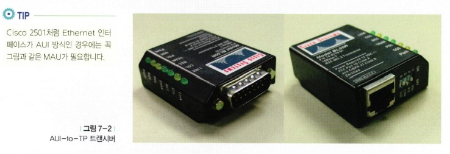

# 라우터만 알면 네트워크 도사?

## 목차

- [라우터를 한마디로 말하자면...](#라우터를-한마디로-말하자면---)
- [라우터는 무슨 일을 할까요?](#라우터는-무슨-일을-할까요-)
- [라우터는 어떻게 생긴 녀석일까요?](#라우터는-어떻게-생긴-녀석일까요-)
- [라우팅 프로토콜과 라우티드 프로토콜](#라우팅-프로토콜과-라우티드-프로토콜)
- 스태틱(Static) 라우팅 프로토콜과 다이내믹(Dynamic) 라우팅 포로토콜
- 라우팅 테이블에 대한 이야기
- AS, 그리고 내부용과 외부용 라우팅 프로토콜
- 라우터 구성의 시작
- 라우터의 중요한 몇 가지 모드
- 라우터 안에는 어떤 것들이 살까요?
- 내가 가진 라우터의 현재 정보는 모두 이곳에!
- 라우터 셋업 모드
- 라우터에 명령을 입력하는 두 번째 방법
- 스태틱(Static) 라우팅을 이용한 라우터 구성
- 스태틱 라우팅만 알면 디폴트 라우트는 식은 죽 먹기
- 라우터의 구성 명령에 대한 버전별 정리
- 디스턴스 벡터(Distance Vector)와 링크 스테이트(Link State)
- 라우터의 패스워드 구성
- 시스코 라우터의 친구 찾기 CDP
- 텔넷(Telnet)을 이용한 장비 접속
- 핑(Ping)과 트레이스(Trace)

## 라우터를 한마디로 말하자면..

여기에서는 라우터에 대해서 분격적으로 알아보도록 하겠습니다.

전에도 라우터에 관한 내용은 몇 번 다루었고, 또 그동안 IP 주소와 서브넷 마스크에 대한 내용을 완벽하게 끝냈으니 이제 본격적인 라우터 공부를 하는 것이 가능하겠죠?

앞에서도 몇 번 말씀드린 적이 있지만, 네트워크를 하는 사람이 가장 자주 만나는 장비는 바로 이 라우터라는 장비입니다. 인터넷을 사용하기 위해서, 서로 다른 네트워크 간 통신하기 위해서, 그리고 브로드캐스트 영역을 나눠주기 위해서 꼭 필요한 이 라우터는 여러분이 네트워크에 입문하게 된다면 가장 자주 만나는 장비 중 하나가 될 것입니다.

우선 이번 시간에는 라우터란 장비에 대해 알아보도록 하겠습니다.

라우터란, 한마디로 '지능을 가진 경로 배정기'라고 말할 수 있습니다.

지능을 가진 경로 배정기란 말은 라우터는 자신이 가야 할 길을 자동으로 찾아서 갈 수 있는 능력을 가진 것을 말합니다. 즉 외부의 어떤 인터넷 사이트를 찾아가는 데이터가 있다면 라우터는 이 데이터를 목적지까지 가장 빠르고 효율적인 길을 스스로 찾아 안내해 주는 능력을 가지고 있습니다.

참 좋은 장비죠?

물론 라우터에 아무것도 해주지 않았는데도 이러한 기능이 수행되는 것은 아닙니다. 라우터에 어떤 세팅을 해줘야 좋은 길을 가장 빨리 찾아갈 수 있습니다.

그럼 그 세팅은 누가 해야 할까요?

바로 여러분입니다.

이런 라우터의 세팅을 제대로 알기 위해서는 라우터에서 쓰이는 명령어 몇 줄을 아는게 중요하지는 않습니다. 계속 공부하면서 배우시겠지만 라우터에서 사용하는 명령어는 라우터의 제조회사에 따라 모두 다르기 때문에 모든 명령어를 안다는 것은 불가능하고 또 그럴 필요도 없습니다.

우리가 알아야 하는 것은 바로 네트워크에 대한 개념입니다. 즉 네트워크의 IP 주소에 대한 이해, 서브넷 마스크에 대한 이해, 라우팅에 대한 이해 등입니다.

라우터가 물론 IP 라우팅만을 하는 것은 아닙니다. 예를 들어 IPX, DECNET, AppleTalk 등 많은 프로토콜의 라우팅이 있지만, 우선 여기에서는 IP 라우팅을 위주로 알아보도록 하겠습니다.

일단 우리가 사용할 라우터는 시스코 라우터로 하겠습니다. 시스코 라우터가 전 세계 인터넷의 80% 이상을 차지하고 있는 세계 제일의 라우터이기도 하지만, 일단 제가 써본 것이고 제일 많은 질문을 받는 것이므로 이 라우터를 위주로 설명하겠습니다.

## 라우터는 무슨 일을 할까요?

우선 라우터가 도대체 어떤 일을 하는지 하나하나 알아보도록 하겠습니다. 만약 어떤 사람이 여러분에게 라우터가 무슨 일을 하는 장비냐고 묻는다면 여러분은 이렇게 말씀하시면 됩니다.

"라우터는 두 가지 일을 하는데, 그 하나가 Path Determination(경로 결정)이고, 또 하나는 Switching(스위칭)입니다."

이 말은 어떻게 보면 상당히 교과서적인 말이면서 어렵게 느껴지는 말이기도 하지만, 결국 여러분이 라우터를 전부 이해한 다음에 이 말을 다시 한 번 읽어본다면 그땐 아마 이해가 될 겁니다.  
라우터는 데이터 패킷이 목적지까지 갈 수 있는 길을 검사하고 어떤 길로 가는 것이 가장 적절한지를 결정합니다. 이것을 '경로 결정'이라고 말합니다. 그리고 그 길이 결정되면 그쪽으로 데이터 패킷을 스위칭해 줍니다. 이것을 '스위칭'이라고 합니다. (여기서 스위칭은 스위치가 해주는 일과는 다릅니다.)

그럼 라우터는 어떻게 가장 좋은 길을 찾아가는 것일까요? 이 라우터란 녀석도 나름대로 계산을 합니다. 어디로 가는 것이 가장 빠른 길일까, 어디로 가는 것이 가장 안전한 길일까 하고 말입니다.  
이렇게 라우터가 가장 좋은 길을 찾는 데는 라우팅 알고리즘, 즉 라우팅 프로토콜이 사용됩니다. 그리고 라우팅 알고리즘은 이를 위해서 라우팅 테이블이란 것을 만들어서 관리합니다.  
즉 라우팅 테이블에는 어디로 가려면 어떻게 가라는 지도 정보가 들어있는 겁니다. (아직 라우팅 알고리즘이 무언지, 그리고 라우팅 테이블은 또 뭔지 아실 필요는 없습니다.) 이러한 라우터의 기능을 위해서 라우터는 PC처럼 CPU(중앙 처리장치)도 가지고 있고, 메모리도 가지고 있고, 또 인터페이스도 가지고 있습니다.

> 알고 갑시다!

여기에서의 결론은!

라우터는 경로 결정과 스위칭을 하는 장비인데, 가장 좋은 경로를 결정하기 위해서 라우팅 알고리즘을 사용하고 이런 라우팅 알고리즘은 라우팅 테이블을 만들어서 관리한다.

## 라우터는 어떻게 생긴 녀석일까요?

이번에는 도대체 라우터가 어떻게 생겼는지 한번 알아보도록 하겠습니다. 라우터는 정말 종류도 많고 가격대도 다양합니다. 싼 것은 몇십 만 원에서부터 비싼 것은 몇억 원짜리도 있으니까 말입니다.

우리가 보통 사용하는 중소 규모의 사무실이나 게임방용 라우터들은 아래 그림에 있는 라우터들이 대부분입니다. 물론 이외에도 대형 회사의 센터 장비라든지, 아니면 ISP(인터넷 서비스 제공업체)들에서 사용하는 라우터는 크기가 훨씬 더 큰 라우터들도 많습니다.

보통 라우터의 앞쪽에는 램프(전원 램프, 상태 표시 램프, 링크 표시 램프 등)들이 있고, 뒤에는 직접 케이블을 연결할 수 있게 되어 있습니다. 따라서 라우터를 구매하실 때는 라우터 그 자체도 중요하지만, 여기에 들어가는 케이블도 꼭 챙기셔야 합니다.  
예를 들어 콘솔 케이블이나 아니면 라우터 DSU(전용선 모뎀이라고 생각하면 됩니다.)를 연결해주는 케이블 같은 것 말입니다.(V.35 케이블 등), 처음에 라우터를 세팅하러 가는 분들은 라우터 그 자체에 너무 신경을 쓰셔서 이런 것을 꼭 빼먹는 경우가 있습니다.

라우터는 살 때 일체형으로 이미 구성이 되어 있는 단독형과, 껍데기만 산 다음에 자기가 필요한 모듈들을 하나하나 꽂아서 쓸 수 있는 모듈형이 있는데 생각하는 대로 나중에 네트워크가 더 확장될 가능성이 있어서 라우터가 필요할 경우에는 모듈형이 적합하고, 구입 후 증설이나 확장 없이 사용할 거라면 단독형이 더 적합합니다. 게임방 같은 곳에서는 단독형이 적당하겠죠?

라우터의 가격은 대부분 성능과 지원되는 인터페이스의 숫자, 그리고 지원하는 기능에 따라 달라집니다. 물론 메이커에 따라서도 가격 차이가 있습니다. 가전제품과 비슷하니까 금방 이해가실겁니다.  
다시 말해서 라우터의 가격은 소프트웨어와 하드웨어로 나누어지는데, 시스코에서는 이렇게 라우터에 들어가는 소프트웨어를 'IOS(Internetwork Operating System)' 라고 합니다.  
이 소프트웨어에는 어떤 라우팅 프로토콜을 지원할 것인지, 어떤 보안 기능을 가질 것인지, 그리고 어떤 편리성을 제공할 것인지 등 다양한 라우터의 운용에 관한 내용이 들어있습니다. 따라서 IOS별로도 가격차가 꽤 많이 납니다.

소프트웨어에는 별로 가격 개념이 없어서인지 장비를 살 때는 아깝지가 않는데 소프트웨어를 살 때는 조금 아깝다는 생각이 드는 분이라면 라우터를 사실 때도 고민하게 될 겁니다. 어떤 경우에는 라우터 자체보다 운영체제, 즉 소프트웨어의 값이 더 비쌀 수도 있으니까 말입니다.

또 하드웨어의 경우에는 여러 가지 모델이 있고 앞에서 말씀드린 것처럼 자신의 현재 네트워크와 앞으로의 미래를 예측해서 가장 적합한 라우터를 찾는 것이 중요합니다. 물론 비싸고 좋은것을 사면 좋겠지만, 어차피 성능이란 것은 자신에게 가장 맞는 게 최고일 뿐만 아니라 무조건 비싸다고 좋은 것은 아니기 때문입니다.

이제 여러분은 라우터를 사진으로라도 보셨으니까 다음에 이런 녀석들을 만나면 아마 한눈에 알아볼 수 있을 겁니다.

그림에서 맨 왼쪽 위에 있는 시스코 2500이라고 하는 녀석이 라우터 중에서는 가장 유명한 녀석입니다. 제일 많이 팔린 녀석이기도 하고 말입니다. 시스코 2500 모델은 주로 작은 회사나 게임방 등 사용자 수가 약 몇백 명 정도인 곳을 연결하는 데 적합합니다. (물론 사용자 수는 사용 프로그램과 사용 환경에 따라 크게 달라질 수 있습니다.) 이런 2500 시리즈 라우터들을 아까 말씀드린 단독형이라고 볼 수 있는 겁니다.  
하지만 2500 라우터는 나온 지 너무 오래된 라우터라서 기능이 많이 떨어집니다. 그래서 몇 년 전 단종되어 더 이상 판매를 하지 않습니다. 따라서 시중에 돌아다니는 2500 시리즈 라우터는 중고 장비라고 보시면 됩니다.

2500 시리즈의 아래에 보이는 라우터가 중소 규모의 지사에 적당하도록 만들어진 ISR 4000 라우터입니다. ISR은 'Intergrated Services Router'의 약자로, 우리말로 하면 라우터에 여러 가지 서비스 기능을 추가했다는 의미인데, 현재 ISR 라우터는 1세대 G1과 2세대 G2를 거쳐 4000 시리즈까지 발전했습니다.  
ISR 4000 또는 ISR 4K 라우터는 요즘 네트워크에서 꼭 필요한 기능인 보안, 음성 지원, 무선뿐만 아니라 서버 기능까지 갖추고 있어 필요에 따라 라우터에 장착된 서버를 이용해서 우리 회사에 필요한 가상의 기능을 만들어 줄 수도 있답니다.  
이렇게 되면 중소 규모의 지사에는 라우터, 스위치, 서버, 보안 방화벽 등을 따로 두지 않고도 ISR 4K 라우터 한 대만 있으면 모든 게 다 해결되겠죠?

그 아래 보이는 라우터는 ASR 라우터 시리즈로, 주로 대형 SP(Service Provider) 네트워크나 대기업용 라우터로 사용되면서도 강력한 보안 기능과 다양한 서비스를 제공해주는 라우터입니다.

오른쪽 위에 보이는 ASR(Aggregation Services Router) 9000 시리즈 라우터는 ASR 1000 시리즈 라우터보다 한 단계 높은 급의 라우터입니다.  
이미 더 이상 판매하지 않지만 아직도 대형 라우터로 기억되고 있는 시스코 7600 시리즈 라우터를 계승한 동급 라우터라고 생각하시면 되는데요, 아무래도 최신형 라우터이다 보니 7600 라우터에 비해서는 훨씬 더 빠르고 강력한 라우팅을 제공할 뿐만 아니라 다양한 기능을 가지고 있어 대형 라우터가 사용되는 기업이나 학교, 관공서 등의 코어 라우터로 적합한 장비랍니다. (보통 코어 라우터, 또는 코어 스위치와 같이 '코어'라고 부르는 장비는 네트워크의 가장 중앙에서 핵심 역할을 하는 장비를 말합니다.)  
이렇게 중요한 역할을 하는 라우터이다 보니 절대 문제가 생겨서는 안 되기 때문에 안정성이 굉장히 중요하구요, 또 그만큼 가격도 비쌉니다.

오른쪽 아래에 있는 NCS 라우터(Network Convergence System Series Router)는 현재 시스코에서 나오고 있는 라우터 중 가장 사양이 높은 라우터 시리즈입니다.  
NCS 시리즈 라우터는 다시 NCS 2000, NCS 4000, NCS 6000 시리즈 라우터로 구분되는데, 이미 짐작하시는 대로 가장 숫자가 큰 NCS 6000 라우터가 제일 큰 라우터입니다.  
이 라우터는 슬롯당 최고 2테라 바이트의 속도를 낼 수 있는 최상급 라우터이고, 사용 환경에 따라 NCS 6000 라우터를 최대 16까지 붙여서 마치 한 대의 라우터처럼 사용할 수도 있게 구성이 가능합니다. 이런 구성을 '멀티샤시 구성'이라고 하는데, 이렇게 해서 최고 256테라의 속도가 가능하게 되는 겁니다.  
물론 라우터는 속도만 중요한 게 아니랍니다. NCS 6000 라우터와 같이 네트워크의 핵심이 되는 코어 라우터의 경우는 무엇보다도 안정성이 중요합니다.  
그렇겠죠? 빠르게 처리하다가 그냥 다운이 되어버린다거나, 장애 하나 생겼다고 모든 처리가 멈춰버린다면 큰 문제가 생기니 말입니다. 따라서 이와 같은 코어 라우터의 경우 다양한 장애 대비책이 만들어져 있고, 심지어 소프트웨어를 업그레이드한다거나 한쪽에서 장애가 발생하는 경우라고 하더라도 라우터는 서비스를 계속 할 수 있도록 디자인되어 있습니다.  
그러고 보니 지금 설명드리는 NCS 6000 라우터는 지난번에는 아예 설명조차 드리지 않았던 라우터였네요. 그때 설명드렸던 CRS-1 라우터는 이제 CRS-3 라우터에 이어 CRS-X(보통 CRS 10이라고 합니다.)까지 진화하고 있습니다.

그런데 이처럼 성능이 높은 라우터들이 계속 나오는 이유는 뭘까요? 그건 바로 우리가 사는 환경, 특히 네트워크 환경이 계속 변화하기 때문일 겁니다. 요즘 많이 들어본 듯한 네트워크의 트렌드를 잠깐 생각해볼까요? 우선 모바일 환경으로의 변화일 겁니다.  
이 책을 처음 썼을 때만 해도 인터넷은 그저 커다란 데스크톱 컴퓨터에 케이블을 연결해서 사용하거나, 좀 앞서가는 사람들이라면 노트북을 들고 다녔던 게 전부일 겁니다. 하지만 이제 인터넷을 쓸 때 가장 많이 사용하는 장비는 다른 아닌 휴대폰이죠?  
휴대폰, 태플릿, 그리고 노트북 등 이런 장비들을 바로 '모바일 장비'라고 한답니다. 또 다른 변화는 트래픽의 변화일 겁니다. 전에는 주로 텍스트 위주로 전송되던 인터넷의 데이터가 어느 순간부터 음성과 비디오 형태로 바뀌기 시작했습니다.  
이제 뉴스도 인터넷에서 생방송으로 시청이 가능하고, 왠만한 야구 중계도 전부 인터넷을 통해 볼 수 있는 시대인 걸 보면 인터넷 속도와 성능이 몇 년 전에 비해 얼마나 발전했는지를 알 수 있습니다.  
이런 비디오 트래픽은 앞으로도 점점 더 많아질 것이라고 전망하고 있으니 당연히 네트워크 장비들도 이를 처리할 수 있어야 하겠죠? 그 밖에도 한 번쯤 들어보셨을지 모르는 IoT(Internet of Things)와 빅데이터 같은 트렌드 역시 더 빠르고 성능 좋은 네트워크 장비가 필요해진 이유가 되었답니다.

가격이요? 가격은 당연히 매우 비쌀 겁니다.

이런 종류의 라우터는 일반 기업이나 학교보다는 '서비스 프로바이더(SP)라고 부르는 KT나 SKT 같은 곳에서 사용하거나, 대형 인터넷 포털에서 사용한답니다.

> 네트워크 플러스

### 라우터를 만지는 사람들이 자주 쓰는 말

라우터를 만지다 보면 자주 듣는 말이 있습니다. 꼭 만지지 않더라도 자주 나오는 몇 가지 말의 의미를 알아두면 이해가 쉬울 겁니다.

일단 '인터페이스'란 말이 있습니다.

인터페이스란, 라우터에 나와있는 접속 가능한 포트라고 생각하면 됩니다. 예를 들어 Cisco 2501이란, 라우터의 인터페이스는 1 Ethernet(이더넷)과 2 Serial(시리얼)이라고 합니다. 여기서 나오는 Ethernet(이더넷)과 Serial(시리얼)은 나중에 다시 설명드리겠습니다. 아무튼 이 라우터는 3개의 접속 포트가 있다는 뜻입니다. 즉 3군데와 붙일 수 있다는 뜻이 됩니다.

그럼 또 'Ethernet'이니, 'Serial'이니 하는 말은 무슨 의미일까요?

Ethernet은 많이 들어보셨죠? Ethernet은 내부 네트워크와 접속할 때 사용하는 인터페이스입니다. 즉 내부의 허브나 스위치 등과의 연결을 위한 포트입니다. (물론 내부 네트워크가 토큰링일 경우에는 토큰링 인터페이스가 필요하지만, 여기서는 일반적인 이더넷을 예로 들었습니다.) 인터페이스 Type은 TP(RJ45)나 AUI(15핀) 방식이 있습니다.

TP는 10Base T 방식을 말하고 AUI는 15핀으로 된 방식입니다. (Cisco 2501은 이더넷 인터페이스 방식이 AUI입니다. 따라서 요즘 많이 쓰는 UTP 케이블과 연결하기 위해서는 AUI-to-TP 트랜시버가 필요합니다. 이를 MAU(Media Access Unit)라고도 합니다.)

시리얼(Serial)은 WAN과의 접속을 위한 거라고 생각하면 됩니다. 즉 DSU(Digital Service Unit 또는 Data Service Unit이라고 합니다.)와의 접속을 위한 것입니다. 물론 FDSU, CSU 등과의 연결도 마찬가지입니다. 즉 외부 네트워크('리모트 구간'이라고도 합니다.)로의 연결을 위해서 사용하는 포트가 바로 Serial 포트입니다. 간혹 'WAN 포트'라고도 합니다.

또한 Serial 포트가 있는 경우에는 Serial 포트와 DSU, FDSU, CSU 등과 연결하기 위한 케이블이 하나 필요한데, 이 케이블이 바로 V.35 케이블입니다. 라우터를 구매하실 때는 이 케이블까지 구매하셔야 합니다. 이 케이블이 없으면 라우터와 DSU와의 연결이 불가능합니다.

참! DSU는 아시죠? 그냥 전용선용 모뎀 정도라고 생각하면 되는데, 속도나 방식에 따라 DSU, FDSU, CSU 등으로 부르고 모양은 다 비슷합니다. 옛날 학교 다닐 때 들고 다니면 납작한 도시락 모양이고, 색깔은 흰색이나 회색, 검은색입니다. 불이 들어오는 구멍이 여러 개 있어서 깜빡깜빡 거립니다. 이 장비의 한쪽은 전용선에 연결하게 되고, 다른 한쪽은 라우터에 연결하는 겁니다.

> 알고 갑시다!

인터페이스는 라우터의 접속 포트를 말한다.  
Ethernet 포트는 내부 네트워크, 즉 랜(LAN)을 위한 접속 포트이며, Serial 포트는 외부 네트워크(인테넛 또는 원격지) 접속을 위한 포트로, DSU/CSU와 연결한다.

요즘 나오는 라우터 중에서는 라우터 안에 이미 DSU/CSU 기능을 내장하고 있는 것들이 있습니다. 이러한 라우터는 따로 DSU/CSU 등을 살 필요가 없을 뿐만 아니라 케이블도 절약됩니다. 하지만 개인적으로 이런 라우터를 선호하진 않습니다.  
우선 DSU나 CSU는 여러 제조사의 제품이 있는데, 물론 표준을 따르고 있지만 간혹 제품끼리의 호환에 문제가 있어서 둘 사이의 접속이 안 되는 경우가 있습니다. DSU/CSU를 내장하고 있지 않은 라우터의 경우는 DSU/CSU만 교체해주면 되지만, 내장형 라우터의 경우는 방법이 없기 때문입니다. 따라서 현재 우리나라에서는 이처럼 DSU/CSU 내장형 라우터는 그리 많이 사용하고 있지 않은 추세입니다. 이런 것도 알아두면 도움이 되겠네요.

\

위 그림에서는 시스코 라우터 2501의 뒷면을 보여주고 있습니다. 여기에서 우리는 이더넷 인터페이스와 시리얼 인터페이스가 있다는 것을 알 수 있습니다. 만약 전용선으로 인터넷을 쓴다고 가정하면 시리얼 인터페이스에 V.35 케이블을 연결한 후 이 케이블을 다시 DSU/CSU로 연결하고, 전화국에서 들어온 전용선도 DSU/CSU에 연결하게 됩니다. 라우터 위에 보이는 것이 바로 DSU입니다.

## 라우팅 프로토콜과 라우티드 프로토콜

우리가 라우터를 하다 보면 여러 가지 비슷한 말을 많이 만나게 되고, 이것이 혼동되기 시작하면서 라우터가 어렵다는 이야기를 많이 하게 되는데, 그중에 하나가 바로 이 '라우팅 프로토콜'과 '라우티드 프로토콜'이 아닐까 합니다.

지금까지 우리가 배웠던 TCP/IP와 IPX, AppleTalk 등 우리가 아는 모든 프로토콜은 전부 라우티드 프로토콜입니다. 라우티드 프로토콜(Routed Protocol)이란, 말 그대로 라우팅을 당하는, 즉 라우터가 라우팅을 해주는 고객을 뜻합니다.  
라우터라는 자동차를 타고 여행을 떠나는 승객이라고 생각하면 됩니다. 그러니까 TCP/IP나 IPX는 고객으로서 라우터라는 자동차를 타고 다른 네트워크로 여행을 떠나는 겁니다.

그렇다면 라우팅 프로토콜(Routing Protocol)은 그 자동차를 안전하고 빠르게 운전하는 운전기사라고 볼 수 있습니다. 즉 라우터에 살면서 라우티드 프로토콜들에게 목적지까지 가장 좋은 길을 갈 수 있게 해주는 역할을 합니다.

따라서 라우터 입장에서는 어떤 운전기사(라우팅 프로토콜)를 채용하는가에 따라서 라우터의 성능(즉 얼마나 빨리, 그리고 안전하게 가는가)이 결정된다고 봐도 됩니다. 물론 자동차(라우터)가 가지고 있는 기본적인 성능도 중요합니다.

이런 라우팅 프로토콜에는 RIP(Routing Information Protocol), IGRP(Interior Gateway Routing Protocol), OSPF(Open Shortest Path First), EIGRP(Enhanced Interior Gateway Routing Protocol) 등이 있습니다. 물론 이외에도 많지만 우선은 이 정도만 알고 계시면 됩니다.

이런 라우팅 프로토콜을 다른 말로는 '라우팅 알고리즘'이라고도 합니다. 라우팅 알고리즘은 자신의 라우팅 테이블을 가지고 있으면서 자기가 찾아갈 경로를 이곳에 기억해둡니다. 어디가 가장 빠르고 안전한 길인가 하고 말입니다. 즉 라우팅 테이블은 운전기사(라우팅 프로토콜)가 있으면서 어떤 길이 가장 좋은 길인지 메모해 두는 이정표 같은 것이라고 생각하면 됩니다.  
따라서 라우팅 테이블은 일종의 메모리라고 생각하면 되고, 또 어떤 알고리즘을 사용하는가에 따라서 라우팅 테이블의 내용은 달라지게 됩니다. 그렇겠죠? 운전기사별로 메모하는 버릇이 다 다를 테니까 말입니다. 그럼 라우팅 테이블에는 어떤 내용이 들어갈까요?  
주로 목적지, 그리고 그 목적지까지의 거리, 그리고 어떻게 가야 하는가 등의 내용입니다. 또 라우팅 테이블은 시간이 지나면서 계속 업데이트됩니다. 즉 끊임없이 변한다는 말입니다. 새로운 길이 생길 수도 있고 새로운 목적지가 추가될 수도 있기 때문입니다. 끊임없이 변환하는 것이 바로 라우팅 테이블입니다.  
그렇다면 라우팅 알고리즘은 목적지까지의 가장 빠르고 안전한 길을 어떤 조건을 가지고 찾아낼까요? 그것은 사용하는 라우팅 프로토콜(라우팅 알고리즘)에 따라 전부 다릅니다.

다음에는 이런 라우팅 프로토콜에 대해서 하나하나 공부해 보도록 하겠습니다.

> 알고 갑시다!

라우티드는 자동차에 타는 승객이고, 이 자동차를 운전하는 것이 바로 라우팅 프로토콜이다. 그리고 자동차는 라우터이다. 이 자동차의 운전기사는 자기가 가는 목적지에 대한 이정표를 가지고 있는데, 이것을 '라우팅 테이블'이라고 하며 이 라우팅 테이블은 운전자마다 모두 다르다.

## 스태틱(Static) 라우팅 프로토콜과 다이내믹(Dynamic) 라우팅 프로토콜

라우팅 프로토콜을 구분할 때 스태틱과 다이내믹 라우팅 프로토콜로 구분합니다.

스태틱은 우리말로 하면 '정지된' 또는 '정적인'이라는 뜻이니까 말 그대로 한 번 정해놓으면 죽으나 사나 정해진 그대로 수행하는 프로토콜을 말하고, 다이내믹은 '동적인'이란 말 뜻처럼 상황에 따라서 그때그때 변화가 가능한 프로토콜을 말합니다.

좀 더 정확히 살펴보자면 스태틱 라우팅 프로토콜의 경우는 라우터에 사람이 일일이 경로를 입력해주는 것입니다. 가장 빠르고 좋은 길을 사람이 찾아서 말입니다. 그럼 라우터는 사람이 입력해 준대로 데이터를 보내기만 하면 됩니다.

사람이 모든 것을 생각하고 넣어주니까 그보다 더 좋은 길이 없겠죠? (물론 똑똑한 사람이 넣어준 길이라면 말입니다.) 거기다가 라우터는 아무 생각 없이 데이터를 넘기기만 하면 되니까 라우터 입장에서 봤을 때는 생각할 게 별로 없습니다. 시키는 대로 하기 때문에 따로 이정표도 많이 가지고 있을 필요가 없고 말입니다.  
즉 라우터 자체에는 부담이 들지 않아 라우팅하는 속도도 빨라지고 라우터의 성능이 좋아지게 됩니다. 물론 메모리도 적게 듭니다. 그것뿐만이 아닙니다. 스태틱 라우팅의 경우에는 사람이 경로를 알려주는 방식이기 때문에 뒤에 배울 다이내믹 라우팅 방식처럼 라우터들끼리 라우팅 테이블을 교환할 필요가 없습니다.  
따라서 네트워크의 대역폭을 그만큼 절약할 수 있습니다. 게다가 요즘 중요시되고 있는 보안에도 강합니다. 왜냐하면 외부에 자신의 정보를 알리기 않기 때문이죠. 그러고 보면 스태틱 라우팅은 정말 장점이 많습니다.

그러나 단점도 있습니다.

일단 귀찮다는 겁니다. 사람이 라우터에 일일이 목적지별로 경로를 넣어줘야 하니까 말입니다. 또 하나는 입력해준 경로에 문제가 생기면 큰일이 발생한다는 겁니다. 예를 들어 서울에서 부산을 가는 경로를 사람이 생각해서 라우터에 넣어줄 때 비행기가 가장 빠르다고 생각해서 비행기로 간다고 넣어줬다고 가정해 보겠습니다.

그런데 어느 날 날씨가 나빠져서 비행기가 뜨지 않는 사태가 발생했다면 라우터는 어떻게 할까요?

스태틱 라우팅 프로토콜의 경우는 그래도 데이터를 계속 서울 공항으로 보내게 됩니다. 사람이 라우터에 "부산 갈 때는 비행기이다"라고 입력해 놓았기 때문에 아무리 비행기가 뜨지 않아도 모든 데이터를 비행장에 보내게 되고, 결국 부산에는 못 가게 되는 겁니다.  
즉 스태틱 라우팅 프로토콜은 사람이 입력해준 경로에 문제가 발생하면 사람이 다시 그 경로를 고쳐줄 때까지는 계속 문제가 있는 쪽으로 데이터를 보내려고 합니다. 어차피 수동이니까 당연한 결과입니다.

하지만 다이내믹 라우팅 프로토콜은 평소에는 비행기로, 그리고 비행기에 문제가 있으면 기차로, 또 기차에 문제가 있으면 자동차로 이렇게 자동으로 판단하고 그때그때 가장 좋은 길을 찾아내는 방식입니다.

여기까지 보면 다이내믹이 좋아 보이죠?

하지만 다이내믹 프로토콜의 경우는 라우터에 부담을 줍니다. 왜냐하면 라우터가 할 일이 많아지기 때문입니다. 라우팅 프로토콜을 이용해서 어떤 길이 가장 빠른 길인지 계산을 해야 하고, 또 시간이 지날 때마다 바뀐 정보는 없는지 계속 확인해 봐야 하며, 이정표도 계속 업데이트 해야 하고 할 일이 한두 가지가 아닙니다.  
우리가 일반적으로 이야기하는 RIP, IGRP, OSPF, EIGRP 등이 이런 다이내믹 라우팅 프로토콜에 속합니다.

일반적인 라우팅 환경에서는 여러 가지 상황에 자동으로 대응할 수 있는 장점이 있고, 또 자동으로 가장 좋은 길을 찾아가는 다이내믹 라우팅 프로토콜을 주로 사용합니다.  
하지만 어떨 때는 라우팅 성능을 높이기 위해 스태틱을 사용하기도 합니다. 또 라우터가 선택할 수 있는 경로가 오직 하나뿐일 때는 다이내믹 프로토콜을 쓸 필요가 없을 수도 있습니다. 어차피 그 길이 끊어지면 다른 길도 없이 때문에 그때는 스태틱을 쓰는 게 좋습니다.

> 알고 갑시다!

라우팅 프로토콜에는 '스태틱 라우팅 프로토콜'과 '다이내믹 라우팅 프로토콜'이 있다. 스태틱은 라우터가 정해진 길만을 가기 때문에 일이 없는 대신 사람이 일일이 구성을 해줘야 하고, 또 정해진 길에 문제가 생겨도 사람이 그 길을 다시 고쳐줄 때까지는 계속 그 길로 가려고 한다.  
다이내믹은 라우터가 알아서 길을 찾는 장점이 있는 대신 라우터가 할 일이 많아진다.

## 라우팅 테이블에 대한 이야기

라우팅 테이블에 대해 잘 이해가 안 가시는 분들이 있을 것 같아서 그림으로 다시 한번 설명을 드리겠습니다. 아래 그림에서 중앙에 Router의 라우팅 테이블이 있습니다.  
이 Router는 목적지와 목적지를 가려면 어느 인터페이스로 가야 하는지를 자신의 라우팅 테이블에 가지고 있습니다. 여기서 E0는 이더넷 인터페이스 0번을 나타내고, S0는 시리얼 인터페이스 0번을 나타냅니다. 또 T0는 토큰링 인터페이스 0번을 나타냅니다. (인터페이스 번호는 0번부터 시작합니다.)

따라서 라우터가 어떤 목적지를 찾아가려고 하면 먼저 라우팅 테이블을 보게 되는 겁니다.

예를 들어 라우터가 150.2.0.0 네트워크에 있는 어떤 PC를 찾아가는 패킷을 받아들이게 되면 라우터는자신의 라우팅 테이블에 150.2.0.0으로 가는 길이 나와 있는지를 먼저 확인합니다.  
그랬더니 자기 라우팅 테이블에 150.2.0.0 네트워크로 가려면 T0로 가라는 내용이 나와 있으니까 패킷을 토큰링쪽 인터페이스로 넘겨주게 되는 겁니다. 물론 진짜 라우팅 테이블은 이것과는 조금 다릅니다. 또 전에도 말씀드렸듯이 라우팅 테이블은 라우터가 사용하는 라우팅 프로토콜에 따라서도 달라집니다.

제가 여기서 보여드리고자 하는 것은 라우팅 테이블에 관한 개념입니다.

즉 라우팅 테이블이란, 라우터가 어떤 경로를 찾을 때 사용하는 것이고, 이것은 사용하는 라우터의 프로토콜에 따라 달라지며, 또 라우터는 항상 최적의 경로를 찾아 이것을 라우팅 테이블에 유지하고 있다는 겁니다.

자, 그럼 라우팅 테이블이 정말로는 어떻게 생겼는지 한번 알아볼까요?

위 그림에서서처럼 라우터는 자기의 라우팅 테이블에다가 어떤 지도 정보를 가져다 놓습니다. 그건 라우터가 어떤 일을 하는가를 이해한다면 아마 이해가 될 겁니다. 이제 라우터가 어떤 일을 하는지 아시겠죠? 가장 빠르고 안전한 길을 찾아주고, 또 그 길이 끊어지면 다른 길을 찾아주는 역할을 합니다. 그럼 라우터에게 가장 중요한 것은 무엇일까요?

그것은 바로 지도입니다.

그렇다고 우리가 보통 쓰는 그런 지도는 아니고 라우터가 여러 가지 정보를 종합해서 얻어낸 네트워크에 대한 지도입니다. 즉 그림에서 보는 것처럼 어떤 목적지에 가기 위해서는 어떤 경로를 이용해서 가야 된다라고 써놓은 정보입니다.

이것을 우리는 '라우팅 테이블'이라고 합니다.

그러니까 라우터는 전원을 켜는 그 순간부터(물론 라우팅 프로토콜에 대한 세팅은 이미 되어 있다고 가정했을 때입니다.) 라우팅 테이블을 만들기 시작해서 어떤 패킷이 길 안내를 요청하면 라우팅 테이블을 보고 길을 안내합니다.

자, 그렇다면 전원이 꺼지면 어떻게 될까요? 라우터가 이런 라우팅 테이블을 저장할까요? 답은 '아니오'입니다. 꺼지면 모두 지워지게 됩니다.

하지만 걱정할 필요는 없습니다. 전원이 켜지면 다시 만들 수 있으니까요. 얼마만에? 몇 초가 될 수도 있고 또 몇 분이 될 수도 있습니다. 그것은 네트워크의 크기와 사용하는 프로토콜에 따라 많이 달라집니다. 아무튼 라우팅 테이블은 라우터가 가장 중요하게 사용하는 길 안내 정보가 들어있다고 생각하면 됩니다.

시스코 라우터에서 라우팅 테이블을 보기 위해서는 show ip route라는 명령을 사용합니다.

자, 그럼 한번 해볼까요?

이렇게 나오게됩니다.

여기 나오는 라우팅 테이블은 여러분이 시스코 라우터를 계속 만지게 된다면 아주 자주 만나게 되므로 하나하나의 의미를 꼭 아셔야 하는 것들입니다. 하지만 아직은 모르셔도 됩니다. 우선 여기서는 간단하게 구경만 하고 넘어가면 됩니다.

라우팅 테이블에서 각각의 의미는 맨 앞에 있는 영문자가 어떤 프로토콜을 이용해서 이 길을 알아냈는가를 보여줍니다. 즉 I는 IGRP를, R은 RIP를 나타내고, O는 OSPF를 나타냅니다. 또 C는 connected, 즉 직접 접속된 네트워크를 말합니다.

라우터가 그 네트워크에 직접 붙어있다는 뜻입니다. 그다음에 있는 주소는 목적지를 나타냅니다. (정확히 말해서 목적지의 네트워크 주소입니다.) 그리고 그다음에 나오는 것이 바로 어디를 통해서 가야 목적지에 도착할 수 있는가를 알려주는 경로입니다.

여러분이 라우터를 자주 접하게 된다면 꼭 알아야 할 명령입니다. 조금 복잡해도 라우팅 테이블을 자주 접하시는게 좋습니다.

> 알고 갑시다!

라우터는 라우팅 테이블이라는 경로에 대한 지도 정보를 유지하고 있는데, 이건 RAM에 올라가기 때문에 파워가 꺼지면 전부 지워져 버린다. 그리고 다시 파워를 켜면 수초 또는 수분 만에 다시 만들어진다. 이 라우팅 테이블을 시스코 라우터에서 보는 명령은 show ip route이다. (sh ip route는 TCP/IP에서 찾은 경로만 보여준다. 예를 들어 IPX에서의 경로 정보를 보고자 하는 경우에는 sh ipx.route라고 해주면 된다.)

## AS, 그리고 내부용과 외부용 라우팅 프로토콜

여기에서는 먼저 AS(Autonomous System)라는 말에 대해서 알아보도록 하겠습니다. AS란 말은 네트워크를 하는 사람이라면 자주 듣게 되는 말입니다.

AS는 'Autonomous System'의 약자로, 하나의 네트워크 관리자에 의해서 관리되는 라우터들의 집단이라고 생각하면 됩니다. 또 어떤 의미로는 하나의 관리 규정 아래서 운용되는 라우터의 집단 또는 하나의 관리 전략으로 구성된 라우터 집단 등으로, 쉽게 말하면 한 회사나 기업, 또는 단체의 라우터 집단이라고 생각하면 됩니다.

예를 들어 어떤 기업이 네트워크를 구축하게 되면 그 네트워크 안에는 여러 대의 라우터가 올 수 있습니다. 서울에 몇 대, 지방에 몇 대 이렇게 이 기업에 소속된 모든 라우터들은 그 기업의 네트워크 관리자에 의해 관리를 받게 되는데, 이런 그룹이 바로 AS가 됩니다. 또 KT, 데이콤과 같은 ISP 업체들도 자신들이 가진 라우터가 한두 대가 아닐 겁니다. 이렇게 ISP들이 보유하고 있는 라우터 그룹이 하나의 AS가 됩니다.

라우터들을 다시 AS라는 그룹으로 묶어주는 이유는 라우터가 가지는 정보를 효율적으로 관리하고 인터넷 서비스를 좀 더 간편하게 제공하기 위해서입니다. 즉 AS 안에 있는 라우터들은 자신의 AS에 속해 있는 라우터에 대한(물론 자신들 내부의 네트워크 정보겠죠?) 정보만 알고 있으면 됩니다.  
그러다가 외부, 즉 AS 밖으로 나갈 때는 그 AS에 있는 문지기 라우터(ASBR: Autonomous System Boundary Router라고 합니다.)에게 정보를 물어봐서 밖으로(인터넷) 나가는 겁니다.

문지기 라우터는 자신의 AS와 인접해 있는 다른 AS에 대한 정보를 가지고 있으면서 자기 AS에서 밖으로 나가는 라우터나 외부 AS에서 자기 AS쪽으로 들어오는 라우터에게 정보를 제공하는 역할을 합니다.

이런 시스템 때문에 라우터들은 인터넷 접속하더라도 전 세계의 모든 네트워크에 대한 정보를 다 가지고 있을 필요가 없고, 단지 자신이 속한 AS에 대한 정보만 가지면 됩니다.

이때 라우터 AS 내부에서 사용하는 라우팅 프로토콜을 Interior Routing Protocol 또는 Interior Gateway Protocol(IGP)이라고 하고 AS 간에, 즉 AS 외부에서 서로 라우팅 정보를 주고받기 위해 라우터가 사용하는 프로토콜을 Exterior Routing Protocol 또는 Exterior Gateway Protocol(EGP)이라고 합니다.

Interior Routing Protocol의 예로는 우리가 잘 아는 RIP, IGRP, EIGRP, OSPF 등이 있고, Exterior Routing Protocol의 예로는 EGP, BGP 등이 있습니다.

따라서 본사와 지사 간에 라우터를 설치해야 할 경우에는 RIP나 OSPF 등 IGP를 사용하고, 본사의 라우터가 인터넷 서비스 업체와 연결을 해서 인터넷을 사용해야겠다고 생각할 경우에는 BGP와 같은 EGP를 사용합니다. (뒤에 가서 다시 설명드리겠지만 Exterior Gateway Protocol의 경우 요즘은 EGP보다는 거의 BGP를 사용하는 추세입니다. BGP가 여러 가지 장점을 가지고 있기 때문입니다.)

그림에서 구름으로 보이는 것이 하나의 AS입니다. 즉 AS 안에서는 Interior Routing Protocol, 즉 내부용 라우팅 프로토콜인 RIP이나 IGRP 등이 라우터에서 사용되고, AS와 AS간의 통신에서는 라우터에서 BGP 등과 같은 Exterior Routing Protocol, 즉 외부용 라우팅 프로토콜이 사용됩니다.

## 라우터 구성의 시작

자, 이번 시간에는 라우터를 실제 인스톨(설치)할 때는 어떤 방법이 있는지를 알아보도록 하겠습니다.

라우터에 명령어를 입력하는 방법은 몇 가지나 될까요?

CCNA 시험에도 많이 나오는 문제이기 때문에 특히 질문이 많은 부분입니다. 여기에서 완전히 이해를 하고 넘어가면 좋을 것 같습니다. 아래 그림에 있는 것처럼 대략 5가지 정도가 됩니다. 물론 라우터에 따라서 차이는 있겠죠? 여기에서 예를 들어 설명하는 것은 시스코 라우터입니다.

그 첫 번째가 바로 콘솔(console) 케이블이란 것을 이용하는 겁니다. 라우터를 구매하게 되면 대부분은 그 안에 콘솔 케이블이란 것이 같이 들어있는데, 이 케이블을 라우터의 콘솔 포트(라우터의 뒷면에 보면 Console이라고 쓰여있는 포트가 있습니다.)에 연결하고 나머지 한쪽은 컴퓨터의 USB 포트에 연결하게 되면 콘솔 연결이 되는 겁니다.  
가끔 콘솔 케이블 중에는 양쪽 다 UTP 포트 모양으로 되어 있는 케이블도 있는데, 이 경우에는 이 UTP 포트를 다시 USB 포트로 변경하는 컨버터를 따로 준비하셔야 됩니다. UTP 형식이라고 바로 LAN 포트에 연결하면 안 된답니다.

일단 콘솔 케이블 연결이 끝나면 이제 콘솔 프로그램을 다운로드해야 합니다. 윈도우 XP 버전까지만 해도 윈도우에서 기본적으로 하이퍼터미널이라는 콘솔 프로그램을 제공했는데, 지금 사용하는 윈도우 7이나 윈도우 10의 경우는 따로 하이퍼터미널을 제공하지 않기 때문에 인터넷에서 콘솔용 프로그램을 다운로드해야 한답니다.

콘솔용 프로그램 중에서 가장 많이 사용하는 프로그램은 'PuTTY'입니다.

그림에서 보이는 것처럼 이 프로그램은 무료 다운로드가 가능한 프로그램입니다. 설치가 끝나면 바로 PuTTY를 이용해서 콘솔 작업이 가능한데, 그전에 먼저 확인해줄 게 한 가지 있습니다. 앞에서 콘솔 케이블을 여러분의 컴퓨터에 연결한 거 기억나시죠? USB 포트에 연결했잖아요? 이 콘솔 케이블이 제대로 연결되었는지, 그리고 어떤 포트에 연결되었는지를 알아보기 위해 컴퓨터에서 장치 관리자를 열어봐야 합니다.  
장치 관리자는 바탕화면에서 [내 컴퓨터]를 클릭하시고 마우스 오른쪽 버튼을 누르게 되면 [속성]이라는 필드가 보이고, 이걸 선택하면 내 컴퓨터에 대한 여러 가지 정보를 볼 수 있습니다. 이때 맨 왼쪽 위에 [장치 관리자]가 있는데, 이것을 클릭했을 때의 화면이 아래 그림에 보입니다.

[장치 관리자]를 자세히 보시면 아래쪽에 [포트 (COM & LPT)]라는 항목이 보이실 겁니다. 여기에서 [Cisco Serial(COM6)] 이라고 보이실 겁니다. 제 컴퓨터에서는 콘솔 케이블이 COM6에 연결되어 있다는 걸 알 수 있습니다.  
이와 같은 COM 포트 번호는 컴퓨터마다 다르기 때문에 여러분의 컴퓨터에서는 다르게 보일 수 있습니다. 따라서 콘솔 케이블 연결 후에는 꼭 장치 관리자의 열과 포트 번호를 확인하시기 바랍니다.

이제 콘솔 케이블 연결이 완료되었으니 콘솔 작업을 위해 앞에서 다운로드해서 설치했던 PuTTY를 실행해봐야겠죠? 아래 그림은 PuTTY를 실행했을 때의 첫 화면입니다.

좀 복잡하게 영어로 막 써있지만, 별로 중요한 내용은 아니고, 맨 위쪽에 있는 'Serial line'이란 곳에 앞에서 장치 관리자를 열어가며 확인했던 COM 포트 번호를 여기에 써주시면 됩니다.  
저의 경우엔 앞에 그림에서 설명드린 것처럼 포트 번호가 COM6였으니까 여기에 COM6를 입력했습니다. 그리고 옆에 있는 Speed는 시리얼에서의 초당 비트수인데, 원래 잡혀진 디폴트 값인 9,600bps를 그대로 사용하시면 됩니다. 그리고 그 아래쪽 Connection type은 Serial로 선택해 주시면 됩니다.  
앞에서도 잠깐 이야기드렸지만 우리가 COM 포트라고 이야기하는 이 포트가 다른 말로는 Serial 포트이기 때문입니다.

그리고 아래쪽 박스에 Saved Sessions에는 지금 만든 이 콘솔 구성으로 어떤 이름으로 저장할 건지를 정해서 써주면 되는데, 저는 'Hoony Lab'이라는 이름을 만들어줬습니다. 여러분은 아무거나 예쁜 이름으로 만들어주시면 된답니다.  
이렇게 한번 Session 이름을 만들어 놓게 되면 다음부터는 PuTTY를 쓸 때마다 구성을 넣어줄 필요 없이 그냥 저장된 세션 이름만 선택하면 되겠죠?

자, 그럼 지금까지의 콘솔 연결을 정리해볼까요?

이렇게 모든 구성을 마쳤으면 아래 보이는 [Open] 버튼을 눌러 라우터에 들어갈 수 있습니다.

이게 바로 콘솔을 이용한 연결입니다. 콘솔 연결을 통한 라우터 구성은 가장 일반적인 구성입니다. 여러분도 나중에 라우터를 구성하게 될 기회가 있을 텐데 그때 바로 콘솔에 연결하는 방식을 사용할 것입니다.

콘솔을 이용한 방식은 설명드린 것처럼 라우터를 맨 처음 구성할 때는 가장 일반적이고 편리한 방법이자만, 라우터에 직접 PC를 들고가서 콘솔 케이블을 연결해주어야 하는 불편함이 있습니다.  
또한 콘솔 케이블도 필요하기 때문에 맨 처음 구성하는 경우나 고장이 났을 때만 사용하고, 일단 한 번 라우터가 구성된 이후에는 잘 사용하지 않는 방법입니다.

즉 일단 라우터의 모든 세팅이 끝난 후 나중에 라우터의 구성 일부를 변경하는 경우에는 콘솔보다는 텔넷을 이용해서 구성을 변경하기 때문입니다.

콘소 ㄹ방법의 장점은 가장 강력한 세팅 방법이라는 겁니다. 예를 들어 나중에 나오는 텔넷 방식은 라우터와 통신이 끊어지게 되면 텔넷도 같이 끊어지기 때문에 네트워크 고장 발생시 텔넷으로 라우터에 접근이 불가능한데, 이때도 콘솔은 라우터에 접근이 가능합니다.

또 AUX(Auxiliary) 포트라는 것이 있는데, 이 포트에는 모뎀을 연결할 수 있게 되어 있습니다.

여기에 모뎀을 연결해 놓으면 원격지에서도 모뎀을 통해 라우터에 명령어를 입력할 수 있습니다. 이렇게 모뎀을 이용한 라우터 구성은 기존의 네트워크에 문제가 발생해서 텔넷으로는 라우터에 접근이 불가능합니다. 또한 콘솔을 연결해서 구성을 하자니 너무 먼 곳, 즉 라우터가 지방 같은 곳에 있어 불가능한 경우에 사용하는 방법입니다.

물론 라우터에는 모뎀에 대한 세팅이 모두 되어 있어야 합니다. 이런 AUX 포트의 사용은 순전히 문제가 발생했을 때를 대비한 것이기 때문에 일반적이지는 않습니다.

그다음은 텔넷(Telnet)을 이용한 라우터 구성입니다. 텔넷 역시 PuTTY를 이용해서 사용이 가능합니다.

아래 그림을 보면 콘솔을 만들 때와 같은 화면이라는 것을 아실 겁니다. 다만 하나 다른 것은 접속 방법(Connection Type)이 Telnet이라는 것입니다.

대부분 라우터를 관리할 때 가장 많이 사용하는 방법이 바로 이 텔넷을 이용한 방법입니다. 이 방법은 라우터의 IP 주소만 알고 있고 네트워크에 접속만 되어 있다면 어디에서도 구성이 가능하다는 장점이 있습니다. 반면 라우터의 맨 처음 구성 시에는 어차피 IP 주소조차 없기 때문에 텔넷 사용이 불가능하다는 단점과 네트워크 연결이 끊어질 경우 텔넷 접속이 불가능하다는 단점을 가지고 있습니다.

텔넷을 사용하는 한 가지 예를 들어보겠습니다.

만약 제가 지방의 어떤 라우터를 설치했다고 가정해 보겠습니다. 물론 맨 처음 지방에 그 라우터를 설치하기 위해 출장을 갔을 겁니다. 라우터를 전산실에 설치하고 콘솔을 이용해서 라우터의 IP 주소를 세팅했거나 기타 라우터의 구성을 세팅했을 겁니다.  
모든 것이 이상이 없다는 것을 확인하고 저는 다시 서울로 올라왔습니다. 그런데 그 라우터의 구성을 변경할 일이 생겼다고 가정해보겠습니다. 뭐 프로토콜이나 서브넷 등 말입니다. 그렇다면 또다시 콘솔 케이블을 가지고 직접 지방으로 가야 할까요?

바로 이럴 때 사용하는 것이 텔넷입니다. 물론 네트워크로 연결되어 있다는 가정이 있어야겠죠? 그런 텔넷을 바로 'Virtual Terminal(가상 터미널)'이라고 합니다.  
그럼 이제는 아시겠죠? 만약 지금 설명한 상황과 똑같은 상황에서 네트워크에 문제가 생겨 텔넷조차도 불가능한 경우에는 무엇을 사용할까요? 그게 바로 AUX 포트를 통한 접속입니다. 앞에서 배워서 아마 알고 계실 겁니다.

네트워크 관리 시스템(NMS)에 의한 라우터의 구성 방법은 라우터 구성 방법 중에서는 가장 쉬운 방법일 겁니다. 물론 NMS 구성은 좀 어렵지만 일단 구성된 NMS에서 라우터를 세팅한다고 가정한다면, 지금까지 방법과는 달리 그래픽 방식이기 때문에 훨씬 쉽고 또 여러 가지 다른 정보도 많이 알 수 있게 됩니다.

마지막으로 TFTP 서버로 라우터를 구성하는 방법입니다. 이 방법은 앞에서 설명드린 4가지 방법과는 약간의 차이가 있습니다. 즉 앞의 4가지 방법은 직접 명령을 라우터에 세팅할 수 있는데, TFTP 서버에 의한 방식은 서버에서 직접 라우터로 세팅을 해주는 방식은 아닙니다.

TFTP 서버에 의한 라우터 구성은 이미 다른 곳에서 만들어 놓은 라우터의 구성 파일을 TFTP 서버에 저장해 두었다가 라우터로 다운로드해 주는 방식을 말합니다.  
이때 다운로드에 사용되는 프로토콜이 바로 TFTP(Trivial File Transfer Protocol)인데, 우리말로 하면 '단순형 파일 전송 프로토콜' 정도 됩니다.

만약 여러분이 라우터 IP 주소를 아신다면 윈도우의 MS-DOS 모드로 이동해 telnet x.x.x.x(라우터의 IP 주소)를 입력해 보세요.

그럼 라우터로 텔넷을 하게 됩니다. 물론 아까 배운 대로 하이퍼터미널로도 텔넷 구성은 가능하지만 간단하게 해보려면 MS-DOS 모드에서도 가능합니다. 라우터의 IP 주소를 모른다구요? 그것은 도스 모드에서 ipconfig(windows xp)을 했을 때 게이트웨이 번호로 나타나는 주소가 여러분의 네트워크에 붙어있는 라우터의 IP 주소입니다.

가장 많이 쓰이는 방법이니 한 번씩 연습해 보는 게 좋겠죠? 물론 지금은 그냥 연습만 해보기 바랍니다. 또 직접 라우터에 가서 콘솔을 연결할 수 있는 분은 콘솔 케이블과 노트북을 들고 라우터로 가서 라우터의 콘솔 포트와 노트북의 시리얼 포트에 콘솔 케이블을 연결하고 한 번 라우터에 접속해 보세요. 아마 라우터와 친해지게 될 겁니다.

위 그림은 콘솔을 통한 라우터에 접속한 것을 보여줍니다. 라우터에 뭐라고 글씨가 많이 나와있는데 지금은 신경쓰지 않으셔도 됩니다. 어차피 나중에 이 뜻을 다 알게 될 거니까요.

아무튼 지금은 라우터에 콘솔을 연결하면 이렇게 보인다는 것만 알면 됩니다. 물론 콘솔을 통해서 접속했는데 아무것도 안 보이거나 이상한 글자가 깨져서 나오는 경우에는 콘솔의 구성에 이상이 있거나 케이블에 이상이 있다고 생각하면 맞을 겁니다.  
따라서 위에서 설명드린 구성을 다시 한 번 확인해보고 꼭 라우터 구입 시에 같이 딸려오는 콘솔 케이블을 사용하시기 바랍니다.  
참고로 이 라우터는 아무것도 세팅되어 있지 않은 새 라우터이고 기종은 시스코 2509입니다.

> 알고 갑시다!

라우터를 구성하는 방법은 5가지가 있다. 첫 번째로 맨 처음 라우터를 구성할 때 쓰는 콘솔 케이블을 통한 구성, 두 번째는 원격지에서 모뎀을 이용한 구성, 세 번째는 일단 IP 주소가 세팅된 다음에 네트워크를 통해서 접속하는 텔넷을 이용한 구성, 네 번째는 네트워크 관리 시스템이 있는 곳에서 사용하는 NMS를 이용한 구성, 그리고 맨 마지막에는 미리 구성된 파일을 저장했다가 나중에 라우터로 다운로드하는 TFTP 서버를 이용한 구성이 있다.

## 라우터의 중요한 몇 가지 모드

