#  라우팅 프로토콜과의 한판

## 목차

- [RIP라는 라우팅 프로토콜에 대한 이야기](#rip라는-라우팅-프로토콜에-대한-이야기)
- [RIP와 함께 춤을?](#rip와-함께-춤을-)
- [Distance-Vector 라우팅 알고리즘에서의 문제점과 해결책](#distance-vector-라우팅-알고리즘에서의-문제점과-해결책)
- [IGRP 라우팅 프로토콜](#igrp-라우팅-프로토콜)
- [OSPF 라우팅 프로토콜](#ospf-라우팅-프로토콜)

## RIP라는 라우팅 프로토콜에 대한 이야기

여기에서는 다이내믹 라우팅 프로토콜에 대해서 알아보겠습니다. 전에도 한번 설명을 드렸지만 다이내믹 라우팅 프로토콜은 운영자가 일일이 경로를 지정하지 않아도 라우터가 똑똑하게 알아서 길을 찾아가는 프로토콜입니다.

우선 이렇게 똑똑한 다이내믹 프로토콜 중에서 가장 구성이 쉬우면서도 가장 단순한 라우팅 프로토콜인 RIP에 대해서 알아보겠습니다.

먼저 RIP(Routing Information Protocol)를 짧은 질문과 대답을 가지고 간단하게 정리해 보도록 하겠습니다.

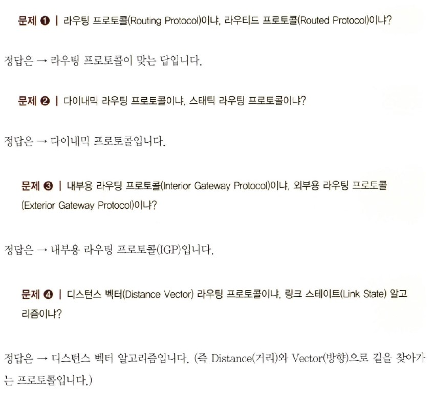

이 정도만 RIP에 대해서 알고 있다면 아마 RIP에 대해서는 자신감이 생길 겁니다. 몇 가지는 이미 설명을 드린 내용이고 나머지 설명드리지 않은 부분은 앞으로 진도를 나가면서 하나씩 설명하겠습니다.

RIP는 말씀드린 것처럼 단순하기는 하지만 그래도 옛날부터 많은 사랑을 받아온 명실상부한 스탠다드(Standard), 즉 표준 라우팅 프로토콜입니다.  
초보자가 라우터를 컨피규레이션 (설정, Configuration)한다면 RIP가 아마 가장 편리할 겁니다. RIP는 또 라우터의 메모리를 적게 사용하는 장점도 있습니다. 정말 좋은 프로토콜입니다.

하지만 RIP의 경우는 몇 가지 단점도 가지고 있습니다.

우선 RIP가 목적지까지의 최적 경로를 찾아가는 방법을 알아봐야 합니다. RIP의 경우는 최적의 경로를 찾는 방법이 가장 단순합니다. 즉 라우터를 몇 번 거쳐서 목적지에 도착하는가를 보는 것입니다. 다시 말하면 목적지까지 가는 데 네트워크를 몇 번 거쳐야 하는가입니다. 이것은 조금 어려운 용어로 말씀드리면 '홉 카운트(Hop Count)'라고 하는데, RIP는 가장 낮은 홉 카운트가 가장 좋은 경로라는 결정하게 됩니다.

이렇게 홉 카운트만 가지고 경로를 선택하다 보니 실수도 많이 하게 됩니다. 예를 들어 다음 그림을 보기 바랍니다.

그림에서 1번 PC에서 2번 PC로 가는 데이터가 있을 때 라우터 A에 RIP 라우팅 프로토콜이 돌고 있다면 라우터 A는 화살표대로 라우터 B쪽으로 데이터를 보냅니다. 왜냐하면 라우터 B쪽으로 보내는 것이 홉 카운트가 더 적기 때문입니다.  
라우터 C쪽으로 보내면 라우터 C와 라우터 D, 그리고 라우터 B를 거쳐야 목적지인 2번 PC에 도착할 수 있기 때문입니다. 하지만 각 라우터간의 회선 속도를 보기 바랍니다.

데이터가 라우터 B쪽으로 가게 되면 28.8Kbps라는 엄청나게 느린 속도로 날아가게 됩니다. 하지만 라우터 C 방향으로 가면 비록 라우터는 위쪽보다 많이 거치게 되어도 속도가 T1 (1.544Mbps)이기 때문에 훨씬 빨리 날아갈 수 있습니다. 즉 사실은 라우터 A는 2번 PC로 가는 패킷을 라우터 C쪽으로 보내는 게 훨씬 빨리 보낼 수 있는 겁니다.

그래도 RIP는 계속 위로 데이터를 보냅니다.

이게 바로 RIP의 단점입니다. 즉 경로 선택을 오로지 홉 카운트에 의존하기 때문에 속도나 회선의 신뢰도, 그리고 회선의 로드 등을 확인해 볼 수 없는 겁니다. 따라서 그냥 라우터를 적게 거치는 것은 좋은 경로로 선택해 버립니다.

또 RIP의 경우 자신의 라우터에서 15개 이상의 라우터를 거치는 목적지의 경우는 Unreachable(갈 수 없음)로 정의하고 데이터를 보내지 못하기 때문에 커다란 네트워크상에서 사용하기는 무리가 있습니다.

그럼에도 불구하고 아직도 많은 곳에서 RIP를 사용하는 이유는 소규모 네트워크 상에서는 효율성이 좋고, 라우터의 메모리를 적게 차지하며, 게다가 구성이 간편하기 때문입니다. 참, 그리고 모든 라우터에서 지원하는 표준 라우티 프로토콜이라는 것도 한 가지 이유가 될 겁니다.

여러분도 사용해보실 기회가 있을 겁니다.

> 알고 갑시다!

다이내믹 프로토콜 중의 하나인 RIP(Routing information Protocol)는 구성이 간편하고 표준 라우팅 프로토콜이어서 많은 곳에서 사용되고 있다. 그러나 경로 선택을 오직 홉 카운트로만 한다든지, 데이터를 최대 라우팅할 수 있는 거리가 짧다는 단점 때문에 커다란 네트워크보다는 소규모 네트워크에서 많이 사용된다.  
RIP에서 몇 가지 더 알아야 할 사항은 앞에서도 설명했던 업데이트 주기이다. RIP의 경우는 매 30초마다 이웃한 라우터들과 라우팅 정보를 교환한다. 경로에 이상이 있는 건 아닌지 또 뭔가 새로 생긴 경로는 없는지를 확인한다.

> 질문 있어요! QnA

Q 질문이 있는데요. 사람들이 라우터를 구성하면서 '백투백(Back-to-Back)'이라고 하던데, 어떤 구성을 이야기하는지, 그리고 왜 이런 구성을 하는지 알고 싶어요.

A 네, 라우터를 실습실에서 구성하다 보면 가장 먼저 떠오르는 고민이 바로 전용선 구간입니다.

원래 환경에서는 전화국에 요청해서 전용선을 설치하고 서로 라우터를 연결하면 되지만, 실습실에 전용선을 설치할수는 없어서 만드는 구성이 바로 Back-to-Back 구성입니다. 즉 라우터와 라우터를 서로 직접 연결하면서 마치 전용선 구간에서 연결한 것처럼 만드는 기술입니다.

아시겠지만 원래 전용선을 연결하기 위해서는 라우터 뒤에 모뎀 장비인 DSU/CSU가 붙고 그 뒤에 전용선을 연결합니다. 하지만 Back-to-Back 구성에서는 라우터 대 라우터를 V.35 케이블만 가지고 서로 연결하는 것입니다. 그림을 보면 금방 이해가 될 겁니다.

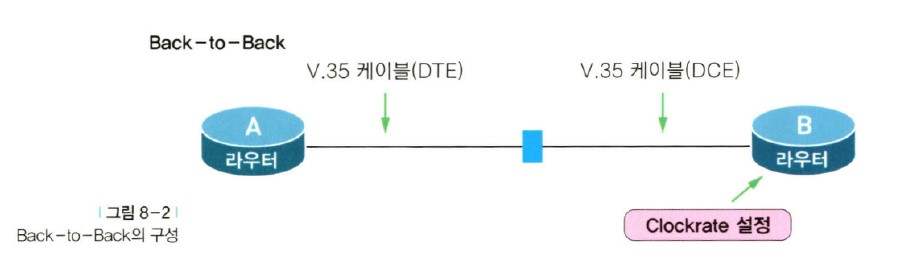

그림에서 위의 그림이 실제 구성입니다. 즉 라우터의 시리얼 인터페이스에 V.35 케이블을 연결하고 한쪽 끝은 DSU/CSU에 연결합니다. DSU/CSU는 전용선에 연결하게 되는 겁니다. 상대편도 마찬가지로 구성됩니다.

이러한 실제 구성에서 라우터는 DTE 장비가 되고. DSU/CSU는 DCE 장비가 되기 때문에 이때 라우터에 사용하는 V.35 케이블은 DTE 케이블입니다. V.35 케이블을 실제 보았을 때 DTE 케이블은 핀이 밖으로 나와있는 숫놈이고, DCE 케이블은 숫놈을 꽂을 수 있게 되어있는 암놈이니까 금방 알아보실 수 있을 겁니다.

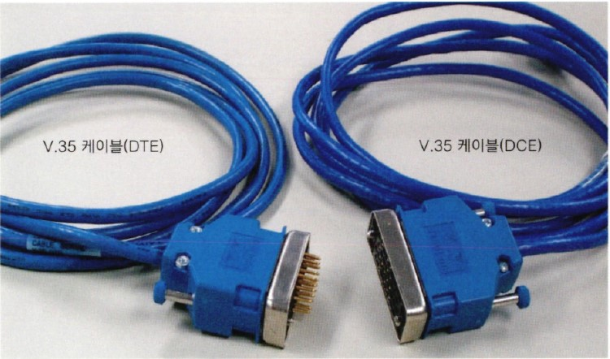

그러나 실습 환경에서는 중간에 DSU를 놓고 또 전용선을 연결하는 이러한 실제 구성이 불가능하기 때문에 전용선과 DSU/CSU를 생략하고 직접 라우터 대 라우터를 V.35 케이블을 이용해서 연결합니다.

이때 중요한 것은 라우터 A나 라우터 B 둘 중 하나가 반드시 DCE로 동작해야 한다는 것입니다. 즉 둘 다 DTE가 아니라 하나는 DTE, 그리고 나머지 하나는 DCE로 동작해야 한다는 것입니다.

그림에서는 라우터 A가 DTE로 동작하고 라우터 B가 DCE로 동작하게 되어 있습니다. (케이블이 서로 다르다는 것을 알 수 있습니다.) 이때 어느 쪽 라우터가 DCE이고, 어느 쪽 라우터가 DTE인지를 알아보는 방법은 물론 케이블을 보면 알겠지만 라우터에서 명령으로도 확인이 가능한데, 그 명령은 다음과 같습니다.

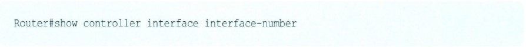

여기서 interface는 인터페이스의 종류를 이야기합니다. 그리고 interface-number는 인터페이스별 번호입니다. 예를 들어볼까요?

위에서처럼 show controller 명령을 수행해서 DTE와 DCE를 확인합니다. 일단 DTE, DCE를 확인한 후 DCE 케이블이 연결되어 있는 라우터의 인터페이스 구성 모드로 들어가서 구성 파일에 다음 구성을 추가합니다.

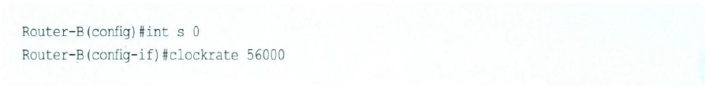

예를 들어 라우터 B의 시리얼 0 인터페이스에 연결된 케이블이 V.35 DCE 케이블인 경우 라우터 B의 시리얼 0 인터페이스 구성 모드로 들어가서 Clockrate를 세팅해 주는 겁니다. DCE 장비는 클록을 제공해야 하기 때문에 이렇게 Clockrate 값을 넣어주는 겁니다.

여기서 세팅해주는 Clockrate 값은 바로 두 라우터 간의 회선 속도가 됩니다. 따라서 앞에서처럼 56000이라고 세팅한 경우에는 56Kbps의 속도로 두 라우터가 연결되었다고 생각하면 됩니다.

일단 두 라우터가 이처럼 Back-to-Back 구성으로 연결되고 나면 이제부터는 전용선으로 연결된 구성과 똑같이 사용할 수 있습니다. 따라서 라우터의 실습 환경에서는 꼭 필요한 구성입니다.

이제 Back-to-Back에 대해서 이해가 가시죠? 실은 저도 지금 Back-to-Back 구성으로 라우터를 세팅하고 여러분께 설명드리고 있는 겁니다.

## RIP와 함께 춤을?

자, 이번에는 본격적으로 RIP에 대해서 알아보겠습니다. 일반적인 성격은 앞에서 알아보았고 이번에는 RIP를 이용해서 라우터를 구성할 때의 명령어 형식과 실제 예를 통한 RIP 라우팅의 구현, 그리고 구현한 다음에 잘 돌아가는지를 무엇으로 확인해 보나 하는 것들을 공부해 보겠습니다.

먼저 RIP에 대한 명령어 형식입니다. 명령어를 알아야 RIP를 동작시킬 수 있겠죠?

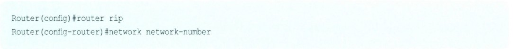

이 두 가지 명령이 전부입니다. 정말 쉽겠죠?

먼저 첫 번째 줄에 있는 router rip란 명령은 프롬프트를 보셔서 아시겠지만 '일반 구성 모드(Router(config)#)'에서 내리는 명령입니다. 이 명령은 이제부터 RIP 라우팅을 사용하겠다는 뜻입니다. 그러니까 RIP 라우팅 프로토콜을 쓰시려면 꼭 넣어줘야 하는 명령입니다.

두 번째 명령은 항상 'router 구성 모드'에서 내려줘야 하는 명령입니다. 즉 이 명령을 하기 전에는 반드시 router rip라는 명령을 먼저 내려준 후 Router(config-router)# 모드로 들어와서 내리는 명령입니다. 이 명령은 RIP 라우팅에 참가하는 네트워크를 지정해 주기 위해서 사용하는 명령입니다.  
여기서 network-number가 바로 RIP로 라우팅해 줄 네트워크가 됩니다.

이때 주의하셔야 할 사항이 있습니다. RIP와 같은 라우팅 프로토콜은 네트워크 넘버를 입력할 때 서브넷 마스크는 입력하지 않습니다. 즉 RIP는 Classful하게 모든 네트워크를 인식한다는 것입니다. 예를 들어 내가 사용하는 라우터에 이더넷 0에 배정한 네트워크가 150.150.100.0 255.255.255.0이라고 가정해 보겠습니다.  
서브넷 마스크는 완전히 이해하고 계시겠지만 150.150.100.0/24는 클래스 B를 서브넷 마스크해서 클래스 C처럼 쓰고 있는 겁니다. 이때 라우팅 프로토콜은 RIP를 쓴다고 가정하고 앞에서 배운 대로 명령을 입력하겠습니다.

하지만 이렇게 입력을 해도 RIP에서는 네트워크를 150.150.0.0으로 인식해 버립니다. 따라서 show running-config을 수행해 보면 다음과 같이 보이게 됩니다.

자, 이렇게 되면 어떤 문제가 발생할까요? 네, 맞습니다. 이렇게 되면 RIP를 수행하고 싶은 곳은 150.150.100.0뿐인데, 150.150.0.0으로 모든 네트워크가 들어가서 원하지 않는 네트워크까지 RIP가 수행하게 되는 것입니다.

명령어 형식은 대충 배웠으니까 이번에는 실습을 통한 RIP 구성을 한번 해볼까 합니다.

예를 들어 본사는 서울에, 그리고 지사는 부산에 있는 어떤 회사가 있다고 가정해보겠습니다. 이 회사의 본사에는 PC와 서버를 합쳐서 약 200대 정도의 장비가 있고 부산 지사에는 약 150명 정도가 PC를 쓰고 있다고 가정하겠습니다.

자, 여러분이 이제 이 두 사무실 간에 네트워크를 설치해 주기 위해서 라우터 앞에 앉았습니다. 그리고 일단 여기서는 인터넷에 대한 접속은 없다고 가정하겠습니다. 단순히 두 사무실 간에 네트워크를 연결하는 겁니다.

자, 이때 준비물은 뭐가 있을까요?

그림을 보면서 설명을 드리겠습니다. 일단 두 사무실의 내부에는 네트워크가 되어 있다는 가정하에 두 사무실을 연결하기 위한 라우터 2대(라우터 A와 라우터 B)와 DSU 또는 CSU 2대가 필요합니다.(그림에서 DSU/CSU 부분은 생략되었습니다.)

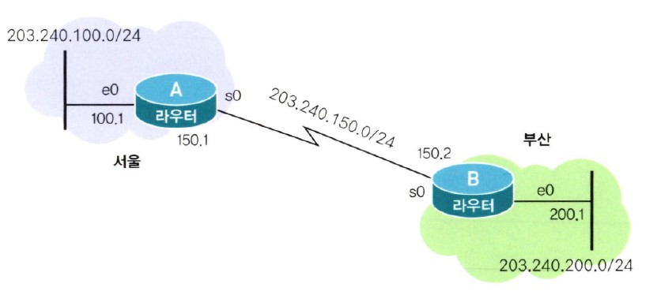

여기서 보이는 것처럼 서울 본사와 부산 지사의 네트워크를 구축하기 위해서는 총 3개의 네트워크가 필요합니다. 즉 서울 내부 네트워크, 부산 내부 네트워크, 그리고 마지막으로 시리얼 라인(WAN 구간)에 대한 네트워크입니다. 이렇게 네트워크를 나누는 것은 각 구간별로 서로 다른 네트워크가 있어야 하기 때문입니다.

또 한 가지 여기서 여러분이 아셔야 할 것은 시리얼 구간, 즉 전용선 구간에도 하나의 네트워크가 소모된다는 것입니다. 따라서 이 구간에는 지금처럼 서브넷 마스크 255.255.255.0을 사용하는 것은 IP 주소를 낭비하게 되는 것입니다. 만약 공인 IP 주소를 사용한다면 더욱 더 문제가 됩니다.  
하지만 여기선 이 부분에 대한 이야기는 일단 건너뛰도록 하겠습니다. 나중에 VLSM(Variable Length Subnet Mask)을 설명하면서 설명드리도록 하겠습니다. 우선은 모두 같은 서브넷 마스크를 사용하기로 했다고 가정하겠습니다.

라우터를 구성하기 전에 항상 위 그림과 같은 구성도를 만드는 것이 중요합니다. 라우터를 구성하다 보면 구성이 잘 생각나지 않거나 아니면 엉뚱한 IP 주소를 잘못 입력하는 경우가 있기 때문에 항상 그림을 먼저 그리고 라우터를 구성하는 버릇을 들이기 바랍니다.

구성도에는 라우터의 이름과 어떤 식으로 서로 연결되어 있는지에 대한 내용, 그리고 IP 주소가 들어가면 됩니다. 서울, 부산 네트워크의 경우는 최대 인원이 250명을 넘지 않기 때문에 각 네트워크에 클래스 C 하나씩을 배정했습니다.

자, 이제 라우터 구성을 직접 보면서 설명드리겠습니다. 라우터 구성에서 중요한 부분만 써보면 아래와 같습니다.

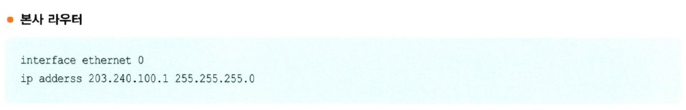

이 부분이 본사 라우터의 이더넷 부분입니다. 즉 이 회사의 본사는 203.140.100.2~203.240.100.254까지의 IP 주소를 사용하겠죠?(203.240.100.1은 라우터에 이미 부여했고, 203.240.100.255는 브로드캐스트 주소입니다.)

이 부분이 본사 라우터의 시리얼, 즉 부산과 접속되는 인터페이스 입니다. 여기서도 보이지만 이더넷과 시리얼 인터페이스는 서로 다른 네트워크여야 한다는 것을 항상 잊지 말기 바랍니다.

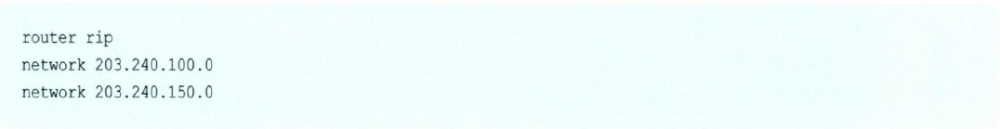

이 부분이 RIP에 대한 구성입니다. 정말 간단하죠?

RIP 라우팅에 참여하는 네트워크를 넣어준다고 했으니까 여기서는 본사 라우터의 이더넷 부분(203.240.100.0)과 시리얼 부분(203.240.150.0)을 포함시키면 됩니다. 현재 보이는 것처럼 네트워크는 Classful하게 들어가기 때문에 따로 서브넷 마스크를 입력하지 않도록 되어 있습니다.

이렇게만 하면 본사 라우터의 모든 구성은 끝나게 됩니다.

자, 그럼 전체 라우터의 구성을 한번 볼까요?

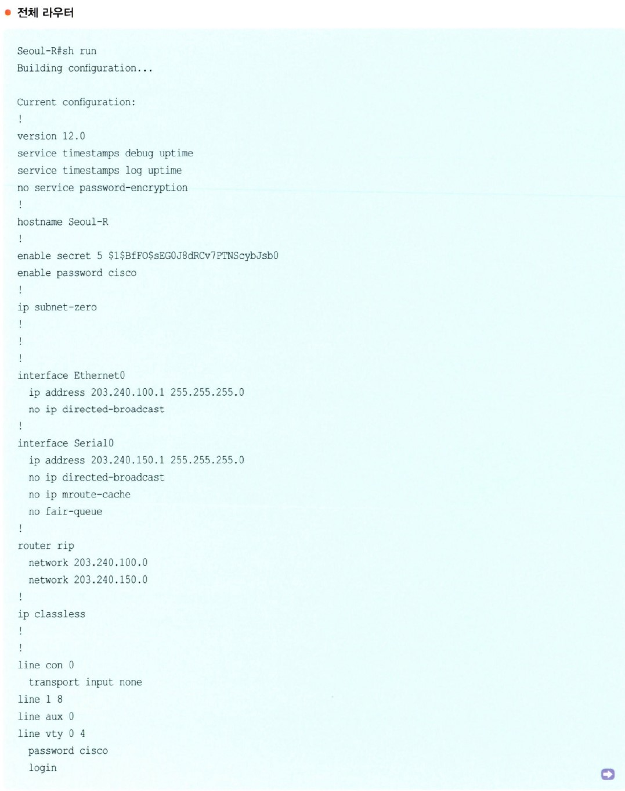

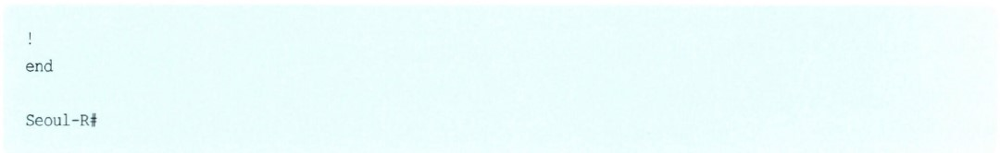

이제는 라우터의 구성만 보셔도 아시겠죠? 이렇게 점점 라우터의 구성과 친해지는 것이 중요합니다.

자, 이제 서울 본사 라우터의 구성은 마무리되었습니다. 과연 제대로 구성되었는지 한번 확인해 보고 싶으시죠? 몇 가지 명령이 있습니다.

먼저 show ip protocol이란 명령이 있습니다.

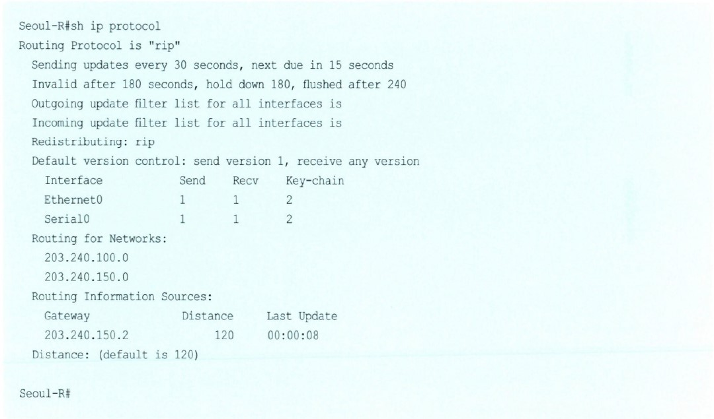

위와 같이 라우터의 프리빌리지드 모드(운영자 모드)에서 show ip protocol이란 명령을 내리면 현재 IP에서 동작하고 있는 라우팅 프로토콜이 보입니다. 우리가 서울 본사에 있는 라우터에 RIP를 동작시켰기 때문에 맨 윗 줄에 Routing Protocol is "rip"라는 말이 보입니다.  
그 다음에는 라우팅 정보를 얼마 만에 한 번씩 업데이트하는가를 보여줍니다. RIP는 매 30초에 한 번씩 업데이트가 발생하는데, 지금 마지막으로 업데이트한 지 15초가 지났다고 나옵니다. 그러니까 앞으로 15초만 더 있으면 한 번 더 업데이트되겠네요.

이때 만약 어떤 곳으로부터 30초 동안에 업데이트 정보를 받지 못했다면 어떻게 될까요? RIP 환경에서 라우터는 180초 동안은 상대측으로부터 정보를 받지 못해도 느긋하게 기다립니다.  
즉 RIP 업데이트가 6번 들어오지 않을 때까지는 기다려주는 겁니다. 이 시간을 'Invalid Time'이라고 합니다(Invalid after 180 seconds). 그런데 180초가 지나도 상대에서 업데이트가 들어오지 않게 되면 라우터는 Hold Down 상태로 들어갑니다.  
이때부터 라우터는 상대편이 다운됐을거라고 생각하게 되고 'possibly down'이라는 메시지를 라우팅 테이블에서 보여줍니다.

그리고도 1분 동안 상대로부터 연락이 없으면 라우터는 이 경로가 죽었다고 생각하고 라우팅 테이블에서 이 경로에 대한 정보를 지워버리게 되는데, 그 시간이 바로 'Flush Time'입니다(flushed after 240).

그 다음에 보이는 Default version control: send version 1, receive any version이란 말은 RIP의 버전에 대한 정보를 보여주고 있습니다. 즉 RIP의 여러 가지 단점을 보완해서 새로 나온 RIP가 RIP version 2인데, 현재 우리는 RIP 버전 1을 사용하고 있다는 것을 보여주고 있습니다.  
아무튼 RIP 버전 1에서 보낸 정보는 어떤 버전이든지 받아볼 수 있지만, RIP 버전 2에서 보낸 정보는 오직 RIP 버전 2에서만 이해할 수 있다는 것을 알려주고 있습니다.

그 다음에 보이는

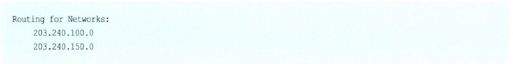

은 현재 라우터에서 RIP가 적용되고 있는 네트워크를 보여줍니다. 우리가 이더넷 0쪽과 시리얼 0쪽에 RIP를 적용했으니까 이렇게 보이는 겁니다.

그럼 라우팅 정보는 어디로부터 얻어오고 있을까요? 거기에 대한 정보를 보여주는 것이 바로 아래에 나와있는 내용입니다. 즉 다음과 같습니다.

여기서 203.240.150.2가 바로 라우팅 정보를 읽어오는 곳입니다. 여기가 어딘지는 아시죠? 바로 부산 라우터의 시리얼 부분입니다.

맨 마지막 줄에 Distance, 즉 거리가 120이라고 되어 있네요. 이것을 'Administrative Distance'라고 합니다. 즉 라우팅 정보에 대한 신뢰성 정도라고 생각하면 됩니다. 이 디스턴스 값이 작으면 작을수록 라우터는 그 경로를 신뢰합니다.  
참고로 스태틱 라우팅 정보는 디스턴스 값이 1입니다. 따라서 같은 목적지에 대해서 RIP로 찾아낸 길과 스태틱으로 찾아낸 길, 이렇게 2개의 길이 존재한다면 라우터는 스태틱으로 찾아낸 길쪽으로 데이터를 내보내게 됩니다. 디스턴스가 작을수록 더 신뢰하기 때문입니다.

자, 이번에는 라우팅 테이블을 한번 확인해 볼까요? 라우팅 테이블을 보려면 show ip route라는 명령이 사용됩니다.

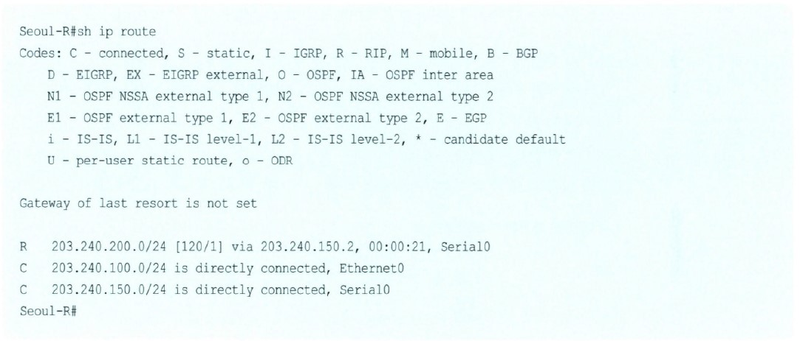

라우팅 테이블이 보입니다. 바로 맨 마지막 3줄이 라우팅 테이블입니다.

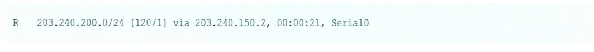

여기에서 맨 앞에 있는 R은 RIP로 찾아낸 길을 뜻합니다. 그 다음에 나오는 203.240.200.0은 목적지 네트워크입니다. 즉 찾아낸 목적지를 뜻합니다. 이때 뒤에 나오는 /24의 의미는 255.255.255.0, 즉 서브넷 마스크를 이진수로 바꾸었을 때 1의 숫자를 의미하고 120은 RIP의 디스턴스 값을 나타냅니다.  
그 뒤에 나오는 1은 코스트를 의미하는데, RIP에서는 코스트가 홉카운트니까 1홉 떨어져서 목적지가 있다는 의미로 해석하면 될 것 같네요.

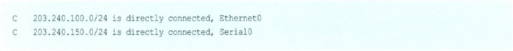

이것은 앞에 있는 C가 의미하듯이 라우터에 붙어 있는 네트워크라는 것을 알려줍니다. (C는 connect를 의미하니까요.)

이번에는 RIP가 동작하는 라우터에서 디버그 명령으로 실제 라우팅 업데이트가 일어나는 것을 한번 살펴보겠습니다. 디버그 명령은 굉장히 유용한 명령이면서도 섣불리 사용하면 라우터에 치명적인 영향을 줄 수 있기 때문에 사용 시에는 각별한 주의가 필요합니다.

또한 디버그 명령을 사용하려면 될 수 있는 한 콘솔에서 명령을 내려주는 것이 좋습니다. 물론 텔넷에서도 디버그 명령을 내릴 수 있지만, 텔넷에서 디버그 명령을 내리는 경우는 terminal monitor라는 명령을 주어야만 텔넷 화면에서 디버그의 결과를 볼 수 있습니다. 꼭 기억해 두기 바랍니다.

또 디버그 명령에서 가장 중요한 것 하나는 디버그 명령 후 결과치를 보고 나서는 반드시 디버그 명령을 꺼줘야 한다는 겁니다.  
디버그를 시작하고 나면 계속 모니터에 여러 가지 내용을 뿌려주기 때문에 라우터에 부담이 너무 많이 가게 되고, 잘못하면 라우터가 다운될 수도 있기 때문에 디버그는 가능한 조금만 사용해야 하고 또 보고난 뒤에는 반드시 꺼줘야 합니다.

디버그를 꺼주는 명령으로는

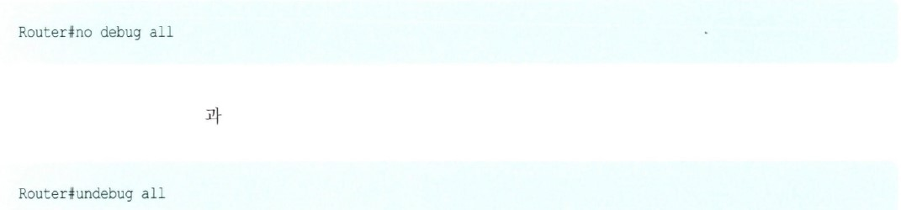

이 있습니다. 이 두 명령 중 하나를 내리고 나면 모든 디버그가 멈추게 됩니다. (물론 이 명령을 내리고도 잠깐 동안은 디버그 화면이 계속 보입니다. 이것은 시간차라고 생각하면 됩니다. 하지만 곧 멈추니 너무 걱정하지 마세요.)

그런데 막상 디버그를 실시하게 되면 계속 화면에 디버그의 결과가 나오기 때문에 위에서 말씀드린 디버그를 끄는 명령을 사용하기가 굉장히 어렵습니다. (막 화면이 지나가니까 정신이 없어집니다.)  
따라서 디버그를 꺼줄 때는 빨리 끄는 것이 중요한데 이때 사용하는 명령이

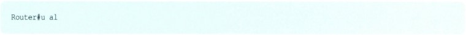

입니다. u al은 undebug all을 줄여서 사용하는 명령입니다. 아마 이것을 알아두면 많은 도움이 될 겁니다.

디버그 명령은 한마디로 라우터에서 자기네들끼리 어떤 정보를 주고받는지를 우리가 잠깐 들여다보는 명령입니다. 즉 아래 명령처럼 디버그하고 IP RIP라고 하면 IP RIP에서 라우터끼리 서로 통신하는 것을 보여줍니다.  
명령어를 주는 방식은 그냥 프리빌리지드 모드(운영자 모드)에서 debug ip rip라고 해주면 됩니다. 그럼 명령을 내리는 시점에서부터 라우터에서 rip에 대해서 주고받은 내용을 보여주기 시작합니다. (물론 IP 중에서죠.) 직접 한번 볼까요?

여기서 보면

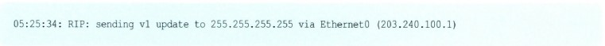

은 라우팅 업데이트를 05시 25분 34초에 RIP 버전 1로 이더넷 0쪽으로 보냈습니다. 그 다음을 다시 보면

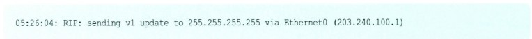

정확히 30초 후에 다시 라우팅 업데이트가 일어난 것을 알 수 있습니다. 즉 라우팅 업데이트는 30초에 한 번씩이라는 걸 알 수 있죠? 나머지도 자세히 비교해 보면 마찬가지라는 것을 알 수 있습니다. 또한 RIP의 송신과 수신에 RIP 버전 1이 사용되고 있다는 것도 알 수 있습니다.

자, 이렇게 해서 RIP에 대한 구성을 완성했습니다. 어떠세요? 그렇게 어렵진 않죠? 사실 RIP의 장점 중 하나가 바로 구성이 단순하다는 것입니다.

그럼 이제 부산 지사의 라우터 구성은 여러분이 직접 할 수 있죠? 한번 해보세요. 제가 부산으로 출장을 보내 드리겠습니다. 그리고 아래에 나온 부산 라우터 구성과 비교해 보세요.

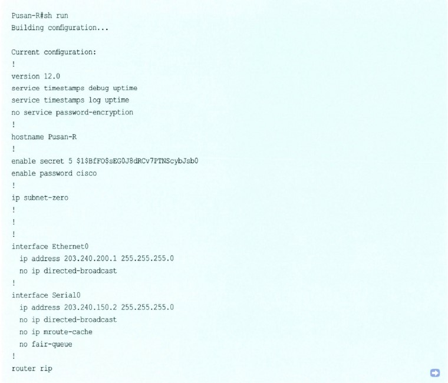

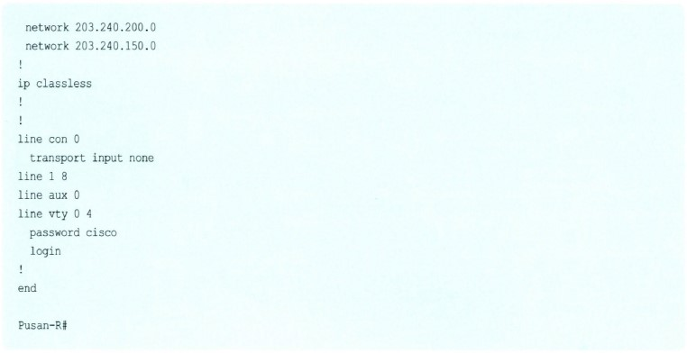

> 알고 갑시다!

구성이 간단한 RIP 라우팅 프로토콜을 이용한 라우터의 구성은 RIP 라우팅을 시작하는 명령 Router RIP와 이 명령 뒤에 오는 network 명령을 이용한다.  
RIP 구성을 마친 후에 라우터에서 RIP를 확인해 보는 명령은 show ip protocol이 있고, 라우팅 테이블을 보고 싶으면 show ip route 명령을 사용하면 된다. 또 디버그를 사용할 때는 가능한 콘솔 화면에서 하고 텔넷에서 할 때는 terminal monitor란 명령이 필요하다. 그리고 더 중요한 건 디버그는 반드시 조금만 보고 꺼줘라. 디버그를 끄는 명령은 u ai이다.

라우터의 구성은 여러분이 보시는 대로 그렇게 어렵지 않습니다. 사실 라우터를 구성하다 보면 우리가 책에서 접하지 못한 여러 상황을 만나게 됩니다. 예를 들어 전용선의 문제로 라우터를 동작하지 못하는 경우나 서로 다른 제품의 라우터 연결 시에 발생하는 문제는 여러분이 엔지니어가 되어서 직접 겪어봐야 해결할 수 있는 것들입니다.

다만 제가 드리고 싶은 말씀은 이런 상황에서 라우터 구성에 대한 확신마저도 없다면 오히려 제대로 구성한 라우터의 구성을 바꾸어서 더 큰 실수를 할 수도 있다는 것입니다. (바로 제 경험담입니다.) 여러분은 이제 라우터의 구성에 대한 확신을 가지셨을 테니 혹시 문제가 발생한다고 해도 전혀 당황하지 않으실 거라고 믿습니다.

이번에는 여러분이 직접 RIP를 이용해서 구성을 해보겠습니다. 아래 그림은 여러분이 그동안 많이 보아온 그림입니다. 여기에서 PC A와 PC B간에 있는 라우터를 RIP로 구성해서 두 PC가 통신이 되도록 해보는 겁니다.

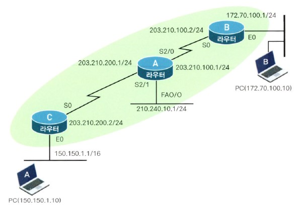

먼저 라우터 C의 구성에 대한 주요 부분입니다.

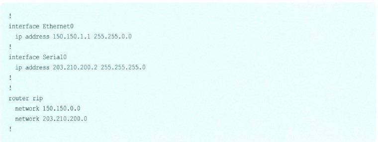

즉 Ethernet 0 인터페이스에 IP 주소를 구성대로 할당하고 RIP를 활성화한 후 RIP가 수행될 네트워크를 넣었습니다.

다음은 라우터 A입니다.

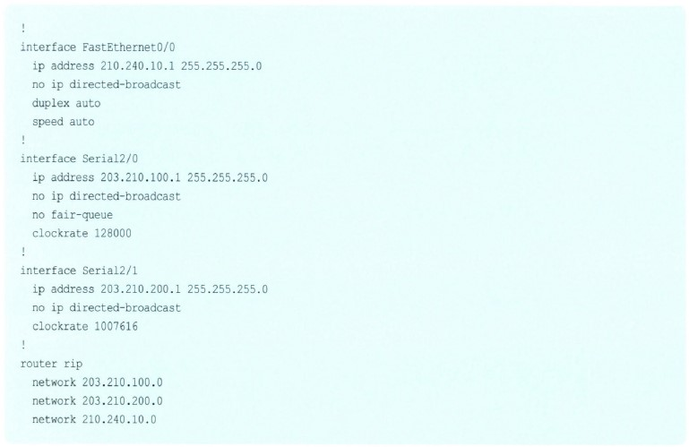

라우터 A는 조금 다르네요. 특별히 다른 것은 아니지만 우선 시리얼 인터페이스쪽을 보면 clockrate가 세팅되어 있는 것이 보일 겁니다. 이제 이것이 왜 있는 줄 아시겠죠? 네, 맞습니다. 바로 백투백(Back-to-Back)구성 때문에 들어간 겁니다.  
그리고 Fast Ethernet0/0과 serial 2/0, 2/1을 세팅하고 이들 네트워크를 모두 RIP 네트워크로 정의했습니다. 역시 어렵지 않죠?

다음은 라우터 B입니다.

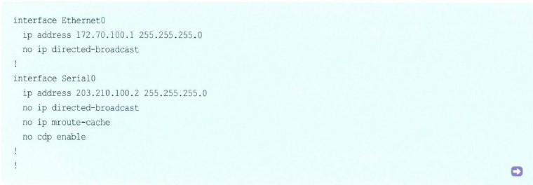

여기 세팅에서는 한 가지 다른 점이 있습니다. 앞에서도 말씀드렸지만 Ethernet 0 인터페이스의 세팅을 보면 Ethernet 0에 세팅된 네트워크는 172.70.100.0/24 네트워크로 172.70.0.0을 서브네팅해서 사용했습니다.  
그런데 밑에 구성된 RIP 네트워크 세팅에서는 172.70.100.0이 아니라 172.70.0.0으로 Classful하게 들어갔습니다. 이게 바로 RIP의 한계입니다.

일단 모든 라우터에 구성을 마쳤으면 검증을 시작해보겠습니다.

라우터 C에서 172.70.100.0 네트워크에 접속되는가를 보려면 간단히 핑 테스트를 해보면 되지만, 우선은 라우팅 테이블에 172.70.100.0이 있는지를 확인하겠습니다.

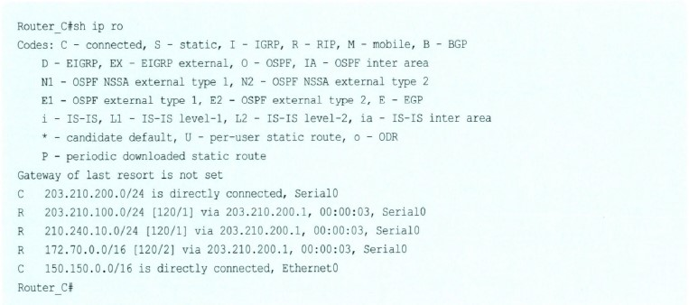

위와 같이 172.70.0.0 네트워크가 라우터 C의 시리얼 0 인터페이스를 통해서 연결되어 있음을 보여줍니다. 일단 라우터 C에서 172.70.0.0 네트워크가 보이니까 이번에는 라우터 B에서 150.150.0.0 네트워크가 보이는지를 확인하면 됩니다. 그럼 라우터 B에 가서 명령을 내립니다.

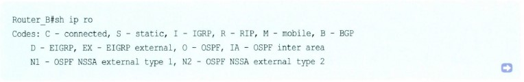

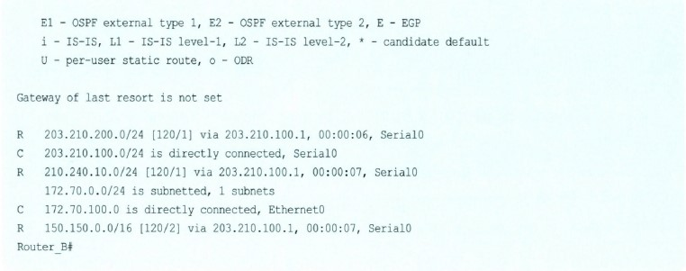

이제 두 라우터에서 양쪽 네트워크를 인식하고 있는 것을 알았습니다. 핑은 해보나마나 당연히 되겠죠? 그래도 한번 해볼까요?

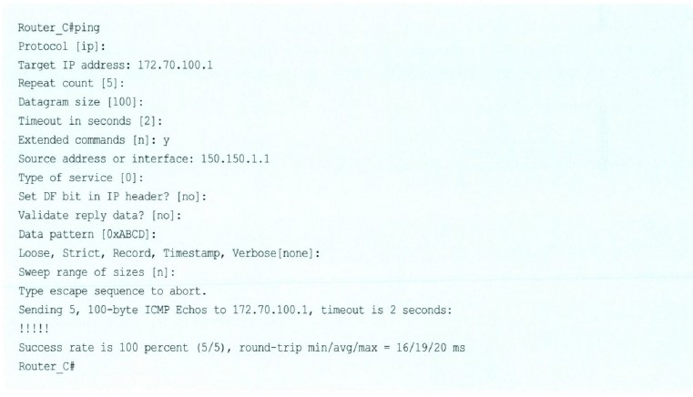

RIP로의 구성이 끝났습니다. 여러분도 RIP가 그리 어려운 프로토콜이 아니란 것을 이제 아시겠죠?

> 네트워크 플러스+

### 같은 길을 두 사람이 알고 있다면 누구 말을 들어야 하지?

### - Administrative Distance

앞에서도 잠깐 다룬 이야기입니다. 만약 우리가 한 라우터에 라우팅 프로토콜을 2개 이상 사용해야 한다면 어떤 상황이 일어날까요?

라우팅 프로토콜이 뮈냐구요? 라우팅 테이블을 만들고 유지하는 프로토콜, 즉 Static Routing Protocol, RIP, IGRP, OSPF, EIGRP 같은 거 말입니다.

네? 한 라우터에서 뭐하러 라우팅 프로토콜을 2개씩이나 쓰냐구요?

근데 그럴 일이 생깁니다. 라우터 구성을 하다 보면 말입니다. 왜냐하면 내 라우터의 양쪽에 다른 라우터가 연결되어 있다고 가정할 때 왼쪽에 있는 라우터는 RIP를 쓰고 오른쪽에 있는 라우터는 IGRP를 쓴다면 내 라우터는 중간에 있으니까 둘 다 써야만 합니다.  
즉 내 양옆에 있는 사람이 한 명은 영어를 쓰고 한 명은 중국말을 하면 저는 중간에서 영어도 쓰고 중국말도 써야 서로가 대화를 할 수 있는 것처럼 말입니다.

아무튼 이런 상황이 되어서 우리가 한 라우터에 2개 이상의 라우팅 프로토콜을 쓰게 되었다고 가정을 해보겠습니다.

이런 경우에 내가 어떤 경로, 즉 길에 대한 정보를 얻으려고 보니까 RIP를 쓰는 라우터도 그 길에 대한 정보를 알고 있고, 또 IGRP를 쓰는 라우터도 그 길을 알고 있는 겁니다. 즉 내가 일본 가는 경로를 물어보니까 미국 사람도 설명을 해주고 중국 사람도 설명을 해주는데, 설명이 서로 다른 겁니다. 그렇다면 나는 어떤 사람의 말을 믿어야 할까요?

라우터로 다시 돌아가서 말씀드리면 어떤 경로 정보를 RIP와 IGRP에서 동시에 받는다면 어떤 라우팅 프로토콜에서 온 정보를 이용해서 경로를 찾을까 하는 것입니다.

이에 대한 답은 바로 Administrative Distance 값입니다. 아래 그림에 시스코 라우터에서의 DIstance(디스턴스) 값이 나와 있습니다.

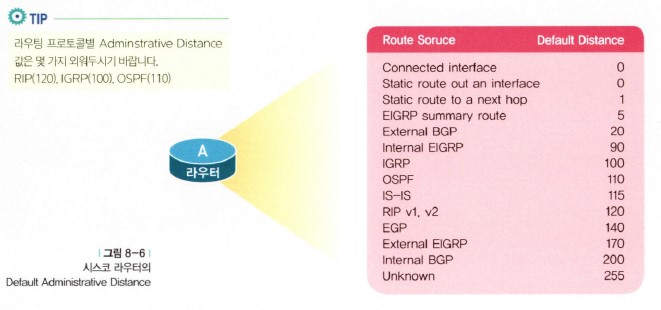

역시 뭐니뭐니해도 가장 작은 값 0을 가진 것은 그 라우터가 직접 가지고 있는 인터페이스입니다. 예를 들어 라우터 C의 경우 Ethernet 0 인터페이스나 serial 0 인터페이스 등이 여기에 속합니다.  
이런 인터페이스는 우리가 show ip route에서 보았을 때 c로 보입니다.

또 하나 디스턴스 값이 0이 되는 것이 있는데, 그것은 인터페이스를 이용해서 스태틱 라우트 명령을 준 경우입니다. 우리가 일반적으로 사용하는 스태틱 라우트 명령은

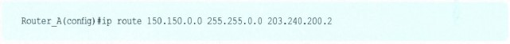

와 같이 맨 뒤에 어디를 통해서 갈 것인가를 IP 주소를 입력해서 정의합니다. 이렇게 정의한 스태틱 라우트 명령은 디스턴스 값이 1이 되지만, 예를 들어

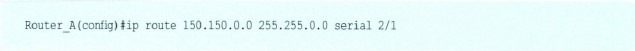

이라고 인터페이스를 입력하는 경우는 디스턴스 값이 0이 되어야 된다는 것입니다. 이때 입력하는 인터페이스는 자신의 인터페이스가 됩니다.

그 다음으로 우리가 눈여겨 보아야 할 것은 BGP, IGRP, RIP, OSPF, EGRP 등입니다. 이것들은 가능한 외워두면 도움이 될 겁니다.

지금까지 알아본 것과 같이 각 라우팅 프로토콜별로 이러한 디스턴스 값이 있는데, 이 값이 작으면 작을수록 신뢰성이 더 높습니다. 따라서 2개의 라우티 프로토콜 중에서 디스턴스 값이 작은 쪽의 말을 듣게 됩니다.  
현재 우리 라우터에 돌아가고 있는 프로토콜에 대한 디스턴스 값은 show ip protocol을 하면 보인다는 것을 이제는 다 아실 겁니다.

이제 Administrative Distance에 대해서 이해가 되시죠? 복잡한 네트워크 구성에서는 이 개념을 이해하는 것이 중요합니다. 생각하지 못한 많은 문제를 찾아낼 수 있는 건 이처럼 기본에 충실한 것이기 때문입니다.

## DIstance-Vector 라우팅 알고리즘에서의 문제점과 해결책

이번에는 디스턴스 벡터 알고리즘의 문제점에 대한 고찰을 해볼까 합니다. 미리 말씀드리지만, 그렇다고 디스턴스 벡터 알고리즘이 문제점만 있는 것은 아닙니다. 장점도 많지만 여기에서는 문제점만을 집중적으로 알아보려는 것입니다.  
그리고 마지막에서 그 해결책에 대한 것들도 함께 알아보겠습니다.

디스턴스 벡터의 문제점이라면 가장 먼저 떠오르는 것은 바로 '시간'입니다. 즉 한 번 배운 라우팅 테이블을 계속 전달하기 때문에 업데이트가 모든 네트워크에 전달되는 시간(이것을 보통 '컨버전스 타임(Convergence Time)'이라고 합니다.)이 많이 걸린다는 것입니다. 따라서 이것 때문에 우리가 흔히 이야기하는 루핑이 발생할 수 있습니다.

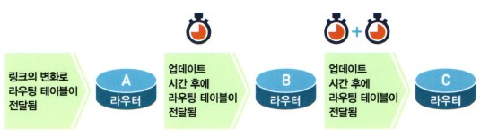

먼저 위 그림을 보겠습니다. 라우터 A는 왼쪽 네트워크로부터 라우팅 테이블의 업데이트를 받았습니다. 즉 왼쪽에 연결된 네트워크의 링크에 변화가 감지된 것입니다. 그럼 이제부터 라우터 A는 자신의 라우팅 테이블을 변경하기 위한 작업을 시작합니다.  
새로운 링크가 생겼다면 그것을 넣고, 만약 어떤 네트워크가 끊어졌다면 그 네트워크를 라우팅 테이블에서 지울 것입니다.

이런 작업을 통해서 라우터 A는 새로운 라우팅 테이블을 만들게 됩니다. 그리고 라우팅 업데이트 시간이 왔습니다. RIP에서는 30초에 1번 라우팅 테이블을 업데이트한다고 배운 것을 기억할 겁니다. 마찬가지로 디스턴스 벡터(DIstance-Vector) 알고리즘은 업데이트 주기를 가지고 있습니다.

예를 들어 이 주기가 30초라고 가정하면 라우터 A는 30초 후에 변경된 라우팅 테이블을 라우터 B에 보내고 라우터 B는 다시 30초 후에 라우터 C에 이 정보를 보내주는 것입니다. 따라서 라우터 C는 라우터 A가 라우팅 테이블 변화를 인지한 지 60초 후에야 비로소 네트워크의 변화를 인지할 수 있게 되는 것입니다.

만약 라우터 C 뒤에 또 다른 라우터가 있다면 어떨까요? 그렇습니다. 라우터가 네트워크 변화를 인지하는 데 많은 시간이 걸린다는 것을 이제 여러분도 직접 느끼셨을 겁니다.

이번에는 좀 더 구체적인 예를 들어서 설명해 보겠습니다.

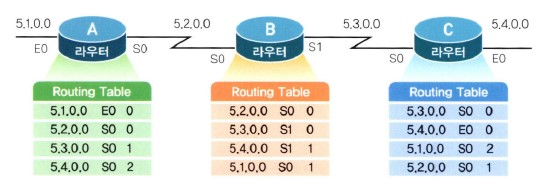

위 그림은 각 라우터별로 현재 가지고 있는 라우팅 테이블을 보여주고 있습니다. 물론 라우팅 테이블이 정확히 이렇게 생기진 않았습니다. 개념적으로 이해하기 바랍니다.  
맨 앞에 있는 것이 목적지 네트워크이고, 그 다음은 어디를 통해서 갈 것인가를 알려주는 테이블입니다. 그리고 맨 마지막이 홉 카운트 정보입니다. RIP의 라우팅 테이블과 유사하죠?

아무튼 이 상태에서는 모든 라우팅 테이블이 정상적입니다. 라우터 A, B, C 모두 동일한 정보를 가지고 있습니다. 이때 라우터 A에 연결되어 있는 5.1.0.0 네트워크에 문제가 발생했습니다. 즉 5.1.0.0 네트워크가 다운되었습니다.

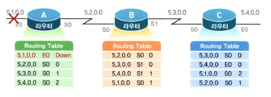

라우터 A는 즉시 자신의 라우팅 테이블에 5.1.0.0이 다운이라고 업데이트를 합니다. 하지만 아직 업데이트 주기가 되지 않았기 때문에 라우터 B나 라우터 C는 이 정보를 알지 못합니다. 이때 라우터 B가 라우팅 테이블을 업데이트했습니다.

여기에는 아래 그림에서 보는 것처럼 5.1.0.0 네트워크 정보도 들어 있습니다. 네트워크 5.1.0.0에 대한 라우팅 정보를 라우터 B로부터 받은 라우터 A는 5.1.0.0 네트워크를 라우터 B를 통해서 갈 수 있다고 생각하고 자신의 라우팅 테이블을 바꿉니다.  
즉 5.1.0.0 네트워크는 라우터 B로 갈 수 있는데 홉 카운트는 2라구요. 이제부터 정말 말도 안 되는 일이 벌어지고 있는 겁니다.

이번에는 라우터 B가 라우터 A로부터 온 네트워크 5.1.0.0에 대한 정보를 보니 홉 카운트가 2로 바뀐 것을 알았습니다. 어차피 라우터 B는 라우터 A를 거쳐서 5.1.0.0 네트워크를 가야 하기 때문에 자신의 홉 카운트를 3으로 바꾸게 됩니다. (어처구니 없죠?) 그렇게 되니 라우터 B의 뒤에 있는 라우터 C는 5.1.0.0 네트워크에 대한 자신의 홉 카운트를 4로 바꾸게 되는 겁니다.

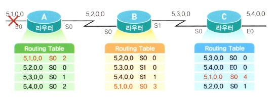

이런 식으로 라우팅 테이블은 계속 루핑을 돌기 시작하는데, 결국 죽어있는 네트워크로 향하는 데이터는 빙글빙글 돌기만 할 뿐 목적지에 도착하지 못하기 때문에 네트워크에 엄청난 트래픽이 발생할 뿐 아니라 라우팅 테이블이 꼬이게 되어 제대로 된 라우팅을 수행할 수 없게 됩니다.

이처럼 라우팅에 루핑이 발생하는 이유는 한 라우터가 라우팅 정보에 대한 모든 정보를 가지고 있지 못하고, 또 이웃 라우터로부터의 업데이트가 느리게 이루어지기 때문입니다.

따라서 이런 문제를 방지하기 위한 대책이 필요한데, 여기서는 그 대책에 대해서 한번 알아볼까합니다.

맨 먼저 Maximum Hop Count를 이용한 방법입니다. RIP 라우팅 프로토콜의 경우는 최대 홉 카운트를 15로 규정하고 15를 넘어가는 라우팅 경로에 대해서는 unreachable로 간주합니다.  
그리고 flush time이 지난 후에는 라우팅 테이블에서 아예 삭제해 버립니다. 이렇게 최대 홉 카운트를 정해놓으면 라우팅의 루핑이 발생하더라도 16까지 이르게 되면 멈출 수 있습니다. 그러나 RIP의 최대 홉 카운트 제한은 15홉을 넘어서는 경로에 대해서는 아예 도달할 수 없기 때문에 요즘처럼 네트워크 규모가 커질 경우 치명적인 약점을 드러내게 됩니다.

이번에는 Hold Down Timer를 이용한 루핑 방지법입니다.

아래 그림에서 라우터 E에 붙어있는 네트워크 A가 다운되었다고 가정해보겠습니다. 라우터 E는 네트워크 A가 다운되었다는 것을 라우터 A에 알렸습니다. 그러면 라우터 A는 네트워크 A에 대한 Hold Down 타이머를 시작합니다.  
만약 이때 라우터 B가 라우팅 테이블을 업데이트하면서 라우터 A에 네트워크 A를 자신을 통해서 갈 수 있는데, 홉 카운트 4라고 이야기한다면 라우터 A는 이 정보를 무시합니다.

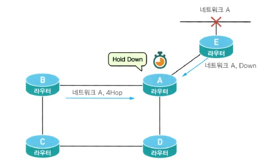

즉 Hold Down 타이머가 동작하고 있는 동안에는 외부에서 해당 네트워크에 대한 라우팅 경로 정보를 받았을 때 원래 가지고 있던 메트릭 값(목적지까지의 거리에 대한 값으로, RIP의 경우는 Hop 카운트가 됩니다.)보다 큰 값이 들어오면 무조건 무시합니다.  
그리고 Hold Down 카운터가 종료되거나 목적지에 대한 새로운 경로가 지금 가지고 있던 메트릭과 같거나 좋은 경로가 들어올 때만 이웃 라우터로부터의 업데이트를 받아들입니다.

아래 그림에서 네트워크에 A에 대해서 라우터 A는 홉 카운트 1을 가지고 있었습니다. 이때 아직 Hold Down 타이머가 끝나지 않은 상태에서 라우터 B가 네트워크 A에 대한 더 나쁜 홉 카운트(여기서는 4)를 가지고 업데이트를 했습니다.  
이렇게 되면 라우터 A는 라우터 B의 업데이트를 무시합니다. 아까 배운 규칙, 메트릭 값이 원래 값과 같거나 더 좋지도 않을 뿐만 아니라 Hold Down 타이머가 종료되지도 않았기 때문입니다.

라우터 A가 라우터 B와 라우터 D쪽으로 업데이트를 하게 되면 이제 라우터 B와 D도 네트워크 A에 대해서 Hold Down 타이머를 작동시킵니다.

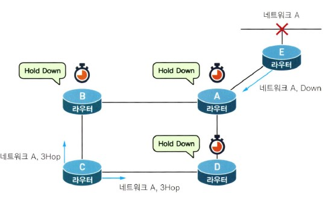

이번에는 라우터 B와 D도 네트워크 A에 대해서 Hold Down 타이머가 걸렸습니다. 이때 라우터 C가 라우터 B나 라우터 D에 네트워크 A를 홉 카운트 3으로 갈 수 있다고 업데이트를 해도 이들 라우터는 이 업데이트를 무시합니다.  
홉 카운트 3은 그들이 가지고 있는 네트워크 A에 대한 메트릭 값과 같거나 좋은 값이 아니기 때문입니다. 이로써 Hold Down 타임 동안 네트워크의 모든 라우터들은 네트워크 A가 다운된 것을 인식하는 것입니다.  
이러다가 네트워크 A가 살아나게 되면 라우터 A는 라우터 B와 D에 홉 카운트 1로 네트워크 A에 갈 수 있다고 알리게 되고 라우터 B와 D는 Hold Down 타이머를 풀고 업데이트를 받아들이는 것입니다.

어떠세요? Hold Down 타이머가 이해가세요? 조금 어렵게 느꼈을지도 모르겠습니다. 한마디로 Hold Down 타이머는 어떤 경로가 죽었다고 판단하면 이 경로에 대한 상태를 바로 바꾸지 않고 일정 시간이 지난 다음에 바꾸겠다는 것입니다.  
이 일정 시간은 바로 모든 라우터들이 그 경로가 죽었다는 것을 인식하는 정도라고 생각하면 됩니다.

이번에는 스플릿 호라이즌(Split Horizon)입니다. 이건 또 뭐죠?

지금 배우실 스플릿 호라이즌은 아주 중요한 개념입니다. 네트워크를 설계할 때마다 약방의 감초처럼 나오는 말입니다. 따라서 아무리 말이 이상하고 처음 들어본다고 하더라도 스플릿 호라이즌만큼은 꼭 알아두기 바랍니다.

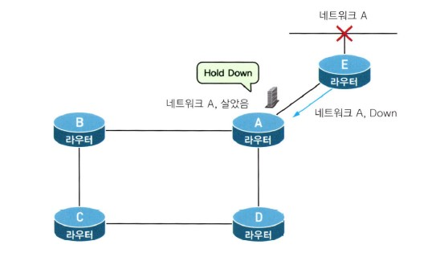

스플릿 호라이즌은 한마디로 말하면 라우팅 정보가 들어온 곳으로는 같은 정보를 내보낼 수 없다는 것입니다.  
즉 위 그림에서 라우터 A는 네트워크 A에 대한 정보를 다시 라우터 E쪽으로는 내보낼 수 없다는 것입니다. 이러한 스플릿 호라이즌이 뜻하는 바는 만약 하나의 라우터가 어느 네트워크 정보를 인접한 라우터에서 받았다면, 그 인접한 라우터가 그 네트워크에 더 가까이 있을 것이 분명하며, 이러한 정보를 다른 라우터들로부터 더 이상 받을 필요가 없다는 것입니다.

여기에서 라우터 A가 모든 라우팅 업데이트를 라우터 E쪽으로 보내지 않는 것은 아닙니다. 다만 네트워크 A에 대한 라우팅 정보만 보내지 않는 것입니다.  
스플릿 호라이즌에 대해서 또 하나 알아두셔야 할 점은 스플릿 호라이즌은 두 라우터 간의 루핑만을 막기 위해서 만들어진 기술이라는 것입니다.  
따라서 전체 라우터 네트워크의 루핑을 스플릿 호라이즌을 가지고 막는 것은 어렵습니다.

이번에는 라우트 포이즈닝(Route Poisoning)에 대해서 알아보도록 하겠습니다. 라우트 포이즈닝은 뭔가 '극약 처방' 같은 느낌이 나는 말입니다. 여기서 포이즈닝이란, 라우팅 테이블에 극약 처방을 한다는 것입니다.  
아래 그림을 보면 네트워크 A가 다운되자 라우터가 네트워크 A에 대한 메트릭 값을 16으로 바꾸었습니다. 즉 사용할 수 없는 값으로 만들어버린 겁니다. 그 대신 라우팅 테이블에서 지워버리지는 않았습니다.

이때 라우터 A에서 네트워크 A에 대한 업데이트 정보가 들어와도 라우터 E는 그것을 무시합니다. 그리고 나서 라우터 E는 네트워크 A에 대한 메트릭 값을 16으로 해서 내보내는 겁니다. 따라서 라우터 A는 이제부터는 네트워크 A에 대한 메트릭을 16으로 갖게 됩니다.  
이런 식으로 다운된 네트워크를 먼저 무한대치로 바꾸어 버리는 방식이 바로 라우트 포이즈닝이라고 생각하면 됩니다. 이렇게 되면 라우팅 테이블에서 지워버렸다가 잘못된 라우팅 정보를 받는 일을 미리 막을 수 있는 효과가 있습니다.

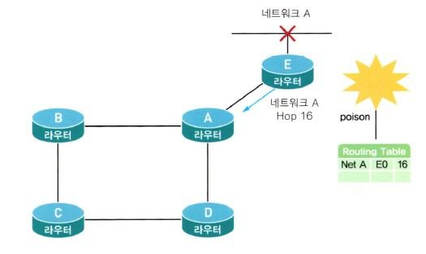

마지막으로 포이즌 리버스(Poison Reverse)에 대해서 알아보겠습니다. 포이즌 리버스는 스플릿 호라이즌을 약간 변형했다고 생각하면 이해가 쉬울 겁니다.  
또 다른 명칭으로는 '포이즌 리버스 업데이트를 사용한 스플릿 호라이즌(Split horizon with poison reverse update)'이라고도 표기하는 이 방식은 스플릿 호라이즌처럼 라우팅 정보를 보내온 쪽으로 알려주지 않는 것이 아니라 라우팅 정보를 되돌려 보내기는 하되 이 값을 무한대 값으로 쓰는 방식입니다.  
왜 이런 방법을 쓸까 한번 생각해 볼까요?

홉 개수가 무한대라는 뜻은 앞서 다루었듯이 경로를 사용할 수 없다는 것이라서 라우터는 이 경로에 대한 라우팅 업데이트를 무시하는 것이 됩니다.  
따라서 경로의 정보를 아주 없애는 것보다 무한대 홉 값을 포함해서 라우팅 업데이트를 실시한다면 다른 모든 라우터들은 실수로 잘못된 경로 정보를 사용하는 경우를 크게 줄일 수 있기 때문입니다.

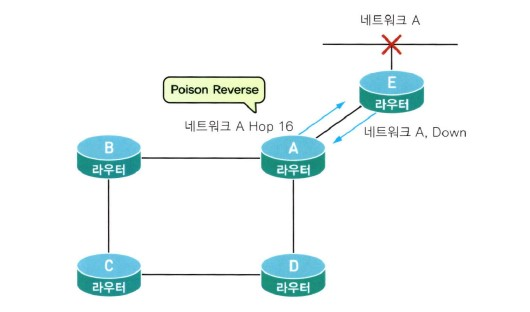

하지만 여기서 중요한 것은 스플릿 호라이즌은 포이즌 리버스 기능이 첨가되든지 또는 안 되든지 라우팅 루프를 자기 라우터랑 붙어있는 인접 라우터에서만 방지할 수 있다는 것입니다. 따라서 어느 하나만의 루핑 방지 방법을 사용하는 것이 아니라 여기에 있는 여러 가지 방식을 적절하게 활용하는 것이 중요합니다.

아무튼 시험에서도 꼭 이 부분에 대한 문제가 한두 문제씩은 고정 출연(?)하고 또 제대로 이해해 놓지 않으면 계속 골치가 아픈 부분이므로 여기 나와있는 몇 가지 루핑 방지법에 대해서는 특징을 확실히 알아두기 바랍니다.  
특히 스플릿 호라이즌이라는 것을 확실히 알아두기 바랍니다. 꼭 쓸모가 있으실 겁니다.

자, 그럼 여기까지의 결론을 알아볼까요? 디스턴스 벡터 알고리즘은 쉽고, 간편하고, 또 라우팅 테이블을 적게 사용하는 등 여러 가지 장점이 있지만, 루핑이 발생하기 쉽다는 단점을 가지고 있습니다.  
그래서 사용되는 루핑 방지법이 있는데, 라우팅 메트릭스를 제한하는 방식입니다. RIP의 경우 최대 홉 카운트를 15까지로 제한(16부터는 Unreachable입니다.)하면서 무한의 루핑을 방지하지만, 커다란 네트워크에서는 거리 제한이 있는 약점이 있습니다.  
또한 한 번 다운된 경로에 대해서는 일정 시간 동안 라우팅 업데이트를 받지 않는 홀드 다운이나, 라우팅 정보를 받은 쪽으로는 같은 라우팅 정보를 보내지 않는 스플릿 호라이즌, 그리고 이를 응용한 포이즌 리버스 등 여러 가지 루핑 방지법이 있는데, 이들을 적절히 잘 활용해야 합니다. 여기까지입니다.

> 질문 있어요! QnA

Q 라우터에서 VLSM이라는 말이 많이 나오고, 또 요즘 라우팅 프로토콜은 VLSM이 지원되어야한다고 말하는데, 도대체 VLSM이 뭐고 또 왜 필요한지 알려주세요.

A 네, VLSM(Variable Length Subnet Mask)은 쉽게 말씀드리자면 라우터의 각 인터페이스별로 서브넷 마스크가 전부 제각각인 경우를 말합니다. 즉 여러 종류의 서브넷 마스크를 VLSM이라고 합니다.

그런데 라우팅 프로토콜이 VLSM을 지원하는가, 지원하지 않는가는 요즘 들어 우리가 인터넷을 많이 사용하게 되면서 더욱 더 강조되기 시작했습니다.

왜냐하면 전에는 우리가 인터넷을 사용하지 않아 주로 비공인 IP 주소를 많이 사용했기 때문에 IP 주소를 아껴서 쓸 필요가 없었습니다. 그러니까 대부분은 서브넷 마스크를 그리 중요하게 생각하지 않고 디폴트 서브넷 마스크를 많이 사용하곤 했습니다.

그런데 인터넷을 사용하면서부터 IP 주소가 모자라기 시작하니까 서브넷 마스크의 중요성이 점점 커진 겁니다. 그래서 이더넷쪽 서브넷 마스크와 시리얼쪽 서브넷 마스크를 서로 같게 하지 않게 된 겁니다.  
물론 여러 개의 이더넷이 있는 라우터에서는 같은 이더넷이라도 네트워크의 크기에 따라서 서브넷이 서로 달라지기 시작한 겁니다. 즉 하나의 라우터에 여러 개의 서브넷 마스크가 존재하기 시작한 겁니다.

이렇게 VLSM을 사용하게 되면 IP 주소를 효율적으로 사용할 수 있기 때문입니다.

불행히도 RIP나 IGRP 라우팅 프로토콜은 VLSM을 지원하지 못합니다. 아마도 인터넷시대 이전에 나온 프로토콜이라 그런 모양입니다. 아무튼 이 두 프로토콜은 라우팅 테이블을 서로 주고받을 때 뒤에 붙는 서브넷 마스크를 인식하지 못하기 때문에 당연히 VLSM을 이해 못하는 겁니다.  
따라서 라우터에 VLSM을 세팅하는 경우에는 RIP나 IGRP 라우팅은 사용하지 않아야 합니다. 이 경우에는 스태틱 라우팅 프로토콜이나 EIGRP나 OSPF 같은 라우팅 프로토콜을 권고합니다.

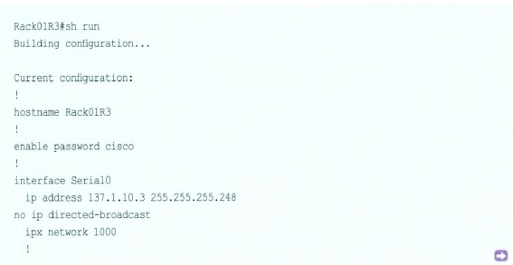

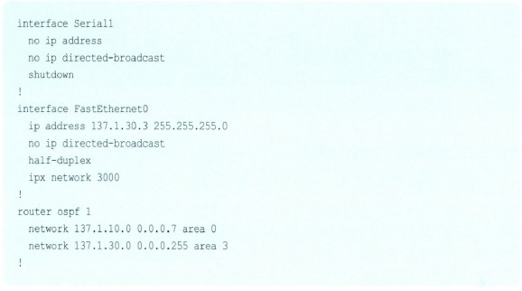

위의 구성을 잠깐 볼까요? 구성에서 Serial 0 인터페이스와 FastEthernet 0 인터페이스의 서브넷 마스크가 다르게 되어 있죠? 이렇게 서로 다른 서브넷 마스크를 가지는 것을 VLSM이라고 합니다.  
그리고 아래 OSPF 구성 세팅을 보면 서브넷 마스크 정보가 뒤에 붙어다니고 있음을 알 수 있습니다. (0.0.07, 0.0.0.255하는 것들이 서브넷 마스크 정보입니다.)

아직은 OSPF를 배우지 않았으니까 그냥 이런 게 있구나라고 생각하고 넘어가도록 하겠습니다.

> 알고 갑시다!

<b>자, 그럼 VLSM에 대한 결론을 내려볼까요?</b>  
VLSM(Variable Length Mask)은 IP 주소의 효율적 이용을 위해 한 라우터에 접속되는 네트워크마다 서로 다른 서브넷 마스크를 줄 수 있도록 만든 규칙이다.  
그런데 RIP나 IGRP는 라우팅 테이블을 서로 주고받을 때 서브넷 마스크 정보를 포함하지 않기 때문에 모두 디폴트 서브넷 마스크만 사용해서 VLSM을 지원하지 못한다. 만약 VLSM을 사용하려면 EIGRP나 OSPF를 사용하면 된다.

## IGRP 라우팅 프로토콜

이번 시간에는 RIP와 같은 디스턴스 벡터 라우팅 프로토콜 중의 하나인 IGRP(Interior Gateway Routing Protocol)에 대해서 알아보도록 하겠습니다.

사실 RIP 초기에 만들어진 프로토콜이다 보니 인터넷 환경이 이렇게 커나갈 줄 모르고 만들어진 부분이 많습니다. 특히 최대 홉 카운트 15라는 것과 가장 좋은 경로를 찾는 방식이 오직 Hop, 즉 라우터를 몇 개 건너 뛰어야 하는가 등은 치명적인 약점이 아닐 수 없었습니다. 1980년대 중반에 IGRP가 나오게 된 것은 아마도 이런 여러 가지 이유 때문이 아니었을까 생각됩니다.

자, 시작해 볼까요?

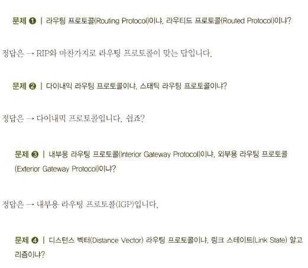

즉 Bandwidth, 이것은 우리말로 '대역폭'이란 뜻입니다. 다시 말해서 속도를 의미합니다. 단위는 초당 킬로비트로 나타내서 Kbps가 됩니다. 가끔 이 값에 대해서 질문을 하는 경우가 있습니다. 지금 속도와 이 값을 맞추어야 통신이 되느냐고 말입니다. 하지만 이 값은 회선을 개봉하거나 통신 속도를 하드웨어적으로 맞추어 주는 값이 아닙니다.

IGRP와 같이 Bandwidth를 이용해서 최적의 경로를 찾는 프로토콜들이 참고하기 위한 값이라고 생각하면 됩니다. 즉 어떤 경로를 선택할까를 결정할 때 세팅되어 있는 Bandwidth 값을 보는 겁니다. Bandwidth의 세팅은 각 인터페이스에 가서 해주면 됩니다. 즉

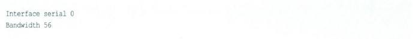

이라고 하면 56Kbps의 대역폭을 갖는다고 세팅한 것입니다. 아래는 실제로 세팅하는 예를 보여주고 있습니다.

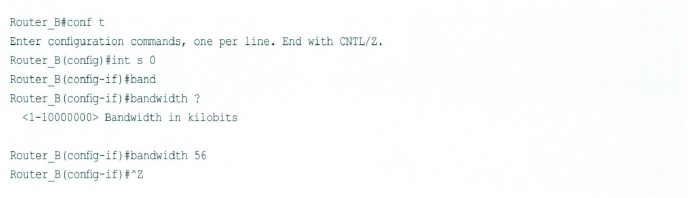

이처럼 bandwidth를 세팅한 값은 show interface에서 확인해 볼 수 있습니다. 만약 Bandwidth 명령을 사용하지 않고 디폴트를 그대로 둔다면 Bandwidth 값은 1,544Mbps를 가지게 됩니다.

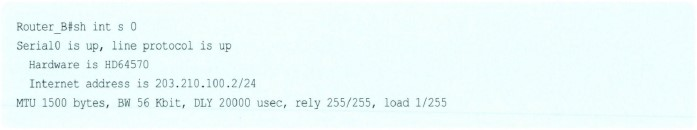

Delay, 이것은 우리말로 '지연'이라는 뜻입니다. 경로를 통해서 도착할 때까지의 지연되는 시간이란 의미라고 받아들이면 됩니다. (단위는 마이크로초로 나타내서 micro second입니다.) 원래 이 값은 회선에 아무 트래픽이 없을 때를 가정하고 제공되는 수치이며, 1부터 16,777,215 사이의 값이 오게 됩니다.

IGRP는 라우터 포트에 연결되어 있는 회선의 종류와 설정된 대역폭 값에 따라서 지연 값을 계산하도록 되어 있습니다. 물론 수동으로 지연 값을 집어 넣어줄 수는 있지만, 지연 값보다는 다른 변수 값을 바꾸는 방법이 더 유용하기 때문에 대부분은 디폴트 값을 그대로 사용합니다.

- Reliability : 우리말로 '신뢰성'을 뜻합니다. 케이블이나 전용선 등 전송 매체를 통해 패킷을 보낼때 생기는 에러율을 나타내는 수치입니다. 다시 말하자면 목적지까지 제대로 도착한 패킷과 에러가 발생한 패킷의 비율입니다. Keepalive라는 것을 이용해서 출발지와 목적지 사이 경로의 신뢰도를 측정합니다. (단위는 0에서 255 사이의 정수로 표시되는데, 255가 가장 신뢰성이 좋은 것이고 숫자가 낮아지면 신뢰도는 떨어집니다.) 또한 이 값은 자동으로 계산되는 값입니다.
- Load : 우리말로 '부하', '하중' 등을 의미합니다. 즉 출발지와 목적지 경로에 어느 정도의 부하가 걸리고 있는지를 측정합니다. (단위는 255분의 몇으로 나타내는데, 1/255이면 부하가 적은 것이고 255/255이면 부하가 많이 걸리는 것을 의미합니다.)
- MTU : Maximum Transmission Unit의 약자로, 경로의 최대 전송 유닛의 크기를 말하고, 바이트로 표시됩니다.

따라서 이 5가지로 경로 선택을 하기 때문에 홉(Hop) 카운트만 가지고 목적지를 찾는 RIP와는 달리 좀 더 지능적으로 경로를 선택할 수 있습니다.

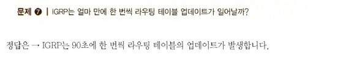

이 외에도 앞에서 말씀드렸던 것처럼 IGRP는 RIP처럼 15개의 라우터 이상을 넘어가지 못한다는 제약을 극복하기 위해 최대 홉 카운트 255로 커다란 네트워크의 적용에도 문제가 없습니다.

하지만 RIP나 IGRP의 경우는 VLSM(Variable Length Subnet Mask)을 지원하지 못하는 약점이 있고, 또 IGRP는 시스코 라우터에서만 적용된다는 단점도 가지고 있습니다.

VLSM이 뭔지는 앞에서 설명드렸습니다.

우리가 RIP에서 보았던 똑같은 그림을 이번에는 IGRP에서 보도록 하겠습니다.

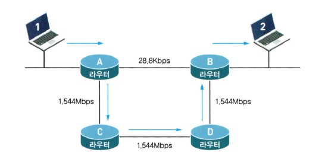

그림에서 보는 대로 IGRP 라우팅 프로토콜은 홉(Hop) 카운트가 아닌 위에서 설명드린 5가지의 요소를 가지고 경로를 찾아가기 때문에 속도가 빠른 아래쪽 경로를 선택할 수 있게 되는 겁니다. 역시 RIP보다는 똑똑하죠?

그럼 이제부터는 IGRP를 이용한 라우터 구성에 사용되는 명령어를 알아보도록 하겠습니다.

IGRP 구성을 위해서 사용할 명령어는 2가지인데, 전에 배운 RIP와 거의 유사합니다.

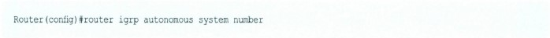

즉 라우터의 일반 구성 모드에서 router igrp라고 입력하고 뒤에는 AS 번호를 넣어주는 겁니다.

RIP에서는 router rip만 했는데, 여기서는 그 뒤에 AS 번호를 넣는다는 것이 조금 차이가 있습니다. 이때 넣어주는 AS 번호는 전에도 한 번 설명을 들은 기억이 있을 겁니다. 즉 동일한 운영 방식 또는 운영자 아래 있는 라우터의 그룹을 AS라고 하니까 그룹별로 붙여놓은 번호라고 생각하면 될 겁니다.

여기서는 AS 번호에 대해서 크게 부담을 안 가지셔도 됩니다. 다만 서로 통신을 해야 하는 라우터들은 서로 같은 AS 번호를 가져야만 통신을 원할하게 할 수 있습니다. 물론 서로 달라도 통신이 가능하긴 하지만 뭔가 조치를 취해 주어야만 합니다.

두 번째 명령은 RIP에서도 있었던 network 명령입니다.

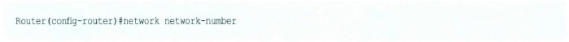

즉 IGRP 라우팅에 참가하는 네트워크를 지정하는 것입니다. 따라서 이 명령은 항상 router igrp as-number 다음에 내려주어야 합니다. 한 번 내린 network 명령을 수정할 때도 마찬가지입니다. 반드시 router igrp as-number 명령을 먼저 쓰고 나서 수정을 해야 합니다.

RIP나 IGRP에서 network 명령 뒤에 오는 network-number는 항상 클래스 개념으로 들어갑니다. 예를 들어 Ethernet 인터페이스에

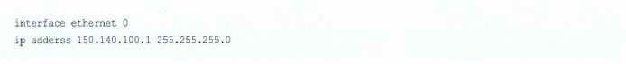

이라고 네트워크를 지정했다고 가정해 보겠습니다. 여기에서 보이는 대로 이더넷에 원래 부여한 네트워크 150.140.100.1 255.255.255.0은 원래는 클래스 B인 것을 서브넷 마스크를 이용해서 클래스 C처럼 사용하고 있다는 것을 알 수 있습니다.

이 상황에서 network 명령 뒤의 network-number에 제가 만약 150.140.100.0이라고 입력했다고 가정하겠습니다. 즉 다음과 같습니다.

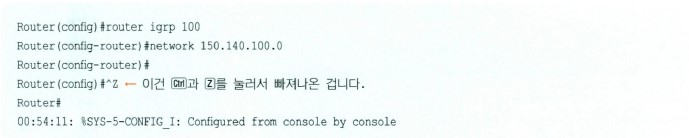

그리고 나서 지금까지 입력한 구성 파일을 다시 보려고 running configuration을 했습니다.

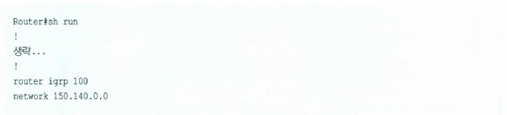

이렇게 분명히 150.140.100.0을 입력해 넣었는데도 라우터에서 자동으로 이것을 150.140.0.0으로 인식해 버렸습니다. 즉 IGRP나 RIP는 뒤의 서브넷에 대한 인식 기능이 상당히 많이 떨어져서 서브넷을 인터페이스별로 따로 주는 방식은 VLSM을 지원하지 못합니다.

자, 이제 지난 시간에 RIP로 구성했던 실습을 다시 한 번 IGRP를 이용해서 구성해 보겠습니다. 먼저 구성을 다시 한 번 볼까요?

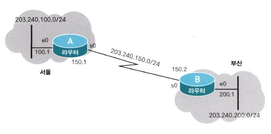

RIP와 똑같은 상황을 이번에는 IGRP를 이용해서 구성해보겠습니다.

달라지는 것은 단지 라우팅 명령뿐입니다. 즉 인터페이스별 주소 배정이나 암호, 호스트네임등은 모두 RIP를 구성할 때와 동일합니다.

본사 라우터 부분은 먼저 인터페이스에 부여하는 IP 주소와 동일합니다.

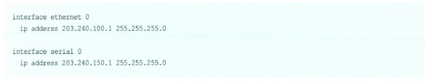

이제 라우팅 프로토콜 부분입니다. 실습에서는 AS 번호를 200으로 사용하기로 가정합니다.

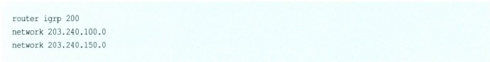

위에서 보이는 것처럼 RIP 구성과 달라진 것은 별로 없습니다. 이번에는 부산쪽 라우터를 알아보겠습니다.

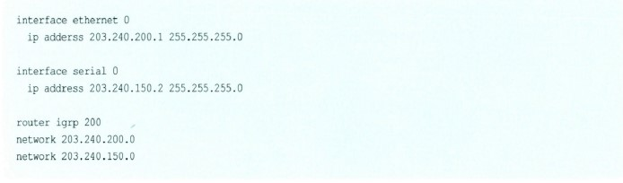

이때 부산과 서울 본사의 경우는 모두 IGRP AS 번호를 200으로 통일했습니다. 만약 이 두 번호가 다르다면 통신에 문제가 발생합니다. (물론 서로 달라도 통신을 가능하도록 하는 방법이 있습니다.) 나머지는 큰 차이가 없습니다. 전체 라우터 구성을 한번 보겠습니다.

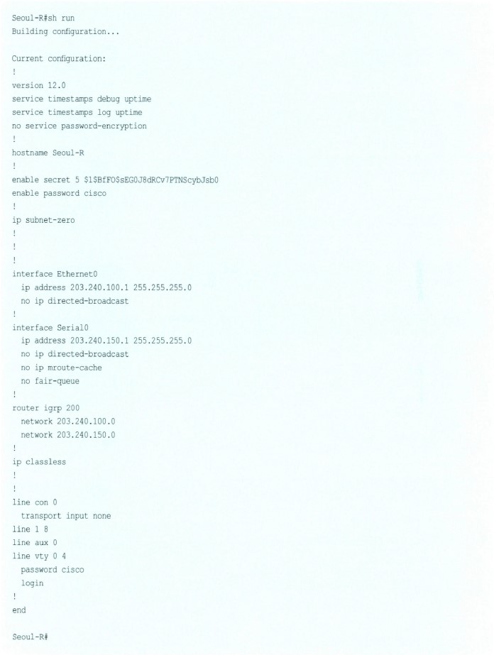

자, 이번에는 부산 라우터입니다.

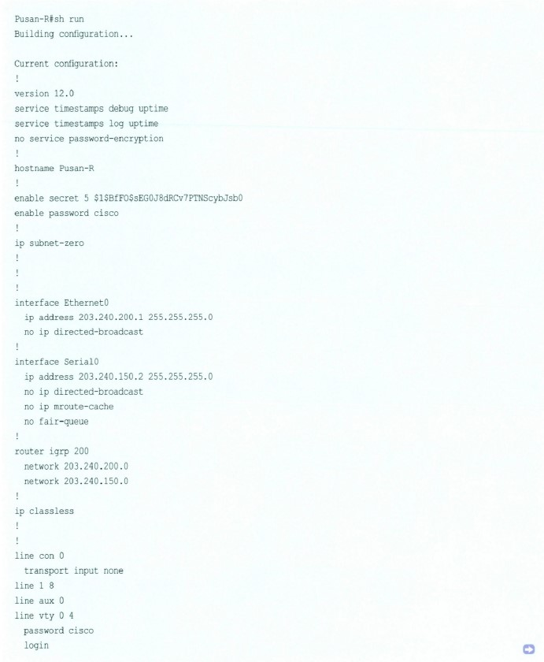

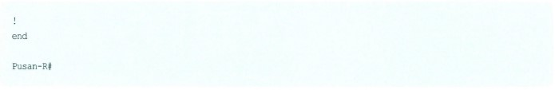

라우터 구성 후에 IGRP 라우팅의 상태를 보는 명령은 RIP 때와도 비슷합니다. 즉 show ip protocol을 이용해서 현재 라우팅에 대한 정보를 알아볼 수 있고, 또 라우팅 테이블 정보를 보기 위해서는 show ip route라는 명령을 사용합니다.

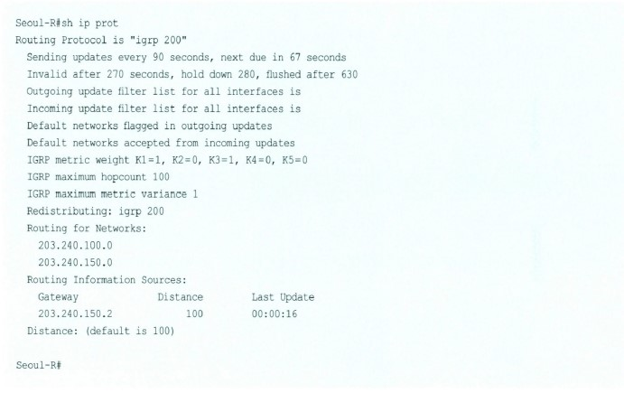

대충 이렇게 보입니다.

이제는 조금 내용이 눈에 들어오실 겁니다. 즉 여기서 보니까 현재 IP 라우팅 프로토콜로는 IGRP 200이 동작하고 있습니다. 또 라우팅 테이블의 업데이트 시간은 매 90초마다 한 번씩이라는 것도 알 수 있습니다.

게다가 디스턴스 값이 100이라는 것도 보입니다. RIP는 디스턴스 값이 얼마였는지 기억하세요? 아마 120이었을 겁니다. 그렇다면 IGRP와 RIP, 2개가 길 정보를 가져왔다면 라우터는 어떤 길을 선호할까요? 그것은 디스턴스 값이 작은 IGRP로부터 받은 정보입니다.

이번에는 라우팅 테이블을 확인해 보도록 하겠습니다.

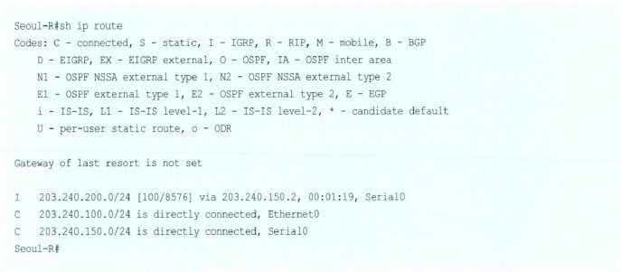

라우팅 테이블 정보를 보면 맨 위에 있는

가 바로 IGRP에서 얻어낸 라우팅 정보입니다. I가 바로 IGRP를 의미합니다. 즉 IGRP를 통해서 203.240.200.0 네트워크를 찾았는데, 이 네트워크는 203.240.150.2(serial 0)를 통해서 갈 수 있다는 것입니다.

이때 IGRP 라우팅의 디스턴스(Distance)는 100이고, 매트릭스 값은 8576이 됩니다.

나머지는 맨 앞이 C로 시작되니까 Connect를 의미한다는 걸 전에 설명드렸던 거 기억하죠?

> 알고 갑시다!

<b>그럼 IGRP 라우팅에 대한 결론을 알아볼까요?</b>  
IGRP도 RIP처럼 디스턴스 벡터 알고리즘 중의 하나이지만, RIP와는 달리 여러 가지 요소를 가지고 경로를 찾기 때문에 좀 더 좋은 길을 찾는 능력이 뛰어나고, 홉 카운트의 제한이 없어서 좀 더 큰 네트워크에 적용이 가능하다.  
하지만 VLSM을 지원하지 않아서 요즘 같은 라우팅 환경에서는 자주 사용하지 않는 라우팅 프로토콜이다.

이번에는 여러분이 직접 IGRP를 이용해서 구성을 연습해 보겠습니다. 아래 그림은 여러분이 앞에서 RIP을 구성해 보았던 그림입니다. 기존에 PC A와 PC B 간에 있는 라우터를 RIP로 구성해서 두 PC가 통신이 되도록 했습니다.  
이번에는 그것을 IGRP 구성으로 바꾸어 보겠습니다.

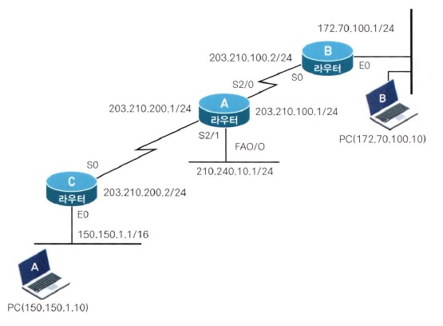

먼저 라우터 C의 구성입니다. 우선은 기존에 만들어주었던 RIP 라우팅을 Disable, 즉 없애주어야 합니다. 그리고 IGRP를 Enable해 주도록 하겠습니다.  
참고로 시스코 라우터에서 어떤 명령을 지우고 싶을 때는 그 명령을 주었던 모드로 들어가서 앞에 'no'를 달아주면 됩니다.  
예를 들어 ip route 0.0.0.0 0.0.0.0 150.100.1.1이라는 스태틱 라우트 명령을 없애고 싶으면 구성모드에 들어가서 no ip route 0.0.0.0 0.0.0.0 150.100.1.1이라고 명령하면 지워집니다.  
따라서 라우터 C의 경우 이미 RIP가 구성되어 있기 때문에 기존 구성을 보면,

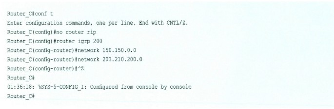

아마 쉽게 이해될 겁니다. 기존에 사용했던 IP 주소는 그대로 사용하기 때문에 따로 구성해줄 필요가 없습니다.

다음은 라우터 A입니다.

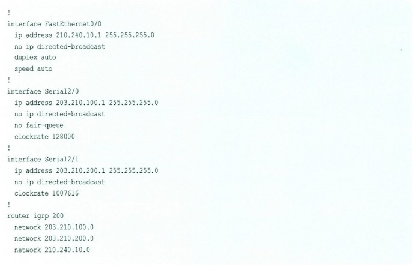

라우터 A 역시 라우터 C와 마찬가지로 구성했습니다. 참고로 no router rip라고 명령을 입력하면 router rip 아래에 있던 네트워크 명령은 모두 사라지기 때문에 나중에 router igrp 200 뒤에 네트워크 명령을 다시 잡아주어야 합니다.

다음은 라우터 B입니다.

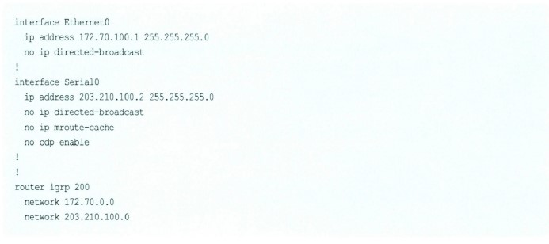

지금 보셔서 아는 바와 같이 뒤에 붙는 AS 번호만 제외한다면 RIP 구성과 동일합니다. 전혀 다른 것이 없습니다. 일단 모든 라우터에 구성을 마쳤으면 검증을 시작해보겠습니다.  
라우터 C에서 172.70.100.0 네트워크에 접속되는가를 보려면 간단히 핑 테스트를 해보면 되지만, 우선은 라우팅 테이블에 172.70.100.0이 있는지를 확인하겠습니다.

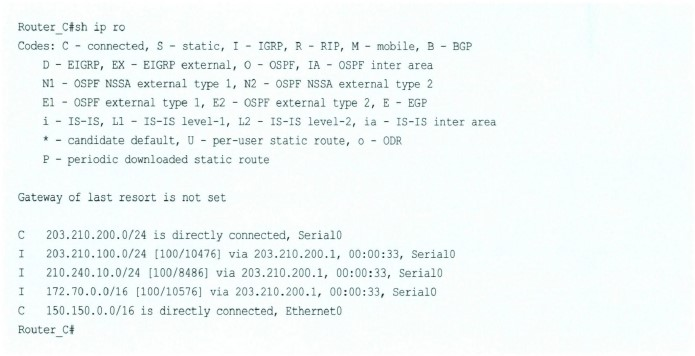

보이는 대로 172.70.0.0 네트워크가 라우터 C의 시리얼 0 인터페이스를 통해서 연결되어 있음을 보여줍니다. RIP 구성과 다른 점은 라우팅 테이블에서 보이는 경로 앞에 붙어있는 글자가 R에서 1로 바뀌었다는 것입니다.

일단 라우터 C에서 172.70.0.0 네트워크가 보이니까 이번에는 라우터 B에서 150.150.0.0 네트워크가 보이는지를 확인하면 됩니다. 양쪽에서 확인해야 네트워크가 연결된 것을 알 수 있겠죠? 자, 그럼 라우터 B에 가서 명령을 내려보겠습니다.

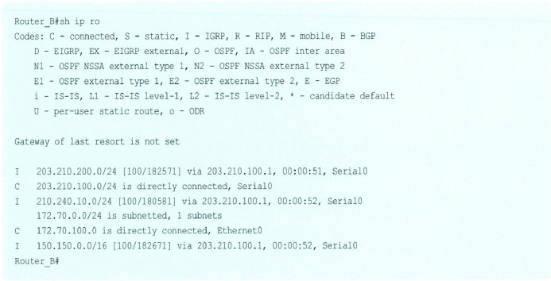

이제 두 라우터에서 양쪽 네트워크를 인식하고 있는 것을 알았습니다. 자, 그럼 이번에는 마지막 확인 단계로 핑이 남았죠? 한번 해볼까요?

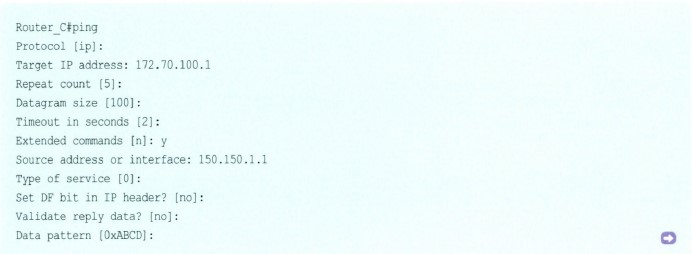

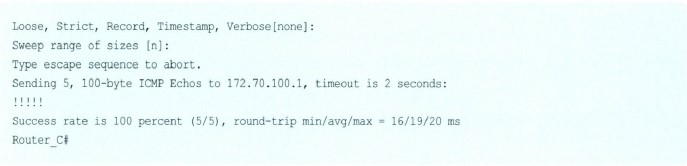

그렇게 어렵진 않죠? 게다가 RIP를 해보셨으면 별로 다른 것이 없다는 것도 알 겁니다.

여기서 잠깐 라우터 구성 후에 현재의 상태를 점검하는 몇 가지 명령어를 알아보겠습니다.  
물론 구성 파일을 보는 명령은 show running-config, show ip route와 show interface뿐만 아니라 show ip protocol과 show ip interface를 보면 현재 구성된 IGRP 구성에 대한 좀 더 자세한 데이터를 알 수 있습니다.

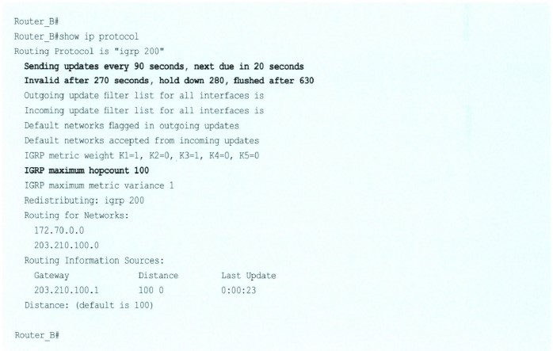

전에도 한번 설명드렸죠? 여기서 눈여겨 보아두어야 할 곳은 조금 굵게 표시했습니다. IGRP의 경우 90초에 한 번 업데이트를 한다는 것은 알고 있었죠? 여기 보면 IGR의 최대 홉 카운트가 100으로 되어 있습니다.  
조금 이상하죠? 아까는 분명히 255가 최대라고 말씀드렸는데 말입니다. 하지만 놀랄 필요 없습니다. 이 값은 디폴트 값이기 때문에 바꾸어 줄 수 있습니다. 이 값을 바꾸고 싶으시면 구성 모드에 가서 바꾸면 됩니다.

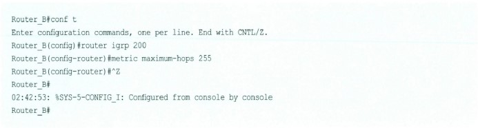

다음은 인터페이스에서의 IP 프로토콜 동작 상태를 보기 위한 명령으로 show ip interface입니다.

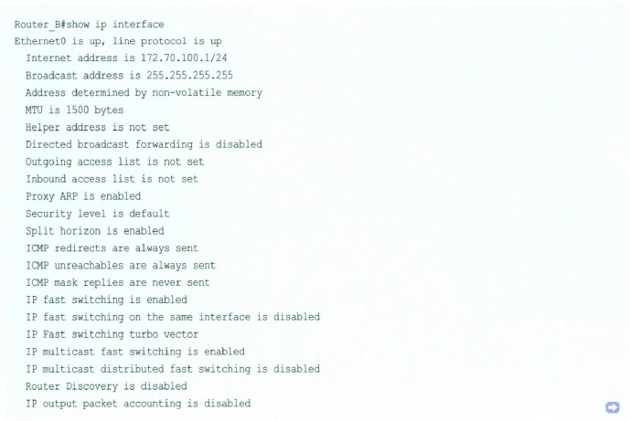

지금까지는 자주 사용하지 않는 명령이지만 여러분이 좀 더 연습을 하고 나서는 꼭 알아두어야 할 것들입니다.  
특히 중간에 있는 스플릿 호라이즌 정보는 이 인터페이스에 스플릿 호라이즌이 Enable되어 있음을 알려주는 중요한 정보입니다.

물론 디버그 역시 몇 가지는 알아두는 게 좋겠죠? "debug ip igrp transactions"를 입력하면 "debug ip rip"명령어를 사용했을 때와 아주 비슷한 결과가 나옵니다.  
즉 IGRP 업데이트가 보내지거나 받아졌을 때 반드시 그 사실을 알려주는데, 바로 그 정보가 이 debug 명령에서 나오는 것입니다.  
또한 라우팅 업데이트에 포함된 네트워크 정보는 관련 메트릭 값과 함께 나오기 때문에 어떤 라우팅 정보가 업데이트되는지도 확인이 가능합니다.

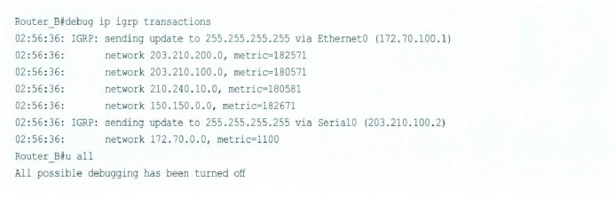

물론 맨 마지막에는 항상 디버그 명령을 꺼야 된다는 것은 계속 강조하고 있으니까 아시죠?

IGRP에서 아셔야 될 것 중에서 마지막으로 한 가지만 첨가하자면 passive interface 명령입니다.  
즉 IGRP 라우팅 업데이트가 특정 인터페이스로는 날아가지 않도록 하고 싶을 때 사용하는 명령입니다.  
간단한 예를 들어 볼까요? 어떤 라우터에 OSPF와 IGRP가 같이 사용된다고 가정 하겠습니다. 즉 다음과 같습니다.

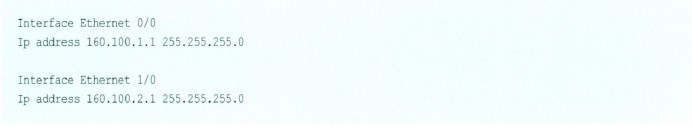

이때 Ethernet 0/0 네트워크는 IGRP를, Ethernet 1/0 네트워크는 OSPF를 사용한다고 가정해보면 라우팅 프로토콜에 대한 구성은 아래와 같이 될 겁니다.

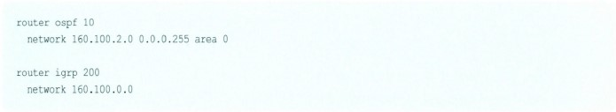

아직 OSPF를 배우진 않았지만 대충 구성을 보면 앞에서도 말씀드린 것처럼 OSPF는 160.100.2.0 네트워크만을 포함하는 반면, IGRP 네트워크는 160.100.0.0 모두를 포함해서(이건 IGRP의 특징이라고 말씀드렸죠? 서브넷 정보를 포함하지 않는 것 말입니다.)  
OSPF 라우팅 정보만 나가야 할 Ethernet 1/0 인터페이스까지 IGRP가 날아가게 됩니다. 따라서 이때는 Ethernet 1/0에 대해서 IGRP를 passive로 만들어 주는 것이 좋은데, 사용하는 명령이 바로 passive interface입니다.  
즉 다음이라고 하면 IGRP 라우팅 업데이트가 Ethernet 1/0로는 날아가지 않게 됩니다.

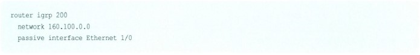

아무튼 이 passive interface 명령도 가끔은 사용해야 하니까 잘 알아두기 바랍니다. 아무래도 한 번 들은 것과 들어보지 않는 것과는 차이가 나겠죠?

자, RIP과 비슷한 IGRP에 대한 공부는 여기까지입니다.

> 네트워크 플러스+

### 네트워크의 성능은 PPS라구요!

자, 이번에는 가벼운 마음으로 그냥 한번 읽어보세요. 네트워크의 성능을 이야기할 때 자주 듣는 말인 PPS에 대해서 한번 알아보는 시간을 가지려고 합니다.

복잡했던 라우터는 잠깐 잊기로 하겠습니다. PPS는 초당 전송하는 패킷 수, 즉 Packet Per Second를 말합니다. 벌써 다 알고 계신다구요? 그럼 PPS란 것을 어떻게 계산하는지 볼까요?

만약 우리가 10메가 속도의 이더넷을 쓴다고 가정해 보겠습니다.

이 경우 Packet Per Second의 계산식은 다음과 같습니다.

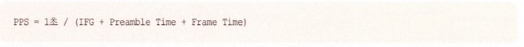

갑자기 산수가 나오니까 머리 아프다구요? 하지만 별거 아니니까 한번 끝까지 읽어보기 바랍니다. 즉 1초에 몇 개의 패킷이 날아가는지를 재보는 거니까 한 패킷이 날아가는 데 몇 초 걸리는지를 알아본 다음에 이것으로 1초를 나누는 겁니다.

이해가시죠?

자, 그럼 한번 해보겠습니다.

일단 IFG는 Inter Frame Gap이라고 하는 녀석으로, 프레임과 프레임 사이의 간격을 말합니다. 즉 프레임들이 날아갈 때 띄어두어야 하는 최소 간격을 의미합니다.  
예를 들어 자동차에서의 안전거리 정도라고 생각하면 이해가 될 겁니다. 아무튼 이 거리를 시간으로 따지면 9.6micro초(백만 분으 ㅣ1초가 1마이크로초)입니다.

Preamble Time, 즉 프레임 앞에 붙는 서두 또는 서론 정도라고 하는 시간이 6.4마이크로초가 있습니다.

Frame Time은 프레임이 날아가는 시간입니다. 만약 이더넷에서의 가장 작은 프레임 크기인 64바이트짜리가 날아간다고 가정할 경우 64바이트는 비트로 바꾸면 64 * 8 = 512비트가 되고, 1비트가 날아가는 데 걸리는 시간이 0.1마이크로초니까 512비트이면 51.2마이크로초가 됩니다.

자, 이제 재료 준비가 끝났으니 전체 계산만 해보면 되겠네요.

64바이트 프레임에 대한 PPS는 다음과 같이 나옵니다.

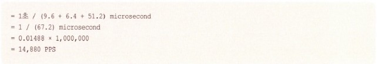

즉 10메가의 이더넷에서 가장 작은 패킷만 계속 날려보낼 경우에 초당 14,480패킷이 날아간다는 결론이 나오는 셈입니다.  
따라서 만약 어떤 장비가 지원하는 PPS가 14,880PPS보다 못하다면 10메가 이더넷에서 제대로 성능을 발휘할 수가 없는 겁니다.

물론 네트워크의 속도가 올라가면 PPS도 올라가야 됩니다. 즉 100메가 네트워크에서는 14,880PPS보다 대충 10배는 빠른 PPS가 제공되어야 하고, 기가비트에서는 100배 정도가 빨라야 한다는 것은 아마 이해가 될 겁니다.

따라서 네트워크에 대한 장비, 즉 스위치나 라우터의 카탈로그에는 항상 지원하는 PPS 값이 나오게 되는데, 여러분은 이제부터 이런 기준으로 PPS 값을 자세히 확인해 보기 바랍니다.

> 네트워크 플러스+

### 라우터를 이용한 DHCP 서버의 구성

DHCP라면 여러분도 잘 알고 있을 겁니다. 전에도 한번 설명을 드렸지만 요즘은 워낙 많이 사용하는 기능이니까 굳이 설명드리지 않아도 될 겁니다.

그래도 정리하는 기분으로 한번 살펴볼까요? DHCP(Dynamic Host Configuration Protocol)는 PC나 호스트가 자신의 IP 주소를 자동으로 배정하여 IP 주소를 편리하게 관리하고, IP 주소를 효율적으로 사용하게 하는 방식입니다. (여기까지는 다 아시는 거죠?)

4장에서도 한번 다루었는데요. 이번에는 라우터에서 DHCP 서버 구성을 해줌으로써 라우터가 IP 주소를 자동으로 분배할 수 있게 구성해보겠습니다.

먼저 아래 그림을 다시 한 번 보면서 DHCP에 대해서 이해해 보기 바랍니다. 그림 아래쪽에 있는 DHCP 서버는 자신이 IP 주소의 Pool을 가지고 있다가 IP 주소 요청이 들어오면 하나씩 배정을 하고 있습니다.

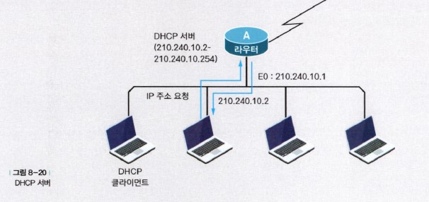

이전에도 설명드린 것처럼 원래 DHCP 서버의 역할을 윈도우 NT 서버나 노벨의 넷웨어 서버 등 서버급들이 지원하는데, 시스코의 경우는 라우터에서도 이 기능을 지원하고 있습니다.

아래 그림을 보기 바랍니다. 라우터 A는 DHCP 서버 역할을 수행합니다. 아래에 붙어있는 클라이언트 PC들은 부팅하면서 라우터 A에 IP 주소를 요청합니다.  
그러면 라우터 A는 자신이 관리하는 주소 중에서 하나씩을 배정하는 겁니다. 자, 그 과정을 하나하나 알아보도록 하겠습니다.

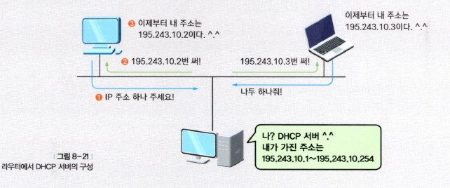

먼저 라우터에서 DHCP 서버를 구성해주기 위해서는 다음 명령을 입력해야 합니다.

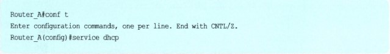

즉 라우터에서 DHCP 서버나 전달 에이전트를 Enable해주는 명령입니다. 디폴트 값이 Enable이기 때문에 특별히 해주지 않아도 되지만 확실히 해주기 위해 넣었습니다.

그 다음은

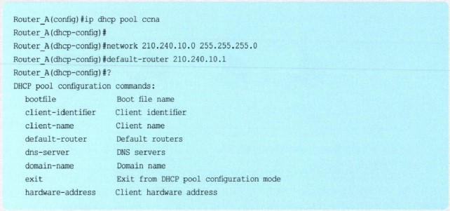

ip dhcp pool ccna처럼 DHCP 주소의 Pool(영역)을 지정해 줍니다. 먼저 Pool의 이름을 만들어주는데, 우리는 ccna라고 주었습니다. 여기에서 이름은 아무거나 주어도 됩니다. 여러분 기분에 맞게 하나 주면 됩니다.

자, 이렇게 Pool 이름을 지정하고 나니까 프롬프트가 Router_A(config)#에서 Router_A(dhcp-config)#로 바뀌었습니다. 즉 DHCP 구성 모드로 들어온 것입니다. 여기서 가장 먼저 해주어야 하는 구성은 바로 IP Pool의 지정입니다.

network 210.240.10.0 255.255.255.0로 Pool을 지정한 것은 IP 주소의 범위가 210.240.10.1~210.240.10.254까지임을 뜻합니다.  
즉 이 범위의 IP 주소를 가지고 있다가 IP 주소에 대한 요청이 들어오면 하나씩 나누어주는 겁니다.

그리고 또 하나 꼭 해주셔야 하는 것은 디폴트 라우터의 지정입니다. 호스트가 내부 네트워크에서 목적지를 찾지 못했을 때 달려가는 라우터의 IP 주소입니다.  
이 디폴트 라우터 주소는 무엇이 될까요? 당연히 바로 자기 네트워크에 붙어있는 라우터의 주소가 됩니다. 그래서 여기 그렇게 지정했습니다. 보이시죠?

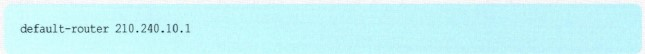

아래 TCP/IP 등록 정보 그림에서도 나타나 있지만 디폴트 라우터는 바로 네트워크에 붙어있는 라우터의 이더넷 인터페이스가 됩니다.

그리고 Router_A(dhcp-config)# 모드에서는 그 밖에도 많은 옵션을 세팅해줄 수 있습니다. 사용 가능한 세팅 값이 위에 나와 있으니 참고하기 바랍니다.  
예를 들어 DNS 서버에 대한 정보나 도메인 네임을 세팅해줄 수도 있고 DHCP IP 주소를 배정하는 기간(Lease Time) 등도 자주 사용하는 옵션 중 하나입니다. 기억해 두면 분명히 도움이 될 겁니다.

자, 여기까지 보니까 뭔가 의문이 생기실 겁니다. DHCP용 IP 주소 Pool을 네트워크와 마스크만으로 주다 보니 뭔가 이상한 점이 생깁니다. 그것이 뭘까요?

그것은 바로 이미 사용하고 있는 주소를 제외시켜야 하는데 그럴 수 없다는 겁니다. 예를 들어 현재 라우터의 이더넷 인터페이스는 IP 주소 210.240.10.1을 사용하고 있습니다.  
따라서 DHCP 서버가 IP를 배정할 때는 이렇게 미리 사용하고 있거나 특정 이유로 사용해야 하는 IP 주소를 제외할 필요가 있습니다. 그로인해 이처럼 특정 IP 주소를 배정해주기 위한 명령이 필요합니다.

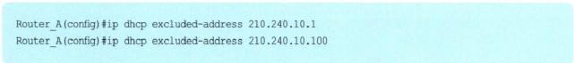

예를 들어 IP 주소 중에서 210.240.10.1은 라우터의 이더넷 주소로, 210.240.10.100은 서버의 주소로 미리 배정되어 있다면 위의 구성 명령을 사용할 수 있습니다. 이렇게 IP dhcp excluded-address 명령을 이용하면 DHCP Pool에서 제외할 IP를 지정해줄 수 있습니다.

모든 것이 다 구성되고 나면 이제 PC를 DHCP 클라이언트로 세팅해서 부팅해보면 됩니다. 전에 PC를 DHCP 클라이언트로 세팅하는 것 설명드렸죠?  
아래 그림을 봅시다. PC에서의 이런 구성은 [시작] 버튼 - [제어판]에서 진행한다는 것을 알고 계실 겁니다.  
그리고 나서 부팅을 하면 PC는 자동으로 라우터 A로부터 IP 주소를 받아오게 됩니다. 이것은 PC에서 ipconfig로 확인해 볼 수 있습니다.

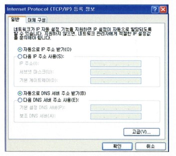

또한 라우터 A에서도 현재 배정해준 IP 주소를 확인해 볼 수가 있는데, show ip dhcp binding을 이용하면 다음과 같이 현재 IP 배정 상태가 나타납니다.

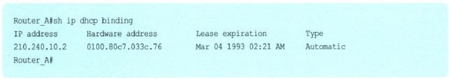

또 현재 DHCP 서버로 돌아가고 있는 라우터 A의 상태 역시 알 수 있는데, show ip dhcp server statistics를 이용해서 확인해 볼 수 있습니다.

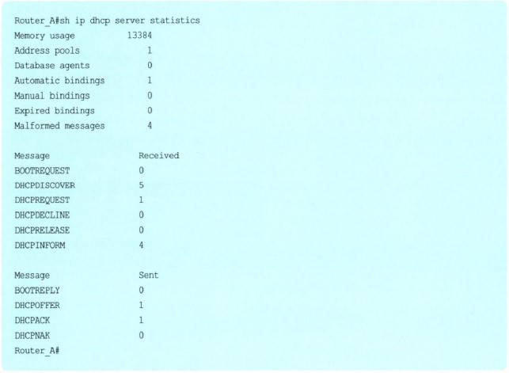

위에서처럼 현재 사용되는 메모리와 DHCP Pool의 숫자, 그리고 몇 개가 배정되었는지 등에 대한 정보를 알 수 있습니다.

이 정도면 라우터를 DHCP 서버로 세팅하는 것은 문제 없겠죠? 여기서 한 가지 더 알아두실건 시스코의 모든 라우터가 모두 DHCP 서버를 지원하는 것은 아닙니다. 사용하는 IOS(운영체제)와 기종에 따라서 차이가 있으니까 확인해보기 바랍니다.

> 질문 있어요! QnA

Q 어느 라우터에서 su run 명령을 준 후의 일부 내용인데요, 라우터를 공부하면서 secondary의 의미와 역할을 모르겠더라구요. secondary IP 주소에 대해서 자세히 알려주세요.

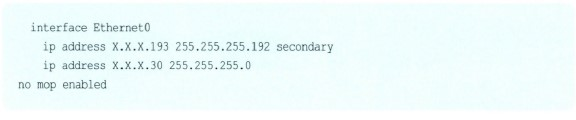

A 네, 이런 경우를 한번 생각해 보겠습니다.

내가 라우터를 하나 가지고 있다고 가정하겠습니다. 모델은 시스코 2501(이 라우터는 이더넷 인터페이스가 하나이고 시리얼, 즉 인터넷 접속용 포트가 2개나 있는 라우터입니다.)을 가지고 있습니다.  
그런데 우리 이더넷에는 약 400명의 사용자가 있습니다. 그리고 나는 IP 주소를 클래스 C로 2개를 받아서 가지고 있습니다.

여기에서는 203.210.100.1~255와 203.210.150.1~255를 받았다고 가정하겠습니다.

그럼 라우터 구성을 어떻게 해야 할까요?

이더넷 인터페이스의 주소를 클래스 C 네트워크 하나로 하려니 주소가 모자랍니다. 그럼 주소 범위 2개를 한 인터페이스 지정할 수 있을까요? 이럴 때 사용하는 것이 바로 secondary 주소입니다. 한 인터페이스에 1개 이상의 주소 범위를 지정하는 것을 말합니다. 이때의 구성 방식은 아래의 예와 같습니다. 즉 다음처럼 하는 겁니다.

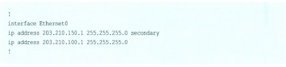

이렇게 구성하게 되면 라우터의 이더넷 인터페이스 주소는 약 500개를 줄 수 있게 됩니다.

자, 그럼 이제 이것을 생각해보죠. 203.210.150.10과 203.210.100.3은 같은 인터페이스에 붙어 있는 PC의 IP 주소입니다. 그럼 이 2대의 PC가 라우터 없이도 통신이 가능할까요?

원래 같은 라우터의 인터페이스에 붙어있는 2대의 PC는 라우터가 죽어도 통신이 되는 성질을 가지고 있습니다. 그런데 여기에서는 그렇지가 않습니다.

즉 203.210.100.3과 203.210.150.10 IP 주소를 가진 두 PC는 비록 같은 라우터 인터페이스에 붙어있긴 하지만 통신을 할 때는 라우터를 한 번 거치게 됩니다. 통신이 일어나는 경로를 살펴보면,

203.210.100.3 :arrow_right: 라우터의 이더넷 인터페이스 203.210.100.1 :arrow_right: 203.210.150.1 :arrow_right: 203.210.150.10  
이런 식으로 경로 설정을 하게 됩니다. 일반적인 경우와는 차이가 난다는 것을 알 수 있습니다. 그림으로 보면 더욱 더 쉽게 이해될 겁니다.

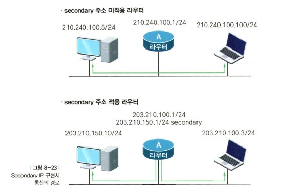

그림에서 위에 있는 구성은 일반적인 라우터입니다. 즉 secondary IP를 구현하지 않았습니다. 따라서 PC 210.240.100.5와 노트북 210.240.100.100은 직접 통신이 가능합니다. 즉 라우터를 거치지 않습니다.  
왜 그런지는 아시죠? PC 210.240.100.5와 노트북 210.240.100.100은 같은 네트워크에 있습니다. 따라서 둘 간의 통신은 라우터를 거치지 않고 일어납니다.

그런데 아래에 있는 그림에서 secondary IP를 라우터에 적용한 경우 같은 이더넷 인터페이스상에 붙어있는 PC들이라고 하더라도 네트워크 부분이 서로 다른 경우는, 즉 203.210.150.10과 203.210.100.3은 라우터를 통해서만 통신이 가능하게 됩니다. 물론 이때도 네트워크 부분이 서로 같은 경우에는 라우터를 거치지 않습니다.

이러한 secondary 주소 기능은 IP뿐만 아니라 IPX 등에서도 적용이 가능하고 또 하나의 인터페이스에 여러 개의 secondary 주소를 지정할 수도 있습니다. 다음 구성 보이죠?

여기에서는 하나의 인터페이스에 4개의 서로 다른 네트워크를 지정했습니다.  
이처럼 한 인터페이스에 여러 개의 네트워크를 지정할 때는 secondary 주소가 사용된다는 것을 아셨을 겁니다.  
하지만 이런 방식은 라우터에 부담을 줄 뿐 아니라 통신의 효율도 떨어뜨리기 때문에 꼭 필요한 경우가 아니면 권하는 구성은 아닙니다. 참고하기 바랍니다.

> 알고 갑시다!

<b>자, 그럼 Secondary 질문에서의 결론을 알아볼까요? </b>

한 라우터의 인터페이스에 여러 개의 주소 범위를 줄 때 사용하는 명령은 secondary이다. 두 주소 범위 간의 통신은 라우터를 거쳐서 일어난다.

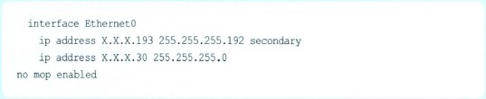

위의 경우는 x.x.x.30 255.255.255.0에서 클래스 C(254개)가 가능하고, 그 다음 x.x.x.193 255.255.255.192에서 62개가 가능하니까 이더넷 0에 부여 가능한 주소는 총 316개 정도가 되는 것이다.

이상입니다.

## OSPF 라우팅 프로토콜

이제부터는 OSPF(Open Shortest Path First) 프로토콜에 대한 이야기를 할까 합니다. OSPF 프로토콜의 구성보다는 OSPF에서 알아두어야 할 중요한 개념 위주로 하나씩 설명을 드리려고 합니다.

OSPF를 공부하다 보면 제일 어려운 부분이 개념의 이해인 것 같습니다. 자꾸 낯선 용어가 나오고, 또 그것을 이해하지 않고 넘어가면 더 어려운 용어가 나와서 쉽게 포기하게 됩니다.  
사실 구성만 본다면 OSPF도 그리 어렵지 않습니다. 라우터만 구성하겠다고 생각하면 정말 쉬운데 아무것도 모른 채 라우터만 구성하면 안 되겠죠? 그래서 여기서는 OSPF에서 나오는 여러 가지 개념에 대한 이해를 돕고자 합니다.

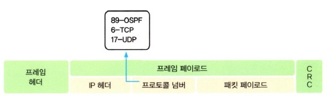

그림이 조금 복잡하긴 하지만 한 번 봐 두면 다음에 도움이 되실 겁니다. 즉 OSPF는 IP 패킷안에 프로토콜 넘버 89(십진수)로 들어가게 됩니다. 그러니 IP 패킷만 봐도 이것이 OSPF 정보라는 것을 금방 알 수 있는 겁니다.  
처음 OSPF를 시작하는 것이니 그동안 우리가 배웠던 아주 쉬운 프로토콜인 RIP와 한번 비교해 보겠습니다.

우선 Convergence Time(컨버전스 타임)입니다. 컨버전스 타임은 쉽게 라우터 간에 서로 변경된 정보를 주고받는 데 걸리는 시간이라고 생각하면 됩니다.  
예를 들어 어떤 인터페이스가 죽었을 때 이 정보가 모든 라우터들 사이에 퍼지는 데 걸리는 시간이 바로 컨버전스 타임이 됩니다.

RIP의 경우는 매 30초에 한 번씩 업데이트가 일어나고 아시는 대로 홀드다운 타임이니, 에이징이니 하는 것들 때문에 컨버전스에 많은 시간이 걸리지만, OSPF는 어떤 변화가 생길 때 바로 전달할 수 있기 때문에 훨씬 빠릅니다.  
따라서 큰 네트워크에 아주 적당하죠. 특히 OSPF는 Area(에어리어)라는 개념을 사용해서 전체 OSPF 네트워크를 작은 영역으로 나누어 관리하기 때문에 방금 설명을 드린 것처럼 빠른 업데이트를 하면서도 효율적인 관리가 가능합니다.

또 하나는 VLSM을 지원하는가의 여부입니다. RIP v1의 경우는 당연히 이것을 지원하지 못합니다. 하지만 OSPF는 VLSM을 확실하게 지원합니다.  
VLSM을 지원하게 되면 IP 주소를 효과적으로 사용할 수 있다는 장점뿐만 아니라 라우팅 테이블을 줄이는 부수적인 효과도 있습니다.  
이를 위해 OSPF는 라우트 서머리제이션(Route Summarization)을 지원하기 때문에 여러 개의 라우팅 경로를 하나로 묶어주는 기능이 탁월합니다.

이번에는 네트워크 크기에 대한 제한입니다. 즉 RIP의 경우는 최대 15개의 홉 카운트밖에 넘어가지 못합니다. 즉 최대 15대의 라우터만을 건널 수 있기 때문에 이보다 더 멀리 떨어진 곳까지는 데이터의 전달이 불가능하다는 겁니다. 하지만 OSPF는 이런 제한이 없습니다.

또 네트워크 대역폭의 활용 측면에서도 OSPF가 앞섭니다. 즉 RIP의 경우는 매 30초마다 브로드캐스트가 발생하기 때문에 대역폭 낭비가 많지만, OSPF는 네트워크에 변화가 있을 때만 정보가 날아가고 그것도 멀티캐스트로 날아기기 때문에 훨씬 실용적이지요.

마지막으로 경로 결정에 관한 것도 있습니다. 즉 RIP는 홉 카운트만을 따지기 때문에 속도나 딜레이(지연)와 상관없이 홉 카운트가 적은 것만을 선호하지만, OSPF는 많은 관련 요소를 합쳐서 경로를 선택하기 때문에 훨씬 정확한 경로 선택이 가능하다는 겁니다.

이렇게 비교해 보니 대략 OSPF의 성격이 보이시죠? 물론 이밖에도 여러분이 알고 있는 것처럼 OSPF는 표준 라우팅 프로토콜이고, 링크스테이트 라우팅 알고리즘입니다.

그럼 이번에는 OSPF가 어떤 네트워크 타입에서 적용 가능한지를 알아보겠습니다. 쉽게 말하면 OSPF가 적용되는 토폴로지(Topology)입니다. 더 어려워졌다구요? 이런! 하지만 OSPF에서 토폴로지를 이해하는 것은 중요합니다.  
일반적으로 다른 라우팅 프로토콜의 경우는 토폴로지를 별로 따지지 않는 데 반해서, OSPF는 토폴로지가 바뀌는 것에 따라 약간씩 동작이 바뀌기 때문에 기본을 이해하는 것이 중요합니다.  
일단 여기서는 어떤 토폴로지가 있고, 그 정의가 무엇인지만 알아보겠습니다.

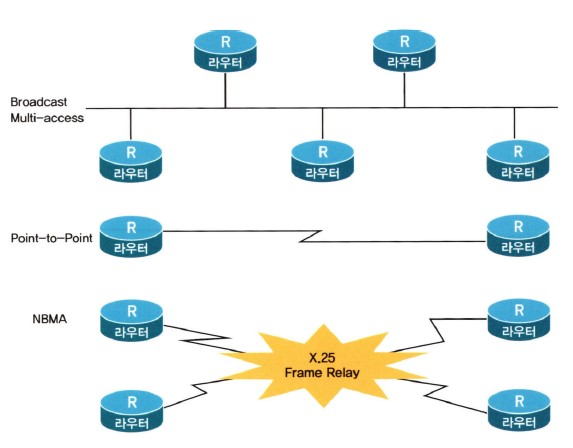

그림을 보면 우선 브로드캐스트 멀티엑세스 토폴로지(Broadcast Multi-access Topology)가 있습니다.  
맨 위 그림은 네트워크에 2개 이상의 라우터가 연결되는 경우로, 하나의 메시지를 내보내면 이 네트워크상에 있는 모든 녀석들의 정보를 받아볼 수 있는 구조입니다. 가장 일반적인 예를 들자면 이더넷 세그먼트가 되겠죠.

그 다음은 포인트 투 포인트 토폴로지(Point-to-Point Topology)입니다. 보이는 것처럼 네트워크에 한 쌍의 라우터만 존재하는 경우가 될 겁니다. 전용선 같은 것이 가장 좋은 예가 되겠네요.

마지막은 NBMA라는 토폴로지입니다. NBMA는 Non Broadcast Multiple Access로, 이 토폴로지 역시 네트워크에 2개 이상의 라우터가 연결됩니다. 하지만 브로드캐스트 멀티엑세스와는 다르게 브로드캐스트 능력은 가지고 있지 않습니다. 프레임릴레이나 X.25 네트워크가 이 경우에 해당합니다.

이처럼 OSPF는 Broadcast Multi-access, Point-to-Point, 그리고 NBMA로 네트워크를 나누어 지원하고, 동작 방식도 약간씩 다르기 때문에 구성 시 이 네트워크가 어떤 토폴로지인지를 먼저 확인한 다음에 구성에 들어가야 합니다.

