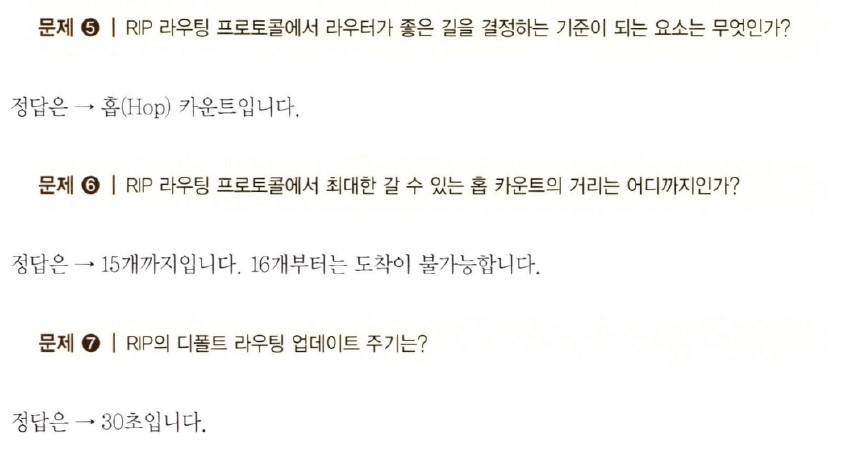
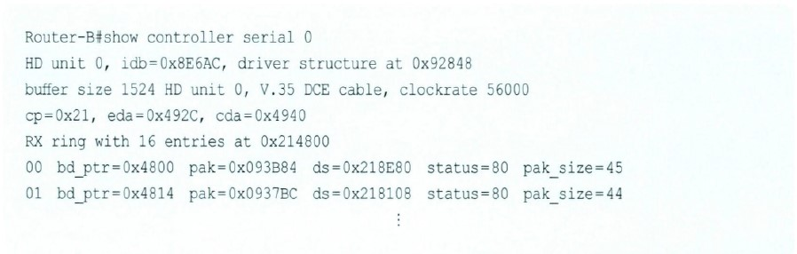
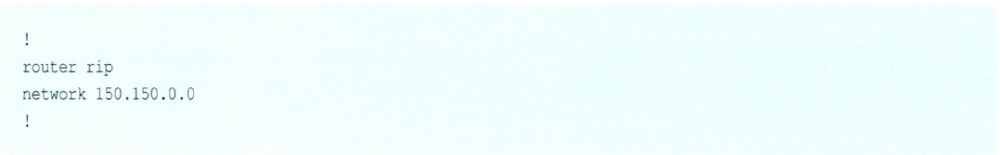
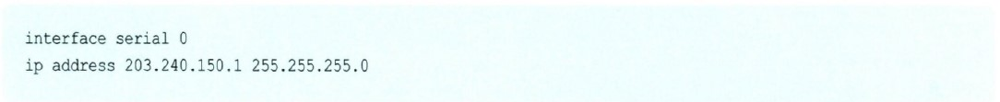
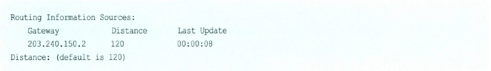

#  라우팅 프로토콜과의 한판

## 목차

- RIP라는 라우팅 프로토콜에 대한 이야기
- RIP와 함께 춤을?
- Distance-Vector 라우팅 알고리즘에서의 문제점과 해결책
- IGRP 라우팅 프로토콜
- OSPF 라우팅 프로토콜

## RIP라는 라우팅 프로토콜에 대한 이야기

여기에서는 다이내믹 라우팅 프로토콜에 대해서 알아보겠습니다. 전에도 한번 설명을 드렸지만 다이내믹 라우팅 프로토콜은 운영자가 일일이 경로를 지정하지 않아도 라우터가 똑똑하게 알아서 길을 찾아가는 프로토콜입니다.

우선 이렇게 똑똑한 다이내믹 프로토콜 중에서 가장 구성이 쉬우면서도 가장 단순한 라우팅 프로토콜인 RIP에 대해서 알아보겠습니다.

먼저 RIP(Routing Information Protocol)를 짧은 질문과 대답을 가지고 간단하게 정리해 보도록 하겠습니다.

이 정도만 RIP에 대해서 알고 있다면 아마 RIP에 대해서는 자신감이 생길 겁니다. 몇 가지는 이미 설명을 드린 내용이고 나머지 설명드리지 않은 부분은 앞으로 진도를 나가면서 하나씩 설명하겠습니다.

RIP는 말씀드린 것처럼 단순하기는 하지만 그래도 옛날부터 많은 사랑을 받아온 명실상부한 스탠다드(Standard), 즉 표준 라우팅 프로토콜입니다.  
초보자가 라우터를 컨피규레이션 (설정, Configuration)한다면 RIP가 아마 가장 편리할 겁니다. RIP는 또 라우터의 메모리를 적게 사용하는 장점도 있습니다. 정말 좋은 프로토콜입니다.

하지만 RIP의 경우는 몇 가지 단점도 가지고 있습니다.

우선 RIP가 목적지까지의 최적 경로를 찾아가는 방법을 알아봐야 합니다. RIP의 경우는 최적의 경로를 찾는 방법이 가장 단순합니다. 즉 라우터를 몇 번 거쳐서 목적지에 도착하는가를 보는 것입니다. 다시 말하면 목적지까지 가는 데 네트워크를 몇 번 거쳐야 하는가입니다. 이것은 조금 어려운 용어로 말씀드리면 '홉 카운트(Hop Count)'라고 하는데, RIP는 가장 낮은 홉 카운트가 가장 좋은 경로라는 결정하게 됩니다.

이렇게 홉 카운트만 가지고 경로를 선택하다 보니 실수도 많이 하게 됩니다. 예를 들어 다음 그림을 보기 바랍니다.

그림에서 1번 PC에서 2번 PC로 가는 데이터가 있을 때 라우터 A에 RIP 라우팅 프로토콜이 돌고 있다면 라우터 A는 화살표대로 라우터 B쪽으로 데이터를 보냅니다. 왜냐하면 라우터 B쪽으로 보내는 것이 홉 카운트가 더 적기 때문입니다.  
라우터 C쪽으로 보내면 라우터 C와 라우터 D, 그리고 라우터 B를 거쳐야 목적지인 2번 PC에 도착할 수 있기 때문입니다. 하지만 각 라우터간의 회선 속도를 보기 바랍니다.

데이터가 라우터 B쪽으로 가게 되면 28.8Kbps라는 엄청나게 느린 속도로 날아가게 됩니다. 하지만 라우터 C 방향으로 가면 비록 라우터는 위쪽보다 많이 거치게 되어도 속도가 T1 (1.544Mbps)이기 때문에 훨씬 빨리 날아갈 수 있습니다. 즉 사실은 라우터 A는 2번 PC로 가는 패킷을 라우터 C쪽으로 보내는 게 훨씬 빨리 보낼 수 있는 겁니다.

그래도 RIP는 계속 위로 데이터를 보냅니다.

이게 바로 RIP의 단점입니다. 즉 경로 선택을 오로지 홉 카운트에 의존하기 때문에 속도나 회선의 신뢰도, 그리고 회선의 로드 등을 확인해 볼 수 없는 겁니다. 따라서 그냥 라우터를 적게 거치는 것은 좋은 경로로 선택해 버립니다.

또 RIP의 경우 자신의 라우터에서 15개 이상의 라우터를 거치는 목적지의 경우는 Unreachable(갈 수 없음)로 정의하고 데이터를 보내지 못하기 때문에 커다란 네트워크상에서 사용하기는 무리가 있습니다.

그럼에도 불구하고 아직도 많은 곳에서 RIP를 사용하는 이유는 소규모 네트워크 상에서는 효율성이 좋고, 라우터의 메모리를 적게 차지하며, 게다가 구성이 간편하기 때문입니다. 참, 그리고 모든 라우터에서 지원하는 표준 라우티 프로토콜이라는 것도 한 가지 이유가 될 겁니다.

여러분도 사용해보실 기회가 있을 겁니다.

> 알고 갑시다!

다이내믹 프로토콜 중의 하나인 RIP(Routing information Protocol)는 구성이 간편하고 표준 라우팅 프로토콜이어서 많은 곳에서 사용되고 있다. 그러나 경로 선택을 오직 홉 카운트로만 한다든지, 데이터를 최대 라우팅할 수 있는 거리가 짧다는 단점 때문에 커다란 네트워크보다는 소규모 네트워크에서 많이 사용된다.  
RIP에서 몇 가지 더 알아야 할 사항은 앞에서도 설명했던 업데이트 주기이다. RIP의 경우는 매 30초마다 이웃한 라우터들과 라우팅 정보를 교환한다. 경로에 이상이 있는 건 아닌지 또 뭔가 새로 생긴 경로는 없는지를 확인한다.

> 질문 있어요! QnA

Q 질문이 있는데요. 사람들이 라우터를 구성하면서 '백투백(Back-to-Back)'이라고 하던데, 어떤 구성을 이야기하는지, 그리고 왜 이런 구성을 하는지 알고 싶어요.

A 네, 라우터를 실습실에서 구성하다 보면 가장 먼저 떠오르는 고민이 바로 전용선 구간입니다.

원래 환경에서는 전화국에 요청해서 전용선을 설치하고 서로 라우터를 연결하면 되지만, 실습실에 전용선을 설치할수는 없어서 만드는 구성이 바로 Back-to-Back 구성입니다. 즉 라우터와 라우터를 서로 직접 연결하면서 마치 전용선 구간에서 연결한 것처럼 만드는 기술입니다.

아시겠지만 원래 전용선을 연결하기 위해서는 라우터 뒤에 모뎀 장비인 DSU/CSU가 붙고 그 뒤에 전용선을 연결합니다. 하지만 Back-to-Back 구성에서는 라우터 대 라우터를 V.35 케이블만 가지고 서로 연결하는 것입니다. 그림을 보면 금방 이해가 될 겁니다.

그림에서 위의 그림이 실제 구성입니다. 즉 라우터의 시리얼 인터페이스에 V.35 케이블을 연결하고 한쪽 끝은 DSU/CSU에 연결합니다. DSU/CSU는 전용선에 연결하게 되는 겁니다. 상대편도 마찬가지로 구성됩니다.

이러한 실제 구성에서 라우터는 DTE 장비가 되고. DSU/CSU는 DCE 장비가 되기 때문에 이때 라우터에 사용하는 V.35 케이블은 DTE 케이블입니다. V.35 케이블을 실제 보았을 때 DTE 케이블은 핀이 밖으로 나와있는 숫놈이고, DCE 케이블은 숫놈을 꽂을 수 있게 되어있는 암놈이니까 금방 알아보실 수 있을 겁니다.

그러나 실습 환경에서는 중간에 DSU를 놓고 또 전용선을 연결하는 이러한 실제 구성이 불가능하기 때문에 전용선과 DSU/CSU를 생략하고 직접 라우터 대 라우터를 V.35 케이블을 이용해서 연결합니다.

이때 중요한 것은 라우터 A나 라우터 B 둘 중 하나가 반드시 DCE로 동작해야 한다는 것입니다. 즉 둘 다 DTE가 아니라 하나는 DTE, 그리고 나머지 하나는 DCE로 동작해야 한다는 것입니다.

그림에서는 라우터 A가 DTE로 동작하고 라우터 B가 DCE로 동작하게 되어 있습니다. (케이블이 서로 다르다는 것을 알 수 있습니다.) 이때 어느 쪽 라우터가 DCE이고, 어느 쪽 라우터가 DTE인지를 알아보는 방법은 물론 케이블을 보면 알겠지만 라우터에서 명령으로도 확인이 가능한데, 그 명령은 다음과 같습니다.

여기서 interface는 인터페이스의 종류를 이야기합니다. 그리고 interface-number는 인터페이스별 번호입니다. 예를 들어볼까요?

위에서처럼 show controller 명령을 수행해서 DTE와 DCE를 확인합니다. 일단 DTE, DCE를 확인한 후 DCE 케이블이 연결되어 있는 라우터의 인터페이스 구성 모드로 들어가서 구성 파일에 다음 구성을 추가합니다.

예를 들어 라우터 B의 시리얼 0 인터페이스에 연결된 케이블이 V.35 DCE 케이블인 경우 라우터 B의 시리얼 0 인터페이스 구성 모드로 들어가서 Clockrate를 세팅해 주는 겁니다. DCE 장비는 클록을 제공해야 하기 때문에 이렇게 Clockrate 값을 넣어주는 겁니다.

여기서 세팅해주는 Clockrate 값은 바로 두 라우터 간의 회선 속도가 됩니다. 따라서 앞에서처럼 56000이라고 세팅한 경우에는 56Kbps의 속도로 두 라우터가 연결되었다고 생각하면 됩니다.

일단 두 라우터가 이처럼 Back-to-Back 구성으로 연결되고 나면 이제부터는 전용선으로 연결된 구성과 똑같이 사용할 수 있습니다. 따라서 라우터의 실습 환경에서는 꼭 필요한 구성입니다.

이제 Back-to-Back에 대해서 이해가 가시죠? 실은 저도 지금 Back-to-Back 구성으로 라우터를 세팅하고 여러분께 설명드리고 있는 겁니다.

## RIP와 함께 춤을?

자, 이번에는 본격적으로 RIP에 대해서 알아보겠습니다. 일반적인 성격은 앞에서 알아보았고 이번에는 RIP를 이용해서 라우터를 구성할 때의 명령어 형식과 실제 예를 통한 RIP 라우팅의 구현, 그리고 구현한 다음에 잘 돌아가는지를 무엇으로 확인해 보나 하는 것들을 공부해 보겠습니다.

먼저 RIP에 대한 명령어 형식입니다. 명령어를 알아야 RIP를 동작시킬 수 있겠죠?

이 두 가지 명령이 전부입니다. 정말 쉽겠죠?

먼저 첫 번째 줄에 있는 router rip란 명령은 프롬프트를 보셔서 아시겠지만 '일반 구성 모드(Router(config)#)'에서 내리는 명령입니다. 이 명령은 이제부터 RIP 라우팅을 사용하겠다는 뜻입니다. 그러니까 RIP 라우팅 프로토콜을 쓰시려면 꼭 넣어줘야 하는 명령입니다.

두 번째 명령은 항상 'router 구성 모드'에서 내려줘야 하는 명령입니다. 즉 이 명령을 하기 전에는 반드시 router rip라는 명령을 먼저 내려준 후 Router(config-router)# 모드로 들어와서 내리는 명령입니다. 이 명령은 RIP 라우팅에 참가하는 네트워크를 지정해 주기 위해서 사용하는 명령입니다.  
여기서 network-number가 바로 RIP로 라우팅해 줄 네트워크가 됩니다.

이때 주의하셔야 할 사항이 있습니다. RIP와 같은 라우팅 프로토콜은 네트워크 넘버를 입력할 때 서브넷 마스크는 입력하지 않습니다. 즉 RIP는 Classful하게 모든 네트워크를 인식한다는 것입니다. 예를 들어 내가 사용하는 라우터에 이더넷 0에 배정한 네트워크가 150.150.100.0 255.255.255.0이라고 가정해 보겠습니다.  
서브넷 마스크는 완전히 이해하고 계시겠지만 150.150.100.0/24는 클래스 B를 서브넷 마스크해서 클래스 C처럼 쓰고 있는 겁니다. 이때 라우팅 프로토콜은 RIP를 쓴다고 가정하고 앞에서 배운 대로 명령을 입력하겠습니다.

하지만 이렇게 입력을 해도 RIP에서는 네트워크를 150.150.0.0으로 인식해 버립니다. 따라서 show running-config을 수행해 보면 다음과 같이 보이게 됩니다.

자, 이렇게 되면 어떤 문제가 발생할까요? 네, 맞습니다. 이렇게 되면 RIP를 수행하고 싶은 곳은 150.150.100.0뿐인데, 150.150.0.0으로 모든 네트워크가 들어가서 원하지 않는 네트워크까지 RIP가 수행하게 되는 것입니다.

명령어 형식은 대충 배웠으니까 이번에는 실습을 통한 RIP 구성을 한번 해볼까 합니다.

예를 들어 본사는 서울에, 그리고 지사는 부산에 있는 어떤 회사가 있다고 가정해보겠습니다. 이 회사의 본사에는 PC와 서버를 합쳐서 약 200대 정도의 장비가 있고 부산 지사에는 약 150명 정도가 PC를 쓰고 있다고 가정하겠습니다.

자, 여러분이 이제 이 두 사무실 간에 네트워크를 설치해 주기 위해서 라우터 앞에 앉았습니다. 그리고 일단 여기서는 인터넷에 대한 접속은 없다고 가정하겠습니다. 단순히 두 사무실 간에 네트워크를 연결하는 겁니다.

자, 이때 준비물은 뭐가 있을까요?

그림을 보면서 설명을 드리겠습니다. 일단 두 사무실의 내부에는 네트워크가 되어 있다는 가정하에 두 사무실을 연결하기 위한 라우터 2대(라우터 A와 라우터 B)와 DSU 또는 CSU 2대가 필요합니다.(그림에서 DSU/CSU 부분은 생략되었습니다.)

여기서 보이는 것처럼 서울 본사와 부산 지사의 네트워크를 구축하기 위해서는 총 3개의 네트워크가 필요합니다. 즉 서울 내부 네트워크, 부산 내부 네트워크, 그리고 마지막으로 시리얼 라인(WAN 구간)에 대한 네트워크입니다. 이렇게 네트워크를 나누는 것은 각 구간별로 서로 다른 네트워크가 있어야 하기 때문입니다.

또 한 가지 여기서 여러분이 아셔야 할 것은 시리얼 구간, 즉 전용선 구간에도 하나의 네트워크가 소모된다는 것입니다. 따라서 이 구간에는 지금처럼 서브넷 마스크 255.255.255.0을 사용하는 것은 IP 주소를 낭비하게 되는 것입니다. 만약 공인 IP 주소를 사용한다면 더욱 더 문제가 됩니다.  
하지만 여기선 이 부분에 대한 이야기는 일단 건너뛰도록 하겠습니다. 나중에 VLSM(Variable Length Subnet Mask)을 설명하면서 설명드리도록 하겠습니다. 우선은 모두 같은 서브넷 마스크를 사용하기로 했다고 가정하겠습니다.

라우터를 구성하기 전에 항상 위 그림과 같은 구성도를 만드는 것이 중요합니다. 라우터를 구성하다 보면 구성이 잘 생각나지 않거나 아니면 엉뚱한 IP 주소를 잘못 입력하는 경우가 있기 때문에 항상 그림을 먼저 그리고 라우터를 구성하는 버릇을 들이기 바랍니다.

구성도에는 라우터의 이름과 어떤 식으로 서로 연결되어 있는지에 대한 내용, 그리고 IP 주소가 들어가면 됩니다. 서울, 부산 네트워크의 경우는 최대 인원이 250명을 넘지 않기 때문에 각 네트워크에 클래스 C 하나씩을 배정했습니다.

자, 이제 라우터 구성을 직접 보면서 설명드리겠습니다. 라우터 구성에서 중요한 부분만 써보면 아래와 같습니다.

이 부분이 본사 라우터의 이더넷 부분입니다. 즉 이 회사의 본사는 203.140.100.2~203.240.100.254까지의 IP 주소를 사용하겠죠?(203.240.100.1은 라우터에 이미 부여했고, 203.240.100.255는 브로드캐스트 주소입니다.)

이 부분이 본사 라우터의 시리얼, 즉 부산과 접속되는 인터페이스 입니다. 여기서도 보이지만 이더넷과 시리얼 인터페이스는 서로 다른 네트워크여야 한다는 것을 항상 잊지 말기 바랍니다.

이 부분이 RIP에 대한 구성입니다. 정말 간단하죠?

RIP 라우팅에 참여하는 네트워크를 넣어준다고 했으니까 여기서는 본사 라우터의 이더넷 부분(203.240.100.0)과 시리얼 부분(203.240.150.0)을 포함시키면 됩니다. 현재 보이는 것처럼 네트워크는 Classful하게 들어가기 때문에 따로 서브넷 마스크를 입력하지 않도록 되어 있습니다.

이렇게만 하면 본사 라우터의 모든 구성은 끝나게 됩니다.

자, 그럼 전체 라우터의 구성을 한번 볼까요?

이제는 라우터의 구성만 보셔도 아시겠죠? 이렇게 점점 라우터의 구성과 친해지는 것이 중요합니다.

자, 이제 서울 본사 라우터의 구성은 마무리되었습니다. 과연 제대로 구성되었는지 한번 확인해 보고 싶으시죠? 몇 가지 명령이 있습니다.

먼저 show ip protocol이란 명령이 있습니다.

위와 같이 라우터의 프리빌리지드 모드(운영자 모드)에서 show ip protocol이란 명령을 내리면 현재 IP에서 동작하고 있는 라우팅 프로토콜이 보입니다. 우리가 서울 본사에 있는 라우터에 RIP를 동작시켰기 때문에 맨 윗 줄에 Routing Protocol is "rip"라는 말이 보입니다.  
그 다음에는 라우팅 정보를 얼마 만에 한 번씩 업데이트하는가를 보여줍니다. RIP는 매 30초에 한 번씩 업데이트가 발생하는데, 지금 마지막으로 업데이트한 지 15초가 지났다고 나옵니다. 그러니까 앞으로 15초만 더 있으면 한 번 더 업데이트되겠네요.

이때 만약 어떤 곳으로부터 30초 동안에 업데이트 정보를 받지 못했다면 어떻게 될까요? RIP 환경에서 라우터는 180초 동안은 상대측으로부터 정보를 받지 못해도 느긋하게 기다립니다.  
즉 RIP 업데이트가 6번 들어오지 않을 때까지는 기다려주는 겁니다. 이 시간을 'Invalid Time'이라고 합니다(Invalid after 180 seconds). 그런데 180초가 지나도 상대에서 업데이트가 들어오지 않게 되면 라우터는 Hold Down 상태로 들어갑니다.  
이때부터 라우터는 상대편이 다운됐을거라고 생각하게 되고 'possibly down'이라는 메시지를 라우팅 테이블에서 보여줍니다.

그리고도 1분 동안 상대로부터 연락이 없으면 라우터는 이 경로가 죽었다고 생각하고 라우팅 테이블에서 이 경로에 대한 정보를 지워버리게 되는데, 그 시간이 바로 'Flush Time'입니다(flushed after 240).

그 다음에 보이는 Default version control: send version 1, receive any version이란 말은 RIP의 버전에 대한 정보를 보여주고 있습니다. 즉 RIP의 여러 가지 단점을 보완해서 새로 나온 RIP가 RIP version 2인데, 현재 우리는 RIP 버전 1을 사용하고 있다는 것을 보여주고 있습니다.  
아무튼 RIP 버전 1에서 보낸 정보는 어떤 버전이든지 받아볼 수 있지만, RIP 버전 2에서 보낸 정보는 오직 RIP 버전 2에서만 이해할 수 있다는 것을 알려주고 있습니다.

그 다음에 보이는

은 현재 라우터에서 RIP가 적용되고 있는 네트워크를 보여줍니다. 우리가 이더넷 0쪽과 시리얼 0쪽에 RIP를 적용했으니까 이렇게 보이는 겁니다.

그럼 라우팅 정보는 어디로부터 얻어오고 있을까요? 거기에 대한 정보를 보여주는 것이 바로 아래에 나와있는 내용입니다. 즉 다음과 같습니다.

여기서 203.240.150.2가 바로 라우팅 정보를 읽어오는 곳입니다. 여기가 어딘지는 아시죠? 바로 부산 라우터의 시리얼 부분입니다.

맨 마지막 줄에 Distance, 즉 거리가 120이라고 되어 있네요. 이것을 'Administrative Distance'라고 합니다. 즉 라우팅 정보에 대한 신뢰성 정도라고 생각하면 됩니다. 이 디스턴스 값이 작으면 작을수록 라우터는 그 경로를 신뢰합니다.  
참고로 스태틱 라우팅 정보는 디스턴스 값이 1입니다. 따라서 같은 목적지에 대해서 RIP로 찾아낸 길과 스태틱으로 찾아낸 길, 이렇게 2개의 길이 존재한다면 라우터는 스태틱으로 찾아낸 길쪽으로 데이터를 내보내게 됩니다. 디스턴스가 작을수록 더 신뢰하기 때문입니다.

자, 이번에는 라우팅 테이블을 한번 확인해 볼까요? 라우팅 테이블을 보려면 show ip route라는 명령이 사용됩니다.

라우팅 테이블이 보입니다. 바로 맨 마지막 3줄이 라우팅 테이블입니다.

