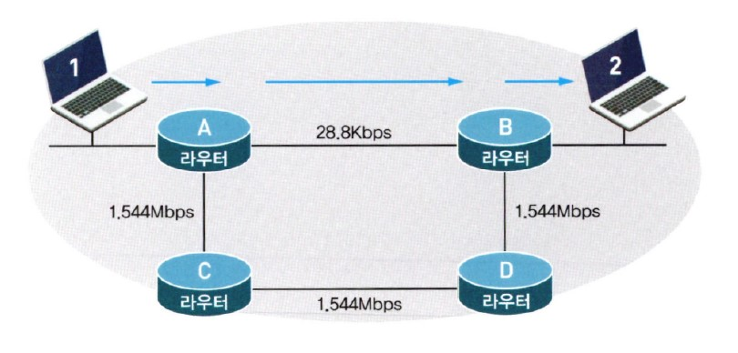

#  라우팅 프로토콜과의 한판

## 목차

- RIP라는 라우팅 프로토콜에 대한 이야기
- RIP와 함께 춤을?
- Distance-Vector 라우팅 알고리즘에서의 문제점과 해결책
- IGRP 라우팅 프로토콜
- OSPF 라우팅 프로토콜

## RIP라는 라우팅 프로토콜에 대한 이야기

여기에서는 다이내믹 라우팅 프로토콜에 대해서 알아보겠습니다. 전에도 한번 설명을 드렸지만 다이내믹 라우팅 프로토콜은 운영자가 일일이 경로를 지정하지 않아도 라우터가 똑똑하게 알아서 길을 찾아가는 프로토콜입니다.

우선 이렇게 똑똑한 다이내믹 프로토콜 중에서 가장 구성이 쉬우면서도 가장 단순한 라우팅 프로토콜인 RIP에 대해서 알아보겠습니다.

먼저 RIP(Routing Information Protocol)를 짧은 질문과 대답을 가지고 간단하게 정리해 보도록 하겠습니다.

이 정도만 RIP에 대해서 알고 있다면 아마 RIP에 대해서는 자신감이 생길 겁니다. 몇 가지는 이미 설명을 드린 내용이고 나머지 설명드리지 않은 부분은 앞으로 진도를 나가면서 하나씩 설명하겠습니다.

RIP는 말씀드린 것처럼 단순하기는 하지만 그래도 옛날부터 많은 사랑을 받아온 명실상부한 스탠다드(Standard), 즉 표준 라우팅 프로토콜입니다.  
초보자가 라우터를 컨피규레이션 (설정, Configuration)한다면 RIP가 아마 가장 편리할 겁니다. RIP는 또 라우터의 메모리를 적게 사용하는 장점도 있습니다. 정말 좋은 프로토콜입니다.

하지만 RIP의 경우는 몇 가지 단점도 가지고 있습니다.

우선 RIP가 목적지까지의 최적 경로를 찾아가는 방법을 알아봐야 합니다. RIP의 경우는 최적의 경로를 찾는 방법이 가장 단순합니다. 즉 라우터를 몇 번 거쳐서 목적지에 도착하는가를 보는 것입니다. 다시 말하면 목적지까지 가는 데 네트워크를 몇 번 거쳐야 하는가입니다. 이것은 조금 어려운 용어로 말씀드리면 '홉 카운트(Hop Count)'라고 하는데, RIP는 가장 낮은 홉 카운트가 가장 좋은 경로라는 결정하게 됩니다.

이렇게 홉 카운트만 가지고 경로를 선택하다 보니 실수도 많이 하게 됩니다. 예를 들어 다음 그림을 보기 바랍니다.

그림에서 1번 PC에서 2번 PC로 가는 데이터가 있을 때 라우터 A에 RIP 라우팅 프로토콜이 돌고 있다면 라우터 A는 화살표대로 라우터 B쪽으로 데이터를 보냅니다. 왜냐하면 라우터 B쪽으로 보내는 것이 홉 카운트가 더 적기 때문입니다.  
라우터 C쪽으로 보내면 라우터 C와 라우터 D, 그리고 라우터 B를 거쳐야 목적지인 2번 PC에 도착할 수 있기 때문입니다. 하지만 각 라우터간의 회선 속도를 보기 바랍니다.

데이터가 라우터 B쪽으로 가게 되면 28.8Kbps라는 엄청나게 느린 속도로 날아가게 됩니다. 하지만 라우터 C 방향으로 가면 비록 라우터는 위쪽보다 많이 거치게 되어도 속도가 T1 (1.544Mbps)이기 때문에 훨씬 빨리 날아갈 수 있습니다. 즉 사실은 라우터 A는 2번 PC로 가는 패킷을 라우터 C쪽으로 보내는 게 훨씬 빨리 보낼 수 있는 겁니다.

그래도 RIP는 계속 위로 데이터를 보냅니다.

이게 바로 RIP의 단점입니다. 즉 경로 선택을 오로지 홉 카운트에 의존하기 때문에 속도나 회선의 신뢰도, 그리고 회선의 로드 등을 확인해 볼 수 없는 겁니다. 따라서 그냥 라우터를 적게 거치는 것은 좋은 경로로 선택해 버립니다.

또 RIP의 경우 자신의 라우터에서 15개 이상의 라우터를 거치는 목적지의 경우는 Unreachable(갈 수 없음)로 정의하고 데이터를 보내지 못하기 때문에 커다란 네트워크상에서 사용하기는 무리가 있습니다.

그럼에도 불구하고 아직도 많은 곳에서 RIP를 사용하는 이유는 소규모 네트워크 상에서는 효율성이 좋고, 라우터의 메모리를 적게 차지하며, 게다가 구성이 간편하기 때문입니다. 참, 그리고 모든 라우터에서 지원하는 표준 라우티 프로토콜이라는 것도 한 가지 이유가 될 겁니다.

여러분도 사용해보실 기회가 있을 겁니다.

> 알고 갑시다!

다이내믹 프로토콜 중의 하나인 RIP(Routing information Protocol)는 구성이 간편하고 표준 라우팅 프로토콜이어서 많은 곳에서 사용되고 있다. 그러나 경로 선택을 오직 홉 카운트로만 한다든지, 데이터를 최대 라우팅할 수 있는 거리가 짧다는 단점 때문에 커다란 네트워크보다는 소규모 네트워크에서 많이 사용된다.  
RIP에서 몇 가지 더 알아야 할 사항은 앞에서도 설명했던 업데이트 주기이다. RIP의 경우는 매 30초마다 이웃한 라우터들과 라우팅 정보를 교환한다. 경로에 이상이 있는 건 아닌지 또 뭔가 새로 생긴 경로는 없는지를 확인한다.

