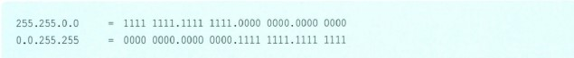
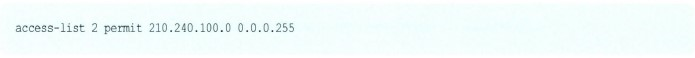
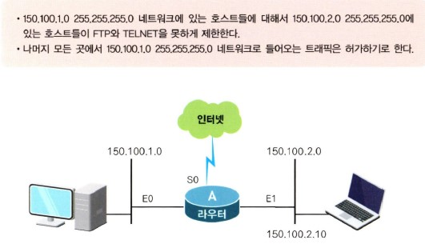
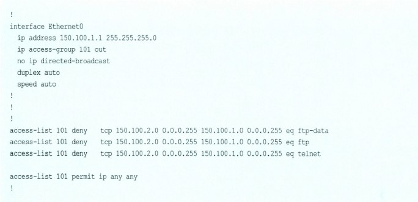
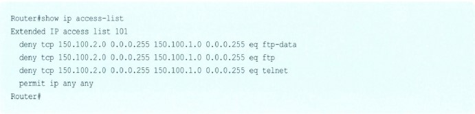

# 라우터, 그 속으로 전진!

## 목차

- [네트워크 접근 제어 엑세스 리스트(Access List)](#네트워크-접근-제어-엑세스-리스트access-list)
- [엑세스 리스트에서 이것만 알면 다 안다!](#엑세스-리스트에서-이것만-알면-다-안다)
- [스탠더드 엑세스 리스트의 시작](#스탠더드-엑세스-리스트의-시작)
- [스탠더드 엑세스 리스트의 예제](#스탠더드-엑세스-리스트의-예제)
- [텔넷포트(VTY Port)에서의 엑세스 리스트](#텔넷포트vty-port에서의-엑세스-리스트)
- 익스텐디드 엑세스 리스트(Extended Access List)
- 라우터의 장애 대비 HSRP
- IP 주소의 변환 NAT(Network Address Translation)

## 네트워크 접근 제어 엑세스 리스트(Access List)

여기에서는 우리가 라우터를 할 때 꼭 알아두어야 하는, 그러나 왜 그런지 부담스럽고 조금은 어려운 듯한, 그러나 알고 보면 별로 안 어려운 '엑세스 리스트(Access List)'라는 명령에 대해서 알아보기로 하겠습니다.

그럼 엑세스 리스트란 무엇을 뜻할까요?

엑세스 리스트란 한마디로 말해서 네트워크에 엑세스, 즉 접근을 하게 해줄까, 말까를 미리 정해놓은 리스트라고 생각하면 됩니다. 즉 어떤 녀석에게는 어디만 보여주고, 또 어떤 녀석에게는 어디만 쓰게 해야겠다 하고 정해 놓은 표를 의미합니다.

이러한 엑세스 리스트는 주로 보안을 위해서 사용되고 있습니다. 요즘 들어서는 그 중요성을 모두 인식하는 추세여서 점점 많이 사용되고 있습니다. 물론 라우터에 세팅이 됩니다. 그러니까 당연히 라우터가 볼 수 있는 한계, 즉 네트워크 계층까지만 관리가 되겠죠?  
하지만 요즘은 라우터도 네트워크 계층만 보는 것이 아니라 애플리케이션 계층까지 관리하는 여러 가지 기능이 나와있기 때문에 꼭 네트워크 계층까지만이라고 단정할 수는 없습니다. 그냥 일반적으로는 그렇다는 겁니다.

어떤 분들은 라우터의 엑세스 리스트가 있는데, 왜 파이어월(방화벽) 같은 보안 장비를 따로 두는지 궁금해 합니다.

정확히 말하자면 우리가 배울 라우터의 엑세스 리스트는 모든 침입자를 완벽하게 막아낼 수는 없습니다. 또 관리 자체도 쉽지가 않습니다. 즉 피지컬 계층에서 애플리케이션 계층까지를 완벽하게 말아줄 수 있고 많은 보안 기능을 가지고 있는 전문 보안 서버가 필요하게 된 겁니다.

그런데 요즘은 라우터에도 이러한 파이어월용 소프트웨어를 같이 넣어서 운용할 수 있으니까 혹시 라우터만 가지고 계신 분은 한번 알아보셔도 좋을 것 같습니다.

엑세스 리스트는 앞으로 라우터의 실제 구성할 때뿐만 아니라 여러 가지 자격 시험에서도 빈번히 출제되는 문제이기도 합니다. 혹시 시스코 자격증을 준비하는 분이라면 이번 기회에 꼭 이해해 두기 바랍니다.

자, 그럼 엑세스 리스트를 시작합니다.

엑세스 리스트는 앞에서 말씀드린 대로 라우터의 문지기라고 생각하면 쉽습니다. 이런 엑세스 리스트도 종류가 있습니다. 크게 두 가지라고 볼 수 있는데, 첫 번째가 스탠더드 엑세스 리스트(Standard Access List)라고 또 하나가 있는데, 이것은 자주 쓰이지는 않지만 가끔 시험에 나오곤 합니다.  
이것은 유저 네임(User Name)과 패스워드에 따라 통제가 가능한 엑세스 리스트입니다.

여기에서는 스탠더드 엑세스 리스트(Standard Access List)와 익스텐디드 엑세스 리스트(Extended Access List)까지만 알아보도록 하겠습니다.

자, 스탠더드 엑세스 리스트의 가장 큰 특징은 출입 통제를 할 때 출발지 주소만 참고한다는 겁니다. 즉 스텐더드 엑세스 리스트는 출발지 주소만 가지고 제어를 합니다. 이것이 어디서 왔는가를 본 다음, 통과 여부를 결정하는 것입니다.

하지만 익스텐디드 엑세스 리스트는 출발지도 보고, 목적지도 보고, 또 프로토콜도 보고, 사용 포트 번호도 보고 아무튼 온갖 것을 다 본 다음에 통과 여부를 결정합니다.

라우터 엑세스 리스트를 많이 해본 사람들도 스텐더드 엑세스 리스트를 세팅할 때 출발지 주소를 보는지, 목적지 주소를 보는지 혼동한다거나, 아니면 익스텐디드 엑세스 리스트를 세팅할 때 출발지가 먼저 오는지, 목적지가 먼저 오는지를 가지고 혼동할 때가 있는데, 여러분은 잘 기억해 두기 바랍니다.  
그리고 또 하나 알아두셔야 할 것 한 가지! 이것은 시험에 나오니까 혹시 자격증 공부하는 분은 꼭 알아두기 바랍니다.

만약 엑세스 리스트에 걸려서 못 들어가는 경우 라우터에 어떤 메시지가 나타날까요? 그건 'Host Unreachable'이란 말이 나온다는 겁니다. 나중에도 설명할 기회가 있겠지만 일단은 답이랃로 알아두는 것이 좋습니다.

> 알고 갑시다!

라우터에서 네트워크에 대한 보안을 위해 사용되는 것이 바로 엑세스 리스트라는 것인데, 엑세스 리스트에는 스탠더드 엑세스 리스트와 익스텐디드 엑세스 리스트가 있다(다이내믹 엑세스 리스트도 있지만 여기에서는 일단 생략).   
스탠더드 엑세스 리스트는 무조건 출발지 주소만 보고 결정을 하고, 익스텐디드 엑세스 리스트는 있는 조건은 다 따진다.

## 엑세스 리스트에서 이것만 알면 다 안다!

이번에는 엑세스 리스트에서 가장 중요한, 즉 엑세스 리스트의 노른자를 배워보도록 하겠습니다. 사람들이 엑세스 리스트를 하면서 어렵다고 하는 이유도, 그리고 엑세스 리스트에서 자꾸 에러가 걸리는 이유도 사실은 이 규칙을 완전하게 이해하고 있지 못하기 때문입니다.

또 알고 있다고 하더라도 잊어버리기 쉬우므로, 이번에 정말 완벽하게 이 규칙을 자신의 것으로 만들기를 바랍니다.

엑세스 리스트에서 가장 중요한, 잊어버리면 안 되는 4가지 규칙을 이제부터 하나하나 알아보기로 하겠습니다.

만약 4개의 엑세스 리스트가 있다면 맨 윗줄이 수행되고 그 다음 줄로 내려온다는 겁니다.

별거 아닌 것 같지만 중요합니다. 앞으로 예를 들어 설명을 드리겠습니다. 아무튼 지금은 그냥 외우세요.

엑세스 리스트는 맨 마지막 줄에는 항상 모든 것을 막아버리는 deny all이 들어있다고 생각하고 있습니다. 그러니까 어떤 엑세스 리스트의 항목에도 해당하지 않는 주소가 있다면, 그 주소는 맨 마지막 줄까지 내려온 후 deny all에 걸려서 모두 막혀버리는 겁니다.

따라서 2번 규칙을 까먹고 엑세스 리스트를 구성하는 경우는 막고 싶지 않는 것들도 실수로 모두 막혀버리는 아주 불행한 사태가 발생하는 겁니다. 조심, 조심, 또 조심하셔야 합니다.

예를 한번 들어 볼까요? 지금 여러분은 어렵게 배운 라우터의 엑세스 리스트를 만들어 나가고 있습니다. 여러분이 있는 곳은 라우터의 구성 모드입니다.

아직 여기 있는 엑세스 리스트가 무엇을 의미하는지는 모르셔도 됩니다. 대충 익스텐디드 엑세스 리스트(Extended Access List)가 이렇게 생겼구나라고만 알아두기 바랍니다.

자, 여기 보이는 것처럼 열심히 어려운 엑세스 리스트를 구성했습니다. 그런데 모든 구성을 마치고 나와서 가만히 생각해보니까 엑세스 리스트의 명령어 중 위에서 두 번째가 잘못된 거였습니다.  
즉 IP 주소가 201.222.11.7이어야 하는데 그만 205.222.11.7로 잘못 입력하게 된 겁니다. 그럼 고쳐야겠죠? 그래서 다시 구성 모드로 들어갔습니다.  
명령어를 지울 때는 명령어 앞에 no를 붙이면 된다고 했으니까 이렇게 먼저 잘못 내린 명령을 no를 이용해서 지운 다음에 다시 제대로 된 명령어를 입력했습니다.

대부분의 경우 구성을 변경할 때는 이런 방식을 사용하는 것이 맞습니다. 그러나 엑세스 리스트에서 이런 방식을 사용하게 되면 그동안에 입력되었던 나머지 모든 엑세스 리스트는 지워지게 됩니다. 이렇게 하고 나서 show running-config를 보게 되면,

위에서처럼 맨 마지막에 입력한 한 줄의 엑세스 리스트만 남게 됩니다. 그러니 항상 주의하셔야합니다. 절대 잊지 마세요. 아주 큰 낭패를 볼 수도 있습니다.

엑세스 리스트가 정의되어 있지 않은 인터페이스는 엑세스 리스트를 거치지 않고 바로 통과되기 때문에 당연히 permit any가 되는 겁니다.

이것은 2번 규칙과 혼돈하면 안 됩니다. 2번은 엑세스 리스트는 정의되었지만, 자기가 속할 엑세스 리스트가 없는 것이고, 4번은 아예 자기 네트워크에는 엑세스 리스트도 정의되어 있지 않은 경우이기 때문입니다.

> 알고 갑시다!

엑세스 리스트를 움직이는 4가지 규칙이 있는데, 첫 번째는 윗줄부터 아래로 차례로 수행된다는 것,  
두 번째는 엑세스 리스트의 맨 마지막에는 deny all이 생략되어 있다는 것, 세 번째는 엑세스 리스트에서 중간에 있는 엑세스 리스트를 지우려고 하면 모든 엑세스 리스트가 다 지워진다는 것, 네 번째는 인터페이스에 엑세스 리스트 명령이 없으면 그건 permit all이라는 것이다.

4가지의 엑세스 리스트 규칙은 엑세스 리스트 사용 시에 아주 중요한 거니까 모두 외워야 하고 못 외우면 잘 보이는 곳에 메모해 두세요!

> 네트워크 플러스+

### 네트워크의 혼잡, 컨제션에 대한 이야기

오늘은 혼잡에 대해서 좀 알아보도록 하겠습니다.

보통은 Congestion('컨제션'이라고 하죠.)이라고 이야기하는데, 이것이 바로 네트워크에서 가장 조심해야 할 것 중의 하나입니다.

자, 그럼 컨제션, 즉 혼잡이란 무엇일까요?

말 그대로 네트워크에서 혼잡이 발생하는 겁니다. 도로에서 길이 꽉 막히는 것처럼 말입니다. 그럼 혼잡이 왜 생기냐구요? 그것은 아마도 도로에서 차가 길에 꽉 막히는 이유와 똑같을 겁니다.

그러니까 도로의 용량보다 차가 갑자기 많이 밀릴 때 도로의 혼잡이 발생하는 것처럼 네트워크에서도 네트워크의 전체 대역폭(Bandwidth라고 하죠.)보다 그 네트워크를 지나는 데이터가 많이 몰리게 되면 바로 컨제션이 발생합니다.  
사실 네트워크상에서 컨제션은 발생할 수밖에 없는 필연적인 것인지도 모릅니다. 마치 도로에서도 출퇴근 시간에는 길이 막히는 것처럼 말입니다.

네트워크상에서는 'Bursty(버스티) 트래픽'이라고 하는 것이 있는데, 이것은 데이터가 갑자기 폭주하는 것을 말합니다.

그러다가 한순간에는 데이터가 거의 없다가 또 갑자기 많이 들어오다가 하는 겁니다. 이런 버스트 트래픽 때문에 당연히 컨제션이 발생합니다. 문제는 상습적인 컨제션이 발생하는 것입니다. 네트워크상에서 계속, 언제나, 항상, 늘 컨제션이 발생하면 그것이 문제가 되는 겁니다.

아무튼 이렇게 네트워크상에서 발생하는 컨제션은 이떻게든 해결을 해줘야 하는데, 이것이 바로 '컨제션 매니지먼트'라고 합니다.

그럼 어떻게 이런 네트워크상의 컨제션을 해결해 주는지를 한번 알아보도록 하겠습니다. 위에서 말씀드린 대로 네트워크상에서 분명히 발생하는 혼잡은 관리만 제대로 해주면 어느 정도 방지할 수가 있습니다.  
물론 완전하게 혼잡을 막으려면 돈을 많이 들여서 대역폭을 높이면 되겠죠?

이때 네트워크 관리를 하는 여러분은 어떤 식으로 이 문제를 조금이라도 해결할 수 있을까요? 그게 바로 혼잡 제어입니다. 여기에서는 이런 혼잡을 제어하기 위한 방법을 하나씩 알아보기로 하겠습니다.

첫 번째는 사용자의 애플리케이션에 대한 필터링을 하는 겁니다.

즉 모든 사용자와 모든 애플리케이션을 다 통과시키면 네트워크의 트래픽이 너무 증가하니까 골라서 통과시키는 겁니다. 그럼 불필요한 것들은 아예 네트워크에 들어올 수 없게 되는 겁니다. 이렇게 불필요한 것들을 막아내기 위해서는 엑세스 리스트란 것이 사용됩니다.

두 번째는 브로드캐스트를 막아주는 겁니다.

말씀드린 대로 브로드캐스트는 꼭 필요하면서도 네트워크에 트래픽을 너무 많이 가중시키기 때문에 불필요한 부분에서는 이것을 막아주는 게 중요합니다. 하지만 아주 잘 막아야겠죠? 아무거나 막았다가는 아주 예상치 못한 결과를 얻을 수도 있기 때문입니다.

예를 들어 라우팅 업데이트 같은 정보도 브로드캐스트가 있는데, 이것을 막았을 때는 라우터는 경로가 끊어졌다고 생각하게 됩니다. 실제는 살아있는데도 말입니다.

세 번째는 타이머를 맞추는 겁니다.

즉 일정 시간마다 한 번씩 일어나는 일을 제대로 조정해줌으로써(시간 간격을 늘인다든지) 네트워크의 트래픽을 줄이는 겁니다.

이때 일정 시간마다 일어나는 대부분의 일은 브로드캐스트입니다.

네 번째는 라우팅 테이블의 관리입니다.

라우팅 정보와 교환 역시 트래픽을 발생시킵니다. 따라서 요녀석들 일부를 스태틱으로 조정해주면 트래픽이 줄어들게 되는거죠.

마지막은 트래픽의 우선순위를 매기는 겁니다.

그래서 중요한 트래픽은 우선 처리해주고 느려도 되는 트래픽은 뒤로 빼는 겁니다. 그렇다고 네트워크 관리자 트래픽에만 우선순위를 높게 매기면 안 되겠죠? 아무튼 이렇게 많은 기법이 혼잡 관리를 위해 필요합니다.

## 스탠더드 엑세스 리스트의 시작

이제부터는 슬슬 스탠더드 엑세스 리스트에 대해서 알아보도록 하겠습니다. 엑세스 리스트의 적용은 무엇보다도 개념의 이해가 중요합니다. 개념만 이해하고 나면 엑세스 리스트를 적용하는 것이 별게 아니라는 것을 아실 수 있을 겁니다.  
전에도 말씀드렸지만 엑세스 리스트가 어렵다고 하는 건 기본적인 개념을 제대로 이해하고 있지 못하기 때문일 거라고 생각합니다.

자, 그럼 우린 그림을 보면서 스탠더드 엑세스 리스트의 개념을 이해해 보겠습니다.

위 그림은 라우터 인터페이스의 Inbound쪽에 엑세스 리스트가 설정되었을 때를 보여줍니다. 나중에 구성에서 배우겠지만 엑세스 리스트는 인터페이스에 IN과 OUT으로 구성될 수 있는데, 여기에서는 엑세스 리스트를 IN에 걸었을 경우입니다.

맨 처음 라우터의 인터페이스로 패킷이 들어오면 라우터는 이 인터페이스에 엑세스 리스트가 설정되어 있는지를 먼저 확인합니다. 만약 이 인터페이스에 엑세스 리스트가 설정되어 있지 않다면 바로 통과입니다. 즉 패킷을 정해진 경로로 내보내면 됩니다.

그러나 이 인터페이스에 엑세스 리스트가 걸려있다면 그 엑세스 리스트에 있는 주소와 들어온 패킷의 출발지 주소를 비교해 보게 됩니다. 왜 그런지는 아시죠? 스탠더드 엑세스 리스트의 경우는 출발지 주소, 즉 Source Address를 가지고 엑세스 리스트를 만든다는 것을 설명드렸습니다.  
만약 엑세스 리스트에 정의된 주소와 패킷의 출발지 주소가 일치하면 그 엑세스 리스트를 수행하는 겁니다. 이때 엑세스 리스트의 조건이 Deny이면 패킷의 흐름을 막은 후 'host unreachable'd이라는 ICMP 메시지를 뿌려주고, 엑세스 리스트의 조건이 Permit이라면 패킷을 정해진 경로로 내보냅니다.

자, 그럼 지금부터는 스텐더드 엑세스 리스트를 본격적으로 구성에 적용해 보도록 하겠습니다. 스텐더드 엑세스 리스트는 전에도 말씀드린 대로 출발지 주소만 가지고 통과 여부를 결정한다고 했습니다.

그럼 명령어의 형식을 한번 알아볼까요? 2가지 명령이 있습니다.

일단 여기서 엑세스 리스트는 일반 구성 모드(Router(config)#)에서 내리는 명령이라는 것을 알 수 있습니다.

형식은 맨 앞에 access-list라고 쓰고, 그 다음에 엑세스 리스트 번호(access-list number)를 넣어줍니다.

이때 번호는 1에서 99사이의 숫자를 사용합니다. (1~99까지의 이 숫자는 중요합니다. 이렇게 엑세스 리스트는 종류에 따라서 access-list 번호가 정해져 있습니다. 시험에는 꼭 하나씩 나오고 있습니다.)

그 다음이 통과시킬 것인가, 말 것인가를 결정하는 permit과 deny 결정입니다.

그 뒤에는 출발지 주소 또는 출발지 네트워크를 넣습니다. 그리고 그 뒤는 와일드카드 마스크(wildcard mask)가 따라 나옵니다.  
여기서 출발지 주소 뒤에 오는 와일드카드 마스크는 생략이 가능하지만, 만약 생략했다면 그것은 와일드카드 마스크가 0.0.0.0인 경우입니다.

만약 출발지 주소를 적어넣지 않고 any라고 하면 모든 주소가 포함됩니다.

이렇게 엑세스 리스트 명령을 입력하고 나면 이제는 이 엑세스 리스트를 어떤 인터페이스에 적용할까를 결정해야 합니다. 이것 또한 중요한 작업입니다. 대부분의 경우 인터페이스 적용에 혼돈을 많이 하곤 합니다. 한번 볼까요?

위의 명령은 각 인터페이스에 내리는 명령입니다. 따라서 프롬프트가 인터페이스 구성 모드(Router(config-if)#)임을 알 수 있습니다. 즉 내가 만약 엑세스 리스트를 이더넷 인터페이스 0에 적용하고 싶다면 Router(config)#int e 0 명령을 먼저 입력해서 프롬프트를 Router(config-if)#으로 바꾸어주어야 합니다.

그 뒤에 나오는 access-list-number는 우리가 앞에서 엑세스 리스트에 부여했던 번호와 동일한 번호를 써줌으로써 엑세스 리스트 명령을 인터페이스에 연결해 주는 기능을 합니다.

그 뒤에 나오는 in, out은 엑세스 리스트를 인터페이스의 들어오는 쪽(in)에 부여할 것인가, 나오는 쪽(out)에 부여할 것인가를 결정합니다. (아까 그림에서 In과 Out에 대한 것 다 이해하셨죠?) 만약 이 값이 생략되었다면 그것은 out을 뜻합니다.  
즉 out이 디폴트가 되는 것입니다. in과 out은 실제 적용에서 혼동하는 경우가 많습니다. 여기서 그림을 한번 알아보도록 하겠습니다.

그림에서 보는 바와 같이 In은 현재 인터페이스쪽에서 라우터로 들어오는 것을 말합니다. 그리고 Out은 라우터에서 해당 인터페이스쪽으로 나가는 것을 의미합니다.  
간단하게 생각되겠지만 실제 상황에서나 시험에서는 많이 혼동되니까 직접 라우터에 화살표를 그려넣으면서 구성하면 좋습니다.

이 두 가지 명령만 넣어주면 스탠더드 엑세스 리스트는 모두 끝나는 것입니다.

> 네트워크 플러스+

### 와일드카드 마스크에 대해서 알아봅시다

스탠더드 엑세스 리스트를 잠깐 뒤로 하고 아까 나왔던 말 중에서 '와일드카드 마스크'라는 말을 한번 알아보고 넘어가겠습니다.

와일드카드 마스크란 도대체 뭘 하는 녀석일까요?

이것은 주로 OSPF 라우팅 프로토콜을 사용할 때나, 아니면 지금처럼 엑세스 리스트를 사용하는 경우에 사용되는 일종의 마스크입니다.

우리가 아는 마스크인 서브넷 마스크(Subnet Mask)와는 같은 마스크 가문의 자손으로, 태생은 비슷하지만 성격은 정반대라서 이녀석은 서브넷 마스크가 무엇을 하면 무조건 반대로만 하는 아주 청개구리 같은 녀석입니다.

자, 그럼 와일드카드 마스크란 녀석을 알아볼까요? 다음의 엑세스 리스트를 가지고 설명을 드리겠습니다.

위의 명령은 36.48.0.0 네트워크에서 출발한 모든 녀석은 다 막아버리겠다는 스탠더드 엑세스 리스트입니다.

그렇다면 여기서 여러분은 의문을 가질 겁니다. 만약 36.48.0.0 네트워크를 나타낸다면 뒤에는 255.255.0.0이 따라와야 하는데, 왜 0.0255.255가 왔느냐 하는 겁니다.

그것은 엑세스 리스트에서는 네트워크 번호 뒤에 와일드카드 마스크가 따라오기 때문입니다.

그런데 와일드카드 마스크는 서브넷 마스크를 이진수로 풀었을 때 0으로 된 부분은 모두 1로, 또 1로 된 부분은 모두 0으로 바꾸는 성질을 가지고 있습니다. 따라서 255.255.0.0 서브넷 마스크를 와일드카드 마스크로 바꾸면 0.0.255.255가 되는 겁니다. 즉 다음과 같습니다.

이해가시죠?

그럼 하나 더 해볼까요? 만약 255.255.255.252 서브넷 마스크가 있다면 이 네트워크를 표시할 때 와일드카드 마스크로는 어떻게 표시해야 할까요?

이런 와일드카드 마스크는 아까 말씀드린 대로 OSPF에서도 사용되고 엑세스 리스트에서도 사용됩니다. 그러니까 당연히 알아두어야 합니다. 그것도 확실히 말입니다.

자, 그런 의미에서 한 문제만 더 풀어볼까요? 만약 201.100.10.0 255.255.255.248 네트워크를 지정하기 위해서 와일드카드 마스크를 사용한다면 어떻게 될까요?

이번에는 조금 다른 식으로 풀어볼까요?

일단 이진수로 풀어봤을 때 255는 모두 1이니까 와일드카드 마스크에서는 모두 0, 즉 0이 될 겁니다. 그러니까 이제 255가 있는 부분은 쉽게 0이 되는구나 하고 생각하면 됩니다.

따라서 우리는 맨 마지막 248만 주의깊게 보면 됩니다.

248 = 1111 1000입니다. 따라서 와일드카드 마스크는

​		= 0000 0111이 되어 7이 되는 겁니다.

즉 201.100.10.0 255.255.255.248 네트워크를 OSPF나 엑세스 리스트에서 나타낼 때는 201.100.10.0 0.0.0.7로 나타냅니다.

> 알고 갑시다!

와일드카드 마스크는 서브넷 마스크랑 같은 집안이긴 한데, 서로 사이가 안 좋아서 무조건 반대로만 한다. 그런데 이런 와일드카드 마스크는OSPF 하고 엑세스 리스트에서 사용된다.

## 스탠더드 엑세스 리스트의 예제

이번에는 실제 예제를 통해서 스탠더드 엑세스 리스트를 라우터에 직접 구성해 보도록 하겠습니다.

스탠더드 엑세스 리스트는 이전 시간에도 말씀드렸지만 출발지 주소를 가지고 제어하니까 출발지 주소가 어디인지를 알아두는 것이 중요합니다. 또 하나는 맨 마지막에는 항상 deny any가 생략된다고 했으니까 그 부분을 주의해서 구성해야 합니다.

또 한 가지 주의해야 하는 것은 엑세스 리스트는 순서대로 수행된다는 것입니다.

그림에서 우리는 라우터 A에 스탠더드 엑세스 리스트를 적용하려고 합니다. 이 엑세스 리스트를 가지고 PC A에 대한 접근을 제어하려고 합니다.

먼저 엑세스 리스트를 어떤 인터페이스에 걸어야 하는지를 생각해 보겠습니다. PC A가 이더넷 0쪽에 있으니까 만약 우리가 엑세스 리스트를 이더넷 0 인터페이스에 적용한다면 IN일까요, 아니면 OUT일까요?

답은 OUT입니다. 즉 라우터에서 이더넷 0쪽으로 나가는 방향이 됩니다. 그림을 보시면 이해가 될 겁니다.

이더넷 0이 아니고 시리얼 0과 이더넷 1쪽에 각각 부여할 수도 있습니다. 그럴 경우에는 방향은 IN이 됩니다. 이해가시죠?

자, 그림을 보고 설명을 드리겠습니다.

우리는 PC A에 접속할 대상을 다음과 같이 규정하려고 합니다. 즉

자, 그럼 시작합니다.

첫 번째 엑세스 리스트에서 엑세스 리스트 번호는 2를 사용했습니다. 스탠더드 엑세스 리스트의 경우 1에서 99 사이의 숫자를 사용하는 규칙이 있기 때문에 그 사이에 있는 2를 사용한 것입니다.

이것은 210.240.100.5라는 PC를 deny한 것입니다. 이때 뒤에 와일드카드 마스크가 생략되었습니다.

만약 와일드카드 마스크가 생략되었다면 그건 0.0.0.0을 의미합니다. 이때 0.0.0.0은 호스트 그 자체를 가리킵니다. 즉 주소가 210.240.100.5라는 것 하나뿐이라는 것입니다. 따라서 이 명령에 의해서 PC C는 접근이 막혀버렸습니다.

그 다음 명령을 보겠습니다.

이번에는 210.240.100.0 0.0.0.255를 permit했습니다. 즉 와일드카드 마스크를 서브넷 마스크로 바꾸어보면 0.0.0.255는 255.255.255.0이니까 210.240.100.0 255.255.255.0 네트워크에 있는 모든 것들은 permit, 즉 접근을 해도 된다는 것입니다.

그런데 이때 질문이 하나 있을 수 있습니다. 즉 PC C의 경우 210.240.100.5가 주소이기 때문에 분명히 210.240.100.0 네트워크에 안에 포함됩니다. 그렇다면 PC C도 permit이 될까요?

답은 '아니오'입니다.

즉 PC C의 경우는 맨 첫 번째 엑세스 리스트에 의해서 이미 deny가 되었습니다. 따라서 그 다음 줄에 아무리 모든 210.240.100.0 네트워크에 대한 permit이 있어도 PC C는 deny가 되는 겁니다.  
이것이 바로 엑세스 리스트의 규칙 1번 모든 엑세스 리스트는 위에서 아래로 차례차례 수행된다는 규칙에 따른 것입니다.

그 다음 나오는 엑세스 리스트는 간단합니다. 즉 다음은 210.240.150.0 네트워크를 모두 permit한다는 의미입니다.

따라서 PC B를 포함한 210.240.150.0 네트워크의 모든 PC들은 PC A로의 접속이 가능합니다.

자, 이제 더 이상 엑세스 리스트가 없습니다. 그럼 맨 마지막에는 어떤 것이 생략되었다고 했죠?

맞습니다. access-list 2 deny all이 생략되었다고 말씀드렸습니다. 따라서 여기서 지정하지 않은 모든 네트워크로부터의 접속이 불가한 것입니다. 즉 인터넷으로부터의 트래픽은 PC A로 접속할 수가 없습니다.

인터페이스쪽에서 보면 이더넷 0 인터페이스에서 아래 명령을 내렸습니다. 즉 다음과 같습니다.

여기에서 ip access-group 뒤에 오는 숫자는 우리가 엑세스 리스트에서 정해준 숫자와 일치해야 합니다. 그래야 그 엑세스 리스트가 연결되어 수행됩니다. 그리고 뒤에 붙는 out은 라우터에서 이더넷 0쪽으로 나가는 것을 의미합니다.

자, 여기까지가 스탠더드 엑세스 리스트의 예제입니다. 어떠세요? 쉽죠?

아무리 복잡한 녀석도 전에 우리가 배운 4가지 규칙만 잊어먹지 않는다면 정말 어려울 것이 없다는 것을 아실 겁니다. 현재 구성된 access-list를 확인하는 명령을 하나 알려드리면요, show ip access-lists입니다.

지금까지 구성을 한번 볼까요?

이렇게 스탠더드 엑세스 리스트가 2번으로 구성되었다고 맨 첫 줄에서 알려주고 있습니다. 그 다음에 나온 것은 우리가 그동안 입력해 주었던 내용입니다. 이런 sh ip access-lists 명령은 엑세스 리스트를 구성하고 맨 마지막에 현재 상태를 확인하기 위해서 사용합니다.

여기까지입니다.

> 질문 있어요! QnA

Q 스탠더드 엑세스 리스트의 위치에 대한 내용이 자주 시험에 나온다고 하는데 스탠더드 엑세스 리스트의 위치가 왜 Destination Router쪽에 있어야 되는지 좀 알려주셨으면 해요.

A 네, 스탠더드 엑세스 리스트는 항상 출발지 주소를 가지고 접근 여부를 결정한다고 말씀드렸던 것을 기억하실 겁니다. 자, 그렇다면 그림을 보면서 설명을 드리겠습니다.

그림에서 PC D가 PC A를 접속 못하게 하기 위해 스탠더드 엑세스 리스트를 적용하기로 했습니다. 이때 적용되는 스탠더드 엑세스 리스트는

입니다. 자, 이 엑세스 리스트를 라우터 A, B, C 중에서 어디에 적용하는 것이 가장 좋을까요? 원래 우리가 늘 외우고 다니는 답, 즉 스탠더드 엑세스 리스트는 Destination(목적지)에 가장 가까운 라우터는 바로 Router A가 됩니다.

그렇다면 왜 Router Adp 엑세스 리스트를 적용해야 하는지를 알아보겠습니다. 먼저 여기 나온 엑세스 리스트를 Router C에 적용했다고 가정하겠습니다.  
그러면 이 엑세스 리스트 명령에 의해서 PC D는 PC A뿐만 아니라 PC B나 PC C에도 접근이 불가능합니다. 왜냐하면 Router Cdp서 다 막아버렸기 때문입니다. 따라서 Router C에 위의 엑세스 리스트를 적용하는 것은 문제가 있습니다. (물론 엑세스 리스트를 고쳐서 Router C에 적용할 수 있게 만들수는 있습니다.)

마찬가지로 위의 엑세스 리스트 명령을 Router B에 적용하게 되면 PC D는 PC A뿐만 아니라 PC B 역시 접근이 불가능하게 됩니다.

따라서 위의 엑세스 리스트는 목적지 PC A에 가장 가까운 Router A에 적용하는 것이 바람직합니다. 그러고 보니 우리가 외우고 다니던 답이 맞는 거네요.

## 텔넷포트 (VTY Port)에서의 엑세스 리스트

점점 더 흥미를 더해가는(?) 엑세스 리스트 공부, 여기에서는 라우터에 텔넷 접속을 하는 사용자를 제어하기 위한 방법을 배워보도록 하겠습니다.

다 알고 계시는 대로 라우터에 텔넷을 한다는 것은 라우터의 Virtual Terminal 포트로 접속을 한다는 것을 의미합니다. 라우터의 구성을 보면 다음과 같은 세팅을 보셨을 겁니다.

이 세팅이 바로 텔넷 포트에 관한 세팅인 것은 다 알고 계실 겁니다. 즉 텔넷에 접속하기 위한 가상의 포트는 5개가 있다는 의미입니다. 따라서 텔넷을 하고 들어올 때는 이 포트를 이용해서 들어오는 겁니다.

따라서 이 VTY 포트에 엑세스 리스트를 적용하면 텔넷으로 들어오는 소스 주소를 제어할 수 있습니다. 자, 그럼 텔넷 포트에 엑세스 리스트를 수행하기 위한 명령을 알아보도록 하겠습니다.

위에서와 같이 먼저 line vty 명령을 이용해서 구성하고자 하는 VTY 포트로 들어갑니다. 아래에 구성 모드가 일반 구성 모드에서 line 구성 모드로 바뀐 것을 볼 수 있을 겁니다.

다음은 access-class 명령을 사용해서 엑세스 리스트 번호를 지정하고 이 엑세스 리스트를 vty 인터페이스의 IN에 적용할 것인지, OUT에 적용할 것인지를 결정합니다.

line vty 0 4에 엑세스 리스트가 IN으로 적용되고 있습니다(access-class 10 in). 여기에서 IN의 의미는 이제 다 아시죠? 즉 텔넷으로 들어오는 것을 의미합니다.

여기서 적용한 access-class 10은 앞에 있는 access-list의 번호와 일치해야 합니다. 즉 여기서 access-list 10 permit 200.10.10.0 0.0.0.255는 200.10.10.0 네트워크에 있는(IP 주소 200.10.10.1~200.10.10.254) 모든 호스트들은 이 라우터로 텔넷이 가능하고, 나머지 모든 IP 주소를 가진 호스트는 이 라우터로 텔넷 접속이 불가능함을 의미합니다.

여기에서 보이는 대로 라우터로의 텔넷 접속을 제어하고자 하는 경우에는 access-class의 뒤에 IN을 써주게 됩니다. 그리고 엑세스 리스트는 스탠더드 방식을 주로 사용합니다. 이 정도면 라우터로의 텔넷 접속은 이제 마음대로 제어할 수 있겠죠?

## 익스텐디드 엑세스 리스트(Extended Access List)

지금까지 여러분은 엑세스 리스트 중에서 스탠더드 엑세스 리스트(Standard Access List)와 텔넷 포트를 제어하는 엑세스 클래스(Access Class)에 대해서 알아봤습니다. 이번에는 그보다는 약간 복잡한 익스텐디드 엑세스 리스트에 대해서 알아보도록 하겠습니다.  
물론 엑세스 리스트에도 IP 이외에 IPX라든지 AppleTalk등 여러 가지가 있지만, 우선 여기서는 IP에 대해서만 알아보도록 하겠습니다.

그럼 스탠더드 엑세스 리스트(Standard Access List)와 익스텐디드 엑세스 리스트(Extended Access List)의 차이부터 알아볼까요?

이번에는 스탠더드 엑세스 리스트에서처럼 표를 통해서 어떻게 익스텐디드 엑세스 리스트가 작동하는지를 알아보겠습니다.

위 그림에서처럼 맨 처음 엑세스 리스트가 있는 것을 확인하고, 없으면 패킷을 그냥 통과시키는 부분은 스탠더드 엑세스 리스트와 동일합니다. 다만, 익스텐디드 엑세스 리스트는 출발지 주소(Source Address)뿐만 아니라 목적지 주소(Destination Address), 프로토콜 등 관리하는 항목이 훨씬 더 많다는 것이 다릅니다.  
따라서 익스텐디드 엑세스 리스트는 스탠더드 엑세스 리스트에 비해서 훨씬 정교한 엑세스의 제어가 가능합니다.

익스텐디드 엑세스 리스트의 명령 형식은 다음과 같습니다.

위에서와 같이 우선 엑세스 리스트를 정의합니다. 먼저 엑세스 리스트의 정의는 스탠더드 엑세스 리스트에서와 마찬가지로 일반 구성 모드(Router(config)#)에서 구성하고, 명령어 형식 역시 족므 복잡해지긴 했지만 비슷합니다.

또 하나의 명령어는 인터페이스에 적용하는 명령어입니다.

이 명령어는 스탠더드 엑세스 리스트와 동일합니다. 역시 뒤에 in과 out이 있네요. 이러한 엑세스 리스트 명령 중에서 다음 몇 가지는 알아두면 특히 편리하실 겁니다.

이것은 access-list 101 permit ip any any와 같은 의미입니다. 즉 0.0.0.0 255.255.255.255는 any로 바꾸어서 사용할 수 있습니다.

이것은 access-list 101 permit ip any host 131.108.5.17과 같은 의미입니다. 즉 131.108.5.17 0.0.0.0은 host 131.108.5.17과 같은 의미로 사용됩니다.

또 하나 알아두셔야 할 것은 established입니다. established 옵션은 TCP 데이터그램이 ACK 나 RST bit이 set되어 들어오는 경우에만 match가 발생하게 됩니다. 이게 무슨 말이냐면, 예를 들어 보겠습니다.

이와 같은 엑세스 리스트가 주어졌다면 어느 source 주소에서든지 ACK나 RST bit이 set되어 있는 경우 128.88.0.0 network와 connection이 가능함을 의미합니다. 그러나 이 경우 ACK나 RST는 128.88.0.0쪽에 먼저 connection을 시도해야 set되므로 128.88.0.0 이외에 외부에서 먼저 connection을 맺을 수는 없고, 다만 128.88.0.0쪽에서 먼저 connection을 설정하려고 할 때 reply가 가능하도록 하는 것입니다.

즉 이 명령은 128.88.0.0 네트워크에 있는 호스트들은 밖으로 나갈 수 있고, 밖에서는 128.88.0.0 네트워크로 들어올 수 없게 하는 기능을 제공합니다. 아마 꼭 한두 번은 사용할 일이 있을 겁니다.

이번에는 익스텐디드 엑세스 리스트를 구성해보도록 하겠습니다. 아래 그림을 보기 바랍니다. 이 그림에서 구성해야 하는 엑세스 리스트는 다음 조건을 만족해야 합니다.

이 조건을 만족하기 위해 다음 엑세스 리스트가 사용됩니다.

먼저 인터페이스를 보기 바랍니다.

엑세스 리스트 101번을 FastEthernet 0번에 OUT쪽으로 지정했습니다. 그림에서와 같이 IN과 OUT의 결정은 항상 중요하니까 일단 그림으로 그린 다음에 구성에 적용하기 바랍니다.

그림 이제 엑세스 리스트를 볼까요? 엑세스 리스트는 총 4줄입니다. 맨 윗줄이 좀 길어서 다음 줄까지 내려오긴 했지만 일단 4개의 엑세스 리스트를 썼습니다.

먼저 맨 첫 줄과 둘째 줄은 연관이 있으니까 같이 설명드리면, 엑세스 리스트 번호가 101인 걸로 봐서 익스텐디드 엑세스 리스트라는 것을 알 수 있습니다. 기억하죠? 100~199까지가 익스텐디드 엑세스 리스트라는 거...  
다음 나온 값은 Deny, 즉 차단한다는 것입니다. 무엇을 차단하느냐 하면 출발지 네트워크가 150.100.2.0이고 와일드 마스크가 0.0.0.255니까, 150.100.2.0 255.255.255.0 네트워크가 나옵니다. 와일드 마스크는 이제 확실히 아시죠? 혹시 아직도 혼동 된다면 와일드 마스크에 대한 설명을 다시 한 번 읽고 오세요.

따라서 150.100.2.0 255.255.255.0 네트워크에서 출발한 TCP 패킷이 목적지 150.100.1.0 255.255.255.0으로 가는 경우 이 패킷의 특성이 FTP-Data인 경우 차단을 하겠다는 것입니다. 즉 첫 번째 두 줄은 FTP 통신을 막기 위한 것임을 알 수 있습니다.  
세 번째 줄을 보기 바랍니다. 여기서는 텔넷 통신을 막았네요. 출발지와 목적지는 위와 똑같습니다. 자, 이제 우리가 맨 처음에 계획한 FTP와 텔넷 통신 차단은 끝났습니다. 그런데 왜 마지막 access-list 101 permit ip any가 들어갔을까요?  
엑세스 리스트의 규칙으로 맨 마지막에는 항상 Deny any가 생략되어 있기 때문에 나머지 모든 트래픽은 자동으로 막힌다는 것말입니다. 따라서 여기서는 access-list 101 permit ip any any를 써줌으로써 여기서 정의하지 않은 모든 트래픽을 통과시켰습니다.

엑세스 리스트를 설정하고 나면 인터페이스에서 제대로 설정되어 있는지를 확인할 수 있는데, 다음 명령을 사용합니다.

또한 현재 라우터에서 설정된 모든 access-list를 한눈에 보고자 하는 경우에는 다음 명령을 사용해서 확인이 가능합니다.

자, 어떠셨어요?

엑세스 리스트도 처음엔 어렵게 느껴지지만 그 기본만 이해한다면 충분히 자유자재로 구사할 수 있습니다. 엑세스 리스트를 공부하면서 여러분이 다시 한 번 기억해야 할 것은 엑세스 리스트의 4가지 기본 성격입니다. 잊지 말기 바랍니다.

알고 보면 별거 아닌 엑세스 리스트는 여기까지입니다.

## 라우터의 장애 대비 HSRP

여기에서는 라우터의 장애 대비를 위한 기능인 HSRP에 대해서 알아보도록 하겠습니다. 먼저 HSRP(Hot Standby Routing Protocol)란 프로토콜은 시스코 장비에서만 사용되는 기능입니다.  
다른 회사의 장비 역시 비슷한 기능은 있지만 이 프로토콜과 호환은 불가능하다는 것을 알아두기 바랍니다.

자, 그럼 HSRP가 무언지 알아볼까요?

위에서 설명드린 대로 HSRP는 라우터가 고장나는 것에 대비해서 라우터 한 대를 더 구성에 포함한 후 메인 라우터가 고장나면 자동으로 두 번째 라우터가 메인 라우터의 역할을 대신하는 기능을 말합니다.

자, 그럼 여러분과 함께 이런 경우를 가정해 보도록 하겠습니다. 아래 그림을 보기 바랍니다.

어떤 네트워크 관리자가 라우터 한 대가 고장날 경우에도 다른 라우터를 이용해서 인터넷을 계속 사용할 수 있도록 하기 위해 위 그림에서처럼 라우터를 두 대 가져다 구성했습니다.

어때요? 잘 했죠? 그리고 이제 라우터 두 대가 있으니까 라우터 하나가 죽어도 나머지 하나를 통해서 인터넷을 계속 쓸 수 있을 거라고 생각한 거죠.

하지만 정말로 그 경우가 발생했을 때 PC 사용자들은 인터넷을 사용할 수 없었습니다. 분명히 나머지 한 대는 살아 있었는데도 말입니다. 왜 그럴까요?

PC에서 인터넷을 사용하기 위해서는 디폴트 게이트웨어(Default Gateway)를 세팅한다는 것을 다 알고 계실 겁니다. 아시는 대로 디폴트 게이트웨이는 자신의 네트워크에서 목적지를 찾다가 못 찾는 경우 가장 먼저 길을 물어보러 달려가는 라우터가 됩니다.

여기서는 PC들의 세팅에 디폴트 게이트웨이를 라우터 A라고 세팅했다고 가정하겠습니다. 그래서 라우터 A가 제대로 동작할 때는 PC들은 아무 문제없이 인터넷을 사용했습니다. 그런데 라우터 A에 문제가 생겨 라우터 A가 그만 다운되고 말았습니다.  
지금 이 상황에서도 라우터 B는 정상적으로 동작하지만, 아래에 있는 PC들의 디폴트 게이트웨이는 라우터 A로 세팅되어 있기 때문에 아무도 라우터 B를 통해서 인터넷을 가려고 하지는 않게 되는 겁니다.

물론 PC 세팅에 들어가서 디폴트 게이트웨이를 일일히 라우터 B의 주소로 바꾸어주면 되지만 정말 큰일일 겁니다.

자, 이처럼 디폴트 게이트웨이 문제까지를 해결해주는 기술이 바로 HSRP입니다.

HSRP는 실제 존재하지 않는 가상의 라우터 IP 주소를 디폴트 게이트웨이로 세팅하게 한 다음, 그 주소에 대해서 Active 라우터와 Standby 라우터의 역할을 두어 처음에는 엑티브 라우터가 그 주소의 역할을 대신 수행합니다.  
그러다가 엑티브 라우터에 문제가 발생하면 자동으로 스탠바이 라우터가 엑티브의 역할을 수행할 수 있게 하는 기술이기 때문에, PC들은 자신의 디폴트 게이트웨이를 고치지 않고도 항상 인터넷을 접속할 수 있게 되는 겁니다.

어때요? 이해가시죠? 자, 그럼 이번엔 우리가 직접 한번 HSRP를 구성해 볼까요?

아래그림을 보기 바랍니다. 여기서 라우터 B와 라우터 C로 라우터 이중화를 구축했기 때문에 PC는 라우터 B나 라우터 C 중 하나에 문제가 생겨도 라우터 A와의 통신이 가능합니다.
