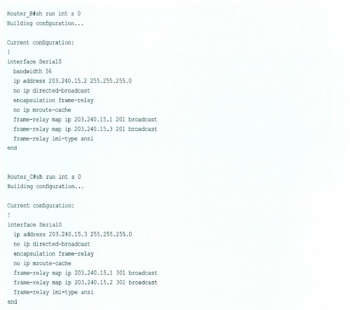

# 세상은 넓고 네트워킹은 계속된다

## 목차

- [WAN은 어렵다?](#wan은-어렵다-)
- [HDLC보다 괜찮은 PPP](#hdlc보다-괜찮은-ppp)
- [프레임 릴레이(Frame Replay)의 구성](#프레임-릴레이frame-replay의-구성)
- [ISDN의 추억](#isdn의-추억)

## WAN은 어렵다?

네트워킹을 하다 보면 듣는 이야기 중 하나가 바로 "WAN은 어렵다"는 말입니다. 그건 아마 기술이 어렵다기보다는 개념이 어렵다는 뜻일 겁니다. LAN은 바로 눈앞에 보이기 때문에 문제가 생기면 하나하나 만져보면서 문제를 해결할 수 있지만, WAN은 나 혼자만 잘한다고 되는 문제가 아니고, 또 전부 만져볼 수 있는 것도 아니기 때문에 더욱 어렵게 느껴집니다.  
하지만 WAN의 기본 개념을 튼튼하게 잡고, 내가 해야 할 부분과 전화국(통신 선로 담당)에서 해야 할 부분을 명확히 구분할 수 있다면 큰 문제가 안 됩니다. 사실 우리는 이미 WAN을 사용하는 데 너무나도 익숙해져 있기 때문이죠.

우리 곁의 WAN은 바로 전화기입니다. 하루에도 몇 번씩 울리는 휴대폰, 그리고 가정과 사무실에 한 대씩 자리하고 있는 유선 전화기, 팩스, 모뎀 같은 것들이 모두 WAN 장비입니다. 하지만 전화기를 쓰면서 어렵다는 생각을 하지는 않죠?  
마찬가지로 WAN 역시 그리 어려운 것이 아닙니다. 자주 쓰다 보면 금방 친숙해질 겁니다. 마치 우리 주머니 안에 있는 작고 예쁜 휴대폰처럼요.

자, 그럼 WAN이 무엇인가에 대해서 슬슬 알아볼까요? WAN이란, 한마디로 내가 직접 네트워크 케이블을 깔아서 통신을 연결할 수 없을 때 사용하는 네트워킹 방식입니다.

Wide Area Network라는 말처럼 넓은 지역에서는 네트워킹을 하기 위해 직접 케이블을 설치해서 통신한다는 것이 쉽지도 않을 뿐만 아니라 비용 측면에서도 결코 효율적이지 못합니다.  
서울에 사는 사람이 부산에 사는 친구와 전화를 하겠다고 서울에서 부산까지 전화 케이블을 까는것과 마찬가지죠.  
그때는 차라리 전화국을 통해 전화를 하는 것이 더 경제적이라는 겁니다. 마찬가지로 넓은 지역의 네트워킹에서도 중간에 통신 회사를 통해서 네트워킹을 구축하게 되는데, 이게 바로 가장 일반적인 WAN의 구성입니다.

WAN은 사용하는 목적, 사용료, 거리, 방법 등에 따라 다양한 종류가 있습니다. WAN이 어려운 이유 중의 하나도 바로 WAN의 구현 방법이 여러 가지이기 때문일 겁니다. 하지만 여러 가지 WAN의 방법도 다음 3가지 정도로 구분이 가능합니다.

- 전용선 방식(Leased Line) : 영어로 'Leased Line'이니, '임대회선'이라고 하는 것이 맞겠지만 일반적으로는 '전용선'이라고 부릅니다. 이 방식은 말 그대로 전화국과 같은 통신사업자에게 통신회선을 임대받아서 쓰는 방식입니다.  
  예를 들어 서울에서 부산까지 통신을 해야 한다면 통신사업자가 서울에서 부산까지 이미 설치해 놓은 회선 중 하나를 우리는 돈을 내고 대여해서 쓰는 겁니다. 나 혼자 빌려서 쓰는 것이니 마치 내가 설치한 통신회선처럼 사용할 수 있어 좋겠죠? 보안에도 크게 신경쓸 필요가 없지만 비용이 좀 많이 든다는 단점이 있습니다.  
  Leased Line을 전용선이라고 하는 이유가 이제 이해되시죠? 나 혼자만 쓸 수 있는 전용 라인이기 때문입니다.
- 회선 스위칭 방식(Circuit Switched) : 이 방식은 전용선 방식과는 달리 내가 통신을 하는 순간에만 나에게 필요한 회선을 열어주고 통신이 끝나면 회수하는 방식입니다. 이렇게 설명하니 꽤 복잡한 기술 같지만 우린 이미 서킷 스위칭 방식을 경험하고 있습니다.  
  가장 일반적인 것이 전화입니다. 전화를 걸 때 수화기를 들고 상대방의 전화번호를 누릅니다. 상대가 전화를 받으면 이때부터 전화국에서는 나에게 통신회선을 하나 열어준 것입니다. 내가 통화할 수 있게 말이죠.  
  전화가 끝나고 내가 수화기를 내려놓으면 전화국에서는 내가 사용했던 회선을 다시 회수해 갑니다. 이처럼 내가 통신하는 순간에만 나에게 회선을 쓸 수 있게 해주는 방식이 바로 서킷 스위칭 방식입니다. 방금 예를 들었던 전화뿐만 아니라 모뎀이나 ISDN 같은 경우가 이 방식에 해당합니다. 모두 다이얼을 돌려 상대와 연결해서 통신하고, 통신이 끝나면 회선을 반납하는 방식입니다.
- 패킷 스위칭 방식(Packet Switched) : 이 방식은 좀 다릅니다. 패킷 스위칭에서는 우리가 통신하는 순간에도 우리에게 통신회선 전체를 다 빌려주는 것이 아닙니다. 말 그대로 패킷 하나하나가 나뉘어서 통신회선을 타고 목적지까지 전달되는 방식이기 때문에 엄밀히 말하면 통신 회선을 다른 사람들과 나눠서 쓰는 방식이 바로 패킷 스위칭입니다.  
  따라서 패킷 스위칭 방식으로 통신을 할 때 실제로는 내가 가진 회선이 없지만 마치 내가 목적지까지의 회선을 가지고 있고, 데이터를 그 회선을 통해 전달하는 것처럼 동작하도록 해주어야 하는데, 이 목적 때문에 Virtual Circuit과 같은 개념이 나오게 됩니다.  
  버추얼 서킷이란, 앞에서 설명한 대로 사실은 나에게 배정된 회선이 없는데 마치 있는 것처럼 통신하는 방식입니다. 대표적인 패킷 스위칭 통신 방식은 프레임 릴레이, ATM, X25 등이 있습니다.

아래 그림을 보시면 지금까지 설명드린 3가지 WAN 방식이 나와 있습니다. WAN 방식에 따라 우리가 사용하는 접속 방식 역시 차이가 있습니다.

> 질문 있어요! QnA

Q WAN을 공부하다 보면 혼동되는 말이 나오는데, CPE라는 말과 Demarc라는 말이 있네요. 그리고 DTE, DCE는 또 뭔가요? 속 시원하게 설명 좀 해주세요!

A 네, CPE(Customer Premises Equipment)란, 쉽게 '고객이 가진 장비' 정도의 뜻으로 해석이 됩니다. 즉 고객 사이트에 있는 장비라고 보시면 되는데, 라우터, DSU/CSU 같은 장비가 바로 CPE 장비의 예입니다. 그럼 고객 사이트에 있는 스위치, 허브, 랜 카드도 CPE 장비가 아니냐고 물으실 텐데, 그것 역시 CPE라고 볼 수 있습니다.  
하지만 CPE라는 말은 주로 WAN쪽 서비스에서 통신사업자 장비와 고객장비를 구분하는 용도로 쓰이기 때문에 일반적으로 WAN과 관련된 DSU/CSU, 라우터까지 지칭합니다.

Demarc 또는 Demarcation은 우리말로 '경계'를 의미합니다. 즉 어디까지가 고객이 책임지는 부분이고, 어디까지가 서비스 제공자가 책임지는 부분이냐를 나눌 때 쓰는 말이죠. 이 이야기는 주로 WAN쪽에 문제가 생겼을 때 어디서부터 서비스 제공자(통신 사업자)가 책임을 지는가를 결정하기 위해 만들어진 용어로, 주로 DSU/CSU와 라우터쪽은 고객 책임이고, 회선부터는 통신사업자 책임이 됩니다.

사실 WAN을 구축하다 보면 이런 일이 많습니다. 예를 들어 서울과 부산 간의 통신이 갑자기 끊어졌다면, 네트워크 엔지니어는 이 문제가 라우터나 DSU/CSU 같은 고객쪽 장비 문제인지, 회선 같은 통신사업자 문제인지를 재빨리 알아내야 합니다.  
그러기 위해서는 장비뿐만 아니라 회선에 대해서도 많은 지식과 경험이 필요합니다. 그래야 전화국과 싸워서 이길 수 있겠죠? 잘못하면 우리쪽 문제가 아닌데도 책임을 뒤집어 쓰는 경우가 있거든요. 그만큼 WAN쪽은 경험이 중요합니다.  
회선도 살려보고 전화국 선로 담당자와도 자주 이야기를 해봐야 감을 잡기가 쉽답니다. 역시 해보는 것 밖에는 별다는 방법이 없죠?

DTE(Date Terminal Equipment)는 말 그대로 데이터가 WAN쪽으로 여행을 시작하는 터미널 같은 곳입니다. 사용자와 네트워크로 구분을 했을 때 사용자측에서 데이터의 송신이나 수신의 용도로 사용되는 장비니까 라우터가 대표적인 DTE가 되겠네요.  
반면 DCE(Data Communications Equipment 또는 Date Circuit-terminating Equipment)는 사용자와 네트워크로 구분을 했을 때 네트워크측으로의 연결 역할을 담당하는 연결 통로를 제공해줍니다. 대표적인 장비로 DSU/CSU가 있겠죠. 그리고 DCE는 여러분이 아시는 대로 클록을 제공한다는 특징을 가지고 있습니다.

## HDLC보다 괜찮은 PPP

이번에는 우리가 라우터의 시리얼(Serial) 라인에서 주로 사용하는 HDLC(High-level Data Link Control)에 대해서 간단히 알아보겠습니다.  
사실 HDLC는 PPP에 비해 그리 좋은 프로토콜은 아닙니다. PPP는 여러 가지 프로토콜을 통합해서 인캡슐레이션하는 기능, 다양한 보안 기능이 있어 HDLC보다 효과적입니다.  
특히 시스코 라우터의 시리얼 라인에서 디폴트로 사용하는 HDLC는 시스코만의 방식으로 표준 HDLC 프로토콜이 아닙니다.

> 알고 갑시다!

<b>HDLC는 표준 프로토콜일까요. 아닐까요?</b>

답은 바로 HDLC는 표준 프로토콜이다. 하지만 시스코에서 사용하는 HDLC는 표준 프로토콜이 아니다. 표준 HDLC는 그렇게 효과적인 프로토콜이 아니었다.  
지원하는 프로토콜도 하나밖에 안 된다. 하지만 시스코 HDLC는 여러 개의 프로토콜을 지원한다는 장점이 있다. 표준 HDLC 프로토콜보다 효과적인 HDLC를 시스코 라우터에서 사용하기는 하지만, 표준이 아니기 때문에 시스코 라우터와 다른 회사의 라우터를 서로 시리얼로 연결하는 경우에는 HDLC를 쓰면 안 된다.  
그럴 때는 PPP를 사용하는 것이 좋은데 실제 구성 시 이 문제 때문에 WAN을 살리지 못하고 고생하는 경우가 종종 있다. 똑같이 HDLC 인캡슐레이션을 썼는데 통신이 안 되니 괜히 회선이 문제가 있다느니, 장비가 고장이 났다느니 하면서 고생고생하는 것이다.

여러분도 특히 조심해야 합니다. 이상입니다.

그럼 라우터에서는 어떻게 HDLC를 Enable할까요? 일단 시리얼 인터페이스에는 디폴트로 Enable되어 있죠? 하지만 모뎀 라인과 같은 Async 라인에서 Enable해줄 필요가 있을 때는 다음 명령을 사용합니다.

위 그림을 보시면 표준 HDLC와 시스코의 HDLC가 비교되어 있습니다. 확실히 다르긴 다르죠? 혹시 시스코 라우터의 시리얼 인터페이스에 디폴트로 인캡슐레이션되어 있는 HDLC를 어디서 확인해야 하는지 모르는 분들을 위해 show interface에서 나오는 결과도 같이 정리했으니 확인해 보세요.

이제 PPP를 좀 알아볼까요? PPP(Point-to-Point) 프로토콜 WAN에서 가장 일반적인, 그리고 가장 괜찮은 인캡슐레이션 방식입니다.  
물론 시스코 장비를 쓰다 보면 전용선 같은 시리얼 라인에서는 주로 HDLC를 사용하게 되지만, ISDN 방식에서나 모뎀 접속에서는 거의 대부분의 접속을 PPP를 이용해서 구현하게 됩니다. (시리얼 라인에서도 PPP 사용은 가능한데, 타사 장비와 연결할 때는 PPP를 써야겠죠?)  
PPP는 강력한 보안기능과 여러 가지 네트워크 계층 프로토콜을 한꺼번에 지원하는 장점을 가진 표준 프로토콜이라는 것만 기억하시기 바랍니다.

PPP가 멀티프로토콜을 지원하고 강력한 보안기능을 지원하는 것은 PPP 안에 살고 있는 두 형제 때문입니다. 그것은 바로 NCP와 LCP입니다. (형제이다 보니 돌림자가 CP로 같네요.)  
NCP(Network Control Protocol)는 IP, IPX, AppleTalk 등 멀티프로토콜 지원을 책임지고 있고, LCP(Link Control Protocol)는 링크 접속에서의 보안, 에러 체크, 압축기능 및 멀티링크 PPP와 같은 다양한 접속 옵션을 제공합니다.

우리가 일반적으로 LCP를 주목하는 이유는 바로 보안기능 때문입니다. LCP는 여러 가지 기능중에서 보안기능을 제공함으로써 안전한 PPP 통신을 책임집니다. 아래 그림을 보면 LCP의 보안인증 과정은 데이터 링크 계층의 세션을 맺고 나서 네트워크 계층 간의 통신이 일어나기 직전에 발생합니다.  
다시 한 번 정리해 보면 먼저 데이터 링크 계층을 서로 연결하고, 그다음에 보안인증을 거친 후 보안인증 과정을 무사히 마치면 마지막으로 네트워크 계층을 서로 연결하게 되는 겁니다. (순서가 이해되시죠? 가끔 시험에도 나오는 것이니 잘 알아두세요.)

이번에는 PPP의 대표적인 보안인증 방법인 PAP과 CHAP을 알아보겠습니다. 먼저 PAP(PPP Authentication Protocol 또는 Password Authentication Protocol)은 간편하면서도 가장 일반적인 패스워드 확인법입니다. 아래 그림을 먼저 보시기 바랍니다.

서울과 부산에 있는 라우터가 PPP로 접속하고 있고 보안인증은 PAP을 사용한다고 가정하겠습니다. 이때 부산에 있는 라우터 'Busan'이 서울 라우터에 접속을 요청합니다. 부산 라우터는 서울 라우터에 접속을 요청하면서 자기의 Host Name(여기서는 Busan이죠.)과 패스워드를 서울 라우터에 보내게 됩니다.  
그럼 서울 라우터는 지금 부산 라우터로부터 받은 Host Name과 Password를 자신이 가지고 있는 Username/Password 자료와 비교해 봅니다. 그림에서 보는대로 Busan과 Cisco라는 패스워드가 서울 라우터가 가지고 있는 자료와 일치하죠? 이 경우에는 접속이 허가됩니다. 이것이 바로 PAP 방식 인증입니다.

그림에서 보이는 대로 통신이 2번 일어나므로 좀 유식하게 '2 Way Handshake 방식 인증'이라고도 합니다. Handshake가 악수이니 직역하면 '양방향 악수'가 되나요? 하지만 꼭 양방향 악수라고 직역해서 생각하실 필요는 없고, 인증을 위해 2번의 통신이 이루어진다고 생각하시면 될 것 같습니다.

다시 한 번 정리해 보면 PAP에서 접속을 원하는 라우터는 자신의 Host Name과 패스워드를 같이 실어서 상대방 라우터에 보내고, 이를 받은 상대방 라우터는 방금 받은 Host Name/Password 자료와 자신이 보유하고 있는 Username/Password 자료를 비교해서 같으면 접속을 허가하고, 틀리면 접속을 막는 방식입니다.

그런데 PAP는 간단하다는 장점이 있지만, 호스트 이름과 암호가 그대로 네트워크를 타고 이동하기 때문에 중간에서 해킹에 노출될 가능성이 있습니다. 그렇다고 호스트 이름과 암호가 Encryption(암호화)되어 이동하는 것도 아니므로 그 위험성은 더욱 크죠.  
이런 경우를 전문 용어로 '호스트 이름과 암호가 Clear Text로 이동한다'라고 합니다. 이 약점 때문에 실제 상황에서는 PAP보다는 앞으로 배우게 될 CHAP을 더 많이 사용합니다. 그래서 CHAP이 시험에도 더 많이 나오는 겁니다.

자, 그럼 이제 CHAP(Challenge Handshake Authentication Protocol)에 대해서 알아보겠습니다. CHAP는 PAP과 비교했을 때 2가지 특징이 있습니다. 첫 번째는 PAP처럼 중간에서 해킹을 할 수 없게 만들었다는 겁니다.  
두 번째는 PAP이 2-Way Handshake라면 CHAP은 3-Way Handshake 방식입니다. 이런 2가지 특징이 가능한 이유를 지금부터 알아보겠습니다. 먼저 아래 그림을 보시기 바랍니다.

그림에 영어가 좀 섞여 있어 어렵게 보일 수도 있지만 사실 알고 보면 별것 아닙니다. 먼저 부산 라우터가 접속을 시도하면 서울 라우터는 그림에서처럼 챌린지(Challenge)를 보냅니다.

챌린지를 보내는 것은 이 코드 값을 이용해서 다음에 답을 보내라는 뜻입니다. 어쨌든 "서울 라우터야, 접속하고 싶으면 이것 받아!" 하면서 챌린지를 보내는 겁니다. 그럼 부산 라우터는 수신한 챌린지 값을 가지고 자신의 패스워드를 암호화하게 됩니다.

좀 더 어렵게 이야기하면 '해싱한다'고 하는데, 해싱(Hashing)은 기존의 데이터를 어떤 코드 값을 이용해서 완전히 변형시켜서 절대 원본 데이터로 돌아갈 수 없게 만드는 겁니다.  
예를 들어 사과라는 원래 재료를 믹서라는 코드 값을 이용해서 갈아 사과주스를 만들었다고 합시다. 이렇게 만든 사과주스는 비록 믹서기로 사과를 갈아 만들었다는 것을 알게 되더라도 절대 다시 사과로는 바꾸지 못하겠죠? 해싱은 바로 이런 방식입니다. 원본 값을 절대로 만들지 못하게 하는 것이죠.

이야기가 좀 벗어났는데 어쨌든 이렇게 패스워드를 해싱한 값을 서울 라우터에 보내면 서울 라우터는 자기가 가지고 있던 패스워드를 같은 방법으로 해싱해 보는 것입니다. 이렇게 서울 라우터가 해싱해서 나온 값과 방금 부산 라우터가 해싱해서 보낸 값을 비교해서 이 값이 서로 같으면 인증을 통과시키는 방식이죠.  
즉 자기도 사과를 믹서기로 갈아서 주스가 되는지 보는 것이죠. 어때요, 별로 어렵지 않죠?

정리하면, 먼저 부산 라우터의 접속 요청을 받은 서울 라우터가 챌린지라는 코드 값을 부산 라우터에 보내주고, 부산 라우터는 챌린지 값을 이용해서 패스워드를 해싱한 후 그 값을 서울 라우터에 보냅니다.  
이 값을 받은 서울 라우터는 자기도 똑같은 해싱 방법으로 결과를 만들어서 자기가 만든 값과 부산 라우터에게 받은 값을 비교해서 같으면 통과시키고, 틀리면 통신을 끊는 방식입니다.  
지금 설명을 드린 CHAP은 패스워드 자체가 네트워크로 이동하지는 않기 때문에 중간에 해킹해도 패스워드를 알 수 없다는 장점이 있습니다. PAP보다 훨씬 강력한 보안이죠.

이제 PAP과 CHAP에 대해서 이해가 되셨죠? 혹시 아직도 고개를 갸우뚱하신 분들이 계시다면 PAP과 CHAP에 대한 질문과 답변을 한 번 읽어보세요. 분명 이해가 되실 겁니다.

> 질문 있어요! QnA

Q 안녕하세요. 후니님. 다름이 아니라 PPP 보안 인증 중에 PAP와 CHAP이 있잖아요. PAP은 대충 이해가 가는데, CHAP은 이해될 듯하면서도 이해가 잘 가지 않네요. 알기 쉽게 설명 좀 해주세요. 챌린지 값이 구체적으로 어떤 건가요?

A 네, 우리가 보통 WAN 구간을 세팅할 때 흔히 쓰는 기법 중 하나가 바로 PPP(Point To Point) 프로토콜입니다. 즉 1대 1로 접속하는 방식이죠. 이렇게 PPP를 사용하는 경우 양쪽 라우터가 서로를 확인하기 위한 보안 방법이 필요한데, 크게 두 종류가 있습니다.  
하나는 PAP(PPP Authentication Protocol, '팹'이라고 읽습니다.)이고 다른 하나는 CHAP(Challenge Handshake Authentication Protocol, '챕'이라고 읽습니다.)입니다.

PAP은 쉽습니다. 그냥 접속하고자 하는 녀석이 자기의 Host Name과 Password를 상대 라우터에게 보냅니다. 그것을 보고 맞으면 접속을 허락하는 것이니 정말 쉽죠.  
흔히 군대에서 보초를 설 때 누가 오면 암호를 묻는데, 그때 상대가 암호를 말해서 맞으면 통과시키는 것과 같습니다.  
간단해서 좋긴 한데 문제가 하나 있죠. 만약 두 사람의 대화 내용을 누군가가(간첩이겠죠?) 듣는다면 그 사람도 암호를 알게 됩니다. 따라서 PAP은 간단하다는 장점이 있지만, 암호가 네트워크상에서 Clear Text로 날아다니기 때문에 안전하다고 볼 수 없습니다.

그러나 CHAP은 다릅니다. 마치 군대에서 가지고 있는 난수표처럼 자기가 아는 암호를 바로 부르는 것이 아니라 암호를 다른 형태로 만들어서 불러줍니다. 예를 들어 암호가 '백두산'이라면 보초는 '암호가 뭐냐?'라고 묻는 것이 아니라 '암호에 들어가는 받침이 모두 몇 개냐?' 식으로 물어봅니다.  
그럼 통과자는 자기가 알고 있는 '백두산'의 받침을 세어 '받침은 2개다.'라고 말해주면 보초는 그걸 듣고 자기가 들어야 할 암호, 즉 백두산의 받침 개수를 세어보고 방금 받은 받침 개수 2와 일치하니 암호가 맞는다고 생각하고 통과시켜 주는 방식입니다.  
만약 이때 간첩이 2개라는것을 듣는다고 해도 원래 암호인 '백두산'을 알 수는 없겠죠? 물론 다음 번에는 받침을 묻는 것이 아니고 글자 수나 'ㅅ'의 개수를 묻는다든지 챌린지 값에 변화를 주는 것이죠. 따라서 받침 2개만 알아서는 절대로 통과가 되지 않습니다.

이것은 예를 든 것으로, 물론 실제 통신에서는 이와 다르겠죠? 실제 통신에서는 Host Name과 Password를 해싱한다고 합니다. 즉 특정 규칙으로 다시 바꿔버리는 겁니다. 그리고 그 해싱 값을 상대에게 보냅니다. 그러면 상대는 역시 자기가 가지고 있던 원본을 같은 방법으로 해싱해서 지금 들어온 값과 비교하는 겁니다.  
이 두 해싱 값이 같으면 접속을 허락하는 것이죠. 이렇게 되면 서로 간에 Host Name이나 Password가 직접 전달되지 않기 때문에 중간에서 보려고 해도 할 수가 없겠죠? 그래서 PAP에 비해 훨씬 보안에 안전하다고 하는 겁니다.

보통 CHAP은 3Way Handshaking을 한다고 합니다. 즉 첫 번째 접속을 원하는 녀석이 있다는 걸 알게 되면 챌린지를 보냅니다.  
다시 말해 '네가 가진 Host Name과 Password를 이 방법으로 해싱해서 보내보라'는 겁니다. 두 번째는 챌린지를 받은 접속할 녀석이 그 요청대로 해싱해서 결과를 보내는 과정입니다. 그리고 마지막 세 번째는 다시 해싱 값을 받은 라우터는 자기의 값과 방금 받은 값은 비교해서 접속을 허락합니다.

이해가 되셨는지 모르겠네요. 결론을 내리면, PAP이나 CHAP이나 둘 다 PPP 접속을 안전하게 하기 위한 방법인데, PAP은 간단하지만 암호를 직접 주고받는 방식이라 해킹의 염려가 있습니다. 반면 CHAP은 암호를 직접 주고받지 않고 암호를 해싱이라는 방식으로 한 번 변형을 시켜 주고받기 때문에 해킹에 안전하다는 겁니다.

## 프레임 릴레이(Frame Relay)의 구성

자, 이번에는 기대하고 기대하시던(?) 프레임 릴레이 세팅에 대한 이야기를 드릴까 합니다. 사실 프레임 릴레이에 대해서 설명드리려면 꽤나 많은 설명을 드려야 합니다.  
X.25와 비교해서 어떻구 저떻구, 또 용어는 뭐가 있고...., 하지만 여기서는 자세한 이야기는 생략하도록 하겠습니다.

우리가 실무에서 프레임 릴레이 스위치를 통한 라우터 연결을 할 때 어떤 식으로 구성을 해주어야 하는가를 알아보는 겁니다.  
또 구성 후에는 무엇을 확인하는가를 알아볼 겁니다. 미리 말씀드리지만 여기서는 실습 환경이기 때문에 라우터 한 대를 마치 프레임 릴레이 스위치처럼 구성한 후 나머지 라우터들을 연결합니다. 여러분도 아마 혼자 공부하려면 이런 구성을 알아두는것도 도움이 될 거라고 생각합니다.

그래도 잠깐 프레임 릴레이에 대해서는 알고 넘어가야겠죠?

기존 WAN에서 전통적으로 사용하던 통신 방식은 X.25라는 방식이었습니다. 아마 처음 들어보신 분들도 있겠지만, 이 방식은 느리고 에러가 많았던 옛날의 WAN 환경에 알맞도록 여러 가지 에러 복구 기능 및 흐름 제어 기능이 들어 있습니다.  
하지만 프레임 릴레이 방식은 에러 복구와 흐름 제어 등의 데이터 처리 과정을 생략함으로써 보다 효율적인 데이터 전송 방법을 제공하게 되었습니다. 그러니까 프레임 릴레이 방식은 X.25에 비해 빠르고 효과적이지만 에러 제어 기법은 거의 제공이 안 된다고 생각하면 이해가 쉬울 것입니다.

프레임 릴레이에 대한 기술적인 사항은 앞으로 기회가 있을 때마다 설명드리도록 하겠습니다. 이번에는 프레임 릴레이 세팅에서 자주 나오는 몇 가지 용어에 대해서 한번 알아보겠습니다.

Data-Link Connection Identifier(DLCI)는 한마디로 프레임 릴레이 연결을 위한 주소라고 생각하면 됩니다. X.25 방식의 경우는 주소 지정을 위해 X.121이라는 주소 방식을 사용했는데(이건 모르셔도 됩니다.) 프레임 릴레이의 경우는 바로 DLCI라는 녀석을 사용하는 겁니다.  
나중에 구성을 보면 이해가 가겠지만 하나의 링크(이건 피지컬한 링크가 아니라 논리적인 링크를 말합니다.)에 하나씩의 DLCI가 배정됩니다. 따라서 실제 하나의 인터페이스에 여러 개의 DLCI가 있을 수 있습니다. 왜냐하면 한 인터페이스가 여러 개의 논리적 링크를 가지고 있을 수 있기 때문입니다.

LMI(Local Management Interface)란 말이 나옵니다. 이것은 DLCI 정보와 함께 설정된 PVC 정보를 알려줌으로써 인터페이스의 다양한 정보와 동작 상태 등을 제공하는 기능입니다.  
즉 LMI는 특정 동작 상태에 관련된 정보를 인접 라우터들에게 알려줌으로써 프레임 릴레이 네트워크상의 Virtual Circuit의 상태를 쉽게 파악할 수 있게 해주는 기능을 제공합니다.  
하지만 여기에서 여러분이 아셔야 할 내용은 LMI 자체보다는 라우터에서 LMI를 세팅할 때 LMI 타입을 서로 맞추어 주어야 통신이 가능하다는 것입니다.  
LMI 타입으로는 시스코의 LMI, ANSI 617 Annex D LMI, 그리고 ITU-T의 Q.933 Annex A LMI 등 3가지가 있는데, ANSI 방식이 가장 널리 사용되는 방식입니다. 이 부분 역시 뒤에서 구성을 하면서 설명드리도록 하겠습니다.

자, 대충 이쯤 해놓고 프레임 릴레이의 구성에 대해서 한번 알아보겠습니다. 뭐든지 제대로 하려면 끝이 없겠지만 여기서는 대충 '이런 것이 프레임 릴레이 구성이구나' 하는 정도만 알아보려고 합니다.  
그래야 나중에 프레임 릴레이 구성을 하더라도 어디서부터 공부를 해야 하는지를 알 수 있을 테니까요.

먼저 프레임 릴레이 인터페이스의 인캡슐레이션(Encapsulation) 방식에 대해서 알아보겠습니다. 인캡슐레이션이란, 프레임 릴레이망을 통과할 때 마치 캡슐로 덮어 씌우는 것처럼 포장을 한다고 생각하면 됩니다.

아무튼 프레임 릴레이 인캡슐레이션 방식은 Cisco 방식과 IETF 방식으로 두 가지가 있습니다. 그런데 시스코 라우터의 경우 디폴트는 Cisco 방식을 사용하기 때문에 시스코 라우터끼리는 Cisco 방식을 사용하는 것이 편하고 만약 시스코 라우터와 타사 라우터를 서로 같이 사용하는 경우에는 IETF 방식을 인캡슐레이션 방식으로 사용하는 것이 바람직합니다. 아래에 있는 명령을 보면서 설명드리겠습니다.

먼저 프레임 릴레이의 인캡슐레이션 명령은 인터페이스에 해주는 것이라는 것을 잊지 말기 바랍니다. 따라서 먼저 일반 구성 모드(Router(config)#)에서 인터페이스 구성 모드 (Router(config-if)#)로 들어와야 합니다.  
인터페이스 구성 모드에 와서 encapsulation frame-relay 명령을 입력하고 마크를 넣어보니 뒤에 올 수 있는 것은 IETF와 그냥 ``Enter`` 키, 즉 encapsulation frame-relay ietf 또는 encapsulation frame-relay를 써줄 수 있습니다.  
여기서 encapsulation frame-relay ietf는 ietf 방식의 인캡슐레이션을, encapsulation frame-relay는 Cisco 방식의 인캡슐레이션을 의미합니다.

다음은 LMI(Local Management Interface) 값입니다. 기본적으로 프레임 릴레이 구성에서는 원활한 프레임 릴레이 설정을 위해서 서비스 공급자(ISP)에게 반드시 정확한 LMI 종류를 알아봐야 합니다.  
시스코 라우터의 인터페이스는 서비스 공급자(ISP)에게 반드시 정확한 LMI 종류를 알아봐야 합니다. 시스코 라우터의 인터페이스는 서비스 공급자의 LMI 종류와 일치하는 LMI로 세팅되어 있어야만 제대로 작동될 수 있습니다.  
LMI는 현재의 DLCI 값, global 또는 local significance DLCI 값, 그리고 virtual circuit의 현재 작동 상태 등의 정보를 알려주기 위한 값이라고 생각하면 됩니다.

LMI 세팅은 요즘 나오는 시스코 IOS 버전의 경우, 즉 IOS 버전 11.2 이상부터는 서비스 공급자의 LMI 시스코 라우터가 자동으로 감지하고 세팅해주기 때문에 따로 구성할 필요가 없습니다. 하지만 11.2 이전 버전에서는 꼭 필요한 구성입니다.

LMI 구성에 대한 방법이 아래에 나와 있습니다.

앞의 예에서처럼 LMI 타입에 대한 세팅 역시 인터페이스에서 하도록 되어 있습니다. 가능한 LMI 타입은 앞에서와 같이 Cisco, ansi, q933a 등 3가지가 있습니다. 하지만 요즘에는 LMI를 자동으로 인식하기 때문에 따로 명령을 써줄 필요가 없습니다.

다음은 프레임 릴레이에서 각 논리적 링크에 부여하는 값인 DLCI와의 매핑에 대한 설명을 드리겠습니다. 사실 위에서 배운 프레임 릴레이의 인캡슐레이션과 LMI 방식, 그리고 지금 배울 DLCI 매핑이면 프레임 릴레이는 끝입니다.

별로 어려울 것도 없는 프레임 릴레이는 실은 몇 가지 처음 듣는 단어와 개념 때문에 어렵게 느껴지는데, 그 중 하나가 바로 서브 인터페이스(sub interface)가 아닌가 합니다. 그래서 우선은 서브 인터페이스에 대해서 알아보고 넘어가겠습니다.

아래 그림에서 위에 있는 그림은 실제 프레임 릴레이의 구성입니다. 라우터의 시리얼 인터페이스가 프레임 릴레이 스위치와 연결되어 있는 그림입니다. 여기에서 라우터 A를 보면 라우터 A의 Serial 0 인터페이스가 프레임 릴레이 스위치와 연결됨으로써 라우터 B, 라우터 C와 연결되었습니다.

그러나 논리적인 구성도에서의 링크는 그림의 아래에 있는 것처럼 2개입니다. 즉 라우터 A에서 라우터 B로의 링크와 라우터 A에서 라우터 C로의 링크입니다.  
따라서 라우터 A의 경우는 한 인터페이스가 2개의 논리적 링크를 가지게 되는데, 이때는 서브 인터페이스로의 구성이 가능합니다. 물론 서브 인터페이스 구성을 하지 않을 수도 있습니다.

만약 라우터 A가 서브 인터페이스로 구성된다면 바로 위의 그림과 같게 됩니다. 즉 실제로는 라우터 A에서 회선이 1개가 나갔지만, 마치 2개의 회선을 가지고 있는 것처럼 사용할 수 있습니다.  
이렇게 서브 인터페이스를 지정하면 이 서브 인터페이스도 마치 실제 인터페이스처럼 프레임 릴레이 인캡슐레이션 방식도 지정하고, LMI 방식도 지정하며, 또 IP 주소도 부여할 수 있습니다.

서브 인터페이스를 지정하는 방법은 먼저 서브 인터페이스를 지정하고자 하는 인터페이스명을 앞에 쓰고, 뒤에 점을 찍어서 서브 번호를 붙이면 됩니다.

즉 serial 0 인터페이스를 서브 인터페이스로 나누고자 하는 경우에는 위에서처럼 interface serial 0 뒤에 점을 찍고 1번부터 계속 써주면 됩니다. 이때 서브 인터페이스는 두 종류를 만들어줄 수 있는데, 한 곳에서 여러 곳으로 연결해주는 서브 인터페이스 타입인 multi-point 와 일대일 연결 타입인 point-to-point 타입이 있습니다.

위 프레임 릴레이 그림의 경우는 라우터 A에서 라우터 B와 라우터 C로 나간 서브 인터페이스가 서로 다른 네트워크(하나는 203.250.15,0이고, 또 하나는 203.240.20.0 네트워크)로 구성되었기 때문에 point-to-point로 구성하였습니다.

그럼 여기에서 라우터 A의 시리얼 인터페이스 구성을 잠깐 구경해볼까요?

여기서 중요한 것이 많이 나오네요. 자세히 봐두기 바랍니다.

우선 여기에서 보이는 것처럼 라우터 A가 서브 인터페이스로 구성되다 보니까 라우터 A의 실제 인터페이스인 Serial 2/0에는 IP 주소 구성이 없습니다. 즉 IP 주소를 실제 인터페이스에 하지 않고 서브 인터페이스에 했다는 것을 기억해 두기 바랍니다.

피지컬 인터페이스에서 세팅하는 것은 이 인터페이스의 인캡슐레이션 방식(encapsulation frame-relay)과 여기서 사용된 LMI 타입(frame-relay lmi-type ansi)입니다.  
앞에서 설명드린 대로 LMI 타입은 이 프레임 릴레이망에 연결된 모든 라우터에서 같이 맞추어 주어야 합니다. 디폴트는 Cisco라는 것을 이제는 아시죠?

자, 이렇게 피지컬 인터페이스를 구성하고 나면 이제 서브 인터페이스를 구성하게 됩니다. 서브 인터페이스의 구성법은 앞에서 배웠습니다. 그대로 서브 인터페이스를 하나 만든 다음에 서브 인터페이스의 타입은 point-to-point로 정의했습니다.  
그리고 이 서브 인터페이스에 IP 주소를 입력하게 됩니다. 마치 진짜 인터페이스인 것처럼 말이죠.

그 다음에 잊지 말고 꼭 해줘야 하는 것이 DLCI 연결입니다. 물론 프레임 릴레이의 구성에서 Encapsulation 타입과 LMI만 잡아주면 Inverse ARP라는 것이 동작해서 자동으로 연결이 가능하도록 해주지만, 보통은 inverse ARP 대신 여기에서처럼 frame-relay interface 명령이나 frame-relay map 명령을 사용해서 수동으로 설정을 하게 됩니다. 여러분들도 가능하면 제가 하는 방식을 사용하시기를 권합니다.

특히 여기서 주의해야 하는 것은 frame-relay map 명령과 Inverse ARP는 같이 동작하지 않는다는 것입니다.  
따라서 만약 Inverse ARP를 사용하는 경우에는 절대로 frame-relay map을 같이 사용하면 안 되므로 주의하기 바랍니다. (이런 문제는 CCIE 시험에도 간혹 나오고 있습니다.)

맨 처음 프레임 릴레이를 세팅하면 자동으로 Inverse ARP가 동작하기 때문에 아무 문제없이 연결이 됩니다. 즉 핑이 되는 겁니다. 그러다가 만약 다른 하나를 더 프레임 릴레이망에 붙일 일이 발생해서 이것을 연결할 때 frame-realy map을 사용했다고 가정하면, 이 경우에도 제가 경고한 것과는 달리 모든 라우터들의 연결이 잘 되고 정상적으로 핑이 가능합니다.  
그런데 만약 이 라우터들을 전부 껐다 켜는 경우에는 라우터가 부팅하면서 frame-realy map 명령이 있는 것을 알고 Inverse ARP를 동작시키지 않기 때문에 정상적인 연결이 되지 않는 겁니다. (그러니까 더 혼돈이 오겠죠? 껐다 켜기 전까지는 잘 되었는데 한 번 부팅하고 나서 안 되니 말입니다.)  
따라서 아까 말씀드린 대로 Inverse ARP를 믿기보다는 여기에서처럼 framerelay map과 frame-relay interface-dlci를 이용해서 수동으로 연결을 해주시기 바랍니다.

여기에서처럼 서브 인터페이스를 만들고 그 타입이 point-to-point인 경우는 frame-relay map 명령을 사용하지 않고 frame-relay interface-dlci를 사용한다는 것도 알아두기 바랍니다.  
이 명령의 형식은 frame-relay interface-dlci 뒤에 자기 라우터의 Local DLCI 번호를 넣어주면 됩니다.

만약 라우터 A와 같이 point-to-point 서브 인터페이스에 frame-relay interface-dlci 명령 대신 frame-relay map 명령을 사용하게 되면 다음과 같은 에러 메시지가 나타납니다.

그럼 라우터 B와 라우터 C의 구성도 같이 알아볼까요?

라우터 B와 라우터 C의 구성이 있습니다. 이 두 라우터의 경우에는 서브 인터페이스를 사용하지 않고 피지컬 인터페이스를 그대로 사용했습니다. 따라서 피지컬 인터페이스에 IP 주소를 그대로 부여한 것을 볼 수 있습니다.  
또 인캡슐레이션 방식(encapsulation frame-relay)과 LMI타입(frame-relay lmi-type ansi)도 라우터 A, B, C가 일치함을 알 수 있습니다.

여기에서 알아야 할 것은 frame-relay map 명령입니다. 위와 같이 피지컬 인터페이스나 multi-point 서브 인터페이스를 이용해서 프레임 릴레이를 구성하는 경우에는 위와 같은 frame-relay map 명령을 사용하게 됩니다.  
frame-relay map 명령의 사용 형식은 다음과 같습니다.

즉 프레임 릴레이에서 사용할 프로토콜(여기서는 IP)을 쓰고, 상대편의 주소(여기서는 상대의 IP 주소)를 넣은 후 자신의 DLCI 번호를 넣고 맨 마지막에 브로드캐스트를 넣게 됩니다. 라우터 B의 구성에서

상대편 라우터, 즉 라우터 A의 IP 주소는 203.240.15.1이고, 라우터 B에서 라우터 A쪽으로 연결된 프레임 릴레이의 DLCI 값은 아래 그림에 있는 것처럼 201입니다. 그리고 마지막에 브로드캐스트를 활성화했습니다. 라우터 C의 구성 역시 마찬가지입니다.

이렇게 프레임 릴레이의 구성을 마쳤으면 라우터에서 현재의 상황을 검증해야 합니다. 이때 사용하는 명령이 show frame-relay pvc입니다.

이때 위와 같이 라우터 A에서는 2개의 프레임 릴레이 PVC를 사용했음을 알 수 있습니다. 즉 DLCI 102번과 103번입니다. 또 이 2개의 PVC는 현재 ACTIVE 상태라는 것도 알 수 있습니다. 그리고 각 PVC에 사용한 인터페이스는 serial 2/0.1과 serial 2/0.2라는 것도 보여줍니다.

여기서 특히 주의깊게 보셔야 할 것은 PVC STATUS = ACTIVE 부분으로 이 상태가 ACTIVE 이외의 상태, 즉 inactive나 deleted 상태의 경우는 프레임 릴레이 연결의 문제가 있는 것임을 알아야 합니다.

또 하나 프레임 릴레이망의 상태를 확인하는 명령은 show frame-relay map입니다. 즉 프레임 릴레이망이 어떻게 연결되어 있는지와 그 상태를 보여주는 명령입니다.

여기에서처럼 serial 2/0.1은 상태가 inactive로 보이고, serial 2/0.2는 상태가 active로 보입니다. 따라서 라우터 A와 B 구간은 프레임 릴레이 구간에 문제가 있음을 알 수 있습니다.

이번에는 아래 그림을 보기 바랍니다. 아까 그림과 비슷한 것 같기도 하지만 약간의 다른 점이 보입니다. 무엇일까요?

네, 그렇습니다. 이전 그림에서는 라우터 A와 라우터 B 구간 네트워크, 라우터 A와 라우터 C 구간의 네트워크가 서로 다른 네트워크였습니다. 그러나 위 그림에서는 라우터 A, B, C의 프레임 릴레이망이 모두 같은 네트워크라는 것을 알 수 있습니다.

이때 라우터 A에 사용되는 서브 인터페이스 타입이 바로 multi-point입니다. 자, 그럼 이때 라우터 A를 구성해 볼까요?

이전 구성과 비교해서 보면 훨씬 도움될 것입니다. 앞에서 설명드린 대로 하나의 서브 인터페이스에서 라우터 B와 C로 연결되어 나갔기 때문에 이번에는 서브 인터페이스의 타입이 multi-point로 바뀌었습니다.  
또 아까는 frame-relay interface-dlci 명령을 사용했는데, 이번에는 frame-realy map 명령을 사용했고 두 군데 모두 맵을 잡았음을 알 수 있습니다.

여기서 또 하나 주의해주어야 할 것은 라우터 B와 라우터 C의 구성입니다.

앞의 그림을 보면 라우터 B와 라우터 C는 각각 라우터 A하고만 연결이 되어 있습니다. 따라서 언뜻 생각하기에는 라우터 B나 라우터 C에서는 라우터 A와의 frame-relay map만을 잡아주면 될 것이라고 생각하겠지만 사실은 그렇지 않습니다.

라우터 구성을 살펴보면 라우터 B는 라우터 A와 라우터 C에 대한 frame-relay map을 모두 잡아주었고, 또 라우터 C는 라우터 A뿐만 아니라 라우터 B에 대한 frame-relay map을 구성해 주었습니다.  
이처럼 라우터 B와 라우터 C가 서로를 frame-relay map으로 구성해 주지 않으면 서로 간의 통신은 불가능합니다. 이것을 주의하기 바랍니다.

그럼 아까 배운 대로 프레임 릴레이의 상태를 라우터 B에서 확인해 보겠습니다.

보이는 대로 라우터 B는 라우터 A(203.240.15.1)와 라우터 C(203.240.15.3)로 2개의 PVC를 맺고 있음을 알 수 있습니다. 그럼 라우터 B에서 라우터 A와 라우터 C로 핑을 한번 보내 볼까요?

어때요? 프레임 릴레이도 별것 아니라는 것을 아셨죠? 사실 프레임 릴레이를 실제 구성하려고 하는 경우에는 구성 자체의 어려움보다는 회선을 체크하고 DLCI 번호를 받는 등의 일 때문에 시간이 지체되는 경우가 많습니다.

따라서 어딜 가나 경험이 있어야 한다는 것은 여기에서도 적용됩니다. 아무튼 여러분은 여기서 배운 정도의 지식만 가지고 있으면 지금 당장 프레임 릴레이를 구성하러 가도 아무 이상없이 잘 할 수 있을 겁니다.  
자, 조금은 어렵고 조금은 지루했던 프레임 릴레이의 구성은 여기까지입니다.

참고로 지금 우리가 사용하고 있는 프레임 릴레이 스위치의 구성을 한번 보여드리겠습니다. 여러분이 이것까지 아실 필요는 없습니다. 그냥 재미삼아 구경하기 바랍니다.

우리가 중간에 있다고 가정한 프레임 릴레이 스위치는 아래 그림에서 보이는 대로 라우터 1대입니다. 여기서는 시스코 1750 라우터에 4개의 시리얼 인터페이스를 달아서 프레임 릴레이로 사용했습니다. 그림을 먼저 보고 프레임 릴레이 스위치의 구성을 보기 바랍니다.

그림에서처럼 라우터 A, B, C는 중간에 있는 프레임 릴레이 스위치와 Back-to-Back 케이블을 이용해서 연결되었습니다. 따라서 DCE 케이블 쪽에서는 클록을 입력해 주어야 한다는 것을 이제 알고 계실 겁니다.  
혹시 기억나지 않으면 라우터의 Back-to-Back 구성을 다시 한 번 찾아서 읽어보기 바랍니다. 여기 구성에서는 프레임 릴레이 스위치쪽이 모두 DCE로 세팅되어 있습니다.

그럼 이제 프레임 릴레이 스위치 역할을 수행하는 라우터의 구성을 보겠습니다.

구성은 보이는 대로 그리 어렵지 않습니다. 이것은 프레임 릴레이 스위치로 구성되기 때문에 IP 주소를 입력할 필요가 없습니다. 단지 어느 인터페이스에서 돌아온 것을 어디로 내보내주기만 하는 스위치라고 생각하면 됩니다.

따라서 맨 위에 frame-relay switching이란 명령을 이용해서 자신이 프레임 릴레이 스위치의 역할을 수행함을 정의했습니다.

이제 라우터 A와 연결된 시리얼 0 인터페이스를 보겠습니다. 말씀드린 대로 시리얼 0 인터페이스는 DCE쪽입니다. 따라서 클록을 설정해 주어야 하는데, clockrate 2000000 명령을 사용해서 클록을 지정했습니다.  
그리고 현재 이 라우터가 프레임 릴레이의 스위치로 동작하기 때문에 프레임 릴레이 인터페이스 타입 역시 DCE로 지정합니다. (frame-relay intf-type dce, 여기 나온 DCE는 케이블 타입을 말하는 것이 아니고 프레임 릴레이 스위치쪽에는 항상 DCE로 세팅합니다.) 역시 프레임 릴레이 스위치에서도 LMI 타입과 인캡슐레이션 타입은 똑같이 맞춰줍니다.

이제 frame-relay route 명령을 이용해서 인터페이스와 DLCI 번호를 이어주는 일이 남았습니다. 시리얼 0 인터페이스에서

은 라우터 A에서 DLCI 102번으로 들어온 것은 시리얼 1쪽, 즉 라우터 B쪽으로 연결해 주며, 이때 라우터 B쪽에서 사용되는 DLCI 번호는 201이라는 것을 지정하는 명령입니다. 즉 여기서 102는 로컬 DLC를, 201은 리모트 DLCI 번호를 나타냅니다.

또 라우터 A쪽에서 103으로 들어온 것은 시리얼 2쪽, 즉 라우터 C쪽으로 보내줍니다. 이때 라우터 C쪽에서 라우터 A쪽으로의 연결은 DLCI 301이 된다는 것을 지정하는 명령은 framerelay route 103 interface Serial 301이 됩니다.

대충 이렇게만 알면 다음에 혼자 프레임 릴레이 스위치를 구성하실 때 도움이 될 겁니다. 자, 지루하고 어려웠던 프레임 릴레이의 구성은 여기까지입니다.

## ISDN의 추억

