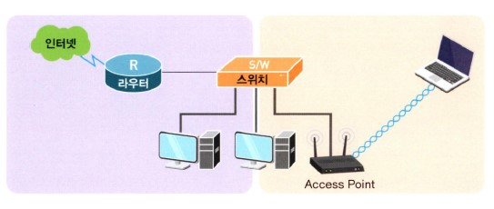
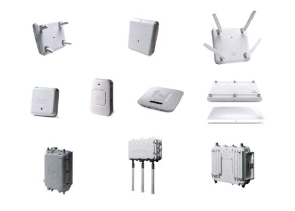
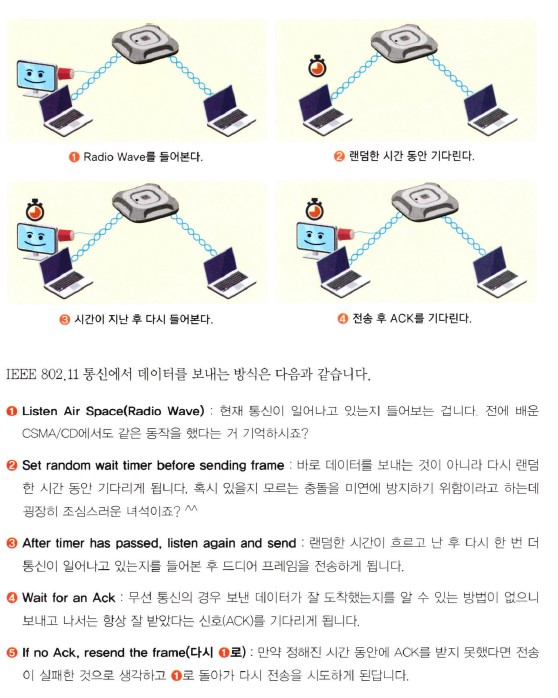
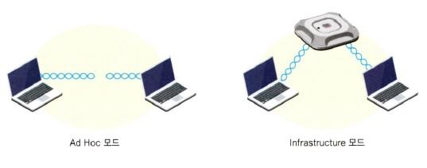
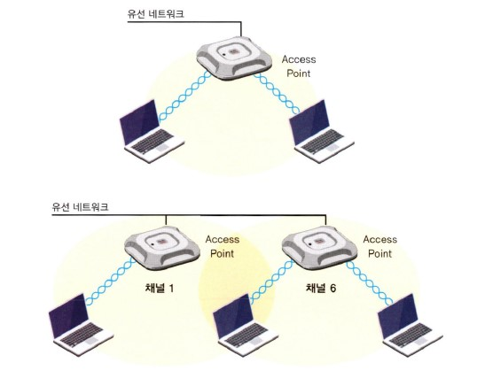

# 무선으로의 여행

## 목차

- 무선으로의 여행
- 무선 랜에서의 2가지 중요한 모드
- 무선 랜의 통신 표준
- 무선 통신에서의 3가지 인코딩 방식
- 무선 네트워크에도 이름이 있답니다 - SSID
- 무선 네트워크에서의 보안
- AP를 직접 만져보자
- AP를 직접 구성해볼까요?
- 정말 색다른 네트워크 장비(?)

## 무선으로의 여행

세상이 점점 편리함을 추구하고, 어느 곳에 있더라도 내가 원하는 정보를 주고받는 통신만은 포기할 수 없는 요즘 시대에 인터넷은 정해진 장소, 정해진 컴퓨터에서만 가능하다라고 말한다면 그 말을 받아들일 사람은 아마 몇 안 될 겁니다.

'컴퓨터'라고 하면 떠오르던 옹장한 데스크톱이 이제는 작고 앙증맞기까지 한 노트북으로 바뀌어가는 추세이고, 이 책의 앞쪽에서 침 튀기며 설명한 랜 카드도 이제는 기억이 가물가물해지고 있는 건 어쩌면 당연한 결과인지도 모르겠습니다.

그러다 보니 이제 네트워크에서도 선을 깔아서 연결하던 유선 방식 이외에 무선이라는 방식이 점점 일반화되어가고 있습니다.

이제 커피숍에서도 노트북을 꺼내 들고 무언가 중요한 일을 하면서 메일을 주고받고 있고, 공항, 호텔, 심지어 차 안이나 비행기 안에서도 무선으로 인터넷을 접속하는 건 이제 일상의 모습이 되어버렸습니다.

요즘은 뭐 집에서도 노트북 한두 대 쯤은 거의 있을 정도니 가정에서의 무선 통신 역시 일반적인 추세가 됐죠?

암튼 이제 우리는 유선 네트워킹 말고도 알아야 할 게 또 늘어났습니다. 그게 바로 무선 네트워킹이죠.

위 그림에서 지금까지 우리가 봤던 일반적인 네트워킹에 대한 그림이 왼쪽 박스에 나와 있습니다. 그런데 오른쪽엔 약간(?)은 낯선 그림이 보입니다.

오른쪽 박스의 아래쪽에 보이는 뿔이 2개 난 장비가 무선 네트워킹의 핵심이자 꽃이라고 할 수 있는 AP(Access Point)입니다.

AP(Access Point)가 뭐냐구요?

한마디로 말씀드리자면 한쪽 발은 유선에, 그리고 나머지 한쪽 발은 무선에 양다리를 걸치고 무선과 유선을 서로 연결해주는 역할을 하는 녀석입니다. 그림에서도 보이시죠?  
한쪽은 유선 네트워크에 붙어있고(스위치에 붙어있죠?) 나머지 한쪽은 무선 랜 카드가 장착된 노트북과 통신을 하고 있습니다. (여기서 스프링처럼 보이는 건 그림에서 무선 주파수를 그릴 수 없어서 AP와 통신하는 모양을 그려넣은 겁니다.)

이와 같은 AP가 있어야 무선 통신이 가능하기 때문에, 만약 여러분이 지금 어딘가에서 무선으로 통신을 하고 계신다면 분명 여러분의 주위에는 그림에서와 같이 생긴 AP라는 녀석이 있을겁니다. 주위를 한번 잘 둘러보세요.

AP는 종류도 무지 많답니다. 참고로 시스코에서 나오는 AP들의 그림이 아래에 나와 있습니다. 이렇게 AP의 종류가 여러 가지인 이유는 사용하는 장소와 주파수의 세기, 통신 방식 등 다양한 환경에 맞도록 디자인되어 있기 때문이랍니다.

위 그림에서 맨 윗줄에 있는 AP가 기업에서 가장 많이 사용되는 일반적인 AP랍니다. AP는 그림에서처럼 안테나가 밖으로 나와 있는 모델과 안테나가 안에 탑재된 모델로 구분된답니다.  
가운뎃줄에 있는 장비는 조금 작은 규모의 사무실에서 사용하는 좀 더 저렴한 모델이고, 맨 아랫줄에 보이는 튼튼하게 생긴 AP는 외부에서 사용하는 AP입니다. 보기에도 눈이나 비에 강하게 생겼죠?

여기서 잠깐! 우리가 그동안 배웠던 이더넷의 통신 방식에 대해서 생각해보면 이더넷에서는 IEEE 802.3 표준을 이용해서 통신을 한다는 거 다 알고 계시죠? 즉 유선 네트워크에서는 IEEE 802.3으로 통신을 하고 있다는 겁니다.  
반면 무선쪽의 통신은 IEEE 802.11 표준으로 통신을 하고 있습니다.

그럼 AP란 녀석은 IEEE 802.3 통신과 IEEE 802.11 통신을 둘 다 이해하고 있어야겠군요? 맞습니다! 하지만 다행스럽게도 이 2가지 통신 방식은 상당히 유사하기 때문에 특별히 변경되는 부분은 거의 없답니다.  
다만 IEEE 802.3 방식에서의 전송매체가 케이블인 반면, IEEE 802.11의 경우는 전파(영어로는 Radio Wave라고 합니다.)이기 때문에 약간의 차이가 있답니다.

> 알고 갑시다!

<b>무선 랜에서의 통신 방식 CSMA/CA란?</b>

무선 랜에서의 통신 방식인 IEEE 802.11, 즉 CSMA/CA는 Carrier Sense Multiple Access/Collision Avoidance의 줄인 말이다. 즉 이더넷의 CSMA/CD와 같이 전송 전에 미리 Carrier를 Sense해서 현재 통신이 일어나고 있는지를 확인하고, 통신이 없으면 아무나 보낼 수 있다는 것이다.  
이더넷 방식과 비슷하다. 하지만 뒤쪽을 보면 이더넷의 경우는 CD(Collision Detection)로 부딪힐 경우 다시 보낸다는 배짱 방식인데 반해서 무선은 CA(Collision Avoidance)로 좀 더 충돌을 피하기 위한 대비책을 많이 가지고 있다.

다음 그림을 보시기 바랍니다.

## 무선 랜에서의 2가지 중요한 모드

무선 랜을 구성할 때 알아두어야 할 2가지 모드가 있는데 하나는 Ad Hoc(애드 호크) 모드이고, 또 하나는 Infrastructure(인프라스트럭처) 모드입니다.

Ad Hoc 모드란 말을 사전에서 찾아보면 '특별한' 또는 '임시 변통의'라는 의미로 해석되는데, 말 그대로 AP 없이 PC끼리 무선 랜 카드만 꽂아서 임시 변통으로 통신하는 방식을 의미합니다.  
몇 년 전까지만 해도 일부 사용하고 있었는데, 최근에는 거의 사용하지 않는 추세니 이제 Ad Hoc 모드에 대해서는 '전에 이런 게 있었구나...' 라고만 기억하고 넘어가도록 하겠습니다.

우리가 일반적으로 사용하는 무선 네트워킹 모드는 Infrastructure 모드입니다.

Infrastructure 모드는 앞에서 봤던 AP를 사용해서 무선 통신이 일어납니다. 즉 무선 랜 카드가 장착된 PC는 데이터를 AP에 전달하고, AP가 이 데이터를 상대방 PC에 전달해 주는 방식입니다.  
유선 네트워크라면 AP의 역할은 허브와 비슷하다고 볼 수 있습니다. 허브처럼 어느 한 순간에는 어느 한 녀석과만 통신이 가능하기 때문이죠. 그림을 보시면 Ad Hoc 모드와 Infrastructure 모드를 구분해서 볼 수 있습니다.

Infrastructure 모드는 다시 2가지 모드의 서비스 방식을 지원하는데, 이를 Service Set이라고 부릅니다.

BSS는 AP 1대를 이용해서 무선 랜을 구성하는 방식을 말하고, ESS는 AP 여러 대를 이용해서 무선 랜을 구성하는 방식을 말합니다. ESS와 같이 AP 여러 대를 사용해서 무선 랜을 구성하는 이유는 무선 랜을 구성하는 지역이 AP 1대로 커버되지 않는 넓은 지역이거나 접속하는 무선 장비들이 AP 1대로 커버하기에는 용량이 부족할 경우 사용하게 됩니다.

대부분의 회사에 구성되어 있는 무선 랜의 경우는 ESS가 많고, 가정에 구성되는 무선 랜의 경우는 BSS가 많습니다. 아래 그림에 BSS와 ESS가 나와 있죠? 아마 쉽게 이해하실 수 있을 겁니다.

그림에서 ESS의 경우는 여러 개의 AP를 하나의 무선 랜에서 사용해야 하기 때문에 서로 다른 주파수를 사용하도록 구성해줘야 하는데, 이를 위해 주파수 간에 간섭이 발생하지 않는 영역, 즉 비중첩 채널을 사용해야만 합니다.  
참고로 IEEE 802.11b의 경우 비중첩 채널은 3개까지 가능하고, IEEE 802.11a의 경우는 시스코 AP를 사용했을 경우 우리나라에서 19개까지 가능하답니다.

참고로 ESS를 설명하는 그림에서 사용한 통신 방식은 IEEE 802.11b이구요. 채널 1과 채널 6을 사용한 이유는 이 두 채널이 서로 중첩되지 않는 비중첩 채널이기 때문입니다. 이처럼 ESS를 구성해줄 때는 약 10~15% 정도의 영역이 서로 겹치도록 해서 통신의 Hole(구멍이죠?)이 생기지 않도록 해준답니다.

> 네트워크 플러스+

