# 무선으로의 여행

## 목차

- [무선으로의 여행](#무선으로의-여행)
- [무선 랜에서의 2가지 중요한 모드](#무선-랜에서의-2가지-중요한-모드)
- [무선 랜의 통신 표준](#무선-랜의-통신-표준)
- [무선 통신에서의 3가지 인코딩 방식](#무선-통신에서의-3가지-인코딩-방식)
- [무선 네트워크에도 이름이 있답니다 - SSID](#무선-네트워크에도-이름이-있답니다---ssid)
- [무선 네트워크에서의 보안](#무선-네트워크에서의-보안)
- [AP를 직접 만져보자](ap를-직접-만져보자)
- [AP를 직접 구성해볼까요?](#ap를-직접-구성해볼까요)
- 정말 색다른 네트워크 장비(?)

## 무선으로의 여행

세상이 점점 편리함을 추구하고, 어느 곳에 있더라도 내가 원하는 정보를 주고받는 통신만은 포기할 수 없는 요즘 시대에 인터넷은 정해진 장소, 정해진 컴퓨터에서만 가능하다라고 말한다면 그 말을 받아들일 사람은 아마 몇 안 될 겁니다.

'컴퓨터'라고 하면 떠오르던 옹장한 데스크톱이 이제는 작고 앙증맞기까지 한 노트북으로 바뀌어가는 추세이고, 이 책의 앞쪽에서 침 튀기며 설명한 랜 카드도 이제는 기억이 가물가물해지고 있는 건 어쩌면 당연한 결과인지도 모르겠습니다.

그러다 보니 이제 네트워크에서도 선을 깔아서 연결하던 유선 방식 이외에 무선이라는 방식이 점점 일반화되어가고 있습니다.

이제 커피숍에서도 노트북을 꺼내 들고 무언가 중요한 일을 하면서 메일을 주고받고 있고, 공항, 호텔, 심지어 차 안이나 비행기 안에서도 무선으로 인터넷을 접속하는 건 이제 일상의 모습이 되어버렸습니다.

요즘은 뭐 집에서도 노트북 한두 대 쯤은 거의 있을 정도니 가정에서의 무선 통신 역시 일반적인 추세가 됐죠?

암튼 이제 우리는 유선 네트워킹 말고도 알아야 할 게 또 늘어났습니다. 그게 바로 무선 네트워킹이죠.

위 그림에서 지금까지 우리가 봤던 일반적인 네트워킹에 대한 그림이 왼쪽 박스에 나와 있습니다. 그런데 오른쪽엔 약간(?)은 낯선 그림이 보입니다.

오른쪽 박스의 아래쪽에 보이는 뿔이 2개 난 장비가 무선 네트워킹의 핵심이자 꽃이라고 할 수 있는 AP(Access Point)입니다.

AP(Access Point)가 뭐냐구요?

한마디로 말씀드리자면 한쪽 발은 유선에, 그리고 나머지 한쪽 발은 무선에 양다리를 걸치고 무선과 유선을 서로 연결해주는 역할을 하는 녀석입니다. 그림에서도 보이시죠?  
한쪽은 유선 네트워크에 붙어있고(스위치에 붙어있죠?) 나머지 한쪽은 무선 랜 카드가 장착된 노트북과 통신을 하고 있습니다. (여기서 스프링처럼 보이는 건 그림에서 무선 주파수를 그릴 수 없어서 AP와 통신하는 모양을 그려넣은 겁니다.)

이와 같은 AP가 있어야 무선 통신이 가능하기 때문에, 만약 여러분이 지금 어딘가에서 무선으로 통신을 하고 계신다면 분명 여러분의 주위에는 그림에서와 같이 생긴 AP라는 녀석이 있을겁니다. 주위를 한번 잘 둘러보세요.

AP는 종류도 무지 많답니다. 참고로 시스코에서 나오는 AP들의 그림이 아래에 나와 있습니다. 이렇게 AP의 종류가 여러 가지인 이유는 사용하는 장소와 주파수의 세기, 통신 방식 등 다양한 환경에 맞도록 디자인되어 있기 때문이랍니다.

위 그림에서 맨 윗줄에 있는 AP가 기업에서 가장 많이 사용되는 일반적인 AP랍니다. AP는 그림에서처럼 안테나가 밖으로 나와 있는 모델과 안테나가 안에 탑재된 모델로 구분된답니다.  
가운뎃줄에 있는 장비는 조금 작은 규모의 사무실에서 사용하는 좀 더 저렴한 모델이고, 맨 아랫줄에 보이는 튼튼하게 생긴 AP는 외부에서 사용하는 AP입니다. 보기에도 눈이나 비에 강하게 생겼죠?

여기서 잠깐! 우리가 그동안 배웠던 이더넷의 통신 방식에 대해서 생각해보면 이더넷에서는 IEEE 802.3 표준을 이용해서 통신을 한다는 거 다 알고 계시죠? 즉 유선 네트워크에서는 IEEE 802.3으로 통신을 하고 있다는 겁니다.  
반면 무선쪽의 통신은 IEEE 802.11 표준으로 통신을 하고 있습니다.

그럼 AP란 녀석은 IEEE 802.3 통신과 IEEE 802.11 통신을 둘 다 이해하고 있어야겠군요? 맞습니다! 하지만 다행스럽게도 이 2가지 통신 방식은 상당히 유사하기 때문에 특별히 변경되는 부분은 거의 없답니다.  
다만 IEEE 802.3 방식에서의 전송매체가 케이블인 반면, IEEE 802.11의 경우는 전파(영어로는 Radio Wave라고 합니다.)이기 때문에 약간의 차이가 있답니다.

> 알고 갑시다!

<b>무선 랜에서의 통신 방식 CSMA/CA란?</b>

무선 랜에서의 통신 방식인 IEEE 802.11, 즉 CSMA/CA는 Carrier Sense Multiple Access/Collision Avoidance의 줄인 말이다. 즉 이더넷의 CSMA/CD와 같이 전송 전에 미리 Carrier를 Sense해서 현재 통신이 일어나고 있는지를 확인하고, 통신이 없으면 아무나 보낼 수 있다는 것이다.  
이더넷 방식과 비슷하다. 하지만 뒤쪽을 보면 이더넷의 경우는 CD(Collision Detection)로 부딪힐 경우 다시 보낸다는 배짱 방식인데 반해서 무선은 CA(Collision Avoidance)로 좀 더 충돌을 피하기 위한 대비책을 많이 가지고 있다.

다음 그림을 보시기 바랍니다.

## 무선 랜에서의 2가지 중요한 모드

무선 랜을 구성할 때 알아두어야 할 2가지 모드가 있는데 하나는 Ad Hoc(애드 호크) 모드이고, 또 하나는 Infrastructure(인프라스트럭처) 모드입니다.

Ad Hoc 모드란 말을 사전에서 찾아보면 '특별한' 또는 '임시 변통의'라는 의미로 해석되는데, 말 그대로 AP 없이 PC끼리 무선 랜 카드만 꽂아서 임시 변통으로 통신하는 방식을 의미합니다.  
몇 년 전까지만 해도 일부 사용하고 있었는데, 최근에는 거의 사용하지 않는 추세니 이제 Ad Hoc 모드에 대해서는 '전에 이런 게 있었구나...' 라고만 기억하고 넘어가도록 하겠습니다.

우리가 일반적으로 사용하는 무선 네트워킹 모드는 Infrastructure 모드입니다.

Infrastructure 모드는 앞에서 봤던 AP를 사용해서 무선 통신이 일어납니다. 즉 무선 랜 카드가 장착된 PC는 데이터를 AP에 전달하고, AP가 이 데이터를 상대방 PC에 전달해 주는 방식입니다.  
유선 네트워크라면 AP의 역할은 허브와 비슷하다고 볼 수 있습니다. 허브처럼 어느 한 순간에는 어느 한 녀석과만 통신이 가능하기 때문이죠. 그림을 보시면 Ad Hoc 모드와 Infrastructure 모드를 구분해서 볼 수 있습니다.

Infrastructure 모드는 다시 2가지 모드의 서비스 방식을 지원하는데, 이를 Service Set이라고 부릅니다.

BSS는 AP 1대를 이용해서 무선 랜을 구성하는 방식을 말하고, ESS는 AP 여러 대를 이용해서 무선 랜을 구성하는 방식을 말합니다. ESS와 같이 AP 여러 대를 사용해서 무선 랜을 구성하는 이유는 무선 랜을 구성하는 지역이 AP 1대로 커버되지 않는 넓은 지역이거나 접속하는 무선 장비들이 AP 1대로 커버하기에는 용량이 부족할 경우 사용하게 됩니다.

대부분의 회사에 구성되어 있는 무선 랜의 경우는 ESS가 많고, 가정에 구성되는 무선 랜의 경우는 BSS가 많습니다. 아래 그림에 BSS와 ESS가 나와 있죠? 아마 쉽게 이해하실 수 있을 겁니다.

그림에서 ESS의 경우는 여러 개의 AP를 하나의 무선 랜에서 사용해야 하기 때문에 서로 다른 주파수를 사용하도록 구성해줘야 하는데, 이를 위해 주파수 간에 간섭이 발생하지 않는 영역, 즉 비중첩 채널을 사용해야만 합니다.  
참고로 IEEE 802.11b의 경우 비중첩 채널은 3개까지 가능하고, IEEE 802.11a의 경우는 시스코 AP를 사용했을 경우 우리나라에서 19개까지 가능하답니다.

참고로 ESS를 설명하는 그림에서 사용한 통신 방식은 IEEE 802.11b이구요. 채널 1과 채널 6을 사용한 이유는 이 두 채널이 서로 중첩되지 않는 비중첩 채널이기 때문입니다. 이처럼 ESS를 구성해줄 때는 약 10~15% 정도의 영역이 서로 겹치도록 해서 통신의 Hole(구멍이죠?)이 생기지 않도록 해준답니다.

> 네트워크 플러스+

### 주파수에 대한 짧은 이야기

눈에는 잘 보이지 않지만 사실 여러 가지 정보가 공기 중으로 날아다니고 있다는 거 아시죠? 가장 대표적인 것이 무엇일까요?

네. 라디오나 TV일 겁니다. 수많은 라디오 방송은 모두 전파를 타고 날아다니고 있고, 소리뿐 아니라 영상까지도 같이 보내야 하는 TV 역시 공기 중으로 날아다니고 있답니다.  
이런 애들이 서로 부딪치지 않고 잘 날아다니게 하기 위해서는 아무래도 중간에 교통 정리가 필요하겠죠? 그래서 필요한 게 바로 주파수 대역을 나눠주는 겁니다.

라디오에서 '안녕하세요? 여기는 89.1MHz KBS FM입니다.' 같은 말 들어 보셨죠? 또 차만 타면 듣는 교통방송 역시 95.1MHz를 사용하니까 잊어먹지 말라고 전화번호도 xxx-9595를 사용하더라구요. 이런게 바로 주파수랍니다.  
나라에서 미리 각 방송국별로 사용할 주파수 영역을 할당해 준 거죠.

FM의 경우 일반적으로 할당해 주는 영역은 약 200KHz 정도입니다. MHz로 바꾸면 0.2MHz죠. 따라서 만약 89.1MHz 영역이라면 이 FM 방송에 배정한 영역은 89.0MHz~89.2MHz까지랍니다.  
즉 89.1MHz를 중심으로 앞뒤로 0.1MHz를 배정해주는 거죠.

TV의 경우는 FM보다는 많은 정보를 전달해야 하니까 아무래도 좀 더 많은 주파수 영역이 필요하겠죠? FM이 0.2MHz인데 비해 TV는 약 4.5MHz랍니다. 20배가 넘는군요.

제가 이렇게 라디오와 TV의 주파수 영역을 설명해드리는 이유를 눈치채셨어요?

그렇죠. 우리가 앞으로 배울 무선 통신 역시 주파수가 필요하답니다. 무선에서 사용하는 주파수 영역은 무엇인지 이제 슬슬 궁금해지시죠?

그런데 이렇게 나라에서 허가를 받고 사용해야 하는 주파수 대역이 있는 반면, 허가를 받지 않고 누구나 쓸 수 있는 주파수 대역도 있는데, 그 대역이 아래 표에 나와 있습니다.

표에는 인가 없이도 사용이 가능한 주파수 대역과 이 대역에서 사용하는 대표적인 장비들이 나와 있습니다. 900MHz의 경우는 옛날에 사용하던 무선 전화기들이 대부분 이 대역을 사용했다고 합니다.  
아마 제 나이 또래분들은 그 당시 유행했던 바텔(?)의 무선 전화기가 900MHz였다는 걸 기억하실지도 모르겠습니다. 전화가 오니까 커다란 하얀 개가 그 전화기를 입에 물고 주인에게 가져다 주던 CF가 갑자기 떠오르네요.  
하지만 요즘 나오는 무선 전화기들은 대부분 2.4GHz 대역과 5GHz 대역을 사용하게 되었답니다.

뒤에서 다시 설명을 드리겠지만 우리가 무선 네트워킹을 구축할 때 사용하는 주파수 대역은 2.4GHz이거나 5GHz 대역입니다. 그런데 2.4GHz의 경우 무선 랜에서만 사용하는 것이 아니라 다른 장비들도 이 대역을 사용한답니다.  
대표적으로 이 대역을 사용하는 장비로는 전자레인지가 있습니다. 따라서 전자레인지 근처에 무선 AP를 설치하고 데이터를 전송하는 도중에 전자레인지에 음식을 데우면 아마 통신에 영향을 받게 될겁니다. 그러니까 가능하면 AP는 전자레인지 근처에 설치하면 안 되겠죠?

또한 2.4GHz 대역에서 사용되는 장비로는 각종 세미나에서 발표자들이 사용하는 무선 포인터나 무선 마우스 등이 있답니다. 아무래도 인가가 필요 없는 주파수 대역이니 여러 장비들이 같은 대역을 사용하게 되고, 가끔은 주파수 간섭 같은 현상도 벌어지겠죠? 하지만 이 대역도 굉장히 넓은 대역이다 보니 문제가 계속 생기는 건 아니랍니다.

또 하나 2.4GHz 대역에서 사용되는 장비가 바로 블루투스(Bluetooth)랍니다. 요즘 휴대폰의 이어폰을 보시면 주로 무선 블루투스를 사용하는 장비들이 많죠? 또 무선 마우스 같은 블루투스 마우스가 있답니다.  
블루투스 기술은 대략 10미터 이내의 짧은 거리를 1Mbps 이내의 저속으로 전송하고자 할 때 간편하게 사용되는 기술인데. 이 녀석들 역시 2.4GHz 대역을 이용하구요, 1초에 1,600번 전송 채널을 옮겨다니는 주파수 호핑 방식으로 사용된답니다. 주파수 호핑 방식은 뒤에 다시 설명드릴게요.

## 무선 랜의 통신 표준

앞에서 무선 랜 통신은 IEEE 802.11 방식을 사용한다고 이미 설명드렸는데 또 무슨 표준에 대한 이야기냐구요?

무선에서의 통신 표준은 이더넷에서처럼 IEEE 802.3 하나로 끝나는 게 아니고 사용하는 주파수 대역과 통신 속도에 따라 여러 가지 표준이 있답니다. 현재까지 나와 있는 무선 랜에 대한 다양한 표준이 표에 나와 있습니다.

아마 지금 무선 랜을 사용하시는 분들이라면 표에 나온 표준을 한 번쯤은 들어보셨을 겁니다. 조금 오래된 노트북이나 무선 랜 AP를 가지고 있는 분들이라면 802.11a나 802.11g 같은 무선 표준을 사용하고 있으실 거고, 최신 무선 제품을 가지고 있거나 노트북을 구매한 지 얼마 안 되는 분들의 경우는 아마 802.11ac 무선 표준을 사용하고 계실 겁니다.  
표에서도 알 수 있듯이 무선 랜은 표준에 따라 그 특징이 다르고, 당연히 지원하는 속도에도 차이가 있습니다. 최근에는 무선 랜의 속도가 Gbps를 넘어서기 시작하면서 더 이상 무선이 유선보다 느리다는 고정관념은 사라지게 되었습니다.  
대부분의 유선이 1Gbps를 지원하기 때문에 표에서도 보듯이 내가 802.11ac 무선 표준을 지원하는 장비를 가지고 있다면, 최대 3.5Gbps까지 속도가 나올 수 있으니까 유선보다도 훨씬 빠른 무선을 갖게 되는 겁니다.

그런데 여기서 하나 궁금한 게 있을 겁니다. 왜 무선에서는 최대 속도와 지원 속도로 나눠놨을까요?

그냥 항상 최대 속도로만 통신하면 되는 걸 뭐하러 일부러 느린 속도로 통신을 하냐는 거죠. 그런데 가끔은 느린 속도로 통신을 할 일도 있답니다.

그건 주파수의 세기 때문이에요.

만약 내 노트북 AP와 멀지 않은 곳에 있어 AP로부터의 전파를 받는 데 문제가 없다면 최대 속도로 통신하면 되겠죠? 그런데 내 노트북이 AP와 좀 멀리 떨어져 있을 경우, 전파의 세기가 약해져서 통신이 됐다가 안 됐다가 하는 문제가 발생할 겁니다.  
이런 경우 속도를 낮춰주게 되면 통신이 가능해집니다. 즉 AP로부터 가까울 때는 최대 속도를 사용하다가 멀어지게 되면 점점 속도를 낮추면서 계속 통신이 되도록 하기 위해서 무선 통신에서는 여러 가지 속도를 지원한다는 것도 같이 알아두시기 바랍니다.

그럼 또 이런 질문을 하시겠죠?

AP에서 무선 노트북까지 거리가 얼마나 떨어질 수 있어요? 또는 AP에서 거리에 따라 속도가 얼마나 낮아지나요?

그런데 사실 이 질문에 정확하게 대답하려면 실제 사용하는 환경을 제대로 확인해야 하고 또 AP의 설치 위치나 건물의 구조까지도 봐야 한답니다.  
하지만 일반적인 경우를 가정하자면 IEEE 802.11g를 사용하고 AP가 실내에 설치된다고 가정했을 때 무선 장비(노트북)는 AP로부터 약 30미터까지는 최대 속도인 54Mbps로 통신이 가능하구요. 약 130미터까지는 통신이 가능하답니다. 물론 이때는 속도가 최하 속도로 떨어지겠지만요.  
그리고 IEEE 802.11a를 사용하는 경우라면 큰 차이는 없지만 거리가 약간 짧아져서 약 24미터 정도까지가 54Mbps 속도를 지원하고, AP와의 최대 거리는 약 100미터를 지원한답니다. 물론 이 내용은 사용 환경에 따라 달라질 수 있으니까 참고만 하세요.

> 질문 있어요! QnA

Q 안녕하세요? 최근 무선 랜을 공부하다가 자주 듣는 용어가 MIMO 라는 말이 있는데 MIMO에 대해서 쉽게 알려주세요!

A 네, MIMO는 Multiple Input Multiple Output을 줄여서 부르는 말로, '미모' 또는 '마이모'라고도 부르는데 개인적으로는 '마이모'가 조금 더 있어 보이는 느낌이어서 여러분께도 '마이모'라고 읽는 걸 권해드리고 싶네요.  
아무튼 MIMO는 무엇이냐? 이걸 알기 전에 먼저 SISO를 이해해야 합니다. 그러니까 앞에 표에서 배운 여러 가지 무선 표준 중에서 802.11n 표준이 나오면서 처음으로 MIMO라는 개념이 나왔으니 그 전까지의 무선 표준은 SISO, 즉 Single Input, Single Output을 제공한다고 생각하시면 됩니다.

SISO나 MIMO는 모두 무선 통신과 안테나의 관계에서 나오는데요. 쉽게 설명드리자면 SISO는 하나의 안테나를 가지고 상대방과 통신을 하는 방식입니다.  
이론적으로는 무선 통신에서 상대방의 데이터를 무선으로 보내면 내가 한번만 그 데이터를 받겠지만, 실은 무선 통신이라는 것은 보이지 않는 많은 반사가 일어나기 때문에 데이터가 한 번만 들어오는 게 아니고 시간은 두고 같은 데이터가 여러 군데서 여러 번 들어온다고 합니다.  
그럼 받는 사람 입장에선 어떤 데이터를 선택할 건가에 대한 고민이 생기겠죠? 그래서 들어온 데이터를 분석해서 제대로 된 데이터를 만드는 과정이 걸리고 여기에 시간이 걸려 빠른 통신이 어려웠던 겁니다.

그런데 MIMO 방식은 안테나가 2개 이상 있기 때문에 데이터를 받을 때 2개 이상의 안테나로 동시에 데이터를 받게 되고, 이렇게 되면 1개의 안테나로 여러 번 데이터를 받아서 제대로 된 데이터를 골라내던 SISO 방식에 비해 훨씬 빠르게 제대로 된 데이터를 찾아낼 수 있게 되는 겁니다.  
그래서 802.11n의 경우 최대 속도가 기존 표준에 비해서 빨라지게 된 거죠. 또한 MIMO는 데이터를 보낼 때 2개 이상의 안테나에 나누어 보낼 수 있기 때문에 기존 방식보다 훨씬 빠른 전송이 가능하게 된 겁니다. 역시 안테나 하나보다는 여러 개의 안테나로 동시에 보내는 게 훨씬 빠르긴 하겠죠? 이제 MIMO에 대해서 이해가시죠?

여기서 보너스로 한 가지 더 이야기를 드린다면, MIMO에도 SU-MIMO와 MU-MIMO가 나온답니다.

SU-MIMO는 Single User-Multiple Input Multiple Output이구요. MU-MIMO는 Multiple User-Multiple Input Multiple Output을 말하는 겁니다.

앞에서 설명드렸던 802.11n이 지원하는 MIMO는 정확히 말하면 SU-MIMO입니다. 즉 한 번에 한 사람이랑만 통신이 가능한 겁니다. 그런데 802.11ac 표준이 나오면서 MU-MIMO라는 개념이 나오기 시작했습니다.  
이건 말 그대로 한 대의 AP가 동시에 여러 명과 MIMO가 가능하다는 겁니다. 따라서 기존까지 사용하던 AP가 마치 우리가 알던 허브와 같았다면, 최근에 나온 802.11ac를 지원하는 AP의 경우는 스위치가 되는 겁니다.

앞으로 MIMO에 대한 이야기가 나오면 조금 더 자신 있게 이야기할 수 있겠죠?

## 무선 통신에서의 3가지 인코딩 방식

무선 랜 카드나 AP 등이 무선으로 통신을 한다는 것은 안을 들여다보면 어떤 식으로든 데이터를 무선 신호(Radio Signal)로 바꾸는 과정을 거치게 되는데, 이를 '인코딩'이라고 합니다.  
무선 통신에서 알아둘 만한 대표적인 인코딩 방식으로는 다음 3가지가 있습니다.

우리나라 말로 하면 '주파수 호핑 확산 스펙트럼'방식으라고 해석할 수 있습니다.

해석하고 보니까 더 어렵죠? 이게 무슨 말일까요? 호핑은 여기저기 깡충깡충 뛰어다니는 것 같은 느낌이 드는 말인데..., 주파수가 여기저기로 뛰어다닌다? 더 모르겠죠?

이 방식은 쉽게 말하자면 무선 신호(Radio Signal)를 많은 주파수 채널로 빠르게 바꿔가면서(Hopping) 전송하는 방식입니다. 한마디로 여기서 찔끔, 저기서 찔끔 이리저리 옮겨 다니면서 전송을 하는 방식이죠.  
이때 주파수 채널은 무작위로 선택되는 것처럼 보여도 사실은 복잡한 알고리즘 같은 것을 이용한다고 하네요. 이렇게 여기저기 뛰어다니면서 통신을 해서 그런지 잡음과 간섭 같은 고질적인 통신 문제에 강점이 있는 방식이라고 합니다.  
깡충깡충 뛰면서 잡음이 있는 채널을 피해가는 모양입니다.  
최초의 IEEE 802.11 무선 방식은 지금 배운 FHSS 인코딩 방식을 사용하는데, 요즘 주로 사용되는 IEEE 802.11a나 802.11b, 802.11g는 이 방식을 사용하고 있지 않다는 것도 같이 알아두시기 바랍니다.

요걸 우리나라 말로 하면 '직접 시퀸스 확산 스펙트럼'이 되네요. 역시 이것도 한글로 써놓으니 더 어려워지는군요.  
일단 DSSS 방식은 앞에서 배운 FHSS와는 달리 여기저기 뛰어다니면서 전송하는 게 아니라 여러 개의 채널 중에서 하나를 잡고 계속 그 채널로만 전송을 하는 방식이랍니다.  
DSSS 방식은 신호를 매우 작은 전력으로 넓은 대역으로 전송하기 때문에 잡음에 영향을 적게 받고, 낮은 전력 사용으로 다른 통신에 영향을 덜 주며, 보안에도 우수하다는 장점을 가지고 있습니다.

DSSS 방식은 IEEE 802.11b 무선 통신에서 사용하는 인코딩 방식이구요. 그러다 보니 당연히 2.4GHz 대역에서 사용되겠죠? 이때 사용되는 대역폭은 82MHz로, 2.402GHz에서부터 2.483GHz까지랍니다.  
그림에서 보이는 것처럼 DSSS 인코딩 방식에서는 최대 11개의 채널(한국은 13개 채널까지 가능)을 지원하며, 이 중 비중첩 채널은 3개입니다.

그림에서 보시면 13개의 채널이 존재하고, 그 중 1번, 6번, 11번 채널은 서로 겹치지 않죠? 따라서 앞에서 배운 ESS 구성을 할 때는 이렇게 비중첩 채널들을 이용하게 된답니다.  
ESS 기억나시죠? 무선 랜을 2대 이상의 AP를 이용해서 구축하는 거잖아요? 이때 만약 같은 채널을 쓰는 AP를 2대 놓는다면 당연히 이 2대의 AP에서 나오는 주파수는 충돌이 발생할 겁니다.  
그럼 2대를 동시에 사용할 수 없겠죠? 이런 경우에 사용하는 것이 바로 비중첩 채널입니다. 예를 들어 한 AP는 채널 1번을 사용하고, 다른 AP는 채널 6번을 사용하도록 구성한다면 이 2대의 AP는 서로 다른 채널을 사용하기 때문에 전파의 충돌이 발생하지 않고 동시에 통신이 가능하게 될 겁니다. 왜 비중첩 채널이 필요한지 이해가시죠?

우리말로 고쳐보면 '직교 주파수 분할 다중' 방식이 됩니다. 직교 주파수? 이건 더 어려운 말이 되어 버리네요.  
일단 FDM만 먼저 보며 조금 쉬워지죠? Frequency Division Multiplexing, 즉 주파수 분할 다중 방식은 하나의 시그널을 여러 개의 주파수로 나누어 보내는 방식을 말합니다.  
그런데 앞에 직교가 붙어있는 의미는 전파에서 이렇게 직교성을 이용하면 주파수가 서로 겹쳐도 간섭이 일어나지 않아 좀 더 많은 주파수 분할이 가능해진다고 하네요.  
아무튼 이렇게 여러 개의 다중 주파수를 이용해서 전달하는 방식이 바로 OFDM 인코딩 방식인데, 무선 통신에서는 IEEE 802.11a와 802.11g가 바로 OFDM 인코딩 방식을 사용하고 있답니다.

그럼 정리를 해볼까요? 무선 통신에서 인코딩 방식은 크게 3가지가 있는데, Frequency Hopping Spread Spectrum이라고 부르는 FHSS 방식과 Direct Sequence Spread Spectrum이라고 부르는 DSSS, 그리고 Orthogonal Frequency Division Multiplexing이라고 부르는 OFDM 방식이다.  
그런데 FHSS는 802.11a 방식에서, DSSS 방식은 802.11b 방식에서, OFDM 방식은 802.11a와 802.11b 방식에서 사용되는 방식이다. 여기까지입니다.

## 무선 네트워크에도 이름이 있답니다 - SSID

무선을 사용하는 사용자들이라면 어디선가 SSID(Service Set IDentifier)라는 말을 들어보셨을겁니다.

어디서 들어보신 기억이 나세요? Service Set이라구요?

네, 앞에서 무선 랜의 모드에 대해서 배울 때 Infrastructure 모드에 2가지 서비스 방식이 있다고 했는데, 그게 하나는 BSS이고 또 하나는 ESS였죠? 거기서 뒤에 나오는 SS가 바로 SSID에서 나오는 SS와 같은 의미랍니다.  
즉 Service Set이죠. Service Set에서 서로를 구분하기 위해 만들어놓은 ID가 바로 SSID랍니다.

좀 더 쉽게 말하면 SSID는 무선 네트워크에서 사용하는 이름이랍니다. 무선 네트워크가 많다보니 당연히 고유의 이름이 필요하겠죠? 그래서 SSID는 바로 그 이름의 역할을 하는 녀석이랍니다.  
길이는 32바이트로 구성되고, 같은 무선 네트워크 안에 있는 무선 장비들은 모두 같은 SSID를 가져가 한답니다. 즉 어떤 무선 장비가 현재 무선 네트워크의 SSID를 제대로 갖고 있지 않다면 당연히 이 녀석은 이 무선 네트워크에 연결될 수 없게 된답니다. 그러니 중요하겠죠?

최소한 집에서든, 회사에서든 어딘가에서 내가 무선 네트워크를 사용하려면 SSID만큼은 알아야 한답니다. 그럼 SSID는 어떻게 알 수 있고, 또 어떻게 세팅하는지 한번 볼까요?

원래 무선 네트워크에서는 디폴트로는 100ms마다 SSID와 기타 구성 정보를 Broadcast로 네트워크에 뿌려주도록 되어 있습니다. 따라서 윈도우 화면에서 오른쪽 아래에 있는 [네트워크 보기]를 눌러 보시면 현재 내 노트북에서 연결이 가능한 모든 무선 네트워크가 보이게 되는 겁니다.

여기서 보이는 여러 개의 무선 네트워크의 이름이 바로 SSID랍니다. 이렇게 다양한 무선 네트워크의 이름, 즉 SSID가 보이는 건 앞에서 말씀드린 대로 SSID의 Broadcast 때문이죠. 여러분들도 직접 무선 랜이 사용 가능한 PC에서 해보시면 현재 접속 가능한 SSID를 보실 수 있습니다. 그런데 이렇게 되면 한 가지 문제가 생기겠죠?

근처에만 있다면 누구나 무선 네트워크에 들어올 수 있다는 문제가 생기게 되는 거죠. 그래서 무선 랜에서 우리가 고민해야 하는 부분이 바로 '보안'이라는 겁니다. 뒤에서 보안에 대해서는 다시 알아보도록 하구요. 우선 SSID만이라도 남들에게 안 보여주는 방법에 대해서 알아보도록 하겠습니다.

SSID를 아무나 못 보게 하려면 SSID의 디폴트 세팅인 Broadcast 기능을 Disable해주시면 됩니다. 대부분의 AP 구성에 들어가 보면 SSID를 Broadcast로 할 것인가, Disable할 것인가를 선택하게 되어 있습니다.  
이때 SSID의 Broadcast를 Disable하게 되면 그림에서처럼 현재 접속 가능한 무선 네트워크 보기에서 해당 무선 네트워크가 보이지 않게 된답니다. 이렇게 SSID의 Broadcast를 막는 것을 'SSID Cloaking'이라고도 합니다.

위 그림은 링크시스(Linksys) 제품의 AP 구성 화면입니다. 자세히 보시면 네 번째 줄에 Wireless SSID Broadcast라는 걸 Enable/Disable 하게 되어 있죠? 대부분의 다른 AP들도 이렇게 구성 화면에서 세팅을 변경할 수 있게 되어 있답니다.

링크시스 AP의 세팅을 보시면 두 번째 줄에 SSID를 세팅하게 되어 있고, SSID로 'Linksys'를 사용하고 있다는 것도 알 수 있습니다. 만약 SSID의 Broadcast Mode를 Disable했다면, 말씀드린 대로 무선 네트워크 보기에서는 보이지 않기 때문에, 자신의 무선 랜 카드를 세팅할 때 SSID를 미리 'Linksys'로 세팅해주어야 합니다.

아래 그림에서는 PC에서 자신의 SSID를 세팅하는 그림이 나와 있습니다.

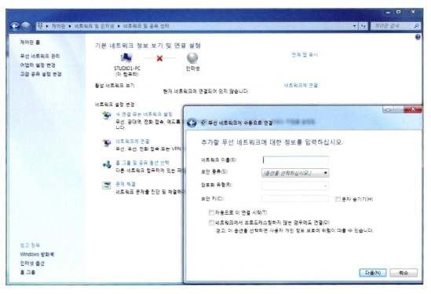

윈도우 메뉴에서 [설정]을 누르고 들어가면 '네트워크 및 인터넷' 항목이 보이고 여기로 들어가면 현재 네트워크의 상태가 보입니다. 여기서 다시 '네트워크 및 공유 센터'로 들어가면 '기본 네트워크 정보보기 및 연결 설정'화면으로 들어갈 수 있습니다.  
이 화면에서 네트워크 설정 변경 메뉴의 아래에 있는 [새 연결 또는 네트워크 설정] 버튼을 누르고 들어가서 '새 네트워크 연결'을 눌렀을 때 보이는 화면이 그림과 같습니다. 설명이 좀 복잡하긴 한데 찾는 건 그리 어렵지 않으실 겁니다.  
또한 최신판 윈도우(윈도우 10)에서는 무선 네트워크 연결을 이렇게 복잡하게 하지 않아도 자동으로 접속 가능한 네트워크를 찾아주기 때문에 매번 이와 같이 메뉴를 찾아 들어갈 필요는 없답니다.

아무튼 일단 들어가게 되면 위 그림과 같은 화면이 보이는데, 여기서 맨 위에 보이는 '네트워크 이름'이 바로 SSID가 되는 겁니다. SSID를 입력하게 되면 그다음으로 보안의 종류를 선택하게 되는데, 무선 랜 보안 방식은 이다음 장에서 좀 더 자세히 설명드리겠지만, 크게 WEP(Wired Equivalent Privacy) 방식과 WPA(Wi-Fi Protected Access) 방식으로 나눌 수 있습니다.  
WEP 방식은 무선 네트워크에 접속하고자 하는 노트북이 AP가 미리 지정해 놓은 Key 값을 가지고 있다가 접속할 때 알려주는 방식입니다. 미리 같은 단어를 알고 있다가 그 단어를 맞추는 애들만 접속하도록 해주는 방식인 거죠.  
WPA 방식은 WEP보다 좀 더 복잡한 암호화 방식인데, 다음 장에서 자세히 알아보도록 하고 여기서는 넘어가도록 하겠습니다.

자, 그럼 SSID에 대해 잠깐 정리해볼까요?

SSID란 무선 네트워크에서 사용하는 이름으로, 32바이트로 구성되며, 동일한 무선 네트워크를 사용하는 모든 무선 장비들은 동일한 SSID를 가져야 한다. SSID는 디폴트로 100ms마다 브로드캐스트되는 모드이지만, Disable해줄 수도 있는데, 이걸 'SSID Cloaking'이라고 한다.  
이렇게 SSID가 Cloaking 되면 무선 네트워크 보기에서는 보이지 않으며, 수동으로 SSID를 직접 입력해줘야만 접속이 가능하다.

여기까지입니다.

> 네트워크 플러스+

### Wi-Fi란 무엇일까요?

와이파이(Wi-Fi)라고 하는 거 들어보셨죠?

무선을 쓰다 보면 아마 아래에 보이는 이런 마크도 보신 기억이 있을 겁니다. 그럼 와이파이가 뭘까요? 한마디로 이야기하자면 무선 장비들의 호환성 검증입니다.

무선 장비들을 만들어내는 회사들이 이런 무선 장비들끼리의 호환성을 검증해서 이 마크를 붙이는 겁니다. 그러니까 이 마크가 붙어있다면 일단 무선의 호환성에는 문제가 없다고 봐야겠죠?  
우리가 오디오에서 많이 듣던 말 중에 Hi-Fi라는 말 있죠? 좋은 오디오에만 붙여준다는 그 하이파이. 사실 Wi-Fi는 이 말에서 나온 거라고 하네요.

Hi-Fi가 음향 품질이 좋은 음향 장비에만 붙여지는 것처럼 Wi-Fi 역시 좋은(?) 무선 장비에만 붙여주는 무선 호환성 검증이 아닐까요?

Wi-Fi는 Wireless Fidelity의 줄임말이라고 하니까 무선에 대한 충성도(?) 내지는 무선에 대한 성실성(?) 정도의 의미를 가진다고 이해하시면 되겠네요.

그럼 이제 Wi-Fi 마크를 보시면 좀 더 반갑겠죠?

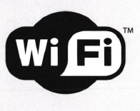

## 무선 네트워크에서의 보안

무선 네트워크를 사용하면서 가장 신경 쓰이는 일이 있다면 그건 바로 보안 문제일 겁니다.

예를 들어볼까요?

해커가 어떤 회사의 네트워크에 침입하려고 한다고 가정하죠. 뭐 요즘은 이런 경우 해커들은 대부분 인터넷을 타고 회사 네트워크에 침입하게 될 겁니다.  
하지만 여기서는 이 회사가 인터넷에 연결되어 있지 않고 내부에서만 통신을 한다고 가정하겠습니다. 그렇다면 해커는 회사 안으로 직접 침입해서 회사에 있는 네트워크 케이블을 본인 PC에 연결하는 방법밖에는 없겠죠?  
영화에서처럼 회사 경비를 뚫고, 몰래 비상계단을 통해서 그것도 여러 가지 비밀번호를 뚫고 사무실내에 침입을 성공해야만 회사 네트워크와 연결시킬 수 있습니다. 중간중간 위험한 고비도 많이 넘겨야겠죠?

하지만 무선의 경우는 어떨까요?

굳이 위험하게 회사 내부까지 침입할 필요 없이 회사 건물 근처에서 무선 랜이 가능한 노트북을 통해 회사 네트워크와 접속이 가능하게 됩니다. 그냥 무선 노트북을 들고 회사 근처에 서 있기가 민망하다면, 차를 타고 회사 건물 근처를 맴돌면서 회사 무선 네트워크에 접속해 해킹하는 것도 가능하답니다. 즉 무선이란 것은 유선 케이블과 달라서 통제가 그리 쉽지 않죠.

따라서 무선을 사용할 때 무엇보다도 중요한 것이 바로 보안이랍니다.

자, 그럼 보안에 대해 본격적으로 이야기하기 전에 먼저 보안에서 가장 자주 듣는 두 단어에 대해서 알아볼까요?

보안을 이야기할 때 가장 많이 나오는 말은 바로 Authentication과 Encryption입니다. 우리나라 말로 하면 Authentication은 '인증'이라고 할 수 있구요. Encryption은 '암호화' 정도라고 할 수 있을 겁니다.

쉽죠? 인증과 암호화

그럼 뭐가 인증이고, 뭐가 암호화인지를 조금 더 알아볼까요?

인증, 즉 Authentication은 우리가 어디를 들어가려고 할 때 안에서 '누구세요?' 하고 물어본 후 들어와도 되는 사람에게만 문을 열어주는 것을 말합니다. 즉 어딘가에 접속하고자 할 때 이 장비에게 접속을 허가할 건지 아닌지를 결정하는 것이라고 생각하면 되겠죠?

암호화, 즉 Encryption은 일단 접속이 된 후 서로 간에 데이터를 주고받는 과정에서 누가 훔쳐보는 걸 방지하기 위해 데이터 자체를 암호화하는 것을 의미합니다. 즉 보내는 쪽에서 암호화를 하고, 받는 쪽에서는 같은 암호화 기법을 이용해서 암호를 풀고 읽어보는 거죠.  
이렇게 되면 중간에서 누군가 데이터를 훔쳐가도 암호화가 되어 있어 무슨 내용인지 알 수 없겠죠?

이렇게 두 가지 보안 기법, 즉 Authentication과 Encryption을 먼저 이해하고 다음 단계로 넘어가겠습니다.

맨 처음 무선 네트워크에 사용된 보안 표준은 WEP(Wired Equivalent Privacy)라는 겁니다. 제일 먼저 나온 보안 기법인 만큼 꽤나 단순하고 쉽죠.  
일단 무선 네트워크에 접속하려고 하는 노트북 같은 클라이언트 장비와 엑세스 포인트가 같은 Key 값을 나눠 가지고 있다가 접속이 시도되면 이 Key 값이 같을 경우에만 접속을 허락하는 방식입니다.  
여기서 Key 값은 40bit이고, Static, 즉 고정된 값이기 때문에 관리자가 일정 기간이 지난 후 모든 무선 네트워크에 있는 AP와 클라이언트의 Key 값을 한 번씩 바꿔주지 않는다면 몇 년이고 계속 같은 Key 값을 사용할 수밖에 없고, 그러다 보니 보안에 취약하게 되는 겁니다. 게다가 40비트의 Key 값은 너무 간단해서 해킹 툴로 몇 번만 돌려보면 찾아내기도 쉽다고 합니다.

앞에서 설명드린 것처럼 무선 네트워킹의 경우는 유선과는 달리 전파가 건물 밖으로도 새어나갈 가능성이 있기 때문에 건물 밖에서 무선 랜은 장착한 노트북 한 대만 있으면 내부 네트워크에 접속이 가능할 수 있습니다. 게다가 위에서 설명드린 WEP 키 방식을 사용할 경우에는 해커가 건물 밖에서 네트워크 트래픽을 캡처한 후 그 중에서 WEP 키를 찾아내서 들어올 수도 있기 때문에 보안에 약할 수밖에 없었답니다.

따라서 WEP 키 방식보다 좀 더 보안에 강한 방법이 필요했는데, 시스코는 이 문제를 802.1X 사용자 인증 방식을 통해 해결하고자 했습니다. 802.1X 사용자 인증 방식이라고 하는 건 쉽게 말하자면 Usernamer과 Passwordfmㄹ 이용한 방식입니다. 즉 무선 네트워크에 접속하려고 하면 사용자 이름과 암호를 입력하고 이게 맞아야 접속을 허락해주는 방식이 되는 겁니다.

예를 들어 기존의 장비에만 키값을 넣어 인증하는 방식의 경우에는 장비를 누가 가져가서 네트워크에 접속하려 한다면 막을 방법이 없다는 단점이 있었습니다. 하지만 이렇게 Username과 Password를 사용하는 사용자 인증 방식은 해커가 장비에 있는 키값을 알아내거나, 혹은 장비를 몰래 들고 나가서 접속을 하려고 해도 Username과 Password를 알지 못하면 접속이 불가하기 때문에 훨씬 안전하다고 할 수 있습니다.

이런 새로운 보안 기법이 추가되어 만들어진 방식이 바로 Wi-Fi 협회에서 만들어낸 WPA(Wi-Fi Protected Access)입니다. WPA는 WEP 방식이 가지고 있던 많은 보안 약점을 해결한 새로운 무선 랜 보안 방식입니다.  
WPA 방식의 보안은 앞에서 설명드린 802.1X 사용자 보안을 도입했을 뿐 아니라, 기존의 Static 키만 사용하던 방식에 Dynamic 키 방식을 추가하여 무선 네트워크에 접속할 때 키 값이 자동으로 바뀌는 방식을 사용할 수도 있게 되었습니다.  
뿐만 아니라 Encryption, 즉 암호화 기법도 기존의 방식보다 한층 강화된 방식의 암호화 기법인 TKIP(Temporal Key Integrity Protocol)를 사용합니다. 이 방식은 기존에 사용하던 WEP 키 방식에 좀 더 보안 요소를 강화시키는 키 생성 방법을 추가해서 만들어졌기 때문에 보안 강화뿐 아니라, 기존 WEP을 지원하던 녀석들이 하드웨어 변경 없이도 손쉽게 업그레이드가 가능하다는 장점도 가지게 되었습니다.  
사실 WPA는 Wi-Fi 협회에서 만든 보안 방식이라 표준이라고 볼 수는 없지만, 뒤에 발표된 표준 무선 보안 에서 역시 WPA의 많은 부분을 포함하고 있다는 것도 알아두시면 좋겠네요.

마지막으로 소개드릴 무선 랜 보안 방식이 바로 2004년 발표된 802.11i입니다. 일단 표준이구요. 앞에서 설명드린 WPA 방식을 대부분 수용하고 있지만 Encryption, 즉 암호화 부분에 사용되는 알고리즘은 WPA의 TKIP가 아니라 AES(Advanced Encryption Standard Encryption)방식을 사용하게 됩니다.  
AES라는 방식은 훨씬 더 복잡하고 강력한 암호화 기법인데요, 이러다 보니 AES를 위해서는 ASE 방식에서 암호화를 위한 전용 프로세서까지 있어야 한다고 하네요.  
암튼 표준으로 발표된 802.11i를 지원하기 위해서 Wi-Fi에서도 WPA2(Wi-Fi Protected Access)를 발표하게 되는데, 이미 눈치채셨겠지만 WPA2에서는 기존의 WP에서 지원하지 않았던 AES 암호화 기법을 지원하게 되었답니다.

조금 복잡한 무선 네트워크에서의 보안에 대한 이야기를 잠깐 정리해 볼까요?

사실 맨 처음 무선 네트워크가 나왔을 때만 해도 보안에 대한 걱정은 거의 하지 않았답니다. 그래서 그때 겨우 할 수 있었던 보안이 SSID를 감추는 방법 정도였을 겁니다. 앞에서 설명드렸죠?  
그런데 시간이 흘러 무선 보안에 대한 요구가 나타나자 처음으로 만들어낸 보안 기법이 WEP(Wired Equivalent Privacy)였죠? 고정된 키값을 AP와 클라이언트에서 사용하도록한 이 방식은 40비트의 짧은 키값과 한 번 쓰면 자주 바꿀 수 없는 고정키라는 문제가 있었다고 말씀드렸죠?  
그래서 시스코에서는 802.1X를 이용한 사용자 인증 방식의 보안을 도입했고, 바로 이런 시스코의 사용자 인증 방식을 포함하는 Wi-Fi에서 만들어낸 WPA(WiFi Protected Access)가 나왔습니다.  
WPA는 사용자 인증 방식의 채택과 TKIP라는 기존의 WEP 암호화를 보완한 암호화 기법을 사용했지만 표준은 아니였다고 말씀드렸죠? 그러고 나서 무선 랜 보안 표준인 802.11i가 발표됩니다. 802.11i의 가장 큰 특징은 암호화 기법이 TKIP보다 강화된 새로운 방식인 AES(Advanced Encryption Standard Encryption)이라는 겁니다.  
또한 WAP2는 이런 802.11i 표준을 지원하려고 WPA에 AES 암호화 기법을 추가한 방식이라고 설명드렸습니다.

정리가 되세요?

아래는 지금까지 이야기를 표로 정리해본 거랍니다.

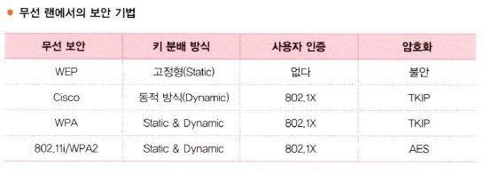

표로 보니까 좀 더 쉽죠?

## AP를 직접 만져보자

처음엔 낯설게만 느껴졌던 무선에 대해서 어느 정도 친숙해지셨나요? 자, 그럼 이번에는 직접 Access Point를 만져보는 시간을 가져보려고 합니다.

백 번 이야기하는 것보다 역시 한 번이라도 직접 만져보는 게 낫겠죠?

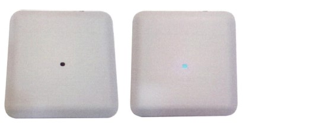

우리가 이번 시간에 만져볼 녀석은 바로 위 사진에서 보이는 이 녀석입니다. 모델명은 AP3802I라는 모델인데요. 맨 뒤에 I는 1(일)이 아니고 영문 I입니다. 여기서 I는 Internal을 의미하는데요. 즉 안테나가 내부에 들어있다는 의미입니다. 그럼 모델명에서 E가 붙은 AP는 안테나가 밖으로 나와 있는 방식을 의미한다는 건 아시겠죠? 중요한 건 아니지만 상식으로 알아두시기 바랍니다.

3800 시리즈 AP는 현재 시스코에서 나오는 실내형 AP 중에 상위 기종에 속한답니다. 1800, 2800, 3800 시리즈 순으로 나오는데 아무래도 상위 기종이다 보니 성능도 좋고, 가격 역시 비싸겠죠?

최신 기종답게 3800AP는 IEEE 802.11 AC Wave2 표준을 지원하고 있답니다. 속도는 최고 약 2.3Gbps까지 나오는 기종으로, 802.11AC뿐 아니라 이전 표준인 802.11b, 802.11g, 802.11a와 802.11n까지를 모두 지원한답니다.  
이렇게 하려면 주파수 대역 역시 2.4GHz와 5GHz를 모두 지원해야겠죠?

모양은 사진에서 보이는 것처럼 작고 단순합니다. 벽이나 천장에 붙이며, 깨끗하고 깔끔하게 보이도록 전체적으로 하얀색을 띠고 있고, 사진에서는 잘 안보이겠지만 중간쯤에 음각으로 Cisco 마크가 찍혀 있답니다. 가운데 있는 작은 LED는 AP의 상태를 쉽게 알 수 있도록 놓은 상태 LED인데, 이 LED가 사진처럼 푸른색일 때 현재 이 AP는 정상적으로 동작하고 있고, 적어도 하나 이상의 무선 장비가 이 AP에 접속되어 있다는 걸 의미합니다.

만약 AP가 정상적으로 작동하고는 있지만 이 AP에 접속된 무선 장비가 하나도 없다면, 이 불빛은 연한 초록색으로 바뀌게 됩니다. 또 소프트웨어를 업그레이드 중일 때는 파란색 불빛이 깜빡이게 되구요.  
장비에 문제가 발생한 경우에는 초록색 불빛이 깜빡이게 된답니다. 어때요? 재미있죠? 별거 아닌 것 같은 AP의 불빛 하나도 그 의미를 알고 보면 꽤나 재미있을 뿐 아니라 현재 장비의 상태도 알려주니 꽤나 유용하겠죠?

자, 그러면 AP의 뚜껑을 열어볼까요?

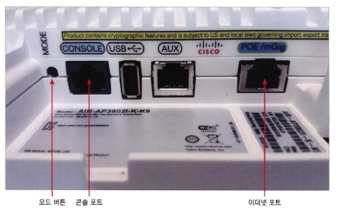

뚜껑을 연 모습이 보이죠? 사실 열어보면 별 특이한 것도 없답니다. 맨 왼쪽에 전원 포트가 보입니다. 무선 AP 역시 전기가 있어야 돌아가겠죠? 그러다 보니 전원 포트가 있는 건데 문제는 대부분의 무선 AP를 주로 천장이나 벽에 설치하다 보니 전원을 연결하기가 만만치 않다는 겁니다. 한두 대도 아니고 수십, 수백 대의 AP를 위해 천장마다 전원공사를 하는 건 사실 만만한 일은 아니겠죠? 그래서 나온 기술이 바로 PoE라는 기술입니다.

> 네트워크 플러스+

### PoE를 들어보셨어요?

어떤 분은 PoE를 파워 오브 이더넷(Power of Ethernet)이라고 잘못 알고 계시는데, 파워 오브 이더넷이라고 하면, 이더넷의 힘? 이거 아닙니다.

PoE는 파워 오버 이더넷(Power over Ethernet)의 약자로, 말 그대로 이더넷 위에 파워, 즉 전원을 같이 실어서 보내는 방식을 말합니다. 무선 AP의 경우 설치하는 장소가 천장이나 벽과 같이 전원공사를 해주기가 어려운 곳이 많기 때문에, 이때 이더넷 케이블을 통해 데이터 전송과 함께 전원을 공급해주게 되면 따로 전원공사를 하지 않아도 된다는 장점이 있습니다.

이렇게 데이터 전송을 위한 이더넷 케이블에 데이터뿐만 아니라 전원을 같이 실어서 보내기 위해서는 스위치가 PoE 기능을 지원해야 하는데, 이런 스위치를 'PoE 스위치'라고 합니다.

PoE 스위치의 포트에서 이더넷 케이블을 연결해주게 되면, 이 케이블을 통해서는 데이터뿐만 아니라 -48V의 DC 전원도 같이 공급을 해주게 되는 겁니다. 그렇다면 이더넷 포트를 통해 전원을 공급받을 수 있기 때문에 따로 전원 포트를 연결해줄 필요가 없겠죠?

그런데 만약 PoE 스위치에서 케이블을 뽑아 그걸 PC에 연결하면 어떻게 될까요? PC의 랜 카드에 -48V DC 전원을 흘려 보내게 된다면 랜 카드는 물론이고 PC의 메인보드까지 손상될 수도 있겠죠? 그렇다면 PoE 스위치는 절대 PC와는 연결하면 안 된다는 걸까요?

하지만 이런 걱정은 하지 않으셔도 된답니다. PoE 스위치는 포트를 장비와 연결해주게 되면 자기와 연결된 장비가 전원을 필요로 하는 녀석인지, 데이터만 필요로 하는 녀석인지를 바로 알아차리고, 무선 AP와 같이 데이터와 전원을 같이 필요로 하는 녀석들에게는 데이터와 전원을 공급해주고, PC와 같이 데이터만 필요로 하는 녀석에게는 전원은 공급하지 않고 일반 스위치처럼 데이터만 공급해주게 된답니다.

PoE는 이처럼 무선 AP뿐만 아니라 IP 전화기, IP 카메라 등에서도 많이 사용된답니다. 나중에 시스코의 IP 전화기를 볼 기회가 있으면 뒤에 케이블을 자세히 봐 주세요. 아마 네트워크 케이블 하나만 달랑 연결되어 있을 겁니다.  
즉 전원 케이블이 안 보이는 거죠. 그건 바로 그 네트워크 케이블을 통해 전원이 같이 전달되고 있다는 의미입니다. 알고 보면 더 재미있답니다.

지금까지 설명드린 PoE 기술은 원래 시스코에서 독자적으로 개발할 당시에 'Inline Power'라고 불렸습니다. 'Inline Power', 라인 안에 전원이 있다는 의미죠? 즉 이더넷 케이블에 전원을 같이 실어 보낸다는 의미입니다. 그리고 얼마 후 이 기술은 표준으로 정의되었고, 표준 PoE 기술을 IEEE 802.3af라고 합니다.  
여러분들도 앞으로 IEEE 802.3af라는 말을 자주 듣게 되실겁니다. 그때 당황하지 마시고 IEEE 802.3af란 이더넷 케이블에 데이터뿐만 아니라 전원을 같이 실어 보내기 위해 만들어진 Power over Ethernet 표준이라고만 알고 계시면 된답니다.

그런데 최근에 나오는 AP의 경우에는 하는 일이 많다 보니 전기도 많이 먹어서, 전에 사용하던 AP가 대부분 15.4W 정도 이하의 전원이면 충분했다면, 새로운 AP들은 최소 30W 이상, 어떤 녀석은 60W까지도 필요하게 되었답니다.  
그래서 앞에서 배운 PoE(Power over Ethernet) 표준 역시 기존에는 대부분이 IEEE 802.1af(15.4W)였다면, 최근에는 30W를 공급하는 PoE+('PoE 플러스'라고 읽습니다.) 또는 60W를 공급하는 UPoE를 사용하는 추세랍니다.

따라서 기가 속도가 나오는 무선 AP로 교체를 하기 위해서는 단순히 AP만 새로 사면 되는 게 아니고, AP와 연결하는 PoE 스위치 역시 PoE+나 UPoE를 지원하는 스팩으로 교체해줘야 한다는 사실도 기억하셔야 합니다.

앞 페이지의 AP 내부 화면을 보시면, POE/mGIG이라는 포트가 보입니다. 이 포트는 이더넷 케이블을 연결하는 포트로, 앞에서 배운 PoE를 연결하는 케이블이라는 걸 알 수 있겠죠? 따라서 설명드린 대로 이 포트를 통해 데이터뿐만 아니라 전원도 공급이 가능하게 됩니다.  
옆에 mGIG이라는 건 시스코가 지원하는 Multi=Gigabit 포트인데, AP가 1기가의 속도를 넘어가기 때문에 케이블 역시 1G가 넘는 속도를 지원해주기 위해 만든 표준으로, 최대 5기가까지의 속도를 제공해줄 수 있다고만 일단 알아두시기 바랍니다.

아래 그림의 포트는 콘솔 포트입니다. 콘솔 포트는 우리가 라우터에서 배운 콘솔 포트와 같은 기능입니다. 즉 Access Point를 구성해주기 위해 사용하는 포트죠. 콘솔 포트에 연결해 AP를 구성해주기 위해선 앞에서 배운 터미널 애뮬레이션 프로그램이 필요한데요, 이때의 구성은 아래와 같이 해주면 됩니다.

터미널 에플레이션 프로그램 구성은 이미 라우터에서 해보셨을 테니 따로 설명드리지 않겠습니다.

콘솔 포트의 왼쪽에 보이는 조그만 버튼이 모드 버튼입니다. 아주 유용하게 쓰이는 버튼이죠. 쉽게 말하자면 PC에 있는 리셋 키 같은 건데, 리셋 키는 PC가 죽었을 때 껏다 켜는 용도로만 사용되지만, 여기 있는 모드 버튼은 다음 2가지 경우에 사용됩니다.

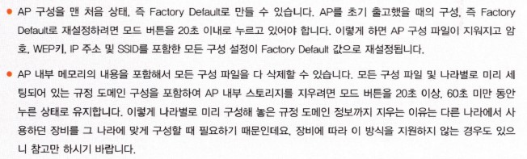

옆에 보이는 USB 포트는 향후 확장 모듈을 연결하기 위한 포트라고 생각하시면 됩니다. 지금은 딱히 신경 안 쓰셔도 됩니다. 자, 이 정도면 다음에 AP를 직접 보셔도 대충은 낯설지는 않겠죠? 그렇다면 이번 시간에 제대로 배우신 겁니다.

## AP를 직접 구성해볼까요?

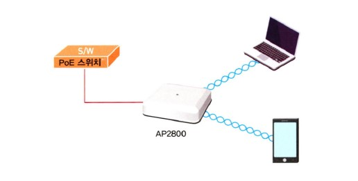

우리가 이번에 구성해줄 AP는 AP2800입니다. 앞에서 배웠던 AP3800보다 한 단계 낮은 레벨의 AP이지만 802.11AC를 지원하는 AP랍니다. 우리는 이번에 Mobility Express라는 방법을 이용해서 AP를 구성해주려고 합니다.  
ME라고도 부르는 Mobility Express는 AP를 쉽고 간단하게 구성할 수 있게 해주는 솔루션으로, 우리들과 같은 무선 초보들에게 딱 맞는 솔루션이랍니다.

AP에 구성해줄 내용은 아래와 같습니다.

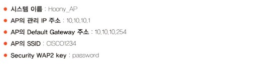

간단하죠? 자, 그럼 구성을 시작해볼까요?

위 그림을 보시기 바랍니다.

먼저 AP는 PoE 스위치에 연결해줘야 합니다. PoE 스위치는 앞에서 배운거 기억나시죠? 데이터와 함께 전원까지도 공급해주는 스위치라고 설명드렸습니다.

PoE 스위치에 AP를 연결해주면 스위치의 LED에 불이 깜빡이기 시작합니다. 부팅을 시작하는거겠죠? 몇 분을 기다리면 스위치의 LED가 녹색 불로 바뀐 걸 볼 수 있을 겁니다.

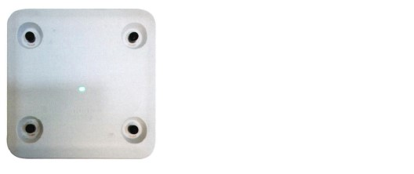

위 그림을 보시면 부팅이 끝나 녹색 불이 들어와 있는 AP2800을 볼 수 있습니다.

참고로 사진에서 보는 AP는 안테나가 외부에 연결되는 AP2800e 타입입니다. 각 모서리에 하나씩 4개의 안테나가 보이시죠? AP 뒤에 i가 붙는 안테나 내장형과 e가 붙는 안테나 외장형이 있다고 말씀드렸던 거 기억나시죠?

AP의 부팅이 끝나면 노트북이나 무선으로 연결된 스마트폰에서 'CiscoAirProvision'이라는 네트워크가 검색되는데, 아래 그림에서처럼 보실 수 있습니다.

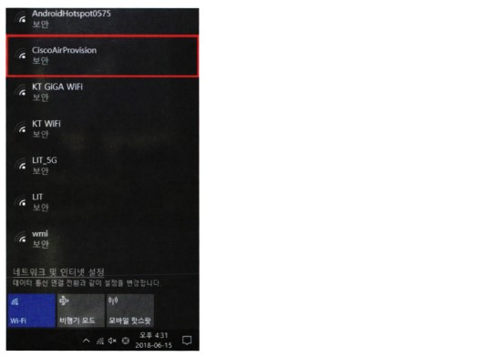

이제 'CiscoAirProvision' 네트워크에 연결하면 됩니다. 여기서 초기 디폴트 패스워드는 'password'입니다.  
연결이 되었으면 Web 브라우저를 하나 열고 http://mobilityexpress.cisco/를 입력하면 아래 그림과 같은 Mobility Express 첫 화면이 보이게 됩니다.

첫 페이지에서 관리자 계정을 하나 만들게 되는데, User Name과 Password를 구성해주는 겁니다. 나중에 구성을 위해서 들어갈 때 필요하니 만들어 두실 때 꼭 기억해두셔야겠죠?

여기서 저는 관리자 User Name은 'Hoony'로, 패스워드는 'Cisco123'으로 세팅했습니다. 너무 일반적인가요?

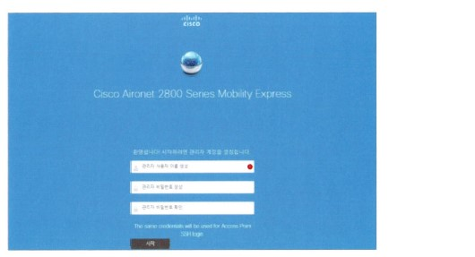

User ID와 Password를 구성하고 들어가면 드디어 AP의 구성 첫 화면이 보이는데 여기서 시스템의 이름, AP의 IP 주소 구성을 해주게 됩니다. 아래 그림을 보시기 바랍니다.

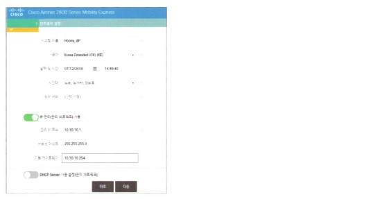

첫 번째 화면에서 시스템 이름, 국가, 날짜 및 시간, 그리고 Time Server를 먼저 세팅해주게 되는데, 시스템 이름은 'Hoony_AP'로 했고, 국가는 '대한민국'을 선택했습니다.

시스템에 대한 기본적인 구성이 끝나면, 그 다음이 AP에 대한 관리 주소 세팅입니다. AP의 관리 주소를 세팅하게 되면 나중에 AP의 주소만을 Web 브라우저에 입력하고도 구성 변경 화면으로 들어올 수 있기 때문에 훨씬 편리하답니다.

우리는 앞에서 세팅하기로 했던 주소 10.10.10.1을 AP의 관리 IP 주소로 입력하고, 서브넷 마스크는 255.255.255.0으로, 기본 게이트웨이(Default Gateway)는 10.10.10.254로 세팅하겠습니다.

아래 DHCP 서버를 사용하는 것으로 체크하게 되면 AP가 DHCP 서버의 역할을 해서 AP에 접속하는 무선 장비들에게 IP 주소를 자동으로 배분해줄 수도 있습니다.

첫 번째 페이지에서 구성이 완료되면 이제 두 번째 페이지로 넘어가보겠습니다. 아래 그림을 보시기 바랍니다.

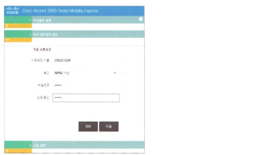

두 번째 구성 페이지에서 네트워크 이름은 바로 SSID입니다.

시작할 때 SSID를 CISCO1234로 세팅하기로 했으니, 네트워크 이름 박스에 CISCO1234로 SSID를 입력합니다. 보안은 디폴트 방식은 WAP을 선택하고 비밀번호(Password)를 세팅합니다.  
이 SSID로 접속하기 위해 입력하는 암호입니다. 간단하죠? 이제 거의 모든 구성이 완료되었습니다.

자, 그럼 다음으로 넘어가볼까요?

아래 그림은 세 번째 구성 페이지입니다.

이미 앞에서 기본적인 구성을 마쳤기 때문에 마지막 세 번째 페이지에서는 부가 기능에 대한 몇가지 구성만 해주면 됩니다.

먼저 지금 구성하는 AP가 얼마나 많은 무선 장비와 연결되게 할 거냐에 따라 클라이언트 밀도를 선태갛ㄹ 수 있습니다. 이렇게 클라이언트 밀도를 낮음, 일반, 높음으로 선택하는 이유는 클라이언트의 밀도에 따라 가장 최적의 RF, Radio Frequency를 만들어주기 위해서입니다.

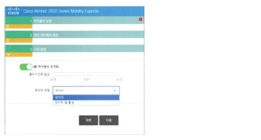

다음은 지금 구성하는 AP가 주로 어떤 트래픽을 담당해줄 거냐 하는 것에 대해 선택을 하게 됩니다. 위 그림에서 보이는 것처럼 트래픽 유형은 데이터 또는 데이터 및 음성으로 선택해 줄 수 있습니다. 이렇게 AP가 전달하는 트래픽의 유형을 데이터와 음성으로 구분하는 이유는 데이터의 전송과 음성의 전송이 근본적인 차이가 있기 때문입니다.  
데이터의 경우는 중간에 끊김 현상이 나타나더라도 전체적인 속도가 중요하지만, 음성의 경우는 조금 느리더라도 중간에 끊김이 있으면 안 되기 때문에 트래픽을 다르게 운용하기 위한 것입니다. 즉 Quality of Service를 위한 구성을 AP가 자동으로 해주기 위해서 트래픽 유형을 선택하는 것입니다.

이렇게 AP의 사용 환경까지 선택해주게 되면 Mobility Express를 통한 AP의 구성은 모두 완료되었습니다. 어때요? 간단하죠?

아래 그림을 보시면 지금까지 구성했던 내용을 마지막으로 확인해볼 수 있습니다. 맨 처음 로그인 화면에서 세팅했던 사용자 이름부터 시스템 이름, 국가, 시간대, AP의 관리 IP Address, 기본 게이트웨이 주소가 보이고, SSID인 네트워크 이름도 구성이 되어 있는 걸 보실 수 있습니다. 맨 아래는 AP의 사용 환경까지 선택한 내용이 보이시죠?

구성이 완료된 상태에서 아래의 [적용] 버튼을 누르면 AP는 구성을 저장하고, 리부팅을 시작하게 됩니다. 리부팅이 완료되면 이제 무선 네트워크 이름에 우리가 세팅했던 SSID인 CISCO1234라는 네트워크가 보이게 되는 겁니다.

지금까지 Mobility Express를 사용해서 시스코 AP2800을 구성하는 방법을 알아봤는데요. 어떠셨습니까? 그동안 배웠던 다른 장비들보다 오히려 쉽죠?

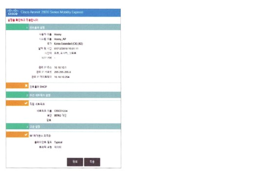

물론 무선 네트워크에 대해서 완전하게 이해하고, 또 AP의 세부적인 구성까지 이해하기 위해서는 훨씬 더 많은 내용을 공부해야 합니다. 하지만 무선 초보자도 지금 배운 Mobility Express를 이용하면 AP에 대한 기본적인 구성은 해줄 수 있으니까 너무 긴장하지 않으셔도 된답니다.

앞에서 보신 것처럼 AP의 사용 환경에 따른 RF의 구성이나 데이터 종류에 따른 QoS까지 해준거니까 이 정도면 완벽한 AP 전문가가 된 거겠죠?

그럼 무선 랜 구성은 여기까지입니다.

## 정말 색다른 네트워크 장비(?)

매일 해야 하는 청소가 귀찮아 청소기가 만들어졌고, 그 청소기를 끌고 다니면서 직접 청소하는게 귀찮아 로봇 청소기가 만들어진 것처럼 어쩌면 세상의 모든 물건들은 다들 필요에서부터 나온 게 맞을 겁니다.

네트워크가 점점 크고 복잡해지면서 네트워크 장비들을 하나하나 관리하고 운영해주는 것 역시 보통 일이 아니게 되었습니다. 그래서 나온 게 앞에서 배운 네트워크 관리 시스템(NMS, Network Management System) 같은 거지만, 이 역시 내가 직접 설치해야 되고 운영하는 거라서 NMS를 배워야 하는 또 다른 어려움이 생기게 되는 겁니다.

그냥 장비만 연결하면 관리는 알아서 해주게 하면 안 될까?

이런 필요에서 출발한 장비가 있습니다.  
바로 클라우드 관리 방식의 네트워크 장비입니다.

'클라우드'라고 다들 들어보셨죠?  
우리말로 번역하면 '구름'이지만, 여기서 클라우드 관리 방식이라고 하는 건 쉽게 장비만 연결해주면 어디서나 웹사이트에 로그인해서 관리해줄 수 있다는 의미입니다.

전에도 비슷한 게 있었다구요?

웹 브라우저를 띄우고 라우터나 스위치의 IP 주소 또는 NMS 주소 같은 걸 넣어준 후 웹사이트로 로그인하는 방식이 있었습니다. 하지만 클라우드 관리 방식과는 다른 게 이전 방식의 경우 로그인을 위해서 내가 해줘야 하는 구성이 필요했고, 또 실제 로그인하는 곳 역시 내가 미리 만들어 놓은 서버나 내가 미리 구성해 놓은 네트워크 장비였습니다.

하지만 클라우드 관리 방식은 말 그대로 장비에 미리 구성이 필요 없고, 일단 장비만 연결한 후(물론 장비가 인터넷과는 연결이 되어야 하겠죠?) 웹사이트로 들어가기만 하면, 방금 연결한 장비를 포함해서 내가 관리하는 모든 장비가 한눈에 보이고, 모든 장비 구성을 웹사이트에서 관리해줄 수 있게 되는 겁니다.

전에는 네트워크 장비를 설치한다고 하면 저희 같은 엔지니어들이 장비 하나하나를 콘솔 케이블로 연결해서 구성해주고, 네트워크에 연결하고, 이상이 없는지 직접 콘솔케이블로 들어가 체크하고, NMS 같은 관리 시스템을 서버에 설치하고, NMS에 들어가서 네트워크 장비를 잡아주고 나서 추가 구성이나 관리를 했습니다.  
하지만 클라우드 관리 방식은 장비를 박스에서 꺼내서 아무 구성없이 인터넷이 되는 케이블만 연결해주고, 웹사이트로 로그인해서 필요한 장비 구성을 하는 방식이기 때문에, 훨씬 쉽고 간편할 뿐 아니라 내가 직접 설치 장소까지 안 가도 설치가 가능하다는 장점이 있습니다.

따라서 장비가 전국 여기저기에 흩어져 설치되고, 설치와 관리를 한 사람이 해야 되는 입장이라면 지금 설명드린 클라우드 관리 방식은 시간과 노력을 최대한 절약할 수 있게 해주는 방식이랍니다.

여기서 설명드릴 Meraki('메라키'또는 '머라키'라고 읽으시면 됩니다.) 제품이 대표적인 클라우드 관리 방식의 네트워크 장비인데요. 일단 이번 시간에는 클라우드 관리 방식의 네트워크 장비란 어떤 장점이 있는지만 이해하시면 충분히 의미 있는 시간이라고 생각합니다.

클라우드 관리 방식이란, '네트워크 장비는 그저 박스를 까서 인터넷과 연결만 시켜주고, 나머지 모든 일은 클라우드, 즉 인터넷 웹사이트에 들어가서 관리해주는 방식의 장비다'라고 이해해주시면 되겠습니다.

> 네트워크 플러스+

### 세상에서 가장 쉬운 IT

앞에서 설명드린 클라우드 관리 방식의 네트워크 장비를 만드는 머라키는 '세상에서 가장 쉬운 IT'라는 솔루션을 내걸고 장비를 만들고 있다고 합니다. (현재 머라키는 몇 년 전 시스코가 인수해서 이제는 '시스코 머라키'라고 부르기도 한답니다.)

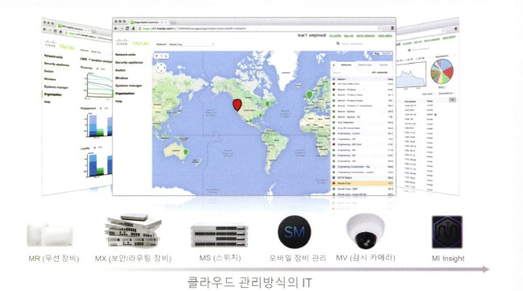
