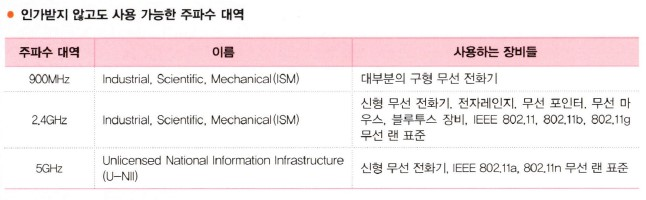
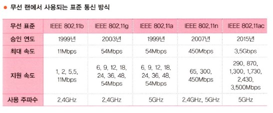
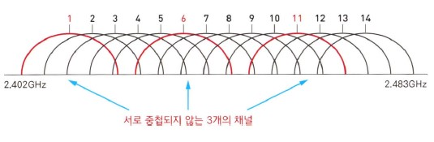
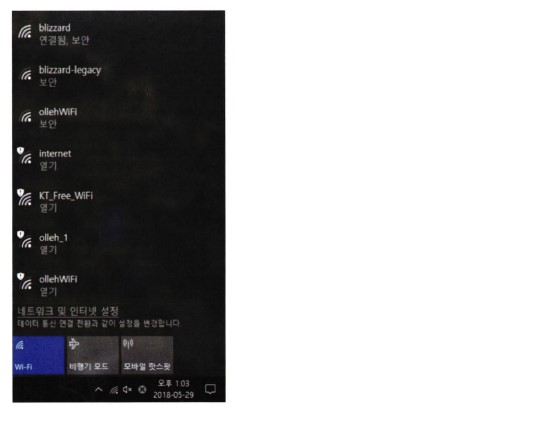
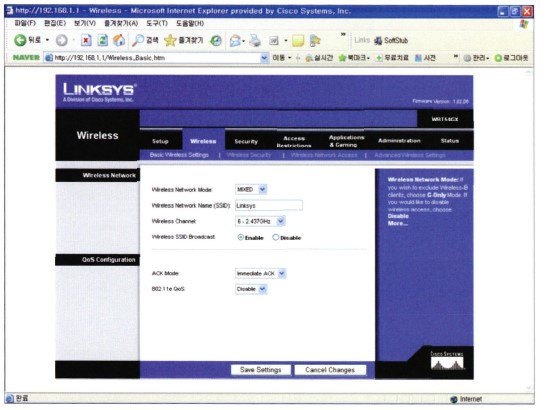

# 무선으로의 여행

## 목차

- 무선으로의 여행
- 무선 랜에서의 2가지 중요한 모드
- 무선 랜의 통신 표준
- 무선 통신에서의 3가지 인코딩 방식
- 무선 네트워크에도 이름이 있답니다 - SSID
- 무선 네트워크에서의 보안
- AP를 직접 만져보자
- AP를 직접 구성해볼까요?
- 정말 색다른 네트워크 장비(?)

## 무선으로의 여행

세상이 점점 편리함을 추구하고, 어느 곳에 있더라도 내가 원하는 정보를 주고받는 통신만은 포기할 수 없는 요즘 시대에 인터넷은 정해진 장소, 정해진 컴퓨터에서만 가능하다라고 말한다면 그 말을 받아들일 사람은 아마 몇 안 될 겁니다.

'컴퓨터'라고 하면 떠오르던 옹장한 데스크톱이 이제는 작고 앙증맞기까지 한 노트북으로 바뀌어가는 추세이고, 이 책의 앞쪽에서 침 튀기며 설명한 랜 카드도 이제는 기억이 가물가물해지고 있는 건 어쩌면 당연한 결과인지도 모르겠습니다.

그러다 보니 이제 네트워크에서도 선을 깔아서 연결하던 유선 방식 이외에 무선이라는 방식이 점점 일반화되어가고 있습니다.

이제 커피숍에서도 노트북을 꺼내 들고 무언가 중요한 일을 하면서 메일을 주고받고 있고, 공항, 호텔, 심지어 차 안이나 비행기 안에서도 무선으로 인터넷을 접속하는 건 이제 일상의 모습이 되어버렸습니다.

요즘은 뭐 집에서도 노트북 한두 대 쯤은 거의 있을 정도니 가정에서의 무선 통신 역시 일반적인 추세가 됐죠?

암튼 이제 우리는 유선 네트워킹 말고도 알아야 할 게 또 늘어났습니다. 그게 바로 무선 네트워킹이죠.

위 그림에서 지금까지 우리가 봤던 일반적인 네트워킹에 대한 그림이 왼쪽 박스에 나와 있습니다. 그런데 오른쪽엔 약간(?)은 낯선 그림이 보입니다.

오른쪽 박스의 아래쪽에 보이는 뿔이 2개 난 장비가 무선 네트워킹의 핵심이자 꽃이라고 할 수 있는 AP(Access Point)입니다.

AP(Access Point)가 뭐냐구요?

한마디로 말씀드리자면 한쪽 발은 유선에, 그리고 나머지 한쪽 발은 무선에 양다리를 걸치고 무선과 유선을 서로 연결해주는 역할을 하는 녀석입니다. 그림에서도 보이시죠?  
한쪽은 유선 네트워크에 붙어있고(스위치에 붙어있죠?) 나머지 한쪽은 무선 랜 카드가 장착된 노트북과 통신을 하고 있습니다. (여기서 스프링처럼 보이는 건 그림에서 무선 주파수를 그릴 수 없어서 AP와 통신하는 모양을 그려넣은 겁니다.)

이와 같은 AP가 있어야 무선 통신이 가능하기 때문에, 만약 여러분이 지금 어딘가에서 무선으로 통신을 하고 계신다면 분명 여러분의 주위에는 그림에서와 같이 생긴 AP라는 녀석이 있을겁니다. 주위를 한번 잘 둘러보세요.

AP는 종류도 무지 많답니다. 참고로 시스코에서 나오는 AP들의 그림이 아래에 나와 있습니다. 이렇게 AP의 종류가 여러 가지인 이유는 사용하는 장소와 주파수의 세기, 통신 방식 등 다양한 환경에 맞도록 디자인되어 있기 때문이랍니다.

위 그림에서 맨 윗줄에 있는 AP가 기업에서 가장 많이 사용되는 일반적인 AP랍니다. AP는 그림에서처럼 안테나가 밖으로 나와 있는 모델과 안테나가 안에 탑재된 모델로 구분된답니다.  
가운뎃줄에 있는 장비는 조금 작은 규모의 사무실에서 사용하는 좀 더 저렴한 모델이고, 맨 아랫줄에 보이는 튼튼하게 생긴 AP는 외부에서 사용하는 AP입니다. 보기에도 눈이나 비에 강하게 생겼죠?

여기서 잠깐! 우리가 그동안 배웠던 이더넷의 통신 방식에 대해서 생각해보면 이더넷에서는 IEEE 802.3 표준을 이용해서 통신을 한다는 거 다 알고 계시죠? 즉 유선 네트워크에서는 IEEE 802.3으로 통신을 하고 있다는 겁니다.  
반면 무선쪽의 통신은 IEEE 802.11 표준으로 통신을 하고 있습니다.

그럼 AP란 녀석은 IEEE 802.3 통신과 IEEE 802.11 통신을 둘 다 이해하고 있어야겠군요? 맞습니다! 하지만 다행스럽게도 이 2가지 통신 방식은 상당히 유사하기 때문에 특별히 변경되는 부분은 거의 없답니다.  
다만 IEEE 802.3 방식에서의 전송매체가 케이블인 반면, IEEE 802.11의 경우는 전파(영어로는 Radio Wave라고 합니다.)이기 때문에 약간의 차이가 있답니다.

> 알고 갑시다!

<b>무선 랜에서의 통신 방식 CSMA/CA란?</b>

무선 랜에서의 통신 방식인 IEEE 802.11, 즉 CSMA/CA는 Carrier Sense Multiple Access/Collision Avoidance의 줄인 말이다. 즉 이더넷의 CSMA/CD와 같이 전송 전에 미리 Carrier를 Sense해서 현재 통신이 일어나고 있는지를 확인하고, 통신이 없으면 아무나 보낼 수 있다는 것이다.  
이더넷 방식과 비슷하다. 하지만 뒤쪽을 보면 이더넷의 경우는 CD(Collision Detection)로 부딪힐 경우 다시 보낸다는 배짱 방식인데 반해서 무선은 CA(Collision Avoidance)로 좀 더 충돌을 피하기 위한 대비책을 많이 가지고 있다.

다음 그림을 보시기 바랍니다.

## 무선 랜에서의 2가지 중요한 모드

무선 랜을 구성할 때 알아두어야 할 2가지 모드가 있는데 하나는 Ad Hoc(애드 호크) 모드이고, 또 하나는 Infrastructure(인프라스트럭처) 모드입니다.

Ad Hoc 모드란 말을 사전에서 찾아보면 '특별한' 또는 '임시 변통의'라는 의미로 해석되는데, 말 그대로 AP 없이 PC끼리 무선 랜 카드만 꽂아서 임시 변통으로 통신하는 방식을 의미합니다.  
몇 년 전까지만 해도 일부 사용하고 있었는데, 최근에는 거의 사용하지 않는 추세니 이제 Ad Hoc 모드에 대해서는 '전에 이런 게 있었구나...' 라고만 기억하고 넘어가도록 하겠습니다.

우리가 일반적으로 사용하는 무선 네트워킹 모드는 Infrastructure 모드입니다.

Infrastructure 모드는 앞에서 봤던 AP를 사용해서 무선 통신이 일어납니다. 즉 무선 랜 카드가 장착된 PC는 데이터를 AP에 전달하고, AP가 이 데이터를 상대방 PC에 전달해 주는 방식입니다.  
유선 네트워크라면 AP의 역할은 허브와 비슷하다고 볼 수 있습니다. 허브처럼 어느 한 순간에는 어느 한 녀석과만 통신이 가능하기 때문이죠. 그림을 보시면 Ad Hoc 모드와 Infrastructure 모드를 구분해서 볼 수 있습니다.

Infrastructure 모드는 다시 2가지 모드의 서비스 방식을 지원하는데, 이를 Service Set이라고 부릅니다.

BSS는 AP 1대를 이용해서 무선 랜을 구성하는 방식을 말하고, ESS는 AP 여러 대를 이용해서 무선 랜을 구성하는 방식을 말합니다. ESS와 같이 AP 여러 대를 사용해서 무선 랜을 구성하는 이유는 무선 랜을 구성하는 지역이 AP 1대로 커버되지 않는 넓은 지역이거나 접속하는 무선 장비들이 AP 1대로 커버하기에는 용량이 부족할 경우 사용하게 됩니다.

대부분의 회사에 구성되어 있는 무선 랜의 경우는 ESS가 많고, 가정에 구성되는 무선 랜의 경우는 BSS가 많습니다. 아래 그림에 BSS와 ESS가 나와 있죠? 아마 쉽게 이해하실 수 있을 겁니다.

그림에서 ESS의 경우는 여러 개의 AP를 하나의 무선 랜에서 사용해야 하기 때문에 서로 다른 주파수를 사용하도록 구성해줘야 하는데, 이를 위해 주파수 간에 간섭이 발생하지 않는 영역, 즉 비중첩 채널을 사용해야만 합니다.  
참고로 IEEE 802.11b의 경우 비중첩 채널은 3개까지 가능하고, IEEE 802.11a의 경우는 시스코 AP를 사용했을 경우 우리나라에서 19개까지 가능하답니다.

참고로 ESS를 설명하는 그림에서 사용한 통신 방식은 IEEE 802.11b이구요. 채널 1과 채널 6을 사용한 이유는 이 두 채널이 서로 중첩되지 않는 비중첩 채널이기 때문입니다. 이처럼 ESS를 구성해줄 때는 약 10~15% 정도의 영역이 서로 겹치도록 해서 통신의 Hole(구멍이죠?)이 생기지 않도록 해준답니다.

> 네트워크 플러스+

### 주파수에 대한 짧은 이야기

눈에는 잘 보이지 않지만 사실 여러 가지 정보가 공기 중으로 날아다니고 있다는 거 아시죠? 가장 대표적인 것이 무엇일까요?

네. 라디오나 TV일 겁니다. 수많은 라디오 방송은 모두 전파를 타고 날아다니고 있고, 소리뿐 아니라 영상까지도 같이 보내야 하는 TV 역시 공기 중으로 날아다니고 있답니다.  
이런 애들이 서로 부딪치지 않고 잘 날아다니게 하기 위해서는 아무래도 중간에 교통 정리가 필요하겠죠? 그래서 필요한 게 바로 주파수 대역을 나눠주는 겁니다.

라디오에서 '안녕하세요? 여기는 89.1MHz KBS FM입니다.' 같은 말 들어 보셨죠? 또 차만 타면 듣는 교통방송 역시 95.1MHz를 사용하니까 잊어먹지 말라고 전화번호도 xxx-9595를 사용하더라구요. 이런게 바로 주파수랍니다.  
나라에서 미리 각 방송국별로 사용할 주파수 영역을 할당해 준 거죠.

FM의 경우 일반적으로 할당해 주는 영역은 약 200KHz 정도입니다. MHz로 바꾸면 0.2MHz죠. 따라서 만약 89.1MHz 영역이라면 이 FM 방송에 배정한 영역은 89.0MHz~89.2MHz까지랍니다.  
즉 89.1MHz를 중심으로 앞뒤로 0.1MHz를 배정해주는 거죠.

TV의 경우는 FM보다는 많은 정보를 전달해야 하니까 아무래도 좀 더 많은 주파수 영역이 필요하겠죠? FM이 0.2MHz인데 비해 TV는 약 4.5MHz랍니다. 20배가 넘는군요.

제가 이렇게 라디오와 TV의 주파수 영역을 설명해드리는 이유를 눈치채셨어요?

그렇죠. 우리가 앞으로 배울 무선 통신 역시 주파수가 필요하답니다. 무선에서 사용하는 주파수 영역은 무엇인지 이제 슬슬 궁금해지시죠?

그런데 이렇게 나라에서 허가를 받고 사용해야 하는 주파수 대역이 있는 반면, 허가를 받지 않고 누구나 쓸 수 있는 주파수 대역도 있는데, 그 대역이 아래 표에 나와 있습니다.

표에는 인가 없이도 사용이 가능한 주파수 대역과 이 대역에서 사용하는 대표적인 장비들이 나와 있습니다. 900MHz의 경우는 옛날에 사용하던 무선 전화기들이 대부분 이 대역을 사용했다고 합니다.  
아마 제 나이 또래분들은 그 당시 유행했던 바텔(?)의 무선 전화기가 900MHz였다는 걸 기억하실지도 모르겠습니다. 전화가 오니까 커다란 하얀 개가 그 전화기를 입에 물고 주인에게 가져다 주던 CF가 갑자기 떠오르네요.  
하지만 요즘 나오는 무선 전화기들은 대부분 2.4GHz 대역과 5GHz 대역을 사용하게 되었답니다.

뒤에서 다시 설명을 드리겠지만 우리가 무선 네트워킹을 구축할 때 사용하는 주파수 대역은 2.4GHz이거나 5GHz 대역입니다. 그런데 2.4GHz의 경우 무선 랜에서만 사용하는 것이 아니라 다른 장비들도 이 대역을 사용한답니다.  
대표적으로 이 대역을 사용하는 장비로는 전자레인지가 있습니다. 따라서 전자레인지 근처에 무선 AP를 설치하고 데이터를 전송하는 도중에 전자레인지에 음식을 데우면 아마 통신에 영향을 받게 될겁니다. 그러니까 가능하면 AP는 전자레인지 근처에 설치하면 안 되겠죠?

또한 2.4GHz 대역에서 사용되는 장비로는 각종 세미나에서 발표자들이 사용하는 무선 포인터나 무선 마우스 등이 있답니다. 아무래도 인가가 필요 없는 주파수 대역이니 여러 장비들이 같은 대역을 사용하게 되고, 가끔은 주파수 간섭 같은 현상도 벌어지겠죠? 하지만 이 대역도 굉장히 넓은 대역이다 보니 문제가 계속 생기는 건 아니랍니다.

또 하나 2.4GHz 대역에서 사용되는 장비가 바로 블루투스(Bluetooth)랍니다. 요즘 휴대폰의 이어폰을 보시면 주로 무선 블루투스를 사용하는 장비들이 많죠? 또 무선 마우스 같은 블루투스 마우스가 있답니다.  
블루투스 기술은 대략 10미터 이내의 짧은 거리를 1Mbps 이내의 저속으로 전송하고자 할 때 간편하게 사용되는 기술인데. 이 녀석들 역시 2.4GHz 대역을 이용하구요, 1초에 1,600번 전송 채널을 옮겨다니는 주파수 호핑 방식으로 사용된답니다. 주파수 호핑 방식은 뒤에 다시 설명드릴게요.

## 무선 랜의 통신 표준

앞에서 무선 랜 통신은 IEEE 802.11 방식을 사용한다고 이미 설명드렸는데 또 무슨 표준에 대한 이야기냐구요?

무선에서의 통신 표준은 이더넷에서처럼 IEEE 802.3 하나로 끝나는 게 아니고 사용하는 주파수 대역과 통신 속도에 따라 여러 가지 표준이 있답니다. 현재까지 나와 있는 무선 랜에 대한 다양한 표준이 표에 나와 있습니다.

아마 지금 무선 랜을 사용하시는 분들이라면 표에 나온 표준을 한 번쯤은 들어보셨을 겁니다. 조금 오래된 노트북이나 무선 랜 AP를 가지고 있는 분들이라면 802.11a나 802.11g 같은 무선 표준을 사용하고 있으실 거고, 최신 무선 제품을 가지고 있거나 노트북을 구매한 지 얼마 안 되는 분들의 경우는 아마 802.11ac 무선 표준을 사용하고 계실 겁니다.  
표에서도 알 수 있듯이 무선 랜은 표준에 따라 그 특징이 다르고, 당연히 지원하는 속도에도 차이가 있습니다. 최근에는 무선 랜의 속도가 Gbps를 넘어서기 시작하면서 더 이상 무선이 유선보다 느리다는 고정관념은 사라지게 되었습니다.  
대부분의 유선이 1Gbps를 지원하기 때문에 표에서도 보듯이 내가 802.11ac 무선 표준을 지원하는 장비를 가지고 있다면, 최대 3.5Gbps까지 속도가 나올 수 있으니까 유선보다도 훨씬 빠른 무선을 갖게 되는 겁니다.

그런데 여기서 하나 궁금한 게 있을 겁니다. 왜 무선에서는 최대 속도와 지원 속도로 나눠놨을까요?

그냥 항상 최대 속도로만 통신하면 되는 걸 뭐하러 일부러 느린 속도로 통신을 하냐는 거죠. 그런데 가끔은 느린 속도로 통신을 할 일도 있답니다.

그건 주파수의 세기 때문이에요.

만약 내 노트북 AP와 멀지 않은 곳에 있어 AP로부터의 전파를 받는 데 문제가 없다면 최대 속도로 통신하면 되겠죠? 그런데 내 노트북이 AP와 좀 멀리 떨어져 있을 경우, 전파의 세기가 약해져서 통신이 됐다가 안 됐다가 하는 문제가 발생할 겁니다.  
이런 경우 속도를 낮춰주게 되면 통신이 가능해집니다. 즉 AP로부터 가까울 때는 최대 속도를 사용하다가 멀어지게 되면 점점 속도를 낮추면서 계속 통신이 되도록 하기 위해서 무선 통신에서는 여러 가지 속도를 지원한다는 것도 같이 알아두시기 바랍니다.

그럼 또 이런 질문을 하시겠죠?

AP에서 무선 노트북까지 거리가 얼마나 떨어질 수 있어요? 또는 AP에서 거리에 따라 속도가 얼마나 낮아지나요?

그런데 사실 이 질문에 정확하게 대답하려면 실제 사용하는 환경을 제대로 확인해야 하고 또 AP의 설치 위치나 건물의 구조까지도 봐야 한답니다.  
하지만 일반적인 경우를 가정하자면 IEEE 802.11g를 사용하고 AP가 실내에 설치된다고 가정했을 때 무선 장비(노트북)는 AP로부터 약 30미터까지는 최대 속도인 54Mbps로 통신이 가능하구요. 약 130미터까지는 통신이 가능하답니다. 물론 이때는 속도가 최하 속도로 떨어지겠지만요.  
그리고 IEEE 802.11a를 사용하는 경우라면 큰 차이는 없지만 거리가 약간 짧아져서 약 24미터 정도까지가 54Mbps 속도를 지원하고, AP와의 최대 거리는 약 100미터를 지원한답니다. 물론 이 내용은 사용 환경에 따라 달라질 수 있으니까 참고만 하세요.

> 질문 있어요! QnA

Q 안녕하세요? 최근 무선 랜을 공부하다가 자주 듣는 용어가 MIMO 라는 말이 있는데 MIMO에 대해서 쉽게 알려주세요!

A 네, MIMO는 Multiple Input Multiple Output을 줄여서 부르는 말로, '미모' 또는 '마이모'라고도 부르는데 개인적으로는 '마이모'가 조금 더 있어 보이는 느낌이어서 여러분께도 '마이모'라고 읽는 걸 권해드리고 싶네요.  
아무튼 MIMO는 무엇이냐? 이걸 알기 전에 먼저 SISO를 이해해야 합니다. 그러니까 앞에 표에서 배운 여러 가지 무선 표준 중에서 802.11n 표준이 나오면서 처음으로 MIMO라는 개념이 나왔으니 그 전까지의 무선 표준은 SISO, 즉 Single Input, Single Output을 제공한다고 생각하시면 됩니다.

SISO나 MIMO는 모두 무선 통신과 안테나의 관계에서 나오는데요. 쉽게 설명드리자면 SISO는 하나의 안테나를 가지고 상대방과 통신을 하는 방식입니다.  
이론적으로는 무선 통신에서 상대방의 데이터를 무선으로 보내면 내가 한번만 그 데이터를 받겠지만, 실은 무선 통신이라는 것은 보이지 않는 많은 반사가 일어나기 때문에 데이터가 한 번만 들어오는 게 아니고 시간은 두고 같은 데이터가 여러 군데서 여러 번 들어온다고 합니다.  
그럼 받는 사람 입장에선 어떤 데이터를 선택할 건가에 대한 고민이 생기겠죠? 그래서 들어온 데이터를 분석해서 제대로 된 데이터를 만드는 과정이 걸리고 여기에 시간이 걸려 빠른 통신이 어려웠던 겁니다.

그런데 MIMO 방식은 안테나가 2개 이상 있기 때문에 데이터를 받을 때 2개 이상의 안테나로 동시에 데이터를 받게 되고, 이렇게 되면 1개의 안테나로 여러 번 데이터를 받아서 제대로 된 데이터를 골라내던 SISO 방식에 비해 훨씬 빠르게 제대로 된 데이터를 찾아낼 수 있게 되는 겁니다.  
그래서 802.11n의 경우 최대 속도가 기존 표준에 비해서 빨라지게 된 거죠. 또한 MIMO는 데이터를 보낼 때 2개 이상의 안테나에 나누어 보낼 수 있기 때문에 기존 방식보다 훨씬 빠른 전송이 가능하게 된 겁니다. 역시 안테나 하나보다는 여러 개의 안테나로 동시에 보내는 게 훨씬 빠르긴 하겠죠? 이제 MIMO에 대해서 이해가시죠?

여기서 보너스로 한 가지 더 이야기를 드린다면, MIMO에도 SU-MIMO와 MU-MIMO가 나온답니다.

SU-MIMO는 Single User-Multiple Input Multiple Output이구요. MU-MIMO는 Multiple User-Multiple Input Multiple Output을 말하는 겁니다.

앞에서 설명드렸던 802.11n이 지원하는 MIMO는 정확히 말하면 SU-MIMO입니다. 즉 한 번에 한 사람이랑만 통신이 가능한 겁니다. 그런데 802.11ac 표준이 나오면서 MU-MIMO라는 개념이 나오기 시작했습니다.  
이건 말 그대로 한 대의 AP가 동시에 여러 명과 MIMO가 가능하다는 겁니다. 따라서 기존까지 사용하던 AP가 마치 우리가 알던 허브와 같았다면, 최근에 나온 802.11ac를 지원하는 AP의 경우는 스위치가 되는 겁니다.

앞으로 MIMO에 대한 이야기가 나오면 조금 더 자신 있게 이야기할 수 있겠죠?

## 무선 통신에서의 3가지 인코딩 방식

무선 랜 카드나 AP 등이 무선으로 통신을 한다는 것은 안을 들여다보면 어떤 식으로든 데이터를 무선 신호(Radio Signal)로 바꾸는 과정을 거치게 되는데, 이를 '인코딩'이라고 합니다.  
무선 통신에서 알아둘 만한 대표적인 인코딩 방식으로는 다음 3가지가 있습니다.

우리나라 말로 하면 '주파수 호핑 확산 스펙트럼'방식으라고 해석할 수 있습니다.

해석하고 보니까 더 어렵죠? 이게 무슨 말일까요? 호핑은 여기저기 깡충깡충 뛰어다니는 것 같은 느낌이 드는 말인데..., 주파수가 여기저기로 뛰어다닌다? 더 모르겠죠?

이 방식은 쉽게 말하자면 무선 신호(Radio Signal)를 많은 주파수 채널로 빠르게 바꿔가면서(Hopping) 전송하는 방식입니다. 한마디로 여기서 찔끔, 저기서 찔끔 이리저리 옮겨 다니면서 전송을 하는 방식이죠.  
이때 주파수 채널은 무작위로 선택되는 것처럼 보여도 사실은 복잡한 알고리즘 같은 것을 이용한다고 하네요. 이렇게 여기저기 뛰어다니면서 통신을 해서 그런지 잡음과 간섭 같은 고질적인 통신 문제에 강점이 있는 방식이라고 합니다.  
깡충깡충 뛰면서 잡음이 있는 채널을 피해가는 모양입니다.  
최초의 IEEE 802.11 무선 방식은 지금 배운 FHSS 인코딩 방식을 사용하는데, 요즘 주로 사용되는 IEEE 802.11a나 802.11b, 802.11g는 이 방식을 사용하고 있지 않다는 것도 같이 알아두시기 바랍니다.

요걸 우리나라 말로 하면 '직접 시퀸스 확산 스펙트럼'이 되네요. 역시 이것도 한글로 써놓으니 더 어려워지는군요.  
일단 DSSS 방식은 앞에서 배운 FHSS와는 달리 여기저기 뛰어다니면서 전송하는 게 아니라 여러 개의 채널 중에서 하나를 잡고 계속 그 채널로만 전송을 하는 방식이랍니다.  
DSSS 방식은 신호를 매우 작은 전력으로 넓은 대역으로 전송하기 때문에 잡음에 영향을 적게 받고, 낮은 전력 사용으로 다른 통신에 영향을 덜 주며, 보안에도 우수하다는 장점을 가지고 있습니다.

DSSS 방식은 IEEE 802.11b 무선 통신에서 사용하는 인코딩 방식이구요. 그러다 보니 당연히 2.4GHz 대역에서 사용되겠죠? 이때 사용되는 대역폭은 82MHz로, 2.402GHz에서부터 2.483GHz까지랍니다.  
그림에서 보이는 것처럼 DSSS 인코딩 방식에서는 최대 11개의 채널(한국은 13개 채널까지 가능)을 지원하며, 이 중 비중첩 채널은 3개입니다.

그림에서 보시면 13개의 채널이 존재하고, 그 중 1번, 6번, 11번 채널은 서로 겹치지 않죠? 따라서 앞에서 배운 ESS 구성을 할 때는 이렇게 비중첩 채널들을 이용하게 된답니다.  
ESS 기억나시죠? 무선 랜을 2대 이상의 AP를 이용해서 구축하는 거잖아요? 이때 만약 같은 채널을 쓰는 AP를 2대 놓는다면 당연히 이 2대의 AP에서 나오는 주파수는 충돌이 발생할 겁니다.  
그럼 2대를 동시에 사용할 수 없겠죠? 이런 경우에 사용하는 것이 바로 비중첩 채널입니다. 예를 들어 한 AP는 채널 1번을 사용하고, 다른 AP는 채널 6번을 사용하도록 구성한다면 이 2대의 AP는 서로 다른 채널을 사용하기 때문에 전파의 충돌이 발생하지 않고 동시에 통신이 가능하게 될 겁니다. 왜 비중첩 채널이 필요한지 이해가시죠?

우리말로 고쳐보면 '직교 주파수 분할 다중' 방식이 됩니다. 직교 주파수? 이건 더 어려운 말이 되어 버리네요.  
일단 FDM만 먼저 보며 조금 쉬워지죠? Frequency Division Multiplexing, 즉 주파수 분할 다중 방식은 하나의 시그널을 여러 개의 주파수로 나누어 보내는 방식을 말합니다.  
그런데 앞에 직교가 붙어있는 의미는 전파에서 이렇게 직교성을 이용하면 주파수가 서로 겹쳐도 간섭이 일어나지 않아 좀 더 많은 주파수 분할이 가능해진다고 하네요.  
아무튼 이렇게 여러 개의 다중 주파수를 이용해서 전달하는 방식이 바로 OFDM 인코딩 방식인데, 무선 통신에서는 IEEE 802.11a와 802.11g가 바로 OFDM 인코딩 방식을 사용하고 있답니다.

그럼 정리를 해볼까요? 무선 통신에서 인코딩 방식은 크게 3가지가 있는데, Frequency Hopping Spread Spectrum이라고 부르는 FHSS 방식과 Direct Sequence Spread Spectrum이라고 부르는 DSSS, 그리고 Orthogonal Frequency Division Multiplexing이라고 부르는 OFDM 방식이다.  
그런데 FHSS는 802.11a 방식에서, DSSS 방식은 802.11b 방식에서, OFDM 방식은 802.11a와 802.11b 방식에서 사용되는 방식이다. 여기까지입니다.

## 무선 네트워크에도 이름이 있답니다 - SSID

무선을 사용하는 사용자들이라면 어디선가 SSID(Service Set IDentifier)라는 말을 들어보셨을겁니다.

어디서 들어보신 기억이 나세요? Service Set이라구요?

네, 앞에서 무선 랜의 모드에 대해서 배울 때 Infrastructure 모드에 2가지 서비스 방식이 있다고 했는데, 그게 하나는 BSS이고 또 하나는 ESS였죠? 거기서 뒤에 나오는 SS가 바로 SSID에서 나오는 SS와 같은 의미랍니다.  
즉 Service Set이죠. Service Set에서 서로를 구분하기 위해 만들어놓은 ID가 바로 SSID랍니다.

좀 더 쉽게 말하면 SSID는 무선 네트워크에서 사용하는 이름이랍니다. 무선 네트워크가 많다보니 당연히 고유의 이름이 필요하겠죠? 그래서 SSID는 바로 그 이름의 역할을 하는 녀석이랍니다.  
길이는 32바이트로 구성되고, 같은 무선 네트워크 안에 있는 무선 장비들은 모두 같은 SSID를 가져가 한답니다. 즉 어떤 무선 장비가 현재 무선 네트워크의 SSID를 제대로 갖고 있지 않다면 당연히 이 녀석은 이 무선 네트워크에 연결될 수 없게 된답니다. 그러니 중요하겠죠?

최소한 집에서든, 회사에서든 어딘가에서 내가 무선 네트워크를 사용하려면 SSID만큼은 알아야 한답니다. 그럼 SSID는 어떻게 알 수 있고, 또 어떻게 세팅하는지 한번 볼까요?

원래 무선 네트워크에서는 디폴트로는 100ms마다 SSID와 기타 구성 정보를 Broadcast로 네트워크에 뿌려주도록 되어 있습니다. 따라서 윈도우 화면에서 오른쪽 아래에 있는 [네트워크 보기]를 눌러 보시면 현재 내 노트북에서 연결이 가능한 모든 무선 네트워크가 보이게 되는 겁니다.

여기서 보이는 여러 개의 무선 네트워크의 이름이 바로 SSID랍니다. 이렇게 다양한 무선 네트워크의 이름, 즉 SSID가 보이는 건 앞에서 말씀드린 대로 SSID의 Broadcast 때문이죠. 여러분들도 직접 무선 랜이 사용 가능한 PC에서 해보시면 현재 접속 가능한 SSID를 보실 수 있습니다. 그런데 이렇게 되면 한 가지 문제가 생기겠죠?

근처에만 있다면 누구나 무선 네트워크에 들어올 수 있다는 문제가 생기게 되는 거죠. 그래서 무선 랜에서 우리가 고민해야 하는 부분이 바로 '보안'이라는 겁니다. 뒤에서 보안에 대해서는 다시 알아보도록 하구요. 우선 SSID만이라도 남들에게 안 보여주는 방법에 대해서 알아보도록 하겠습니다.

SSID를 아무나 못 보게 하려면 SSID의 디폴트 세팅인 Broadcast 기능을 Disable해주시면 됩니다. 대부분의 AP 구성에 들어가 보면 SSID를 Broadcast로 할 것인가, Disable할 것인가를 선택하게 되어 있습니다.  
이때 SSID의 Broadcast를 Disable하게 되면 그림에서처럼 현재 접속 가능한 무선 네트워크 보기에서 해당 무선 네트워크가 보이지 않게 된답니다. 이렇게 SSID의 Broadcast를 막는 것을 'SSID Cloaking'이라고도 합니다.

