# IPv6로 떠나는 여행

## 목차

- [IPv6, 왜 필요한 걸까요?]
- [IPv6의 탄생]
- [왜 갑자기 IPv4에서 IPv6로 뛰었을까요?]
- [IPv6에서 무엇이 달라졌냐고 묻는다면...]
- [IPv6의 주요 특징에 대한 첫 번째 이야기]
- [IPv6의 주요 특징에 대한 두 번째 이야기]
- [IPv6 주소는 어떻게 생겼을까요?]
- [IPv6와의 어색한 동거]
- [라우터에서 IPv6의 구성]

## IPv6, 왜 필요한 걸까요?

몇 년 전 하지만 그땐 네트워크가 무엇인지만 알아도 괜찮은 시절이었습니다. 하지만 이젠 네트워크도 너무 방대한 분야로 나뉘었고 또 하루가 다르게 변해가고 있습니다. 정말 하루라도 네트워크에 관한 기술의 발전이 멈춘 날이 없는 것 같습니다.

그 많은 네트워킹 기술 중에서 이번에는 IP version 6에 대한 이야길 들려드릴까 합니다.

몇 년 전부터 들리기 시작한 IP version 6(줄여서 IPv6라고 합니다.)는 벌써 우리와 너무도 가까운 곳에 와 있고, 또 곧 우리 모두에게 몰아닥칠 새로운 IP의 세상입니다.

저와 조금 먼저 IPv6에 대해 알아보고 준비하신다면 아마 낯설게 다가온 IPv6가 조금은 더 친숙하게 느껴지지 않을까 생각합니다.

자, 서론은 여기까지만 하구요. 이야기 시작합니다.

그럼 먼저 IPv6가 왜 나왔는지부터 차근차근 알아보도록 하겠습니다. 이미 눈치채셨겠지만 IPv6의 출현 이유 첫 번째는 IPv4 주소의 주소 공간 부족입니다.

1981년도부터 본격적으로 사용하게 되었던 IP version 4는 1985년에는 전체 주소의 1/16을 사용했으니 그때까지만 해도 주소 부족을 걱정할 필요는 없었을 겁니다. 그런데 1991년 World Wide Web이란 게 개발되고, 1993년엔(이젠 우리의 아련한 기억 속에 웹 브라우저의 할아버지로 기억되고 있는) 모자이크(Mosaic)가 발표되었습니다.  
그러다 보니 IP 주소의 사용이 점점 늘어나게 되면서 1995년에는 전체 주소의 1/3을, 2000년에는 1/2를 사용하게 되었습니다.

아시다시피 IPv4는 32비트 주소 체계니까 이론적으로 232 만큼의 주소를 만들 수 있습니다.

그게 얼마냐구요?

약 43억 개 정도가 됩니다.

그러나 그걸 다 쓸 수는 없답니다. 일단 중간중간에 Private용 등으로 예약된 주소 영역이 있구요. 또 클래스 E는 연구용으로 사용되니 막상 쓸 수 있는 주소는 훨씬 적은 수가 되겠죠. 따라서 현실적으로 배정이 가능한 IP 주소는 약 2억 5,000만 개 정도밖엔 되지 않는다고 합니다.

정말 적죠?

2억 5천만 개가 왜 적냐구요? 그 정도면 충분하지 않냐구요?

그렇지 않습니다.

현재 네트워크의 수는 매년 약 2배로 증가하고 있답니다. 이와 함께 인터넷의 사용자와 장비 역시 기하급수적으로 늘어나고 있습니다.

2001년도 현재 인터넷 사용자 수는 약 4억 2천만 명이라고 하니까 벌써 공인주소의 약 2배 정도의 수가 인터넷을 쓰는 겁니다만, 4억 명이라고 해봐야 전 세계 인구의 1/10도 안 되는 수입니다.  
게다가 중국이나 인도, 러시아 등 인구가 무지하게 많은 나라들이 인터넷을 쓰기 시작했다고 하니, 이제 IP 주소의 부족은 불 보듯 뻔해지게 된 겁니다.

여러분께서도 동의하시죠?

그런데 문제는 이렇게 IP 주소를 사용하는 사람들이 늘어난다는 것이죠. 게다가 기존에 IP 주소를 주로 사용하던 PC나 컴퓨터뿐만 아니라 새로운 장비들이 자꾸 IP 주소를 사용하려고 한다는 것입니다. IP 전화기 아시죠? 언제부턴가 사무실 책상 위에 떡 하니 자리잡기 시작한 IP 전화기는 앞으로 몇 년 내에 일반 전화기들을 몰아낼 기세로 그 세력(?)이 커지고 있답니다.  
게다가 집에서는 인터넷 전화기라는 이름으로 전화기에 IP 주소를 하나씩 붙여서 나타난 애들이 저렴한 통화료를 내세워 집 전화를 집 밖으로 쫓아내기 시작했답니다. "집 나가면 개고생"이라고 하면서 말입니다.

TV도 바뀌고 있죠? IPTV로 말입니다. 그러고 보면 이제 IP란 말은 너무나도 흔하게 사용하는 말이 되어 버렸습니다. 초등학교 애들조차도 "아빠, 우리도 IPTV 설치하자."라고 이야기하는 걸 보면 말입니다.

아무튼 이런 추세라면 IP 주소는 곧 고갈 상태가 된다는 게 현재의 예측이랍니다.

우리에게는 이미 쓸 만한 IPv4 주소는 남아있지 않아 어떤 식으로든 주소 공간 확장에 대한 조치를 내릴 때가 온 겁니다.

이렇게 주소 공간 부족 이외에도 IP version 4의 문제점은 몇 가지 더 있을 수 있습니다.

현재 IP version 4가 가지고 있는 복잡한 헤더(Header)는 전체 필드를 불필요하게 늘리게 했고, 라우터로 하여금 효과적인 헤더 관리를 할 수 없게 한다는 문제를 낳기도 했습니다. 뿐만 아니라 IP 주소 배정 방식이 복잡하다는 문제도 있습니다.  
물론 DHCP(DHCP 다들 아시죠?)를 사용해서 이 문제를 해결할 수 있었지만 또 다른 서버의 구성이라는 오버헤드를 필요로 하게 되었습니다.  
또 주소가 부족하다 보니 주소 배정을 체계적으로 할 수 없어 몇 개의 라우팅 정보를 하나로 묶어주는 Aggregation이 어렵고, 따라서 라우팅 테이블은 점점 더 크고 복잡해질 수밖에 없었습니다.

이 밖에도 번거롭고 효율적이지 못했던 보안 기능과 Mobile IP의 지원 등은 IP version 4에서 해결해줘야 하는 문제점이었습니다.

자, 그렇다면 이떻게 해야 당장 이 문제를 해결할 수 있을까요? 먼저 주소 부족을 해결하기 위한 방법을 알아볼까요? 여러분들이 다 아시는 방법이 하나 있죠?

내부망에서는 Private IP 주소, 즉 내 맘대로 주소를 쓰고 밖으로, 즉 인터넷으로 나갈 때만 공인 IP 주소를 사용하는 겁니다.

이 방법은 이미 오래 전에 흥부네 집에서도 사용을 했던 방법입니다.

가족은 무지 많은데 입고 나갈 옷이 없었던 흥부네 가족은 외출복 몇 벌을 옷걸이에 걸어두고 집에 들어오면 옷을 벗어두고 모두 모여 이불 속에 머리만 내밀고 있다가 밖을 나갈 때만 그 옷을 입고 나가는 겁니다.  
이렇게 하면 가족 모두의 수만큼 옷이 있을 필요가 없겠죠? 밖에 나갈 녀석들만 옷을 입고 갔다 오면 벗어두고 또 다른 애가 나갈 때 그 옷을 입고 나가면 되니까요.

그게 바로 NAT(Network Address Translation)라는 겁니다.

내부에선 Private 주소를 사용하고 인터넷으로 나갈 때만 공인 IP 주소를 쓰게 되면 IP 주소가 몇 개 없어도 인터넷이 가능하다는 장점이 있습니다.

요즘 많이 사용하는 인터넷 공유기 역시 이런 원리를 이용한 것입니다. 하지만 이 방식은 옷이 1인당 하나씩 있을 경우 그냥 그 옷만 입고 나갔다 들어오면 되지만, 옷이 몇 벌 없으니 나갈 때와 들어올 때마다 옷을 갈아입어야 한다는 단점이 있습니다. 따라서 시간이 더 걸리겠죠? 즉 IP 주소를 변환해주는 시간이 필요하다는 겁니다.

그뿐만 아니라 여러 가지 End-to-End 기능을 지원하는 프로그램에서도 호환성에 문제가 있을 수 있습니다. 혹시 기억하시는지 모르겠지만 NAT를 사용할 때 인터넷 전화 프로그램이 간혹 안 되는 경험을 하셨을 겁니다.

이런 NAT라는 방법 이외에도 IPv4에서 주소 공간을 절약하기 위한 대표적인 방법은 바로 서브넷팅이 있습니다.

아시죠? 그 지긋지긋한 서브넷 마스크를 이용한 서브넷팅, 쉽게 말하면 네트워크를 잘게 쪼개 쓴다는 것인데, 주소가 많으면 뭐하러 잘게 쪼개서 쓰겠습니까? 주소가 부족하니까 쓸 만큼 쪼개 쓰고 나머지를 아끼는 거죠.

원래 맨 처음 IPv4 주소가 많았을 땐 서브넷팅이 그리 많이 사용되지 않았지만, 요즘은 서브넷팅 안 하는 곳은 거의 없을 뿐만 아니라 그 쪼개기도 점점 더 정교해졌다는 거죠.

이것 때문에 공부하는 여러분들만 죽을 맛이 된 거구요.

또 안 쓰는 주소는 자동으로 회수하고 주소가 필요한 PC에는 그때그때 주소를 배분해주는 DHCP(Dynamic Host Configuration Protocol)가 있습니다. DHCP를 사용하지 않을 경우 당장 사용을 하지 않는 IP 주소라고 하더라도 그 상태를 파악할 수 없으니 IP 주소 관리가 쉽지 않았던게 사실입니다. 하지만 DHCP를 사용하게 되면서 주소 배정의 편리함뿐만 아니라 안 쓰는 주소를 회수할 수 있어서 주소 낭비를 막을 수 있었습니다.

이 밖에도 클래스 A, B, C와 같은 기존의 약속을 무시하고 뒤에 붙은 서브넷 마스크만 가지고 클래스를 지정하는 방식인 CIDR(Classless Inter Domain Routing)이 있습니다. CIDR은 주로 서브넷팅과 반대 개념인 슈퍼넷팅, 즉 여러 개의 작은 네트워크를 1개로 모아서 라우팅 테이블을 줄여줌으로써 라우터의 메모리를 절약하고 라우팅 속도를 올려주기 위해 사용합니다.

IPv4에서의 주소 부족은 이와 같이 다양하고도 복잡한 주소 관리기법을 만들어냈고 네트워크는 점점 더 복잡해지게 된 겁니다.

자, 지금까지 배운 내용을 정리해볼까요?

현재 우리가 사용하고 있는 인터넷 주소 방식인 IP version 4는 그 사용자가 기하급수적으로 늘어나고, 또 네트워킹을 사용하는 장비가 늘어남으로써 주소 부족 상태를 낳고 있습니다. 현재까지 이 문제를 자체적으로 해결하기 위해 IPv4에서는 NAT을 비롯한 다양한 솔루션을 내놓고 있지만, 점점 더 복잡해지는 구성 방법과 End to End 지원이라는 문제에 부딪친 상태입니다. 또한 이런 방법으로도 주소 부족은 점점 더 심화되고 있습니다.

따라서 기존 IPv4를 대체하면서도 훨씬 개선된 새로운 IP 방식이 필요하게 되었는데, 그건 바로 다음 시간부터 자세히 알아볼 IP version 6입니다.

## IPv6의 탄생

지난 시간의 IPv4의 눈물겨운 주소 아껴쓰기 이야기에 이어 이번 시간에는 어떻게 해서 IPv6가 탄생하게 되었는지부터 알아보도록 하겠습니다.

1990년, 그러니까 그 당시는 우리에겐 아직 인터넷이란 것도 낯설던 시절이죠, 겨우 천리안 정도를 누비고 다니던 그런 시절이었습니다.

바로 이 해에 IETF(Internet Engineering Task Force)에서는 벌써 클래스 B 주소가 1994년쯤에는 고갈될 것이라고 예상했다고 합니다. (이때 이미 IP 주소의 부족을 예견햇다니 역시 세상엔 똑똑한 사람이 꽤나 많은 모양입니다.)

그리고 다음 해인 1991년 11월 IETF는 산타페에서 열린 IETF 미팅에서 이 문제를 해결하기 위해 ROAD(ROuting and ADdress) 그룹을 만들게 됩니다. 그리고 1995년 IPNG(IP Next Generation) Workgroup이 'RFC 1883'이라는 첫 번째 세부안을 내놓게 됩니다. 이게 바로 IPv6의 근간이 되었다고 전해집니다.

다음 해인 1996년 IPv6의 테스트베드인 6Bone이 인터넷을 통해 시작됩니다. 6Bone은 뒤에 다시 설명하겠지만, IPv6의 운용을 테스트하기 위해 만든 망입니다. 즉 현재 우리가 사용하고 있는 IPv4망에는 영향을 주지 않으면서 IPv6에 대한 여러 가지 실험을 해볼 수 있도록 만들어놓은 IPv6의 망이라고 생각하시면 됩니다.  
우리나라를 포함해서 전 세계 57개국 1,100개 이상의 사이트가 이 망에 연결되어 테스트를 했었답니다. 하지만 이 망이 만들어진 목적이 테스트인 만큼 이 망은 2006년 6월 6일을 기해서 철거(?)하기로 했다고 합니다. 그리고 그동안 사용하던 주소 영역은 IANA(Internet Assigned Numbers Authority)로 다시 반납했다고 하네요. (아무래도 테스트망이 더 필요 없었나 봅니다. 그것도 2006년 6월 6일이라고 정한 걸 보면 역시 6을 상당히 강조한 느낌이 들죠?)

그리고 1999년 IPv6 포럼이 발족하게 됩니다. 이 포럼에서는 IPv6에 대한 여러 가지 기능을 협의하고 표준에 대한 의견을 수렴하는 역할을 하고 있습니다.

현재는 거의 모든 네트워크 제품 벤더들이 IPv6의 기능을 자사 제품에 탑재하고 있을 정도로 이제 IPv6는 더 이상 미래의 이야기가 아니라 바로 눈앞에 닥친, 아니 벌써 우리 곁에서 진행되고 있는 현실입니다.

어떠세요? 이제 IPv6에 대한 전반적인 역사가 이해가세요? 이렇게 역사공부 같은 지루한 이야기를 소개해 드린 건 우리가 모르는 사이에도 이 세상에선 정말 많은 변화가 일어나고 있었다는 것을 같이 느껴보자는 의미에서였답니다. 벌써 20년도 전에 시작된 IPv6에 대한 연구가 이제 결실을 맺기 시작한 거네요.

## 왜 갑자기 IPv4에서 IPv6로 뛰었을까요?

자, 여기서 문제 하나!

그럼 IPv5는 있을까요? 그동안 쓰던 게 IPv4였는데 왜 갑자기 IPv5를 건너뛰고 IPv6으로 갔을까요?

일단 정답부터 말씀드리자면 IPv5는 있습니다. IPv5는 한마디로 QoS(Quality of Service) 제공을 위한 실험적인 Resource Reservation Protocol로써 Internet Stream Protocol(ST)로 정의됩니다.

무슨 말이냐구요?

다시 말씀드리자면 IPv5는 인터넷과 같은 곳에서 디지털 사운드나 멀티미디어 데이터와 같은 리얼타임 데이터를 효과적으로 전송하기 위해 만들어진 프로토콜이라는 겁니다. IPv5는 네트워크 경로 위에 리얼타임 스트리밍 데이터를 보낼 때를 대비해서 네트워크 자원(Resource)을 예약(Reserve)해둘 수 있기 때문에 다른 자동차들이 아무리 많이 다녀도 시원하게 뻥뻥 뚫니는 버스 전용차로처럼, 자신만의 네트워크 자원을 가지고 전송이 가능하게 되는 겁니다. 이래야 소리나 영상 같은 데이터가 끊어지지 않고 부드럽게 전송될 수 있겠죠?

꽤나 좋은 프로토콜이긴 하지만, IPv5는 IPv4와 공존하면서 상호작용을 하도록 디자인된 프로토콜로, IPv4를 대체하기 위한 프로토콜은 아닙니다. 실제로도 IPv4와 IPv5는 동일한 주소 구조를 가지고 있기 때문에 IPv6와는 차원이 다르다고 볼 수 있습니다.

다만 IPv4와 IPv5의 차이점은 패킷의 첫 번째 4비트 부분인 IP Version Number가 다르다는 것뿐입니다. 하나는 4, 하나는 5.

1970년대 말기에 만들어진 IPv5로 알려진 프로토콜은 이제 RSVP(Resource Reservation Protocol)과 같은 비슷한 역할을 하는 다른 프로토콜이 나오면서 그 쓰임새가 많이 줄었다고 합니다. 그래도 이런 프로토콜이 있었구나... 하는 것 정도는 알아두시는 것도 좋겠죠?

IPv5/ST Protocol에 대한 좀 더 자세한 설명이 알고 싶으신 분은 RFC1190과 RFC1819를 참고 하시기 바랍니다.

## IPv6에서 무엇이 달라졌냐고 묻는다면...

그럼 이제 IPv5에 대한 걱정이나 미안함 같은 건 털어버리시구요. 바로 IPv6에 대해 알아보도록 하겠습니다. 이제부터가 진짜 IPv6에 대한 여행이니 이제부턴 안전벨트 단단히 매고 전속력으로 따라오시기 바랍니다.

그럼 먼저 IPv6의 특징에 대해 간단히 살펴봅시다.

먼저 가장 큰 특징은 뭘까요? 아시죠?? 바로 확~ 넓어진 주소 공간입니다. 이렇게 주소 공간이 넓어진 것은 주소 부족의 문제를 해결하는 것뿐만 아니라 여러 가지를 가능하게 해줍니다. 그게 뭐냐구요?

전문 용어로 알아보자면,

먼저 Global Address입니다. 말 그대로 주소의 겹침 없이 전 세계적으로 유일한 주소를 마음놓고 쓸 수 있다는 것입니다. TV를 보면 요즘 같은 시대에 꼭 필요한 인재상을 글로벌 인재라고 하죠? 전 세계 어디에서도 경쟁력을 갖춘 사람... 뭐 이런 인재가 필요하다는 이야긴데 IP 주소도 이제 글로벌 주소시대에 왔나 봅니다.  
이렇게 글로벌 주소를 갖게 되면 Flexibility, 즉 주소 배정에 융통성이 가능해지고, 주소를 체계적으로 배정할 수 있어서 나중에 주소를 집합해서 하나의 주소를 만드는 Aggregation(묶어준다는 거죠?)을 효과적으로 수행해 줄 수 있으며, 한 경로 또는 장비의 문제시 끊기는 현상이 없는 전송을 위한 Multi-homing(멀티호밍, 그러니까 집이 여러 곳이다? 뭐 그런 의미로, 한 곳에 문제가 생겼을 때 돌아갈 곳을 정해두는 방식이랍니다.) 역시 훨씬 편리하게 수행 가능해졌습니다.

자, 그럼 IPv6의 특징이 주소만 넓어진거냐?? 그건 아닙니다.

IP Header의 구조가 대폭 개선되었습니다. IP 헤더가 뭔지 아시죠? IP 패킷의 머리 부분(뒤에 가서 설명드리겠습니다.), 즉 여러 가지 정보를 담고 있는 헤더가 그동안은 무지 복잡해서 라우팅의 성능 개선이 어려웠는데, IPv6에서는 헤더의 정보를 간소화하고 효과적으로 배치해서 라우팅의 성능을 획기적으로 올릴 수 있게 했습니다.  
쉽게 IPv4에서는 머리가 복잡했는데, 이제 IPv6에서는 머리가 맑아져서 성능이 개선되었다... 라고 생각하시면 되겠네요.

또한 다양한 IPv4로부터 IPv6로의 이전 옵션을 제공하는데, 이는 어차피 아무리 IPv6가 좋아도 하루아침에 IPv4가 전부 IPv6로 넘어갈 수는 없기 때문에 한동안은 두 버전의 동거가 필요하게 됩니다.  
이때 IPv4와 IPv6 간의 다양한 전환기법이 제공되어야 IPv6로의 변경이 용이해지게 되어서 IPv6에서는 여러 가지 다양한 옵션의 전환 기능을 제공하게 됩니다.

자, 그럼 일단 여기서 잠깐 정리해볼까요?

"IPv6의 특징이 뭐냐?"라고 누군가 여러분께 묻는다면 넓어진 주소 공간, 간편해진 IP 헤더, 그리고 다양한 IPv4와의 호환 옵션이라고 자신 있게 이야기하시면 됩니다. 사실 좀 더 있는데 그 건 뒤에서...

이제 우리는 IPv6의 주요 기능에 대해서 간략하게 알아봤습니다.

그렇다면 이번 시간엔 구체적으로 IPv6의 주소 공간이 얼마나 넓어졌는지, 그리고 그 정도면 우리가 앞으로 천년만년 마음 놓고 쓸 수 있는 건지에 대해서 알아보겠습니다.

지난번 이떤 기사를 보니 IPv4와 IPv6의 주소를 비교하면서 주소 크기가 4배로 넓어졌다고 나와 있던데 이 글을 읽는 사람 입장에선 사용할 수 있는 주소 공간 역시 4배가 늘어났다고 오해 할 소지가 있겠죠?

아미 아시는 대로 IPv4의 주소 체계는 32비트였습니다. 그리고 IPv6의 주소 체계는 128비트입니다. 물론 비트수로 따지자면 크기가 4배 늘어난 거지만, 사용할 수 있는 주소의 차이는 어마어마합니다.

먼저 IPv4의 주소를 알아볼까요?

232개를 다 쓴다고 가정했을 때 약 43억 개의 주소가 나옵니다. 하지만 이미 설명드린 대로 사용 가능한 주소는 2억 5,000만 개 정도라고 했죠.

그럼 이번엔 IPv6의 주소를 알아볼까요?

128비트 주소니까 만들어낼 수 있는 주소는 2128, 즉 계산해보면 3.4x1038개만큼의 주소 공간이 나옵니다.

340,282,366,920,938,463,463,374,607,431,768,211,456개의 주소가 가능한 것입니다.

지금까지의 수의 개념으로 보면 거의 무한대라고 해도 되겠죠?

만약 이 주소를 지구상에 존재하는 모든 사람들에게 나누어준다고 가정했을 때도 1인당 1028만큼의 주소(정확히 말씀드리자면 5,373x1028 정도입니다.)를 나누어줄 수 있다고 하니 이제 주소 부족에 대한 걱정은 잊으셔도 되겠습니다.

그냥 숫자로 설명하는 것보다 뭔가 비교를 해서 설명하면 이해가 쉬울 것 같아 잠시 IPv4 주소와 IPv6 주소를 비교해서 설명을 해볼까 합니다.

이런 가정을 하겠습니다. 만약 IP 주소 1개를 1그램(g)이라고 한다면 IPv4ㅇ레서 이론적으로 가능한 모든 주소를 더한 무게는 43억 그램이 되고, 이 무게는 뉴욕 맨해튼에 있는 엠파이어 스테이트 빌딩 무게의 1/85이라고 합니다. 볼까요?

일단 엠파이어 스테이트 빌딩은 102층이고, 무게는 36만 5,000톤이라고 합니다. 요걸 그램으로 바꿔야 계산이 되겠죠?

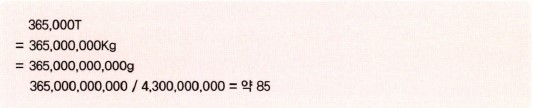

따라서 이 빌딩이 102층에 층 높이가 381미터라고 하니까 1/85면 약 1.2층이고 높이로는 4.5미터 정도의 빌딩 무게라고 생각하시면 되겠네요.

그렇다면 IPv6는 얼마나 될까요?

IPv6는 엠파이어 스테이트 빌딩으론 계산이 안 되어 우리가 비교할 만한 가장 무거운 무게인 지구를 가지고 비교를 해보겠습니다.

지구의 무게는 실제로 잴 수는 없지만 이론상으로 약 5,972 x 1021톤이라고 합니다. 이 무게를 기준으로 했을 때 IPv6에서 가능한 주소를 하나에 1그램씩 계산하면 지구 무게의 무려 567억배의 무게가 된다고 합니다.

정말 무겁죠?

IPv4의 가능한 주소와 IPv6의 주소는 사실 비교가 안 되는 정도의 차이랍니다.

앞으로의 주소도 모자라는 것 아니냐고 누가 질문한다면 지구를 생각하시기 바랍니다. 물론 나중에 배우면서 아시겠지만 주소 체계를 들여다보면 이걸 전부 내 마음대로 정하는건 아니지만, 그렇다고 하더라도 이제 예전처럼 서브넷 마스킹을 이리저리 굴려가며 주소를 쪼개쓸 일은 없게 될 겁니다.

## IPv6의 주요 특징에 대한 첫 번째 이야기

이번 시간엔 지난 시간에 대충 집어봤던 IPv6의 특징을 하나하나 설명해드리겠습니다.

이제부터가 진짜 IPv6에 대한 설명이니까 긴장하시구요. 조금 어려워지더라도 포기하지 마시기 바랍니다.

자, 시작해볼까요?

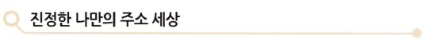

지난 시간에 Global Address에 대해 언급한 적이 있을 겁니다. 기억나세요? 혹시 가물가물하시면 앞 페이지로 가보시면 된답니다.

보통 Global이란 말이 들어가면 '전 세계적으로', 아니면 '모든 네트워크를 통틀어'라는 의미로 기억해두시면 될 것 같네요. 그래서 IPv6의 특징에서 주로 나오는 Global Address나 오늘 설명드릴 Global Reachability와 같은 말은 IPv6의 주소 범위가 광대해짐으로써 가능해진 기능이라고 볼 수 있습니다.

참고로 제가 앞으로는 영어로 된 말을 자주 쓸 것 같은데요. 이유는 다른 문서를 보시더라도 그 개념을 쉽게 이해시켜드리기 위한 것입니다. 제가 여기서 저만의 언어(?)로 설명을 드리면 다른 자료를 보시면서 제가 설명드린 내용이 이 말인지 아닌지 이해하기 어려우실 겁니다.

그래서 좀 어려우시더라도 네트워크쪽에서 같이 사용되는 영어로 설명을 드리는 게 좋다는 생각입니다. 가끔 영어가 나오더라도 너무 기분 나빠하지 마시고 이해해 주시기 바랍니다.

자, 다시 돌아와서 아무튼 여기서 말하는 Global Reachability란, 전 세계의 네트워크 어디서나 주소를 변경하지 않고, 즉 고유의 주소를 가지고 접속이 가능하다는 걸 뜻합니다. 이미 전에도 설명드렸지만 최근에는 네트워크에 Pc나 프린터, 전화기, TV, 휴대전화, 팩스, 셋톱박스등 많은 장비들이 접속되고 있어 각자에게 고유의 IP 주소를 부여해야 했지만, IPv4 환경에선 충분한 주소가 없었습니다.  
따라서 중간에 NAT 기능을 지원하는 장비를 두고 주소를 몇 번씩 변환해가면서 서비스를 수행하다 보니 진정한 End-to-End Reachability를 실행하기가 어려웠습니다. (여기서 End-to-End Reachability란, 통신을 할 때 출발점이 되는 한쪽 끝 장비에서 도착점이 되는 다른 쪽 끝 장비까지의 연결을 의미합니다. 즉 한쪽 끝에서 다른 쪽 끝까지 주소 변환없이 도착이 가능하다는 거죠.)

한쪽 끝에서 다른 쪽 끝까지 주소 변환없이 도달 가능하다는 게 뭐가 좋다는 거냐?? 궁금해 하실 분도 있겠지만 사실 이건 큰 의미가 있습니다.

애플리케이션의 적용에서도 그렇고 보안적인 측면에서도 End-to-End Reachability는 훨씬 효과적인 구현이 가능하기 때문입니다.

잠깐 정리해볼까요?

IPv6의 넓은 주소 공간은 점점 늘어나는 네트워크 지원 장비들 모두에게 충분한 IP 주소를 제공 해줄 수 있기 때문에 전 세계 어디에 있더라도 한쪽 끝에서 다른 쪽 끝까지 주소 변환 없이 자기 자신의 주소를 가지고 접속이 가능한 End-to-End Reachability를 지원한다. 따라서 애플리케이션적인 측면이나 보안적인 측면에서 훨씬 더 효과적이다. 여기까지입니다.

이번 시간에는 넓은 주소 공간의 또 다른 이점에 대해서 설명드리겠습니다.

바로 계층화된 주소 배정이 가능해진다는 것입니다.

왠 계층??

이렇게 반문하는 분이 있을 겁니다. 요즘 우리 사회는 계층 없는 사회를 만들자는 게 목표이긴 하지만, 네트워킹에서는 계층을 만들어주는 것이 훨씬 관리하기 편리하죠. 무슨 계층인지 알아볼까요?

영어로 말하자면 Hierarchy, 즉 주소 체계의 계층화된 말을 영어로 표현하면 Hierarchical Addressing 또는 Addressing Hierarchy라고 합니다.

한마디로 긴 주소를 목차 나누듯이 나누어준다는 개념이죠.

예를 들어 128비트의 IPv6 주소를 가지고 처음 16비트까지는 상용 주소를 구분하고, 17비트부터 23비트까지는 대륙(아시아, 아메리카, 아프리카, 유럽 등)을 구분하고, 23비트부터 32비트까지는 그 대륙에 있는 ISP들을 구분하게 하고, 또 32비트부터 48비트까지는 하나의 사이트, 즉 회사나 기관, 학교 같은 걸 구분하게 하고, 48비트부터 64비트까지를 이용해서 각 LAN을 구분해준다면 지금부터 훨씬 수월한 주소 관리가 가능해질 것입니다.

즉 현재 우리가 사용하고 있는 우편번호 관리, 전화번호 관리, 그리고 자동차 번호판 관리와도 비슷한 개념입니다.  
그렇게 되면 우린 IPv6 체계에서 IP 주소만 보게 되더라도 대충 어느 나라에서 사용되는 어떤 ISP에서 부여받은 어떤 사이트의 주소인지를 알 수 있게 된다는 겁니다.

물론 현재 IPv4 체계에서도 이런 구분을 두려고 많이 노력했지만, 아무래도 주소 범위가 좁다보니 그렇게 구현하기가 만만치 않았습니다. 게다가 여기저기 나누어주고 쪼개 쓰다 보니 오히려 그런 구분을 한다는 건 더더욱 어려워지게 된 거죠.

이러한 체계적인 주소의 구분은 주소를 알아보기 쉽게 한다는 장점뿐만 아니라 여러 개의 트래픽을 하나로 묶어주는 것까지도 가능하게 해주었습니다. 같은 방향으로 가는 트래픽을 구분해서 하나로 묶어 보내게 되면 네트워크의 트래픽을 훨씬 줄일 수 있다는 개념이죠. 같은 방향으로 출근하는 사람끼리 모여서 차를 타고 가는 카풀과도 비슷하네요.

또 IPv4 체계에서의 슈퍼넷팅(Supernetting)의 개념과 같이 여러 개의 라우팅 경로를 하나로 묶어줄 수도 있게 됩니다. 이렇게 되면 라우팅 테이블에 저장되어야 할 경로를 획기적으로 줄일 수 있겠죠? 즉 내부에서는 여러 개의 네트워크가 있지만 이걸 외부로 뿌릴 때는 하나로 묶어서 뿌리게 된다면, 외부에선 여러 개의 네트워크 경로를 다 따로따로 관리할 필요가 없게 된다는 겁니다.

예를 들어 미국에서 누군가가 편지를 보낼 때 한국 주소를 번지수까지 적어서 보낸다고 하더라도 미국에선 일단 주소를 다 확인해 보는 게 아니고 한국으로 가는 건 모두 모아서 한국의 대표 우체국(네트워크에선 이런 역할을 하는 라우터를 'Border Router'또는'관문 라우터'라고 합니다.)으로 보내게 되고 그 다음 주소는 우리나라 우체국에서 보고 각 지방으로 보내는 것과 같은 개념이죠.

만약 미국에서 우리나라로 가는 편지를 주소별로 하나씩 배달한다고 하면 훨씬 복잡해지겠죠?

바로 계층적 주소 배치는 이렇게 주소를 체계적으로 관리함으로써 여러 개의 주소를 하나의 주소로 묶는 Aggregation이 효과적으로 이루어지게 해준다는 겁니다.

지금까지 내용을 정리해볼까요?

IPv6에서는 주소 공간이 128비트로 넓어졌기 때문에 주소의 계층적 관리가 가능해졌고, 이러한 관리 기법으로 인해 효과적인 주소 배치가 가능해졌을 뿐만 아니라 여러 개의 네트워크를 하나의 네트워크로 묶어 트래픽을 줄일 수 있게 되었다. 여기까지입니다.

이번엔 IPv6의 또 하나의 장점 Aggregation에 대한 이야기입니다. 지난 번에도 잠깐 언급했죠?

Aggregation이 뭐냐? 한마디로 묶는다는 겁니다.

즉 여러 개의 네트워크 주소를 하나로 묶어준다는 거죠. 이렇게 Aggregation이 가능한 건 앞에서 설명드린 대로 계층적인 주소 배정이 가능하게 되었기 때문입니다.

왜 묶어줄까요?

답은 바로 간단하게 하기 위해서입니다.

그림을 보면서 설명드리겠습니다.

고객 사이트 #1을 먼저 보시죠.

고객 사이트 #1에는 2개의 네트워크가 있다고 가정하겠습니다. 하나는 2001:0200:0001:0001::/64이고 또 하나는 2001:0200:0001:0002::/64입니다.

이게 뭐냐구요? 이게 바로 IPv6 주소입니다.

IPv6 주소는 16진수로 표시하고 4자리마다 ':'(콜론)으로 구분을 해주는 방식입니다. 좀 헷갈리시죠? 주소에 대한 이야기는 다음에 설명해 드리겠습니다. 우선은 그냥 보시기 바랍니다. 2개의 주소를 보면 앞에서부터 세 번째 콜론까진 똑같죠? 그리고 네 번째 묶음에서 하나는 0001이고 또 하나는 0002로 다릅니다. 서로 다른 2개의 네트워크가 있는 거죠.

하지만 이 2개의 네트워크가 밖으로 나갈 땐 하나로 묶어서 내보낼 수 있다는 겁니다. 즉 2001:0200:0001::/48로 말이죠.

아마 이쯤 되면 눈치채신 분도 있으실 텐데요... 뒤에 붙는 /64나 /48 같은 수는 바로 IPv4에서의 서브넷 마스크 비트랑 비슷합니다. 즉 /48이란, 맨 앞에서 48비트까지가 같은 네트워크라는 거죠. /64는 맨 앞에서 64비트까지가 같아야 한 네트워크구요.

그럼 /46과 /64는 둘 중 어느 것이 큰 네트워크일까요?

답은 /46이겠죠? 앞에서부터 48비트까지만 같고, 나머진 다 달라도 같은 네트워크가 되니까 128에서 48을 뺀 80비트가 바로 호스트 비트가 되는 개념이죠.

이야기가 샜네요. 다시 돌아와서 /64비트인 두 네트워크는 /46비트인 하나의 네트워크로 묶어 줄 수 있습니다.

그림 아래 고객 사이트 #2 역시 같은 개념으로 2001:0200:0002::/48로 묶었다고 가정했을 때, 고객 사이트 #1과 고객 사이트 #2를 묶어줄 수도 있겠죠?

이렇게 2001:0200:으로 시작하는 네트워크를 다 모아준다면 하나의 네트워크가 되는 거죠. 그림에 있는 ISP가 바로 그런 네트워크입니다.

이렇게 된다면 이 ISP에서는 인터넷쪽으로 라우팅 정보만을 알려주게 되는 거죠.

따라서 인터넷쪽에선 목적지가 2001:0200::/32로만 시작하는 네트워크가 온다면 다 여기 있는 ISP쪽으로 보내주겠죠?

이게 바로 Aggregation의 개념입니다.

나중에 설명드리겠지만 2001:로 시작되는 주소는 IPv6에서 인터넷 상용 서비스를 위해 할당된 번호구요. 2001: 뒤에 200으로 나오는, 즉 2001:0200:으로 시작되는 주소는 아시아쪽에 배달된 주소랍니다.

이렇게 주소를 묶어주는 이유가 '간단하게 하기 위해서'라고 말씀드렸는데, 이걸 좀 더 네트워크적인 용어로 설명드린다면, Prefix Aggregation(네트워크의 앞부분을 묶는 방식)을 해주는 이유는 여러 개의 경로 정보를 하나로 묶어줌으로써 라우팅 테이블을 줄여줄 수 있고, 이렇게 라우팅 테이블을 줄여 라우터의 메모리 절약은 물론이고 라우팅을 훨씬 더 효과적이고 빠르게 진행할 수 있기 때문입니다.

사실 현재망에서도 라우팅 경로 정보를 줄여주기 위해서 CIDR(Classless Inter Domin Routing)이나 Supernetting 등의 다양한 노력을 하고 있지만, 역시 체계적인 주소 배정이 안되어 있다 보니 구현의 어려움을 겪고 있답니다. 하지만 IPv7에서는 아예 배정부터 계층적인 구조를 지원하다 보니 훨씬 효과적인 라우팅이 가능해진다는 거죠.

예를 들어 오래된 도시는 길이 모두 좁고 꼬불꼬불해서 차들이 엉키고 뒤섞여 운전하기가 여간 까다롭지 않죠. 그렇다고 길을 하나 새로 만들어보려고 해도 기존에 있던 건물들이 체계적으로 지어지지 않아서 어려움이 많잖아요.

하지만 미리 도시 계획에 의거해서 만들어진 계획 도시는 널따란 길과 반듯하게 세워진 건물들 때문에 도시의 교통 통제가 훨씬 간편하다는 거죠.

이게 바로 IPv4와 IPv6의 차이라고 볼 수 있습니다.

자, 그럼 오늘 배운 걸 정리해볼까요?

IPv6 주소는 체계적으로 배정된 주소 때문에 여러 개의 주소를 하나로 묶어주는 기능인 Prefix Aggregation이 가능하다. 따라서 라우팅 테이블을 줄일 수 있을 뿐 아니라 효과적이고 확장 가능한 라우팅의 적요잉 훨씬 더 수월해진다.

## IPv6의 주요 특징에 대한 두 번째 이야기

이번 시간엔 지난 시간에 이어 IPv6의 특징에 대해서 계속 알아보겠습니다.

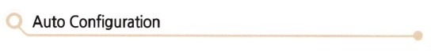

오늘 배울 IPv6의 첫 번째 특징은 Stateless Auto Configuration입니다.

Stateless란 말을 이해하려면 이와 반대되는 Stateful을 이해해야 합니다.

예를 들어 Stateful Auto Configuration이란 말은 어떤 state를 계속 유지하면서 자동 구성을 지원해준다는 말입니다. DHCP를 보면 특정 서버에서 테이블을 관리하면서 IP 주소를 분배하는 방식이죠? 이와 같은 방식을 Stateful Auto Configuration이라고 합니다. 그러니까 IPv4에서도 Stateful Auto Configuration은 지원됐던 거죠.

그러나 Stateless Auto Configuration은 IPv6에서만 지원되는 기능입니다. 즉 특정 서버가 없이도 라우터 등에서 자동으로 호스트의 IP 구성이 가능하게 해주는 방식이죠. Stateless Auto Configuration이야말로 진정한 자동 IP 구성이라고 할 수 있죠.

따라서 IPv6부터는 우리가 일일이 호스트(PC)의 IP 주소를 걱정해 줄 필요가 없습니다. DCHP 서버 같이 전용 서버 없이도 그냥 네트워크에 붙이기만 하면 알아서 자동으로 주소를 만들어주니, 한마디로 Plug and Play(플러그 앤 플레이)라고 볼 수 있죠.

그림을 보시죠.

네트워크에 PC가 연결되어 있는 게 보이시죠? 이 중 아래쪽에 있는 녀석이 새로 네트워크에 접속했답니다. IPv6 통신을 하기 위해서는 주소가 필요하겠죠? 그래서 이 녀석은 라우터에게 자기에게도 주소를 하나 달라고 요청한 겁니다. 일단 얘가 원래 48비트의 MAC Address를 가지고 있는 건 다 아시죠? 우선 이 주소를 64비트로 만듭니다.

그 다음에 자기가 속한 네트워크에 있는 라우터에게 앞대가리 64비트를 전송받게 되는데, 이걸 유식하게는 Prefix라고 합니다.

이렇게 받은 Prefix 64비트에 자기가 가지고 있던 64비트를 합해서 총 128비트짜리 IPv6 주소를 만들어내게 됩니다. 이때 라우터는 Prefix 외에도 Default Route 정보 같은 호스트에게 필요한 정보를 보내주게 됩니다.

따라서 호스트 입장에선 따로 해줄 게 하나도 없습니다. 앞으로 IPv6 시대가 오면 PC든, 전화기든, PDA든, 냉장고든 뭐든 그냥 연결만 하면 바로 네트워크와 연결될 수 있다는 거죠.

지금까지 배운 내용을 잠깐 정리하고 넘어갈까요?

IPv6의 새로운 기능 Stateless Auto Configuration은 특정 서버가 없이도 호스트의 IP 주소를 자동으로 구성해줄 수 있는 기능으로, 호스트가 만든 64비트 주소와 라우터가 보내주는 64비트 Prefix를 더해서 만들어낸다.  
그래서 IPv6 시대에는 진정으로 Plug and Play가 가능해지는 것이다.

정리되시죠?

그렇다면 IPv6에서 DHCP는 없어진 걸까요?

지금부터는 이 부분을 한번 알아볼까 합니다.

Stateless Auto Configuration은 그동안에 IPv4에선 지원되지 않던 기능이었죠. IPv4에서는 Stateful Auto Configuration, 즉 DHCP 서버와 같은 서버를 두고 주소를 자동으로 관리해주던 방식을 지원했습니다.

그렇다면 IPv6에서는 Stateful Auto Configuration이 없을까요?

결론부터 말씀드리자면 있습니다.

그게 바로 DHCPv6라는 것입니다.

즉 호스트 중에는 Stateless Auto Configuration만으로는 구성이 부족한 경우가 있습니다. 예를들어 DNS 서버나 NTP 서버 정보, 또 SIP 서버나 Novell Directory 서비스 정보에 대한 세팅은 앞에서 배운 Stateless Auto Configuration으로는 구성이 불가능합니다. 따라서 이때는 IPv6에서도 Stateful Auto COnfiguration을 사용하게 되는데, 가장 일반적인 방법이 DHCPv6입니다.

즉 호스트가 맨 처음 라우터로부터 Stateless Auto Configuration이 이루어질 때 그 안에 같이 따라온 플래그를 보고 자신이 추가적인 정보를 다시 Stateful Auto Configuration을 통해 받아야 할 것인지, 그럴 필요가 없는지를 알게 됩니다.

그러니까 일단 Stateless를 통해 기본적인 정보를 받고, 추가 정보는 Stateful을 통해 받을 수도 있고 안 받을 수도 있다는 거죠.

자, 그럼 이제 Auto Configuration에 대한 답은 나왔죠?

IPv6에서는 Stateless Auto Configuration을 통해 자동으로 호스트의 주소를 만들어 주는데, 이 기능은 IPv4에서는 지원하지 않던 새로운 기능이다. 그런데 IPv6에서 역시 좀 더 자세히 호스트를 구성하고자 하는 경우에는 State Auto Configuration을 이용한다. 대표적인 stateful Auto Configuration은 DHCPv6이다!

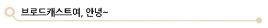

이번 시간에는 IPv6의 멀티캐스트에 대해 말씀드리겠습니다.

이전 IPv4에서 네트워크 트래픽에서 골칫거리 중 하나는 바로 브로드캐스트였습니다. 무조건 모든 곳으로 원하든, 원치 않던 전송되던 브로드캐스트. 그렇다고 무조건 막아버릴 수도 없죠??  
브로드캐스트가 골칫거리긴 하지만 또 필요하긴 하거든요. ARP를 할 때나. 라우팅 정보의 업데이트 등에 사용되었잖아요. 그래서 없앨 수도 없는 한마디로, 필요악? 뭐 이런 거 였습니다.

하지만 이제 '브로드캐스트'란 단어는 더 이상 IPv6에선 기억하지 않으셔도 될 듯합니다.

IPv6에서는 브로드캐스트 대신 멀티캐스트가 그 역할을 대신합니다. 물론 IPv4에서도 멀티캐스트가 있었지만 IPv6에서의 멀티캐스트는 그 기능이 훨씬 강화되었고 주소 영역도 늘어났습니다. 특히 IPv6의 멀티캐스트는 4비트의 Scope ID라는 것을 사용합니다.  
이 Scope ID라는 것이 바로 멀티캐스트의 전송 영역을 지정해줄 수 있도록 해주는 역할을 합니다. 따라서 똑같은 멀티캐스트라고 하더라도 Scope ID에 따라 이 멀티캐스트를 어디까지 받을 수 있게 전송할 것인가를 정해줄 수 있다는 겁니다. 이제 따로 브로드캐스트를 사용해야만 할 이유는 없겠죠?

이제 멀티캐스트에 대해서 별 관심 없으셨던 분들도 IPv6에서는 멀티캐스트가 필수라니까 관심을 가져야겠죠?

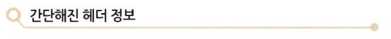

세 번째 IPv6의 특징은 간단해진 헤더 정보입니다.

헤더(Header)가 뭘까요?

머리죠.

즉 IP 패킷에서 데이터를 포장한 포장지 위에 써 넣는 주소 같은 것입니다.

왜 우리도 소포나 편지를 보낼 때 겉봉투에 받는 사람 주소, 보내는 사람 주소, 그리고 추가할 사항(예를 들어 '깨짐 주의' 또는 '빠른 특송', '등기' 등)을 쓰는 것처럼 IP 패킷의 헤더 역시 Source Address, Destination Address 외에도 서비스 등급을 나타내는 Type of Service. 헤더의 길이를 나타내는 Header Length 및 여러 가지 Flag와 옵션이 있습니다.

사실 이런 헤더의 정보를 가지고 라우터는 그 패킷을 목적지까지 안전하게 전송하는 역할을 하게 되는 거죠.  
그런데 IPv4와 IPv6의 차이점 중 하나가 이 헤더 정보가 많이 달라졌다는 겁니다.

한마디로 말씀드리자면, 헤더 정보가 많이 간단해졌습니다. IPv4에 있던 헤더 정보 중 절반을 날려버렸으니까요. 그도 그럴 것이 IPv4에서는 Source Address와 Destination Addresss가 32비트면 됐지만, IPv6에서는 그 4배인 128비트가 되니까 기존 헤더 정보를 그대로 쓸 경우 헤더가 엄청나게 커지게 되는 거죠.  
그래서 헤더 정보를 효과적으로 줄일 필요가 있었습니다. 또 IPv4에서 만들어 사용해보니까 '이런 건 필요 없겠구나...' 하는 헤더 정보도 있었을 겁니다. 그래서 이번엔 그런 헤더 정보를 과감히 없앤 거죠.

이렇게 많은 헤더 필드를 없애고 나니 패킷 처리가 훨씬 간단해지고 라우팅 성능도 올릴 수 있게 됐습니다. 또 모든 필드들이 64비트 단위로 정렬되어 있어 메모리를 읽고 쓰는 게 훨씬 빨라졌다는 장점도 있죠.  
하지만 주소 길이가 기존 32비트에서 128비트로 늘어났기 때문에 주소를 확인하는 데 더 많은 시간이 걸릴 수 있고, IPv4의 헤더를 많이 줄였지만 주소 길이로 전체적인 헤더 길이는 2배로 늘어났기 때문에 처리 속도가 이슈가 된다는 건 알아두셔야겠네요.

물론 대부분의 패킷 처리를 하드웨어적으로 처리하고 장기적으론 이 문제는 해결 가능하지만, 당장에는 성능에서 영향을 줄 것으로 생각되네요.

자, 세 번째 변화를 정리해볼까요?

IPv6에서는 IPv4에서보다 헤더 정보를 많이 간소화하고 절반의 헤더 정보를 없앴기 때문에 패킷 처리가 빨라졌지만, 주소 길이가 4배로 늘어나 주소 확인에 문제가 있을 수 있다. 쉽죠?

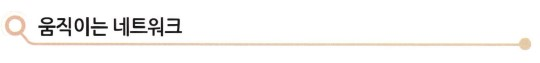

IPv6의 특징을 이야기하다 보면 Mobility를 빼먹을 수 없습니다.

Mobility, 이게 뭘까요?

한마디로 '이동성'이죠. 즉 움직을 수 있는 능력. 뭐 이 정도일 겁니다.

지금까진 네트워크의 이동성이 그렇게 크게 필요치 않았습니다. 왜냐하면 컴퓨터가 크고 무거웠거든요. 한번 설치해놓으면 그걸 자꾸 옮길 일은 별로 없었기 때문에 네트워크의 이동성이란게 큰 의미가 없었죠.

하지만 요즘은 노트북 사용이 점점 늘고 있고, 왠만한 사람들 가방 속엔 노트북 하나씩은 들어있는 세상이다 보니 이에 따른 이동성 역시 꼭 필요해졌습니다.

요즘 나오는 기술은 이런 이동성을 보장하기 위한 여러 가지 솔루션을 제공합니다. 가장 대표적인 기술이 무선 랜 기술이죠. 또 Wibro(와이브로, Wireless Broadband)라는 것 역시 움직이면서 네트워크에 접속하기 위한 솔루션이란 걸 알고 계실 겁니다.

이동이 가능하다??

네, 그렇습니다.

즉 자동차를 타고 달리면서 인터넷 검색을 한다... 이런게 네트워크 Mobility죠. (운전하면서 인터넷 하면 안 되겠죠?)

지하철을 타고 가면서 전화를 하거나 문자를 보내는 사람들이 많이 있죠. 그런데 지금은 지하철 안에서 MSN을 하거나 인터넷을 하는 사람은 별로 안 보여도 아마 몇 년 후에는 그런 풍경을 많이 보실 수 있을 겁니다. 물론 비행기 안에서도 말입니다.  
지루한 시간 동안 비행기 안에서도 이제 인터넷을 맘 놓고 쓸 수 있게 되는 겁니다. (일부 항공사에서 이미 이 서비스를 제공하고 있죠.)

한마디로 네트워크 Mobility란, 장비가 현재의 네트워크 접속이 끊기지 않고서도 이동이 가능하도록 해주는 기능이라고 생각하시면 됩니다.

아무튼 이런 네트워크 Mobility가 IPv6에선 좀 더 편리해지고 효과적으로 수행이 될 수 있게 된 것이 또 하나의 특징이란 거죠.

물론 네트워크 Mobility는 IPv4에서도 지원이 되던 IETF 표준이었습니다. 하지만 IPv4에서는 옵션으로 제공되어 사용하려면 반드시 그 기능을 추가해야 했는데, IPv6에서는 이미 Built-in 되어 있기 때문에 필요할 때마다 그냥 사용할 수 있다는 차이점이 있습니다.

또 IPv6에서는 IPv4에 비해 Mobility 기능이 훨씬 향상되어 빠르고 안정된 이동성이 보장되어진 게 특징입니다. 이처럼 IPv6에서는 요즘 들어 우리가 많이 사용하고 있고 앞으로 그 사용도가 점점 많아질 Mobility나 보안과 같은 기능을 보다 강화시켰다는 특징을 제공합니다. 아무래도 새로 나온 거니까 새로운 트랜드를 따라서 만들었겠죠?

자, 그럼 지금까지 배운 IPv6의 특징을 간단하게 정리해볼까요?

<b>첫 번째, IP 주소 범위</b>  

- IPv4는 32비트 체계였고, 이론상 가능한 주소는 43억 개 정도였죠? 하지만 막상 쓸 수 있는 주소는 2억 5천만 개 정도였구요. 그것도 이미 거의 다 소진한 상태랍니다.
- IPv6는 128비트 체계였고, 가능한 주소는 3.4 x 1038개 정도랍니다. 따라서 이론적으로 생각했을때 거의 무제한으로 사용이 가능하다는 특징이 있답니다. 생각나시죠? 엠파이어 스테이트 빌딩과 지구요.

<b>두 번째, IP 주소의 자동 구성</b>  

- IPv4는 DHCP를 사용해서 자동 구성했던 거 아시죠? 그걸 Stateful Auto Configuration이라고 했습니다.
- IPv6는 Stateless Auto Configuration이라고 해서 네트워크에 접속만 되면 자동으로 구성되는 방식과 DHCPv6 방식이 있다고 했죠? 그리고 IPv6의 주소는 복잡해졌지만 앞으로는 어떤 장비든 네트워크와 접속만 되면 자동으로 주소를 구성할 수 있게 되었죠.

<b>세 번째, 보안</b>  

보안에 대한 이야기는 위에서 따로 다루지 않았지만 보안 역시 IPv6에서 많이 개선되었습니다. 특히 아래와 같은 내용이 차이가 있으니까 알아두시면 좋겠네요.

- IPv4는 보안에 관한 IPSec이 있지만 옵션입니다. 따라서 End-to-End 보안을 적용하는 게 쉽지 않았습니다.
- IPv6는 IPSec이 디폴트라서 어디서나 보안을 적용할 수 있다는 차이가 있습니다.

<b>네 번째, Mobility</b>  

- IPv4도 Mobile IP를 지원했습니다. 하지만 여러 가지 까다로운 옵션이 있었고, 적용 방식 역시 효율적이지 못한 부분이 있었습니다.
- IPv6에서는 좀 더 효과적인 방법으로 훨씬 간편하게 지원이 가능합니다.

<b>다섯 번째, 브로드캐스트</b>  

- IPv4에서는 브로드캐스트가 있어 대역폭을 많이 소비했지만, IPv6에서는 브로드캐스트가 없어지고, 대신 멀티캐스트가 그 역할을 한다고 했죠? 멀티캐스트는 기존의 IPv4와 달리 전달 범위를 지정할 수도 있답니다.

어떠세요?

이제까지 IPv4와 IPv6를 비교하면서 그 차이를 알아봤습니다.

한마디로 IPv6는 그동안 우리가 IPv4를 사용하면서 이런 게 좀 개선되었으면, 이런 건 좀 더 추가되었으면 하던 여러 가지 기능을 개선했고, 보다 성능을 향상시킬 수 있도록 만들어졌습니다. 원래 신제품이 나올 땐 다 그렇죠?

그런데 여기엔 한 가지 문제가 있습니다.

아까 말씀드린 것처럼 IPv6가 새로 나온 전자제품 정도라면, 그냥 쓰던 걸 버리고 이걸 가져다쓰면 참 좋겠다는 생각을 하지만... 현실은 그렇지 못하다는 겁니다.

즉 이미 우리는 IPv4를 너무나도 방대하게 사용하고 있기 때문에 아무리 좋은 기능을 가진 새로운 IPv6가 나왔다고 하더라도 당장 우리가 쓰던 IPv4를 모두 걷어내고 IPv6로 옮겨갈 수 는 없는 것입니다. 그렇죠?

예를 들어 2012년 1월 1일 00시를 기해 IPv6만을 사용해야 한다고 선언한다면, 얼마나 많이 불편할까요? 상상할 수도 없을 겁니다. 서울이란 도시에서 버스 체계 하나만 바뀌었는데도 혼란이 말할 수 없이 커지는 걸 보셨을 텐데, 전 세계의 IP 주소를 하루아침에 바꾼다면 어떤 일이 벌어질지는 어느 정도 짐작이 가실 겁니다.

현실적으로 하루아침에 IPv4에서 IPv6로 옮겨가는 건 불가능합니다. 따라서 앞으로 상당 기간 동안은 IPv4와 IPv6가 공존하는 세상이 올 것이라는 것이 대다수의 의견입니다. 이를 위해 IPv6에서는 IPv4와의 다양한 공존 방법을 제공하고 있습니다.

다음 시간에는 IPv6에 대한 마지막 시간으로 IPv6의 주소는 어떻게 생겼고, 또 IPv4와 IPv6는 서로 어떻게 연결되어 살아갈 수 있는지에 대해서 알아보겠습니다.

그리고 잠깐, 여기서 끝내기가 너무 서운한 분들을 위해 짤막한 문제 풀기를 해보도록 하겠습니다. 지금까지 배운 내용을 정리하는 기분으로 한번 풀어보시기 바랍니다.

정답이요? 정답은 바로 뒤에 있답니다.

정답은 -> 'd'가 정답인 거 아셨죠? Stateless Autoconfiguration은 IPv6의 특징입니다.

정답은 -> 'b'가 정답입니다. CIDR(Classless Inter Domain Routing)은 주로 Supernetting을 통해 라우팅 테이블을 줄이기 위해 사용합니다.

정답은 -> 'e'의 Automatic QoS Support가 해당되지 않는 특징입니다.

## IPv6 주소는 어떻게 생겼을까요?

이번 시간에는 IPv6의 주소는 어떻게 생겼고, IPv4에 비해 어떻게 달라졌으며, 앞으로 우리와 함께 어떻게 살아갈 것인가에 대해 알아보겠습니다.

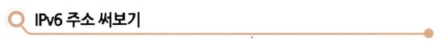

자, 그럼 이제부터 IPv6의 주소에 대한 이야길 드리겠습니다.

그동안 우리가 사용하던 IPv4에서는 주소를 보통 10진수로 표현했죠?

그냥 150.100.13.8처럼 10진수로 0~255 사이의 숫자를 쓰고 숫자 사이에 점(.)을 찍었던 방식이었습니다. 하지만 이제부터 우리가 사용하게 될 IPv6의 주소는 조금 달라졌습니다.

아니, 사실은 많이 달라졌습니다. ^^  
뭐가 달라졌는지 알아볼까요?

우선 이제 10진수로 IP 주소를 쓰지 않는다는 거빈다. 그럼 뭘 쓰냐구요?

16진수를 사용합니다.

16진수 아시죠? 10진수는 0에서 9까지의 수를 이용해서 표현한다면 16진수는 0에서 15까지의 숫자로 표현해야 될 겁니다.  
하지만 10, 11, 12, 13, 14, 15는 두 자릿수가 되어 버리니까 이것들을 따로 표현할 방법을 하나 찾아야겠죠? 그래서 16진수는 이렇게 표현합니다.

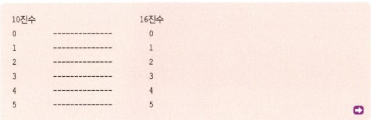

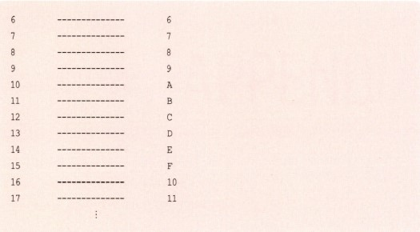

쉽게 이해가 가시죠? 10진수와 비교해가며 이해하시기 바랍니다.

그런데 왜 갑자기 잘 쓰던 10진수 대신 16진수를 쓰냐면, 주소가 길어져 더 이상 10진수로 표시하기 어렵다는 것과 16진수가 2진수와의 궁합이 더 잘 맞는다는 2가지 이유 때문입니다.

원래 주소는 IPv4든, IPv6든 모두 2진수로 되어 있다는 건 알고 계실 겁니다.

따라서 2진수 주소를 10진수로 바꾸는 걸 IPv4에서 많이 공부하셨을 텐데 이젠 그럴 필요가 없어졌습니다. IP주소로 더 이상 10진수를 사용하지 않기 때문이죠. 이젠 2진수를 16진수로 바꾸는 걸 배워야겠죠?

바꾸는 방법은 간단합니다. 왜냐구요? 2진수 4개가 모이면 16진수 1개가 되거든요.

한번 살펴볼까요?

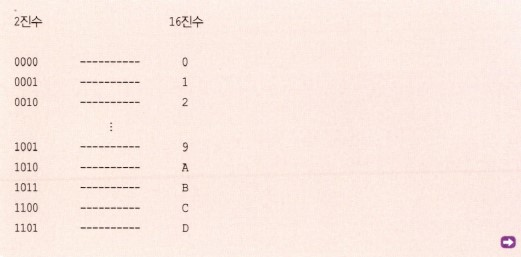

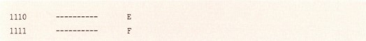

그렇죠? 즉 2진수의 네자리는 16진수 한 자리로 모두 표현이 된다는 겁니다. 따라서 오히려 2진수의 10진수 변환보다는 2진수의 16진수 변환이 훨씬 쉽죠.

이야기가 좀 옆으로 흘렀네요. 자, 다시 돌아와서 IPv6에서 주소는 16진수 네 자리를 쓰고 콜론(;)을 찍고, 또 16진수 네 자리를 쓰고 콜론(;)을 찍고..., 이렇게 16진수로 네 자리를 8번 쓰고 중간에 콜론 7개를 찍어 주소를 표시합니다. 아래를 보시죠.

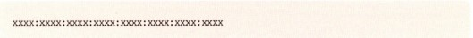

이런 방식입니다. 여기서 x는 16진수 한 자리를 뜻합니다. 예를 들어 달라구요?

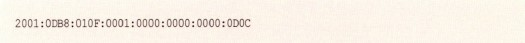

이때 A~F까지의 알파벳은 문자가 아닌 16진수 숫자이므로 대소문자의 구분이 없다는 것도 알아두시기 바랍니다. 예를 들어

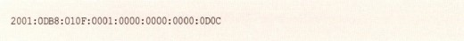

와

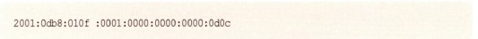

는 같은 주소가 되는 겁니다.

자, IPv6 주소 표기의 두 번째 규칙은 앞쪽에 오는 '0'은 안 써도 됩니다. 예를 들어

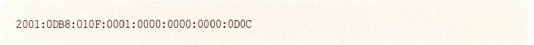

라는 주소는

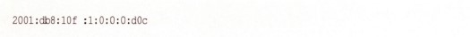

로도 쓸 수 있다는 겁니다. 자세히 보시면 연속으로 쓰여있던 0이 생략되어 하나로 바뀐 걸 알 수 있습니다. 즉 각 주소 중 앞쪽 0은 생략이 가능하다는 겁니다. 하지만 중간에 있는 0은 생략하면 안 되겠죠?

예를 들어 0D0C를 D0C라고 하면 앞에 '0'이 하나 생략된 걸 알 수 있겠지만, 0D0C를 DC라고 한다면 어디에 '0'이 빠졌는지 알 수 없겠죠? 따라서 맨 앞자리 '0'만 생략합니다.

또 0001과 같이 앞에 여러 개의 '0'이 있을 경우도 모두 생략해서 1로 표기할 수 있답니다. 그래야 앞에 '0' 3개가 생략된 걸 알 수 있으니까요.

그럼 이번엔 세 번재 규칙을 알려드리겠습니다.

세 번째 규칙은 '0'이 연속으로 나올 때는 '::'으로 표시할 수 있습니다. 예를 들어

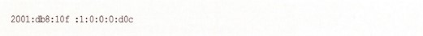

를

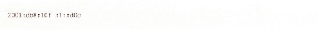

로 표기할 수 있다는 것입니다.

즉 위에서 보이는 대로 '0'들이 연속으로 나오는 경우는 '::'을 쓸 수 있다는 것입니다. 그러나 이런 방식을 2번 이상 사용하면 안 됩니다. 예를 들어

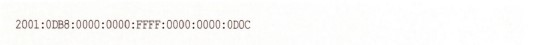

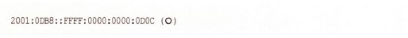

또는

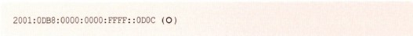

로는 표기할 수 있지만,

처럼 표기할 수는 없다는 겁니다.

왜냐하면 2001:0DB8::FFFF::0D0C처럼 표기했을 경우 어느 '::'에 '0'이 몇개 생략됐는지 알 수 없겠죠? 이렇게 연속으로 '0'이 오는 경우의 '::'으로 대치는 딱 한 번만 가능하다는 겁니다.

자, 그럼 지금까지 배운 주소 쓰기 규칙을 정리해볼까요?

첫째, IPv6 주소는 16진수로 표시하며 16진수 네 자리마다 콜론(:)을 찍어 구분한다.

둘째, IPv6 주소에서 주소의 앞쪽에 '0'이 올 경우 생략이 가능하다.

셋째, IPv6 주소에서 주소에 '0'이 연속될 경우 생략하고 '::'으로 대치할 수 있다. 다만 한 번만 가능하다.

이해가 잘 되지 않는다면 앞쪽에 있는 예를 다시 보시면 되겠죠?

주소에 대한 규칙은 여기까지입니다.

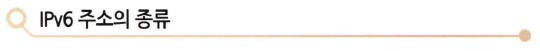

이번에는 IPv6의 주소의 종류에 대해 알아보겠습니다.

먼저 지금까지 우리가 사용하고 있는 IPv4 주소의 종류를 알아볼까요? 무엇무엇이 있죠?

네, 유니캐스트가 있죠.

받는 사람이 한 명인 주소 방식입니다. 보통 우리가 사용하는 주소가 바로 유니캐스트 주소입니다. 클래스 A, B, C가 바로 여기에 해당합니다.

그 다음으로 멀티캐스트가 있습니다.

받는 사람이 한 명이 아닌 특정 그룹이죠? IPv4에서는 클래스 D가 바로 멀티캐스트 주소였습니다. (IP 주소의 맨 앞자리가 224에서부터 239까지로 시작하는 주소가 바로 멀티캐스트 주소입니다.)

그리고 또 뭐가 있을까요? 네, 브로드캐스트가 있습니다.

브로드캐스트 주소는 브로드캐스트 영역에 있는 모든 호스트들에게 다 받으라고 보내는 거죠. 한 번에 모두에게 보내니 편리하긴 하지만 이미 알고 계신 대로 문제점도 많다고 설명드렸습니다. 트래픽이 많이 발생할 뿐 아니라 호스트에 인터럽트를 걸기 때문에 호스트의 성능까지도 떨어뜨릴 수 있다는 겁니다.

아무튼 이렇게 유니캐스트, 멀티캐스트, 브로드캐스트가 IPv4에서의 주소 삼형제였습니다.

그런데 IPv6에서는 달라졌습니다.

먼저 말도 많고 탈도 많던 브로드캐스트가 사라졌다는 겁니다. 대신 좀 더 강력해진 멀티캐스트가 그 역할을 대신하게 된 겁니다. 그리고 또 하나, Anycast(애니캐스트)가 등장했습니다.

애니캐스트? 이건 뭘까요?

말 그대로 Any, 즉 '아무나 받아라'입니다. 아무나 제일 먼저 받는 녀석이 임자가 되는 거죠. 참 이상한 걸 만들었죠? 1993년 처음 제안된 애니캐스트 방식은 그 애니캐스트 그룹 맴버 중 가장 가까이 있는 녀석에게 패킷을 보내는 방식입니다. 이런 방식은 가장 가까운 포인트를 찾는 탐색 메커니즘을 위해 사용된다고 했는데, 현재까지 그렇게 많이 사용되고 있지는 않는 듯합니다.

자, 정리해볼까요? IPv6에서 주소 방식은 유니캐스트, 멀티캐스트, 그리고 애니캐스트가 있다. 브로드캐스트는 이제 사라졌고 그 기능은 좀 더 강력해진 멀티캐스트가 수행한다.

여기까지입니다.

## IPv6와의 어색한 동거

그럼 이제 IPv6에 대해서 어느 정도 개념을 잡으셨을 겁니다.

지금부터는 우리가 현재 사용하고 있는 IPv4 네트워킹 세상에 어떻게 IPv6를 도입하는지 그 방법에 대해 설명드리겠습니다.

서두에서 IPv6라는 방식이 아무리 좋고 또 꼭 필요한 방식이라고 하더라도 우리가 어느 날 갑자기 IPv4를 버리고 IPv6로 돌아갈 수는 없다고 했습니다. 서울이라는 도시에서 버스 번호판 체계 하나 바꾼 것 때문에 며칠 동안 얼마나 많은 어려움을 겪었는지를 기억하실 겁니다.  
그런데 전 세계에서 사용하던 IP 주소를 하루아침에 바꾼다면 아마 그 혼란은 상상하기조차 어려울만큼 클 겁니다. 그러므로 IPv4와 IPv6는 한동안 한집 살림을 해야 할 겁니다. 그렇다면 이 두 버전의 IP를 어떻게 한 집에 동거하게 할 것인가에 대한 논의가 필요합니다. 왜냐하면 잘못된 동거는 뒤에 가서 꼭 말썽이 나거든요.

따라서 동거에 들어가기 전에 어떻게 서로 대화를 하면서 살까에 대한 정의가 필요할 겁니다. 지금부터는 그 방법에 대한 설명을 드리겠습니다.

여러 가지 방법이 있는데, 여기에서는 많이 사용되는 몇 가지 방법에 대해서 소개해드리겠습니다.

먼저 듀얼 스택(Dual Stack) 방식이 있습니다.

듀얼스택 방식은 듀얼이란 말에서 눈치챌 수 있듯이, 시스템이 IPv4와 IPv6를 모두 인식할 수 있도록 하여 IPv6를 이해하지 못하는 애플리케이션에는 IPv4만으로 사용할 수 있도록 해주고, IPv6를 이해할 수 있는 애플리케이션은 IPv6를 이용할 수 있도록 해주는 방식입니다.  
즉 두 가지 주소 중 골라 쓰도록 하는 방식으로, 호스트에서 또는 라우터에서 구성해 줄 수 있는데, 아래 그림은 라우터에서 듀얼스택이 구성된 예입니다. 인터페이스에 IPv4 주소와 IPv6 주소가 둘 다 세팅되어 있는 것을 보실 수 있을 겁니다. 이렇게 되면 IPv4와 IPv6 트래픽을 동시에 포워드를 해줄 수 있습니다.

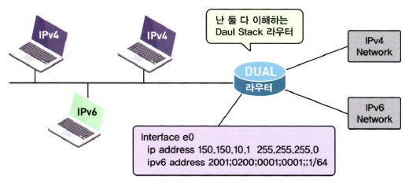

다음은 터널 방식입니다.

터널 방식은 이미 많이 사용되던 네트워킹 기술로, 기존 네트워크상에서 호환되지 않는 기능을 지원할 때 사용되었습니다. 즉 한쪽 IPv6망에서 다른 한쪽에 있는 IPv6망과 통신을 하고자 할 때 터널 기술을 사용하면, 중간에 있는 망이 IPv6를 지원하지 않더라도 통신이 가능하다는 장점이 있습니다.  
하지만 중간에 문제가 발생하면 그 문제를 해결하기 어려워 적정한 아키텍처가 아직 마련되지 않았을 때 사용하는 과도기적 기법입니다.

터널 방식에 대한 설명이 아래 그림에 나와 있습니다. 그림에서 보이는 대로 양쪽에 있는 IPv6 호스트가 중간에 있는 IPv4 구름을 뚫고 서로 통신하고 있습니다. 이것은 바로 IPv4 구름 양쪽에 있는 라우터가 앞에서 배운 듀얼스택 방식으로 동작하면서 IPv6 트래픽을 터널을 통해서 반대쪽 라우터까지 전달해주는 방식입니다.  
그렇게 하기 위해서는 일단 라우터가 IPv6 PC에게서 받은 정보를 IPv4 네트워크에 실어 보내기 전에 다시 IPv4가 이해하는 포장지로 다시 한 번 포장을 해줘야겠죠? 터널이 나올 때 항상 같이 나오는 인캡슐레이션과 비슷한 개념이라고 생각하시면 됩니다.

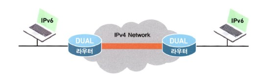

터널 기법은 통신을 시작할 때 터널을 어떻게 만들어주는가에 따라 '메뉴얼 방식', '반자동 방식', '자동 방식' 등으로 구분할 수 있습니다.

## 라우터에서 IPv6의 구성

그럼 실제 라우터에서 IPv6를 사용하려면 어떻게 해주는지 한번 알아볼까요?

일단 라우터에서 IPv6를 사용하기 위해서는 2가지만 기억하세요.

첫 번째, "내가 IPv6를 쓸 거에요."라고 말한다.

두 번째, 라우터의 인터페이스에 IPv6 주소를 배정한다.

쉽죠?

그럼 첫 번째, "내가 IPv6를 사용한다."는 어떻게 하는지 볼까요?

라우터의 일반 구성 모드에서 IPv6 트래픽에 대한 포워딩을 Enable해줍니다.

이 명령은 IPv6를 사용하기 위한 가장 기본적인 명령이랍니다.

이제 IPv6가 Enable되었다면 라우터의 각 인터페이스에 IPv6 주소를 부여할 때가 되었습니다. 그럼 인터페이스 구성 모드로 들어가야겠죠?

라우터의 인터페이스 구성 모드에서 IPv6 주소를 구성하기 위해 사용할 수 있는 명령은 여러 가지가 있습니다.

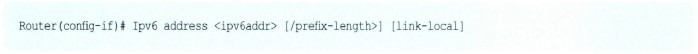

이 명령을 이용해서 IPv6 주소를 줄 경우에는 모든 IPv6 주소를 다 써줘야 합니다. 뒷부분에 나오겠지만 IPv6에서는 주소를 꼭 다 써주지 않아도 자동으로 만들어줄 수 있는데, 이 명령의 경우는 모든 주소를 다 써줘야 하는 경우에 사용합니다.  
뒤에 보이는 링크 로컬은 IPv6 주소의 한종류인데 여기선 그냥 넘어가도록 하겠습니다.

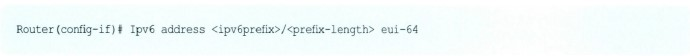

두 번째 방식은 앞에서 배운 주소 지정 방식과 약간 차이가 난답니다. 자세히 보시면 앞에서는 \<ipv6addr\>를 써주라고 했는데, 여기선 \<ipv6prefix\>를 쓰라고 나와 있죠? 앞부분에서 설명드렸는데요, 앞의 명령 \<ipv6addr\>은 IPv6 주소를 다 써줘야 하는 반면, \<ipv6prefix\> 방식은 IPv6 주소 중 앞쪽 Prefix 부분만을 넣어주는 방식이랍니다. IPv4로 생각하자만 네트워크 주소만을 넣어주는 방식이죠.

그럼 나머지 부분은 어떻게 만들까요? 그게 뒤에 나와 있는 eui-64라는 방식으로 만들어 준다는 겁니다. 그럼 eui-64는 또 뭘까요?

쉽게 말씀드리자면, eui-64가 이미 가지고 있는 MAC 주소를 가지고 IPv6의 뒷부분을 만든다는 것인데, 그냥 MAC 주소를 가져다 뒤에 붙이는 게 아니고 약간의 성형(?)을 통해서 원래 48비트짜리 주소를 64비트로짜리로 만들어준답니다.  
그래서 뒤에 64가 붙어 있잖아요. 성형 방식은 뒤에서 설명드릴게요.

세 번째 방식은 아예 인터페이스에 IPv6 주소를 부여하지 않는 방식이랍니다.

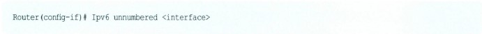

이와 같이 명령을 주고, 뒤에 \<interface\> 부분에 이미 IPv6 주소를 가지고 있는 다른 인터페이스 번호를 부여해주면 그 인터페이스의 IPv6 주소를 같이 사용하는 겁니다. 저도 안 써봐서 왜 이런 명령을 만들어 뒀는지 잘 모르겠는데요. 그냥 이런 게 있다고 알아두세요.

실제 구성을 했을 때 어떻게 되는지 잠깐 볼까요?

라우터의 구성 모드에 들어가서 먼저 Gigabit Ethernet 0/0에 IPv6 주소를 구성해주고, Gigabit Ethernet 0/1에는 unnumbered 명령을 이용해서 구성을 해보겠습니다.

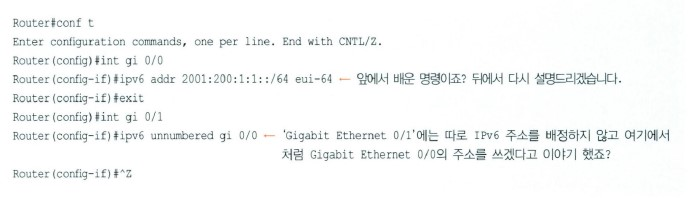

자, 이렇게 구성을 마치고 Gigabit Ethernet 0/1의 주소가 어떻게 사용되는지 한번 볼까요?

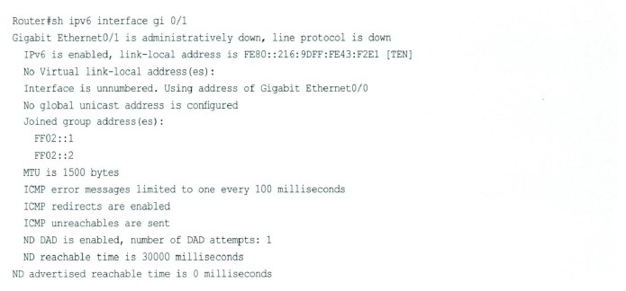

위에서 다섯째 줄을 보시면 이 인터페이스는 unnumbered로 사용되고 있고, Gigabit Ethernet 0/0의 주소를 사용하겠다... 라고 나와 있는거 보이시죠? 이 정도만 이해하시면 되겠네요.

인터페이스에 주소 명령으로 사용하는 마지막 명령으로 이런 것도 있답니다.

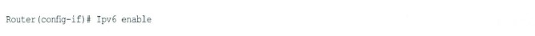

이 명령은 해당 인터페이스에 아예 IPv6 주소를 배정하지 않고, 그냥 IPv6 인터페이스로 쓰겠다는 의미입니다. 따라서 IPv6의 여러 가지 주소 중 오직 Link Local 주소만을 갖게 되고, 이 주소를 이용해서 링크에서 로컬로 통신만을 하게 된답니다.  
이야기를 하다 보니까 자꾸 복잡한 주소 이야기가 나오는데 너무 신경 쓰지 마시고, 그냥 여기선 주소를 배정하는 방식이 이렇게 4가지가 있구나... 정도만 이해하시면 된답니다.

자, 그럼 실습을 한번 해볼까요?

구성 방식은 우리가 배운 IPv6 주소 배정법 중에서 두 번째 방법을 사용해보겠습니다.

준비되셨죠?

맨 먼저 IPv6를 사용하기 위해 사용하는 명령이 뭐라고 했죠?

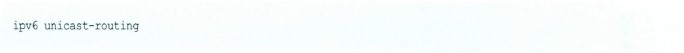

이란 명령이죠? 그리고

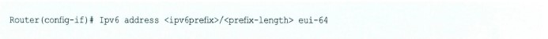

명령을 사용해서 실습해보겠습니다. 편의상 주소는 쉽게 줘보죠.

Prefix는 '2001:0200:0001:0001::'로 하고 prefix bit는 '64'로 하겠습니다. 즉 앞에서부터 64비트까지가 네트워크란 거죠. 참고로 위의 주소는 더 간편하게 줄여줄 수도 있다는 거 아시죠?

'2001:200:1:1::' 이렇게요.

자, 이제 실습 시작합니다.  
라우터의 구성 모드로 들어갑니다.

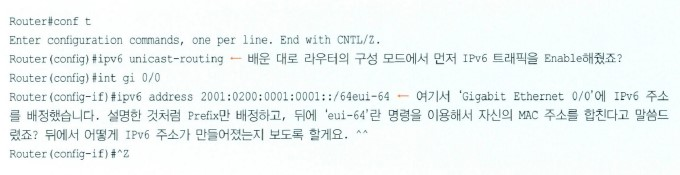

자, 구성이 끝났으니까 어떻게 구성이 되었는지 알아볼까요? 우리가 구성해주었던 'Gigabit Ethernet 0/0'의 IPv6 구성을 보기 위해 사용하는 명령이 'show ipv6 interface' 명령입니다.

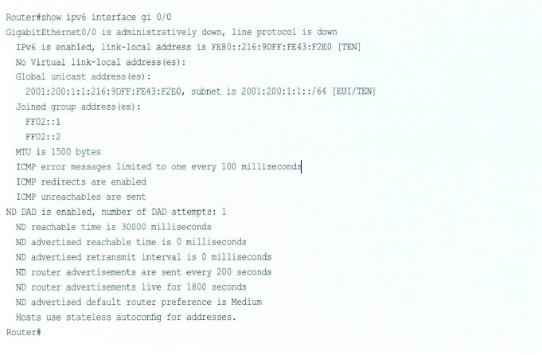

위에 보이는 것처럼 우리가 배정한 주소는 '2001:200:1:1:'까지인데, 뒤에 '216:9DFF:FE43:F2E0'라는 주소가 붙어서 전체 주소 '2001:200:1:1:216:9DFF:FE43:F2E0'가 만들어졌죠?  
'Eui-64'라는 명령을 통해 이 인터페이스의 MAC 주소가 64비트로 바뀌어 뒤에 붙는 거라고 했죠?  
사실 이 인터페이스의 MAC 주소는 원래 '0016.9D43.F2E0'였습니다. 근데 좀 바뀐게 보이시나요? 그게 바로 앞에서 설명한 약간의 성형(?)이랍니다. 'EUI-64'가 어떻게 48비트의 MAC 주소를 64비트로 바꾸는지 볼까요?

일단 가장 중요한 건 48비트의 MAC 주소 가운데에 'FF:FE'를 집어넣는다는 겁니다. 무조건!! 자, 볼까요?

원래 MAC 주소 '0016.9D43.F2E0'의 중앙을 벌려요.

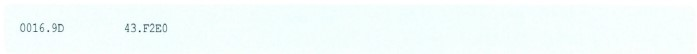

이런 식으로요.

그리고 'FF:FE'를 집어넣습니다.

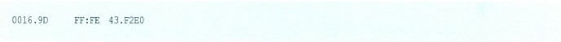

그럼 완성되었나 볼까요? '0016.9DFF:FE43:F2E0' 똑같나요? 아니죠? 앞이 다르죠? 'EUI-64'로 만들어진 주소는 '0216:9DFF:FE43:F2E0'이잖아요.

사실 맨 앞 8비트는 이 MAC 주소의 유일성을 나타내는데, 이 주소가 유일한 주소일 경우에는 '02'로 표시하고, 이 주소가 유일한 주소가 아닐 때는 '00'으로 표시하는 거랍니다. 따라서 이 주소는 유일한 MAC 주소이기 때문에 '02'를 넣어주는 거랍니다. 대부분 '00'을 넣는 경우는 드물고, 그냥 '02'로 들어간다고 생각하시면 됩니다.

정리해보면 원래 48비트의 MAC 주소의 중간을 벌려 'FF:FE'를 넣고, 맨 앞의 8비트를 이용해 유일한 MAC 주소임을 알리는 2를 넣게 된다... 라고 기억하시면 되겠네요.

아무튼 여기에서는 시스코 라우터에서 IPv6를 사용하기 위한 명령어가 어떤 것들이 있다... 까지만 이해하시면 됩니다.

그렇게 어렵진 않으셨죠?

지금까지 배운 IPv6를 통해 여러분이 조금이라도 IPv6와 친해지셨다면 성공입니다.

물론 IPv6에 대해 배울 게 많지만 이번엔 기초를 쌓는다 생각하면서 공부하시기 바랍니다.
